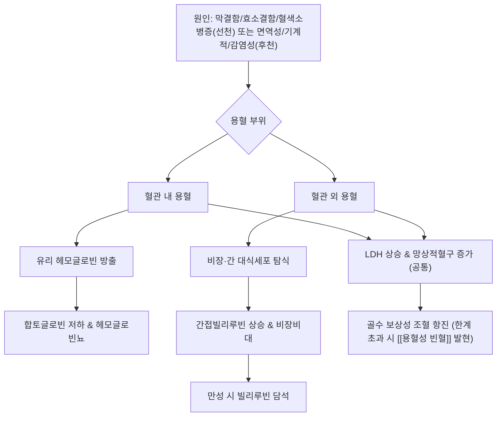

# 🩺 [[용혈성 빈혈]] (Hemolytic Anemia / 溶血性貧血, ICD-10 D55-D59)

> **핵심 3줄 요약 (Key Summary)**:
> - 📍 병소 부위 & 해부·병태생리: 정상 약 120일인 적혈구 수명이 골수의 보상적 생산능을 초과해 단축되는 상태로, 혈관 내 용혈(intravascular, 유리 헤모글로빈 방출·헤모글로빈뇨·합토글로빈 저하)과 혈관 외 용혈(extravascular, 비장·간 대식세포에 의한 파괴·간접빌리루빈 상승·비장비대)로 대별됨.
> - 🚩 전형적 임상 양상 & 3대 징후: 황달(공막·피부), 짙은 소변(혈관내 용혈 시), 비장비대. 만성 용혈 시 담석(빌리루빈 담석) 동반 가능.
> - 🛠️ 핵심 감별 검사 & 한·양방 다각적 치료 전략: 망상적혈구 증가·LDH 상승·간접빌리루빈 상승·합토글로빈 저하가 표준 용혈 지표이며, 직접 쿰스검사(DAT)로 면역성 vs 비면역성 원인을 감별. 원인 질환 치료가 우선이며 만성 용혈에는 엽산 보충이 필요.
> - ⚠️ 응급 의뢰 레드플래그 & 악화 요인: 파보바이러스 B19 감염 등에 의한 재생불량위기(aplastic crisis)로 급격한 Hb 저하 시 응급 수혈 필요. G6PD 결핍 환자에서 산화 스트레스 유발 약물(항말라리아제, 설폰아마이드계 등) 투여는 급성 용혈 위기를 유발할 수 있어 절대 금기.

---

## 📌 목차
1. [질환 개요 & 해부학적 병태생리](#1-질환-개요--해부학적-병태생리)
2. [병태생리 메커니즘 & 생체역학적 악순환 네트워크](#2-병태생리-메커니즘--생체역학적-악순환-네트워크)
3. [임상 증상 & 이학적 검사(Physical Exam) 알고리즘](#3-임상-증상--이학적-검사physical-exam-알고리즘)
4. [감별 진단 매트릭스 (Differential Diagnosis)](#4-감별-진단-매트릭스-differential-diagnosis)
5. [한의 통합 치료 프로토콜 (침·약침·추나·한약)](#5-한의-통합-치료-프로토콜-침약침추나한약)
6. [양방 치료 & 병용·의뢰 기준 (Conventional Treatment & Referral)](#6-양방-치료--병용의뢰-기준-conventional-treatment--referral)
7. [재활 운동 & 생활습관 티칭 가이드](#6-재활-운동--생활습관-티칭-가이드)
8. [💡 사용자 진료실 핵심 필기 & 임상 노하우 (Melt-In 잔여 심화 집약)](#7--사용자-진료실-핵심-필기--임상-노하우-melt-in-잔여-심화-집약)
9. [출처 및 학술 참고 문헌 (References)](#8-출처-및-학술-참고-문헌-references)

---

## 1. 질환 개요 & 해부학적 병태생리

![[용혈성빈혈_대식세포용혈_병태생리도해.png|450]]
> 출처: Wikimedia Commons, Boada et al. (CC BY 4.0)

> ⚠️ 내용 검토 필요: 이번 조사에서는 검증 가능한 병태생리 도해를 확보하지 못해 이미지는 수록하지 않았습니다.

* **질환 정의**: 정상 적혈구 수명(약 120일)이 여러 원인으로 단축되어 골수의 보상적 조혈 능력을 초과하는 파괴 속도로 적혈구가 소실되는 상태(Baldwin et al., StatPearls; Phillips & Henderson, 2018). [[빈혈]] 감별 매트릭스상 정구성(normocytic)·망상적혈구 증가가 특징으로, 본 볼트의 일반 [[빈혈]] 노트 4장 표에서도 별도 항목으로 감별되어 있음.
* **용혈 부위에 따른 2대 분류**:
  * **혈관 내 용혈(Intravascular hemolysis)**: 혈관 내에서 적혈구가 직접 파괴되어 유리 헤모글로빈이 혈장으로 방출 → 합토글로빈 저하, 헤모글로빈뇨(짙은 소변) 유발.
  * **혈관 외 용혈(Extravascular hemolysis)**: 비장·간의 대식세포가 적혈구를 탐식·분해 → 간접(비포합) 빌리루빈 상승, 비장비대(splenomegaly) 유발(Phillips & Henderson, 2018).
* **관련 해부학적 구조물**: 골수(조혈 보상), 비장(적혈구 파괴·대식세포), 간(빌리루빈 대사), 담낭(만성 용혈 시 빌리루빈 담석 호발).

---

## 2. 병태생리 메커니즘 & 생체역학적 악순환 네트워크

![[용혈성빈혈_적혈구구조_해부도해.jpg|450]]
> 출처: OpenStax, Wikimedia Commons (CC BY 3.0)

### 1) 선천성(intrinsic) 원인
* **막 결함**: 유전성 구상적혈구증(Hereditary Spherocytosis) — 앤키린·스펙트린·band 3 등 막단백 결함으로 적혈구가 구형화되어 비장에서 조기 파괴됨(Perrotta et al., 2008).
* **효소 결함**: G6PD 결핍 — X-연관 유전, 산화 스트레스(감염·잠두콩·특정 약물)에 의해 삽화적·급성 용혈을 유발(Cappellini & Fiorelli, 2008).
* **혈색소병증**: 겸상적혈구병, 지중해빈혈 등.

### 2) 후천성(extrinsic/acquired) 원인
* **면역매개성**: [[자가면역성 용혈성 빈혈]](AIHA) — 온난항체형(IgG, 주로 혈관외 용혈, DAT 양성)과 한랭응집소병(IgM, 보체매개, 주로 혈관내 용혈)으로 대별되며, 원발성 외에 약물유발성·림프증식성질환/감염 동반 이차성 형태도 있음(Berentsen & Barcellini, 2021). ⚠️ AIHA 자체의 세부 병태생리·치료는 본 볼트에 별도 노트([[자가면역성 용혈성 빈혈]])로 예정되어 있어 본 노트에서는 개요 수준으로만 다룸.
* **미세혈관병성 용혈(MAHA)**: 혈전성 혈소판감소성 자반증(TTP, ADAMTS13 결핍), 용혈성요독증후군(HUS), 파종성혈관내응고(DIC) 등 — 적혈구가 미세혈관 내 섬유소 그물에 걸려 기계적으로 파쇄됨(George & Nester, 2014).
* **기계적 용혈**: 인공심장판막에 의한 전단응력 파괴.
* **발작성 야간 혈색소뇨증(PNH)**: PIGA 유전자 돌연변이로 GPI-고정 보체조절단백(CD55/CD59)이 소실되어 보체매개 혈관내 용혈이 발생하는 후천성 클론성 줄기세포질환(Brodsky, 2014).

---

## 3. 임상 증상 & 이학적 검사(Physical Exam) 알고리즘

### 1) 주소증 및 신경학적 증상
* **전신 증상**: 만성 피로, 무기력, 어지럼증 등 빈혈 공통 증상([[빈혈]] 노트 참조).
* **황달**: 공막·피부의 황색조 — 간접빌리루빈 상승 반영.
* **소변색 변화**: 혈관내 용혈 시 짙은(콜라색) 소변.
* **비장비대**: 만성 혈관외 용혈에서 촉진 가능.

### 2) 필수 이학적 검사법 (Physical Examination)
* **공막·피부 황달 관찰**: 간접빌리루빈 상승의 육안 소견.
* **비장 촉진**: 좌상복부 비장비대 여부 확인.
* **표준 용혈 검사실 지표** (Phillips & Henderson, 2018; StatPearls):
  * 망상적혈구 수 증가(골수 보상 반응).
  * LDH 상승.
  * 간접(비포합)빌리루빈 상승.
  * 합토글로빈 저하.
  * 말초혈액도말: 파쇄적혈구(schistocyte, MAHA 시사) vs 구상적혈구(spherocyte, AIHA·유전성구상적혈구증 시사).
  * 직접 쿰스검사(Direct Antiglobulin Test, DAT): 면역성(양성) vs 비면역성(음성) 감별의 핵심.

---

## 4. 감별 진단 매트릭스 (Differential Diagnosis)

| 감별 원인 | 호발 병소 및 원인 | 주소증 차이점 | 특이적 검사 소견 |
| :--- | :--- | :--- | :--- |
| [[용혈성 빈혈]] (본 질환, 총칭) | 적혈구 파괴 항진(혈관내/혈관외) | 황달·짙은소변·비장비대 | 망상적혈구↑·LDH↑·간접빌리루빈↑·합토글로빈↓ |
| [[자가면역성 용혈성 빈혈]] (AIHA) | 자가항체에 의한 적혈구 파괴 | 온난형은 비장비대 위주, 한랭형은 말단 청색증 동반 가능 | 직접 쿰스검사(DAT) 양성 |
| G6PD 결핍증 | 산화스트레스 유발 약물/잠두콩 섭취 후 삽화적 용혈 | 급성 발작성 경과, 평소는 무증상 | G6PD 효소 활성 저하(급성기 이후 측정 권장) |
| 유전성 구상적혈구증 | 적혈구 막단백 결함 | 소아기부터 만성 경과, 가족력 | 말초혈액도말 구상적혈구, 삼투취약성 증가 |
| 미세혈관병성 용혈(TTP/HUS) | 미세혈관 내 섬유소 그물에 의한 기계적 파쇄 | 발열·신경증상·신부전 등 전신 중증 동반 가능(응급) | 말초혈액도말 파쇄적혈구, 혈소판감소 |
| [[철결핍성 빈혈]] (참고 감별) | 철분 결핍 | 용혈 소견(황달·비장비대) 없음 | 페리틴↓·TIBC↑, 쿰스검사 무관 |

---

## 5. 한의 통합 치료 프로토콜 (침·약침·추나·한약)

![[용혈성빈혈_농축적혈구수혈_치료도해.png|450]]
> 출처: Blausen Medical, Wikimedia Commons (CC BY 3.0)

* **⚠️ 정직한 근거 표시**: 용혈 자체(적혈구막 안정화, LDH·합토글로빈 등 용혈지표 직접 개선)에 대한 한의학적 중재의 기전적·임상적 1차 연구는 이번 조사에서 확인하지 못했습니다.
* **참고할 수 있는 관련 연구**: 대만 건강보험 데이터베이스 기반 후향 코호트 연구(선천성 용혈성빈혈 — 지중해빈혈·G6PD결핍 등 — 환자 9,222쌍)에서 한약 복용군이 비복용군보다 전체사망률(보정HR 0.67)·당뇨관련사망률(0.57)·심혈관관련사망률(0.59)이 낮았음을 보고했습니다(Chiu et al., 2022). **다만 이는 용혈 자체에 대한 직접적 치료 효과를 보인 것이 아니라, 한약을 복용한 환자군의 전체 동반질환 사망률이 낮았다는 관찰연구 수준의 연관성**이며, 건강보험 데이터 기반 후향 연구 특유의 적응증에 의한 교란(confounding by indication) 가능성이 있어 인과관계로 해석할 수 없습니다.
* **변증 관점의 일반 원칙(⚠️ 용혈성 빈혈 특이적 근거 아님, 한의학 일반론)**:
  * 황달·비장비대를 동반하는 만성 경과는 간담습열(肝膽濕熱) 또는 기혈양허(氣血兩虛) 변증 관점에서 접근할 수 있으나, 이는 본 볼트의 [[황달]]·[[빈혈]] 노트의 일반 변증 원칙을 참고한 것이며 용혈성 빈혈에 특화된 임상연구는 아님을 명시합니다.
* **침구·약침·추나**: 용혈성 빈혈 자체를 대상으로 한 침구·약침·추나 임상연구는 확인하지 못했습니다(⚠️ 확인 불가). 원인 질환(자가면역질환 등)에 대한 일반적 면역조절 관점의 접근은 각 원인질환 노트를 참고하시기 바랍니다.

---

## 6. 양방 치료 & 병용·의뢰 기준 (Conventional Treatment & Referral)

> 🎯 **이 섹션의 목적**: 환자가 **양방약을 이미 복용 중인 경우가 많다.** 한의원 1차 진료에서 양방 치료를 이해하고, 병용 가능·주의·금기를 판단하며, 언제 의뢰할지 결정한다.

* **약물 치료 (Medication)**:
  * 계열별 약물·용량·기간 — 국내 처방 관행 반영.
  * 작용 기전과 한의 치료와의 상호작용.
* **비약물 시술 (Procedures)**:
  * 주사·차단술·물리치료·보조기 등.
* **수술·시술 적응증 (Surgical Indication)**:
  * 언제 수술로 가는가 — 절대·상대 적응증, 수술 후 경과.
* **한의 병용 판단 (Combination Therapy)**:
  * 병용 가능 / 주의 / 금기. 복용 중 환자의 감량 타이밍·반동 현상.
* **양방·전문과 의뢰 기준 (Referral Criteria)**:
  * 응급 의뢰 트리거와 전문과 의뢰 기준(정형외과·신경외과·내과 등).

	(작성 필요)

---

## 7. 재활 운동 & 생활습관 티칭 가이드

* **원인 질환별 회피 수칙**:
  * G6PD 결핍 확인 환자: 산화스트레스 유발 약물(일부 항말라리아제, 설폰아마이드계 항생제, 다프손 등) 및 잠두콩(fava bean) 섭취 회피(Cappellini & Fiorelli, 2008).
  * 만성 용혈 환자: 엽산 소모가 증가하므로 엽산 보충이 표준 관리에 포함됨(⚠️ 이번 조사에서 이를 단독으로 다룬 1차 연구는 확인하지 못했으며, 일반 혈액학 교과서 수준의 통설로 기재).
* **감염 예방**: 파보바이러스 B19 등 감염 시 재생불량위기(aplastic crisis) 위험이 있는 만성 용혈 환자는 감염 예방·조기 의뢰 교육이 필요.
* **정기 모니터링**: 만성 용혈 환자는 담석(빌리루빈 담석) 발생 가능성에 대한 정기적 확인이 권장됨(Perrotta et al., 2008).

---

## 8. 💡 사용자 진료실 핵심 필기 & 임상 노하우 (Melt-In 잔여 심화 집약)

> [!IMPORTANT]
> ⚠️ 내용 검토 필요: 아직 원장님의 진료실 임상 필기가 반영되지 않았습니다. 용혈성 빈혈 관련 진료 경험(원인 질환 감별, 황달 환자 문진 팁 등)이 있으시면 이 섹션에 추가해 주세요.

* **실전 문진 체크리스트 (제안)**:
  * 황달·짙은소변·피로가 동반되면 단순 [[철결핍성 빈혈]]이 아닌 용혈 가능성을 열어두고 혈액검사(망상적혈구·LDH·빌리루빈·합토글로빈) 의뢰를 고려.
  * 가족력(유전성 구상적혈구증·G6PD결핍 등 선천성 원인 스크리닝), 최근 감염·신약 복용력(약물유발성 AIHA), 자가면역질환 동반 여부 확인.
* **치료 순서 및 손맛 노하우**: ⚠️ 원장님 임상 경험 반영 대기.
* **환자 티칭 스크립트**: ⚠️ 원장님 임상 경험 반영 대기.

---

## 9. 출처 및 학술 참고 문헌 (References)

1. **Baldwin C, Pandey J, Olarewaju O.** *Hemolytic Anemia*. **StatPearls [Internet]**. StatPearls Publishing; 2023 (last updated). NCBI Bookshelf ID: NBK558904. https://www.ncbi.nlm.nih.gov/books/NBK558904/
   - **[연구 요약]**: 용혈성 빈혈의 정의(적혈구 수명 단축이 골수 보상능 초과)와 선천성(막·효소·혈색소병증)/후천성(면역·기계적·감염성) 분류 체계, 혈관내/혈관외 용혈 구분을 정리한 개방접근 종설.
2. **Phillips J, Henderson AC. (2018)**. *Hemolytic Anemia: Evaluation and Differential Diagnosis*. **American Family Physician**, 98(6), 354-361. PMID: [30215915](https://pubmed.ncbi.nlm.nih.gov/30215915/)
   - **[연구 요약]**: 혈관내(합토글로빈↓·헤모글로빈뇨) vs 혈관외(간접빌리루빈↑·비장비대) 용혈의 표준 감별 프레임워크와 진단 알고리즘을 제시한 AAFP 임상 리뷰.
3. **Cappellini MD, Fiorelli G. (2008)**. *Glucose-6-phosphate dehydrogenase deficiency*. **Lancet**, 371(9606), 64-74. PMID: [18177777](https://pubmed.ncbi.nlm.nih.gov/18177777/) / doi:10.1016/S0140-6736(08)60073-2
   - **[연구 요약]**: G6PD 결핍의 X-연관 유전, 산화스트레스(감염·잠두콩·특정 약물) 유발 삽화적 용혈의 병태생리와 임상아형을 정리한 Lancet 세미나.
4. **Perrotta S, Gallagher PG, Mohandas N. (2008)**. *Hereditary spherocytosis*. **Lancet**, 372(9647), 1411-1426. PMID: [18940465](https://pubmed.ncbi.nlm.nih.gov/18940465/) / doi:10.1016/S0140-6736(08)61588-3
   - **[연구 요약]**: 막단백(ankyrin·spectrin·band 3) 결함에 의한 유전성 구상적혈구증의 병태생리, 삼투취약성 검사, 만성 용혈에 따른 빌리루빈 담석·비장비대, 비장절제술의 역할을 정리.
5. **Berentsen S, Barcellini W. (2021)**. *Autoimmune Hemolytic Anemias*. **New England Journal of Medicine**, 385(15), 1407-1419. PMID: [34614331](https://pubmed.ncbi.nlm.nih.gov/34614331/) / doi:10.1056/NEJMra2033982
   - **[연구 요약]**: 온난항체형(IgG, 혈관외 용혈)과 한랭응집소병(IgM, 보체매개)의 구분, 원발성/이차성(약물유발·림프증식성질환·감염 동반) 분류, 스테로이드·리툭시맙 등 현대 치료전략을 정리한 NEJM 리뷰.
6. **George JN, Nester CM. (2014)**. *Syndromes of thrombotic microangiopathy*. **New England Journal of Medicine**, 371(7), 654-666. PMID: [25119611](https://pubmed.ncbi.nlm.nih.gov/25119611/) / doi:10.1056/NEJMra1312353
   - **[연구 요약]**: TTP(ADAMTS13 결핍)·HUS 등 미세혈관병성 용혈(MAHA) 증후군군의 기계적 적혈구 파쇄 기전과 감별을 정리한 NEJM 리뷰.
7. **Brodsky RA. (2014)**. *Paroxysmal nocturnal hemoglobinuria*. **Blood**, 124(18), 2804-2811. PMID: [25237200](https://pubmed.ncbi.nlm.nih.gov/25237200/) / doi:10.1182/blood-2014-02-522128
   - **[연구 요약]**: PIGA 돌연변이로 인한 GPI-고정 보체조절단백(CD55/CD59) 소실이 보체매개 혈관내 용혈을 일으키는 PNH의 병태생리, 유세포분석 진단, 에쿨리주맙 등 보체억제 치료를 정리.
8. **Kim Y, Park J, Kim M. (2017)**. *Diagnostic approaches for inherited hemolytic anemia in the genetic era*. **Blood Research**, 52(2), 84-94. PMID: [28698843](https://pubmed.ncbi.nlm.nih.gov/28698843/) / doi:10.5045/br.2017.52.2.84
   - **[연구 요약]**: 대한혈액학회 공식지에 게재된 한국 저자 리뷰로, 막결함·효소결함·혈색소병증 등 유전성 용혈성 빈혈에 대한 차세대염기서열(NGS) 기반 진단 접근을 정리.
9. **Chiu ML, Chiou JS, Chen CJ, et al. (2022)**. *Effect of Chinese Herbal Medicine Therapy on Risks of Overall, Diabetes-Related, and Cardiovascular Diseases-Related Mortalities in Taiwanese Patients With Hereditary Hemolytic Anemias*. **Frontiers in Pharmacology**, 13, 891729. PMID: [35712707](https://pubmed.ncbi.nlm.nih.gov/35712707/) / doi:10.3389/fphar.2022.891729
   - **[연구 요약]**: 대만 건강보험 데이터베이스 기반 9,222쌍 후향 코호트. 한약 복용군의 전체사망률(보정HR 0.67)·당뇨/심혈관 관련 사망률 감소와의 연관성을 보고했으나, 용혈 자체에 대한 직접 효과를 입증한 것은 아니며 적응증에 의한 교란 가능성이 있는 관찰연구.

> ⚠️ 확인 불가/추정 표시 총괄: 엽산 보충의 단독 1차 연구, 파보바이러스 B19 재생불량위기의 전용 1차 문헌, 용혈성 빈혈 특이적 침·약침·추나·한약 임상연구는 검색 범위 내에서 확인하지 못해 각 섹션에 개별 표시했습니다. 위 PMID·DOI는 모두 실제 확인된 값입니다.

<!-- 보관 태그(1회용·링크오류, 필요시 복원): 용혈 -->
