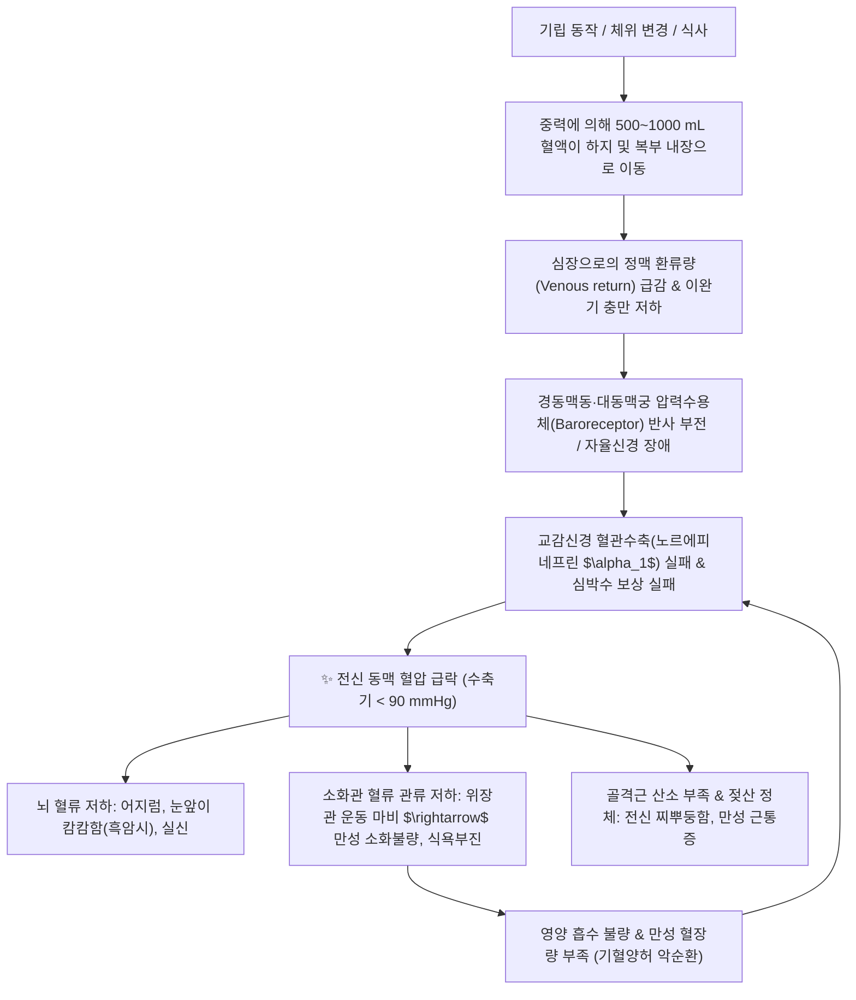

# 🩺 [[저혈압]] (Hypotension / 低血壓, I95)

> **핵심 3줄 요약 (Key Summary)**:
> - 📍 병소 부위 & 해부·병태생리: 흉곽 내 대정맥 및 전신 저항 혈관; 압력수용체 반사(Baroreceptor reflex) 기능 부전, 유효 순환 혈장량 감소 또는 자율신경계 교감혈관수축 기능 상실로 수축기 < 90 mmHg / 이완기 < 60 mmHg.
> - 🚩 전형적 임상 양상 & 3대 징후: 기립 시 눈앞이 캄캄해지는 흑암시(Blackout)·아찔한 현훈(眩暈)·실신, 전신 장기 관류 저하에 의한 만성 소화불량(식후 더부룩함) 및 골격근 허혈성 근통(찌뿌둥한 전신 근육통).
> - 🛠️ 핵심 감별 검사 & 한·양방 다각적 치료 전략: 능동적 기립 혈압 검사(Schellong test; 기립 3분 내 SBP $\ge 20$ 또는 DBP $\ge 10\text{ mmHg}$ 강하)·기립경사검사(Tilt Table Test), 양방 미도드린·플루드로코르티손 및 한의 침구(백회, 족삼리, 관원), 보중익기탕·생맥산 치법.
> - ⚠️ 응급 의뢰 레드플래그 & 악화 요인: 실신 중 경련이나 외상성 두부 손상, 급격한 흉통·호흡곤란·흑색변 동반([[패혈증]] 쇼크, 대량 위장관 출혈 의심) 시 즉시 119 구급 이송, 장기 부동·뜨거운 사우나·과식 및 급격한 기립 동작 금기.

---

## 📌 목차
1. [질환 개요 & 해부학적 병태생리](#1-질환-개요--해부학적-병태생리)
2. [병태생리 메커니즘 & 생체역학적 악순환 네트워크](#2-병태생리-메커니즘--생체역학적-악순환-네트워크)
3. [임상 증상 & 이학적 검사(Physical Exam) 알고리즘](#3-임상-증상--이학적-검사physical-exam-알고리즘)
4. [감별 진단 매트릭스 (Differential Diagnosis)](#4-감별-진단-매트릭스-differential-diagnosis)
5. [한의 통합 치료 프로토콜 (침·약침·추나·한약)](#5-한의-통합-치료-프로토콜-침약침추나한약)
6. [양방 치료 & 병용·의뢰 기준 (Conventional Treatment & Referral)](#6-양방-치료--병용의뢰-기준-conventional-treatment--referral)
7. [재활 운동 & 생활습관 티칭 가이드](#6-재활-운동--생활습관-티칭-가이드)
8. [💡 사용자 진료실 핵심 필기 & 임상 노하우 (Melt-In 잔여 심화 집약)](#7--사용자-진료실-핵심-필기--임상-노하우-melt-in-잔여-심화-집약)
9. [출처 및 학술 참고 문헌 (References)](#8-출처-및-학술-참고-문헌-references)

---

## 1. 질환 개요 & 해부학적 병태생리

![[자율신경계-20240820010422044.png|450]]
> [그림 1: ① 뇌간(연수) 및 척수에서 심장, 혈관 평활근, 부신 수질로 뻗어나가는 교감신경 vs 부교감신경 자율신경계 해부 주행도]

* **질환 정의 및 수치 기준**:
  * 동맥 혈압이 통상적인 생리적 기준치보다 현저히 낮아 주요 장기(뇌, 심장, 신장, 위장관, 골격근)로의 산소 및 혈류 관류가 부족해지는 상태.
  * 통상적으로 **수축기 혈압 90 mmHg 미만 또는 이완기 혈압 60 mmHg 미만**으로 정의됨.
* **임상적 3대 분류**:
  1. **기립성 저혈압 (Orthostatic / Postural Hypotension)**:
     * 누워있거나 앉아있다가 일어설 때 중력에 의해 하지로 몰린 혈액을 보상하지 못하여 **기립 후 3분 이내 수축기 혈압 20 mmHg 이상 또는 이완기 혈압 10 mmHg 이상 급락**하는 상태.
  2. **식후 저혈압 (Postprandial Hypotension)**:
     * 식사 후 소화 흡수를 위해 내장 혈관상(Splanchnic bed)으로 혈액이 대량 이동한 후 전신 혈관 수축 보상이 작동하지 않아 식후 1~2시간 내 혈압이 20 mmHg 이상 저하되는 상태 (노인 호발).
  3. **신경매개성 저혈압 / 미주신경성 실신 (Vasovagal Syncope)**:
     * 장시간 기립, 극심한 통증, 공포, 탈수 등의 자극에 의해 교감신경이 갑자기 억제되고 부교감신경(미주신경)이 과항진되어 서맥과 혈관 확장이 동시에 발생하며 뇌 혈류가 차단되는 상태.

---

## 2. 병태생리 메커니즘 & 생체역학적 악순환 네트워크

![[자율신경계과 체액의 관계-20240820075132423.png|400]]
> [그림 2: ② 교감신경 말단 노르아드레날린 분비 및 혈관평활근 $\alpha_1$ 수용체 결합을 통한 세포 내 $Ca^{2+}$ 방출 및 혈관 수축 반사 경로 도해]

### 1) 혈류 순환 저하에 따른 소화불량 & 전신 근통 기전 (사용자 핵심 병태)
* **내장 허혈성 소화불량 (Ischemic Dyspepsia)**:
  * 저혈압 환자는 심박출량 감소에 대응하여 뇌와 심장 등 생명 유지 기관으로 혈류를 우선 배분하기 위해 위장관 혈관을 지속적으로 수축시킴.
  * 이로 인해 위장 점막의 혈류 관류가 만성적으로 결손되어 위산 분비, 소화 효소 분비 및 위장관 평활근 연동 운동이 급격히 저하됨 $\rightarrow$ **식후 더부룩함, 조기 포만감, 가스 참, 만성 소화불량**이 발생함.
* **골격근 관류 저하와 젖산 축적에 의한 근통 (Muscular Dull Pain)**:
  * 전신 혈압 저하로 사지 골격근 모세혈관망으로 충분한 산소와 포도당이 전달되지 못함.
  * 근육세포가 혐기성 해당 과정에 의존하게 되며 젖산(Lactate) 등 피로 대사산물이 신속히 씻겨나가지 못하고 체류함 $\rightarrow$ **자고 일어나도 몸이 솜이불에 젖은 듯 무겁고, 온몸이 쑤시고 찌뿌둥한 만성 근육통**이 지속됨.

---

## 3. 임상 증상 & 이학적 검사(Physical Exam) 알고리즘

![[Tilt_table_Swanson.jpg|420]]
> [그림 3: ③ 기립성 저혈압 및 신경매개성 실신 진단을 위한 기립경사도 검사(Head-Up Tilt Table Test) 시행 실사]

### 1) 주요 임상 증상
* **뇌 혈류 저하 증상**:
  * 기립 시 눈앞이 흐려지거나 캄캄해짐(Grey-out / Black-out), 붕 떠있는 듯한 현훈(眩暈), 멍함(Brain fog), 목덜미와 어깨가 뻐근한 옷걸이 두통(Coat-hanger headache).
* **전신 순환계 증상**:
  * 만성 피로, 무기력, 수족 냉증, 안면 창백, 가슴 두근거림(보상성 빈맥).
* **위장관 및 근골격계 증상**:
  * 소화불량, 잦은 체기, 식후 졸림증, 전신 근육의 뻐근한 근통(찌뿌둥함).

### 2) 필수 이학적 검사 (Physical Examination)
* **능동적 기립 혈압 검사 (Schellong Test)**:
  1. 환자를 5~10분간 앙와위(누운 상태)로 안정시킨 후 혈압 및 맥박 측정.
  2. 환자를 일어서게 한 후 1분, 3분 시점에 혈압과 맥박을 각각 재측정.
  3. **양성 판정 기준**: 기립 3분 이내 **수축기 혈압 $\ge$ 20 mmHg 하강** 또는 **이완기 혈압 $\ge$ 10 mmHg 하강**.
* **기립경사도 검사 (Head-Up Tilt Table Test, HUTT)**:
  * 특수 전동 침대에 누워 60~70도 각도로 상체를 세운 상태에서 30~45분간 혈압, 심전도, 뇌혈류 속도를 연속 기록하여 기립성 저혈압, 체위성 빈맥증후군(POTS), 미주신경성 실신을 정밀 감별.
* **약물 복용력 스크리닝**:
  * 혈압약(알파차단제, 이뇨제, CCB), 전립선비대증약(탐스로신), 항우울제(TCA), 파킨슨병 약물의 과다 복용 여부 확인.

---

## 4. 감별 진단 매트릭스 (Differential Diagnosis)

| 감별 질환 | 기립 시 혈압 변화 | 기립 시 심박수 변화 | 실신 전구 증상 | 핵심 감별 진단 지표 |
| :--- | :--- | :--- | :--- | :--- |
| [[저혈압]] (기립성) | SBP $\ge 20$ 또는 DBP $\ge 10\text{ mmHg} \downarrow$ | 미미한 증가 또는 변화 없음 | 흑암시, 어지럼증, 목덜미 통증 | 능동 기립 검사상 혈압 급락 양성 |
| 체위성 빈맥증후군 ([[POTS]]) | 혈압 변동 없음 (정상 유지) | **심박수 30회/분 이상 급증** | 가슴 두근거림, 불안, 진전 | 젊은 여성 호발, 혈압 저하 없는 현저한 빈맥 |
| 미주신경성 실신 (Vasovagal) | 발작 시 혈압 급락 | **심박수 급격한 서맥(Bradycardia)** | 오심, 식은땀, 하품, 창백 | 심인성 자극(통증, 피, 주사), 발작 후 빠른 회복 |
| 저혈당증 (Hypoglycemia) | 혈압 정상 또는 경미한 변동 | 보상성 빈맥 | 식은땀, 공복감, 손떨림, 불안 | 모세혈관 혈당 < 70 mg/dL, 당분 섭취 시 즉시 호전 |
| 애디슨병 (부신부전) | 만성 저혈압 지속 | 기립 시 저혈압 심화 | 색소침착, 만성 피로, 체중감소 | 혈청 코르티솔 $\downarrow$, ACTH $\uparrow$, 저나트륨/고칼륨혈증 |

---

## 5. 한의 통합 치료 프로토콜 (침·약침·추나·한약)

* **침구 치료 (Acupuncture)**:
  * **주요 혈위**: 백회(GV20), 인당(EX-HN3), 족삼리(ST36), 관원(CV4), 기해(CV6), 비수(BL20), 신수(BL23), 합곡(LI4).
  * **자침 기전**: 백회혈 자침 및 뜸(Moxa) 치료는 중추 뇌혈류 관류압을 상승시키고 양기(陽氣)를 끌어올림. 족삼리·관원혈은 비위의 기혈 생성을 촉진하여 말초 혈관 긴장도를 정상화.
* **약침 치료 (Pharmacopuncture)**:
  * **자하거 약침 / 황기 약침**: 비수, 신수, 관원, 족삼리 혈위에 0.2~0.5cc 시술하여 원기(元氣)를 돋우고 자율신경계 교감혈관 반응성을 회복.
* **경추 및 흉추 추나 치료 (Chuna Manipulation)**:
  * **상부 경추(C1-C2) 및 상부 흉추(T1-T4) 교정**: 척추 주위 교감신경간(Sympathetic trunk)의 자극을 정상화하고 후두하근 이완을 통해 추골뇌저동맥 순환 개선.
* **한약 변증 치료 (Herbal Medicine)**:
  * **중기하함·기혈양허 (中氣下陷·氣血兩虛)**:
    * 일어서면 핑 도는 현훈, 만성 소화불량, 식후 춘곤증, 전신 근육통, 사지 무력, 설담태백, 맥미약.
    * *대표 처방*: [[보중익기탕]](補中益氣湯) (황기, 인삼, 백출, 당귀, 승마, 시호 배오로 승양거함·익기승청).
  * **기음양허 (氣陰兩虛)**:
    * 무더위나 사우나 후 탈수로 인한 어지럼증, 가슴 두근거림, 구건, 식은땀.
    * *대표 처방*: [[생맥산]](生脈散) (인삼, 맥문동, 오미자로 심박출량과 혈장량 보충).
  * **심비양허 (心脾兩虛)**:
    * 건망, 불면, 식욕부진, 어지럼증.
    * *대표 처방*: [[귀비탕]](歸脾湯).

---

## 6. 양방 치료 & 병용·의뢰 기준 (Conventional Treatment & Referral)

> 🎯 **이 섹션의 목적**: 환자가 **양방약을 이미 복용 중인 경우가 많다.** 한의원 1차 진료에서 양방 치료를 이해하고, 병용 가능·주의·금기를 판단하며, 언제 의뢰할지 결정한다.

* **약물 치료 (Medication)**:
  * 계열별 약물·용량·기간 — 국내 처방 관행 반영.
  * 작용 기전과 한의 치료와의 상호작용.
* **비약물 시술 (Procedures)**:
  * 주사·차단술·물리치료·보조기 등.
* **수술·시술 적응증 (Surgical Indication)**:
  * 언제 수술로 가는가 — 절대·상대 적응증, 수술 후 경과.
* **한의 병용 판단 (Combination Therapy)**:
  * 병용 가능 / 주의 / 금기. 복용 중 환자의 감량 타이밍·반동 현상.
* **양방·전문과 의뢰 기준 (Referral Criteria)**:
  * 응급 의뢰 트리거와 전문과 의뢰 기준(정형외과·신경외과·내과 등).

	(작성 필요)

---

## 7. 재활 운동 & 생활습관 티칭 가이드

* **기립 시 물리적 보상 기동법 (Physical Counter-pressure Maneuvers)**:
  * **단계적 기립**: 침대에서 일어날 때 '누운 자세 $\rightarrow$ 걸터앉아 1분 $\rightarrow$ 천천히 기립'의 3단계 프로토콜 준수.
  * **하지 근육 펌핑**: 기립 전 발목을 위아래로 10회 까딱거리거나, 서 있을 때 종아리에 힘을 주며 까치발을 들거나 다리를 꼬는 동작(Leg-crossing)을 통해 하지 정맥혈을 심장으로 펌핑.
* **수분 및 염분 섭취 가이드**:
  * **기상 직후 온수 500mL 음용**: 기상 직후 5분 이내 물 400~500mL를 마시면 위장관 팽창 반사로 교감신경이 자극되어 혈압이 15~20 mmHg 상승함.
  * 고혈압과 달리 심부전이나 신장 질환이 없는 저혈압 환자는 하루 소금 섭취를 1~2티스푼 추가 권장.
* **의료용 압박 스타킹 착용**:
  * 무릎 위 또는 서혜부까지 오는 20~30 mmHg 압력의 압박스타킹을 착용하여 하지 정맥 울혈을 방지.

---

## 8. 💡 사용자 진료실 핵심 필기 & 임상 노하우 (Melt-In 잔여 심화 집약)

### 1) "소화 안 되고 몸이 천근만근 쑤신다"는 저혈압 환자 문진 공식
* **오진 방지 감별 포인트**:
  * 환자는 혈압이 낮다고 스스로 인지하지 못하고, 단순 "만성 소화불량"이나 "섬유근육통", "산후풍", "담결림"으로 한의원을 찾는 경우가 매우 흔함.
  * 환자가 **"밥만 먹으면 명치가 꽉 막힌 듯 답답하고, 잠을 자도 온몸이 두들겨 맞은 것처럼 찌뿌둥하게 아프다"**고 호소할 때, 반드시 혈압을 먼저 재어 수축기 혈압이 90~100 mmHg 이하인지 확인해야 함.
* **환자 설명 멘트 노하우**:
  * *"환자분, 지금 소화가 안 되고 몸이 쑤시는 근본 이유는 위장이나 근육 자체가 병든 것이 아니라, 보일러 펌프(심장) 압력이 약해서 위장과 근육으로 피(산소)를 충분히 뿜어주지 못하기 때문입니다. 기운을 끌어올리고 혈류 순환을 돕는 치료를 하면 소화기와 근육통이 함께 씻은 듯 풀립니다."*

### 2) 보중익기탕 승양거함(升陽擧陷) 응용 노하우
* **승마·시호의 용량 조절**:
  * 저혈압으로 인한 소화불량 및 하지 무력감에는 보중익기탕에서 기운을 상초로 끌어올리는 승마(升麻)와 시호(柴胡)를 정량(각 2~3g) 사용하여 비위의 맑은 기운을 뇌로 올려주어야 함.
* **생맥산 차(Tea) 복용 지도**:
  * 평소 혈압이 낮은 환자에게 여름철이나 활동량이 많을 때 인삼, 맥문동, 오미자를 연하게 끓인 생맥산수를 물 대신 수시로 마시도록 지도하면 혈장량 증가와 어지럼증 예방에 탁월한 효과를 보임.

---

## 9. 출처 및 학술 참고 문헌 (References)

1. **Freeman, R., et al. (2011)**. *Consensus statement on the definition of orthostatic hypotension, neurally mediated syncope and the postural tachycardia syndrome*. **Clinical Autonomic Research**, 21(2), 69-72.
   - `[연구 요약]`: [PubMed Link](https://pubmed.ncbi.nlm.nih.gov/21431947/) / 기립성 저혈압(기립 3분 내 SBP $\ge 20$, DBP $\ge 10\text{ mmHg}$ 강하), 미주신경성 실신 및 체위성 빈맥증후군(POTS)의 공식 국제 합의 진단 기준을 정립함.
2. **Shibao, C., et al. (2013)**. *Evaluation and treatment of orthostatic hypotension*. **Journal of the American Society of Hypertension**, 7(4), 317-324.
   - `[연구 요약]`: [PubMed Link](https://pubmed.ncbi.nlm.nih.gov/23684606/) / 기립성 저혈압 환자에서 비약물적 치료(수분 부하, 압박 의복, 물리적 반격 기동)와 자율신경계 약물 요법의 과학적 근거를 고찰함.
3. **Brignole, M., et al. (2018)**. *2018 ESC Guidelines for the diagnosis and management of syncope*. **European Heart Journal**, 39(21), 1883-1948.
   - `[연구 요약]`: [PubMed Link](https://pubmed.ncbi.nlm.nih.gov/29562304/) / 유럽심장학회(ESC) 실신 진료지침으로 저혈압성 실신의 병태생리, 기립경사검사(Tilt table test) 적응증 및 위험도 계층화 전략을 집대성함.
4. **Hao, P., et al. (2017)**. *Traditional Chinese medicine for cardiovascular disease: evidence and potential mechanisms*. **Journal of the American College of Cardiology**, 69(24), 2952-2966.
   - `[연구 요약]`: [PubMed Link](https://pubmed.ncbi.nlm.nih.gov/28595687/) / 익기승양 처방이 자율신경계 긴장도를 조절하고 혈관 반응성을 정상화하여 혈류 역학을 회복시키는 한의 치료 기전을 JACC에서 입증함.

<!-- 보관 태그(1회용·링크오류, 필요시 복원): 저혈압, 기립성저혈압, 실신, 근육통 -->
