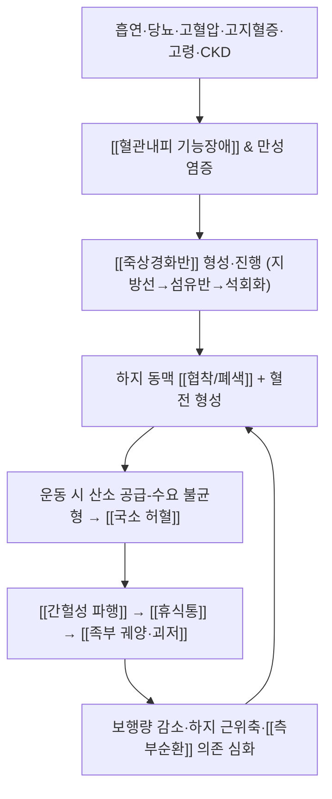

# 🩺 [[말초동맥질환]] (Peripheral Arterial Disease / 末梢動脈疾患, ICD-10 I70.2·I73.9 / KCD I70.2·I73.9)

![[말초동맥질환_1.jpg|540]]
> [그림 1: ① 병태생리·영상 — 말초동맥질환_1]
![[말초동맥질환_5.jpg|540]]
> [그림 2: ② 관련 해부 구조물 — HEV RNA was detected in the absence of a cytopathic effect (CPE). VS1 and VS2 prepared from HeLa cells <b>treated</b> wi]

> **핵심 3줄 요약 (Key Summary)**:
> - 📍 병소 부위 & 해부·병태생리: 하지 동맥(대동맥-장골 분절, 대퇴-슬와 분절, 슬하 경골 분절)의 [[죽상경화반]]에 의한 협착·폐색 → [[측부순환]] 의존성 [[국소 허혈]]. 주 이환 조직은 [[장딴지근군]], [[전경골근]], [[비복근]] 등 하지 근육과 [[족부 말초조직]]이며, 관련 혈관은 [[표재성대퇴동맥]], [[슬와동맥]], [[전·후경골동맥]], [[비골동맥]]이다.
> - 🚩 전형적 임상 양상 & 3대 징후: **간헐성 파행(운동 시 장딴지 통증 → 휴식 시 소실)**, **족부맥박 약화·소실**, **하지 거상 시 창백 / 하수 시 충혈 지연**의 3대 소견. 진행 시 [[휴식통]], [[비치유성 족부궤양]], [[괴저]]로 이행.
> - 🛠️ 핵심 감별 검사 & 한·양방 다각적 치료 전략: [[발목상완지수(ABI)]] ≤0.90이 진단적 핵심, 보조로 [[발가락상완지수(TBI)]], [[이중초음파]], [[CTA/MRA]]. 한방은 [[足三里]]·[[三陰交]]·[[太衝]]·[[解谿]] 중심 침·전침 + [[활혈거어]] 약침·한약(血府逐瘀湯類) + 하지 근막이완 추나를 병용하되, **금연·감독하 운동치료·스타틴/항혈소판제**라는 양방 표준치료를 절대 대체하지 않고 통합한다.
> - ⚠️ 응급 의뢰 레드플래그 & 악화 요인: 급성 사지허혈(6P: Pain·Pallor·Pulselessness·Paresthesia·Paralysis·Poikilothermia) 및 만성 사지위협허혈(CLTI: 휴식통·궤양·괴저·감염)은 즉시 혈관외과 의뢰. 허혈·괴저·감염 궤양 부위에 대한 직접 자침·부항·온침은 금기이며, 감각저하 환자의 온열요법은 화상 위험이 크다.

---

## 📌 목차
1. [질환 개요 & 해부학적 병태생리](#1-질환-개요--해부학적-병태생리)
2. [병태생리 메커니즘 & 생체역학적 악순환 네트워크](#2-병태생리-메커니즘--생체역학적-악순환-네트워크)
3. [임상 증상 & 이학적 검사(Physical Exam) 알고리즘](#3-임상-증상--이학적-검사physical-exam-알고리즘)
4. [감별 진단 매트릭스 (Differential Diagnosis)](#4-감별-진단-매트릭스-differential-diagnosis)
5. [한의 통합 치료 프로토콜 (침·약침·추나·한약)](#5-한의-통합-치료-프로토콜-침약침추나한약)
6. [재활 운동 & 생활습관 티칭 가이드](#6-재활-운동--생활습관-티칭-가이드)
7. [💡 사용자 진료실 핵심 필기 & 임상 노하우 (Melt-In 잔여 심화 집약)](#7--사용자-진료실-핵심-필기--임상-노하우-melt-in-잔여-심화-집약)
8. [출처 및 학술 참고 문헌 (References)](#8-출처-및-학술-참고-문헌-references)

---

## 1. 질환 개요 & 해부학적 병태생리

![[말초동맥질환_1.jpg|540]]
> [그림 1: Blausen 0726 PeripheralArteryDisease.png]

![[말초동맥질환_2.jpg|540]]
> [그림 2: 2129ab Lower Limb Arteries Anterior Posterior.jpg]

* **질환 정의 및 분류**:
  * **정의**: 말초동맥질환(PAD)은 관상동맥과 뇌혈관을 제외한 말초동맥, 그중에서도 특히 **하지 동맥에 발생한 죽상경화성 협착·폐색**으로 인해 조직 혈류 공급이 수요를 따라가지 못하는 질환군이다. 대부분의 임상적 정의는 하지 PAD를 지칭하며, 상지·내장·신장 동맥 침범은 별도로 분류한다 (Shamaki & Markson, 2022, PMID: 34906615).
  * **병리학적 분류**: 죽상경화성(atherosclerotic) 폐색이 절대다수이며, 그 외 혈전색전성 폐색, 슬와동맥 포착증후군, 낭성 외막질환(adventitial cystic disease), 혈관염, 방사선 유발성 등은 드문 원인으로 감별이 필요하다 (Shamaki & Markson, 2022, PMID: 34906615).
  * **임상 단계 분류**: 무증상(asymptomatic) → 비전형 다리증상 → 간헐성 파행 → 중증 파행 → 휴식통 → 조직소실(궤양·괴저)의 스펙트럼으로 이어지며, **전형적인 '간헐성 파행'을 정확히 호소하는 환자는 전체의 일부에 불과하고 비전형 증상이 더 흔하다**는 점이 McDermott(2026, PMID: 41604641) 리뷰의 핵심 강조점이다.
  * **호발 연령/성별/직업군**: 연령이 증가할수록 유병률이 급격히 상승하며, 70세 이상 전 연령군 및 50–69세 중 흡연력·당뇨병이 있는 고위험군에서 선별검사(ABI)가 권고된다 (Criqui & Aboyans, 2015, PMID: 25908725). 성별·인종별 분포 차이가 보고되나 구체적 유병률 수치는 본 노트에서 원문 대조 전이므로 **근거 미확인**으로 표기한다. 장시간 서서 일하거나 보행량이 많은 직업 자체가 PAD를 유발한다는 근거는 **근거 미확인**이며, 직업적 요인보다는 **흡연·당뇨·고혈압·고지혈증·고령·만성신장질환**이 결정적 위험인자이다.
  * **역학적 특성**: PAD는 전신 죽상경화의 표지자로서, 유증상·무증상 모두에서 심근경색·뇌졸중·심혈관 사망 위험이 유의하게 증가한다 (Criqui & Aboyans, 2015, PMID: 25908725; Shamaki & Markson, 2022, PMID: 34906615). 즉, PAD 진단은 "다리 질환의 진단"이 아니라 **"전신 동맥경화성 심혈관 고위험군의 확인"**이라는 의미를 갖는다.

* **관련 해부학적 구조물**:
  * **혈관 해부 (동맥 주행 경로와 침범 분절)**: 하지 동맥은 크게 3개 분절로 나누어 이해하면 병소 위치 추정과 검사 계획이 쉬워진다.
    * **대동맥-장골 분절(aortoiliac segment)**: 복부대동맥 말단 → 총장골동맥 → 내·외장골동맥 → 총대퇴동맥. 이 분절 폐색 시 **둔부·대퇴부 파행, 서혜부 이하 맥박 소실, 양측성 증상, 발기부전**이 동반될 수 있다(Leriche 증후군).
    * **대퇴-슬와 분절(femoropopliteal segment)**: [[총대퇴동맥]] → [[심부대퇴동맥]](측부순환의 핵심 공급원) → [[표재성대퇴동맥]](내전근관, Hunter's canal을 지나며 기계적 굴곡·압박을 받는 구역) → [[슬와동맥]]. **PAD에서 가장 흔하게 침범되는 분절**이며, 임상적으로 장딴지 파행의 주 원인이다.
    * **슬하 분절(infrapopliteal segment)**: [[전경골동맥]] → [[족배동맥]], [[후경골동맥]] → [[족저동맥]], [[비골동맥]]. 당뇨병 환자에서 특히 이 분절 침범이 흔하고, 이 경우 **족부 궤양·괴저 위험이 높다** (Mandaglio-Collados & Marín, 2023, PMID: 37517924).
  * **골격 및 관절**: 슬관절·족관절의 정렬과 가동범위는 파행 보행 패턴에 영향을 주며, 특히 [[족관절 배굴 제한]]과 [[슬관절 굴곡 구축]]은 보행 효율을 떨어뜨려 파행 거리를 단축시킨다. 관절 자체가 PAD를 유발하지는 않으나, **하지 관절 질환은 PAD 파행의 중요한 감별 대상이자 증상 악화 인자**이다.
  * **근육 및 근막**: [[장딴지근]](비복근·가자미근), [[전경골근]], [[후경골근]], [[대퇴사두근]], [[햄스트링]]이 주요 이환 근군이다. 허혈성 파행 시 장딴지근에서 **운동 대사 수요 대비 산소 공급 부족**이 발생하여 통증·경련·피로감이 유발된다. 만성기에는 보행량 감소로 인한 **하지 근육 위축과 근력 저하**가 이차적으로 진행되며, 이는 다시 보행 능력을 떨어뜨리는 악순환을 만든다 (McDermott, 2026, PMID: 41604641).
  * **신경 및 감각**: PAD 자체는 말초신경을 직접 포착하지 않지만, 만성 허혈은 [[말초신경병증]]을 유발하거나 악화시킬 수 있고 특히 **당뇨병성 말초신경병증과 중복**되면 감각 저하로 인해 궤양·화상을 조기에 인지하지 못하는 고위험이 된다. 이는 자침·온열치료 안전성 판단의 핵심 포인트이다.

---

## 2. 병태생리 메커니즘 & 생체역학적 악순환 네트워크

### 1) 죽상경화 및 혈전 형성 기전 (분자·세포 수준)
* **내피 기능장애**: 흡연·고혈당·고혈압·고지혈증 등 위험인자가 혈관내피의 산화질소(NO) 생체이용률을 저하시키고 투과성을 증가시킨다 (Mandaglio-Collados & Marín, 2023, PMID: 37517924).
* **지질 침착과 염증세포 침윤**: 혈관벽 내로 유입된 LDL이 산화되어 대식세포가 이를 탐식, 거품세포(foam cell)를 형성하고, 지방선(fatty streak) → 섬유성 죽상반(fibrous plaque) → 석회화된 복합병변으로 진행한다. 이 과정에서 **만성 염증 반응이 병변 진행의 중심 축**을 이룬다 (Mandaglio-Collados & Marín, 2023, PMID: 37517924; Shamaki & Markson, 2022, PMID: 34906615).
* **급성 혈전성 합병증**: 죽상반 파열 시 혈소판 활성화·응고 cascade가 작동하여 급성 폐색을 유발할 수 있다. 이는 만성 협착과 달리 **급성 사지허혈**이라는 응급 상황으로 나타난다.
* **중막 석회화(medial arterial calcification)**: 당뇨병·만성신장질환 환자에서 흔하며, 혈관이 압박되지 않아 **ABI가 위양성으로 상승(>1.40)** 하는 원인이 된다. 따라서 ABI만으로 PAD를 배제하면 안 되고, TBI·발가락 압력·도플러 파형을 함께 봐야 한다 (Shamaki & Markson, 2022, PMID: 34906615).

### 2) 혈류역학적·생체역학적 연쇄 반응 (Kinetic Chain)
* **공급-수요 불일치의 정량적 개념**: 협착이 일정 임계치를 넘으면 안정 시에는 측부순환으로 충분한 혈류가 유지되지만, **보행으로 산소 수요가 증가하면 공급이 따라가지 못해** 통증이 발생한다. 이것이 "걷다가 → 멈추면 사라지는" 간헐성 파행의 혈류역학적 정체이다.
* **측부순환 의존성**: [[심부대퇴동맥]] 및 슬와동맥 주위 측부혈관망이 발달하면 폐색이 있어도 증상이 경미할 수 있다. 반대로 측부순환이 빈약한 해부 구조에서는 같은 정도의 협착에도 증상이 심하다.
* **하지 근육의 이차 변화**: 만성 허혈 + 활동량 감소는 하지 근육의 **근력 저하·근섬유 조성 변화·보행 효율 저하**를 초래한다. McDermott(2026, PMID: 41604641)는 파행 환자의 기능 저하가 단순히 혈류 부족만이 아니라 **근육·운동기능의 복합적 손상**에 기인함을 강조하며, 이 때문에 운동치료가 약물·중재와 별개로 중요한 치료축이 된다고 설명한다.
* **보행 패턴의 보상**: 통증 회피를 위해 보폭을 줄이고 체중 부하를 반대측으로 이동 → 반대측 하지 과부하 및 슬관절·족관절 부담 증가 → 이차적 근골격계 통증 발생. 이때 이차 통증이 PAD 파행을 **가려서(masking)** 증상 평가를 혼란시킬 수 있다.

### 3) 전신 죽상경화 네트워크 (왜 중요한가)
* PAD 환자는 관상동맥질환·뇌혈관질환을 동반할 확률이 높고, **심혈관 사망 위험이 유의하게 상승**한다 (Criqui & Aboyans, 2015, PMID: 25908725). 즉 PAD는 국소 질환이 아니라 전신 질환의 국소 발현이다.
* 따라서 치료 목표는 두 갈래로 나뉜다: **(1) 하지 기능·증상 개선(보행거리, 궤양 치유, 사지 보존)**, **(2) 전신 심혈관 사건 예방(금연·스타틴·항혈소판제·혈압/혈당 조절)** (Shamaki & Markson, 2022, PMID: 34906615).

---

## 3. 임상 증상 & 이학적 검사(Physical Exam) 알고리즘

### 1) 주소증 및 신경학적·혈관성 증상

| 증상 범주 | 구체적 양상 | 임상적 의미 |
| :--- | :--- | :--- |
| **간헐성 파행 (전형)** | 일정 거리 보행 시 장딴지(때로 대퇴·둔부) 통증·경련·조임, **휴식 수 분 내 소실**, 같은 거리에서 재현 | PAD의 대표 증상. 재현성이 핵심 |
| **비전형 다리증상** | 다리 무거움·피로감·야간 경련·'다리가 잘 안 움직인다'는 표현 | 실제 PAD 환자에서 흔함. **전형적 파행만 찾으면 놓친다** (McDermott, 2026, PMID: 41604641) |
| **신경인성 파행 양상** | 보행 시 통증 + 저림·화끈거림이 하지 전체로 확산, **서거나 허리를 굽히면 완화**되는 경향 | 척추관협착증 등 감별 필요 |
| **감각 이상** | 발가락·발 앞부위 저림, 감각 저하, 냉감 | 말초신경병증 동반 또는 진행된 허혈 |
| **운동 장애** | 하지 근력 저하, 근위축, 보행 시 발 처짐(foot drop) 감각 | 말기 허혈 또는 동반 신경병증 |
| **휴식통 (rest pain)** | 발 앞·발가락 통증, **야간·하지 거상 시 악화**, 다리를 아래로 내리면 호전 | 만성 사지위협허혈(CLTI) 신호. 응급 평가 대상 |
| **조직 소실** | 발가락·발꿈치 궤양, 검은 괴저, 악취, 삼출물 | CLTI + 감염 가능성. 즉시 혈관외과·창상팀 의뢰 |
| **혈관·자율신경 증상** | 하지 거상 시 창백(pallor), 하수 시 반응성 충혈(rubor), 피부 위축·털 소실·손톱 변형, 부종 | 만성 허혈의 영양 변화 |

* **특수 패턴**: 양측 둔부 파행 + 발기부전 + 대퇴맥박 소실은 **Leriche 증후군**(대동맥-장골 폐색)의 전형적 3징으로, 침 치료 반응을 기대하며 지연시킬 질환이 아니다 (Shamaki & Markson, 2022, PMID: 34906615).

### 2) 필수 이학적 검사법 (Physical Examination)

| 검사 | 방법 | 양성/이상 소견 및 진단적 가치 |
| :--- | :--- | :--- |
| **[[하지 맥박 촉진]]** | 대퇴·슬와·족배·후경골동맥 맥박을 좌우 비교 | 맥박 약화/소실은 PAD의 가장 기본적 소견. 단, **감수성이 낮아** 정상 맥박이 PAD를 배제하지 못함 |
| **[[서혜부 청진(bruit)]]** | 총대퇴동맥 분기부 청진 | 잡음은 근위부 협착 시사 |
| **[[발목상완지수(ABI)]]** | 발목(족배·후경골) 수축기혈압 ÷ 상완 최고 수축기혈압 | **≤0.90 = 진단적**, 0.91–0.99 = 경계, >1.40 = 비압박성(중막 석회화). PAD 선별·진단의 1차 검사 |
| **[[운동 부하 ABI]]** | 트레드밀 보행 후 ABI 재측정 | 안정 시 ABI가 정상~경계인 파행 환자에서 진단율을 높임 |
| **[[발가락상완지수(TBI)]]·발가락 압력** | 발가락 커프 사용 | ABI가 비압박성으로 상승한 당뇨·CKD 환자에서 유용. 발가락 압력 저하는 중증 허혈 시사 |
| **[[Buerger 검사(하지 거상-하수 검사)]]** | 하지 거상 후 창백 관찰 → 하수 후 충혈 지연 관찰 | 창백·정맥충만 지연은 만성 허혈의 고전적 소견 |
| **[[모세혈관 재충전 시간]]·피부 온도·모발/손톱 변화** | 육안 및 촉진 | 영양 변화는 진행된 허혈의 지표 |
| **[[이중초음파(Duplex US)]]** | 혈류 파형 및 협착 평가 | 비침습적 1차 영상검사, 부위별 협착 정량화 |
| **[[CTA / MRA]]** | 조영·비조영 혈관조영 | 중재 계획 수립용. 신기능 저하 시 조영제 주의 |
| **[[DSA(디지털 감산 혈관조영)]]** | 침습적 조영 | 중재(혈관성형·스텐트)와 동시 시행 |

* **검사 알고리즘 요약**: ① 증상 청취(파행 부위·유발거리·완화시간) → ② 하지 맥박 촉진 + 서혜부 청진 → ③ **ABI 시행**(필요 시 운동 ABI) → ④ ABI 경계/비압박성이면 TBI·발가락 압력 → ⑤ 영상검사로 병변 위치·중증도 평가 → ⑥ CLTI 소견 시 즉시 혈관외과 의뢰 (Shamaki & Markson, 2022, PMID: 34906615; Mandaglio-Collados & Marín, 2023, PMID: 37517924).
* **한의 임상적 주의**: ABI는 진료실에서도 시행 가능하지만, **하지 궤양·괴저·심한 휴식통이 있는 환자는 ABI 결과를 기다리지 말고 의뢰**하는 것이 원칙이다.

---

## 4. 감별 진단 매트릭스 (Differential Diagnosis)

| 감별 질환 | 호발 병소 및 원인 | 주소증 차이점 | 특이적 이학적 검사 소견 |
| :--- | :--- | :--- | :--- |
| [[말초동맥질환]] (본 질환) | 하지 동맥 죽상경화성 협착·폐색 | 보행 시 장딴지 통증, **일정 거리에서 재현**, 휴식 시 수 분 내 소실, 발가락 저림·냉감 | **ABI ≤0.90**, 족배·후경골맥박 약화/소실, 하지 거상 시 창백 |
| [[척추관협착증]](신경인성 파행) | 요추 중앙관·신경근관 협착 | 보행·기립 시 통증, **앉거나 허리를 굽히면 완화**, 저림이 하지 전체·양측성, 자전거 타기는 비교적 가능 | 하지 맥박 정상, **ABI 정상**, 요추 신전 시 증상 유발, SLR/신경학적 결손 가능 |
| [[요추 추간판 탈출증]]·[[신경근병증]] | 수핵 탈출·신경근 압박 | 피부분절에 따른 방사통, 기침·재채기 시 악화, 특정 자세에서만 통증 | SLR 양성, 피부분절별 감각·근력 저하, 맥박 정상 |
| [[만성 정맥부전]](정맥성 파행) | 심부/천부 정맥 역류, 심부정맥 혈전 후유증 | 보행 시 하지 **팽창감·무거움**, 하루 종일 지속, 저녁 악화, 거상 시 호전 | 하지 부종, 정맥류, 색소침착·피부경화, 맥박 정상, ABI 정상 |
| [[당뇨병성 말초신경병증]] | 대사성 신경손상 | 발끝부터 시작하는 **대칭성 저림·작열통**, 야간 악화, 통증과 무관한 감각 저하 | 10 g 모노필라멘트 검사 저하, 진동각 소실, 족부 궤양(무통성) |
| [[급성 동맥 폐색]](색전/혈전) | 심방세동 등 색전원, 급성 혈전 | **갑작스러운** 심한 통증, 창백, 운동·감각 마비 | 6P 소견, 맥박 소실, **즉시 응급 의뢰** |
| [[슬와동맥 포착증후군]] | 비복근 내측두에 의한 슬와동맥 압박(젊은 층) | 운동 시 장딴지 통증, 청소년·청년층, 비전형적 | 발목 배굴 시 맥박 소실, 이중초음파·조영 필요 |
| [[하지 관절병증]](슬관절증·족관절증) | 관절 퇴행·염증 | 체중 부하·계단에서 국소 관절통, 휴식으로 즉시 소실되지 않음, 부종·압통 | 관절 압통·가동범위 제한, 맥박 정상, ABI 정상 |

* **감별의 핵심 축 3가지**: ① **유발-완화 패턴**(파행은 일정 거리 유발 + 휴식 완화, 신경인성은 체위 의존성) ② **맥박 및 ABI**(정상이면 혈관성 가능성 급감) ③ **증상 분포**(피부분절 vs 장딴지 근군). 이 3축만 체계적으로 확인해도 감별의 대부분이 정리된다 (McDermott, 2026, PMID: 41604641; Mandaglio-Collados & Marín, 2023, PMID: 37517924).
* **중복 병태 주의**: 당뇨병 환자는 PAD + 말초신경병증 + 족부 변형이 겹치기 쉽고, 고령 환자는 PAD + 척추관협착증이 동시에 존재할 수 있다. **"하나로 설명하려 하지 말고, 겹침을 전제로 평가"**하는 것이 안전하다.

---

## 5. 한의 통합 치료 프로토콜 (침·약침·추나·한약)

> [!WARNING]
> PAD는 전신 죽상경화 질환이며, **금연·스타틴·항혈소판제·감독하 운동치료·혈관재개통**이라는 양방 표준치료가 예후를 좌우한다. 한의 치료는 이를 **대체하지 않고 병행**하는 보조·기능개선 축으로 위치시킨다. 아래 한의 중재들은 전통적 변증 논리에 기반한 임상 활용이며, **PAD를 대상으로 한 고수준 무작위대조시험 근거는 본 노트에서 확인되지 않음(근거 미확인)**을 명시한다.

* **변증 접근 (한의학적 병기 해석)**:
  * **기체혈어(氣滯血瘀)**: 초기~중기 파행, 통증 양상이 운동과 연동, 설질 암적·어점.
  * **한습조체(寒濕阻滯)**: 냉감·창백·통증이 한랭 노출 시 악화, 만성 경과.
  * **기혈양허(氣血兩虛)**: 만성 근위축·피로·보행능 저하, 창백하고 무력한 양상.
  * **양허한응(陽虛寒凝) / 탈저(脫疽) 단계**: 휴식통·괴저·궤양으로 이행된 중증 단계. **이 단계는 한방 단독 치료 대상이 아니며 즉시 혈관 평가·의뢰가 우선**이다.

* **침구 치료 (Acupuncture)**:

| 목표 | 주요 혈위 | 운용 팁 |
| :--- | :--- | :--- |
| 하지 기혈 순환·보행능 개선 | [[足三里]](ST36), [[三陰交]](SP6), [[懸鐘]](GB39), [[陽陵泉]](GB34) | 기혈 보충 + 근육 이완 목적. 환측 우선, 필요 시 양측 |
| 원위 말초 자극 | [[太衝]](LR3), [[解谿]](ST41), [[崑崙]](BL60), [[八風]](EX-LE10) | 발등·발가락 순환 자극. **궤양·괴저 부위는 자침 금지** |
| 후면 근군 이완 | [[委中]](BL40), [[承山]](BL57), [[곤륜]](BL60) | 장딴지 긴장 완화, 파행 시 보상성 근긴장 표적 |
| 둔부·대퇴 근군 | [[環跳]](GB30), [[秩邊]](BL54), [[承扶]](BL36) | 근위부 폐색(Leriche형) 시 근위 혈위 병용 |
| 전침(Electroacupuncture) | 위 혈위 2–4개 연결 | 저주파(2–10 Hz) 위주, **감각저하 환자는 강도 과다 금지**(화상·자극 손상 위험) |

  * **자극 강도 원칙**: 허혈 하지에서는 자극 강도를 낮추고 자침 시간을 짧게 시작한다. 감각 저하 환자에서 전침 강도를 통상 수준으로 올리면 조직 손상 위험이 있으므로 **환자 반응을 세밀히 확인**하며 조절한다.
  * **금기**: 궤양·괴저·감염 창상 부위 직접 자침, 심한 휴식통·급성 허혈 환자에 대한 무리한 자극, 항응고제 복용 환자에서의 심자(深刺).

* **약침 치료 (Pharmacopuncture)**:
  * **변증-약침 매칭(임상 활용)**: 어혈 병기에는 [[활혈거어]] 계열(홍화·당귀·단삼 등 소재 기반) 약침을, 기혈허 약화 병기에는 보익 계열 약침을 고려한다. 구체 제품·용량·농도는 **근거 미확인**이며, 기관 프로토콜과 환자 상태에 따라 결정한다.
  * **시술 부위 원칙**: 궤양·괴저 부위 및 그 주변 허혈 조직은 **직접 주입하지 않는다**. 대신 근위 혈위(족삼리·삼음교·양릉천·승산 등)와 하지 근육 긴장 부위에 소량 주입하여 순환·이완을 목표로 한다.
  * **안전성 체크**: 항응고·항혈소판제 복용 환자가 많으므로 주입 전 출혈 경향, 주입 후 혈종·감염 여부를 반드시 확인한다.

* **추나 치료 (Chuna Manipulation)**:
  * 허혈 자체를 교정하는 추나는 없으나, **PAD 환자의 이차적 근골격계 문제**(족관절 강직, 슬관절 가동 제한, 고관절 근막 긴장)를 개선하여 보행 효율을 높이는 목적으로 적용한다.
  * **적용 기법**: 하지 근막 이완(JS 수기 변형), 족관절·슬관절·고관절 관절가동 기법, 요추-골반 균형 조정.
  * **금기**: 급성 사지허혈, 동맥 박리, 급성 심부정맥혈전증, 중증 괴저·감염 창상 환자, 비압박성 혈관(석회화)로 취약한 고령 환자에 대한 강한 신연·충격 기법.

* **한약 치료 (Herbal Medicine)**:

| 병기·변증 | 대표 처방(전통 처방 기준) | 활용 포인트 |
| :--- | :--- | :--- |
| 어혈·기체혈어 | [[血府逐瘀湯]], [[桂枝茯苓丸]] 가감 | 통증·순환 개선 목적. 항혈소판제 병용 시 출혈 위험 모니터 |
| 기혈양허·중풍 후유 유형 | [[補陽還五湯]] 가감 | 하지 무력·근위축·만성 파행 |
| 한습·양허 | [[當歸四逆湯]], [[黃芪桂枝五物湯]] | 냉감·창백 우세, 한랭 악화형 |
| 습열·궤양 단계 | 청열해독·이습 계열 처방 가감 | 감염 동반 괴저. **단독 처방 금지, 창상·감염 치료 병행 필수** |

  * **한약-양방 상호작용 주의**: 활혈거어 처방과 항혈소판제(aspirin, clopidogrel)·항응고제 병용 시 **출혈 위험 상승** 가능성이 있으므로, 복용 여부를 반드시 확인하고 필요 시 용량·기간을 조정한다. 구체적 상호작용 강도는 **근거 미확인**.

---

## 6. 재활 운동 & 생활습관 티칭 가이드

* **감독하 운동치료 (Supervised Exercise Therapy) — 치료의 핵심 축**:
  * 원칙: **통증이 생길 때까지 걷고 → 통증이 가라앉을 때까지 휴식 → 다시 걷는** 운동-휴식(intermittent) 프로토콜을 반복한다. 총 30–45분, 주 3회 이상을 목표로 한다 (Shamaki & Markson, 2022, PMID: 34906615; McDermott, 2026, PMID: 41604641).
  * 효과: 최대 보행거리·무통 보행거리 개선, 하지 기능 및 삶의 질 향상. 약물·중재와 별개로 기능 개선에 기여한다.
  * 실전 팁: 처음에는 트레드밀이 아니어도 되며 **평지 보행로와 앉을 자리**만 확보되면 시행 가능하다. 환자가 "아프면 쉬었다 다시 걷는다"는 규칙을 정확히 이해하는 것이 성공의 관건이다.
* **강화 및 안정화 운동 (Strengthening)**:
  * 장딴지근·전경골근·대퇴사두근·둔근에 대한 저강도-중강도 저항운동. 앉아서 하는 발목 펌프 운동(ankle pump)은 순환 보조와 부종 관리에 유용하다.
  * **주의**: 궤양·괴저가 있는 환자에서는 체중 부하 운동을 제한하고, 비체중부하 운동 및 창상 관리 우선.
* **이완 및 스트레칭 (Stretching)**:
  * 장딴지근·가자미근·후경골근·햄스트링의 정적 스트레칭을 통증 없는 범위에서 시행. 족관절 배굴 제한이 있으면 보행 시 발이 끌려 낙상 위험이 커지므로 우선적으로 개선한다.
* **족부 관리 (Foot Care) — PAD 환자의 생존 문제**:
  * **매일 발 검사**: 발바닥·발가락 사이·발꿈치까지 거울로 확인, 상처·물집·색 변화 점검.
  * **맨발 금지**: 실내외 모두 신발 착용, 뜨거운 물·찜질·전기요(전기장판) 사용 금지(감각 저하 시 화상).
  * **발톱·각질 관리**: 스스로 깎지 말고 전문가에게 맡기며, 굳은살·티눈은 방치하지 않는다.
  * **신발**: 발을 조이지 않고 발가락이 움직일 수 있는 잘 맞는 신발. 당뇨 동반 시 치료용 신발 고려.
* **위험인자 관리 (Risk Factor Control)**:
  * **금연이 단일 최우선 중재**이다. 흡연은 PAD 진행 및 재개통 후 재협착의 주요 인자이므로, 감소가 아닌 **완전 금연**을 목표로 상담한다 (Shamaki & Markson, 2022, PMID: 34906615).
  * 혈압·혈당·지질 관리: 스타틴 및 항혈소판제는 PAD 환자의 심혈관 사건 예방을 위해 표준적으로 고려된다 (Mandaglio-Collados & Marín, 2023, PMID: 37517924).
  * 식이·체중: 지중해식 등 심혈관 친화적 식이, 체중 조절.
* **일상생활 자세 티칭 (Ergonomics & Habits)**:
  * 장시간 서 있거나 다리를 꼬는 자세 회피, 하지 거상이 증상을 악화시키는 **휴식통 환자**는 오히려 다리를 심장 높이 아래로 두는 자세가 편하다는 점을 설명한다.
  * 규칙적 보행 습관 유지(운동치료 프로그램과 연계), 무리한 등산·계단 반복은 중단 가능 범위에서 조절.
  * 한랭 노출 시 혈관 수축으로 증상 악화 → 보온(단, 직접 가온 금지).

---

## 7. 💡 사용자 진료실 핵심 필기 & 임상 노하우 (Melt-In 잔여 심화 집약)

> [!IMPORTANT]
> **🛡️ 원문 융합(Melt-In) 및 7번 섹션 작성 불변 규칙 (CRITICAL)**
> 1. **기존 필기 내용 상부 전면 융합 (Melt-In)**: 질환의 정의, 해부학적 원인, 증상, 이학적 검사법, 치료법, 생활 티칭 등은 상부 1~6번 섹션에 유기적으로 녹여내어 고도화하였다.
> 2. **7번 섹션의 차별화된 심화 집약**: 아래는 상부에 담지 않은 **진료실 실전 문진·치료 순서·환자 설명 스크립트** 중심의 고유 필기만을 수록한다.
> 3. **📷 이미지 배치**: 본 노트의 이미지는 제목 하단 블록에만 배치하였으며, 추가 이미지는 생성하지 않았다.

* **상부 섹션에 미처 다 담지 못한 고유 원문 필기**:
  * **"파행 환자를 만났을 때 가장 먼저 하는 질문은 '얼마나 걸으면 아픕니까'가 아니라 '아플 때 어떻게 하면 편해집니까'**" — 휴식으로 즉시(수 분 내) 사라지는지, 앉아야 하는지, 허리를 굽혀야 하는지가 혈관성과 신경인성의 갈림길이다.
  * **파행 거리의 변화 추적이 곧 치료 반응 지표**이다. "지난달엔 100 m에서 아팠는데 이번엔 300 m"라는 진술은 주관적이지만 임상적으로 매우 유용하다. 진료실에서 **같은 표현(예: '평지 몇 걸음', '버스 정류장 몇 개')으로 기록**해 두면 추적이 가능하다.
  * **고령 환자의 '허리 때문' 자기진단을 그대로 믿지 않는다.** 요추 MRI에서 협착이 보여도 맥박이 약하면 PAD를 먼저 배제하지 않는다.
  * **당뇨 환자의 발은 "감각이 없다"는 전제로 다룬다.** 뜨거운 것·날카로운 것·맨발을 모두 금지 항목으로 안내한다.
  * **ABI가 >1.4(비압박성)로 나온 환자는 '정상'이 아니라 '측정 불가'로 해석**한다. TBI나 발가락 압력, 도플러 파형을 봐야 한다.
  * **호전되지 않는 족부 궤양은 원인 목록 1번에 허혈을 올린다.** 당뇨병성 신경병성 궤양으로 단정하고 2~4주를 보내면 사지를 잃는다.

* **진료실 실전 감별 & 치료 노하우**:

  1. **실전 문진 체크리스트 (내원 5분 안에 확인할 7문항)**
     * ① 어느 부위가 아픈가? (장딴지 / 대퇴 / 둔부 / 발끝 / 하지 전체)
     * ② 어느 정도 걸으면 아픈가? (거리·시간으로 구체적으로)
     * ③ 아플 때 멈춰서 쉬면 몇 분 만에 사라지는가? (수 분 내 = 혈관성 의심)
     * ④ 밤에 자다 깰 정도로 아픈가? (휴식통 → 응급 평가)
     * ⑤ 발에 상처·괴사·검은 부위가 있는가? (창상 여부)
     * ⑥ 흡연력(갑년), 당뇨·고혈압·고지혈증·신장질환, 심근경색·뇌졸중 병력은?
     * ⑦ 남성이라면 발기부전 여부(대동맥-장골 폐색의 실마리)
  2. **치료 순서 및 손맛 노하우**
     * **1단계 — 안전 확인**: 맥박 촉진(대퇴·슬와·족배·후경골)과 피부 상태(궤양·색조·온도)를 먼저 본다. 궤양·괴저가 있으면 자침·부항·온침을 계획에서 제외하고 의뢰를 결정한다.
     * **2단계 — 근위 이완 후 원위 자극**: 골반·둔부·대퇴 근막을 먼저 이완(환자를 복와위 또는 측와위로 편안하게)하고, 이후 장딴지·족부로 내려간다. 허혈 조직에 갑작스러운 강자극을 주지 않는 순서가 안전하다.
     * **3단계 — 전침 세팅**: 저주파(2–10 Hz)로 시작, 감각이 둔한 환자는 **강도를 '느껴지는 정도'까지만** 올린다. 시술 중 주기적으로 피부색과 온도를 확인한다.
     * **4단계 — 약침**: 궤양·괴저 부위 직접 주입 금지. 근위 혈위(족삼리·삼음교·양릉천 등)에 소량, 주입 후 압박·관찰. 항응고제 복용자는 주입 전 반드시 확인.
     * **5단계 — 추나**: 하지 근막 이완 및 관절가동 위주로 부드럽게. 강한 신연·관절 충격 기법은 고령·석회화 혈관 환자에서 피한다.
     * **6단계 — 오늘의 처방과 함께 '걷기 처방'을 반드시 서면으로 전달**: "아플 때까지 걷고, 편해질 때까지 쉬고, 다시 걷기, 하루 30분, 주 3회 이상."
  3. **환자 티칭 스크립트 (그대로 읽어줄 수 있는 문장)**
     * **금연**: "다리 혈관은 담배를 끊는 순간부터 나아지기 시작합니다. 양을 줄이는 것으로는 부족하고 완전히 끊어야 합니다. 이건 약보다 중요합니다."
     * **운동**: "아프다고 걷지 않으면 더 나빠집니다. 아플 때까지 걷고, 멈춰 쉬고, 다시 걷는 것을 반복하세요. 이 훈련이 다리 혈관의 우회로를 키웁니다."
     * **발 관리**: "매일 거울로 발바닥과 발가락 사이를 확인하세요. 맨발로 다니지 말고, 찜질이나 전기요는 절대 사용하지 마세요. 감각이 둔하면 화상을 입어도 모릅니다."
     * **즉시 내원 기준**: "발이 갑자기 창백해지거나, 심하게 아프면서 감각이 없어지거나, 검게 변하거나, 낫지 않는 상처가 생기면 그날 바로 큰 병원 응급실로 가셔야 합니다."
     * **전신 관리**: "이 병은 다리만의 문제가 아니라 심장과 뇌혈관에도 같은 병이 있을 가능성을 알려주는 신호입니다. 혈압·혈당·콜레스테롤 약을 임의로 끊지 마세요."
  4. **한의 치료의 위치 설정 멘트**: "침과 한약은 다리 순환과 통증, 보행 능력을 돕는 치료입니다. 다만 동맥이 좁아진 것을 넓히는 시술(혈관중재)이나 반드시 필요한 약(스타틴·항혈소판제)을 대신할 수는 없습니다. 함께 해야 결과가 좋습니다."

---

## 8. 출처 및 학술 참고 문헌 (References)

1. **대한정형외과학회 / 척추신경외과학회 교과서**. (하지 혈관성 질환의 감별 및 하지 통증 감별 진단 항목 참조)
2. **Shamaki GR, Markson F (2022)**. *Peripheral Artery Disease: A Comprehensive Updated Review*. **Curr Probl Cardiol**. PMID: 34906615
   - **[연구 요약]**: PAD의 정의·역학·위험인자·병태생리·진단(ABI, 영상검사)·치료(금연, 운동치료, 약물, 혈관재개통)를 포괄적으로 정리한 최신 종합 리뷰. 본 노트의 개요, 진단 알고리즘, 치료 축 구성의 근거로 사용.
3. **Mandaglio-Collados D, Marín F (2023)**. *Peripheral artery disease: Update on etiology, pathophysiology, diagnosis and treatment*. **Med Clin (Barc)**. PMID: 37517924
   - **[연구 요약]**: PAD의 병인·병태생리(내피 기능장애, 염증, 죽상경화 진행) 및 진단·치료 업데이트. 본 노트의 병태생리 섹션 및 위험인자 관리 파트의 근거로 사용.
4. **Criqui MH, Aboyans V (2015)**. *Epidemiology of peripheral artery disease*. **Circ Res**. PMID: 25908725
   - **[연구 요약]**: PAD의 역학, 연령·위험군별 선별(70세 이상, 50–69세 흡연·당뇨), 전신 심혈관 위험 증가에 대한 근거. 본 노트의 역학 및 예후 파트에 반영.
5. **McDermott MM (2026)**. *Peripheral Artery Disease in the Legs*. **N Engl J Med**. PMID: 41604641
   - **[연구 요약]**: 하지 PAD의 임상 양상(전형적 파행보다 비전형 증상이 흔함), 기능 저하의 다인성 기전, 운동치료 및 기능 개선 전략에 대한 최신 종합. 본 노트의 증상 기술 및 재활 운동 섹션의 근거로 사용.

> [!NOTE]
> **근거 수준 표기 원칙 안내**
> - 본 노트에서 특정 수치(유병률, 용량, 빈도 등)를 원문으로 확정하지 못한 항목은 **"근거 미확인"**으로 명시하였다.
> - 한의 중재(침·약침·추나·한약) 파트는 전통적 변증 논리 및 임상 활용 관행에 기반한 서술이며, PAD를 대상으로 한 고수준 임상시험 근거는 이 노트에서 확인되지 않았다.
> - PAD의 진단·치료 결정, 특히 혈관재개통·약물치료 여부는 **혈관외과·순환기내과 협진**을 통해 이루어져야 한다.