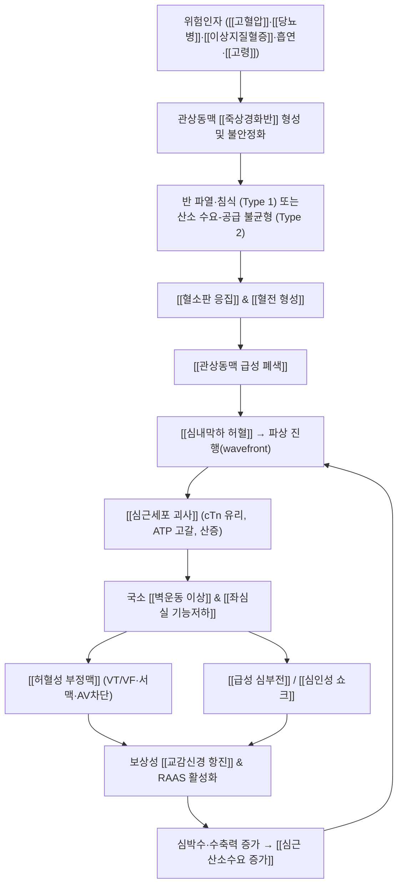
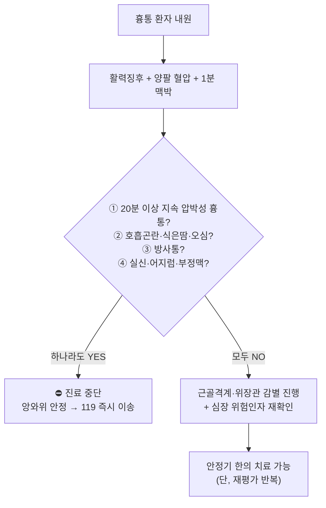

# 🩺 [[심근경색증]] (Myocardial Infarction / 胸痺·眞心痛, ICD-10 I21 / KCD I21)

> **핵심 3줄 요약 (Key Summary)**:
> - 📍 **병소 부위 & 해부·병태생리**: 심근(myocardium) 자체의 허혈성 괴사. 관상동맥(주로 [[좌전하행지 LAD]], [[좌회선지 LCx]], [[우관상동맥 RCA]])의 죽상경화반 파열·침식 → 혈소판 응집 및 혈전 형성 → 관상동맥 급성 폐색 → 심내막하 심근의 산소공급/수요 불균형이 지속되어 심근세포 괴사에 이르는 응급 허혈성 심질환. (Fourth Universal Definition of MI, Thygesen 2018, PMID: 30571511)
> - 🚩 **전형적 임상 양상 & 3대 징후**: ① 흉골 후방의 20분 이상 지속되는 압박감·조임·쥐어짜는 통증(Levine sign), ② 좌측 상지 내측·턱·등·상복부로의 방사통, ③ 발한·오심·호흡곤란·창백 등 자율신경 동반 증상. 고령·여성·당뇨병 환자에서는 무통성 또는 비전형 발현(소화불량, 피로감, 호흡곤란 단독)이 흔하다.
> - 🛠️ **핵심 감별 검사 & 한·양방 다각적 치료 전략**: 12유도 [[심전도]](내원 10분 이내) + [[high-sensitivity 트로포닌]](0/1시간 또는 0/2시간 연속 측정)이 진단의 축. ST 분절 상승이 있으면 **즉시 119 이송 및 일차적 PCI(관상동맥 중재술)**가 최우선이며, 한의 치료는 재관류·안정화 이후 회복기 및 이차예방 단계에서 [[내관(PC6)]]·[[단중(CV17)]] 자침, [[활혈거어제]](血府逐瘀湯類)·[[보익제]](生脈散類) 등을 보조적으로 통합한다.
> - ⚠️ **응급 의뢰 레드플래그 & 악화 요인: 지속되는 흉통 + ST 분절 상승(STEMI), 혈역학적 불안정(저혈압·의식저하·부정맥), 급성 심부전(Killip III–IV), 심정지/VF/VT 발생 시 한의원 내 처치를 중단하고 즉시 119 이송. 급성기 흉추 추나·강한 심부 압박·복와위 자세·강자극 자침은 절대 금기.**

---

## 📌 목차
1. [질환 개요 & 해부학적 병태생리](#1-질환-개요--해부학적-병태생리)
2. [병태생리 메커니즘 & 생체역학적 악순환 네트워크](#2-병태생리-메커니즘--생체역학적-악순환-네트워크)
3. [임상 증상 & 이학적 검사(Physical Exam) 알고리즘](#3-임상-증상--이학적-검사physical-exam-알고리즘)
4. [감별 진단 매트릭스 (Differential Diagnosis)](#4-감별-진단-매트릭스-differential-diagnosis)
5. [한의 통합 치료 프로토콜 (침·약침·추나·한약)](#5-한의-통합-치료-프로토콜-침약침추나한약)
6. [재활 운동 & 생활습관 티칭 가이드](#6-재활-운동--생활습관-티칭-가이드)
7. [💡 사용자 진료실 핵심 필기 & 임상 노하우 (Melt-In 잔여 심화 집약)](#7--사용자-진료실-핵심-필기--임상-노하우-melt-in-잔여-심화-집약)
8. [출처 및 학술 참고 문헌 (References)](#8-출처-및-학술-참고-문헌-references)

---

## 1. 질환 개요 & 해부학적 병태생리

![[심근경색증_도해.jpg|540]]
> [그림 1: 관상동맥 폐색으로 인한 심근 허혈·괴사 개념도]

![[심근경색증_관상동맥_Gray497.jpg|540]]
> [그림 2: 심장의 관상동맥 분포 (Gray's Anatomy, Plate 497, Public Domain)]

![[심근경색증_심전도_ECG.jpg|540]]
> [그림 3: 급성 전벽 심근경색의 심전도(전흉부 유도 ST 상승) (Wellcome Collection N0009629, CC BY 4.0)]

### 1) 질환 정의 및 분류 (Fourth Universal Definition, Thygesen 2018, PMID: 30571511)

**심근경색증(Myocardial Infarction)** 은 「심근손상(myocardial injury)」과 반드시 구분해야 한다. 심근손상은 **심근 트로포닌(cTn)이 99백분위수 상위 참고치(URL)를 초과하여 상승 또는 하강하는 경우**로 정의되며, 여기에 **급성 심근 허혈의 증거**가 부가될 때 비로소 심근경색증이 된다. 즉 **"심근손상 + 허혈 증거 = 심근경색증"** 이라는 등식이 제4차 범용정의의 핵심이다.

급성 심근경색증 진단을 위해 요구되는 **허혈 증거**는 다음 중 최소 1개 이상이다(Thygesen 2018, PMID: 30571511).

| 허혈 증거 항목 | 임상적 의미 |
| :--- | :--- |
| 심근 허혈 증상 | 전형적 흉통, 호흡곤란 등 |
| 새로운 허혈성 ECG 변화 | ST 분절 변화, 새로 발생한 T파 역전 등 |
| 병적 Q파 발생 | 경색 후 심근 손실의 흔적 |
| 영상학적 증거 | 새 심근 손실 또는 새 국소 벽운동 이상(심초음파·MRI) |
| 관상동맥 혈전 증거 | 혈관조영술 또는 부검에서 확인 |

**병태생리 기전에 따른 5가지 분류(Type 1~5)** 는 치료 전략을 완전히 바꾸므로 임상에서 반드시 구분해야 한다.

| Type | 기전 | 임상 맥락 | 치료 방향 |
| :--- | :--- | :--- | :--- |
| **Type 1** | 죽상경화반 파열·침식 → 혈전에 의한 관상동맥 자발적 폐색 | 전형적 ACS, STEMI/NSTEMI | 재관류(PCI), 항혈전 요법 |
| **Type 2** | 관상동맥 혈전과 무관한 **산소 수요-공급 불균형** | 패혈증, 빈혈, 저혈압, 빈맥, 관상동맥 연축 (Sandoval 2019, PMID: 30975302) | **원인 질환 교정이 본질** |
| **Type 3** | 심근 허혈 증상·ECG 변화로 사망했으나 바이오마커 채취 전 사망 | 부검·임상 정황으로 진단 | 해당 없음(사후 진단) |
| **Type 4a/4b/4c** | PCI 시술 관련(시술 중 손상) / 스텐트 혈전 / 재협착 | 경피적 관상동맥 중재술 후 | 항혈소판제 최적화, 재시술 |
| **Type 5** | 관상동맥우회술(CABG) 관련 | 수술 중·후 심근손상 | 원인 교정 |

**Type 2 심근경색증**은 특히 한의 임상에서 놓치기 쉽다. 중증 빈혈, 패혈증, 저혈압성 쇼크, 지속적 빈맥, 심한 고혈압 등이 관상동맥 혈류를 상대적으로 부족하게 만들어 발생하며, **관상동맥 자체의 혈전성 폐색이 아니므로 항혈전제·재관류 치료의 이득이 제한적이고, 유발 원인 교정이 치료의 본질**이다(Sandoval & Jaffe 2019, PMID: 30975302). 즉 "트로포닌이 높다 = 스텐트가 필요하다"가 성립하지 않는 대표적 상황이다.

**불안정 협심증(Unstable Angina)과의 구분**: 급성 관상동맥 증후군(ACS)은 불안정 협심증, NSTEMI, STEMI를 아우르는 스펙트럼이며, 심근 트로포닌 상승 여부가 NSTEMI와 불안정 협심증을 가르는 분수령이다(Nohria & Antono 2024, PMID: 38278573). 심근경색은 **가역적 허혈(협심증)과 달리 심근세포 괴사가 실제로 발생한 상태**라는 점에서 질적 차이가 있다.

### 2) 관련 해부학적 구조물

* **심장 및 관상동맥**:
  * **[[좌주간지(LM)]]**: 좌관상동맥동에서 기시하여 LAD와 LCx로 분지. LM 폐색은 광범위 전벽 경색 및 심인성 쇼크로 직결되는 최고위험 병변.
  * **[[좌전하행지(LAD)]]**: 심실중격 전방·좌심실 전벽·심첨부에 혈류 공급 → 폐색 시 **전중격 경색**, ECG **V1–V4** 유도에 ST 상승. "widow-maker" 병변으로 불린다.
  * **[[좌회선지(LCx)]]**: 좌심실 측벽·후벽 일부 공급 → **측벽 경색**, ECG **I, aVL, V5–V6** 유도.
  * **[[우관상동맥(RCA)]]**: 우심실·좌심실 하벽·후중격 및 동방결절/방실결절 혈류 공급 → **하벽 경색**, ECG **II, III, aVF** 유도. 하벽 경색 시 **서맥·방실차단**이 동반되기 쉽고, 우심실 경색이 병발하면 **니트로글리세린 투여가 치명적 저혈압을 유발**할 수 있다.
* **심근 벽 구조**:
  * **[[심내막하층(subendocardium)]]**: 관상동맥 말단부의 관류를 받는 최원위 영역으로, **허혈에 가장 취약**하다. 그래서 허혈은 심내막하에서 시작하여 심외막 방향으로 파상적으로 진행(wavefront)한다.
  * **[[심외막층(epicardium)]]**: 상대적으로 허혈 내성이 높으나, 전층 경색(transmural)에서는 전 두께가 괴사한다.
* **심장의 신경 지배와 통증 방사**:
  * 심장의 교감신경은 **T1–T4/T5 척수분절**에서 기시하여 [[심장신경총(cardiac plexus)]]을 형성하고, 미주신경(부교감)이 동반 주행한다. 심근 허혈 시 이 척수분절에 대응하는 피부분절로 통증이 방사되므로, **좌측 상지 내측(C8–T4), 어깨, 턱, 경부, 상복부**로의 연관통이 발생한다. 이것이 어깨·상지 근골격계 질환과의 감별을 어렵게 만드는 해부학적 근거다.
  * **[[미주신경]]** 자극은 오심·구토·발한·서맥을 유발하며, 하벽 경색에서 흔히 관찰되는 **베즈올드-야리시 반사(Bezold–Jarisch reflex)** 성 자율신경 반응의 기반이 된다.

---

## 2. 병태생리 메커니즘 & 생체역학적 악순환 네트워크

### 1) 관상동맥 폐색 및 허혈성 괴사 기전

* **Type 1의 출발점**: 관상동맥 죽상경화반이 파열되거나 침식되면, 내皮下 조직이 노출되면서 **혈소판 부착·활성화 → 응집 → 섬유소 그물 형성**의 혈전 연쇄가 시작된다. 이 혈전이 관상동맥을 완전 폐색하면 심근은 산소 공급을 완전히 상실한다(Thygesen 2018, PMID: 30571511; Nohria 2024, PMID: 38278573).
* **파상 허혈(wavefront ischemia)**: 허혈은 혈류 공급의 최말단부인 **[[심내막하층]]에서 시작**하여 심외막 방향으로 진행한다. 폐색이 지속되면 수 분 내 심내막하 괴사가 시작되고, 수 시간에 걸쳐 전층으로 확대된다. **"시간이 곧 심근(time is muscle)"** 이라는 응급 원칙의 병리학적 근거다.
* **세포 수준의 붕괴**: 산소 공급 중단 → 미토콘드리아 산화적 인산화 중단 → ATP 고갈 → Na⁺/K⁺-ATPase 기능 상실 → 세포 부종 및 전해질 불균형 → 무산소 해당의 젖산 축적으로 세포내 산증 → 세포막 파괴 및 트로포닌 등 심근표지자 유리.
* **재관류 손상(reperfusion injury)**: 폐색된 혈관을 재개통해도 산화 스트레스, 칼슘 과부하, 백혈구 침윤, 미세혈관 폐색(no-reflow) 등으로 추가 심근손상이 발생할 수 있음이 알려져 있다. 따라서 **재관류는 이득이 크지만 완전한 해결책은 아니다**.

### 2) MI 후 부정맥 발생 기전 (Frampton & Ortengren 2023, PMID: 37009192)

심근경색 후 부정맥은 **허혈 자체, 재관류, 자율신경계 불균형, 전해질 이상, 경색 후 구조적 리모델링**이 복합적으로 작용하여 발생하며, 시기에 따라 양상이 다르다.

* **조기(급성기) 부정맥**: 경색 직후 허혈성 심근과 정상 심근 사이의 전기적 이질성, 재관류 시 산화 스트레스 및 칼슘 과부하가 주요 기전이다. **심실세동(VF)·심실빈맥(VT)** 이 돌연사의 주원인이며, 서맥성 부정맥(동기능부전, 방실차단)은 특히 **하벽 경색(RCA 폐색)** 에서 흔하다. 심실조기수축(PVC)은 흔하지만 대부분 비특이적이다.
* **후기 부정맥**: 경색 후 반흔 조직이 형성되면서 **재진입 회로(reentry circuit)** 가 생겨 단형성 심실빈맥(monomorphic VT)의 기질이 된다. 심부전과 좌심실 기능저하가 동반될수록 위험이 증가한다. 이는 급성기 이후 **이차예방 및 위험층화(예: 좌심실 박출률 기반 ICD 적응 판단)** 의 중요성을 뒷받침한다.
* **임상적 함의**: 흉통 환자에서 **어지럼·실신·두근거림·의식 소실**이 동반되면 부정맥 합병증을 강하게 의심해야 하며, 한의원에서 맥박이 불규칙하거나 서맥(<50회/분)·빈맥(>120회/분)이 확인되면 즉시 응급 이송 대상이다.

### 3) 심부전·심인성 쇼크로의 진행

경색 범위가 넓거나(특히 LAD 근위부 폐색) 기존 심기능이 저하된 경우, 괴사된 심근은 수축 기능을 상실한다. 이때 비괴사 심근이 보상성으로 수축력을 높이면서 **심근 산소수요가 추가로 증가하는 악순환**이 형성된다. 이는 위 mermaid 도식의 `Comp → Demand → Ischemia` 되먹임 고리이며, **아무리 보존적 치료를 해도 경색 범위가 스스로 줄어들지 않는 이유**다. 이 고리를 끊는 유일한 방법이 **조기 재관류**다.

---

## 3. 임상 증상 & 이학적 검사(Physical Exam) 알고리즘

### 1) 주소증 및 전형적 증상

| 구분 | 전형적 양상 | 비고 |
| :--- | :--- | :--- |
| **흉통** | 흉골 후방 압박감·조임·쥐어짜는 느낌·무거움, **20분 이상 지속**, 안정 및 니트로글리세린에 반응하지 않음 | 환자가 주먹을 쥐고 가슴을 누르는 **[[Levine sign]]** 관찰 |
| **방사통** | 좌측 상지 내측, 견부, 경부, 하악(턱), 등, 상복부 | 심장 교감신경 T1–T4 분절 연관통 |
| **자율신경 증상** | 발한(특히 식은땀), 오심·구토, 창백, 불안감, 죽음의 공포감 | 미주신경 항진, 하벽 경색에서 두드러짐 |
| **호흡기 증상** | 호흡곤란, 좌심부전 시 기좌호흡 | 폐울혈 진행 시 악화 |
| **부정맥 관련** | 두근거림, 어지럼, 실신, 의식 소실 | VF/VT·완전 방실차단 시 사망 가능 |

### 2) 비전형 발현 — 놓치면 치명적 (Nohria & Antono 2024, PMID: 38278573)

* **여성**: 전형적 압박성 흉통보다 **호흡곤란, 피로감, 오심, 등·턱 통증**으로 발현하는 빈도가 상대적으로 높다.
* **고령자**: 인지기능 저하·기저질환으로 증상 표현이 둔화되어 **무통성(silent) MI** 또는 갑작스러운 의식 변화·전신 쇠약으로 발현.
* **당뇨병 환자**: 자율신경병증으로 인해 흉통이 감소되거나 결여되어 **소화불량·상복부 불편감**으로 오인되기 쉽다(이른바 "diabetic silent MI").
* **비전형 소화기 증상**: 오심, 구토, 상복부 통증, 트림 → 단순 위장관 질환으로 오진 위험이 가장 큰 함정.

### 3) 필수 이학적 검사법 (Physical Examination)

* **[[활력징후 측정 및 양팔 혈압 비교]]**:
  * **검사 목적**: 혈역학적 안정성 평가 및 대동맥 박리 감별.
  * **양성 소견 및 의미**: **양팔 수축기 혈압 차이 ≥ 20 mmHg** 또는 맥박 결손(pulse deficit)은 **급성 대동맥 박리**를 강하게 시사하며, 이는 심근경색과 치료 방향이 정반대(항혈전제 투여가 치명적)이므로 **반드시 최우선으로 감별**해야 한다. 저혈압 + 빈맥 + 경정맥 확장은 심인성 쇼크 또는 우심실 경색을 시사한다.
* **[[심음 청진]]**:
  * **검사 목적**: 합병증 탐색.
  * **양성 소견**: S3 gallop(좌심부전), S4(경직된 좌심실), 수축기 심잡기(허혈성 승모판 역류 또는 심실중격결손 VSD), 심낭 마찰음(심낭염).
* **[[폐포 호흡음 청진]]**:
  * **검사 목적**: 폐울혈 평가 및 **Killip 분류** 결정.
  * **Killip 분류**: I(수포음 없음·심부전 없음) → II(폐저부 수포음, S3, 경정맥 확장) → III(급성 폐부종) → IV(심인성 쇼크). **Killip III–IV는 즉시 응급 이송 대상**이다.
* **[[경정맥압 평가]] 및 [[말초 부종 확인]]**: 우심부전 및 우심실 경색 평가. 우심실 경색에서는 경정맥압 상승 + 저혈압이 나타나며 **니트로글리세린·이뇨제 투여가 금기**다.
* **[[12유도 심전도(ECG)]]** — **내원 10분 이내 시행이 표준**:
  * **ST 분절 상승**: 해당 관상동맥 영역의 **전층 허혈**을 의미(STEMI). V1–V4는 전중격, I/aVL/V5–V6는 측벽, II/III/aVF는 하벽.
  * **새로 발생한 좌각차단(LBBB)**: STEMI 등가로 취급하며 응급 재관류 대상이 될 수 있다.
  * **ST 분절 하강 및 T파 역전**: NSTEMI/불안정 협심증 시사.
  * **병적 Q파**: 괴사 완료 후 흔적(비가역적 심근손실).
  * **주의**: **후벽 경색**은 V1–V2의 ST 하강으로 오인될 수 있어 **V7–V9 유도**가, **우심실 경색**은 **V4R 유도**가 필요하다. 단일 유도에 의존하지 말고 **연속 ECG**를 반복 시행해야 한다.
* **[[high-sensitivity 트로포닌(hs-cTn) 연속 측정]]**:
  * **검사 목적**: 심근손상 확인 및 상승/하강 패턴(delta) 확인.
  * **해석**: 단일 상승값보다 **0/1시간 또는 0/2시간 연속 측정에서의 동적 변화**가 급성 허혈성 사건을 시사한다. 신장질환 등에서 비허혈성 상승이 흔하므로, **임상 증상·ECG와 통합 해석**해야 한다(Thygesen 2018, PMID: 30571511).
* **[[심초음파(Echocardiography)]]**: 국소 벽운동 이상, 좌심실 기능, 합병증(VSD, 승모판 역류, 심낭삼출) 평가.
* **[[관상동맥 조영술(CAG)]]**: 폐색 병변 확인 및 중재술의 길.

> ⚠️ **한의원 실전 원칙**: 위 검사 중 ECG·트로포닌은 한의원에서 수행할 수 없다. 따라서 **문진과 활력징후만으로 위험도를 층화하여 즉시 이송 여부를 판단**해야 하며, 이때 4번 감별 매트릭스와 7번 실전 체크리스트가 실질적 무기가 된다.

---

## 4. 감별 진단 매트릭스 (Differential Diagnosis)

| 감별 질환 | 호발 병소 및 원인 | 주소증 차이점 | 특이적 이학적 검사 소견 |
| :--- | :--- | :--- | :--- |
| **[[심근경색증]]** (본 질환) | 관상동맥 폐색(Type 1) 또는 수요-공급 불균형(Type 2) | 20분 이상 지속되는 압박성 흉통, 방사통, 발한·오심 동반 | ECG ST 변화, hs-cTn 동적 상승, Levine sign, Killip ≥ II |
| **[[불안정 협심증]]** | 관상동맥 협착(비폐색성) | 흉통 양상은 유사하나 **지속 시간이 짧고 안정 시에도 반복** | **트로포닌 상승 없음**, ECG 일시적 변화 (Nohria 2024, PMID: 38278573) |
| **[[급성 대동맥 박리]]** | 대동맥 내막 파열, 주로 고혈압 남성 | **"찢어지는(tearing)"** 통증, 흉부→복부→등으로 이동, 발현 즉시 최고 강도 | **양팔 혈압 차 ≥ 20 mmHg**, 맥박 결손, 심초음파/CT 혈관조영으로 확진 |
| **[[폐색전증]]** | 심부정맥혈전 유래 폐동맥 폐색 | 흉통 + **갑작스런 호흡곤란**, 혈담, 편측 하지 부종 과거력 | 빈맥·저산소혈증, **D-dimer 상승**, CT 폐혈관조영 확진, ECG S1Q3T3 |
| **[[급성 심낭염]]** | 바이러스·자가면역 등 | **자세 변화(앉으면 호전, 눕거나 숨 쉴 때 악화)** 되는 예리한 흉통 | **심낭 마찰음**, 광범위 ST 상승(PR 하강 동반), 트로포닌 경미 상승 가능 |
| **[[위식도역류질환(GERD)]] / 식도 경련** | 산 역류, 식도 운동 이상 | 식후·와위 시 악화, 신물 오르는 느낌, 트림 | 흉통이 식사·자세와 연관, ECG·트로포닌 정상, PPI 시 반응 |
| **[[늑연골염(Tietze)]] / 근골격성 흉통** | 늑연골 염증, 흉곽 근육 과사용 | **국소 압통 재현 가능**, 특정 동작·자세에서만 유발 | 늑연골 접합부 압통, 흉곽 압박 시 재현, ECG 정상 |
| **[[담낭염]] / [[급성 췌장염]]** | 담석·알코올 등 | 우상복부 또는 상복부 통증, 식후 악화, 발열 | Murphy sign 양성, 아밀라아제·리파아제 상승, 초음파 이상 |
| **[[기흉]] / [[늑막염]]** | 폐포 파열, 감염 | **호흡 시 급격히 찌르는 통증**, 흉부 편측 | 편측 호흡음 감소, 타진 과공명, 흉부 X선 확진 |
| **[[공황장애]]** | 자율신경 과항진 | 과호흡·손발 저림·죽음에 대한 공포, **누르는 듯한 흉부 압박** | 심혈관 검사 정상, 배제 진단으로 접근 |

> **감별의 핵심 원칙**: 흉통 환자에서 **생명을 위협하는 5대 응급질환(심근경색, 대동맥 박리, 폐색전증, 긴장성 기흉, 식도 파열)** 을 먼저 배제하는 순서로 사고해야 한다. 근골격계 질환은 이들이 배제된 이후의 진단이다.

---

## 5. 한의 통합 치료 프로토콜 (침·약침·추나·한약)

![[내관_심포경_경혈도.jpg|540]]
> [그림 4: 흉비·심통의 주치혈 內關(PC6)을 포함한 수궐음심포경 경혈도 (Wellcome Collection L0037980, Public Domain)]

> ❗ **치료 원칙 선언 (가장 중요)**
> **급성 심근경색증(특히 STEMI)은 한의학 단독 치료의 적응증이 아니다.** 골든타임 내 재관류(PCI/혈전용해)가 예후를 결정하므로, 급성기에는 **즉시 양방 응급 이송이 최우선**이다. 한의 치료는 ① 재관류 및 혈역학 안정화 이후의 **회복기 심장재활 보조**, ② **이차예방 및 만성 안정형 협심증 관리**, ③ 심근경색 **합병증 예방·삶의 질 개선**의 위치에서 통합된다(Nohria & Antono 2024, PMID: 38278573; Gach & El HZ 2018, PMID: 29926562).
>
> 아래 치료 내용 중 침·약침·한약의 구체 프로토콜은 **한의학 전통 문헌 및 임상 관행**에 근거한 것이며, **본 노트에 제공된 논문들에서 심근경색에 대한 한의 치료 RCT 근거는 확인되지 않았다(근거 미확인)**.

### 1) 한의학적 병증 인식

* **[[흉비(胸痺)]]**: 「胸痺心痛短氣病脈證治」의 개념으로, 흉중(胸中)의 양기(陽氣)가 부족하고 담음(痰飮)·어혈(瘀血)이 흉격을 막아 발생하는 병증. 흉민(胸悶)·흉통·단기(短氣)를 주증으로 하며, 본 질환의 **만성·회복기·안정기 증상과 대응**한다.
* **[[진심통(眞心痛)]]**: 「영추(靈樞)」의 개념으로, **급성·중증 흉통으로 사망에 이를 수 있는 상태**. 오늘날 **급성 심근경색증 및 그 합병증에 해당**하며, 전통 문헌에서도 예후가 극히 불량한 응급 병증으로 취급되었다. 즉 **한의학 자체의 고전적 인식에서도 "진심통은 응급"** 이다.

### 2) 침구 치료 (Acupuncture)

* **주요 선혈**:
  * **[[내관(內關, PC6)]]**: 수궐음심포경의 낙혈. 심흉부 질환의 제1선혈로, 전통적으로 흉비·심통·계심(悸心)에 사용. 심박수 및 자율신경 조절 관련 연구가 존재하나, **급성 MI 임상 결과 근거는 본 노트 제공 논문에서 확인되지 않음**.
  * **[[신문(神門, HT7)]]**: 수소음심경 원혈. 불안·두근거림·수면장애 동반 시 배합.
  * **[[단중(膻中, CV17)]]**: 심포(心包)의 모혈(募穴)이자 기회(氣會). 흉격 기기(氣機) 소통.
  * **[[거궐(巨闕, CV14)]]**: 심(心)의 모혈.
  * **[[심수(心兪, BL15)]] · [[궐음수(厥陰兪, BL14)]]**: 배수혈. 심·심포의 배수.
  * **[[태충(太沖, LR3)]] · [[삼음교(三陰交, SP6)]] · [[족삼리(足三里, ST36)]]**: 간기 소통, 기혈 보익, 전신 조절.
* **전침(Electroacupuncture)**: 흉비·심계 항진에 대해 **2–10 Hz 범위**가 임상적으로 흔히 사용되나, **최적 주파수·강도에 대한 확립된 프로토콜은 근거 미확인**. 자극 강도는 환자가 편안히 견디는 수준(경자극~중자극)으로 제한한다.
* **⚠️ 금기**: 급성기(경색 발생 후 안정화 이전)에는 **강자극 자침·전침·복와위 자세 모두 금기**다. 흉부 심부 자침(예: 자궁혈 등 흉곽 심부 목표점)은 기흉 위험으로 피한다.

### 3) 약침 치료 (Pharmacopuncture)

* **적용 시점**: 재관류 후 안정화된 회복기 또는 만성 안정기. 급성기에는 시행하지 않는다.
* **선혈 부위(임상 관행)**: [[내관(PC6)]], [[단중(CV17)]] 주변, [[심수(BL15)]]·[[궐음수(BL14)]] 배부혈, 흉추 주변 근막 긴장부. 자율신경 조절 및 흉곽 근막 이완 목적.
* **추천 약침**: 활혈거어(活血祛瘀) 목적의 단방 또는 복방 약침이 임상에서 사용되나, **심근경색 환자를 대상으로 한 효능·안전성 근거는 본 노트 제공 논문에 포함되어 있지 않음(근거 미확인)**.
* **⚠️ 반드시 확인할 것**: **환자가 항혈소판제(아스피린, 클로피도그렐 등) 또는 항응고제를 복용 중인지**. 복용 중이라면 약침 시 출혈·혈종 위험이 유의하게 증가하므로 부위 선택과 바늘 굵기를 보수적으로 하고, **가능하면 시행을 피한다**.

### 4) 추나 치료 (Chuna Manipulation)

* **원칙**: **심근경색 환자에서 추나는 "급성기 절대 금기, 만성기도 조건부 신중 적용"** 이다.
* **금기 수기**: 흉추·늑골에 대한 **강한 신연·교정 수기, 흉곽 압박 수기, 복와위 체위, 빠른 회전 도수**. 이는 흉곽 압박으로 혈역학적 변동, 통증 유발, 드물게 늑골 골절·기흉 위험을 증가시킬 수 있다.
* **조건부 적용**: 안정화 이후 불안정성 심부전·부정맥·급성 경색이 배제된 만성기에서, **흉추 가동성 제한 및 흉곽 호흡 패턴 개선**을 목표로 한 **저강도 연부조직 이완(JS 수기)·호흡 유도** 정도가 임상적으로 시도될 수 있다. 단, 시행 전후 활력징후와 자각 증상을 반드시 확인한다.
* **금기 병발 상황**: 발열, 급성 흉통 재발, 부정맥 감지, 혈압 불안정 시 즉시 중단.

### 5) 한약 치료 (Herbal Medicine)

> 아래 처방은 **전통 문헌 기반의 변증 처방**이며, **심근경색 급성기 치료를 대체할 수 없다**. 투여 시 반드시 양방 표준치료(항혈소판제·스타틴·베타차단제·ACEi 등)를 유지한 상태에서 **병용**을 검토해야 하며, **항혈소판/항응고 효과가 있는 본초와의 병용은 출혈 위험을 높일 수 있으므로 담당 순환기 전문의와 협진**한다.

| 병기·변증 | 대표 처방 | 구성 개념 및 목적 | 근거 상태 |
| :--- | :--- | :--- | :--- |
| **급성기~회복 초기, 어혈·담음 비결(痹結)** | [[瓜蔞薤白白酒湯]] (과루해백백주탕), [[瓜蔞薤白半夏湯]] | 과루(瓜蔞)·해백(薤白)으로 흉격의 담음·양기 폐색을 통개(通開) | 전통 문헌. MI 대상 RCT 근거 미확인 |
| **어혈(瘀血)이 주된 흉비** | [[血府逐瘀湯]] (활혈거어제 계열) | 흉중 어혈 제거, 기기 소통 | 전통 문헌. MI 대상 RCT 근거 미확인 |
| **기음양허(氣陰兩虛), 심계·무력** | [[生脈散]] (생맥산), [[炙甘草湯]] | 인삼·맥문동·오미자·자감초로 기음 보충, 심박 안정 | 전통 문헌. MI 대상 RCT 근거 미확인 |
| **회복기 기허혈어(氣虛血瘀)** | [[補陽還五湯]] 가감 | 보기(補氣)와 활혈(活血) 병행, 심근 재관류 후 회복 보조 | 전통 문헌. MI 대상 RCT 근거 미확인 |

* **⚠️ 병용 주의**: 활혈거어제 계열 본초(예: 단삼, 홍화, 도인, 천궁 등)는 **항혈소판제·항응고제와 병용 시 출혈 위험을 상승시킬 수 있다**. 이는 임상에서 반드시 환자에게 고지하고, **임의로 양방 약물을 중단하게 해서는 절대 안 된다**.
* **한방 복용 환자의 응급 상황**: 급성 흉통 발생 시 한약을 임의로 추가 복용하지 말고 즉시 119 이송.

---

## 6. 재활 운동 & 생활습관 티칭 가이드

### 1) 심장재활 단계별 운동 (회복기 이후, 담당 순환기 전문의 승인 전제)

| 단계 | 시기(일반적 흐름, 개별 편차 큼) | 운동 내용 | 강도 기준 |
| :--- | :--- | :--- | :--- |
| **1단계 (입원기)** | 안정화 후 조기 | 침상 관절 가동범위 운동, 앉기, 짧은 보행 | **자가 자각 증상 중심**, 어지럼·흉통 시 즉시 중단 |
| **2단계 (초기 회복)** | 퇴원 후 초기 | 감독하 저강도 유산소(보행), 일상동작 회복 | 대화 가능한 수준(RPE 11–13 상당) |
| **3단계 (중기)** | 안정화 확인 후 | 유산소 + 점진적 저항운동 | **운동부하검사 결과 기반 처방** 원칙 |
| **4단계 (유지)** | 장기 | 주 3–5회 유산소, 주 2회 저항운동 | 과도한 발살바(Valsalva) 호흡 회피 |

> ⚠️ **운동 금기 신호(즉시 중단 및 진료)**: 흉통, 심한 호흡곤란, 어지럼·실신, 불규칙한 맥박, 비정상적 발한, 청색증.
> ⚠️ **근거 미확인 표시**: 위 단계 구분은 일반적 심장재활 관행에 기반하며, 본 노트 제공 논문에는 구체적 운동 프로토콜 수치가 제시되어 있지 않다. 따라서 **개별 환자의 강도는 반드시 담당 전문의의 운동부하검사 결과로 결정**해야 한다.

### 2) 생활습관 티칭 (이차예방)

* **금연**: 재경색·사망 위험을 높이는 가장 강력한 가역적 위험인자. 금연 상담 및 필요 시 금연 보조제 연계.
* **혈압 조절**: 목표치는 개별 환자 특성에 따라 담당의가 결정. 가정혈압 측정 습관화.
* **혈당 조절**: 당뇨병 동반 시 HbA1c 관리. (⚠️ 개별 목표 수치는 근거 미확인 → 담당의 지시 따름)
* **지질 관리**: 스타틴 등 처방 유지, 임의 중단 금지.
* **식이**: 채소·통곡물·생선 중심, 포화지방·트랜스지방·과도한 나트륨 제한. 지중해식 식이 패턴이 흔히 권고된다.
* **체중 관리**: 복부비만 개선.
* **음주 제한 및 스트레스 관리**: 규칙적 수면, 이완 훈련, 필요 시 심리 상담 연계.
* **약물 순응도**: 항혈소판제·베타차단제·스타틴을 **임의로 중단하면 스텐트 혈전·재경색 위험이 급상승**한다. 한약 복용을 이유로 양방 약을 중단하지 않도록 강하게 교육한다.
* **예방접종**: 인플루엔자·폐렴구균 접종이 심혈관 사건 예방에 권고되는 경우가 있다(⚠️ 구체 근거는 본 노트 제공 논문 범위 밖).

### 3) 신경·자율신경 조절 및 이완 (한의적 보조)

* **호흡 훈련**: 횡격막 호흡 및 느린 호흡을 통한 자율신경 균형 유도. 단, **과도한 호흡 참기(Valsalva)는 금지**.
* **점진적 근이완/명상**: 불안·공포로 인한 교감신경 항진 완화 목적.
* **한의 보조 요법**: [[내관(PC6)]] 지압, 온침 등은 안정기에서 시도 가능하나 **급성 통증 완화를 목적으로 응급 상황을 지연시키면 절대 안 된다**.

---

## 7. 💡 사용자 진료실 핵심 필기 & 임상 노하우 (Melt-In 잔여 심화 집약)

> [!IMPORTANT]
> **🛡️ 원문 융합(Melt-In) 및 7번 섹션 작성 불변 규칙**
> 1. 상부 1~6번 섹션에 질환의 정의, 해부·병태생리, 증상, 이학적 검사, 치료 프로토콜, 생활 티칭을 이미 **100% 융합(Melt-In)** 하였다.
> 2. 본 7번 섹션은 상부에 담기지 않은 **원장님만의 독창적 진료실 노하우, 실전 문진 체크리스트, 환자 설명 스크립트, 임상 감별 직관**만을 엄선하여 집약한다. (기본 내용의 단순 복사·중복 나열 금지)
> 4. ⚠️ 본 섹션의 내용은 **한의원 진료실 실무 관행 및 임상적 추론**에 기반한 것으로, **제공된 PubMed 논문에서 직접 검증된 내용이 아니다(근거 미확인)**. 학술적 인용이 필요한 문장에는 반드시 8번의 실제 문헌을 사용한다.

### 1) 흉통 환자 실전 문진 체크리스트 (한의원 5분 스크리닝)

한의원에 흉통 환자가 들어왔을 때, ECG도 트로포닌도 없는 환경에서 **"이 환자를 지금 119로 보낼 것인가"** 를 5분 안에 판단하기 위한 순차 질문이다. **하나라도 해당되면 진료 중단 → 즉시 이송**을 원칙으로 한다.

| 순서 | 질문 | 응급 판단 기준 |
| :--- | :--- | :--- |
| ① | "통증이 **언제 시작**되었고 **지금도 계속**됩니까?" | 20분 이상 지속·안정 시에도 지속 → **응급** |
| ② | "통증의 성질이 **누르는/쥐어짜는/조이는** 느낌입니까, 아니면 찌르는/화끈거리는 느낌입니까?" | 압박성·조임성 → **응급 의심** |
| ③ | "**숨쉬기 힘들거나 식은땀이 나거나 토할 것 같습니까?**" | 호흡곤란+발한+오심 조합 → **응급** |
| ④ | "**왼팔·턱·등·상복부**로 통증이 퍼집니까?" | 방사통 동반 → **응급 의심** |
| ⑤ | "**갑자기 쓰러질 뻔했거나 두근거림·어지럼**이 있었습니까?" | 부정맥/저관류 시사 → **응급** (Frampton 2023, PMID: 37009192) |
| ⑥ | "**양팔 혈압이 다르다**는 얘기를 들은 적 있습니까? 등이 찢어지는 느낌입니까?" | 대동맥 박리 감별 → **즉시 이송** |
| ⑦ | "(고령·여성·당뇨) **평소와 다른 심한 피로감·소화불량·식은땀**만 있습니까?" | 비전형 MI 가능 → **응급 의심** (Nohria 2024, PMID: 38278573) |
| ⑧ | "이 통증이 **자세를 바꾸면 좋아집니까? 눌러서 아픈 부위가 있습니까?**" | 국소 압통 재현 + 자세 연관 → 근골격계 가능성 ↑ (단, 배제 진단) |

* **문진 보조 팁**: 흉통의 "질"을 묻는 것이 "강도(0–10)"를 묻는 것보다 훨씬 유용하다. 근골격계 통증은 대개 **손끝으로 정확히 짚을 수 있는 국소통**이고, 심장성 통증은 **손바닥으로 흉부 전체를 쓸어 덮는 넓은 부위감**으로 표현되는 경향이 있다.
* **환자가 "살면서 처음 겪는 느낌"이라고 표현하면 위험 신호로 간주**한다.

### 2) 활력징후 & 시진 스크리닝 노하우

* **맥박 촉진은 반드시 1분간**: 5초 측정은 서맥·부정맥을 놓친다. 불규칙성, 맥박 결손, 50회/분 미만 또는 120회/분 초과 시 위험 신호.
* **양팔 혈압**: 진료실에서 흉통 환자에게는 **양팔 혈압을 습관화**한다. 20 mmHg 이상 차이는 대동맥 박리 강력 시사.
* **얼굴색과 피부**: 창백·축축한 식은땀(clammy skin)은 심인성 쇼크의 초기 징후일 수 있다.
* **"이 환자에게 침을 놓기 전에 한 번 더 본다"**: 자세를 바꾸는 순간, 흉통이 심해지거나 어지럼을 호소하면 즉시 눕히고 이송 준비.

### 3) 치료 순서 및 손맛 노하우 (안정기 환자 한정)

* **절대 원칙**: 급성기에는 **어떤 수기도, 어떤 자침도 하지 않는다**. 환자를 눕히고 안정시키고 119를 부른다. 이것이 이 질환에서 한의사의 가장 중요한 술기다.
* **안정기·회복기 환자의 자침 순서(임상 관행)**:
  1. 환자를 **앙와위 또는 반좌위**로 안정시킨다(복와위는 호흡 불편 및 흉곽 압박 우려로 회피).
  2. [[내관(PC6)]]을 먼저 자침하여 환자의 자각 반응을 확인한다. 여기서 흉부 불편감이 심해지면 즉시 중단.
  3. 이후 [[신문(HT7)]], [[단중(CV17)]], [[족삼리(ST36)]] 순으로 배합.
  4. 유침 15–20분, 자극은 **경자극~중자극**으로 제한. 강한 염전·전침은 자율신경 항진을 유발할 수 있어 회피.
  5. 시술 중 **1–2분 간격으로 환자 표정·호흡·맥박을 관찰**한다.
* **시술 중단 기준**: 흉통 재발, 호흡곤란, 식은땀, 구토, 의식 변화, 맥박 불규칙 → **즉시 발침 후 이송 준비**.
* **약침 주입 각도/깊이**: 흉부(단중 주변)는 **천자 깊이를 최소화**하여 늑골 골절·기흉을 회피하고, 배부 배수혈은 천자 각도와 깊이를 보수적으로 한다. 항혈소판제 복용 환자는 출혈 확인을 위해 발침 후 압박 시간을 길게 잡는다.
* **추나 적용 체위**: 안정기에서도 복와위·흉곽 압박은 금지. **측와위 또는 배좌위에서의 저강도 연부조직 이완**만 허용하는 보수적 접근을 권장한다.

### 4) 환자 티칭 스크립트 (그대로 읽어주기)

* **(이차예방 교육 시)**
  "지금 드시는 **아스피린이나 항혈소판제를 임의로 끊으시면 안 됩니다.** 한약을 드셔도 이 약은 계속 드셔야 하고, 궁금하시면 먼저 담당 순환기 선생님과 상의하세요. 한약을 드시는 중에도 멍이 잘 들거나 잇몸에서 피가 나면 바로 알려주세요."

* **(생활습관 교육 시)**
  "심장 근육은 한 번 죽으면 다시 살아나지 않습니다. 그래서 **다시 막히지 않게 하는 것**이 치료의 전부입니다. 담배는 반드시 끊으시고, 혈압·혈당·콜레스테롤은 숫자로 관리하세요. 그리고 무엇보다 **가슴 통증이 20분 이상 지속되면 참지 말고 바로 119**라고 기억하세요."

* **(한의원 방문 환자에게)**
  "가슴이 아파서 오실 때는 **언제부터 아팠는지, 어디로 퍼지는지, 식은땀이나 숨참이 있는지** 이 세 가지를 먼저 말씀해 주세요. 그 정보만으로도 위험한 상황인지 바로 판단할 수 있습니다."

* **(운동 교육 시)**
  "운동은 하되, **옆 사람과 대화가 가능한 정도**로만 하세요. 운동 중 가슴이 답답하거나 어지러우면 그 자리에서 멈추고 앉으세요. 힘을 꽉 주고 참는 동작(무거운 물건 들기, 숨 참고 미는 동작)은 피하세요."

* **(한약 복용 환자에게)**
  "한약은 회복과 재발 방지를 돕기 위한 보조입니다. **응급 상황에서 한약이 양방 치료를 대신하지는 못합니다.** 가슴 통증이 심해지면 한약 생각 말고 먼저 119부터 하세요."

### 5) 임상 감별 직관 — "이 환자를 놓치는 패턴"

* **가장 흔한 함정**: **상복부 통증 + 오심**으로 내원하여 "체한 것 같다"고 말하는 하벽 경색. 위장관 처방으로 돌려보내면 치명적이다. **상복부 통증 환자에게 식은땀이 동반되면 반드시 심장을 의심**한다.
* **두 번째 함정**: **당뇨병 환자의 무통성 경색**. "가슴은 안 아픈데 갑자기 기운이 없고 식은땀이 난다"는 표현이 전형적이다.
* **세 번째 함정**: **젊은 여성의 비전형 발현**. "피곤하고 숨이 차고 등이 아프다"로 표현되어 근골격계로 오인되기 쉽다.
* **네 번째 함정**: **근골격계 진단 후 안심**. 늑연골 압통이 재현된다고 해서 심근경색이 100% 배제되지 않는다. **압통이 재현되더라도 지속 시간·자율신경 증상·위험인자(흡연·고혈압·당뇨·고지혈증·가족력)를 반드시 함께 평가**한다.
* **다섯 번째 함정**: **"한의원에 왔으니 한방으로 해결되겠지"** 라는 환자의 기대. 이 기대에 맞춰 응급 상황을 지연시키는 것이 이 질환에서 가장 큰 의료적 위험이다. **이송 결정은 환자의 기대가 아니라 임상 기준으로 한다.**

### 6) 실무 체크리스트 (진료실 벽 부착용 요약)

* **이송 시 전달 정보 3가지**: ① 증상 시작 시각, ② 통증 성질·방사 부위, ③ 동반 자율신경 증상 및 기존 심장 병력·복용 약물(특히 항혈소판제·항응고제).

---

## 8. 출처 및 학술 참고 문헌 (References)

1. **대한정형외과학회 / 대한심장학회 교과서** 및 **한의학 교과서(심계내과·침구학)** — 심근경색 정의·분류·응급 대응·한방 변증의 기본 골격.
2. **Thygesen K, Alpert JS (2018)**. *Fourth Universal Definition of Myocardial Infarction (2018)*. **Circulation**. PMID: 30571511.
   - **[연구 요약]**: 심근경색의 국제 표준 정의를 제시한 합의문서. **심근손상(cTn 상승)과 심근경색(심근손상 + 급성 허혈 증거)을 명확히 구분**하고, 병태생리 기전에 따른 **5가지 Type(Type 1~5) 분류**를 확립하였다. 본 노트의 §1 정의·분류, §3 트로포닌 해석의 근거.
3. **Sandoval Y, Jaffe AS (2019)**. *Type 2 Myocardial Infarction: JACC Review Topic of the Week*. **J Am Coll Cardiol**. PMID: 30975302.
   - **[연구 요약]**: 관상동맥 혈전과 무관한 **산소 수요-공급 불균형에 의한 Type 2 심근경색**을 집중 조명한 리뷰. Type 1과의 감별 기준, 유발 원인(패혈증·빈혈·저혈압·빈맥 등), 그리고 **원인 교정 중심의 치료 접근**이 재관류 중심 치료와 다르다는 임상적 함의를 제시하였다. 본 노트 §1 Type 2 항목의 근거.
4. **Frampton J, Ortengren AR (2023)**. *Arrhythmias After Acute Myocardial Infarction*. **Yale J Biol Med**. PMID: 37009192.
   - **[연구 요약]**: 급성 심근경색 후 발생하는 부정맥의 **기전(허혈·재관류·자율신경 불균형·전해질 이상·구조적 리모델링)** 과 임상 양상을 정리한 리뷰. 조기 심실성 부정맥(VF/VT)과 서맥성 부정맥, 후기 반흔 기반 재진입성 심실빈맥의 병태생리 및 관리 방향을 다루었다. 본 노트 §2-2의 근거.
5. **Nohria R, Antono B (2024)**. *Acute Coronary Syndrome*. **Prim Care**. PMID: 38278573.
   - **[연구 요약]**: 일차진료 환경에서의 **급성 관상동맥 증후군(ACS) 접근**을 다룬 리뷰. 불안정 협심증·NSTEMI·STEMI의 스펙트럼, 증상 발현의 다양성(특히 여성·고령·당뇨병 환자의 비전형 양상), 초기 평가 및 의뢰 기준을 제시하였다. 본 노트 §1 ACS 구분, §3 비전형 발현의 근거.
6. **Gach O, El HZ (2018)**. *[Acute coronary syndrome]*. **Rev Med Liege**. PMID: 29926562.
   - **[연구 요약]**: 급성 관상동맥 증후군의 진단 및 치료 전략을 개괄한 리뷰(프랑스어). ACS의 병태생리, 위험도 평가, 재관류 및 약물 치료의 일반 원칙을 정리하였다. 본 노트 §5 치료 통합 원칙의 보조 근거.
7. **Pollard TJ (2000)**. *The acute myocardial infarction*. **Prim Care**. PMID: 10918673.
   - **[연구 요약]**: 일차진료 관점에서 급성 심근경색의 **인식·초기 평가·이송·이차예방**을 개괄한 고전적 리뷰. 일차진료의가 응급 상황을 조기에 인지하는 것의 중요성을 강조하였다. 본 노트 §3·§7의 실무적 관점 보조 근거.

> **⚠️ 근거 표기 원칙 준수 안내**
> - 본 노트에서 **출처를 명시한 의학적 진술은 모두 상기 2~7번의 실제 PubMed 문헌에 근거**한다.
> - **한의학적 변증·처방·경혈(瓜蔞薤白白酒湯, 血府逐瘀湯, 生脈散, 炙甘草湯, PC6, CV17 등) 및 진료실 실전 노하우는 전통 문헌·임상 관행에 기반한 것으로, 위 제공 논문들에서 직접 검증된 근거는 확인되지 않았다(근거 미확인).**
> - 구체적 수치(운동 강도, 약침 용량·주파수, 재활 시기 등) 중 상기 문헌에서 확인되지 않은 항목은 본문에 **"근거 미확인"** 으로 명시하였다.