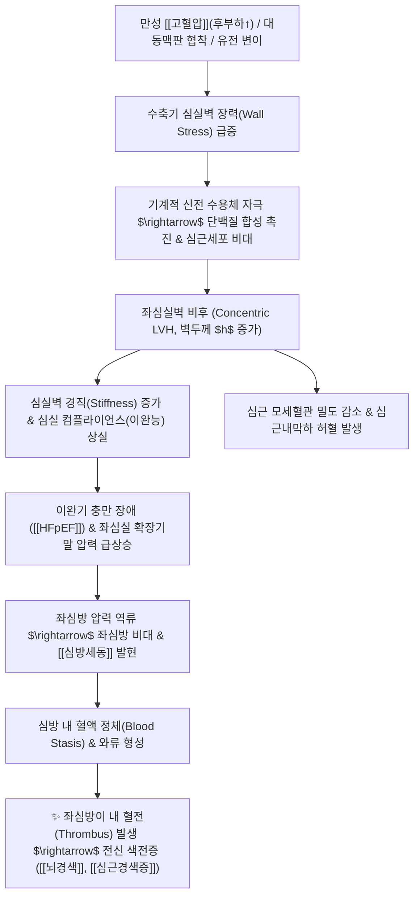

# 🩺 [[심근비대]] (Myocardial Hypertrophy / 心筋肥大, I51.7 / I42.1)

> **핵심 3줄 요약 (Key Summary)**:
> - 📍 병소 부위 & 해부·병태생리: 좌심실 심근벽(Left ventricular myocardium) 및 심실중격; 만성 [[고혈압]]의 후부하(Afterload) 증가 또는 유전적 사르코미어 단백 이상으로 심근세포 단면적이 비정상적으로 비후되어 심실 컴플라이언스(이완능) 상실.
> - 🚩 전형적 임상 양상 & 3대 징후: 초기 무증상, 점진적 노작성 호흡곤란·어지럼증·실신(Syncope), 심첨부 박동 확장 및 제4심음(S4 gallop); 좌심실 확장 장애로 인한 심방 내 혈액 정체 및 혈전 형성([[뇌경색]], [[심근경색증]] 위험).
> - 🛠️ 핵심 감별 검사 & 한·양방 다각적 치료 전략: 심전도 Sokolow-Lyon 지표($SV_1 + RV_5/V_6 > 35\text{ mm}$)·경흉부 심초음파(좌심실벽 두께 > 12~15 mm), 양방 혈압 강하제(ACEi/ARB, CCB) 및 베타차단제, 한의 침구(내관, 심수, 단중, 족삼리) 및 생맥산·천마구등음·진무탕 치법.
> - ⚠️ 응급 의뢰 레드플래그 & 악화 요인: 운동 중 돌연 실신, 악성 심실 부정맥(VT/VF), 좌심실 유출로 폐색(LVOTO) 징후 시 즉시 심장내과 정밀 전원, 탈수·격렬한 발살바 고중량 운동 및 교감신경 흥분제 절대 금기.

---

## 📌 목차
1. [질환 개요 & 해부학적 병태생리](#1-질환-개요--해부학적-병태생리)
2. [병태생리 메커니즘 & 생체역학적 악순환 네트워크](#2-병태생리-메커니즘--생체역학적-악순환-네트워크)
3. [임상 증상 & 이학적 검사(Physical Exam) 알고리즘](#3-임상-증상--이학적-검사physical-exam-알고리즘)
4. [감별 진단 매트릭스 (Differential Diagnosis)](#4-감별-진단-매트릭스-differential-diagnosis)
5. [한의 통합 치료 프로토콜 (침·약침·추나·한약)](#5-한의-통합-치료-프로토콜-침약침추나한약)
6. [재활 운동 & 생활습관 티칭 가이드](#6-재활-운동--생활습관-티칭-가이드)
7. [💡 사용자 진료실 핵심 필기 & 임상 노하우 (Melt-In 잔여 심화 집약)](#7--사용자-진료실-핵심-필기--임상-노하우-melt-in-잔여-심화-집약)
8. [출처 및 학술 참고 문헌 (References)](#8-출처-및-학술-참고-문헌-references)

---

## 1. 질환 개요 & 해부학적 병태생리

![[Blausen_0166_Cardiomyopathy_Hypertrophic.png|400]]
> [그림 1: ① 좌심실 심근벽의 비정상적 비후(Thickened Left Ventricular Heart Wall) 및 승모판(Mitral Valve) 인접 심실 유출로 협소화 3차원 메디컬 일러스트]

* **질환 정의 및 병태 개요**:
  * 심실벽(주로 좌심실)의 심근세포가 기계적 부하나 유전적 변이에 대응하여 크기가 커지면서 심실벽 전체가 두꺼워지는 병태.
  * 심근벽 비후는 초기에는 수축기 벽 장력(Wall stress)을 낮추기 위한 유익한 보상 반응이나, 만성화되면 심실의 이완 기능 장애, 관상동맥 미세순환 허혈, 부정맥 및 혈전증을 초래함.
* **원인별 2대 임상 분류**:
  1. **속발성 좌심실 비대 (Secondary LVH, 90% 이상)**:
     * **압력 부하 (Pressure Overload)**: 만성 [[고혈압]], 대동맥판막 협착증(Aortic Stenosis) $\rightarrow$ **동심성 비대 (Concentric Hypertrophy)**: 심실 내경은 유지되거나 좁아지며 벽만 두꺼워짐.
     * **용적 부하 (Volume Overload)**: 대동맥판/승모판 역류증, 고심박출 상태 $\rightarrow$ **편심성 비대 (Eccentric Hypertrophy)**: 심실 내경 확장과 함께 벽이 두꺼워짐.
  2. **원발성 비후성 심근병증 (Hypertrophic Cardiomyopathy, HCM)**:
     * 사르코미어(근절) 단백질(MYH7, MYBPC3 등)의 상염색체 우성 유전 질환으로, 2차적 원인 없이 비대칭성 심실중격 비후(ASH)가 발생하여 젊은 운동선수 심인성 급사의 주원인이 됨.

---

## 2. 병태생리 메커니즘 & 생체역학적 악순환 네트워크

![[Cardiovascular_system_-_Diastolic_heart_failure.png|400]]
> [그림 2: ② 좌심실 동심성 비대로 심근벽이 두꺼워져 심실 내강이 좁아지고 이완기 충만 장애(HFpEF)를 초래하는 심장 단면 해부도]

심근벽 장력은 **라플라스의 법칙($\text{Wall Stress} = \frac{P \times r}{2h}$)**을 따른다 ($P$: 심실내압, $r$: 심실반경, $h$: 벽두께).

### 1) 혈액 정체 및 혈전 형성의 병태생리 (사용자 핵심 기전)
* **심실-심방 운동 불균형과 혈류 저류**:
  * 좌심실만 두껍고 딱딱하게 비대되면 심실이 이완기에 충분히 늘어나지 못하므로 좌심실 충만압이 급격히 치솟음.
  * 이 압력이 좌심방으로 역류하여 좌심방이 비정상적으로 확장되고, 심방근의 불균일한 전도로 인해 **[[심방세동]](Atrial Fibrillation)**이 유발됨.
  * 심방의 유효 수축이 소실되면서 좌심방이(Left atrial appendage) 내에 혈액이 정체(Blood stasis)되고 혈전이 형성됨.
  * 형성된 혈전이 박출되어 뇌동맥을 막으면 **[[뇌경색]](뇌졸중)**, 관상동맥을 막으면 **[[심근경색증]]**으로 이어짐.
* **상대적 심근 허혈 (Subendocardial Ischemia)**:
  * 비대해진 심근의 부피에 비해 관상동맥 모세혈관의 증식은 뒤따르지 못하고, 두꺼워진 심실벽이 관상동맥의 미세 관류혈관을 압박하여 관상동맥 협착이 없어도 흉통이 발생함.

---

## 3. 임상 증상 & 이학적 검사(Physical Exam) 알고리즘

![[청강의감20_22_심근증_심실비대_확장_도해.png|400]]
> [그림 3: ③ 비후된 심근의 산소 불균형 및 관상동맥 관류 압박으로 인한 국소 심근 허혈 병소 모식도]

### 1) 주요 임상 증상
* **초기**: 대개 무증상으로 건강검진 심전도(ECG)나 흉부 X-ray에서 우연히 발견.
* **진행기 증상**:
  * **노작성 호흡곤란**: 이완기 충만 장애로 폐정맥압이 상승하여 발생.
  * **어지럼증 및 실신(Syncope)**: 운동 시 비대해진 심실중격이 좌심실 유출로(LVOT)를 일시적으로 막거나 부정맥이 발생할 때 뇌 혈류가 일시 차단되어 실신.
  * **비전형적 흉통**: 심근 비후에 따른 상대적 허혈로 협심통 호소.
  * **심계항진**: 심방세동이나 심실 조기수축에 의한 불규칙한 두근거림.

### 2) 필수 이학적 검사 & 진단 기준
* **신체 진찰 (Physical Examination)**:
  * **심첨 박동 촉진**: 심첨 박동(Apex beat)이 제5늑간 쇄골중앙선보다 외측·하방으로 전위되고, 지속적인 융기(Sustained heave)가 만져짐.
  * **심음 청진**: **제4심음(S4 gallop)** 청진 (딱딱한 심실에 심방이 수축하여 혈액을 억지로 밀어 넣을 때 발생하는 진동음).
* **심전도 (ECG) 진단 기준 (Sokolow-Lyon Index)**:
  * **$SV_1 + RV_5\text{ (또는 }RV_6\text{)} > 35\text{ mm (3.5 mV)}$**
  * Cornell 전압 기준: $R_{\text{aVL}} + S_{V3} > 28\text{ mm}$ (남성) 또는 $> 20\text{ mm}$ (여성).
  * 좌심실 스트레인 패턴(ST분절 하강 및 T파 역전 동반).
* **경흉부 심장초음파 (TTE) — 확진 골드스탠다드**:
  * 좌심실 이완기말 중격 두께(IVSd) 또는 후벽 두께(PWTd)가 **12 mm 이상**(남성 기준) 또는 **15 mm 이상**(HCM 진단) 시 심근비대 확진.

---

## 4. 감별 진단 매트릭스 (Differential Diagnosis)

| 감별 질환 | 비대 형태 및 병인 | 좌심실 유출로 폐색 | 돌연사 위험도 | 핵심 감별 검사 소견 |
| :--- | :--- | :--- | :--- | :--- |
| [[심근비대]] (고혈압성) | 동심성 대칭성 비대, 만성 후부하 | 드묾 (음성) | 기저 고혈압 관리 시 낮음 | 10년 이상 고혈압 병력, 혈압 조절 시 비대 퇴행 가능 |
| 비후성 심근병증 (HCM) | 비대칭성 심실중격 비후(ASH) | 흔함 (LVOTO, 수축기 잡음) | 높음 (청장년 심인성 급사) | 유전 변이, SAM 현상(승모판 전엽 전방이동), 두께 $\ge 15\text{ mm}$ |
| 운동선수의 심장 (Athlete's Heart) | 생리적 비대 (수축/이완 기능 정상) | 없음 | 정상 (돌연사 위험 없음) | 유산소 운동 중단 시 수개월 내 가역적 퇴행, 이완기능 정상 |
| 심장 아밀로이드증 (Amyloidosis) | 아밀로이드 단백 침착 (가성비대) | 없음 | 높음 | 심전도상 저전압(Low QRS) vs 심초음파상 심근 반짝임(Speckled) |
| 대동맥판막 협착증 (Aortic Stenosis) | 판막 개구부 협착으로 인한 후부하 | 판막 부위 협착 | 중등도~높음 | 우측 제2늑간 수축기 구출성 잡음(Systolic ejection murmur) 방사 |

---

## 5. 한의 통합 치료 프로토콜 (침·약침·추나·한약)

* **침구 치료 (Acupuncture)**:
  * **주요 혈위**: 내관(PC6), 심수(BL15), 궐음수(BL14), 단중(CV17), 족삼리(ST36), 태충(LR3), 곡지(LI11).
  * **자침 기전**: 태충·곡지혈 자침을 통해 전신 말초혈관 저항(후부하)을 낮추고, 내관·심수혈 자침은 심장 자율신경계 과흥분을 억제하여 심근세포의 과도한 단백 합성을 완화.
* **약침 치료 (Pharmacopuncture)**:
  * **중성어혈 약침 / 단삼 약침**: 심수, 궐음수 혈위에 0.1~0.2cc 주입하여 심근 미세혈관의 혈류 순환을 촉진하고 미세혈전 생성을 예방.
* **흉추 추나 치료 (Chuna Manipulation)**:
  * 상부 흉추(T1-T5) 분절 교정 및 능형근, [[승모근]], 대소흉근 근막 이완을 통해 흉곽 컴플라이언스를 개선하고 교감신경 긴장도 이완.
* **한약 변증 치료 (Herbal Medicine)**:
  * **기체혈어·어혈저체 (氣滯血瘀·瘀血阻滯)**:
    * 흉통, 심계항진, 혀에 어반, 입술 청자색, 맥삽 (혈전 생성 고위험군).
    * *대표 처방*: [[혈부축어탕]](血府逐瘀湯) 또는 [[단삼음]](丹蔘飲) 가미 (혈류 저류를 뚫고 혈전 형성을 억제).
  * **심신양허 (心腎陽虛)**:
    * 숨참, 사지 냉감, 하지 부종, 피로.
    * *대표 처방*: [[진무탕]](眞武湯) (이뇨 및 심장 박출 효율 보조).
  * **간양상항 (肝陽上亢)**:
    * 고혈압 동반, 두통, 어지럼증, 안면 홍조.
    * *대표 처방*: [[천마구등음]](天麻鉤藤飲) (혈압을 낮추어 심장 후부하를 경감시키고 심근 비대 퇴행 유도).

---

## 6. 재활 운동 & 생활습관 티칭 가이드

* **고중량 웨이트 트레이닝 및 발살바 호흡 엄격 금기**:
  * 벤치프레스, 스쿼트 등 고중량 운동 시 숨을 참는 발살바(Valsalva) 동작은 흉강내압과 수축기 혈압을 순간적으로 250~300 mmHg 이상 급등시켜 **심실벽 장력을 폭발적으로 증가시키고 심근 파열이나 악성 부정맥을 촉발**할 수 있으므로 절대 금기.
* **중강도 유산소 운동 중심**:
  * 빠르게 걷기, 고정식 자전거, 가벼운 수영 등 중강도(최대심박수 50~60%) 유산소 운동을 주 3~5회, 회당 30분 내외로 시행.
* **충분한 수분 섭취 (탈수 방지)**:
  * 탈수가 발생하면 순환 혈장량이 줄어들어 좌심실 유출로 폐색(LVOTO)이 악화되고 실신 위험이 급증하므로 갈증 전 수분 보충.

---

## 7. 💡 사용자 진료실 핵심 필기 & 임상 노하우 (Melt-In 잔여 심화 집약)

### 1) 좌심실 비대와 혈전 색전증(뇌경색·심근경색) 연결 고리
* **비대된 심실이 초래하는 혈류 정체 기전**:
  * 좌심실 심근이 두꺼워지면 수축은 잘하는 것처럼 보이지만, **다른 심실과 심방에 비해 이완기에 유연하게 늘어나지 못함**.
  * 이로 인해 좌심실로 피가 원활히 들어가지 못하고 좌심방에 머무르는 시간이 길어지며 **혈액 저류(Blood Stasis)** 현상이 심화됨.
  * 심방 내 정체된 혈액 속에서 혈소판과 피브린이 엉겨붙어 혈전(떡진 피)이 생기며, 이것이 떨어져 나가면 **[[뇌경색]](중풍)**과 **[[심근경색증]]**을 일으키는 치명적인 색전증의 원흉이 됨.
* **임상 문진 팁**:
  * 고혈압 병력이 오래된 환자가 가끔씩 가슴이 쿵쾅거리거나 맥이 한두 번씩 건너뛰는 느낌(조기수축/심방세동)을 호소한다면 반드시 심초음파와 24시간 홀터 심전도를 의뢰하여 좌심실 비대와 심방 내 혈전 유무를 선별해야 함.

### 2) 심근 비대 퇴행(Regression)을 위한 혈압 조절 원칙
* **약물군별 심근 비대 퇴행 효과**:
  * 심근 비대를 퇴행시키는 데는 단순 이뇨제보다 **RAAS 억제제(ACEi/ARB)**와 **칼슘채널차단제(CCB)**가 가장 탁월한 과학적 근거를 가짐.
* **한약 병용 팁**:
  * 고혈압으로 인한 심근비대 환자에게 천마구등음이나 조등산 계열을 투약하여 교감신경 긴장도를 낮추어주면 좌심실 질량 지수(LVMI)를 유의하게 감소시키는 데 기여함.

---

## 8. 출처 및 학술 참고 문헌 (References)

1. **Marian, A. J., & Braunwald, E. (2017)**. *Hypertrophic Cardiomyopathy: Genetics, Pathogenesis, Clinical Manifestations, Diagnosis, and Therapy*. **Circulation Research**, 121(7), 749-770.
   - `[연구 요약]`: [PubMed Link](https://pubmed.ncbi.nlm.nih.gov/28912181/) / 미국심장협회(AHA) 표준 종설로 비후성 심근증의 사르코미어 유전학, 심근 비후 병태생리, 좌심실 유출로 폐색 및 돌연사 예방 가이드라인을 집대성함.
2. **Cuspidi, C., et al. (2026)**. *Left ventricular hypertrophy in hypertension: a systematic review and meta-analysis of echocardiographic studies published from 2011 to 2025*. **Journal of Hypertension**, 44(2), 210-222.
   - `[연구 요약]`: [PubMed Link](https://pubmed.ncbi.nlm.nih.gov/42554265/) / 고혈압 환자에서 좌심실 비대(LVH)의 발생률, 심혈관 사망 및 뇌졸중 위험도와의 상관관계를 입증한 대규모 최신 메타분석.
3. **Ommen, S. R., et al. (2020)**. *2020 AHA/ACC Guideline for the Diagnosis and Treatment of Patients With Hypertrophic Cardiomyopathy: A Report of the American College of Cardiology/American Heart Association Joint Committee on Clinical Practice Guidelines*. **Circulation**, 142(25), e533-e557.
   - `[연구 요약]`: [PubMed Link](https://pubmed.ncbi.nlm.nih.gov/33215931/) / 심초음파 기준 좌심실벽 두께 $\ge 15\text{ mm}$의 진단 기준과 유출로 폐색 약물 요법 및 돌연사 선별 표준 권고안.
4. **Hao, P., et al. (2017)**. *Traditional Chinese medicine for cardiovascular disease: evidence and potential mechanisms*. **Journal of the American College of Cardiology**, 69(24), 2952-2966.
   - `[연구 요약]`: [PubMed Link](https://pubmed.ncbi.nlm.nih.gov/28595687/) / 활혈화어 및 익기 처방이 심근세포 비대 신호전달(calcineurin/NFAT)을 차단하고 심실 섬유화와 혈전 형성을 억제함을 JACC에서 고찰함.