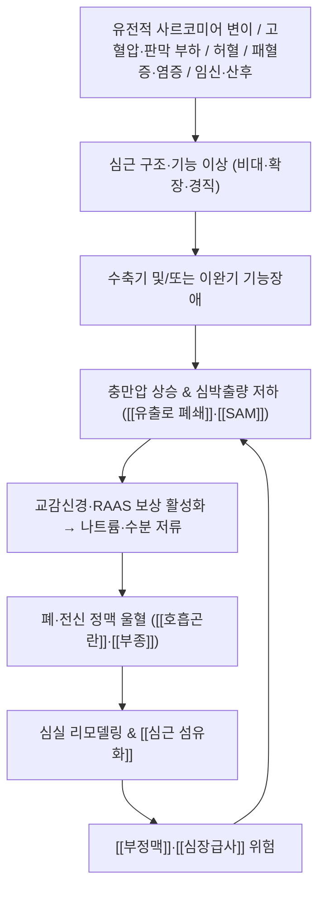

# 🩺 [[심근증]] (Cardiomyopathy / 心筋症, ICD-10 I42 / KCD I42 계열)

> **핵심 3줄 요약 (Key Summary)**:
> - 📍 병소 부위 & 해부·병태생리: 관상동맥질환·판막질환·고혈압 등 충분한 부하 원인 없이 **심근 자체([[심근세포]], [[사르코미어]])**의 구조·기능 이상이 발생하는 이질적 질환군. 좌심실을 중심으로 심벽 비후(HCM)·심실 확장(DCM)·이완 제한(RCM)이라는 세 가지 표현형으로 수렴하며, 최종적으로 [[심부전]]·[[부정맥]]·[[심장급사]]로 이어진다.
> - 🚩 전형적 임상 양상 & 3대 징후: ① 운동 시 [[호흡곤란]] 및 운동 내성 저하, ② [[흉통]]·[[실신]](특히 운동 중 실신은 위험 신호), ③ [[심계항진]]·말초 [[부종]]·기좌호흡. HCM에서는 유출로 폐쇄에 의한 수축기 잡음이, DCM에서는 S3 gallop과 전신 정맥울혈이 특징적이다.
> - 🛠️ 핵심 감별 검사 & 한·양방 다각적 치료 전략: [[심초음파]](TTE)가 진단의 축이며 ECG·CMR·BNP·Holter·운동부하검사·유전자검사 및 **가족 선별검사**를 조합한다. 한의학에서는 心悸·胸痺·水氣·喘證의 변증 체계로 접근하여 [[내관]](PC6)·[[신문]](HT7)·[[심수]](BL15)·[[전중]](CV17) 등을 활용한 침·약침과 [[보익제]]·[[활혈거어제]] 계열 처방을 양방 약물과 병용하되, **심근증에 대한 한의 치료의 직접적 임상 근거는 제공된 논문에서 확인되지 않음(근거 미확인)**.
> - ⚠️ 응급 의뢰 레드플래그 & 악화 요인: 운동 중 실신/경련, 지속성 [[심실빈맥]]·[[심실세동]], 급성 폐부종 및 심인성 쇼크, 젊은 연령의 심장급사 가족력, 산후 5개월 이내 발생한 심부전. 급성기에 강한 흉추 추나·고강도 전침·장시간 복와위는 절대 금기이거나 극히 제한한다.

---

## 📌 목차
1. [질환 개요 & 해부학적 병태생리](#1-질환-개요--해부학적-병태생리)
2. [병태생리 메커니즘 & 생체역학적 악순환 네트워크](#2-병태생리-메커니즘--생체역학적-악순환-네트워크)
3. [임상 증상 & 이학적 검사(Physical Exam) 알고리즘](#3-임상-증상--이학적-검사physical-exam-알고리즘)
4. [감별 진단 매트릭스 (Differential Diagnosis)](#4-감별-진단-매트릭스-differential-diagnosis)
5. [한의 통합 치료 프로토콜 (침·약침·추나·한약)](#5-한의-통합-치료-프로토콜-침약침추나한약)
6. [재활 운동 & 생활습관 티칭 가이드](#6-재활-운동--생활습관-티칭-가이드)
7. [💡 사용자 진료실 핵심 필기 & 임상 노하우 (Melt-In 잔여 심화 집약)](#7--사용자-진료실-핵심-필기--임상-노하우-melt-in-잔여-심화-집약)
8. [출처 및 학술 참고 문헌 (References)](#8-출처-및-학술-참고-문헌-references)

---

## 1. 질환 개요 & 해부학적 병태생리

![[심근증_3.jpg|540]]
> [그림 1: Echocardiographic study performed at the age of 6 years shows dilated leftchambers, spongy left ventricle, and noncompac]

![[심근증_1.jpg|540]]
> [그림 2: 202410 Cardiomyopathy.svg]

![[심근증_2.jpg|540]]
> [그림 3: 68-year-old female with takotsubo cardiomyopathy. Coronary angiogram obtained at time of acute decompensation demonstrat]

* **질환 정의 및 분류**:
  * **정의**: 심근증(심근병증)은 관상동맥질환, [[고혈압]], 판막질환, 선천성 심질환 등 **심근에 충분한 부하를 줄 만한 다른 원인이 없는 상태에서** 심근 자체의 구조적·기능적 이상이 발생하는 이질적인 질환군이다(Brieler & Breeden, 2017). 즉 "심장이 커지고/두꺼워지고/뻣뻣해졌는데, 그 원인이 관상동맥이나 판막이 아니라 심근 자체"인 경우를 지칭한다는 임상적 감별 원칙이 핵심이다.
  * **주요 표현형 분류**(Brieler & Breeden, 2017 / Lipshultz & Law, 2019):
    | 표현형 | 구조적 특징 | 기능적 특징 | ICD-10(참고) |
    | :--- | :--- | :--- | :--- |
    | [[확장성심근증]] (DCM) | 좌심실 확장, 벽 두께 정상~감소 | 수축기 기능 저하(LVEF 감소) | I42.0 |
    | [[비후성심근증]] (HCM) | 좌심실 비대(흔히 비대칭 중격) | 이완기 기능장애 ± 유출로 폐쇄 | I42.1(폐쇄성)/I42.2(기타) |
    | [[제한성심근증]] (RCM) | 벽 두께 정상, 심방 확장 | 심실 이완 제한, 충만압 상승 | I42.5 |
    | [[부정맥성 우심실심근증]] (ARVC) | 우심실 지방·섬유화 대체 | 심실성 부정맥, 우심실 기능장애 | I42.8 |
    | [[좌심실심근치밀화부전]] (LVNC) | 심근 과소통(trabeculation) | 수축기 기능 저하 동반 가능 | I42.8 |
    | [[산후심근증]] (PPCM) | 좌심실 확장 | 수축기 기능 저하 | O90.3 |
    | [[패혈성심근증]] | 구조 변화 없거나 경미 | 가역적 수축기/이완기 기능장애 | — |
    * ※ KCD 코드는 ICD-10 체계를 준용하나 세부 코드 매핑은 **근거 미확인**(기관별 청구 코드 확인 필요).
  * **역학**: HCM의 유병률은 약 **500명당 1명(1:500)** 수준으로 보고된다(Maron, 2018). DCM·RCM의 정확한 국내 유병률, 성별·연령별 발생률, 직업군별 특이 소견은 제공된 논문에서 확인되지 않음(**근거 미확인**).
  * **연령 특성**: 소아에서도 DCM, HCM, RCM, LVNC, ARVC가 모두 발생하며, 성인과 달리 **원인 규명과 유전자 검사, 가족 선별검사**가 진단 과정의 필수 요소로 강조된다(Lipshultz & Law, 2019).
  * **특수 임상 상황**: 임신·산후(Schaufelberger, 2019), 패혈증(Hiraiwa & Kasugai, 2024) 등 특정 상황에서 나타나는 이차성·가역성 심근 기능장애는 별도로 평가해야 하며, 이는 치료 전략을 근본적으로 바꾼다.

* **관련 해부학적 구조물**:
  * **심근 및 심실**: [[좌심실]]이 일차 병소이며, HCM에서는 중격 비후와 [[유출로(LVOT)]]가, DCM에서는 좌심실 전체의 확장과 벽응력 증가가, RCM에서는 심실 벽의 경직성 증가가 핵심이다. ARVC에서는 [[우심실]]이 주 병소이다.
  * **판막 및 판막하 구조**: HCM에서 비후된 중격이 승모판 앞첨판을 끌어당겨 **수축기 전방운동(SAM, systolic anterior motion)** 과 [[승모판역류]]를 유발하며, 이는 좌심실 유출로 폐쇄를 악화시키는 해부학적 핵심 기전이다(Geske & Ommen, 2018; Maron, 2018).
  * **심방 및 전도계**: 충만압 상승과 이완기 장애는 좌심방 확장 및 [[심방세동]] 위험을 높이고, 섬유화는 전도계를 침범하여 각종 [[부정맥]] 및 심장급사 위험과 직결된다(Maron, 2018).
  * **관련 근육·근막(한의 접근 관점)**: 흉곽 및 경흉추 주위 근육군([[흉추기립근]], [[전거근]], [[대흉근]], [[횡격막]])의 긴장은 호흡 보조근 과사용과 흉곽 팽창 제한을 통해 호흡곤란 인식을 증폭시킬 수 있어, 이완 치료의 표적이 된다.
  * **신경 및 자율신경**: 교감신경 항진은 심박수 및 심근 산소요구량을 증가시켜 증상을 악화시키며, [[미주신경]](부교감) 긴장 저하는 부정맥 취약성을 높인다. 심장 자체의 자율신경 조절 이상은 **근거 미확인**이나 임상적으로 교감 항진 관리가 중요하다.

---

## 2. 병태생리 메커니즘 & 생체역학적 악순환 네트워크

### 1) 표현형별 핵심 병태생리

* **비후성심근증(HCM)**:
  * 유전적 배경으로 **사르코미어 단백질 유전자 변이**가 핵심이며, 상염색체 우성 유전 양상을 보인다(Maron, 2018). 구체적 변이 유전자명 및 각 유전자별 침투율은 제공된 논문의 서지 정보 수준에서는 **근거 미확인**(개별 유전자 검사 결과로 확인).
  * 비후된 심근은 **이완기 충만 장애**를 일으켜 충만압이 상승하고, 중격 비후 + SAM + 승모판 역류의 조합은 **역동적 좌심실 유출로 폐쇄**를 만든다. 이 폐쇄는 전부하 감소 시(기립, Valsalva, 탈수, 음주) 심해지고, 후부하 증가 시(쪼그려 앉기, 악력) 완화되는 **동적 특성**을 갖는다(Geske & Ommen, 2018).
  * 심근 섬유화 및 미세혈관 기능 이상은 [[심실빈맥]]과 심장급사의 구조적 기질이 된다(Maron, 2018).

* **확장성심근증(DCM)**:
  * 심근 수축력 저하 → 좌심실 확장 → 심박출량 감소 → RAAS 및 교감신경 보상 활성화 → 나트륨·수분 저류 및 말초혈관 수축 → 벽응력(law of Laplace) 증가 → 추가 확장이라는 **신경호르몬 매개 악순환**이 형성된다(Brieler & Breeden, 2017).
  * 좌심실 내 혈류 정체는 **심내 혈전 및 전신 색전** 위험을 높이며, 이는 한의학의 瘀血 개념과 임상적으로 대응된다(혈전 관련 태그 참조). 색전 위험의 정량적 기준(예: LVEF 컷오프)은 **근거 미확인**.

* **제한성심근증(RCM)**:
  * 심실 벽 경직성 증가로 이완기 충만이 제한되고, 좌·우 심방이 확장되며 폐 및 전신 정맥 울혈이 우세하게 나타난다. 침윤성 질환(아밀로이드증, 사르코이드증 등)과의 감별이 필수적이다(Brieler & Breeden, 2017).

* **패혈성심근증(Septic cardiomyopathy)**:
  * 패혈증에 동반되어 **좌심실 및 우심실의 수축기·이완기 기능장애**가 나타나는 가역적 형태로, 국소 벽운동 이상이나 다발성 저운동(global hypokinesia) 형태로 관찰되며 **수일 내 회복**되는 경향이 있다(Hiraiwa & Kasugai, 2024).
  * 일부는 Takotsubo 양상과 유사한 벽운동 이상을 보인다(Hiraiwa & Kasugai, 2024).
  * 진단은 심초음파가 중심이며, 치료의 초점은 심장 자체보다 **패혈증 원인 치료와 혈역학 안정화**에 있다. 수축촉진제 사용은 신중히 판단해야 한다(Hiraiwa & Kasugai, 2024).

* **임신·산후 관련(Peripartum cardiomyopathy)**:
  * 임신은 혈장량 및 심박출량 증가라는 혈역학적 부하를 유발하여, 기존 심근증(DCM/HCM)을 가진 산모에서 **심부전 및 부정맥 악화 위험**을 높인다(Schaufelberger, 2019).
  * 산후심근증은 임신 말기~산후 수개월 이내 발생하는 좌심실 수축기 기능 저하로 정의되며, **다학제(산과·심장내과·신생아과) 관리**가 필수적이다(Schaufelberger, 2019). 정확한 발생 시기 컷오프 및 발생률은 **근거 미확인**.

### 2) 보상성 연쇄 반응 (Kinetic Chain 관점)
* **호흡근 과부하 연쇄**: 폐울혈 → 호흡 보조근(사각근, 흉쇄유돌근, 횡격막) 과사용 → 경흉추 및 상흉곽 긴장 → 흉곽 팽창 제한 → 호흡곤란 악화의 순환이 형성되며, 이는 심장 기능 자체와 별개로 **환자 주관적 호흡곤란을 증폭**하는 축이다.
* **자율신경 연쇄**: 심박출량 저하 → 교감신경 항진 → 심박수·심근 산소요구량 증가 → 허혈 역치 저하 → 흉통 악화 → 불안·수면장애 → 다시 교감 항진. 이 고리를 끊는 것이 한의 치료(이완·안정·수면 개선)의 실질적 표적이 된다.
* **전신 순환 연쇄**: 정맥울혈 → 간비대·복수·하지 부종 → 보행량 감소 → 근감소 및 심장재활 저해 → 운동 내성 추가 저하(Brieler & Breeden, 2017).

---

## 3. 임상 증상 & 이학적 검사(Physical Exam) 알고리즘

### 1) 주소증 및 임상 증상

* **호흡기 및 순환기 증상**:
  * 운동 시 [[호흡곤란]](가장 흔한 초기 증상), 기좌호흡, 발작성 야간 호흡곤란, 운동 내성 저하.
  * [[흉통]](특히 HCM에서 운동 시 발생하는 비전형적 흉통), [[심계항진]], 어지럼.
* **실신 및 전신 증상**:
  * **운동 중 실신**은 HCM에서 심장급사의 강력한 경고 신호로 취급된다(Maron, 2018).
  * DCM/RCM 진행 시 피로감, 식욕 저하, 체중 증가(부종), 소변량 감소, 야간뇨.
* **산후 특이 증상**: 분만 전후 발생한 호흡곤란·부종·기좌호흡은 산후심근증을 반드시 고려해야 한다(Schaufelberger, 2019).
* **패혈증 동반 상황**: 발열·저혈압·젖산 상승 등 패혈증 소견과 함께 심초음파에서 심기능 저하가 확인되는 경우(Hiraiwa & Kasugai, 2024).
* **소아 특이 소견**: 영아에서는 수유 곤란, 발한, 성장 부진, 보챔 등 비특이적 증상으로 발현될 수 있어 진단 지연 위험이 크다(Lipshultz & Law, 2019).

### 2) 필수 이학적 검사법 (Physical Examination)

* **[[심음 청진]](Cardiac Auscultation)**:
  * **HCM**: 좌측 흉골연에서 들리는 거친 수축기 잡음이 특징적이며, **Valsalva 및 기립 시 증폭**(전부하 감소 → 유출로 폐쇄 악화), **쪼그려 앉기 및 악력(handgrip) 시 감소**(후부하 증가 → 폐쇄 완화)하는 동적 변화가 감별의 핵심이다(Geske & Ommen, 2018).
  * **DCM**: S3 gallop(third heart sound), 승모판 역류성 수축기 잡음, 폐저부 수포음.
  * **RCM**: 이완기 충만 장애와 관련된 심음 소견 및 경정맥압 상승.
* **[[경정맥압(JVP) 평가]]**: 경정맥 확장은 우심 충만압 상승 및 체액 저류를 시사한다(Brieler & Breeden, 2017).
* **[[하지 부종 및 간비대 촉진]]**: 전신 정맥울혈 평가.
* **[[혈압 측정 및 기립성 혈압 반응]]**: HCM에서 유출로 폐쇄가 있는 환자는 혈압 반응이 비정상적일 수 있으므로 자세 변화 시 혈압·증상 변화를 확인한다.
* **[[NYHA 기능 분류]]**: 증상 중증도 및 치료 반응 판정의 표준 지표.
* **[[심전도(EKG)]]**: LVH 소견, T파 역전, 병적 Q파, 전도장애, 부정맥 확인. ARVC에서는 특유의 전기적 소견이 관찰될 수 있다(구체적 파형 명칭 및 진단 기준은 **근거 미확인**).
* **[[심초음파(TTE)]]**: 진단의 중심 검사. 심실 크기·벽 두께·수축기 기능(LVEF)·이완기 기능·판막 이상·유출로 압력차(LVOT gradient)·SAM 여부를 평가한다. HCM에서 유출로 폐쇄의 **유발(provocative) 평가**가 중요하다(Geske & Ommen, 2018).
* **[[심장 MRI(CMR)]]**: 심근 섬유화(LGE) 및 구조적 이상 평가, 위험도 층화에 활용(Maron, 2018). 구체적 LGE 정량 컷오프는 **근거 미확인**.
* **[[BNP/NT-proBNP]]**: 심부전 동반 여부 및 중증도 보조 지표.
* **[[Holter/이벤트 모니터링]]**, **[[운동부하검사]]**: 부정맥 및 운동 유발 증상 평가.
* **[[유전자 검사 및 가족 선별검사]]**: HCM 및 소아 심근증에서 권고된다(Maron, 2018; Lipshultz & Law, 2019).

---

## 4. 감별 진단 매트릭스 (Differential Diagnosis)

| 감별 질환 | 호발 병소 및 원인 | 주소증 차이점 | 특이적 이학적 검사 소견 |
| :--- | :--- | :--- | :--- |
| [[비후성심근증]] (본 질환, HCM) | 좌심실 중격 비후, 사르코미어 변이 | 운동 시 호흡곤란·흉통·실신, 젊은 층 심장급사 가족력 | Valsalva/기립 시 잡음 증폭, squat/handgrip 시 감소, [[SAM]] |
| [[고혈압성 심장질환]] | 만성 압부하에 의한 좌심실 비후 | 장기 고혈압 병력, 서서히 진행하는 호흡곤란 | 혈압 상승, 좌심실 비후(대칭성 경향), 유출로 폐쇄는 드묾 |
| [[대동맥판협착증]] | 판막 석회화·변성 | 운동 시 실신·협심증·호흡곤란 3대 증상 | 잡음이 **증가**(handgrip 시 감소? → 판막 기원 잡음의 고전적 특징은 근거 미확인), 심첨부 방사 |
| [[허혈성 심근병증]](관상동맥질환) | 관상동맥 협착·경색 후 리모델링 | 흉통이 운동과 명확히 연관, 국소 벽운동 이상 | 국소 벽운동 이상, 허혈 유발검사 양성 |
| [[심근염]] | 바이러스 등 염증성 | 최근 감염 후 급성 심부전·부정맥 | 급성 경과, 염증 지표 상승(개별 기준 **근거 미확인**) |
| [[운동선수 심장]](Athlete's heart) | 생리적 적응성 비후 | 무증상, 운동 수행 능력 정상~우수 | 비후 정도가 경계성, 이완기 기능 정상, deconditioning 시 호전 |
| [[심낭삼출/심장눌림증]] | 심낭 질환 | 기좌호흡보다는 전신 울혈·저혈압 | 기이맥, 심음 감소(구체적 기준 **근거 미확인**) |
| [[패혈성심근증]] | 패혈증 | 발열·저혈압·쇼크가 우세, 심부전 증상은 상대적으로 이차적 | 심초음파상 전반적 저운동, 수일 내 회복 경향(Hiraiwa & Kasugai, 2024) |
| [[산후심근증]] | 임신 말기~산후 | 산후 호흡곤란·부종, 산과력 확인 필수 | 좌심실 확장 및 수축기 기능 저하(Schaufelberger, 2019) |

---

## 5. 한의 통합 치료 프로토콜 (침·약침·추나·한약)

> ⚠️ **근거 수준 명시**: 아래 한의 치료 내용은 전통적 변증 체계 및 임상 관행에 기반한 것이며, **제공된 6편의 논문에서는 심근증에 대한 침·약침·추나·한약의 직접적 임상 근거가 확인되지 않음(근거 미확인)**. 따라서 서양의학적 표준 치료(심부전 약물, ICD, 중격 감축술 등)를 대체하지 않는 **보조·병행 요법**으로만 위치시켜야 한다.

* **변증 접근 (辨證)**:
  * [[심기허]](心氣虛): 운동 시 호흡곤란, 피로, 무력감, 맥 결대.
  * [[심양허]](心陽虛): 냉감, 부종, 소변량 감소, 맥 침세.
  * [[기음양허]](氣陰兩虛): 심계, 도한, 구건, 맥 세삭.
  * [[심혈어조]](心血瘀阻): 고정성 흉통, 청색증, 설질 자암.
  * [[담탁조체]](痰濁阻滯): 흉민, 체중 증가, 설태 후니.
  * [[수기능심]](水氣凌心): 심한 부종, 기좌호흡, 맥 침.
  * ※ 변증별 진단 정확도 및 치료 반응에 대한 정량적 근거는 **근거 미확인**.

* **침구 치료 (Acupuncture)**:
  * 타겟 혈위: [[내관]](PC6, 심흉부 주소증의 제1선), [[신문]](HT7, 安神·心悸), [[전중]](CV17, 心包募穴), [[거궐]](CV14), [[심수]](BL15)·[[궐음수]](BL14)(배수혈), [[족삼리]](ST36)·[[삼음교]](SP6)(氣血 보강), [[태충]](LR3)(간양 억제).
  * 전침 사용 시: **부정맥 병력 및 [[ICD]]/[[심박동기]] 삽입 환자에서는 전기 자극이 기기 기능에 영향을 줄 수 있으므로 전침 및 전기 자극 기기는 사용하지 않거나 심장내과 협진 하에 극히 제한**한다(구체적 기기별 안전 데이터는 **근거 미확인**). 수기 자극 위주의 저자극 자침이 원칙이다.
  * 자극 강도: 심부전 환자는 자율신경 반응이 취약하므로 강자극·장시간 유침(20분 이상)을 피하고, 시술 중 어지럼·흉민·심계 악화 여부를 상시 관찰한다.
* **약침 치료 (Pharmacopuncture)**:
  * 경혈 부위(내관, 신문, 전중 등) 소자극 자극 및 흉추 주위 근긴장 완화 목적으로 고려 가능하나, **심근증에서의 약침 안전성 및 유효성 근거는 확인되지 않음(근거 미확인)**.
  * 항응고제·항혈소판제 복용 환자는 출혈 위험이 있으므로 자입 깊이를 줄이고 압박 지혈을 철저히 한다. 패혈증 동반 환자에서는 시술 전 감염 상태를 반드시 확인한다.
* **추나 치료 (Chuna Manipulation)**:
  * 적용 범위: 흉곽 호흡 보조근 및 경흉추 주위 근막 이완(JS 수기 등 **저강도 이완 기법**), 경추·흉추 가동성 개선.
  * 금기: 급성 심부전 악화기, 급성 폐부종, 저혈압·쇼크, 최근 심실성 부정맥, ICD 삽입 직후. **고속·고진폭(HVLA) 흉추 교정 수기는 심장 미주신경 반응 및 혈역학 변동 위험으로 금기**로 본다(구체적 위험도 데이터는 **근거 미확인**).
  * 체위: 복와위는 호흡곤란 환자에서 악화될 수 있으므로 **반좌위 또는 측와위**를 우선 고려한다.
* **한약 치료 (Herbal Medicine)**:
  * 급성기·어혈·울혈 우세: [[활혈거어제]] 계열(예: [[혈부축어탕]] 계열) — 재래 처방의 심근증에 대한 임상시험 근거는 **근거 미확인**.
  * 만성기·기혈 허약: [[보익제]] 계열(예: [[생맥산]], [[보양환오탕]] 등) — 마찬가지로 **근거 미확인**.
  * 이완기 심부전 및 수기凌心 양상: [[영계출감탕]] 등 전통 처방 고려 가능(근거 미확인).
  * **한약-양방 상호작용**: 디곡신, 항응고제(와파린, DOAC), 이뇨제와의 상호작용은 처방별로 상이하며, **개별 상호작용 데이터는 근거 미확인**. 양방 주치의와 반드시 공유한다.
* **병행 원칙**: 심부전/부정맥/심장급사 위험 관리의 주축은 어디까지나 양방 표준 치료이며, 한의 치료는 증상 조절·삶의 질·자율신경 안정 목적의 보조로 사용한다.

---

## 6. 재활 운동 & 생활습관 티칭 가이드

* **운동 처방의 기본 원칙**:
  * 운동 강도·종류는 **표현형과 위험도 평가(심장급사 위험, 유출로 폐쇄 정도, 부정맥 유무)에 따라 개별화**해야 한다. HCM 환자의 경우 고강도 경쟁적 운동은 일반적으로 제한 대상이며, 구체적 스포츠별 참여 기준은 각 지침에서 확인해야 한다(Maron, 2018 — 구체적 종목별 기준은 **근거 미확인**).
  * DCM 및 심부전 환자는 **심장재활 프로그램** 형태의 감독 하 저강도 유산소 운동이 기본이며, 운동 전후 증상 및 체중 변화를 기록한다.
* **이완 및 스트레칭 (Stretching)**:
  * 호흡 보조근(사각근, 흉쇄유돌근, 상부 승모근) 및 흉곽 확장을 위한 정적 스트레칭을 하루 1~2회, 각 20~30초.
  * 횡격막 호흡 훈련: 코로 4초 흡기, 입으로 6~8초 호기(호기 연장) → 자율신경 안정 목적.
* **강화 및 안정화 운동 (Strengthening)**:
  * 미세 중량(0.5~1kg) 또는 자중 이용한 하지·체간 저강도 근력 운동. **Valsalva 유발(무거운 중량, 숨 참기)은 HCM에서 유출로 폐쇄를 악화시킬 수 있어 금지**한다.
  * 하지 정맥 환류를 돕는 발목 펌프 운동(ankle pump)은 부종 완화에 유용하다.
* **신경 활주 운동 (Neurodynamics)**:
  * 흉곽 출구 및 경흉추 주위 신경긴장 완화 목적의 부드러운 신경 슬라이딩은 가능하나, 심장 증상을 유발하는 자세·동작은 즉시 중단한다. 심근증 자체에 대한 신경 활주 운동의 효과 근거는 **근거 미확인**.
* **일상생활 자세 및 환경 티칭 (Ergonomics & Self-care)**:
  * **수면**: 기좌호흡이 있는 경우 베개를 높인 반좌위. 야간 호흡곤란 시 즉시 병원 연락.
  * **염분 및 수분 관리**: 저염식(가공식품·국물·젓갈 제한), **매일 아침 동일 조건에서 체중 측정**하여 2~3일 내 급격한 증가(체액 저류 신호)를 조기에 발견.
  * **음주·흡연**: 금주·금연 필수. 특히 HCM에서 음주는 탈수 및 유출로 폐쇄 악화, 부정맥 유발 위험을 높인다.
  * **탈수 예방**: 과도한 탈수는 유출로 폐쇄를 악화시키므로, 고열·설사·과도한 사우나를 피한다.
  * **감염 예방**: 독감/폐렴 예방접종 등 호흡기 감염 예방(심부전 악화의 흔한 유발 인자).
  * **임신 상담**: 심근증 여성은 임신 전 반드시 심장내과·산과 상담(Schaufelberger, 2019). 임신 중 일부 심부전 약물(ACEi/ARB 등)은 태아 위험으로 사용이 제한되며, 약물 변경은 반드시 의료진 판단 하에 이루어진다(개별 약물 안전성 등급은 **근거 미확인**).

---

## 7. 💡 사용자 진료실 핵심 필기 & 임상 노하우 (Melt-In 잔여 심화 집약)

> [!IMPORTANT]
> 상부 1~6번 섹션에 심근증의 정의·분류·병태생리·증상·이학적 검사·감별·치료·생활 티칭을 모두 녹여냈다. 본 섹션은 **진료실에서 바로 쓰는 고유 노하우**만 압축한다.

* **상부 섹션에 미처 다 담지 못한 고유 원문 필기**:
  * **"심장이 커졌다"는 말은 진단명이 아니라 방향**이다. 확장(커짐)·비후(두꺼워짐)·경직(뻣뻣함) 중 어느 쪽인지, 그리고 **좌심실 유출로가 막히는지(SAM 유무)** 두 가지만 먼저 분류하면 치료 방향의 80%가 정해진다.
  * 한의 진료실에서 가장 위험한 착각은 **"젊고 마른 사람의 운동 시 실신"을 단순 기립성 저혈압이나 빈혈로 넘기는 것**이다. 이 조합은 HCM의 전형적 적신호다(Maron, 2018).
  * **외래에서 심초음파 결과지를 볼 때 확인 순서**(실무 체크): ① LVEF ② 벽 두께 및 중격/후벽 비율 ③ LVOT gradient(안정 시 + 유발 시) ④ SAM 및 승모판 역류 ⑤ 좌심방 크기 ⑥ 우심실 기능.
  * 심근증 환자의 흉민·심계는 **심장 기원과 흉곽 기원이 겹쳐서** 온다. 한의 치료로 흉곽 근긴장을 풀면 주관적 심계가 줄어드는 경우가 있으나, **이것이 심근 기능 개선을 의미하지 않는다**는 점을 환자에게 반드시 구분해 설명한다(근거 미확인).

* **진료실 실전 감별 & 치료 노하우**:
  * **1. 실전 문진 체크리스트 (내원 즉시 5문)**:
    * ① **"운동하거나 계단 오를 때 숨이 차거나 어지럽거나 쓰러진 적이 있나요?"** → 운동 유발 증상 = 위험 신호.
    * ② **"가족 중 50세 이전에 갑자기 사망하거나, 심장병으로 시술/기기 삽입을 한 분이 있나요?"** → 유전성 심근증 강력 시사(Maron, 2018; Lipshultz & Law, 2019).
    * ③ **"최근 임신/출산을 했거나 현재 임신 중인가요?"** → 산후심근증 배제(Schaufelberger, 2019).
    * ④ **"최근 고열·패혈증·중증 감염으로 입원한 적이 있나요?"** → 패혈성심근증 고려(Hiraiwa & Kasugai, 2024).
    * ⑤ **"자다가 숨이 차서 깨거나, 베개를 높여야 하나요?"** → 기좌호흡/발작성 야간 호흡곤란 = 심부전 악화.
  * **2. 치료 순서 및 손맛 노하우**:
    * 시술 전 **혈압·맥박·호흡수·SpO2**를 반드시 측정하고, 안정 시 맥박이 지나치게 빠르거나 불규칙하면 당일 자극적 치료를 보류하고 심장내과 협진을 우선한다.
    * 자침 순서는 **원위부(내관, 신문) → 국소부(전중) → 배수혈(심수)** 순으로, 환자가 긴장을 풀도록 호흡을 유도한 뒤 자침한다. 첫 자침은 얕게, 자극은 약하게.
    * **체위는 반좌위(약 45도)를 기본**으로 한다. 복와위는 호흡곤란 환자에서 금기 수준으로 제한한다.
    * 추나는 **흉추를 직접 다루기보다 경흉추 주위 근막 이완 → 견갑거근/흉추기립근 이완 → 횡격막 호흡 유도** 순으로 접근하면 안전하면서도 환자 만족도가 높다. HVLA는 사용하지 않는다.
    * 항응고제 복용 환자는 자침 후 **최소 3~5분 압박 지혈**, 멍·출혈 여부를 확인하고 귀가시킨다.
    * 약침은 심근증 자체보다 **동반된 근골격계 통증(경흉추 통증, 견갑통)** 관리 목적에 한정하는 것이 실무적으로 안전하다(심근증에 대한 약침 근거 미확인).
  * **3. 환자 티칭 스크립트 (그대로 읽어줄 수 있는 문장)**:
    * **증상 설명**: "심장 근육 자체가 두꺼워지거나 늘어나서, 피를 받아들이고 내보내는 능력이 떨어진 상태입니다. 판막이나 혈관 문제가 아니라 근육 문제라는 점이 중요합니다."
    * **운동 제한 설명**: "숨이 차서 멈춰야 하는 정도의 운동은 하지 마세요. 대화가 가능한 정도의 걷기와 실내 자전거부터 시작하시고, 운동 중 어지럼이나 가슴 통증이 오면 즉시 멈추고 앉으세요."
    * **약 복용 설명**: "심장약은 증상이 좋아져도 임의로 끊으면 위험합니다. 한약을 드실 때는 반드시 현재 복용 중인 심장약 목록을 가지고 오세요."
    * **체중 관리 설명**: "매일 아침 화장실 다녀오신 후 같은 옷으로 체중을 재세요. 3일 안에 2kg 이상 늘면 물이 찬 신호일 수 있으니 바로 연락 주세요."
    * **가족 검진 설명**: "비후성심근증은 가족에게 나타날 수 있어, 직계 가족도 심초음파와 심전도 검사를 받아보시는 것이 권장됩니다."
    * **응급 안내**: "실신, 가슴 통증이 20분 이상 지속, 숨을 못 쉴 정도의 호흡곤란, 심장이 미친 듯이 뛰는 느낌이 5분 이상 지속되면 즉시 119입니다."
  * **4. 진료실 운영 팁**:
    * 심근증 환자는 **자율신경이 예민하고 불안이 동반된 경우가 많아**, 치료실 조명·소음·유침 시간을 조정하는 것만으로도 심계 호소가 줄어드는 것을 관찰할 수 있다(정량 근거 미확인, 임상 관찰).
    * 한의원 단독으로 관리하지 말고 **심장내과 주치의를 반드시 1명 지정**하고, 치료 변화(한약 추가 등)를 서면 또는 구두로 공유한다. 이 협진 체계 자체가 가장 강력한 안전장치다.

---

## 8. 출처 및 학술 참고 문헌 (References)

1. **대한정형외과학회 / 척추신경외과학회 교과서** — 근골격계 감별 및 흉곽·흉추 기능 평가의 기초 참조.
2. **Brieler J, Breeden MA (2017)**. *Cardiomyopathy: An Overview*. **Am Fam Physician**. PMID: 29431384.
   - **[연구 요약]**: 심근증의 주요 유형(확장성·비후성·제한성·부정맥성)과 일차진료에서의 접근을 정리한 개요. 병력·가족력 청취, 심전도·흉부영상·심초음파·바이오마커를 이용한 초기 평가와 전문의 의뢰 기준을 제시한다.
3. **Hiraiwa H, Kasugai D (2024)**. *Clinical implications of septic cardiomyopathy: A narrative review*. **Medicine (Baltimore)**. PMID: 38669408.
   - **[연구 요약]**: 패혈성심근증의 임상적 의미를 정리한 서술적 고찰. 좌·우심실의 수축기 및 이완기 기능장애, 전반적 저운동 또는 Takotsubo 유사 양상, 수일 내 회복 경향을 기술하고, 치료의 중심이 패혈증 자체의 관리와 혈역학 안정화에 있음을 강조한다.
4. **Schaufelberger M (2019)**. *Cardiomyopathy and pregnancy*. **Heart**. PMID: 31308064.
   - **[연구 요약]**: 임신과 심근증의 상호작용을 다룬 고찰. 임신 중 혈역학적 부하가 기존 심근증을 악화시킬 수 있고, 산후심근증의 진단 및 다학제 관리, 임신 중 약물 선택의 제약을 논한다.
5. **Lipshultz SE, Law YM (2019)**. *Cardiomyopathy in Children: Classification and Diagnosis: A Scientific Statement From the American Heart Association*. **Circulation**. PMID: 31132865.
   - **[연구 요약]**: 미국심장협회(AHA)의 소아 심근증 분류 및 진단 성명서. DCM·HCM·RCM·LVNC·ARVC를 포함한 분류 체계와 함께 유전자 검사 및 가족 선별검사의 중요성을 강조한다.
6. **Geske JB, Ommen SR (2018)**. *Hypertrophic Cardiomyopathy: Clinical Update*. **JACC Heart Fail**. PMID: 29655825.
   - **[연구 요약]**: 비후성심근증의 임상 업데이트. 좌심실 유출로 폐쇄의 역동적 평가(Valsalva 등 유발 검사), SAM과 승모판 역류의 역할, 증상 조절 및 중격 감축 치료의 적응을 정리한다.
7. **Maron BJ (2018)**. *Clinical Course and Management of Hypertrophic Cardiomyopathy*. **N Engl J Med**. PMID: 30110588.
   - **[연구 요약]**: 비후성심근증의 자연경과와 관리에 대한 종설. 약 1:500의 유병률, 사르코미어 유전 변이, 심장급사 위험 평가와 ICD 적응, 운동 권고, 심부전 진행 및 중격 감축술을 다룬다.

> **인용 원칙 준수 안내**: 본 노트에 명시된 PMID 및 논문 정보는 제공된 실제 PubMed 데이터만 사용하였다. 그 외의 수치·기전·처방·혈위 조합 중 제공 논문에서 확인되지 않은 항목은 본문에 **"근거 미확인"**으로 표기하였다.