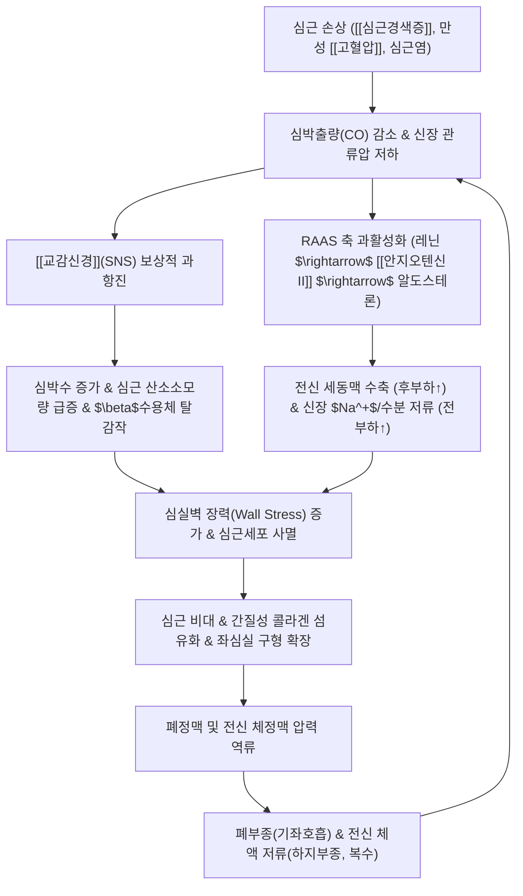

# 🩺 [[심부전]] (Heart Failure / 心不全, I50)

> **핵심 3줄 요약 (Key Summary)**:
> - 📍 병소 부위 & 해부·병태생리: 좌·우심실 심근 및 심실벽; 심장 수축(HFrEF, LVEF $\le$ 40%) 또는 이완(HFpEF, LVEF $\ge$ 50%) 장애로 심박출량 감소 및 체정맥·폐순환 압력 급상승.
> - 🚩 전형적 임상 양상 & 3대 징후: 노작성 호흡곤란(DOE)·기좌호흡(Orthopnea)·야간 발작성 호흡곤란(PND), 폐포 수포음(Crackles), 양측 하지 함요부종(Pitting edema) 및 경정맥 확장(JVD).
> - 🛠️ 핵심 감별 검사 & 한·양방 다각적 치료 전략: 혈청 NT-proBNP/BNP 검사·경흉부 심초음파(TTE), 양방 ARNI/ACEi·베타차단제·MRA·SGLT2i(4대 기둥 약제) 및 한의 침구(내관, 심수, 단중), 진무탕·생맥산·오령산 치법.
> - ⚠️ 응급 의뢰 레드플래그 & 악화 요인: 급성 폐부종으로 인한 분홍색 거품 가래, 안정 시 청색증, 핍뇨 및 심인성 쇼크(SBP < 90 mmHg) 징후 시 즉시 119 구급 이송, 과도한 수분·염분 섭취 및 NSAIDs 복용 절대 금기.

---

## 📌 목차
1. [질환 개요 & 해부학적 병태생리](#1-질환-개요--해부학적-병태생리)
2. [병태생리 메커니즘 & 생체역학적 악순환 네트워크](#2-병태생리-메커니즘--생체역학적-악순환-네트워크)
3. [임상 증상 & 이학적 검사(Physical Exam) 알고리즘](#3-임상-증상--이학적-검사physical-exam-알고리즘)
4. [감별 진단 매트릭스 (Differential Diagnosis)](#4-감별-진단-매트릭스-differential-diagnosis)
5. [한의 통합 치료 프로토콜 (침·약침·추나·한약)](#5-한의-통합-치료-프로토콜-침약침추나한약)
6. [재활 운동 & 생활습관 티칭 가이드](#6-재활-운동--생활습관-티칭-가이드)
7. [💡 사용자 진료실 핵심 필기 & 임상 노하우 (Melt-In 잔여 심화 집약)](#7--사용자-진료실-핵심-필기--임상-노하우-melt-in-잔여-심화-집약)
8. [출처 및 학술 참고 문헌 (References)](#8-출처-및-학술-참고-문헌-references)

---

## 1. 질환 개요 & 해부학적 병태생리

![[청강의감20_19_심부전_증상_도해.jpg|450]]
> [그림 1: ① 심부전 환자에게 나타나는 8대 핵심 임상 징후(호흡곤란, 기좌호흡, 피로감, 하지부종, 빈맥, 급격한 체중증가 등) 메디컬 인포그래픽]

* **질환 정의**:
  * 심부전(Heart Failure, CHF)은 심근경색, 만성 고혈압, 심근병증 등 다양한 기저 심장 질환의 최종 단계로 나타나는 복합 임상 증후군.
  * 심장의 구조적·기능적 이상으로 인해 심실의 충만(이완) 또는 박출(수축) 능력이 손상되어, 전신 말초 조직의 대사 요구에 필요한 혈액을 충분히 공급하지 못하거나 높은 충만압 하에서만 공급 가능한 상태.
* **좌심실 구출률(LVEF)에 따른 3대 표현형 분류**:
  1. **HFrEF (수축기 심부전, Heart Failure with Reduced Ejection Fraction)**:
     * 좌심실 구출률 $\le$ 40%. 심근 수축력 자체의 결손으로 심박출량이 급감하며, 심실벽 박간화 및 구형 확장이 특징 ([[심근경색증]], 확장성 심근병증).
  2. **HFmrEF (경미한 감소 심부전, Mildly Reduced Ejection Fraction)**:
     * 좌심실 구출률 41~49%. HFrEF 치료에 반응하여 호전되는 과도기적 병태.
  3. **HFpEF (이완기 심부전, Heart Failure with Preserved Ejection Fraction)**:
     * 좌심실 구출률 $\ge$ 50%. 수축력은 정상이나 심실벽 비후 및 섬유화로 이완기 심실 충만 저항이 증가함 (노인성 고혈압, 당뇨병성 심근병증).

---

## 2. 병태생리 메커니즘 & 생체역학적 악순환 네트워크

![[Cardiovascular_system_-_Systolic_heart_failure.png|400]]
> [그림 2: ② 심근 수축력 상실 및 심실 확장형 리모델링으로 인한 좌심실 구출률 급감(HFrEF) 심장 단면 해부도]

### 1) 신경호르몬계 악순환의 기전
* **교감신경계(SNS)의 독성 효과**:
  * 초기에는 심박출량 유지를 위해 카테콜아민(에피네프린, 노르에피네프린)이 분비되나, 만성적으로는 $\beta_1$ 수용체 하향조절(Down-regulation), 심근세포 괴사 및 치명적 심실 부정맥을 유발.
* **RAAS 및 알도스테론 축**:
  * 심박출량 감소에 대응해 신장에서 레닌 분비 증가 $\rightarrow$ [[안지오텐신 II]] 매개 혈관 수축(후부하 증가) 및 알도스테론 매개 수분·나트륨 저류(전부하 증가) $\rightarrow$ 심실 충만압 과부하.
* **심근 리모델링 (Myocardial Remodeling)**:
  * 심실벽의 기계적 스트레스 증가로 심근세포 비대, 아폽토시스, 섬유아세포 증식 및 세포외 기질 섬유화가 가속되어 심실이 탄성을 잃고 구형(Spherical)으로 변형됨.

### 2) 좌심부전 vs 우심부전 병역학
* **좌심부전 (Left-sided Heart Failure)**:
  * 좌심실 박출 실패 $\rightarrow$ 좌심방 압력 상승 $\rightarrow$ 폐정맥 울혈 및 폐모세혈관 쐐기압(PCWP) 상승 $\rightarrow$ 혈장이 폐포강으로 유출되어 **폐울혈 및 폐부종** 발생.
* **우심부전 (Right-sided Heart Failure)**:
  * 좌심부전의 후방 압력 전달 또는 폐동맥고혈압에 의해 우심실 기능 부전 $\rightarrow$ 상대정맥·하대정맥 울혈 $\rightarrow$ **경정맥 확장(JVD), 울혈성 간비대, 복수 및 양측 하지 함요부종** 초래.

---

## 3. 임상 증상 & 이학적 검사(Physical Exam) 알고리즘

![[청강의감23_05_심장성부종_하지부종.jpg|420]]
> [그림 3: ③ 전신 순환계 혈액 분포(체정맥 울혈 64%) 및 정맥압 상승에 따른 체액 저류와 하지 함요부종 병태 메커니즘]

### 1) 핵심 임상 증상
* **호흡기계 증상 (좌심부전)**:
  * **노작성 호흡곤란 (DOE, Dyspnea on Exertion)**: 계단 보행이나 가벼운 일상 활동 시 호흡 곤란.
  * **기좌호흡 (Orthopnea)**: 평상시 앙와위로 누우면 하지 체액이 흉강으로 이동해 폐울혈이 악화되어 숨이 차고, 베개를 2~3개 괴고 앉아야 완화됨.
  * **발작성 야간 호흡곤란 (PND, Paroxysmal Nocturnal Dyspnea)**: 수면 2~3시간 후 극심한 질식감과 기침으로 잠에서 깸.
* **체액 저류 증상 (우심부전)**:
  * **양측 하지 함요부종 (Pitting Edema)**: 족관절 주위 및 경골 전면부를 손가락으로 5초간 압박 시 깊은 함요 자국이 남음.
  * **급격한 체중 증가**: 수일 사이에 2~3kg 이상 체중이 증가하는 것은 체액 저류의 강력한 징후.
  * 복부 팽만감, 조기 포만감, 간 압통.

### 2) 필수 이학적 검사 및 진단 검사
* **신체 진찰 (Physical Examination)**:
  * **폐 청진**: 양측 폐하엽의 흡기말 미세 수포음(Fine crackles/rales).
  * **심장 청진**: 제3심음(S3 gallop; 급격한 심실 충만에 의한 심실 확장음), 심尖 박동 변위(외측·하방 편위).
  * **경정맥압(JVP) 측정**: 45도 상체 거상 상태에서 흉골각 상방 3~4cm 이상 박동 상승 확인.
* **생화학 및 영상 진단**:
  * **BNP / NT-proBNP**: 심실벽 신전 시 분비되는 호르몬; 호흡곤란 환자에서 심인성 심부전 배제의 골드스탠다드 (NT-proBNP < 125 pg/mL 시 심부전 가능성 극히 낮음).
  * **경흉부 심장초음파 (TTE)**: 좌심실 구출률(LVEF), 심실 확장기말 용적, 국소 벽운동 장애, 판막 역류 및 이완기 기능 장애 종합 판정.

---

## 4. 감별 진단 매트릭스 (Differential Diagnosis)

| 감별 질환 | 주요 병인 | 호흡곤란 및 부종 특성 | 핵심 감별 진단 검사 소견 |
| :--- | :--- | :--- | :--- |
| [[심부전]] (본 질환) | 심근 수축/이완 부전, 판막 질환 | 기좌호흡, 야간 발작성 호흡곤란, 양측 하지 함요부종 | NT-proBNP 현저한 상승, 심초음파상 EF 저하/이완장애 |
| 만성폐쇄성폐질환 ([[COPD]]) | 흡연, 기도 만성 염증 | 호기성 천명음, 만성 기침, 가래, 체위와 무관한 호흡곤란 | 폐기능검사(PFT) FEV1/FVC < 0.70, BNP 정상 범위 |
| 신증후군 / 만성신부전 | 사구체 기저막 손상, 신원 탈락 | 안와 부종(아침), 전신 부종, 거품뇨 | 대량 [[단백뇨]](> 3.5g/day), 혈청 알부민 저하, Cr 상승 |
| 간경변증 (Liver Cirrhosis) | 간 섬유화, 문맥압 항진 | 복수 중심의 체액 저류, 거미상 혈관종, 황달 | 간기능 저하(AST/ALT/PT), 알부민 감소, 복부 초음파 소견 |
| 심낭삼출 / 압전 (Tamponade) | 심낭강 내 삼출액 급증 | 기이맥(Pulsus paradoxus), 저혈압, 경정맥 확장(Beck's triad) | 심초음파상 심낭강 액체 저류, 심실 이완기 허탈 |

---

## 5. 한의 통합 치료 프로토콜 (침·약침·추나·한약)

* **침구 치료 (Acupuncture)**:
  * **주요 혈위**: 내관(PC6), 심수(BL15), 궐음수(BL14), 단중(CV17), 족삼리(ST36), 복류(KI7), 음릉천(SP9).
  * **자침 기전**: 내관혈 자침은 심장 자율신경계 균형도(HRV)를 개선하고 관상동맥 혈류를 증가시키며, 음릉천·복류혈은 신수분 대사를 촉진하여 체액 울혈을 완화.
* **약침 치료 (Pharmacopuncture)**:
  * **생맥산 약침 / 영지 약침**: 심수, 궐음수, 단중 혈위에 0.1~0.2cc 주입하여 심근 에너지 대사를 촉진하고 항산화·심근 보호 효과 유도.
* **한약 변증 치료 (Herbal Medicine)**:
  * **심신양허·수음능심 (心腎陽虛·水飮凌心)**:
    * 사지궐냉, 외한, 안면창백, 기좌호흡, 전신 및 하지 부종, 소변불리, 설담태백활, 맥침미세.
    * *대표 처방*: [[진무탕]](眞武湯) (포부자, 복령, 백출, 작약, 생강 배오; 양기를 북돋아 수음을 말리고 심근 수축력 및 신혈류를 보존하는 이뇨·강심 처방).
  * **심기음양허 (心氣陰兩虛)**:
    * 만성 심부전 안정기, 심계항진, 숨참, 마른기침, 구건, 자한 및 도한, 맥세약.
    * *대표 처방*: [[생맥산]](生脈散) (인삼, 맥문동, 오미자 배오; 심근 산소 결핍 저항성 증대 및 세포막 안정화).
  * **수습정체 (水濕停滯)**:
    * 소변량 감소, 하지 부종, 흉복부 창만.
    * *대표 처방*: [[오령산]](五苓散) (체액 정체를 완만히 배출).

---

## 6. 재활 운동 & 생활습관 티칭 가이드

* **체액 저류 방지를 위한 식이 티칭**:
  * **저염 식이**: 하루 나트륨 섭취량을 1.5~2.0g(소금 3~5g) 이하로 엄격 제한.
  * **수분 섭취 조절**: 중증 심부전(NYHA III~IV) 또는 저나트륨혈증 환자는 하루 수분 섭취량을 1.5~2.0L 이내로 제한.
* **매일 아침 체중 측정 가이드**:
  * 기상 후 첫 배뇨 직후, 아침 식사 전에 동일한 체중계로 매일 체중 기록.
  * **3일 동안 2kg 이상, 또는 하루에 1kg 이상 급증 시 체액 저류에 의한 악화 신호**로 간주하고 즉시 내원하도록 교육.
* **운동 기반 심장재활 (Cardiac Rehabilitation)**:
  * 안정기 환자에게 점진적 걷기, 실내 자전거 등 유산소 운동 권장.
  * 과도한 숨참(RPE 13 초과)이나 흉통, 어지럼증 발생 시 즉시 중단.

---

## 7. 💡 사용자 진료실 핵심 필기 & 임상 노하우 (Melt-In 잔여 심화 집약)

### 1) 진료실 체액 저류 vs 삼투성 이뇨 실전 감별 (SGLT2i 병용 환자)
* **SGLT2 억제제(다파글리플로진, 엠파글리플로진) 복용자의 다뇨 해석**:
  * 당뇨병 및 심부전 치료를 위해 포시가/자디앙을 복용하는 환자가 "소변을 너무 자주 보고 양이 많다"고 호소할 때, 이는 약물의 당뇨 배출에 따른 **삼투성 이뇨(Osmotic Diuresis)** 현상임.
  * 반면 환자가 밤에 숨이 차서 깨거나(기좌호흡), 발목이 붓고 체중이 늘어난다면 이는 **심부전 악화에 의한 체액 저류**이므로 둘을 철저히 구분해야 함.
* **한약(진무탕 계열) 병용 시 신기능·전해질 사전 점검 원칙**:
  * 수음능심 변증으로 진무탕이나 오령산을 투약하기 전, 반드시 최근 1~2개월 내 혈청 크레아티닌(eGFR)과 전해질($K^+$, $Na^+$) 수치를 확인.
  * 이뇨제(라식스 등)와 ARNI/ACEi를 복용 중인 환자에게 부자 제제를 장기 투약할 경우 탈수 및 고칼륨혈증 발생 여부를 맥진과 부종 호전도로 면밀히 추적.

### 2) 양방 4대 가이드라인 기둥 약제(Guideline-Directed Medical Therapy) 이해
* **HFrEF 4대 핵심 약제**:
  1. **ARNI (사쿠비트릴/발사르탄) 또는 ACEi/ARB**: 신경호르몬 축 억제 및 심근 리모델링 역전.
  2. **베타차단제 (카르베딜롤, 비소프롤롤 등)**: 교감신경 차단 및 심박수 조절.
  3. **MRA (스피로놀락톤, 에플레레논)**: 알도스테론 길항을 통한 섬유화 억제.
  4. **SGLT2 억제제 (다파글리플로진, 엠파글리플로진)**: 신장 포도당/나트륨 재흡수 억제 및 심근 에너지 효율 개선.
* **한의 진료실 티칭**:
  * 상기 약제는 심부전 환자의 사망률과 재입원율을 획기적으로 낮추는 필수 약제이므로, 환자가 임의로 중단하지 않도록 철저히 복약 지도를 병행하며 한의 치료로 피로감 및 삶의 질을 제고.

---

## 8. 출처 및 학술 참고 문헌 (References)

1. **Heidenreich, P. A., et al. (2022)**. *2022 AHA/ACC/HFSA Guideline for the Management of Heart Failure: A Report of the American College of Cardiology/American Heart Association Joint Committee on Clinical Practice Guidelines*. **Circulation**, 145(18), e895-e1032.
   - `[연구 요약]`: [PubMed Link](https://pubmed.ncbi.nlm.nih.gov/35363499/) / 좌심실 구출률에 따른 심부전 병기 분류(HFrEF, HFmrEF, HFpEF)와 4대 기둥 약제(ARNI, 베타차단제, MRA, SGLT2i)의 조기 병용 표준 가이드라인을 집대성함.
2. **Hao, P., et al. (2017)**. *Traditional Chinese medicine for cardiovascular disease: evidence and potential mechanisms*. **Journal of the American College of Cardiology**, 69(24), 2952-2966.
   - `[연구 요약]`: [PubMed Link](https://pubmed.ncbi.nlm.nih.gov/28595687/) / 진무탕, 생맥산 등 한약 제제가 심근세포 미토콘드리아 기능 보호, 칼슘 항상성 유지 및 심실 리모델링 섬유화를 억제함을 미국심장학회지(JACC)에서 종합 고찰함.
3. **McMurray, J. J. V., et al. (2019)**. *Dapagliflozin in Patients with Heart Failure and Reduced Ejection Fraction*. **New England Journal of Medicine**, 381(21), 1995-2008.
   - `[연구 요약]`: [PubMed Link](https://pubmed.ncbi.nlm.nih.gov/31535829/) / DAPA-HF 랜드마크 3상 임상시험으로 SGLT2 억제제 다파글리플로진이 당뇨 유무와 무관하게 심부전 악화 및 심혈관 사망 위험을 26% 유의하게 감소시킴을 규명함.
4. **Solomon, S. D., et al. (2022)**. *Dapagliflozin in Heart Failure with Mildly Reduced or Preserved Ejection Fraction*. **New England Journal of Medicine**, 387(12), 1089-1098.
   - `[연구 요약]`: [PubMed Link](https://pubmed.ncbi.nlm.nih.gov/36027570/) / DELIVER 임상시험으로 보존성/경미감소 구출률 심부전(HFpEF/HFmrEF) 환자에서도 다파글리플로진이 심혈관 사망 및 심부전 악화 복합 위험을 18% 유의하게 감소시킴을 입증함.
