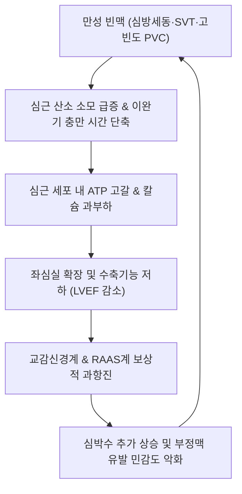

# 🩺 부정맥 유발성 심근병증 (Arrhythmic / Tachycardia-Induced Cardiomyopathy, I42.8)

> **핵심 3줄 요약 (Key Summary)**:
> - 📍 **병소 부위 & 병태생리**: 지속성 심방세동([[심방세동]]), 심방조동, 상실성 빈맥(SVT), 또는 고빈도 심실조기수축(PVC 부하 >10~15%) 등 만성 빈맥성 부정맥에 의해 심근세포 내 에너지(ATP) 고갈, 칼슘 과부하, 심근 산화 스트레스가 초래되어 좌심실 수축기능 저하 및 심실 확장이 발생하는 가역적(reversible) 심근병증.
> - 🚩 **전형적 임상 양상**: 지속적인 두근거림(심계항진, Palpitation), 계단 오를 때의 호흡곤란(NYHA class II~IV), 만성 피로감, 하지 부종, 심실 구혈률(LVEF)의 급격한 감소(<35~40%). 기저 심질환이 없음에도 부정맥 지속 후 울혈성 [[심부전]] 징후 발현.
> - 🛠️ **핵심 감별 & 한·양방 치료 전략**: 원발성 확장성 심근병증(DCM), 허혈성 심근병증 감별. 24시간 홀터 심전도 및 심장 초음파(심실 비대 없이 LVEF 감소). 조기 심박수/율동 조절(전기적 심율동전환술, 전극도자 절제술, 항부정맥제 투여 시 수주~수개월 내 심기능 정상화). 한의 안신정계(安神定悸)·익기양음(益氣養陰) 침구([[심유]], [[내관]], [[신문]]), [[신바로약침]], **생맥산**·**귀비탕**·**자감초탕** 병용.
> - ⚠️ **응급 의뢰 레드플래그**: 급성 폐부종(기좌호흡, 분홍색 거품 가래), 심인성 쇼크(수축기 혈압 <90mmHg, 핍뇨, 사지 냉감), 악성 심실빈맥(VT) 또는 심실세동(VF) 발생(즉시 응급실 이송 및 제세동).

---

## 📌 목차
1. [질환 개요 & 병태생리 (Disease Overview)](#1-질환-개요--병태생리-disease-overview)
2. [병태생리 메커니즘 & 대사·심근부전 악순환 네트워크](#2-병태생리-메커니즘--대사심근부전-악순환-네트워크)
3. [임상 증상 & 환자 소견 (Clinical Presentation)](#3-임상-증상--환자-소견-clinical-presentation)
4. [감별 진단 매트릭스 (Differential Diagnosis)](#4-감별-진단-매트릭스-differential-diagnosis)
5. [한의 통합 치료 프로토콜 (침·약침·한약)](#5-한의-통합-치료-프로토콜-침약침한약)
6. [양방 치료 & 병용·의뢰 기준 (Conventional Treatment & Referral)](#6-양방-치료--병용의뢰-기준-conventional-treatment--referral)
7. [식이·생활습관 & 자가관리 티칭 가이드](#7-식이생활습관--자가관리-티칭-가이드)
8. [💡 진료실 핵심 필기 & 임상 노하우](#8--진료실-핵심-필기--임상-노하우)
9. [출처 및 학술 참고 문헌 (References)](#9-출처-및-학술-참고-문헌-references)

---

## 1. 질환 개요 & 병태생리 (Disease Overview)

부정맥 유발성 심근병증(Arrhythmic Cardiomyopathy, 특히 임상적으로 가장 흔한 빈맥 유발성 심근병증 `Tachycardia-Induced Cardiomyopathy, TIC`)은 지속적인 빠른 심장 박동(통상 심박수 >100~110bpm 이상 장기 지속) 또는 잦은 심실조기수축(PVC burden >10~15%)으로 인해 좌심실의 기계적 수축기능 부전이 초래되는 임상 증후군이다.

### 1) 역학 및 임상적 중요성
- **가역성 (Reversibility)**: 심근경색이나 유전성 심근병증과 달리, **부정맥을 종식시키고 정상 동율동(Sinus rhythm)이나 적절한 심박수를 회복하면 수주~수개월 내에 좌심실 구혈률(LVEF)이 완전히 정상으로 회복**될 수 있는 대표적인 '치료 가능한 심부전'이다.
- **원인 부정맥**:
  - 가장 흔함: 빠른 심실 반응을 동반한 [[심방세동]](Atrial Fibrillation with RVR, 50% 이상 차지).
  - 심방조동(Atrial Flutter), 발작성 상실성 빈맥(PSVT), 심방빈맥(Atrial Tachycardia).
  - 잦은 단형성 심실조기수축(Frequent PVCs, 특히 우심실유출로 RVOT 기원).

---

## 2. 병태생리 메커니즘 & 대사·심근부전 악순환 네트워크

### 1) 세포 수준의 심근 대사 부전 기전
1. **심근 미토콘드리아 고갈 및 ATP 결핍**:
   - 지속적인 빈맥은 심근의 산소 및 포도당 요구량을 비정상적으로 증가시켜 심근 글리코겐 및 고에너지 인산화물(ATP, 크레아틴 인산)을 고갈시킴.
2. **칼슘 과부하 (Calcium Overload)**:
   - 근형질세망(Sarcoplasmic Reticulum)의 Ryanodine 수용체 및 SERCA2a 펌프 기능부전으로 세포질 내 칼슘 제거가 지연되어 심근 이완 장애 및 수축력 저하 초래.
3. **심근 산화 스트레스 및 세포외기질 리모델링**:
   - 반응성 산소종(ROS) 증가와 심근세포 확장, 그러나 영구적 섬유화(Fibrosis)는 진행성 심근병증에 비해 경미하여 조기 회복이 가능함.

### 2) 악순환 네트워크

---

## 3. 임상 증상 & 환자 소견 (Clinical Presentation)

### 1) 주요 임상 증상
- **심계항진 (Palpitation)**: 가슴이 쿵쾅거리거나 불규칙하게 빠르게 뛰는 증상이 수주 이상 지속.
- **울혈성 심부전 증상**:
  - 운동 시 호흡곤란(Dyspnea on exertion, DOE), 만성적인 피로감과 전신 쇠약.
  - 야간 발작성 야간호흡곤란(PND) 및 누우면 숨이 차는 기좌호흡(Orthopnea).
  - 양측 하지의 오목부종(Pitting edema) 및 복부 팽만감.

### 2) 핵심 검사 소견
- **심전도 (12-Lead ECG)**:
  - 기저 부정맥 확인 (심방세동, 심방조동, 분당 120회 이상의 규칙적/불규칙적 빈맥).
- **24시간 홀터 심전도 (Holter Monitoring)**:
  - 24시간 평균 심박수(Mean HR) 및 일일 총 PVC 부하율(PVC burden) 산출.
- **경흉부 심장 초음파 (Echocardiography)**:
  - 좌심실 구혈률(LVEF) 현저한 감소(<30~40%), 좌심실 이완기말 직경(LVEDD) 증가.
  - 심근벽의 현저한 비대(Hypertrophy) 없이 전반적인 무운동증(Global hypokinesia) 관찰.
- **혈액 바이오마커**: NT-proBNP 또는 BNP 수치의 급격한 상승.

---

## 4. 감별 진단 매트릭스 (Differential Diagnosis)

| 질환 | 주된 병인 | 심장 초음파 및 MRI 소견 | 가역성 여부 |
| :--- | :--- | :--- | :--- |
| **[[부정맥 유발성 심근병증]] (TIC)** | 만성 빈맥/부정맥이 원인 | LVEF 감소, 심근 비대 없음, 지연조영증강(LGE) 음성 | **부정맥 교정 시 완전 회복** |
| **특발성 확장성 심근병증 (DCM)** | 유전/자가면역성 심근병 | 심실 현저한 확장, 광범위 심근 섬유화(LGE 양성) | 비가역적 또는 불완전 회복 |
| **허혈성 심근병증 (ICM)** | 관상동맥 질환 및 심근경색 | 국소 벽운동 장애(Regional wall motion abnormality) | 혈관 재개통 후 부분 회복 |
| **갑상선 기능항진증성 심근병** | 갑상선 호르몬 과다로 빈맥 | 전신 대사항진, 고박출성 심부전 양상 | 갑상선 기능 정상화 시 회복 |
| **부정맥유발 우심실 심근병증 (ARVC)** | 데스모좀 유전자 돌연변이 | 우심실 비대 및 지방섬유성 침윤, 엡실론 파 | 진행성 불치성 질환 |

---

## 5. 한의 통합 치료 프로토콜 (침·약침·한약)

### 1) 침구 치료 (Acupuncture Protocol)
- **주요 혈위**: [[심유]](BL15), [[궐음유]](BL14), [[내관]](PC6), [[신문]](HT7), [[단중]](CV17), [[족삼리]](ST36), [[삼음교]](SP6), [[극문]](PC4).
- **자침 기법**:
  - **[[내관]](PC6)·[[신문]](HT7)**: 영심안신(寧心安神), 조리심기(調理心氣)의 요혈로 심율동 안정 및 심박수 조절.
  - **[[심유]](BL15)·[[궐음유]](BL14)**: 배수혈에 0.25×40mm 호침으로 척추 방향 사자하여 심장 자율신경계 과항진 억제.
  - **[[단중]](CV17)**: 흉중기체를 소통하여 심계 및 호흡곤란 완화.
- **전침 치료**: 내관-신문 간 2Hz 연속파 자극으로 부교감신경 활성화 유도.

### 2) 약침 치료 (Pharmacopuncture Protocol)
- **[[신바로약침]] 또는 자하거약침**:
  - [[심유]](BL15), [[격유]](BL17)에 0.5~1.0cc 분할 자입하여 심근 대사 기능을 보조하고 피로감 개선.
- **황련해독탕 약침**:
  - 심화항성(心火亢盛), 담화요심(痰火擾心)으로 가슴이 답답하고 빈맥이 지속되는 환자의 내관 및 단중혈에 주입.

### 3) 한약 치료 (Herbal Medicine)
- **기음양허(氣陰兩虛, 빈맥 후 탈진 및 심계)**:
  - **생맥산(生脈散)** 합 **자감초탕(炙甘草湯)**: 인삼, 맥문동, 오미자, 자감초, 아교 등으로 구성되어 맥결대(脈結代, 부정맥), 심계항진을 안정시키고 심근 수축력 보조.
- **심비양허(心脾兩虛, 만성 피로 및 불면 동반)**:
  - **귀비탕(歸脾湯)**: 보혈안신(補血安神)하여 신경성 심계와 심기능 저하 회복.
- **수음능심(水飲凌心, 심부전 부종 동반)**:
  - **진무탕(眞武湯)** 또는 **오령산(五苓散)**: 이수소종(利水消腫)하여 심장의 전부하(Preload) 경감.

---

## 6. 양방 치료 & 병용·의뢰 기준 (Conventional Treatment & Referral)

### 1) 표준 양방 치료 (3단계 전략)
1. **심박수 조절 (Rate Control)**:
   - 베타차단제(Metoprolol, Bisoprolol, Carvedilol) 또는 비DHP계 CCB(Diltiazem).
   - 심부전 동반 심방세동 환자에서 Digoxin 병용 고려.
2. **율동 조절 및 근본 절제 (Rhythm Control & Ablation)**:
   - 전기적 심율동전환술(DC Cardioversion).
   - **고주파 전극도자 절제술 (RF Catheter Ablation)**: 심방세동 및 심방조동, PVC 유발 부위를 근본적으로 절제하여 TIC를 완치시키는 가장 확실한 치료법.
3. **심부전 표준 약물 요법 (GDMT)**:
   - LVEF 회복 시까지 ACEi/ARB/ARNI(Sacubitril/Valsartan), MRA(Spironolactone), SGLT2 억제제 투여.

### 2) 한의 병용 가이드라인
- 양방 항부정맥제 및 심부전 치료제를 유지하면서, 한의 치료는 자율신경계 안정과 심근 에너지 대사 회복을 지원하는 병용 요법으로 접근.
- 부정맥이 전기 생리학적으로 통제되지 않은 상태에서 한방 단독 치료만을 진행해서는 안 됨.

### 3) 양방·전문과 응급 의뢰 기준 (Referral Criteria)
- **즉시 119/응급실 전원 (Red Flags)**:
  - 안정 시 분당 심박수가 150회 이상으로 지속되며 흉통, 호흡곤란, 의식 혼미가 동반되는 경우.
  - 기좌호흡, 거품 가래, 산소포화도 90% 이하의 급성 폐부종 발생.
  - 지속성 심실빈맥(VT) 포착 시.

---

## 7. 식이·생활습관 & 자가관리 티칭 가이드

- **카페인 및 알코올 절대 제한**:
  - 에너지 음료, 고농도 커피, 폭음은 심방세동 발작의 가장 흔한 방아쇠(Holiday heart syndrome).
- **스마트워치를 이용한 심박수 및 심전도 자가 모니터링**:
  - 일상 중 맥박이 불규칙하거나 100회 이상 지속될 때 기록하여 주치의에게 제시.
- **저염식 및 수분 관리**:
  - 심부전 울혈 방지를 위해 일일 염분 섭취량 5g 이하 유지.

---

## 8. 💡 진료실 핵심 필기 & 임상 노하우

### 1) "심장이 굳은 것이 아니라 지친 것"이라는 설명의 중요성
- 대학병원에서 "심장 기능이 30%밖에 안 남아 심부전이다"라는 말을 듣고 절망하여 한의원에 내원하는 환자들이 있다.
- 이때 심전도상 빠른 심방세동이나 잦은 조기수축이 확인되면, "심근 자체가 죽은 것이 아니라 모터가 너무 빨리 돌아 지쳐서 멈춘 부정맥 유발성 심근병증일 수 있으며, 맥박만 정상으로 잡으면 심장 기능은 다시 50~60%로 회복될 수 있다"고 설명하여 희망을 주는 것이 임상적으로 대단히 중요하다.

### 2) 자감초탕(炙甘草湯) 운용 시 자감초의 용량
- 부정맥(맥결대)에 자감초탕을 처방할 때는 방약합편이나 상한론의 원의를 살려 **자감초의 용량을 1첩당 12~16g 이상 충분히 증량**해야 심장 평활근과 박동 리듬 안정 효과를 온전히 얻을 수 있다.

---

## 9. 출처 및 학술 참고 문헌 (References)

- Sato N et al. (2026). Tachycardia-induced cardiomyopathy: evolution of the concept and contemporary insights. *Heart Fail Rev*. 31(1):. PMID: 42412249

- Pillai S, Balogun FO, Ganesaratnam I et al. (2026). Thyroid Storm Presenting With Refractory Atrial Arrhythmia and Tachycardia-Induced Dilated Cardiomyopathy: A Case Report. *Cureus*. 18(8):e114394. PMID: 42729939

- Papakonstantinou PE, Lip GYH et al. (2026). Managing Atrial Fibrillation in Heart Failure: In Whom, When, and How? *Int J Heart Fail*. 8(1):12-23. PMID: 41696056

---

## 관련 노트

- [[심부전]]
- [[심방세동]]
- [[부정맥]]
- [[내관]]
- [[단중]]
- [[신바로약침]]
- [[자감초탕]]
- [[생맥산]]
- [[귀비탕]]
