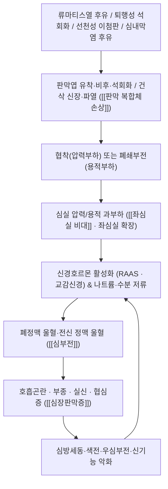

# 🩺 [[심장판막증]] (Valvular Heart Disease / 心瓣膜症, ICD-10 I05–I09 · I34–I39)

![[심장판막증_1.jpg|540]]
> [그림 1: ① 병태생리·영상 — 심장판막증_1]
![[심장판막증_4.jpg|540]]
> [그림 2: ② 관련 해부 구조물 — Assessment of the <b>anatomy</b> of <b>cardiac</b> valves with MSCT. a A sagittal plane of the left-side valves with sev]

> **핵심 3줄 요약 (Key Summary)**:
> - 📍 **병소 부위 & 해부·병태생리**: 승모판 복합체([[승모판륜]], [[첨판]], [[건삭]], [[유두근]])와 대동맥판(판륜·첨판·Valsalva동)을 중심으로 한 [[심장골격]] 구조물의 섬유화·석회화·점액종성 변성·유착. 협착(stenosis)은 압력부하, 폐쇄부전(regurgitation)은 용적부하를 만들어 [[좌심실 비대]] → [[심부전]] → 폐·전신 울혈로 진행한다.
> - 🚩 **전형적 임상 양상 & 3대 징후**: 무증상 보상기 → 운동 시 [[호흡곤란]]·피로·[[실신]]·[[협심증]] → 야간 발작성 호흡곤란·하지 부종·[[심방세동]]. 대동맥판협착의 고전적 3대 증상은 **협심증·실신·호흡곤란**, 승모판협착은 **개방음 + 심첨부 이완기 rumble + 좌심방 확장에 따른 색전 위험**.
> - 🛠️ **핵심 감별 검사 & 한·양방 다각적 치료 전략**: [[심초음파]](TTE/TEE)가 진단의 축이며 병기 A–D 분류로 개입 시점을 정한다([[2020 ACC/AHA 판막질환 가이드라인]]). 한방은 **益氣溫陽·活血利水·化痰** 원칙의 침(內關·神門·心俞·厥陰俞·膻中)·약침·한약(炙甘草湯·苓桂朮甘湯·眞武湯 계열)으로 증상·삶의 질을 보조하되, 판막의 구조적 병변 자체를 역전시킨다는 근거는 없으므로 **중재·수술 적응 판단이 항상 우선**한다.
> - ⚠️ 응급 의뢰 레드플래그 & 악화 요인: 급성 폐부종(좌위 호흡·거품 가래), 실신, 지속성 흉통(급성 관상동맥 증후군·대동맥 박리 감별), 발열 + 새로운 심잡음(감염성 심내막염), 급성 대동맥판폐쇄부전, 색전성 신경학적 결손. 중증 대동맥판협착 환자에서의 격렬한 운동·강한 흉추 추나 thrust·다량의 체액 부하는 절대 금기.

---

## 📌 목차
1. [질환 개요 & 해부학적 병태생리](#1-질환-개요--해부학적-병태생리)
2. [병태생리 메커니즘 & 생체역학적 악순환 네트워크](#2-병태생리-메커니즘--생체역학적-악순환-네트워크)
3. [임상 증상 & 이학적 검사(Physical Exam) 알고리즘](#3-임상-증상--이학적-검사physical-exam-알고리즘)
4. [감별 진단 매트릭스 (Differential Diagnosis)](#4-감별-진단-매트릭스-differential-diagnosis)
5. [한의 통합 치료 프로토콜 (침·약침·추나·한약)](#5-한의-통합-치료-프로토콜-침약침추나한약)
6. [재활 운동 & 생활습관 티칭 가이드](#6-재활-운동--생활습관-티칭-가이드)
7. [💡 사용자 진료실 핵심 필기 & 임상 노하우 (Melt-In 잔여 심화 집약)](#7--사용자-진료실-핵심-필기--임상-노하우-melt-in-잔여-심화-집약)
8. [출처 및 학술 참고 문헌 (References)](#8-출처-및-학술-참고-문헌-references)

---

## 1. 질환 개요 & 해부학적 병태생리

![[심장판막증_1.jpg|540]]
> [그림 1: Aortic stenosis rheumatic, gross pathology 20G0014 lores.jpg]

![[심장판막증_3.jpg|540]]
> [그림 2: CRT in dilated cardiomyopathy and mitral valve replacement.png]

### 1) 질환 정의 및 분류

* **정의**: 심장판막증은 판막 복합체(판륜–첨판–건삭–유두근)의 구조적·기능적 이상으로 **협착(stenosis)**, **폐쇄부전(regurgitation, insufficiency)**, 또는 **혼합 병변**이 발생하여 혈류의 전방 추진이 방해받거나 역류하는 질환군이다. 임상적으로는 원인·해부 위치·병기(stage)의 세 축으로 분류한다.
* **원인별 분류**:
  * **류마티스성(RHD)**: A군 연쇄상구균 인두염 후 면역 매개성 교차반응으로 판막엽 유착·건삭 단축·교련부 융합이 발생한다. **승모판 침범이 가장 흔하고**, 대동맥판이 그다음이며, 저·중소득 국가에서 여전히 주요 원인이다(Aluru & Barsouk, 2022; Peters & Duggan, 2022).
  * **퇴행성/석회화성**: 고령화와 함께 대동맥판협착(AS)·승모판륜 석회화가 증가한다. 고소득 국가에서 **가장 흔한 판막질환의 축**을 이루며, 인구 고령화로 유병률이 지속 상승하는 추세다(Aluru & Barsouk, 2022; Peters & Duggan, 2022).
  * **선천성**: 이첨판 대동맥판(bicuspid aortic valve), 폐동맥판협착, 엡스타인 기형 등. 이첨판 대동맥판은 젊은 성인 AS·AR의 중요한 원인이다.
  * **이차성/기능성**: 허혈성·확장성 심근병증, 좌심실 확장에 따른 **기능성 승모판폐쇄부전(FMR)**, 폐동맥고혈압·우심실 확장에 따른 삼첨판폐쇄부전.
  * **기타**: 감염성 심내막염 후 파괴, 외상, 방사선, 결체조직질환(마르판 증후군 등), 약물(에르고트·일부 식욕억제제 관련 — 근거 수준 개별 확인 필요).
* **형태별 분류**: 협착 / 폐쇄부전 / 혼합 병변.
* **판막별 분류**: 대동맥판(AS, AR) · 승모판(MS, MR) · 삼첨판(TR) · 폐동맥판(PS, PR).
* **병기 분류(2020 ACC/AHA)**: A단계(판막질환 위험군) → B단계(진행성, 경증~중등도) → C단계(무증상 중증) → D단계(증상성 중증). 이 병기 체계가 **경과관찰 주기와 중재 시점**을 결정하는 뼈대이며, 같은 "중증"이라도 증상 유무(C vs D)가 치료 방향을 가른다(Writing Committee Members, Otto CM, 2021).

* **역학적 특성**:
  * 연령이 증가할수록 유병률이 뚜렷하게 상승하며, 인구 고령화에 따라 전체 유병률이 증가 추세다(Aluru & Barsouk, 2022; Peters & Duggan, 2022).
  * 미국 성인 인구에서의 유병률은 **약 2.5% 내외**로 보고되나, 이는 인용 논문의 조사 모집단·시점에 따라 달라질 수 있으므로 **국내 인구 기준 수치는 근거 미확인**이다.
  * 류마티스성 판막질환은 젊은 연령층·여성에서 상대적으로 많이 관찰되며, 퇴행성 판막질환은 고령층에서 우세하다(Peters & Duggan, 2022).
  * 1차 진료(primary care) 영역에서는 무증상 잡음, 운동 시 호흡곤란, 부종 등의 비특이적 호소로 처음 발견되는 경우가 많아 **심초음파로의 조기 의뢰 판단**이 일차의료의 핵심 역할이다(Kisling & Gallagher, 2024).

### 2) 관련 해부학적 구조물

* **판막 복합체(승모판)**: [[승모판륜]](annulus) – [[전·후첨판]](leaflet) – [[건삭]](chordae tendineae) – [[유두근]](papillary muscle) – 좌심실벽이 하나의 기능 단위로 움직인다. 어느 한 요소만 이상해도 폐쇄부전이 발생하므로 **"판막 단독 질환"으로 접근하면 감별을 놓친다**.
* **판막 복합체(대동맥판)**: 판륜, 3개의 첨판, Valsalva동, 좌·우 관상동맥 개구부가 근접해 있다. 이 해부학적 근접성 때문에 대동맥판 질환·수술이 **관상동맥 허혈 및 전도장애**와 직결된다.
* **심장골격(fibrous skeleton)**: 4개 판막륜이 섬유성으로 연결된 구조로, 판막 간 병변 파급과 전도계 주행의 통로가 된다.
* **전도계**: [[방실결절]](AV node)–[[His속]]이 막성 중격과 대동맥판륜에 근접한다. 대동맥판 치환술·승모판 수술 후 전도장애(완전 방실차단) 위험의 해부학적 근거다.
* **혈관·순환**: [[관상동맥]](RCA, LAD, LCx), [[폐정맥]]–좌심방–좌심실 축, [[폐동맥]] 순환. 승모판협착에서 폐정맥압 상승 → [[폐동맥고혈압]] → 우심부전으로 이어지는 축이 핵심이다.
* **한의학적 대응 구조**: 心·心包·胸中(膻中) 및 心之募穴(巨闕)·背兪穴(心俞·厥陰俞) 체계로 투영된다. 병리적으로는 **心氣·心陽의 推動力 저하와 血瘀·水濕·痰濁의 정체**라는 本虛標實 구조로 해석한다.

---

## 2. 병태생리 메커니즘 & 생체역학적 악순환 네트워크

### 1) 해부학적·분자적 병태생리

* **대동맥판협착(AS)**: 판막엽 석회화·유착 → 유효 개구면적 감소 → 좌심실 **압력 과부하** → 동심성 비대(concentric hypertrophy)로 벽응력(wall stress)을 보상. 그러나 관상혈류 예비능 감소·심내막하 허혈 → **협심증**. 운동 시 좌심실 수축력 증가를 판막이 감당하지 못해 뇌관류가 일시 저하 → **실신**. 보상 실패 시 폐울혈 → **호흡곤란**. 증상 발현 후 경과가 급격히 나빠지는 것이 AS의 핵심 임상 특성이다(Writing Committee Members, Otto CM, 2021).
  * *주의*: 중증 AS의 확정적 정의는 판막첨단속도·평균압력차·판막면적의 세 지표를 조합해 판정한다. 본 노트에서는 개별 절단값 수치를 확정하지 않고 **원문 가이드라인 기준 확인이 필요**하다고 표시한다.
* **승모판협착(MS)**: 교련부 융합·건삭 단축 → 좌심방압 상승 → 폐정맥·폐동맥압 상승 → 운동 시 호흡곤란, 객혈. 좌심방 확장은 **심방세동**과 **좌심방 혈전·색전**의 직접적 기질이 된다.
* **승모판폐쇄부전(MR)**: 수축기 역류 → 좌심방 용적 과부하 + 좌심실 **용적 과부하** → 원심성 비대·확장. 좌심실이 확장되면 후부하가 오히려 감소해 **박출률(EF)이 실제 수축기능을 과대평가**하는 함정이 생긴다(기능성 MR의 악순환).
* **대동맥판폐쇄부전(AR)**: 이완기 역류 → 좌심실 용적 과부하 → 확장, 넓은 맥압. 급성 AR은 좌심실이 적응할 시간이 없어 **급성 심부전·심인성 쇼크**로 이어질 수 있는 응급 상황이다(대동맥 박리 연관).
* **류마티스성 기전**: A군 연쇄상구균 인두염 후 분자유사성(molecular mimicry)에 따른 교차반응성 면역 손상이 판막에 만성 섬유화를 남긴다(Aluru & Barsouk, 2022). 재발성 인두염 반복이 병변 악화의 위험 요인이므로 **2차 예방이 병태생리의 일부**다.
* **감염성 심내막염**: 기존 판막 병변(특히 AR·MR·인공판막)은 이상류(turbulent flow)를 만들어 심내막염 감수성을 높이고, 감염은 판막 파괴·색전으로 다시 심부전을 악화시킨다(악순환의 양방향성).

### 2) 생체역학적 연쇄 반응 (Kinetic Chain의 순환기 버전)

* **압력부하 축**: 판막 협착 → 동심성 비대 → 심근 산소수요 증가 + 관상혈류 예비 감소 → 허혈·섬유화 → 이완기 기능장애 → 폐울혈.
* **용적부하 축**: 판막 역류 → 원심성 확장 → 승모판륜 확장 → 2차성 MR 심화 → 역류량 증가 → 다시 용적부하(자기증폭 회로).
* **좌–우심 연쇄**: 좌심 질환 → 폐정맥압 상승 → 폐동맥고혈압 → 우심실 부전 → 삼첨판륜 확장 → TR → 전신 정맥 울혈(간·신장 울혈 → 신기능 악화 → 이뇨제 저항성).
* **전신 연쇄**: 심박출량 저하 → 신장 관류 감소 → RAAS·교감신경 항진 → 나트륨·수분 저류 → 부종·체중 증가 → 다시 전부하 증가.
* **한의 병기 대응**: 心氣虛 → 心陽虛 → 血行瘀滯 → 水氣凌心·陽虛水泛 → 痰飮阻肺(喘)로 진행하는 本虛標實의 단계적 모델로 요약할 수 있다. 임상 변증과 서양의학적 병기(A–D)를 **1:1로 등치하지 말고 병행 관찰**하는 것이 안전하다.

---

## 3. 임상 증상 & 이학적 검사(Physical Exam) 알고리즘

### 1) 주소증 및 임상 증상

* **무증상기**: 판막 병변이 상당히 진행될 때까지 증상이 없을 수 있다. 따라서 **잡음 발견 자체가 의뢰 사유**가 된다("증상이 없다"는 안심 근거가 되지 않는다).
* **호흡기 증상**: 운동 시 호흡곤란(가장 흔한 초기 증상) → 안정 시 호흡곤란 → 야간 발작성 호흡곤란 → 좌위 호흡. MS에서는 객혈이 나타날 수 있다.
* **심혈관 증상**: 협심증(특히 AS, 관상동맥질환 없이도 발생), 실신(운동 시 발생하면 위험 신호), 심계항진(심방세동 동반 시), 색전성 사건(MS의 좌심방 혈전).
* **전신·울혈 증상**: 하지 부종, 체중 증가, 복부 팽만·식욕 저하(간울혈·복수), 야간뇨, 피로·운동능력 저하.
* **자율신경·말초 증상**: 냉감, 말초 맥박 약화(저박출), 말기 청색증.
* **문진 시 필수로 묻는 것**: ① 어느 정도 걸으면 숨이 차는지(계단 몇 층/몇 미터), ② 최근 체중 변화(3일간 2kg 이상 증가 여부 — 수치 기준은 기관 프로토콜 확인), ③ 실신·어지럼 여부와 유발 상황, ④ 발열·치과치료·피부감염 이력(심내막염), ⑤ 류마티스열 과거력과 페니실린 예방요법 순응도, ⑥ 항응고제 복용 여부.

### 2) 필수 이학적 검사법 (Physical Examination)

* **활력징후·경정맥압(JVP)**: 경정맥압 상승, 간경정맥 역류, 복수·부종은 우심부전·TR 시사. TR에서는 경정맥에 **cv파(수축기 박동)**가 관찰된다.
* **맥박 촉진**: AS에서 **맥압 감소·맥박 상승 지연(pulsus parvus et tardus)**, AR에서 **넓은 맥압·수장성 박동(water-hammer/Corrigan pulse)**. 좌우 상완 혈압 차이는 대동맥 질환 감별에 필요하다.
* **심첨부 촉진**: 좌측 하방으로 편위된 심첨부 박동(좌심실 확장), 수축기 thrill(MR·AS).
* **[[심장 청진]](Cardiac Auscultation)**: 판막질환 진단의 1차 관문. 아래 표의 청진 소견이 핵심이다.

| 판막 병변 | 최적 청진 부위 | 잡음 시기·성질 | 방사 부위 | 동반 소견 |
| :--- | :--- | :--- | :--- | :--- |
| [[대동맥판협착]](AS) | 우측 제2늑간(대동맥판 청진부) | 수축기 중기~후기 **crescendo–decrescendo 구개성(growling)** | 좌우 경동맥 | 맥압 감소, S2 단일화, 맥박 상승 지연 |
| [[대동맥판폐쇄부전]](AR) | 좌측 제3~4늑간 흉골연(Erb's point) | 이완기 초기 **고음성 감쇄성(decrescendo)** | 심첨부 방향 | 넓은 맥압, Austin Flint 잡음, 수장성 박동 |
| [[승모판협착]](MS) | 심첨부(좌측와위, 운동 후) | **이완기 중기 저음 rumble + opening snap** | 국소(잘 안 퍼짐) | S1 항진, 좌심방 확장, 심방세동 |
| [[승모판폐쇄부전]](MR) | 심첨부 | 전수축기~수축기 **고음 blowing** | 좌측 액와부 | S3, handgrip 시 잡음 증가(전부하 증가) |
| [[삼첨판폐쇄부전]](TR) | 좌측 흉골 하단(제4~5늑간) | 수축기 잡음 | 좌측 흉골 하단, 간 | 경정맥 cv파, 수축기 간 박동 |
| [[폐동맥판협착]](PS) | 좌측 제2늑간 | 수축기 잡음 | 좌측 흉골연 | 우심실 부하 소견 |

  * **가양성 감별 팁**: 기능성(생리적) 수축기 잡음은 소아·청소년·임신·빈혈·갑상선기능항진에서 흔하며, 대개 **1–2/6도 이하·국소·비방사성**이다(이학적 감별 원칙).
  * **전부하·후부하 조작법**: handgrip(전부하·후부하 증가) → MR·AR·VSD 증가, AS 감소. Valsalva(전부하 감소) → [[비후성 심근병증]](HCM) 잡음 **증가**, AS·MR 감소. 이 조작법 하나가 AS와 HCM 감별의 실마리를 준다.
* **[[심초음파]](Echocardiography)**: 진단·중증도 판정·경과관찰의 표준. 경흉부(TTE)가 1차, 인공판막·판막내 감염 의심·판막 성형술 전 평가에서는 경식도(TEE)가 필요하다(Kisling & Gallagher, 2024; Writing Committee Members, Otto CM, 2021).
* **부속 검사**: [[심전도]](좌심실 비대·심방세동·전도장애), 흉부 X선(심장 크기·폐울혈), BNP/NT-proBNP, 심장 MRI(중증도·심근 섬유화 평가), 운동부하검사(무증상 중증 AS에서 위험도 평가), 심도자·관상동맥 조영술(수술 전 평가).
* **경과관찰 주기**: 병기(A–D)에 따라 심초음파 추적 간격이 다르게 권고된다. **구체적 개월 수는 2020 ACC/AHA 가이드라인 원문 표를 기준으로 확인**해야 하며, 본 노트에서는 수치를 확정하지 않는다(Writing Committee Members, Otto CM, 2021).

---

## 4. 감별 진단 매트릭스 (Differential Diagnosis)

| 감별 질환 | 호발 병소 및 원인 | 주소증 차이점 | 특이적 이학적 검사 소견 |
| :--- | :--- | :--- | :--- |
| [[심장판막증]] (본 질환) | 판막 복합체(판륜·첨판·건삭·유두근) | 병변별 잡음 + 운동 시 호흡곤란, 병기 진행에 따른 실신·부종 | [[심초음파]]에서 판막 병변 확인, 잡음 위치·시기 특이적 |
| [[비후성 심근병증]](HCM) | 심실 중격 비대(유전성) | 젊은 층의 실신·호흡곤란, 청진상 수축기 잡음 | Valsalva 시 잡음 **증가**, 심초음파에서 비대·SAM |
| [[허혈성 심근병증]] / [[확장성 심근병증]] | 관상동맥질환·특발성 | 호흡곤란·부종 위주, 잡음은 기능성 MR일 수 있음 | 관상동맥 조영술, 심초음파에서 전체 벽운동 저하 |
| [[급성 대동맥 증후군]](대동맥 박리) | 대동맥 내막 파열 | **찢어지는 흉배통 + 실신**, 좌우 혈압차 | 신규 AR 잡음, 좌우 상완 압력차, CT 혈관조영 |
| [[감염성 심내막염]] | 기존 판막병변 + 균혈증 | **발열·오한 + 새로운 심잡음** | 혈액배양, TEE, 색전 소견 |
| [[폐동맥고혈압]] / COPD | 폐실질·폐혈관 | 호흡곤란 중심, 잡음 비특이적 | 우심부전 소견, 폐기능검사·심초음파 |
| [[갑상선기능항진증]]·[[빈혈]] | 대사·혈액 | 심계항진·운동 시 호흡곤란 | 고박출성 잡음, 갑상선·혈색소 검사 |
| [[심방세동]](단독) | 좌심방 전기적 리모델링 | 불규칙 맥박감 | 맥박 결손(pulse deficit), 심전도 |

---

## 5. 한의 통합 치료 프로토콜 (침·약침·추나·한약)

> ⚠️ **치료 원칙 선언**: 심장판막증의 **구조적 판막 병변 자체를 침·약침·한약이 역전시킨다는 근거는 확인되지 않았다(근거 미확인)**. 한의 치료의 목표는 ① 증상(호흡곤란·부종·피로·불면·불안) 완화, ② 심부전 동반 상태의 삶의 질 개선, ③ 양방 치료(수술·중재·약물) 전후 회복 보조, ④ 재발·악화 방지 교육이다. **수술·중재 적응 판단은 항상 심장내과·심장외과 평가가 우선**한다.

### 1) 변증(辨證) 프레임

| 변증 | 주요 임상상 | 대응 병기 감각 | 치료 원칙 |
| :--- | :--- | :--- | :--- |
| 心氣虛 | 피로, 心悸, 운동 시 호흡곤란, 자한 | 초기~보상기 | 益氣養心 |
| 氣陰兩虛 | 心悸·口渴·불면·설홍·맥세삭 | 만성 경과 | 益氣養陰 |
| 心陽虛 | 냉감, 四肢不溫, 심한 피로 | 진행기 | 溫陽益氣 |
| 心血瘀阻 | 흉통·흉민, 설암자, 脈澀 | 협심증 동반 | 活血化瘀 |
| 水氣凌心 / 陽虛水泛 | 부종, 少尿, 喘, 야간 발작성 호흡곤란 | 심부전 동반 | 溫陽利水 |
| 痰濁阻肺 | 咳喘·담다, 흉민 | 좌심부전·폐울혈 | 化痰降氣 |

### 2) 침구 치료 (Acupuncture)

* **주요 타겟 혈위**: [[내관(PC6)]](심포락 絡穴, 心胸 질환의 1차 혈), [[신문(HT7)]](安神定悸), [[극음수(BL14)]]·[[심수(BL15)]](背兪穴, 心之氣가 輸注되는 곳), [[거궐(CV14)]](心之募穴), [[전중(CV17)]](氣會·心包募穴), [[족삼리(ST36)]]·[[삼음교(SP6)]](益氣養血), [[음릉천(SP9)]]·[[수분(CV9)]](利水消腫), [[복류(KI7)]]·[[태계(KI3)]](補腎納氣), [[기해(CV6)]]·[[관원(CV4)]](培元固本).
* **자침 요령**: 內關은 直刺 0.5~1寸으로 得氣 후 염전. 膻中은 흉골 위이므로 **向下 平刺(횡자)** 로 자침하며 直刺로 흉곽을 뚫지 않도록 극히 주의한다. 背部 兪穴은 斜刺로 늑골·흉막 천자를 피한다.
* **전침 세팅**: 心悸·불안에는 저주파 위주(예: 2 Hz 계열)를 20분 내외로 적용하는 방식이 임상에서 흔히 쓰이나, **판막질환에서의 최적 주파수·자극량은 근거 미확인**이다. 심질환자에서 강한 자극은 교감신경 항진을 유발할 수 있으므로 **강도는 환자 tolerability 기준으로 최소화**한다.
* **금기·주의**: 중증 AS·불안정 심부전 환자에서 강한 자극·장시간 유침·과도한 체위 변경은 회피. 항응고제(와파린·DOAC) 복용자는 멍·출혈 위험을 사전 고지하고, 인공판막 환자의 침습적 시술 전 예방적 항생제 필요 여부는 **심장내과 협진으로 결정(근거 미확인)**.

### 3) 약침 치료 (Pharmacopuncture)

* **응용 방향**: 內關·厥陰兪·心兪 주위 및 흉추 주변 근육 이완 목적으로 **丹蔘·黃芪·紅花·五加皮** 계열 약침이 임상적으로 응용되나, **판막질환 자체에 대한 약침의 유효성·안전성 근거는 미확인**이다.
* **실무 원칙**: ① 심장 인접 부위(좌측 흉곽 전면, 심첨부 투영 부위)는 주입하지 않는다. ② 1회 주입량·농도는 최소로 시작한다. ③ 항응고제 복용자·인공판막 환자는 출혈·감염 위험으로 신중히 적용하며, 이상반응 발생 시 즉시 중단한다. ④ 자율신경 반응(어지럼·식은땀·혈압 저하) 발생 시 즉시 앙와위 안정 후 활력징후 확인.

### 4) 추나 치료 (Chuna Manipulation)

* **적용 범위**: 흉추 가동성 제한, 흉곽·호흡 보조근(흉쇄유돌근, 사각근, 승모판 상부) 단축, 횡격막 호흡 저하에 대한 **연부조직 이완과 호흡 재교육 중심** 접근.
* **기법**: 흉추 신전 가동(mobilization), 늑골 슬라이딩 유도, 근막 이완(JS 계열), 복식호흡 유도. 강한 thrust 조작은 원칙적으로 회피한다.
* **금기**: 중증 대동맥판협착, 급성 심부전, 불안정 협심증, 최근 심장 수술 후 흉골 유합 전, 대동맥류·박리 의심, 항응고제 복용 중 심한 흉추 조작, 인공판막·CRT/ICD 삽입부 직접 압박.

### 5) 한약 치료 (Herbal Medicine)

| 상황 | 대표 처방 계열 | 처방 의도 |
| :--- | :--- | :--- |
| 心氣虛·心悸 | [[炙甘草湯]], [[保元湯]], [[桂枝甘草湯]] | 益氣復脈, 定悸 |
| 氣陰兩虛 | [[生脈散]](人蔘·麥門冬·五味子) | 益氣養陰, 生脈 |
| 水氣凌心·부종 | [[苓桂朮甘湯]], [[五苓散]], [[防己黃芪湯]] | 溫陽化氣, 利水 |
| 陽虛水泛·중증 부종 | [[眞武湯]] | 溫陽利水 |
| 血瘀·흉통 | [[血府逐瘀湯]], [[丹蔘飲]] 계열 | 活血化瘀, 行氣止痛 |
| 痰飮·喘 | [[葶藶大棗瀉肺湯]], [[蘇子降氣湯]] | 瀉肺行水, 降氣化痰 |

* **투약 시 반드시 고려할 안전성**:
  * **甘草 함량**: 炙甘草湯·甘草 계열 다용 처방은 장기 복용 시 **가성 알도스테론증(부종·고혈압·저칼륨)** 위험이 있다. 심부전·이뇨제 병용 환자에서는 저칼륨이 부정맥 위험을 높이므로 전해질 확인이 필요하다.
  * **디기탈리스(디곡신) 복용자**: 저칼륨 유발 상황은 독성 위험을 상승시킨다. **한약–양약 상호작용은 반드시 확인하고, 불확실하면 병용을 피한다(근거 수준: 전문가 의견/문헌 확인 필요)**.
  * **이뇨제 병용**: 과도한 利水 처방은 탈수·신기능 악화·전해질 이상을 초래할 수 있어 체중·혈압·크레아티닌 추적이 필요하다.
  * **자기 판단 금지**: 심부전 약물(ACEi/ARB, 베타차단제, 이뇨제, 항응고제)을 **임의로 중단·감량하지 않는다**. 한약은 유지 요법에 추가하는 개념으로 접근한다.

### 6) 양·한방 통합 관리 흐름 (실전 요약)

1. 증상·활력징후·체중 평가 → 2. 심초음파·전문의 평가(수술·중재 적응 여부) 우선 확정 → 3. 양방 약물 유지 + 한방 변증 치료 병행 → 4. 운동·식이·호흡 재활 + 예방접종·류마티스열 2차 예방 → 5. 정기 재평가(증상·체중·심초음파 추적).

---

## 6. 재활 운동 & 생활습관 티칭 가이드

* **운동 원칙**:
  * **무증상 중증 AS**: 증상 유발 가능성이 있는 고강도 운동·경쟁 스포츠는 제한하는 것이 일반적 권고다. 운동 처방 전 **운동부하검사·전문의 평가**를 거친다(Writing Committee Members, Otto CM, 2021).
  * **일반 판막질환/심부전 동반**: 저~중강도 유산소 운동(예: 평지 걷기, 고정식 자전거)을 **대화가 가능한 강도**로 시작. 구체적 시간·강도·빈도는 개별 심장재활 처방에 따르며, 본 노트에서 수치를 확정하지 않는다.
  * 운동 중단 신호: 흉통, 심한 호흡곤란, 어지럼·실신감, 심계항진 → 즉시 중단.
* **호흡 재활(한방 導引 응용)**:
  * 복식호흡(腹式呼吸): 흡기 시 복부 팽창, 호기는 천천히 길게(예: 들숨 2 : 날숨 4 리듬). 횡격막 이완 → 흉곽 가동성 개선.
  * 입술 오므리기 호흡(pursed-lip breathing)으로 호기 저항을 만들어 호흡곤란 완화.
  * [[六字訣]]의 呵(하)字訣, 呼(호)字訣을 이용한 心·脾 조절 호흡은 전통적 방법이며, 현대적 유효성은 개별 환자 반응 관찰로 판단한다(근거 미확인).
* **식이·체액 관리**:
  * 염분 제한과 수분 관리가 울혈 조절의 기본이다. **구체적 g/일 기준은 환자 상태·신기능에 따라 다르므로 기관 지침에 따른다(본 노트 수치 미확정)**.
  * **매일 아침 동일 조건 체중 측정** 후 기록. 단기간 체중 증가 + 부종·호흡곤란 악화는 즉시 진료 의뢰.
  * 알코올 제한, 카페인 과다 회피, 흡연 금지.
* **감염·재발 예방**:
  * **류마티스열 2차 예방**: 과거력이 있는 환자는 항생제 예방요법 순응도가 재발 방지의 핵심이다(Aluru & Barsouk, 2022).
  * 구강 위생 철저 + 치과 시술 전 심내막염 예방 필요 여부를 주치의와 상의(인공판막·기왕 심내막염 환자에서 특히 중요).
  * 인플루엔자·폐렴구균 예방접종 유지.
* **일상 자세·환경(Ergonomics)**:
  * 하지 부종 시 앉아 있을 때 다리를 심장보다 약간 높게. 압박 스타킹은 심부전·말초동맥질환 동반 시 악화 요인이 될 수 있어 의료진 판단 하에 사용.
  * 좌위 호흡이 편한 환자는 **상체 거상 수면(베개 2~3개)** 교육.
  * 겨울철 급격한 온도 변화·과도한 목욕(혈관 확장 → 저혈압) 주의.
* **임신·고령 상담**: 판막질환 임신은 모체·태아 위험이 있어 **임신 계획 전 심장내과 상담**이 필수다. 고령 환자는 낙상·항응고 출혈 위험을 함께 평가한다.

---

## 7. 💡 사용자 진료실 핵심 필기 & 임상 노하우 (Melt-In 잔여 심화 집약)

> [!IMPORTANT]
> 이 섹션은 상부 1~6번에 이미 녹여낸 기본 병태생리·증상·치료 원칙을 **재나열하지 않는다**. 한의원 진료실에서 실제로 판단이 갈리는 지점, 문진 순서, 설명 멘트 등 **녹이고 남은 고유 실전 내용만**을 집약한다.

* **상부 섹션에 미처 다 담지 못한 고유 관찰**:
  * 판막질환 환자는 **한의원에 "심장"을 주소로 오지 않는다.** 대개 ① 등·어깨 결림, ② 소화불량·복부 팽만, ③ 부종, ④ 불면·불안, ⑤ 기침(야간 악화)으로 온다. 즉 **호흡곤란·부종을 "담음·소화불량"으로 오인할 위험**이 이 질환의 최대 함정이다.
  * 특히 야간 기침 + 누우면 심해지는 호흡곤란 + 최근 체중 증가는 **기관지 질환보다 심장성 폐울혈을 먼저 의심**하는 것이 안전하다.
  * 부종 환자에서 **양측 하지 부종 + JVP 상승 + 체중 급증**이면 심장성 가능성이 높고, 편측 부종·통증이면 정맥혈전증을 먼저 배제한다.
  * 심방세동을 동반한 승모판협착 환자에서 **갑작스러운 복통·하지 통증·언어장애**가 나타나면 색전성 합병증으로 간주하고 즉시 이송한다.

* **진료실 실전 감별 & 치료 노하우**:

  1. **실전 문진 체크리스트(판막질환 의심 시 5문)**:
     * "계단 몇 층까지 오르면 쉬어야 합니까? 예전과 비교해 어떻습니까?"
     * "누우면 숨이 차서 베개를 높이고 주무십니까?"
     * "최근 2~3일 사이 체중이 갑자기 늘거나 신발이 꽉 끼지 않았습니까?"
     * "발열, 치과치료, 피부 상처가 최근에 있었습니까?"(심내막염)
     * "항응고제(와파린·아스피린·DOAC)를 드십니까?"(침·약침 출혈 위험)
  2. **청진의 순서와 손맛 노하우**:
     * 반드시 **앉은 자세(폐동맥판·대동맥판) → 좌측와위(승모판) → 앉아서 전방 숙임(대동맥판폐쇄부전)** 의 3단계로 청진한다. 한 자세로 끝내면 이완기 잡음을 놓친다.
     * **호기 말**에 청진하고, 심첨부는 벨(bell)을 **살짝** 대야 저음 rumble(MS)이 들린다. 세게 누르면 저음이 사라진다.
     * 잡음이 애매할 때 **handgrip(악력 유지) → Valsalva** 두 조작을 순차 시행하면 AS/MR/HCM 감별의 실마리를 잡을 수 있다.
     * 경동맥 청진과 촉진을 함께 해 AS의 방사 여부와 맥박 상승 지연을 확인한다.
  3. **치료 순서 및 환자 체위 팁**:
     * 순서는 **① 활력징후·체중 확인 → ② 흉추·흉곽 연부조직 이완 → ③ 내관·신문 위주 안정 자침 → ④ 복식호흡 유도 → ⑤ 기립 시 어지럼 확인 후 귀가**가 실제 진료실에서 안전한 흐름이다. 처음부터 背部 兪穴 위주로 강자극을 넣지 않는다.
     * 자침 시 **좌위→앙와위 전환 중 실신성 어지럼**이 흔하므로, 침 치료 후 최소 몇 분간 앙와위 안정을 두고 천천히 일으킨다.
     * 항응고제 복용자는 발침 후 **압박 시간을 충분히** 두고, 유침 중 환자가 용변 등으로 이탈하지 않도록 사전 안내한다.
     * 약침은 심장 투영 부위를 피하고, 첫 방문에는 자극량을 최소로 하여 반응을 관찰한 뒤 다음 회차에 조정한다.
  4. **환자 티칭 스크립트**:
     * (설명용) "판막은 심장의 문짝입니다. 문이 좁아지거나(협착) 닫혀야 할 때 덜 닫히면(폐쇄부전), 심장이 물을 억지로 밀어내느라 지치게 됩니다. 그래서 숨참·부종이 생깁니다."
     * (한의 치료 범위 고지) "한약과 침은 심장이 덜 지치도록 돕고 숨참·부종·불면을 줄이는 역할입니다. 좁아진 문짝 자체가 다시 넓어지지는 않으므로, 심장내과에서 검사 시기를 놓치지 않는 것이 가장 중요합니다."
     * (체중 감시) "매일 아침 화장실 다녀오신 후 같은 옷으로 체중을 재고 적어 오세요. 며칠 사이 눈에 띄게 늘고 숨이 차면 바로 연락하세요."
     * (운동 제한) "숨이 차서 말을 못 이어갈 정도의 운동은 하지 마시고, 대화가 되는 정도로만 하세요."
  5. **한의원 레드플래그 즉시 이송 기준(직관 정리)**:
     * 안정 시에도 숨참 + 좌위 호흡 + 거품 섞인 가래 → 급성 폐부종.
     * 운동·정서 자극 시 실신 → 중증 AS/부정맥.
     * 지속되는 흉통 → 급성 관상동맥 증후군 감별.
     * 발열 + 새로운 심잡음 → 감염성 심내막염.
     * 갑작스런 편측 마비·언어장애·복통 → 색전.
     * **이 경우 침·약침·추나를 먼저 하지 않고 이송이 원칙**이다.

---

## 8. 출처 및 학술 참고 문헌 (References)

1. **Aluru JS, Barsouk A (2022)**. *Valvular Heart Disease Epidemiology*. **Med Sci (Basel)**. PMID: 35736352
   - **[연구 요약]**: 판막질환의 유병률·원인 분포를 정리한 역학 리뷰. 고령화에 따른 퇴행성 병변 증가, 류마티스성 판막질환의 지역적 부담, 원인별 위험요인을 다룬다. 본 노트의 역학·원인 분류 근거.
2. **Kisling A, Gallagher R (2024)**. *Valvular Heart Disease*. **Prim Care**. PMID: 38278576
   - **[연구 요약]**: 일차진료 관점의 판막질환 개요. 무증상 잡음의 평가, 심초음파 의뢰 기준, 추적관찰과 전문의 협진 흐름을 다룬다. 본 노트의 1차 진료·의뢰 판단 근거.
3. **Peters AS, Duggan JP (2022)**. *Epidemiology of Valvular Heart Disease*. **Surg Clin North Am**. PMID: 35671771
   - **[연구 요약]**: 판막질환의 인구학적 분포와 원인별 역학, 수술적 치료 대상 규모를 정리. 류마티스성·퇴행성 병변의 비중 변화를 제시한다. 본 노트의 연령·지역별 역학 근거.
4. **Writing Committee Members, Otto CM (2021)**. *2020 ACC/AHA Guideline for the Management of Patients With Valvular Heart Disease: A Report of the American College of Cardiology/American Heart Association Joint Committee on Clinical Practice Guidelines*. **J Am Coll Cardiol**. PMID: 33342586
   - **[연구 요약]**: 판막질환 진단·병기(A–D)·경과관찰 주기·중재(수술/TAVR) 시점·약물 치료를 규정한 최신 표준 지침. 본 노트의 병기 체계, 감시 간격, 중재 우선 원칙의 핵심 근거. **개별 수치·절단값은 반드시 이 원문에서 확인**할 것.
5. **한의학 교과 참고(비 PubMed)**: 동의심계내과학 등 한의학 교과서의 心悸·怔忡·水腫·喘證·胸痺 변증 및 처방 기술. **본 노트에서 판(페이지) 수 및 판본은 근거 미확인**이며, 임상 적용 시 최신 교과·학회 지침으로 재확인 필요.

> **노트 신뢰도 표기 요약**: 판막별 청진 소견·해부 구조·변증 프레임은 교과 수준의 확립된 내용이며, **약침·전침의 판막질환 특이적 유효성, 한약–양약 상호작용의 정량적 근거, 국내 유병률 수치, 심초음파 추적 주기의 구체적 개월 수**는 본 노트에서 **근거 미확인**으로 표시하였다.