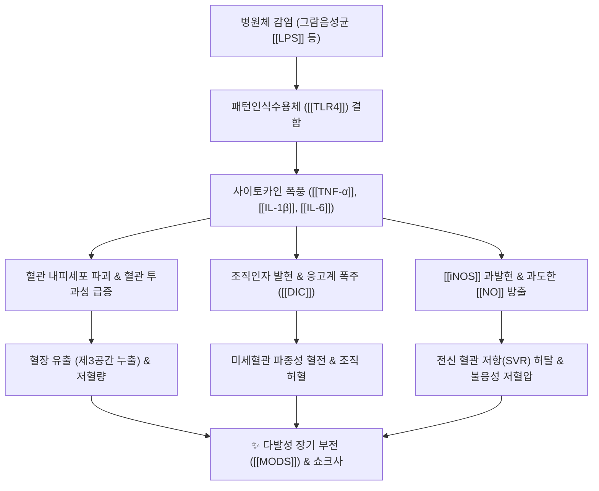

---
aliases:
  - 패혈증
  - Sepsis
  - 패혈성 쇼크
  - Septic Shock
tags:
  - 질환
  - 순환기계
  - 혈액질환
  - 감염
  - 중증질환
  - 전신염증반응
  - 다발성장기부전
  - 응급의학
---
# 🫀 [[패혈증]] (Sepsis, 전신성 감염증)

> **핵심 요약 (Key Summary)**:
> 세균, 바이러스 등 감염원에 대한 인체의 조절되지 않는 면역 반응(Dysregulated host response)으로 인해 생명을 위협하는 치명적인 다발성 장기 기능 부전(Organ dysfunction).
> 병원체 내독소(LPS)와 [[TLR4]] 결합으로 인한 사이토카인 폭풍([[TNF-α]], [[IL-6]]), 혈관 내피세포 파괴, 미세혈관 혈전 및 파종성 혈관내 응고([[DIC]]), 저혈압 쇼크 유발.
> 한의학의 온병(溫病) 열입영혈(熱入營血), 온역(溫疫), 망양(亡陽)·탈증(脫證)에 해당하며 신속한 광범위 항생제, 수액 소생술 및 승압제 치료가 생존율을 결정.

---

## 📌 목차
1. [정의 및 진단 기준 (Sepsis-3)](#1-정의-및-진단-기준-sepsis-3)
2. [분자병태생리 및 면역 기전 (Pathophysiology)](#2-분자병태생리-및-면역-기전-pathophysiology)
3. [임상 경과 및 다발성 장기 손상 (Organ Dysfunction)](#3-임상-경과-및-다발성-장기-손상-organ-dysfunction)
4. [현대 의학적 응급 치료 프로토콜 (Surviving Sepsis Campaign)](#4-현대-의학적-응급-치료-프로토콜-surviving-sepsis-campaign)
5. [한의학적 병리 인식 및 보조적 연구 (온병학 연계)](#5-한의학적-병리-인식-및-보조적-연구-온병학-연계)
6. [출처 및 학술 참고 문헌 (References)](#6-출처-및-학술-참고-문헌-references)

---

## 1. 정의 및 진단 기준 (Sepsis-3)

* **패혈증 (Sepsis)**:
  * 감염으로 인해 발생하는 급격한 장기 기능 손상으로, 병원 내 사망률이 10%를 초과하는 중증 응급 질환.
* **패혈성 쇼크 (Septic Shock)**:
  * 충분한 수액 공급에도 불구하고 저혈압이 지속되어 평균 동맥압($\text{MAP} \ge 65\text{ mmHg}$) 유지를 위해 승압제(Vasopressor)가 필요하고, 혈청 젖산(Lactate) 농도가 2 mmol/L를 초과하는 상태 (사망률 40% 초과).
* **qSOFA (quick SOFA) 스크리닝 도구 (2점 이상 시 패혈증 강력 의심)**:
  1. 수축기 혈압 $\le 100\text{ mmHg}$
  2. 호흡수 $\ge 22\text{ 회/분}$
  3. 의식 변화 (GCS < 15)

---

## 2. 분자병태생리 및 면역 기전 (Pathophysiology)

* **초기 과염증 반응(Hyper-inflammation)과 사이토카인 폭풍**:
  * 대식세포와 호중구가 과도하게 활성화되어 분비한 전염증성 물질들이 전신 혈관 내피를 공격하여 모세혈관 누출을 일으킴.
* **미세순환 붕괴 및 파종성 혈관내 응고(DIC)**:
  * 혈관 내피 손상으로 혈소판과 응고 인자가 무분별하게 소모되어 전신 장기의 모세혈관에 미세혈전이 형성되고, 2차적으로 응고인자 고갈에 따른 출혈 경향이 동반됨.
* **후기 면역마비 (Immune Paralysis)**:
  * 림프구 세포사멸(Apoptosis)과 조절 T세포 증가로 인해 인체 면역계가 고갈 상태에 빠지며 2차 기회감염에 취약해짐.

---

## 3. 임상 경과 및 다발성 장기 손상 (Organ Dysfunction)

* **폐 (Respiratory)**:
  * 폐포 모세혈관 투과성 증가로 인한 급성 호흡곤란 증후군(ARDS, 백색 폐).
* **신장 (Renal)**:
  * 신혈류량 급감 및 허혈로 인한 급성 신손상(AKI), 핍뇨, 무뇨, 혈청 크레아티닌 급등.
* **뇌·신경계 (CNS)**:
  * 뇌혈관 장벽 손상 및 뇌혈류 저하로 인한 패혈성 뇌병증(Septic Encephalopathy), 섬망, 혼수.
* **간 및 위장관 (Hepatic & GI)**:
  * 허혈성 간염, 황달, 장마비(Ileus), 장벽 장벽 붕괴에 따른 균교대증.

---

## 4. 현대 의학적 응급 치료 프로토콜 (Surviving Sepsis Campaign)

* **1시간 묶음 치료 (Hour-1 Bundle)**:
  1. **혈청 젖산(Lactate) 농도 즉시 측정** (2 mmol/L 초과 시 재측정).
  2. **항생제 투여 전 혈액 배양(Blood culture) 2쌍 이상 채취**.
  3. **1시간 이내 광범위 정맥용 항생제 투여**.
  4. **저혈압 또는 젖산 $\ge 4\text{ mmol/L}$ 시 결정질 수액(크리스탈로이드) 30 mL/kg 급속 정맥 투여**.
  5. **수액 투여 중/후에도 저혈압 지속 시 노르에피네프린(Norepinephrine) 승압제 즉시 투약** (목표 MAP $\ge 65\text{ mmHg}$).

---

## 5. 한의학적 병리 인식 및 보조적 연구 (온병학 연계)

* **온병학(溫病學) 영혈분증(營血分證)과 패혈증**:
  * 패혈증의 급격한 악화는 온병에서 역병의 독기(疫毒)가 기분(氣分)을 지나 영분(營分)과 혈분(血分)으로 직중하는 **열입영혈(熱入營血)**로 해석됨.
  * 고열, 섬어(헛소리), 반진(피하 출혈반), 설강(붉고 마른 혀)은 현대의 DIC 및 패혈성 뇌병증과 일치.
* **회양구역(回陽救逆)과 망양(亡陽) 쇼크**:
  * 패혈성 쇼크로 사지가 싸늘해지고 맥이 미약해지며 혈압이 떨어지는 상태는 정기가 완전히 무너지는 망양(亡陽) 및 탈증(脫證).
* **중국의학 패혈증 보조 연구 방제**:
  * [[청영탕]], [[안궁우황환]]: 급성기 과염증 사이토카인 폭풍 억제 및 뇌세포 보호.
  * [[사역탕]], 참부주사액([[인삼]]+[[부자]]): 패혈성 쇼크기 심근 수축력 보조 및 혈압 유지 보조 연구.

---

## 6. 출처 및 학술 참고 문헌 (References)

* Singer, M., et al. (2016). The Third International Consensus Definitions for Sepsis and Septic Shock (Sepsis-3). *JAMA*, 315(8), 801-810.
  * `[연구 요약]` SOFA 점수 기반의 패혈증 및 패혈성 쇼크의 최신 진단 기준(Sepsis-3)을 공표한 세계 의학 표준 논문.
* Evans, L., et al. (2021). Surviving Sepsis Campaign: International Guidelines for Management of Sepsis and Septic Shock 2021. *Critical Care Medicine*, 49(11), e1063-e1143.
  * `[연구 요약]` 수액 소생술, 승압제 선택, 항생제 투약 및 다발성 장기 부전 관리에 관한 국제 패혈증 가이드라인.
