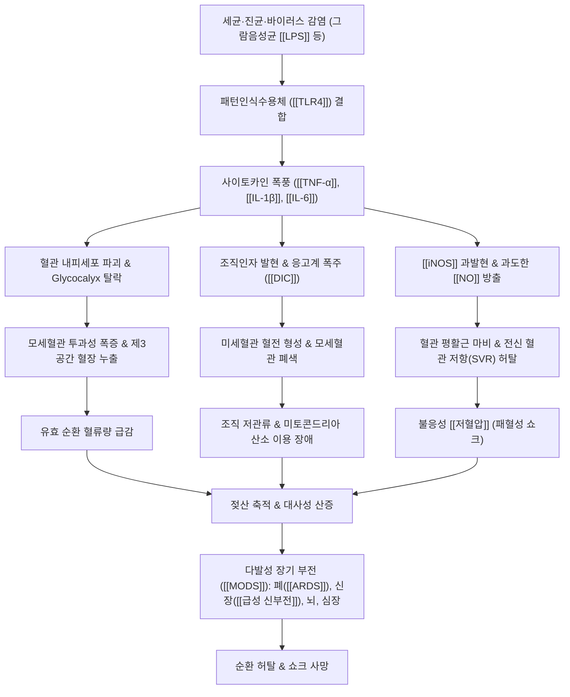
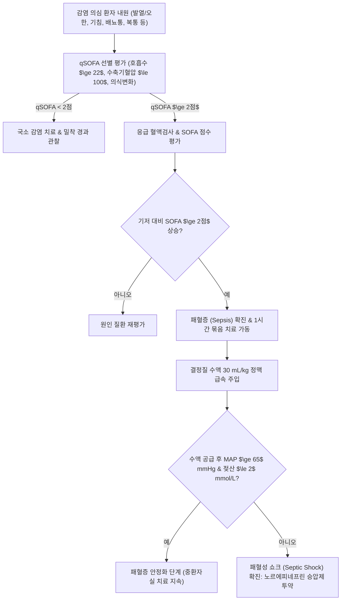

---
aliases:
  - 패혈증
  - Sepsis
  - 패혈성 쇼크
  - Septic Shock
tags:
  - 이론
  - 질환
  - 순환기계
  - 혈액질환
  - 감염
  - 응급의학
title: 패혈증
date: 2026-09-21
출처: "PMID: 26903338"
---
# 🫀 [[패혈증]] (Sepsis, 전신성 감염증)

> **핵심 3줄 요약 (Key Summary)**:
> 🎯 질환 개요: 세균, 바이러스, 진균 등 중증 감염원에 대한 인체의 조절 불능 면역 반응(Dysregulated Host Response)으로 다발성 장기 기능 부전([[MODS]]) 및 순환 허탈을 유발하는 치명적인 응급 순환기 질환.
> 🚩 병태생리 & 증상: 병원체 내독소([[LPS]])와 [[TLR4]] 결합으로 인한 사이토카인 폭풍([[TNF-α]], [[IL-6]]), 파종성 혈관내 응고([[DIC]]), 모세혈관 누출 및 저혈압 쇼크, 고열·오한, 빈호흡, 의식 혼미, 핍뇨.
> 🔍 진단 & 치료: qSOFA 선별 및 SOFA 2점 이상 급상승 진단, 1시간 묶음 치료(Hour-1 Bundle: 젖산 측정, 혈액배양, 광범위 항생제, 수액 소생술, 노르에피네프린 승압제); 한의학의 온병(溫病) 열입영혈(熱入營血) 및 망양탈증(亡陽脫證) 병리 융합.
> ⚠️ 주의사항: qSOFA 2점 이상 또는 수액 공급에도 지속되는 평균 동맥압 65 mmHg 미만의 패혈성 쇼크는 사망률이 40%를 초과하는 초응급 상태이므로 즉각적인 상급종합병원 응급실 전원 필수.

---

## 📌 목차
1. [질환 개요 & 해부학적 병태생리](#1-질환-개요--해부학적-병태생리)
2. [병태생리 메커니즘 & 생체역학적 악순환 네트워크](#2-병태생리-메커니즘--생체역학적-악순환-네트워크)
3. [임상 증상 & 이학적 검사 알고리즘](#3-임상-증상--이학적-검사-알고리즘)
4. [감별 진단 매트릭스](#4-감별-진단-매트릭스)
5. [현대 의학적 응급 처치 & 한의 통합 치료 프로토콜](#5-현대-의학적-응급-처치--한의-통합-치료-프로토콜)
6. [중환자실 퇴원 후 회복 & 생활습관 티칭](#6-중환자실-퇴원-후-회복--생활습관-티칭)
7. [💡 사용자 진료실 핵심 필기 & 임상 노하우](#7-💡-사용자-진료실-핵심-필기--임상-노하우)
8. [출처 및 학술 참고 문헌](#8-출처-및-학술-참고-문헌)

---

## 1. 질환 개요 & 해부학적 병태생리

### 1.1 정의 및 임상적 중요성 (Sepsis-3)
* **패혈증 (Sepsis)**:
  * 세균, 바이러스, 진균 등의 국소 감염이 전신으로 파급되거나, 감염에 대한 생체의 면역 반응이 비정상적으로 조절을 상실하여 생명을 위협하는 장기 기능 부전(Life-threatening Organ Dysfunction)을 초래하는 급성 전신성 증후군.
  * 현대 국제 진단 기준(Sepsis-3 Consensus)에 따르면 순차적 장기 부전 평가(SOFA) 점수가 기저치 대비 2점 이상 급격히 상승한 상태로 정의되며, 일반 입원 환자에서도 병원 내 사망률이 10%를 상회하는 응급 질환.
* **패혈성 쇼크 (Septic Shock)**:
  * 패혈증 환자 중 순환계, 세포 및 대사 이상이 현저하여 사망 위험이 극도로 높아진 세부 아형.
  * 적절한 용량의 결정질 수액(Crystalloid, 30 mL/kg) 투여 후에도 지속적인 저혈압이 이어져 평균 동맥압($\text{MAP} \ge 65\text{ mmHg}$) 유지를 위해 혈관수축 승압제(Vasopressor)가 필수적이며, 혈청 젖산(Lactate) 농도가 $2\text{ mmol/L}$($18\text{ mg/dL}$)를 초과하는 상태(병원 내 사망률 40% 초과).

### 1.2 관련 해부학적 구조 & 미세순환 네트워크
* **혈관 내피세포 글리코칼릭스(Endothelial Glycocalyx)**:
  * 모세혈관 내피를 코팅하는 음전하 당단백질 층으로, 혈관 투과성 장벽 유지와 혈소판 점착 억제 담당. 패혈증 시 내피 손상으로 글리코칼릭스가 탈락하여 전신 모세혈관 누출 증후군(Capillary Leak Syndrome) 발생.
* **폐포-모세혈관 장벽(Alveolar-Capillary Barrier)**:
  * 폐포 상피세포와 폐 모세혈관 내피 사이의 가스 교환 단위. 내피 투과성 폭증 시 단백질과 삼출액이 폐포강으로 급격히 유입되어 급성 호흡곤란 증후군([[ARDS]])을 유발.
* **신장 사구체 및 세뇨관 혈관계**:
  * 전신 저혈압 및 미세혈전으로 사구체 관류압이 급감하고 세뇨관 허혈-괴사가 진행되어 핍뇨 및 급성 신손상([[급성 신부전]]) 초래.

### 1.3 내독소-수용체 복합체 및 미세순환 병태 도해

![[TLR4_signaling_pathway_Pathway.png|450]]
> [그림 1: ① 병원체 내독소(LPS)와 TLR4 결합에 의한 MyD88/TRIF 신호전달 및 사이토카인 폭풍 분자 경로 도해]

![[DIC_With_Microangiopathic_Hemolytic_Anemia.jpg|450]]
> [그림 2: ② 패혈증 미세혈관 혈전 및 파종성 혈관내 응고(DIC)로 인한 분열적혈구(Schistocyte, 투구세포) 혈액도말 소견]

![[청강의감06_13_폐포_염증_삼출액_도해.jpg|450]]
> [그림 3: ③ 패혈증 폐 모세혈관 누출에 따른 급성 호흡곤란 증후군(ARDS) 폐포 내 삼출액 저류 병태 도해]

---

## 2. 병태생리 메커니즘 & 생체역학적 악순환 네트워크

### 2.1 사이토카인 폭풍 및 혈관 내피세포 파괴 (Hyper-inflammation)
* **PAMPs/DAMPs 인식과 염증 캐스케이드 폭주**:
  * 그람음성균의 지질다당류([[LPS]])나 그람양성균의 펩티도글리칸이 단핵구 및 대식세포 표면의 Toll 유사 수용체([[TLR4]], TLR2)에 결합.
  * NF-κB 및 MAPK 경로가 활성화되어 전염증성 사이토카인([[TNF-α]], [[IL-1β]], [[IL-6]], IL-8)의 대량 분비 촉발(사이토카인 폭풍).
* **유도성 일산화질소 합성효소([[iNOS]]) 활성화와 혈관 마비**:
  * 염증 매개물질이 혈관 평활근세포의 [[iNOS]]를 과발현시켜 과도한 일산화질소([[NO]])를 방출, 전신 세동맥 평활근이 이완되어 전신 혈관 저항(SVR)이 붕괴.

### 2.2 파종성 혈관내 응고([[DIC]])와 미세순환 허혈
* **조직인자(Tissue Factor) 발현과 응고계 폭주**:
  * 활성화된 내피세포와 단핵구가 조직인자를 과발현하여 외인성 응고계를 활성화하고 트롬빈(Thrombin)을 대량 형성.
  * 반면 안티트롬빈 III, 단백질 C 등 생체 항응고 기전은 급격히 고갈되어 전신 모세혈관망에 미세혈전이 광범위하게 침착.
* **소모성 응고병증 및 이차 출혈**:
  * 미세혈전 형성에 혈소판과 응고 인자가 무분별하게 소모되면서 분열적혈구(Schistocyte)가 형성되고, 점막 출혈 및 피하 자반(Purpura)이 동반되는 [[DIC]] 진행.

### 2.3 전신 혈관 저항 허탈과 불응성 패혈성 쇼크
* **제3공간 체액 유출(Third-spacing)**:
  * 모세혈관 투과성 증가로 순환 혈장의 30~50%가 간질강으로 유출되어 심각한 저혈량증(Effective Hypovolemia) 유발.
* **미토콘드리아 호흡 부전(Cytopathic Hypoxia)**:
  * 충분한 산소가 공급되더라도 조직 세포 내 미토콘드리아의 전자전달계 효소가 불활성화되어 산소를 활용하지 못하고 혐기성 해당과정으로 전환, 혈중 젖산(Lactate) 급증 및 심각한 대사성 산증 진행.

### 2.4 악순환 네트워크 (Pathophysiological Network)

---

## 3. 임상 증상 & 이학적 검사 알고리즘

### 3.1 주요 임상 징후 및 전신 침범 양상
* **초기 고역동성 단계 (Warm Shock, 따뜻한 쇼크)**:
  * 말초 혈관 확장에 의해 사지가 따뜻하고 분홍빛을 띰.
  * 고열(체온 $\ge 38.3^\circ\text{C}$) 또는 반대로 저체온(체온 $< 36.0^\circ\text{C}$ - 예후 불량 징후).
  * 빈맥(심박수 $> 90\text{ 회/분}$), 빈호흡(호흡수 $> 20\text{ 회/분}$).
* **후기 저역동성 단계 (Cold Shock, 차가운 쇼크)**:
  * 심근 억제 물질(Myocardial Depressant Factor)에 의해 심박출량이 떨어지며 사지가 싸늘하고 축축해짐.
  * 청색증, 망상형 피반(Mottling, 무릎 주변 피부의 얼룩덜룩한 그물망 청자색 반점), 모세혈관 재충혈 시간(CRT) 3초 이상 지연.
* **장기별 부전 징후**:
  * **폐**: 산소포화도 급락, 거품소리(Crackle), 급성 호흡곤란.
  * **신장**: 소변량 감소(시간당 $0.5\text{ mL/kg}$ 미만), 핍뇨, 혈청 크레아티닌 급등.
  * **중추신경계**: 패혈성 뇌병증에 의한 안절부절, 섬망, 기면, 혼수(GCS 저하).
  * **혈액계**: 점막 출혈, 주사 바늘 부위 지혈 지연, 자반증.

### 3.2 응급 선별 및 중증도 평가 도구
* **qSOFA (quick SOFA) 신속 선별 기준 (외래/응급실에서 2점 이상 시 고위험군 즉시 의심)**:
  1. **호흡수 (Respiratory Rate)**: $\ge 22\text{ 회/분}$
  2. **의식 상태 (Altered Mentation)**: Glasgow Coma Scale (GCS) $< 15$ (명료하지 못함)
  3. **수축기 혈압 (Systolic BP)**: $\le 100\text{ mmHg}$
* **SOFA (Sequential Organ Failure Assessment) 점수 (기저 대비 2점 이상 상승 시 패혈증 확진)**:
  * $\text{PaO}_2/\text{FiO}_2$ 비율(호흡기), 혈소판 수치(응고계), 빌리루빈(간), 평균동맥압/승압제 요구량(순환기), GCS(신경계), 크레아티닌/소변량(신장)의 6대 장기 기능 정량 평가.

### 3.3 응급 진단 흐름도 (Diagnostic Algorithm)

---

## 4. 감별 진단 매트릭스

| 질환명 | 주 호발 원인 | 혈역학적 특성 (혈압/말초) | 혈청 젖산 및 염증 지표 | 주요 감별 포인트 |
| :--- | :--- | :--- | :--- | :--- |
| [[패혈증]] / [[패혈성 쇼크]] | 세균·진균 감염, 폐렴, 요로감염, 복막염 | 초기 온난 쇼크(혈관 확장), 후기 한랭 쇼크 | 젖산 $\ge 2\text{ mmol/L}$, CRP·Procalcitonin 급등 | 명확한 감염원, 체온 이상(고열/저체온), 백혈구 이상치 |
| [[저혈량성 쇼크]] | 급성 출혈(외상, GI 출혈), 극심한 탈수, 화상 | 사지 차가움, 경정맥 허탈, 중심정맥압 급감 | 젖산 상승 가능, 감염 지표는 대개 정상 | 출혈력 또는 구토/설사력, 혈색소 급락, 체액 보충 시 즉각 호전 |
| [[심인성 쇼크]] | [[심근경색증]], 중증 심근염, 말기 [[심부전]] | 사지 차가움, 경정맥 분노, 폐부종 수포음 | 젖산 상승, 트로포닌·BNP 급등 | 흉통 선행, 심초음파상 좌심실 구혈률(EF) 급락, 수액 투여 시 악화 |
| [[아나필락시스]] | 약물, 곤충 자상, 음식물 알레르기 | 혈관 확장 저혈압, 피부 홍반, 두드러기 | 감염 지표 정상, 혈청 트립타제(Tryptase) 상승 | 항원 노출 직후 발생, 후두부종에 의한 천명음(Stridor), 에피네프린 즉각 반응 |
| [[부신 부전]] (부신 위기) | 스테로이드 급격한 중단, 애디슨병 | 불응성 저혈압, 저혈당, 과색소침착 | 저나트륨혈증, 고칼륨혈증 동반 | 수액 및 승압제에 반응하지 않으나 히드로코르티손 투여 시 급격 회복 |

---

## 5. 현대 의학적 응급 처치 & 한의 통합 치료 프로토콜

### 5.1 현대의학 응급 소생술 (Surviving Sepsis Campaign: Hour-1 Bundle)
* **1시간 묶음 치료 (Hour-1 Bundle, 즉각 시행)**:
  1. **혈청 젖산(Lactate) 농도 즉시 측정**: $2\text{ mmol/L}$ 초과 시 소생술 반응 평가를 위해 2~4시간 간격 재측정.
  2. **혈액 배양(Blood Culture) 2쌍 이상 채취**: 항생제 투여 전 반드시 서로 다른 부위에서 채취(원인균 동정).
  3. **1시간 이내 광범위 정맥용 항생제 투여**: 의심 감염 부위에 맞추어 지체 없이 투약.
  4. **결정질 수액(Crystalloid) $30\text{ mL/kg}$ 급속 정맥 투여**: 저혈압 또는 혈청 젖산 $\ge 4\text{ mmol/L}$ 시 3시간 이내 공급.
  5. **노르에피네프린(Norepinephrine) 승압제 투약**: 수액 공급 중/후에도 저혈압 지속 시 목표 $\text{MAP} \ge 65\text{ mmHg}$ 달성을 위해 1차 선택 승압제 사용.

### 5.2 한의학적 병리 인식 (온병학 연계)
* **온병학(溫病學) 영혈분증(營血分證)과 열입영혈(熱入營血)**:
  * 외감 사기(疫毒)가 기분(氣分)의 백호탕 단계를 지나 영분(營分)과 혈분(血分)으로 깊이 침범하여 진액을 태우고 혈맥을 망가뜨리는 병태.
  * 고열, 신혼(神昏, 의식 혼탁), 섬어(譫語, 헛소리), 설강(舌絳, 붉고 바짝 마른 혀), 피부 반진(斑疹, 자반)은 패혈증의 사이토카인 폭풍, 뇌병증, [[DIC]] 병태와 정확히 부합.
* **회양구역(回陽救逆)과 망양(亡陽)·탈증(脫證)**:
  * 패혈성 쇼크로 사지가 싸늘해지고(사역), 땀이 비 오듯 흐르며 맥이 미약해지는 것은 양기가 완전히 허탈되는 망양(亡陽)의 응급 상태.

### 5.3 한약 병용 및 중환자실 후유증 보조 연구 처방
* **급성 과염증기 / 온병 해독 (중국의학 ICU 협진 연구)**:
  * [[청영탕]], [[안궁우황환]]: 혈분 열독을 맑히고 뇌세포를 보호하며 전염증성 사이토카인 억제 목적으로 연구.
  * [[황련해독탕]]: [[황련]]([[베르베린]]), [[황금]]([[바이칼린]]) 등이 내독소 유발 TLR4 신호전달과 NF-κB 활성을 억제하여 미세혈관 내피 보호.
* **쇼크 회복기 / 양기 구원**:
  * [[사역탕]], 참부주사액([[인삼]]+[[부자]]): 혈관 평활근 긴장도 보조, 심박출량 지지 및 미세순환 회복에 대한 임상 연구 존재.
* **회복기 기혈양허(氣血兩虛) 및 장기 기능 회복**:
  * [[보중익기탕]], [[십전대보탕]]: 면역마비(Immune Paralysis) 극복, 림프구 수 회복 및 장 점막 장벽 강화.
  * [[생맥산]]: 폐포 모세혈관 손상 후 회복기 진액 고갈 및 마른 기침, 기운 저하 개선.

### 5.4 침구 치료 및 신경-면역 조절
* **미주신경-항염증 콜린성 경로(Cholinergic Anti-inflammatory Pathway) 자극**:
  * 침 자극은 미주신경을 활성화하여 비장의 대식세포에서 아세틸콜린 수용체(α7nAChR)를 매개로 [[TNF-α]], [[IL-6]] 방출을 전신적으로 억제하는 기전이 규명됨.
* **주요 혈자리 취혈 (자침 시 위생 및 감염 예방 엄수)**:
  * 족삼리(ST36): 미주신경 활성화 및 위장관 운동성 촉진, 항염증 반응 유도.
  * 곡지(LI11), 합곡(LI4): 열독 청열 및 전신 염증 조절.
  * 내관(PC6): 심근 기능 안정화 및 자율신경계 균형 유지.
  * 백회(GV20), 인당(EX-HN3): 뇌혈류 개선 및 패혈성 뇌병증 후유증(인지 저하) 완화.

---

## 6. 중환자실 퇴원 후 회복 & 생활습관 티칭

### 6.1 패혈증 후 증후군(Post-Intensive Care Syndrome, PICS) 관리
* **PICS의 3대 영역 관리**:
  * 패혈증 생존자의 50% 이상이 중환자실 퇴원 후 신체적(근감소증, 무기력), 인지적(기억력 감퇴, 집중력 저하), 정신적(외상 후 스트레스 장애, 우울증) 복합 장애를 겪음.
  * 퇴원 후 최소 3~6개월간 체계적인 회복 추적 관찰이 필수적.

### 6.2 단계적 근골격계 재활 및 호흡 재활
* **중환자실 획득성 쇠약(ICU-acquired Weakness, ICUAW) 극복**:
  * 침상 내 수동 관절 가동 운동(PROM)부터 시작하여 의자 앉기, 보행기 보행, 맨몸 스쿼트 순으로 점진적 근력 강화.
  * 급성 호흡곤란 증후군을 겪은 환자는 폐활량계(Incentive Spirometer)를 활용한 심호흡 훈련 및 복식 호흡 티칭.

### 6.3 장내 미생물총 재건 및 영양 요법
* **광범위 항생제 노출 후 장내 미생물총 불균형(Dysbiosis) 회복**:
  * 다량의 정맥 항생제로 인해 유익균이 멸살되고 클로스트리디오이데스 디피실(C. difficile) 감염 위험 증가.
  * 고품질 프로바이오틱스 섭취, 수용성 식이섬유 위주의 식단, 생강차 등을 통해 장 점막 재생 촉진.

---

## 7. 💡 사용자 진료실 핵심 필기 & 임상 노하우

### 7.1 외래 진료실에서의 패혈증 조기 탐지(Red Flag) 및 전원 원칙
* **진료실 qSOFA의 엄격한 적용**:
  * 고열, 오한 또는 심한 기력 저하로 내원한 환자에서 혈압이 평소보다 뚝 떨어져 수축기 혈압 100 mmHg 이하이거나, 가만히 앉아 있는데도 호흡수가 분당 22회를 넘고, 질문에 대답이 어눌하거나 멍한 상태(의식 변화)가 관찰되면 즉시 패혈증을 의심해야 함.
  * 특히 요로감염(고령 여성, 배뇨통, 측복통)이나 폐렴(화농성 가래, 빈호흡), 연조직염(피부 발적 급속 팽창)이 선행된 환자에서 체온이 36도 미만으로 떨어지는 저체온증(Hypothermia)을 보이면 매우 위중한 상태이므로 원내에서 지체하지 말고 119 구급대를 호출하여 상급병원 응급실로 즉시 전원 조치할 것.

### 7.2 ICU 퇴원 환자(패혈증 회복기)의 한의 임상 매니지먼트
* **패혈증 회복기 진료의 본질은 '기음양허(氣陰兩虛)'와 '면역마비' 극복**:
  * 패혈증으로 ICU에서 인공호흡기 치료와 승압제 치료를 받고 퇴원한 환자들은 외형상 감염은 통제되었으나 극심한 근위축, 체중 감소, 만성 피로, 식은땀, 미열감을 호소함.
  * 이는 온병학에서 사기가 물러간 뒤 정기가 극도로 쇠약해진 '여열미청(餘熱未淸) 기음양상(氣陰兩傷)' 상태.
  * 이 시기에 성급하게 온보열약(녹용, 부자 등)을 과도하게 쓰면 잠재된 염증이 재발할 수 있으므로, 초기에는 [[생맥산]] 합 [[청서익기탕]] 또는 [[자음강화탕]] 가미방으로 진액을 자양하고 폐·위의 허열을 식혀주는 것이 안전함.

### 7.3 항생제 유발성 설사 및 장내 불균형 대처
* **항생제 유도 장염의 한의 치료 접근**:
  * 2~3주 이상의 광범위 항생제 치료 후 지속되는 묽은 변, 복통, 소화불량에는 비위 기능을 북돋우고 수습을 말리는 [[삼령백출산]] 또는 [[평위산]] 합 [[오령산]]을 활용.
  * 대변에 위막(코 같은 점액)이 섞여 나오거나 발열이 재발하면 C. difficile 장염 가능성이 높으므로 경구 반코마이신 등 양방 진료를 병행하도록 지도.

### 7.4 근감소증(ICUAW) 및 만성 피로 회복 한약 프로토콜
* **체력 및 근력 재건 처방**:
  * 감염 재발 징후(발열, 백혈구 상승)가 완전히 없고 대소변이 안정된 이후에는 [[보중익기탕]]이나 [[십전대보탕]]에 [[황기]], [[백출]], [[당귀]]를 증량하여 처방.
  * 약침 치료: 족삼리(ST36), 비수(BL20), 신수(BL23) 부위에 태반(자하거) 약침 또는 황련해독탕 약침을 주 2회 병행하여 신경-근 피로 회복과 전신 면역 활성화를 도모함.

---

## 8. 출처 및 학술 참고 문헌

* Singer, M., Deutschman, C. S., Seymour, C. W., Shankar-Hari, M., Annane, D., Bauer, M., ... & Angus, D. C. (2016). The Third International Consensus Definitions for Sepsis and Septic Shock (Sepsis-3). *JAMA*, 315(8), 801-810. [PMID: 26903338](https://pubmed.ncbi.nlm.nih.gov/26903338/)
  * `[연구 요약]` qSOFA 및 SOFA 점수를 도입하여 장기 기능 부전 중심의 현대적 패혈증 및 패혈성 쇼크 진단 기준(Sepsis-3)을 확립한 랜드마크 합의 가이드라인.
* Evans, L., Rhodes, A., Alhazzani, W., Antonelli, M., Coopersmith, C. M., French, C., ... & Levy, M. M. (2021). Surviving Sepsis Campaign: International Guidelines for Management of Sepsis and Septic Shock 2021. *Critical Care Medicine*, 49(11), e1063-e1143. [PMID: 34605781](https://pubmed.ncbi.nlm.nih.gov/34605781/)
  * `[연구 요약]` 1시간 묶음 치료(Hour-1 Bundle), 수액 소생술, 승압제(노르에피네프린) 선택 기준, 목표 평균동맥압(65 mmHg) 관리에 대한 최신 국제 임상 진료 지침.
* Angus, D. C., & van der Poll, T. (2013). Severe sepsis and septic shock. *New England Journal of Medicine*, 369(9), 840-851. [PMID: 23984731](https://pubmed.ncbi.nlm.nih.gov/23984731/)
  * `[연구 요약]` 패혈증의 분자 면역학적 기전, 사이토카인 폭풍, 혈관 내피세포 기능 부전 및 미세혈관 혈전 형성(DIC)의 병태생리를 종합 정리한 종설.
* Hao, P., Jiang, F., Cheng, J., Ma, L., Zhang, J., & Shen, Y. (2017). Traditional Chinese medicine for cardiovascular disease: evidence and potential mechanisms. *Journal of the American College of Cardiology*, 69(24), 2952-2966. [PMID: 28619197](https://pubmed.ncbi.nlm.nih.gov/28595687/)
  * `[연구 요약]` 한약 복합 제제 및 유효 성분이 혈관 내피세포 보호, 전신 염증 신호 억제 및 미세순환 장애 개선에 미치는 분자생물학적 기전과 임상 근거를 고찰.

<!-- 보관 태그(1회용·링크오류, 필요시 복원): 중증질환, 전신염증반응, 다발성장기부전 -->
