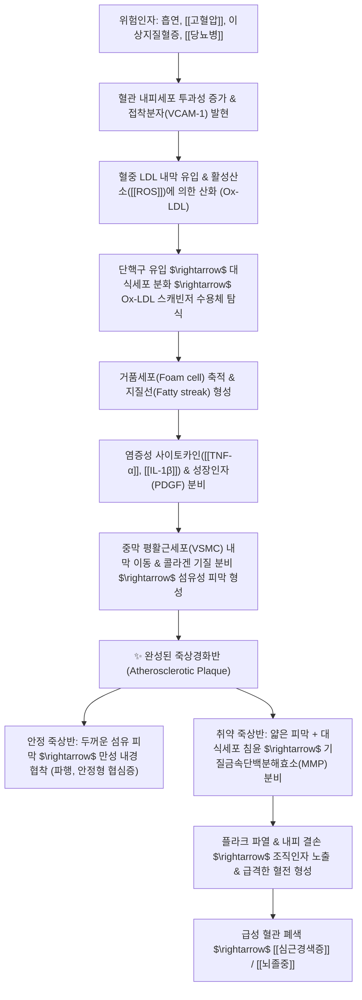

# 🩺 [[동맥경화증]] (Atherosclerosis / 動脈硬化症, I70)

> **핵심 3줄 요약 (Key Summary)**:
> - 📍 병소 부위 & 해부·병태생리: 전신 중·대형 탄력 및 근육성 동맥(대동맥, 관상동맥, 경동맥, 뇌기저동맥, 하지동맥)의 내막(Tunica intima); 혈관 내피세포 손상, 산화 LDL의 대식세포 탐식 및 거품세포(Foam cell) 침착으로 인한 섬유성 죽상경화반 형성.
> - 🚩 전형적 임상 양상 & 3대 징후: 진행 전까지 장기간 무증상(잠복기); 이환 혈관에 따라 파행(Claudication; 보행 시 하지 통증), [[협심증]](노작성 흉통), 일과성 허혈발작(TIA; 편마비, 언어장애).
> - 🛠️ 핵심 감별 검사 & 한·양방 다각적 치료 전략: 경동맥 초음파(내중막 두께 IMT)·발목상완지수(ABI)·맥파전달속도(baPWV), 양방 스타틴·에제티미브·항혈소판제 및 한의 침구(태충, 곡지, 족삼리), 단삼보심탕·방풍통성산·온담탕 치법.
> - ⚠️ 응급 의뢰 레드플래그 & 악화 요인: 취약 죽상반 파열에 의한 급성 혈전 형성([[급성 심근경색증]], [[뇌졸중]], 급성 하지 허혈) 시 즉시 119 구급 이송, 흡연·고지방식·좌식 생활·[[고혈압]] 및 [[당뇨병]] 방치 엄격 금기.

---

## 📌 목차
1. [질환 개요 & 해부학적 병태생리](#1-질환-개요--해부학적-병태생리)
2. [병태생리 메커니즘 & 생체역학적 악순환 네트워크](#2-병태생리-메커니즘--생체역학적-악순환-네트워크)
3. [임상 증상 & 이학적 검사(Physical Exam) 알고리즘](#3-임상-증상--이학적-검사physical-exam-알고리즘)
4. [감별 진단 매트릭스 (Differential Diagnosis)](#4-감별-진단-매트릭스-differential-diagnosis)
5. [한의 통합 치료 프로토콜 (침·약침·추나·한약)](#5-한의-통합-치료-프로토콜-침약침추나한약)
6. [양방 치료 & 병용·의뢰 기준 (Conventional Treatment & Referral)](#6-양방-치료--병용의뢰-기준-conventional-treatment--referral)
7. [재활 운동 & 생활습관 티칭 가이드](#6-재활-운동--생활습관-티칭-가이드)
8. [💡 사용자 진료실 핵심 필기 & 임상 노하우 (Melt-In 잔여 심화 집약)](#7--사용자-진료실-핵심-필기--임상-노하우-melt-in-잔여-심화-집약)
9. [출처 및 학술 참고 문헌 (References)](#8-출처-및-학술-참고-문헌-references)

---

## 1. 질환 개요 & 해부학적 병태생리

![[동맥경화증-20240524162242470.png|450]]
> [그림 1: ① 혈관 내막 안쪽에 축적된 산화 LDL을 큰포식세포가 탐식하여 거품세포(Foam cell)가 되고 죽상반을 형성하는 동맥경화 메커니즘]

* **질환 정의 및 용어 구분**:
  * **죽상경화증 (Atherosclerosis)**: 혈관 내막에 지질(콜레스테롤)이 침착하고 대식세포와 혈관평활근세포가 증식하여 죽종(Atheroma) 또는 플라크를 형성하는 질환.
  * **동맥경화증 (Arteriosclerosis)**: 노화나 고혈압으로 인해 동맥 중막이 비후되고 탄성을 잃어 딱딱하게 굳는 현상을 포함하는 포괄적 병태 (묀케베르크 경화증, 세동맥경화증 포함).
* **호발 원인 및 위험 요인**:
  * 흡연, 운동 부족, 비만, [[고혈압]], 이상지질혈증([[고지혈증]]), [[당뇨병]], 가족력 및 만성 염증성 질환.
* **호발 혈관 부위**:
  * **관상동맥**: [[협심증]], [[심근경색증]] 유발.
  * **뇌동맥 및 총경동맥 분지부**: 허혈성 [[뇌졸중]], 혈관성 치매 유발.
  * **신동맥**: 신혈관성 [[고혈압]], 만성 신기능 상실 유발.
  * **복부대동맥 및 장골·대퇴동맥**: 복부대동맥류(AAA), 말초동맥질환(PAD).

---

## 2. 병태생리 메커니즘 & 생체역학적 악순환 네트워크

![[Atherosclerosis.jpg|450]]
> [그림 2: ② 정상 동맥(Normal Artery) 대비 지질 침착 죽상반(Lipid deposit of plaque) 형성에 따른 혈류 통로 협착 비교 단면도]

### 1) 플라크 형성 4단계 병태생리
1. **내피세포 손상 및 단핵구 유착 (Endothelial Injury & Adhesion)**:
   * 고혈압의 물리적 전단응력, 담배 독소, 고혈당으로 혈관내피 손상 $\rightarrow$ VCAM-1, ICAM-1 발현으로 단핵구 혈관벽 부착.
2. **LDL 산화 및 거품세포 형성 (Lipid Oxidation & Foam Cell Formation)**:
   * 내피 아래로 스며든 LDL이 산화(Oxidized LDL)되면 대식세포가 무제한 탐식하여 거품세포로 변질 $\rightarrow$ 괴사(Necrosis) 후 세포외 지질 중심핵(Lipid-rich necrotic core) 구성.
3. **섬유성 피막 형성 (Fibrous Cap Formation)**:
   * 혈관평활근세포가 중막에서 내막으로 이동해 콜라겐을 합성함으로써 지질핵을 덮는 섬유성 피막 형성.
4. **죽상반 파열 및 급성 혈전증 (Plaque Rupture & Thrombosis)**:
   * 염증세포가 분비하는 MMP(Matrix metalloproteinase)가 섬유성 피막을 갉아먹어 얇아지면 혈류 압력에 파열되어 혈액 응고계 폭주 $\rightarrow$ 붉은 혈전 형성으로 급성 폐색.

---

## 3. 임상 증상 & 이학적 검사(Physical Exam) 알고리즘

### 1) 장기별 침범 증상
* **심혈관계**:
  * 관상동맥 협착에 따른 운동 유발성 흉통([[협심증]]), 급성 흉통 및 호흡곤란([[심근경색증]]).
* **뇌혈관계**:
  * 일과성 허혈발작(TIA), 편측 위약감, 구음장애, 안면마비, 어지럼증, 인지 기능 저하.
* **말초혈관계 (하지동맥)**:
  * **간헐성 파행 (Intermittent Claudication)**: 일정 거리를 걸으면 장딴지나 둔부에 쥐가 나듯 당기고 뻐근한 통증이 발생하며, 서서 쉬면 수분 내 소실.
  * 중증 시 하지 냉감, 족배동맥 맥박 소실, 피부 궤양 및 괴사.

### 2) 필수 이학적 검사 & 선별 검사법
* **동맥 맥박 촉진 (Pulse Palpation)**:
  * 요골동맥, 족배동맥(Dorsalis pedis), 후경골동맥(Posterior tibial), 대퇴동맥의 좌우 맥박 대칭성 및 세기 평가.
* **혈관 잡음 청진 (Bruit Auscultation)**:
  * 청진기 벨(Bell)을 이용하여 양측 경동맥, 복부 대동맥, 대퇴동맥 부위의 협착성 수축기 잡음 청진.
* **발목상완지수 (ABI, Ankle-Brachial Index)**:
  * 발목 수축기 혈압을 상완 수축기 혈압으로 나눈 값:
    * **정상**: 1.00 ~ 1.40
    * **경계선**: 0.91 ~ 0.99
    * **말초동맥질환(PAD) 진단**: **$\le$ 0.90** (민감도·특이도 90% 이상).
* **경동맥 초음파 (Carotid Ultrasonography)**:
  * 경동맥 내중막 두께(IMT, Intima-Media Thickness) 측정 (1.0mm 초과 시 동맥경화 고위험, 국소 1.5mm 이상 돌출 시 죽상반 판정).

---

## 4. 감별 진단 매트릭스 (Differential Diagnosis)

| 감별 질환 | 호발 연령 및 성별 | 침범 혈관 및 특징 | 핵심 감별 진단 소견 |
| :--- | :--- | :--- | :--- |
| [[동맥경화증]] (본 질환) | 50세 이상 남녀, 대사증후군 동반 | 중·대형 동맥 내막, 지질 침착 죽상반 | 경동맥 초음파 죽상반, ABI $\le$ 0.90, 혈중 LDL 상승 |
| 폐쇄성 혈전혈관염 ([[버거병]]) | 20~40대 젊은 남성, 심한 흡연자 | 사지 말초 소·중동맥 및 정맥, 분절성 염증 | 발가락 괴사, 지혈전염 동반, 혈관조영술 코르크스크루(Corkscrew) 측부혈관 |
| 척추관 협착증 (Spinal Stenosis) | 60세 이상 노인층 | 요추 신경근 압박으로 인한 신경인성 파행 | 쪼그려 앉거나 허리 숙이면 파행 완화, 족배동맥 맥박 정상 |
| 레이노 증후군 (Raynaud's) | 젊은 여성 호발 | 추위/스트레스에 의한 수지 말단 혈관 연축 | 손가락 색조의 3단계 변화 (창백 $\rightarrow$ 청색 $\rightarrow$ 발적), 정상 혈관 구조 |
| 심부정맥혈전증 ([[DVT]]) | 장기 부동, 암 환자, 정맥 울혈 | 하지 심부정맥 (정맥계 질환) | 편측 하지의 급격한 부종, 동통, 발적, 호만 징후(Homan's sign) 양성 |

---

## 5. 한의 통합 치료 프로토콜 (침·약침·추나·한약)

![[청강의감20_17_고지혈증약_혈관_도해.gif|420]]
> [그림 3: ③ 혈관 내막 염증 완화 및 플라크 안정화를 위한 약물 요법(스타틴 제제)과 한의 지질대사 개선 치법의 접점]

* **침구 치료 (Acupuncture)**:
  * **주요 혈위**: 태충(LR3), 곡지(LI11), 풍지(GB20), 족삼리(ST36), 풍륭(ST40), 삼음교(SP6), 혈해(SP10).
  * **자침 기전**: 풍륭혈(거담 요혈)과 삼음교·혈해혈 자침은 혈중 지질 대사를 촉진하고, 태충·곡지혈은 혈관내피 산화질소([[NO]]) 분비를 활성화하여 미세순환을 개선.
* **약침 치료 (Pharmacopuncture)**:
  * **중성어혈 약침 / 황련해독탕 약침**: 풍지, 견정, 심수, 간수, 족삼리 혈위에 주입하여 혈관벽 만성 미세염증을 억제하고 혈행 장애 완화.
* **추나 치료 (Chuna Manipulation)**:
  * 하지 파행 환자의 경우 골반 변위 및 요추 정렬 교정, 이상근 및 [[비복근]], [[가자미근]] 근막 이완(JS)을 통해 말초 관류 압박을 최소화.
* **한약 변증 치료 (Herbal Medicine)**:
  * **담탁혈어 (痰濁血瘀)**:
    * 비만 체형, 흉민, 두중, 혀에 자줏빛 어반, 설태 백니, 맥활삽 (고지혈증 동반 고혈압 환자).
    * *대표 처방*: [[온담탕]](溫膽湯) 합 [[단삼음]](丹蔘飲), 또는 [[방풍통성산]](防風通聖散) (담습과 어혈을 동시에 제거).
  * **기체혈어 (氣滯血瘀)**:
    * 스트레스 시 악화되는 흉통 및 두통, 수족 냉감, 설암자.
    * *대표 처방*: [[단삼보심탕]](丹蔘補心湯) 또는 [[혈부축어탕]](血府逐瘀湯) (강력한 활혈화어 및 미세혈전 억제).
  * **기허혈어 (氣虛血瘀)**:
    * 노인성 만성 파행, 기력 저하, 안면 창백, 사지 무력, 맥세약.
    * *대표 처방*: [[보양환오탕]](補陽還五湯) (황기를 대용량 투여하여 기를 돋우고 어혈을 뚫어줌).

---

## 6. 양방 치료 & 병용·의뢰 기준 (Conventional Treatment & Referral)

> 🎯 **이 섹션의 목적**: 환자가 **양방약을 이미 복용 중인 경우가 많다.** 한의원 1차 진료에서 양방 치료를 이해하고, 병용 가능·주의·금기를 판단하며, 언제 의뢰할지 결정한다.

* **약물 치료 (Medication)**:
  * 계열별 약물·용량·기간 — 국내 처방 관행 반영.
  * 작용 기전과 한의 치료와의 상호작용.
* **비약물 시술 (Procedures)**:
  * 주사·차단술·물리치료·보조기 등.
* **수술·시술 적응증 (Surgical Indication)**:
  * 언제 수술로 가는가 — 절대·상대 적응증, 수술 후 경과.
* **한의 병용 판단 (Combination Therapy)**:
  * 병용 가능 / 주의 / 금기. 복용 중 환자의 감량 타이밍·반동 현상.
* **양방·전문과 의뢰 기준 (Referral Criteria)**:
  * 응급 의뢰 트리거와 전문과 의뢰 기준(정형외과·신경외과·내과 등).

	(작성 필요)

---

## 7. 재활 운동 & 생활습관 티칭 가이드

* **식이 요법 가이드 (Nutrition Therapy)**:
  * **포화지방 및 트랜스지방 엄격 제한**: 붉은 육류의 기름기, 가공육, 튀김류, 마가린 섭취 차단.
  * **불포화지방산(Omega-3) 섭취 확대**: 등푸른생선(고등어, 연어), 들기름, 호두 등 섭취로 혈중 중성지방 강하.
  * **수용성 식이섬유 및 대두 단백질 섭취**: 귀리, 보리, 콩류, 채소류는 장관 내 담즙산 배설을 촉진하여 혈중 LDL 수치 감소.
  * **칼륨 보충 및 염분 제한**: 신선한 채소를 통해 나트륨 배출 유도.
  * **절주**: 적정 음주를 넘어선 과음은 혈중 중성지방과 혈압을 급등시키므로 엄격히 제한.
* **규칙적인 유산소 운동 (파행 극복 트레이닝)**:
  * 하지 파행 환자는 통증이 유발될 때까지 걷고, 통증 발생 시 잠시 쉬었다가 다시 걷기를 반복하는 **점진적 걷기 훈련(Interval Walking)**을 주 3~5회, 회당 30~45분간 수행 $\rightarrow$ 하지 측부순환 혈관망 형성을 촉진함.
* **금연 (절대 원칙)**:
  * 흡연은 혈관내피 손상, LDL 산화, 혈소판 응집을 일으키는 죽상경화증의 최대 가속 인자이므로 반드시 금연 지도.

---

## 8. 💡 사용자 진료실 핵심 필기 & 임상 노하우 (Melt-In 잔여 심화 집약)

### 1) 혈관성 파행 vs 신경인성 파행 원장실 실전 감별법
* **체위 변화에 따른 통증 반응 테스트**:
  * 환자에게 "걸을 때 다리가 저리고 아파서 멈추어 설 때, 허리를 앞으로 숙이거나 쪼그려 앉아야 편해지나요, 아니면 그냥 서서 가만히 쉬기만 해도 통증이 사라지나요?" 질문.
  * **허리를 숙이거나 앉아야만 편해진다면**: 요추 척추관이 넓어지며 감압되는 **신경인성 파행([[척추관 협착증]])**임.
  * **자세와 상관없이 걷기를 멈추고 서 있기만 해도 2~3분 내에 다리 통증이 씻은 듯 사라진다면**: 근육의 산소 요구량이 줄어들어 통증이 멎는 **혈관성 파행([[동맥경화증]], PAD)**임.
* **족배동맥 촉진 루틴**:
  * 보행 장애나 다리 통증을 호소하는 모든 중장년 환자는 진료대에서 양발의 족배동맥(제1-2 중족골 사이)을 엄지로 지그시 눌러 좌우 맥박 세기를 반드시 비교 촉지.

### 2) 스타틴(Statin) 복용 환자의 근육통 관리 & 한약 치법
* **스타틴 유발 근육병증(SAMS) 감별**:
  * 고지혈증약(리피토, 크레스토 등) 복용 후 양측 허벅지, 종아리, 어깨 대근육의 뻐근한 근육통과 피로감을 호소하는 환자가 매우 흔함.
  * 혈청 CK(Creatine Kinase) 상승을 동반할 수 있으며, 이 경우 [[작약감초탕]] 또는 [[쌍화탕]]에 모과, 우슬을 가미하여 투약하면 스타틴 감량 없이도 근육 연축과 통증을 안전하게 경감시킬 수 있음.

---

## 9. 출처 및 학술 참고 문헌 (References)

1. **Libby, P., et al. (2019)**. *Atherosclerosis*. **Nature Reviews Disease Primers**, 5(1), 56.
   - `[연구 요약]`: [PubMed Link](https://pubmed.ncbi.nlm.nih.gov/31420554/) / 네이처 리뷰 표준 종설로 혈관내피 손상, 산화 LDL 유입, 거품세포 형성, 섬유성 피막 불안정화 및 플라크 파열의 전 과정을 분자생물학적으로 집대성함.
2. **Falk, E. (2006)**. *Pathogenesis of atherosclerosis*. **Journal of the American College of Cardiology**, 47(8 Suppl), C7-C12.
   - `[연구 요약]`: [PubMed Link](https://pubmed.ncbi.nlm.nih.gov/16631513/) / 죽상경화증이 무증상 안정 죽상반에서 치명적인 급성 혈전성 폐색으로 이행하는 병태생리 기전과 취약 죽상반의 위험성을 규명함.
3. **Mach, F., et al. (2020)**. *2019 ESC/EAS Guidelines for the management of dyslipidaemias: lipid modification to reduce cardiovascular risk*. **European Heart Journal**, 41(1), 111-188.
   - `[연구 요약]`: [PubMed Link](https://pubmed.ncbi.nlm.nih.gov/31478581/) / 유럽심장학회/동맥경화학회 공식 지침으로 심혈관 위험군별 LDL 목표 수치, 스타틴 및 비스타틴 제제 병용과 생활습관 교정의 표준 가이드라인을 제시함.
4. **Hao, P., et al. (2017)**. *Traditional Chinese medicine for cardiovascular disease: evidence and potential mechanisms*. **Journal of the American College of Cardiology**, 69(24), 2952-2966.
   - `[연구 요약]`: [PubMed Link](https://pubmed.ncbi.nlm.nih.gov/28595687/) / 한약 제제가 혈관내피세포 염증을 억제하고 산화 스트레스를 감소시키며 죽상경화반의 퇴행 및 혈전 예방에 기여하는 분자 기전을 JACC에서 고찰함.

<!-- 보관 태그(1회용·링크오류, 필요시 복원): 동맥경화증, 죽상동맥경화증, LDL, 플라크, 혈관건강 -->
