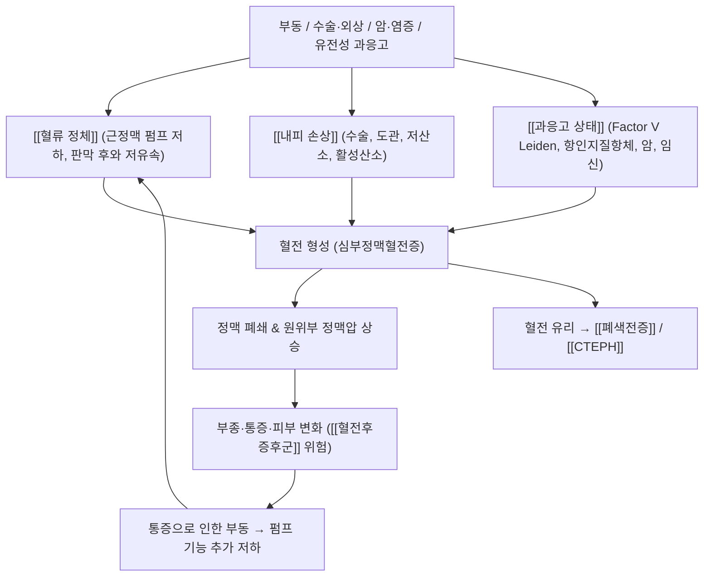

# 🩺 [[심부정맥 혈전증]] (Deep Vein Thrombosis / 深部靜脈血栓症, ICD-10 I80 / KCD I80)

> **핵심 3줄 요약 (Key Summary)**:
> - 📍 병소 부위 & 해부·병태생리: 하지 심부정맥(장골–대퇴–슬와–종아리 정맥) 및 상지 심부정맥(액와–쇄골하 정맥) 내 혈전 형성. [[Virchow 삼징]](혈류 정체·내피 손상·과응고)과 염증–응고 상호작용이 핵심 기전이며, 비복근–가자미근 [[근정맥 펌프]] 기능 저하가 정체를 악화시킨다.
> - 🚩 전형적 임상 양상 & 3대 징후: **편측 하지 종창·통증·압통**(3대 국소 징후), 피부 발적·열감·표재정맥 확장, 원위부 부종. 무증상 혈전도 흔하며 첫 증상이 [[폐색전증]]으로 발현될 수 있다.
> - 🛠️ 핵심 감별 검사 & 한·양방 다각적 치료 전략: [[Wells 점수]] + [[D-이합체]] 선별 후 [[압박 초음파]](1차 확진), 상지 의심 시 CT/MR 정맥조영술. 양방 1차 치료는 [[항응고제]](DOAC/LMWH/VKA)이며, 한의 치료는 **급성기 직접 자극 회피·회복기 순환 개선 보조** 원칙([[활혈거어제]], [[보익제]]).
> - ⚠️ 응급 의뢰 레드플래그 & 악화 요인: 갑작스러운 호흡곤란·흉통·실신([[폐색전증]] 의심), 광범위 근위부 혈전(장골–대퇴), [[phlegmasia cerulea dolens]](청색·냉감·무맥박), 항응고제 복용 중 출혈, 임신·산후·활동성 암·최근 수술. **급성 혈전 부위 심부 마사지·강한 압박·직접 자극적 침/약침 절대 금기.**

---

## 📌 목차
1. [질환 개요 & 해부학적 병태생리](#1-질환-개요--해부학적-병태생리)
2. [병태생리 메커니즘 & 생체역학적 악순환 네트워크](#2-병태생리-메커니즘--생체역학적-악순환-네트워크)
3. [임상 증상 & 이학적 검사(Physical Exam) 알고리즘](#3-임상-증상--이학적-검사physical-exam-알고리즘)
4. [감별 진단 매트릭스 (Differential Diagnosis)](#4-감별-진단-매트릭스-differential-diagnosis)
5. [한의 통합 치료 프로토콜 (침·약침·추나·한약)](#5-한의-통합-치료-프로토콜-침약침추나한약)
6. [양방 치료 & 병용·의뢰 기준 (Conventional Treatment & Referral)](#6-양방-치료--병용의뢰-기준-conventional-treatment--referral)
7. [재활 운동 & 생활습관 티칭 가이드](#6-재활-운동--생활습관-티칭-가이드)
8. [💡 사용자 진료실 핵심 필기 & 임상 노하우 (Melt-In 잔여 심화 집약)](#7--사용자-진료실-핵심-필기--임상-노하우-melt-in-잔여-심화-집약)
9. [출처 및 학술 참고 문헌 (References)](#8-출처-및-학술-참고-문헌-references)

---

## 1. 질환 개요 & 해부학적 병태생리

![[심부정맥 혈전증_3.jpg|540]]
> [그림 1: ① 병태생리·영상 — 심부정맥 혈전증_3]

![[심부정맥 혈전증_3.jpg|540]]
> [그림 2: Doppler Ultrasound and Vascular Sonography Examination in Navi Mumbai, Maharashtra, India.jpg]

* **질환 정의 및 분류**:
  * **정의**: 심부정맥(deep vein) 내강에 혈전이 형성되어 정맥 환류를 차단하고, 혈전이 유리되어 [[폐색전증]](PE)을 유발할 수 있는 혈전색전성 질환. 정맥혈전색전증(VTE)의 가장 흔한 표현형이다 (Di Nisio & van Es, 2016; Navarrete & Solar, 2023).
  * **해부학적 분류**:
    * **하지 DVT** — 근위부(proximal, 슬와정맥·대퇴정맥·장골정맥) vs **원위부 단독 DVT**(isolated distal DVT, 전경골·후경골·비복정맥 등 종아리 정맥에 국한). 원위부 단독 DVT는 근위부 DVT에 비해 근위부 진행 및 재발 위험이 상대적으로 낮은 것으로 OPTIMEV 코호트에서 보고되었다 (Galanaud & Sevestre, 2023).
    * **상지 DVT** — 액와–쇄골하 정맥 부위. 압박 초음파의 진단 정확도가 하지보다 제한적이어서 CT/MR 정맥조영술이 보완적으로 사용된다 (Gil-Díaz & Martín Guerra, 2024).
  * **유발 요인에 따른 분류**:
    * **유발성(provoked)**: 최근 수술·외상·부동·입원·활동성 암·임신/산후·경구피임제·중심정맥관 등 명확한 유발 인자가 있는 경우.
    * **비유발성(unprovoked)**: 명확한 유발 인자 없이 발생 — 재발 및 암 검진(occult malignancy screening) 관점에서 별도 관리가 필요하다.
  * **호발 연령/성별/직업군**: 발생률은 **연령에 따라 증가**하며, 고령·입원·수술 후·장시간 부동 자세(장거리 여행, 좌식 업무)군에서 위험이 상승한다. 일반 인구에서 VTE 발생률은 대략 **1,000인년당 1–2건** 수준으로 보고된다 (Di Nisio & van Es, 2016). 연령 의존적 증가, 재발률 및 장기 합병증(혈전후증후군, CTEPH) 부담에 대한 최신 역학은 Wolf & Barco(2024)에서 정리되었다. 국내 성별·연령별 세부 발생률 수치는 **근거 미확인**.

* **관련 해부학적 구조물**:
  * **골격 및 관절**: 심부정맥은 골반–서혜부–대퇴 내측–슬와–종아리 후방을 따라 주행하므로, [[고관절]]·[[슬관절]]의 굴곡 구축이나 골반 정렬 이상은 정맥 환류 경로의 기계적 저항으로 작용할 수 있다. 좌측 장골정맥이 우측 장골동맥과 척추체 사이에서 눌리는 [[May-Thurner 증후군]]은 좌측 하지 DVT의 해부학적 위험 인자다.
  * **근육 및 근막**: [[비복근]], [[가자미근]] 및 [[족저근]]이 형성하는 **근정맥 펌프(musculovenous pump)**가 보행 시 심부정맥 혈류를 심장 방향으로 밀어낸다. 이 펌프의 기능 저하(부동, 마비, 석고 고정, 하지 거상 부족)는 [[혈류 정체]]를 유발하는 핵심 요소다. 또한 [[대퇴근막장근]]·[[내전근군]]의 과긴장은 서혜부–대퇴 삼각의 공간을 좁힐 수 있다.
  * **신경 및 혈관**: [[대퇴신경]], [[좌골신경]]은 각각 대퇴정맥·슬와정맥과 근접 주행하므로, 신경 압박 증상(저림·방사통)과 DVT 증상이 혼동될 수 있다. 심부정맥 판막(valve)의 판막 후와(valve pocket)는 저유속·저산소 환경이 조성되어 혈전이 시작되는 대표적 호발 부위다 (Navarrete & Solar, 2023).

---

## 2. 병태생리 메커니즘 & 생체역학적 악순환 네트워크

![[심부정맥 혈전증_4.jpg|540]]
> [그림 3: ② 관련 해부 구조물 — Blood clot in a vein]

### 1) 해부학적 포착 및 압박 기전
* **판막 후와(valve pocket) 저유속 가설**: 심부정맥 판막이 있는 부위는 혈류가 와류성으로 머무르며 국소 저산소·저전단응력 환경이 조성된다. 이 환경에서 내피세포가 활성화되어 [[조직인자]](tissue factor), [[P-셀렉틴]], [[폰빌레브란트 인자]]를 발현하고, 혈소판 부착과 응고 캐스케이드가 개시된다 (Navarrete & Solar, 2023).
* **해부학적 협착 구역**:
  * 좌측 [[장골정맥]]의 [[May-Thurner 증후군]] — 좌측 하지 DVT의 대표적 해부학적 원인.
  * [[늑쇄공간]](costoclavicular space)에서 액와–쇄골하 정맥이 압박되는 [[Paget-Schroetter 증후군]] — 과사용성 상지 DVT(운동선수, 중량물 운반 직업).
  * 슬와부에서 [[슬와낭종]](Baker cyst)이나 종아리 근육 내 혈종에 의한 외부 압박.

### 2) 생체역학적 연쇄 반응 (Kinetic Chain)
* 하지 부동 → 비복근–가자미근 펌프 정지 → 심부정맥 정체 → 혈전 형성 → 부종·통증 → 통증 회피를 위한 보행 감소 → 펌프 기능 추가 저하 → 혈전 진행의 **악순환**.
* 만성기에는 정맥 판막 파괴로 [[만성 정맥부전]] 및 [[혈전후증후군]]이 초래되어, 종아리 근육의 섬유화·구축과 [[족관절 배굴 제한]]이 동반될 수 있다.

### 3) 염증–응고 상호작용 (Immunothrombosis)
* 혈전 형성은 단순한 응고 폭주가 아니라 선천면역 반응과 결합된 과정이다. 호중구가 방출하는 **호중구 세포외 트랩(NETs)**, 단핵구 유래 **마이크로입자(microparticles)**, 사이토카인 매개 내피 활성화가 혈전 형성과 확산에 관여한다 (Navarrete & Solar, 2023).
* **패혈증 관련 DVT**: 패혈증 환자에서는 전신 염증과 응고–섬유소용해 불균형이 겹쳐 DVT 위험이 증가한다. DVT 형성에 영향을 주는 요인으로 응고 기능 이상 및 [[D-이합체]] 상승, 기계환기, 중심정맥관 삽입, 중환자실 재원 기간 등이 보고되었다 (Wang & Ma, 2024). 세부 위험인자별 보정 오즈비 등 정량적 수치는 **근거 미확인**.

---

## 3. 임상 증상 & 이학적 검사(Physical Exam) 알고리즘

### 1) 주소증 및 신경학적 증상
* **국소 정맥 증상 (3대 징후)**:
  1. **편측 하지 종창** — 주로 원위부(종아리)에서 시작, 근위부 혈전일수록 대퇴·서혜부까지 광범위.
  2. **통증 및 압통** — 종아리 심부의 둔통, 서혜부·대퇴 내측 압통, 보행 시 악화.
  3. **피부 변화** — 발적, 열감, 표재정맥 확장(측부 순환), 피부 긴장도 증가.
* **감각 이상**: 심부정맥 주변의 말초신경(대퇴신경·좌골신경) 자극 또는 조직 압력 상승으로 저림·이상감각이 나타날 수 있으나, 피부분절을 정확히 따르지 않는 **비특이적 양상**이 대부분이다.
* **운동 장애**: 근력 약화는 혈전 자체보다 통증·부종에 의한 이차적 회피성 약화가 흔하다. 단, **급성 [[하지동맥 폐색]] 동반 시 무맥박·냉감·운동마비**가 나타나며 이는 혈관외과 응급이다.
* **혈관/자율신경 증상**: 냉감, 청색증(심한 경우 [[phlegmasia cerulea dolens]]), 모세혈관 재충전 지연, 말초 동맥 박동 감소 — **광범위 장골–대퇴 혈전에서 발생하는 응급 징후**.
* **무증상 혈전**: 상당수는 증상이 없거나 경미하며, 첫 임상 발현이 [[폐색전증]]일 수 있다 (Di Nisio & van Es, 2016).

### 2) 필수 이학적 검사법 (Physical Examination)
* **[[Wells 점수]] (DVT 예측 확률)**: 활동성 암, 최근 3개월 내 수술/부동, 편측 하지 전체 부종, 종아리 압통, 함요부종, 측부 표재정맥 확장, 이전 DVT 병력, DVT 외 대체 진단의 부재 등을 점수화하여 임상 전확률(pre-test probability)을 산정한다. 이는 D-이합체 검사 및 초음파 검사의 해석 기준을 결정하는 핵심 단계다 (Di Nisio & van Es, 2016; Gil-Díaz & Martín Guerra, 2024).
* **[[D-이합체]] 검사**: 음성 예측도가 높아 **저확률군에서 배제 목적**으로 사용한다. 민감도는 높으나 특이도가 낮아 고령·임신·암·감염·수술 후 상태에서 위양성이 흔하다 (Gil-Díaz & Martín Guerra, 2024).
* **[[압박 초음파]](Compression Ultrasonography, CUS)**: 하지 DVT 진단의 **1차 확진 검사**. 정맥이 압박되지 않으면 혈전을 시사한다. 근위부 정맥(대퇴·슬와) 평가가 우선이며, 음성이지만 임상 의심이 지속되면 1주일 내 재검(연속 검사)을 고려한다 (Gil-Díaz & Martín Guerra, 2024).
* **[[Homans 징후]](족배굴 시 종아리 통증), Lowenberg 징후 등 전통적 유발 검사**: 민감도·특이도가 낮아 단독으로 진단적 가치를 갖지 못한다. 통증 악화 및 혈전 유리 위험을 고려하여 **강한 유발 검사는 급성기 지양**하는 것이 안전하다 (근거 미확인, 임상적 판단).
* **상지 DVT 의심 시**: 압박 초음파의 정확도 제한으로 **CT 정맥조영술 또는 MR 정맥조영술**을 고려한다 (Gil-Díaz & Martín Guerra, 2024).

---

## 4. 감별 진단 매트릭스 (Differential Diagnosis)

| 감별 질환 | 호발 병소 및 원인 | 주소증 차이점 | 특이적 이학적 검사 소견 |
| :--- | :--- | :--- | :--- |
| [[심부정맥 혈전증]] (본 질환) | 하지 심부정맥(장골–대퇴–슬와–종아리), 상지 액와–쇄골하 정맥. 정체·내피손상·과응고 | 편측 종창+심부 압통+발적, 보행 시 악화. 무증상 가능 | [[Wells 점수]] 상승, [[압박 초음파]]에서 정맥 비압박 소견 |
| [[림프부종]] | 림프계 폐쇄·절제 후(유방암 액와림프절 절제 등) | 만성·비함요성 부종, 통증 경미, 발가락 침범(Stemmer 징후) | Stemmer 징후 양성, 압박 초음파상 정맥 개통성 유지 |
| [[봉와직염]](감염성) | 피부·피하조직 세균 감염 | 발적 경계 명확, 발열·오한 등 전신 염증 반응, 통증이 피부 표층 | 발적 경계 및 압통이 피부 국한, 혈액검사 염증지표 상승 |
| [[베이커낭종 파열]] | 슬와부 활액낭 파열 | 갑작스러운 종아리 후방 통증 및 부종, 멍 | 슬와부 낭종 촉지, 초음파상 낭종 및 액체 저류 |
| [[비복근 파열/근손상]] | 운동 중 급성 손상 | 운동 직후 발생하는 급성 예리한 통증, 국소 멍 | 근육 촉지 시 결손감, 초음파상 근섬유 손상 |
| [[표재성 혈전정맥염]] | 대복재정맥 등 표재정맥 | 표재정맥을 따라 딱딱한 끈 모양 및 발적, 통증 국한 | 표재정맥 주행을 따라 압통성 경결 |
| [[만성 정맥부전]] | 정맥 판막 부전, 혈전후증후군 | 만성 양측성 부종, 하지 무거움, 색소침착·피부경화 | 양측성, 색소침착·피부 변화, 급성 압통 없음 |
| [[급성 하지동맥폐색]] | 동맥 색전·혈전 | 갑작스러운 창백·냉감·무맥박·마비(5P) | 말초 동맥 박동 소실, 모세혈관 재충전 지연 — **즉시 응급 이송** |

---

## 5. 한의 통합 치료 프로토콜 (침·약침·추나·한약)

> **핵심 안전 원칙**: 심부정맥 혈전증의 1차 치료는 **항응고제 기반 양방 치료**이며, 진단 즉시 혈관외과·순환기·혈전클리닉 협진이 우선이다. 한의 치료는 **혈전 안정화 이후의 회복기 보조 요법**으로 위치시킨다. 제공된 논문들(Gil-Díaz & Martín Guerra, 2024; Di Nisio & van Es, 2016)은 항응고 치료를 표준으로 제시하고 있으며, **한의 단독 치료가 혈전 용해·재발률 감소에 미치는 효과에 대한 고수준 근거는 제공된 논문에서 확인되지 않는다(근거 미확인).**

* **침구 치료 (Acupuncture)**:
  * **급성기(진단 후 항응고 치료 초기, 혈전 잔존 시기)**: 혈전이 위치한 하지 심부에 **직접 자극·심자·강한 염전 자극 금기**. 대신 원위 취혈 및 전신 조절 위주로 접근한다.
    * 원위부: [[족삼리]](ST36), [[삼음교]](SP6), [[혈해]](SP10), [[음릉천]](SP9), [[태충]](LR3)
    * 국소 인접(경미 자극): [[승산]](BL57), [[위중]](BL40), [[양릉천]](GB34), [[곤륜]](BL60) — **자침 깊이 축소, 자극 최소화**
  * **회복기(항응고 안정화 이후, 부종·통증 잔존)**: 순환 개선 및 근정맥 펌프 회복 목표. 전침은 저주파(2–10 Hz) 위주로 종아리 근군의 수축–이완 유도에 활용 가능하다. 전침 강도는 환자가 통증 없이 근수축을 인지하는 수준으로 제한한다.
* **약침 치료 (Pharmacopuncture)**:
  * **급성 혈전 부위 직접 주입은 금기**다. 혈전 유리 및 출혈 위험을 증가시킬 수 있다.
  * 항응고제(DOAC, LMWH, VKA) 복용 환자에서는 **주입 부위 출혈·혈종 위험이 증가**하므로 시술 전 복약 상태 및 INR/응고 지표를 반드시 확인한다.
  * 회복기에는 [[족삼리]]·[[삼음교]] 등 원위 경혈에 소자극·저용량으로 순환 보조 목적으로 고려할 수 있으나, **DVT에 대한 약침의 유효성·안전성 근거는 제공된 논문에서 확인되지 않음(근거 미확인)**.
* **추나 치료 (Chuna Manipulation)**:
  * **급성기 하지 심부 마사지·압박·강한 도수 스트레칭 절대 금기** — 혈전 탈락에 의한 [[폐색전증]] 위험.
  * 회복기에는 **근막 이완(JS) 수기**를 이용해 비복근·가자미근·대퇴 후면 근막의 긴장을 완화하고, [[고관절]]·[[족관절]] 가동성 회복을 도모한다. 관절 교정 추나는 부종 및 통증이 안정된 이후 단계적으로 적용한다.
  * 압박 스타킹 착용 중에는 착용 상태로 추나를 시행하지 않는다.
* **한약 치료 (Herbal Medicine)**:
  * **급성기**: 어혈·열·습의 병리를 고려하여 [[활혈거어제]] 계열(예: [[당귀]], [[천궁]], [[단삼]], [[도인]], [[홍화]], [[적작약]])을 고려할 수 있다. 단, **항응고제와의 병용 시 출혈 위험 상승**이 우려되므로 복용 중인 항응고제 종류·용량을 확인하고, 출혈 경향(잇몸 출혈, 코피, 멍, 혈뇨) 발생 시 즉시 감량·중단 및 협진한다.
  * **만성기/회복기**: 기혈 허약 및 정맥 환류 부전이 지속되는 경우 [[보익제]] 계열로 기력 회복 및 조직 재생을 보조하는 접근이 가능하다. 다만 **한약이 DVT 재발률·혈전후증후군 발생률을 감소시킨다는 고수준 임상 근거는 제공된 논문에서 확인되지 않음(근거 미확인)**.
  * 양약 복용 환자에게는 한약–항응고제 상호작용 가능성을 반드시 설명하고, 복용 시간 간격 및 출혈 모니터링 계획을 문서화한다.

---

## 6. 양방 치료 & 병용·의뢰 기준 (Conventional Treatment & Referral)

> 🎯 **이 섹션의 목적**: 환자가 **양방약을 이미 복용 중인 경우가 많다.** 한의원 1차 진료에서 양방 치료를 이해하고, 병용 가능·주의·금기를 판단하며, 언제 의뢰할지 결정한다.

* **약물 치료 (Medication)**:
  * 계열별 약물·용량·기간 — 국내 처방 관행 반영.
  * 작용 기전과 한의 치료와의 상호작용.
* **비약물 시술 (Procedures)**:
  * 주사·차단술·물리치료·보조기 등.
* **수술·시술 적응증 (Surgical Indication)**:
  * 언제 수술로 가는가 — 절대·상대 적응증, 수술 후 경과.
* **한의 병용 판단 (Combination Therapy)**:
  * 병용 가능 / 주의 / 금기. 복용 중 환자의 감량 타이밍·반동 현상.
* **양방·전문과 의뢰 기준 (Referral Criteria)**:
  * 응급 의뢰 트리거와 전문과 의뢰 기준(정형외과·신경외과·내과 등).

	(작성 필요)

---

## 7. 재활 운동 & 생활습관 티칭 가이드

* **이완 및 스트레칭 (Stretching)**:
  * **회복기부터 시행**: 비복근·가자미근 정적 스트레칭(벽 짚고 뒤꿈치 붙인 채 30초 유지 × 3회), 대퇴 후면 및 [[장딴지근막]] 이완.
  * **급성기에는 금기** — 강한 스트레칭은 혈전 탈락 위험을 높인다.
* **강화 및 안정화 운동 (Strengthening)**:
  * [[족관절 펌프 운동]](ankle pump): 발목 배굴–저굴을 20회씩 1시간 간격으로 시행 — 침상·좌식 환경에서 근정맥 펌프를 대체하는 가장 안전한 운동.
  * 종아리 근육 강화: 카프레이즈(양발→한발), 세라밴드 저항 배굴 운동으로 점진적 부하.
  * 근위부 근육: [[대둔근]], [[중둔근]] 강화를 통한 보행 안정화.
* **신경 활주 운동 (Neurodynamics)**:
  * 좌골신경 슬라이더/텐서, 대퇴신경 슬라이더를 **무통 범위 내 저강도**로 시행. 저림이 증가하면 즉시 중단.
* **압박 요법 및 일상생활 자세 티칭 (Ergonomics)**:
  * **[[압박 스타킹]](graduated compression stocking)**: 근위부 DVT 이후 [[혈전후증후군]] 예방 목적으로 고려된다 (Gil-Díaz & Martín Guerra, 2024). 급성기에는 의료진 판단하에 적용한다.
  * 하지 거상(심장보다 15–20 cm 높게), 장시간 서 있기·다리 꼬기 회피.
  * 장거리 여행 시 1–2시간마다 기내·차내 보행, 수분 섭취, 족관절 펌프 운동.
  * **탈수 예방**: 수분 부족은 혈액 점도를 높인다. 이뇨제 복용 환자는 특히 주의.
  * **금연**: 흡연은 내피 기능 및 응고 상태에 불리하게 작용한다.
  * **복약 순응도**: 항응고제 임의 중단은 재발의 가장 큰 위험 요인이다. 출혈 징후 교육 및 정기 혈액검사 일정을 안내한다.

---

## 8. 💡 사용자 진료실 핵심 필기 & 임상 노하우 (Melt-In 잔여 심화 집약)

> [!IMPORTANT]
> **🛡️ 원문 융합(Melt-In) 및 7번 섹션 작성 불변 규칙 (CRITICAL)**
> 1. **기존 필기 내용 상부 전면 융합 (Melt-In)**: 기존 노트에 있던 질환의 정의, 해부학적 원인, 증상, 이학적 검사법, 치료법, 생활 티칭 등은 상부 1~6번 섹션에 유기적으로 100% 녹여내어(Melt-In) 고도화합니다.
> 2. **7번 섹션의 차별화된 심화 집약 (녹이고 남은 고유 필기만 수록)**: 7번 섹션은 상부에 이미 녹여낸 기본 원문을 단순 중복 나열(복사-붙여넣기)하는 공간이 아닙니다. **상부 1~6번에 다 담기지 않은, 기존 노트에만 있었던 녹이고 남은 고유한 내용(원장님만의 독창적인 진료실 노하우, 실전 문진 체크리스트, 환자 설명 스크립트, 임상 감별 직관 팁 등)만이 엄선되어 집약**되어야 합니다.
> 3. **대체 텍스트 규칙**: 본 노트에는 제공된 이미지 블록(제목 하단 1매)만 배치하며, 추가 이미지를 임의로 생성하거나 "그림을 수록했다"는 문장을 쓰지 않습니다.

* **상부 섹션에 미처 다 담지 못한 고유 원문 필기**:
  * **문진실 즉시 판단 3문**: ① "한쪽 다리만 붓나요?" ② "언제부터 부었고, 걷기 시작했나요?" ③ "최근 수술·장거리 이동·입원·항암 치료·임신 여부가 있나요?" — 이 세 질문만으로도 원위부 단독 DVT와 단순 근육통의 확률 차이를 상당 부분 가를 수 있다.
  * **양측성 부종은 DVT보다 다른 원인(심부전·신장질환·저알부민혈증·만성 정맥부전)을 먼저 생각한다.** DVT는 대개 편측성이라는 점이 감별의 첫 관문이다.
  * **종아리 통증 환자에서 발적·열감이 '피부 국한'인지 '심부에서 올라오는 느낌'인지 촉진으로 구분** — 심부에서 오는 열감과 긴장감은 봉와직염보다 DVT를 더 강하게 시사한다.
  * **하지 부종이 급격히 진행하며 청색·냉감·무맥박이 동반되면 phlegmasia로 간주하고 절대 손대지 말고 즉시 이송.**

* **진료실 실전 감별 & 치료 노하우**:
  * **1. 실전 문진 체크리스트**:
    * 최근 3개월 내 수술·골절·석고 고정 여부
    * 활동성 암(특히 췌장·폐·난소·림프종), 항암 치료 중 여부
    * 경구피임제·호르몬 대체요법·임신/산후 6주 이내
    * 이전 DVT/PE 병력 및 항응고제 복용 여부(약물명·용량·INR)
    * 가족력(혈전증 가족력, 유전성 혈전성향증)
    * 출혈 경향(잇몸 출혈, 코피, 흑색변, 혈뇨) — 치료 방향을 좌우
    * 호흡곤란·흉통·실신 여부 — 있으면 **한방 치료 이전에 응급 이송**
  * **2. 치료 순서 및 손맛 노하우**:
    * **1단계(진단·안전 확보)**: DVT 의심 시 자침 이전에 압박 초음파·D-이합체 등 양방 검사 의뢰를 먼저 완료한다. 진단 전 한방 시술은 금물.
    * **2단계(항응고 안정기)**: 원위 취혈 중심으로 자극량 최소화. 종아리 심부는 피하고, 자침 후 5–10분간 환자 상태(어지럼·출혈) 관찰.
    * **3단계(회복기)**: 부종·통증이 감소하면 근막 이완 → 관절 가동 → 근력 강화 순으로 단계적 이행. 한 번에 여러 기법을 겹치지 않는다.
    * **약침 각도**: 원위 경혈에서도 직각 자침 시 심부 혈관 손상 위험을 고려하여 **천자 깊이를 얕게, 흡인 확인 후 주입**하는 습관을 유지한다.
    * **복약 환자 체위**: 하지를 심장보다 약간 높인 앙와위에서 시술하면 정맥 환류가 개선되어 시술 중 불편감이 적다.
  * **3. 환자 티칭 스크립트**:
    * "이 병은 다리 정맥에 피떡이 생긴 것이고, 가장 위험한 상황은 그 피떡이 떨어져 폐로 가는 것입니다. 그래서 다리를 세게 주무르거나 강하게 스트레칭하는 것은 절대 피하셔야 합니다."
    * "약(항응고제)을 임의로 끊는 것이 재발의 가장 큰 원인입니다. 피가 잘 멈추지 않거나 검은 변, 소변에 피가 보이면 바로 연락 주세요."
    * "장시간 앉아 있을 때는 1시간에 한 번 발목을 위아래로 20번씩 움직여 주세요. 물을 충분히 마시고 다리는 심장보다 조금 높게 두고 쉬는 것이 좋습니다."
    * "다리가 갑자기 더 붓거나 숨이 차고 가슴이 아프면 그 자리에서 119를 부르셔야 합니다."

---

## 9. 출처 및 학술 참고 문헌 (References)

1. Navarrete S, Solar C (2023). *Pathophysiology of deep vein thrombosis*. **Clin Exp Med**. PMID: 35471714
   - **[연구 요약]**: 심부정맥 혈전증의 병태생리를 Virchow 삼징(혈류 정체·내피 손상·과응고)을 축으로 정리하고, 판막 후와의 저유속 환경, 내피 활성화, 조직인자·폰빌레브란트 인자 발현, 호중구 NETs 및 마이크로입자 등 염증–응고 상호작용(immunothrombosis)을 혈전 형성 기전으로 제시하였다.
2. Di Nisio M, van Es N (2016). *Deep vein thrombosis and pulmonary embolism*. **Lancet**. PMID: 27375038
   - **[연구 요약]**: VTE(DVT 및 폐색전증)의 역학(일반 인구 1,000인년당 약 1–2건), 임상 예측 확률(Wells 점수), D-이합체 및 압박 초음파 기반 진단 전략, 항응고 치료 및 치료 기간, 혈전후증후군·CTEPH 등 장기 합병증을 종합 정리한 리뷰.
3. Wolf S, Barco S (2024). *Epidemiology of deep vein thrombosis*. **Vasa**. PMID: 39206601
   - **[연구 요약]**: 심부정맥 혈전증의 최신 역학 — 연령 의존적 발생 증가, 재발 및 만성 합병증 부담, 암·입원·수술 등 위험 인자와 인구집단 수준의 질병 부담을 정리하였다. (개별 수치의 세부 값은 원문 확인 필요)
4. Gil-Díaz A, Martín Guerra J (2024). *Diagnosis and treatment of deep vein thrombosis of the lower and upper limbs. 2024 recommendations of the venous thromboembolism group of the Spanish Society of Internal Medicine*. **Rev Clin Esp (Barc)**. PMID: 38641173
   - **[연구 요약]**: 하지 및 상지 DVT의 진단·치료에 대한 2024년 스페인 내과학회 권고. 임상 예측 확률과 D-이합체 기반 배제 전략, 압박 초음파 우선 원칙, 상지 DVT에서 CT/MR 정맥조영술의 역할, 항응고제 선택 및 치료 기간, 압박 스타킹을 통한 혈전후증후군 관리 등을 제시하였다.
5. Wang L, Ma X (2024). *Factors influencing DVT formation in sepsis*. **Thromb J**. PMID: 38229151
   - **[연구 요약]**: 패혈증 환자에서 DVT 형성에 영향을 미치는 요인을 분석한 연구. 전신 염증 및 응고–섬유소용해 불균형, D-이합체 상승, 기계환기·중심정맥관·중환자실 재원 등 중증도 관련 인자가 DVT 발생과 연관됨을 보고하였다.
6. Galanaud JP, Sevestre MA (2023). *Isolated distal deep vein thrombosis: What have we learnt from the OPTIMEV study?* **J Med Vasc**. PMID: 37120268
   - **[연구 요약]**: OPTIMEV 코호트를 통해 원위부 단독 DVT의 자연경과를 분석한 결과, 근위부 DVT에 비해 근위부 진행 및 재발 위험이 낮고 항응고 치료의 이득–위험 균형이 다르다는 점을 정리하였다. 원위부 단독 DVT의 추적 관찰 및 치료 강도 결정에 임상적 시사점을 제공한다.