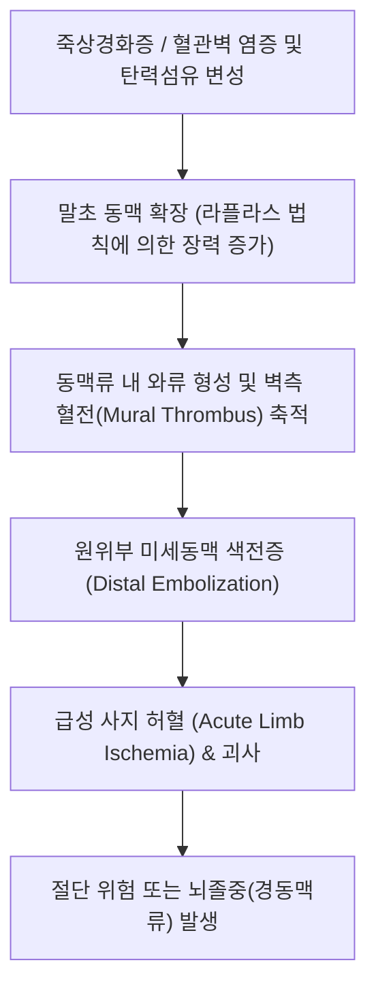

# 🩺 팔 다리 목 동맥의 동맥류 (Peripheral & Extracranial Carotid Artery Aneurysms, I72.0 ~ I72.4)

> **핵심 3줄 요약 (Key Summary)**:
> - 📍 **병소 부위 & 병태생리**: 대동맥과 두개강 내 뇌혈관을 제외한 주요 말초 동맥(경동맥, 쇄골하동맥, 상완동맥, 대퇴동맥, [[슬와동맥]]) 벽의 탄력섬유 소실 및 중막(media) 퇴행성 변성으로 혈관 직경이 정상치의 50% 이상 국소 확장되는 질환. 죽상경화증, 섬유근이형성증, 감염(진균성 동맥류), 외상 또는 카테터 시술 후 가성동맥류(pseudoaneurysm)가 주원인.
> - 🚩 **전형적 임상 양상**: 무증상 상태에서 우연히 발견되는 박동성 종괴(Pulsatile mass), 팽창된 혈관에 의한 인접 신경·정맥 압박(신경통, 부종), 혈전 형성에 의한 급성 말초 동맥 폐색(5P 징후: Pain, Pallor, Pulselessness, Paresthesia, Paralysis), 경동맥류의 경우 일과성 뇌허혈 발작(TIA) 및 색전성 뇌경색.
> - 🛠️ **핵심 감별 & 한·양방 치료 전략**: 박동성 림프절 종대, 연부조직 종양, 농양 감별. 도플러 초음파(DUS) 및 CT/MR 혈관조영술(CTA/MRA). 파열 위험 및 색전증 예방을 위한 외과적 절제 및 자가정맥 우회술(Bypass) 또는 스텐트 그라프트(Stent graft) 삽입. 한의학적으로는 대기·수술 전후 활혈통락(活血通絡)·익기화어(益氣化瘀) 보존 요법(절대 국소 직접 자침 금기).
> - ⚠️ **응급 의뢰 레드플래그**: 박동성 종괴의 급격한 크기 증가 및 파열성 대출혈(혈종 형성, 저혈압 쇼크), 급성 하지/상지 허혈(차갑고 하얗게 변하며 박동 소실 및 마비 발생 시 6시간 내 혈관외과 재관류 필수), 급성 반신마비(경동맥 색전성 뇌졸중).

---

## 📌 목차
1. [질환 개요 & 병태생리 (Disease Overview)](#1-질환-개요--병태생리-disease-overview)
2. [병태생리 메커니즘 & 대사·혈관확장 악순환 네트워크](#2-병태생리-메커니즘--대사혈관확장-악순환-네트워크)
3. [임상 증상 & 환자 소견 (Clinical Presentation)](#3-임상-증상--환자-소견-clinical-presentation)
4. [감별 진단 매트릭스 (Differential Diagnosis)](#4-감별-진단-매트릭스-differential-diagnosis)
5. [한의 통합 치료 프로토콜 (침·약침·한약)](#5-한의-통합-치료-프로토콜-침약침한약)
6. [양방 치료 & 병용·의뢰 기준 (Conventional Treatment & Referral)](#6-양방-치료--병용의뢰-기준-conventional-treatment--referral)
7. [식이·생활습관 & 자가관리 티칭 가이드](#7-식이생활습관--자가관리-티칭-가이드)
8. [💡 진료실 핵심 필기 & 임상 노하우](#8--진료실-핵심-필기--임상-노하우)
9. [출처 및 학술 참고 문헌 (References)](#9-출처-및-학술-참고-문헌--references)

---

## 1. 질환 개요 & 병태생리 (Disease Overview)

말초 동맥류(Peripheral Artery Aneurysms)는 팔, 다리 및 목의 주간 동맥에 발생하는 동맥류를 통칭한다. 대동맥류에 비해 파열(Rupture)의 빈도는 상대적으로 낮으나, **내부 혈전 형성(Thrombosis)과 원위부 색전증(Distal Embolization)에 의한 급성 사지 허혈 및 뇌허혈**을 유발하는 치명적인 혈관 질환이다.

### 1) 해부학적 호발 부위별 분류
1. **[[슬와동맥]]류 (Popliteal Artery Aneurysm, 70% 차지)**:
   - 모든 말초 동맥류 중 가장 흔함. 남성에서 95% 이상 호발하며, 약 50%에서 양측성, 약 40~50%에서 [[복부 대동맥류]]를 동반함.
2. **대퇴동맥류 (Femoral Artery Aneurysm, 15~20%)**:
   - 서혜부에서 박동성 낭으로 촉진되며, 관상동맥 중재술 등 카테터 천자 후 발생하는 가성동맥류 빈발.
3. **경외 경동맥류 (Extracranial Carotid Artery Aneurysm, <5%)**:
   - 총경동맥 또는 내경동맥의 두개강 외 분절에 발생. 색전 탈락 시 즉각적인 뇌경색 유발.
4. **상지 동맥류 (쇄골하·액와·상완동맥류, 드묾)**:
   - 흉곽출구 증후군(TOS)에서 쇄골하 동맥의 만성 압박 후 확장(Post-stenotic dilation)으로 발생.

---

## 2. 병태생리 메커니즘 & 대사·혈관확장 악순환 네트워크

### 1) 혈관벽 약화와 라플라스의 법칙(Laplace's Law)
- 혈관 중막의 엘라스틴(Elastin) 및 콜라겐(Collagen) 섬유가 기질금속단백분해효소(MMP-2, MMP-9)에 의해 분해되면서 혈관벽의 탄성 저항력이 상실됨.
- 라플라스의 법칙($T = P \times r$, 장력 = 압력 × 반경)에 따라 직경($r$)이 늘어날수록 혈관벽에 가해지는 장력($T$)이 기하급수적으로 증가하여 팽창이 가속화됨.

### 2) 혈류 정체와 혈전 형성 기전
- 동맥류 내부의 와류(Turbulent flow)와 전단응력 감소로 인해 혈관벽 내피에 벽측 혈전(Mural thrombus)이 축적됨.
- 이 혈전 조각들이 떨어져 나가 말초 미세동맥을 차단하는 색전증(Blue toe syndrome 또는 급성 사지 마비)을 촉발함.

---

## 3. 임상 증상 & 환자 소견 (Clinical Presentation)

### 1) 주요 임상 증상
- **박동성 종괴 (Pulsatile Mass)**: 오금(오금오목, Popliteal fossa), 서혜부, 또는 목 외측에서 심장 박동과 일치하여 펄떡거리는 덩어리가 만져짐.
- **주변 조직 압박 증상**:
  - 오금 동맥류: 경골신경 압박으로 종아리 저림/통증, 슬와정맥 압박으로 하지 부종 및 심부정맥혈전증(DVT) 오진.
  - 경동맥류: 미주신경, 설하신경, 되돌이후두신경 압박으로 쉰 목소리, 연하곤란, 호너 증후군(Horner's syndrome).
- **급성 허혈 징후 (5P Signs)**: 통증(Pain), 창백(Pallor), 맥박 소실(Pulselessness), 감각 이상(Paresthesia), 마비(Paralysis).

### 2) 진찰 및 영상 소견
- **청진 (Auscultation)**: 종괴 상부에서 혈류 와류에 의한 수축기 잡음(Systolic bruit) 청진.
- **도플러 초음파 (Duplex Ultrasound)**: 혈관 내경 확장(정상치 대비 1.5배 이상), 혈전 유무, 혈류 속도 평가.
- **CTA / MRA**: 동맥류의 3차원적 크기, 해부학적 유입/유출 혈관(Inflow/Outflow), 스텐트 또는 수술 계획 수립.

---

## 4. 감별 진단 매트릭스 (Differential Diagnosis)

| 질환 | 주증상 및 촉진 소견 | 청진 및 박동성 | 핵심 감별 검사 |
| :--- | :--- | :--- | :--- |
| **[[팔 다리 목 동맥의 동맥류]]** | 심박동과 동기화된 **박동성 종괴**, 압박통 | 혈관 잡음(Bruit) 청진 | 도플러 초음파(진성 팽창), CTA |
| **베이커 낭종 (Baker's Cyst)** | 오금 내측의 무통성 물혹, 무릎 굴곡 시 팽팽 | 박동성 없음, 잡음 없음 | 초음파상 활액막 삼출액 주머니 |
| **동맥 가성동맥류 (Pseudoaneurysm)** | 카테터 시술 후 혈종, 통증성 팽창 | 초음파상 'Yin-Yang sign' 혈류 | 시술 병력, 혈관벽 결손 확인 |
| **림프절염 / 경부 종양** | 목 또는 서혜부 단단한 결절 | 박동성 없음 (동맥 위에 얹힌 전달박동 주의) | 림프절 초음파, 생검 |
| **심부정맥 혈전증 (DVT)** | 급성 하지 종창, 장딴지 통증 | 박동성 종괴 없음 | 정맥 도플러 초음파, D-dimer |

---

## 5. 한의 통합 치료 프로토콜 (침·약침·한약)

### 1) 한의 진료실 안전 원칙 (Absolute Contraindications)
- ⛔ **동맥류 국소 자침 및 부항 절대 금기**:
  - 박동성 종괴 부위에 침을 직접 찌르거나 강한 음압의 부항, 도침, 과도한 추나 안마를 가할 경우 **혈관벽 파열 및 대량 치명적 출혈**을 유발하므로 국소 시술을 엄격히 금지함.

### 2) 보존적 원격 침구 치료 (Distal Acupuncture)
- **주요 원격 혈위**: [[족삼리]](ST36), [[삼음교]](SP6), [[태충]](LR3), [[곡지]](LI11), [[외관]](TE5), [[양릉천]](GB34).
- **목적**: 동맥류 원위부의 모세혈관 순환을 보조하고 혈관 내피세포 산화 스트레스 완화.

### 3) 한약 치료 (Herbal Medicine - 수술 전후 보존기)
- **활혈거어, 통락지통(活血化瘀, 通絡止痛)**:
  - **당귀사역탕(當歸四逆湯)**: 말초 한랭 및 미세순환 저하가 동반된 만성 허혈 상태 개선.
  - **보양환오탕(補陽還五湯)**: 기허혈어(氣虛血瘀)형 노인성 동맥경화증 환자의 측부 순환(Collateral circulation) 발달 촉진.
  - **활혈서근탕(活血舒筋湯)**: 혈전 형성 억제 및 혈맥 소통.

---

## 6. 양방 치료 & 병용·의뢰 기준 (Conventional Treatment & Referral)

### 1) 수술 및 중재 시술 적응증 (Guidelines)
- **슬와동맥류**: 직경이 **2.0cm 이상**이거나, 크기와 무관하게 내강에 벽측 혈전이 관찰되거나, 색전 증상이 나타난 경우 무조건 수술적 치료 권고.
- **대퇴동맥류**: 직경 **2.5cm 이상** 또는 증상 동반 시.
- **경동맥류**: 직경 **2.0cm 이상** 또는 TIA/뇌경색 징후 동반 시.
- **수술법**:
  - 개복 혈관 문합술: 동맥류 결찰 및 자가 대복재정맥(Saphenous vein)을 이용한 우회로 조성술(Bypass).
  - 혈관내 치료(EVAR/Stent graft): 스텐트 그라프트를 삽입하여 동맥류 내강으로의 혈류를 차단.

### 2) 양방 약물 치료
- 항혈소판제(Aspirin 100mg qd, Clopidogrel 75mg qd) 투여로 동맥류 내 혈전 형성 및 미세 색전 예방.
- 스타틴(Statin) 투여로 혈관 내피 안정화.

### 3) 양방·전문과 응급 의뢰 기준 (Referral Criteria)
- **즉시 혈관외과 응급실 전원 (Emergency Red Flags)**:
  - 다리나 팔이 갑자기 차가워지고 감각이 마비되며 통증이 극심해진 경우 (골든타임 6시간 이내 혈전 제거술 필요).
  - 박동성 종괴 부위가 급격히 부풀어 오르며 극심한 국소 통증과 빈혈, 혈압 저하가 발생하는 경우 (동맥류 절박 파열).
  - 경동맥류 환자에서 일시적 흑암시(Amaurosis fugax)나 편마비 발생 시.

---

## 7. 식이·생활습관 & 자가관리 티칭 가이드

- **복부 대동맥류 동반 검진 필수 티칭**:
  - 슬와동맥류 환자의 절반은 배에도 동맥류([[복부 대동맥류]])를 가지고 있으므로, 반드시 복부 초음파 검사를 함께 받도록 강력 권고.
- **금연 및 혈압 조절**:
  - 혈관 파열과 확장을 억제하기 위해 수축기 혈압 130mmHg 이하 엄격 유지 및 즉각적 금연.
- **오금 부위의 물리적 압박 금지**:
  - 다리를 꼬고 앉거나 무릎을 꿇는 자세를 절대 피함.

---

## 8. 💡 진료실 핵심 필기 & 임상 노하우

### 1) 오금의 물혹을 만질 때 반드시 맥박을 짚어라
- 무릎 뒤쪽 오금에 덩어리가 만져진다고 내원하는 환자를 단순 [[베이커 낭종]]으로 예단하고 침을 찌르거나 주사기로 흡인하려 해서는 절대 안 된다.
- 반드시 손가락으로 덩어리를 쥐었을 때 **심장 박동에 맞춰 덩어리 전체가 팽창성 박동(expansile pulsation)을 하는지 확인**해야 한다. 박동이 느껴지는 순간 즉시 손을 떼고 혈관외과 초음파를 의뢰해야 의료사고를 방지할 수 있다.

### 2) 반대쪽 다리와 배를 함께 확인하는 3포인트 검진
- 한쪽 슬와동맥류가 발견되면, 즉시 **반대쪽 오금과 복부 배꼽 상복부**를 양손으로 깊숙이 눌러보아야 한다. 슬와동맥류는 양측성이 50%, 복부 대동맥류 동반이 40%에 달하는 전신 동맥벽 결손 질환이기 때문이다.

---

## 9. 출처 및 학술 참고 문헌 (References)

- van Heeswijk RAM, Willemsen SI, Hazenberg CEVB et al. (2026). Procedural outcomes and follow-up of endovascular treatment for extracranial carotid artery aneurysms: A systematic review. *J Vasc Surg*. ():. PMID: 42386086

- Bellomo TR, Goudot G, Sumetsky N et al. (2026). Anatomic variations and contemporary operative management of popliteal artery aneurysms. *Surgery*. 198():110439. PMID: 42537393

- Dawson J, Fitridge R et al. (2013). Update on aneurysm disease: current insights and controversies: peripheral aneurysms: when to intervene - is rupture really a danger? *Prog Cardiovasc Dis*. 56(1):26-35. PMID: 23993236

---

## 관련 노트

- [[복부 대동맥류]]
- [[흉부 대동맥류]]
- [[심부전]]
- [[족삼리]]
- [[삼음교]]
- [[태충]]
- [[곡지]]
- [[외관]]
- [[양릉천]]
- [[신바로약침]]
- [[보양환오탕]]
- [[당귀사역탕]]
- [[활혈서근탕]]
- [[슬와동맥]]
- [[베이커 낭종]]
