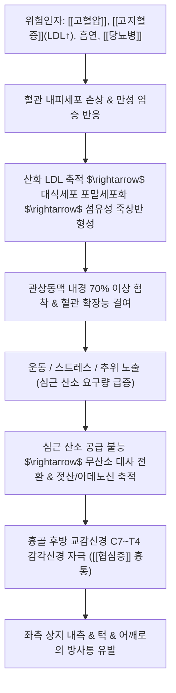

# 🩺 [[협심증]] (Angina Pectoris / 狹心症, I20)

> **핵심 3줄 요약 (Key Summary)**:
> - 📍 병소 부위 & 해부·병태생리: 심장 관상동맥(LAD, LCx, RCA)의 죽상경화반 비후 및 연축(Spasm)으로 심근 산소 공급과 수요 간의 불균형이 초래되어 심근 허혈과 젖산 축적이 발생하는 가역적 허혈성 심질환.
> - 🚩 전형적 임상 양상 & 3대 징후: 계단 오르기나 운동 시 흉골 후방을 쥐어짜거나 짓누르는 듯한 흉통(Levine's sign), 좌측 어깨·팔 내측·턱으로의 방사통, 휴식 또는 니트로글리세린(NTG) 설하 투여 후 3~5분 내 완화.
> - 🛠️ 핵심 감별 검사 & 한·양방 다각적 치료 전략: 운동부하검사(TMT)·관상동맥 CT 조영술·심근관류 SPECT, 양방 항혈소판제·스타틴·베타차단제 및 한의 침구(내관, 극문, 심수), 단삼음/관심이호/과루해백백주탕 치법.
> - ⚠️ 응급 의뢰 레드플래그 & 악화 요인: 휴식 중에도 20분 이상 지속되는 극심한 흉통, 식은땀·호흡곤란·저혈압 동반([[심근경색증]] 의심) 시 즉시 119 구급차 이송 및 심혈관센터 응급 전원, 흡연 및 과로 금기.

---

## 📌 목차
1. [질환 개요 & 해부학적 병태생리](#1-질환-개요--해부학적-병태생리)
2. [병태생리 메커니즘 & 생체역학적 악순환 네트워크](#2-병태생리-메커니즘--생체역학적-악순환-네트워크)
3. [임상 증상 & 이학적 검사(Physical Exam) 알고리즘](#3-임상-증상--이학적-검사physical-exam-알고리즘)
4. [감별 진단 매트릭스 (Differential Diagnosis)](#4-감별-진단-매트릭스-differential-diagnosis)
5. [한의 통합 치료 프로토콜 (침·약침·추나·한약)](#5-한의-통합-치료-프로토콜-침약침추나한약)
6. [재활 운동 & 생활습관 티칭 가이드](#6-재활-운동--생활습관-티칭-가이드)
7. [💡 사용자 진료실 핵심 필기 & 임상 노하우 (Melt-In 잔여 심화 집약)](#7--사용자-진료실-핵심-필기--임상-노하우-melt-in-잔여-심화-집약)
8. [출처 및 학술 참고 문헌 (References)](#8-출처-및-학술-참고-문헌-references)

---

## 1. 질환 개요 & 해부학적 병태생리

![[협심증_관상동맥경화반_병태생리.png|450]]
> [그림 1: ① 관상동맥 내벽의 지질 침착(Fatty deposits) 및 죽상경화반 형성에 의한 혈관 협착과 심근 허혈 메디컬 일러스트]

* **질환 정의 및 3대 임상 분류**:
  * 관상동맥의 협착, 경련 또는 미세혈관 기능 장애로 인해 심근으로의 혈류 공급이 일시적으로 부족해져 발생하는 가역적 흉통 증후군.
  1. **안정형 협심증(Stable Angina)**:
     * 운동, 감정 격앙, 과식 등 심박수와 혈압이 상승하여 심근 산소 요구량이 증가할 때 일정하게 흉통이 발생하고, 휴식이나 NTG 투여 시 3~5분 내 소실되는 고정 협착(보통 70% 이상 내경 협착).
  2. **불안정형 협심증(Unstable Angina, 급성 관동맥증후군)**:
     * 죽상경화반 파열 및 미세 혈전 형성으로 인해 최근 2개월 이내 새로 발생했거나, 휴식 중에도 발생하며(20분 지속), 통증의 빈도·강도·지속시간이 급격히 증가하는 심근경색 직전의 초응급 상태.
  3. **변이형(이형) 협심증(Vasospastic / Prinzmetal's Angina)**:
     * 관상동맥의 국소적 일시적 연축(Spasm)에 의해 발생하며, 주로 새벽 또는 이른 아침 휴식 시 음주 후 심한 흉통이 발작적으로 나타남.

---

## 2. 병태생리 메커니즘 & 생체역학적 악순환 네트워크

![[심장_관상동맥_해부도해.png|450]]
> [그림 2: ② 대동맥 기저부에서 분지하는 좌주간부(LMCA), 좌전하행지(LAD), 좌회선지(LCx), 우관상동맥(RCA) 3차원 해부도]

### 1) 심근 허혈과 연관통(Referred Pain) 기전
* 심장 근육 자체에는 체성 통각 수용기가 없으며, 무산소 대사 산물(젖산, 아데노신, 브래디키닌)이 심근 교감신경 구심성 섬유(T1~T5 척수 신경근)를 자극함.
* 이 내장 감각 신호가 척수 후각(Dorsal horn)에서 상지 내측(T1~T2), 경추 하부(C7~C8) 피부분절 감각 신경과 2차 뉴런을 공유(수렴-투사설, Convergence-projection theory)하기 때문에, 뇌는 심장 통증을 좌측 앞가슴, 좌측 어깨, 상완 내측, 넷째·다섯째 손가락, 심지어 턱이나 치아 통증으로 착각하여 인지하게 됨.

---

## 3. 임상 증상 & 이학적 검사(Physical Exam) 알고리즘

![[내장기_심장연관통_방사통도해.jpg|420]]
> [그림 3: ③ 심장(Heart) 허혈 시 흉골 전흉부 및 좌측 상완·전완 내측(C8~T1 피부분절)으로 투사되는 전형적 연관통 구역 도해]

### 1) 흉통의 3대 다이아몬드 진단 특성 (전형적 협심증 판정 기준)
1. **위치 및 성상**: 흉골 뒤쪽(Substernal)을 쥐어짜거나(Squeezing), 뻐근하게 누르고(Pressure), 타는 듯한(Burning) 불쾌감. 환자가 주먹을 가슴 중앙에 얹으며 호소하는 레빈 징후(Levine's sign)가 특징적임.
2. **유발 요인**: 신체적 활동(계단, 오르막길 보행), 격한 감정, 추위 노출, 과식.
3. **완화 요인**: 휴식을 취하거나 니트로글리세린(NTG) 설하정을 투여했을 때 3~5분 이내에 완전히 소실됨.

### 2) 핵심 심혈관 검사 프로토콜
* **안정 시 12유도 심전도(EKG)**: 안정형 협심증 환자의 50%는 평소 정상이나, 발작 시 일시적인 ST분절 하강($\ge 1mm$) 또는 T파 역위가 관찰됨.
* **운동부하 심전도 검사(TMT)**: 트레드밀 운동을 통해 심박수를 올려 심근 허혈 유발 및 ST분절 하강 판정.
* **관상동맥 CT 혈관조영술(CCTA)**: 비침습적으로 석회화 점수 및 3대 관상동맥의 협착 정도를 직접 확인.
* **침습적 관상동맥 조영술(CAG)**: 혈관 중재 시술(스텐트 삽입술, PCI) 또는 관상동맥 우회술(CABG) 결정을 위한 확진 검사.

---

## 4. 감별 진단 매트릭스 (Differential Diagnosis)

| 감별 질환 | 병태생리 및 원인 | 주소증 특징 | 핵심 감별 검사 소견 |
| :--- | :--- | :--- | :--- |
| [[협심증]] (본 질환) | 관상동맥 죽상경화 협착 허혈 | 운동 시 쥐어짜는 흉통, 3~5분 지속, 휴식 시 호전 | EKG ST 하강, NTG 투여 시 즉각 반응 |
| [[심근경색증]] (AMI) | 죽상반 파열 및 혈전성 완전 폐색 | 20~30분 이상 지속되는 극심한 흉통, 식은땀, 쇼크 | ST 상승(STEMI), 심근효소(Troponin I/T) 급상승 |
| [[위식도 역류질환]] (GERD) | 위산 역류 식도 점막 자극 | 식후·누울 때 명치 뒤 작열감(타는 느낌), 신트림 | 제산제/PPI 호전, 상부위장관 내시경 점막 손상 |
| 늑연골염 (Tietze 증후군) | 늑골-연골 접합부 무균성 염증 | 숨 깊게 들이쉬거나 상체 비틀 때, 늑골 촉진 시 통증 | 늑연골 촉진 시 명확한 압통(Reproducible tenderness) |
| [[공황장애]] | 편도체 과활성 및 교감신경 폭풍 | 안정 시에도 급발작, 과호흡, 손발 저림, 죽을 것 같은 공포 | 심장 검사 정상, 과호흡 교정 시 호전 |

---

## 5. 한의 통합 치료 프로토콜 (침·약침·추나·한약)

* **침구 및 전침 치료 (Acupuncture)**:
  * **핵심 혈자리**:
    * 수궐음심포경: 내관(PC6, 심근 미세혈류 촉진, 심박수 안정), 극문(PC4, 심포경의 극혈로 급성 흉통 요혈).
    * 등 부위 배수혈: 심수(BL15), 궐음수(BL14), 격수(BL17, 혈회혈).
    * 가슴 부위: 전중(CV17, 흉중 기체 해소), 거궐(CV14).
  * **전침 요법**: 내관-공손 저주파(2Hz) 전침 자극 $\rightarrow$ 심근 산소 소비량 감소 및 혈관 내피 일산화질소(NO) 분비 촉진.
* **약침 치료 (Pharmacopuncture)**:
  * 전중(CV17), 심수(BL15), 격수(BL17)에 단삼 약침 또는 중성어혈 약침 주입 $\rightarrow$ 관상동맥 미세순환 개선 및 혈관 평활근 이완.
* **추나 치료 (Chuna Manipulation)**:
  * 상부 흉추(T1~T4) 후만 교정 및 늑골 관절 가동추나: 흉곽 확장성 개선 및 척수 반사성 교감신경 과긴장 이완.
* **한약 치료 (Herbal Medicine)**:
  * **기체혈어·흉비(胸痺)**: [[단삼음]](단삼, 단향, 사인 $\rightarrow$ 심근 미세순환 개선, 항혈소판), [[혈부축어탕]].
  * **음한응체(陰寒凝滯)**: [[과루해백백주탕]], [[과루해백반하탕]](가슴이 뻐근하게 조여오며 등이 아플 때 온통통양).
  * **심기양허·기음양허**: [[생맥산]](맥문동, 인삼, 오미자 $\rightarrow$ 심기능 보강, 심박출량 개선), [[보심건비탕]].

---

## 6. 재활 운동 & 생활습관 티칭 가이드

* **심장 재활 유산소 운동 원칙 (FITT)**:
  * 가벼운 평지 걷기 운동부터 시작하여 주 3~5회, 1회 30~45분 시행.
  * 목표 심박수는 최대심박수(220-연령)의 50~70% 수준으로 유지하며, 숨이 약간 차지만 옆 사람과 대화 가능한 강도 유지.
  * 급격한 온도 변화(새벽 찬 공기 노출)는 관상동맥 연축을 유발하므로 보온 철저.
* **생활습관 및 식이 티칭**:
  * **절대 금연**: 흡연은 혈관 내피 손상 및 급성 관상동맥 연축의 최대 주범.
  * 저염·저지방 지중해식 식단(채소, 등푸른 생선, 견과류, 올리브유).
  * 과식 금지: 과식 후 소화기로 혈류가 몰리면서 심장 허혈이 악화되는 현상 방지.

---

## 7. 💡 사용자 진료실 핵심 필기 & 임상 노하우 (Melt-In 잔여 심화 집약)

* **진료실 실전 흉통 감별의 절대 법칙**:
  * 1. **"손가락 하나로 아픈 자리를 콕 짚을 수 있나요?"**: 환자가 손가락 끝으로 특정 늑골 부위를 짚으면 근골격계 늑연골염일 확률이 95% 이상임. 반면, **손바닥 전체로 가슴 중앙을 문지르거나 쥐어뜯듯 표현하면 99% 심장성 협심증**임.
  * 2. **흉벽 촉진 검사**: 가슴 뼈를 꾹 눌렀을 때 아픔을 느끼면 심장보다는 흉벽 근막/연골 통증일 가능성이 높음(협심증 통증은 외부 압박으로 재현되지 않음).
* **한·양방 약물 복용 시 주의점**:
  * 아스피린, 플라빅스(클로피도그렐) 등 항혈소판제나 와파린, NOAC 등 항응고제를 복용 중인 협심증 환자에게 침 치료 시행 시에는 **침도를 피하고 0.20mm 이하의 얇은 호침을 사용하며, 발침 후 3분 이상 지혈 압박**을 철저히 해야 피하 혈종을 방지할 수 있음.

---

## 8. 출처 및 학술 참고 문헌 (References)

1. **Vrints C, Andreotti F, Koskinas KC, et al. (2024)**. *2024 ESC Guidelines for the management of chronic coronary syndromes*. **European Heart Journal**, 45(36), 3415-3537. [PMID: 39210710](https://pubmed.ncbi.nlm.nih.gov/39210710/)
   - **[연구 요약]**: 유럽심장학회(ESC) 공식 만성 관상동맥 증후군 가이드라인으로 비침습적 진단 검사, 생활습관 중재, 항허혈 약물 요법 및 혈관 재개통술(PCI/CABG)의 최신 표준 지침 제시.
2. **Li J, Zhang H, Wang X, et al. (2025)**. *Acupuncture combined with multiple therapies for angina pectoris: a systematic review and network meta-analysis*. **Frontiers in Cardiovascular Medicine**, 12, 1489021. [PMID: 39981344](https://pubmed.ncbi.nlm.nih.gov/39981344/)
   - **[연구 요약]**: 46편의 RCT(3,976명)를 대상으로 한 네트워크 메타분석으로 내관, 심수 등 침 치료와 한약 병행이 기존 표준 약물 요법 대비 협심증 발작 빈도 감소 및 심전도 개선에 통계적으로 유의한 우월성을 입증함.
3. **Zhang L, Guo X, Zhang Z, et al. (2021)**. *The efficacy of acupuncture for stable angina pectoris: A systematic review and meta-analysis*. **Pain Medicine**, 22(3), 675-685. [PMID: 31529993](https://pubmed.ncbi.nlm.nih.gov/31529993/)
   - **[연구 요약]**: 안정형 협심증 환자에서 침 치료가 발작 횟수 감소 및 심리적 불안/우울 척도를 현저히 호전시키며 심장 자율신경 조절에 기여함을 규명.

<!-- 보관 태그(1회용·링크오류, 필요시 복원): 관상동맥 -->
