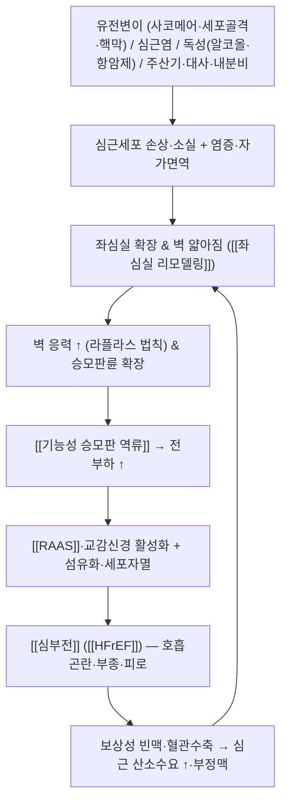

# 🩺 [[확장성 심근병증]] (Dilated Cardiomyopathy / 擴張性 心筋病, ICD-10 I42.0 / KCD I42.0)

![[확장성 심근병증_1_2.jpg|540]]
> [그림 1: ① 병태생리·영상 — Semi-automatic-quantification-of-4D-left-ventricular-blood-flow-1532-429X-12-9-S1.ogv]

![[확장성 심근병증_2_2.jpg|540]]
> [그림 2: ② 관련 해부 구조물 — Heart anterior ventricles valves.jpg]

![[확장성 심근병증_3_1.jpg|540]]
> [그림 3: ③ 치료·시술점 — Cardiac resynchronisation therapy.png]

> **핵심 3줄 요약 (Key Summary)**:
> - 📍 **병소 부위 & 해부·병태생리**: 좌심실([[좌심실]]) 심근이 일차적 병소로, 좌심실 확장 + 벽 얇아짐 + 수축기 기능저하(LVEF 감소)가 핵심이다. 관상동맥질환·판막질환·고혈압 등 **부하 이상만으로는 설명되지 않는** 심근 자체의 질환군이며, 승모판륜 확장에 따른 [[기능성 승모판 역류]]와 이차성 [[폐동맥고혈압]], 우심실 침범이 병태를 악화시킨다.
> - 🚩 **전형적 임상 양상 & 3대 징후**: 운동 시 [[호흡곤란]] → 기좌호흡 → 발작성 야간 호흡곤란으로 진행하는 [[심부전]] 증상, 하지 [[부종]]·야간뇨·피로·심장성 악액질. 3대 징후는 **① 외측으로 이동한 심첨박동 + ② 제3심음(S3 gallop) + ③ 경정맥압 상승/간경정맥역류**이며, 기능성 수축기 잡음과 폐저부 수포음이 동반될 수 있다.
> - 🛠️ **핵심 감별 검사 & 한·양방 다각적 치료 전략**: [[심초음파]]로 LV 치수·[[LVEF]]·벽운동·판막역류를 확인하고, [[BNP]]/NT-proBNP·ECG·[[심장 MRI]](LGE)·관상동맥 평가로 원인을 감별한다. 양방 표준은 [[HFrEF]] 4대 축(GDMT: ARNI/ACEi·BB·MRA·SGLT2i) + 이뇨제 + 기기치료(CRT/ICD)이며, 한의 치료는 **심장내과 협진을 전제로 한 보조적 변증 치료**(心悸·水腫·喘證 관점: [[진무탕]], [[영계출감탕]], [[생맥산]] 등)로 접근한다.
> - ⚠️ **응급 의뢰 레드플래그 & 악화 요인**: 안정 시 호흡곤란·기좌호흡, 실신/지속성 [[심실빈맥]], 저혈압·소변량 감소([[심인성 쇼크]]), 급성 흉통, 급격한 체중 증가(부종 악화)는 즉시 응급 의뢰. **강한 흉추 추나(thrust)·Valsalva 유발 수기·마황(ephedra) 함유 한약·고강도 운동은 금기 또는 회피**.

---

## 📌 목차
1. [질환 개요 & 해부학적 병태생리](#1-질환-개요--해부학적-병태생리)
2. [병태생리 메커니즘 & 생체역학적 악순환 네트워크](#2-병태생리-메커니즘--생체역학적-악순환-네트워크)
3. [임상 증상 & 이학적 검사(Physical Exam) 알고리즘](#3-임상-증상--이학적-검사physical-exam-알고리즘)
4. [감별 진단 매트릭스 (Differential Diagnosis)](#4-감별-진단-매트릭스-differential-diagnosis)
5. [한의 통합 치료 프로토콜 (침·약침·추나·한약)](#5-한의-통합-치료-프로토콜-침약침추나한약)
6. [재활 운동 & 생활습관 티칭 가이드](#6-재활-운동--생활습관-티칭-가이드)
7. [💡 사용자 진료실 핵심 필기 & 임상 노하우 (Melt-In 잔여 심화 집약)](#7--사용자-진료실-핵심-필기--임상-노하우-melt-in-잔여-심화-집약)
8. [출처 및 학술 참고 문헌 (References)](#8-출처-및-학술-참고-문헌-references)

---

## 1. 질환 개요 & 해부학적 병태생리

* **질환 정의 및 분류**:
  * **정의**: 확장성 심근병증(DCM)은 **좌심실의 확장(dilatation)과 수축기 기능저하(낮은 [[LVEF]])**를 특징으로 하며, **관상동맥질환·판막질환·고혈압 등 비정상적 부하 조건(abnormal loading conditions)으로 충분히 설명되지 않는** 일차성 심근질환이다(Knowlton 2019, PMID 31082299; Nat Rev Dis Primers 2019, PMID 31073134). 즉 "허혈도, 판막도, 압력부하도 아닌데 심장이 커지고 안 짜는" 상태를 지칭한다.
  * **분류 축**: ① **원발성(특발성) vs 이차성(속발성)** — 속발성은 심근염·독성·대사·주산기·결합조직병 등 원인이 확인되는 경우. ② **가족성(유전성) vs 산발성**. ③ 좌심실 확장이 뚜렷하지 않으나 수축기 기능저하만 있는 **비확장성 저운동(hypokinetic non-dilated) 표현형**(ESC 분류 개념). ④ 허혈성 심근병증은 병태·치료 전략이 달라 **별도 범주로 감별**한다(Dec & Fuster 1994, PMID 7969328).
  * **특수 연령군**: **신생아 DCM**은 성인과 원인 스펙트럼이 다르다(선천성·대사성·관상동맥 기형·빈맥유발성 등). 예후와 유전 상담·가족 선별의 중요성이 성인과 구분되므로 별도 접근이 필요하다(Soares & Rocha 2017, PMID 28256370).
  * **역학**: 성인 유병률·발생률 수치는 문헌과 지역에 따라 차이가 크며, **제공된 논문들에서 단일한 정량 수치를 확인할 수 없어 본 노트에서는 '근거 미확인'으로 표기**한다. 임상적으로는 남녀 모두 발생하고, 진단 연령대가 넓으며(소아~노년), 가족성 사례의 비율이 적지 않아 **1차 친족 스크리닝**이 권고된다(PMID 31073134; PMID 40155570).

* **관련 해부학적 구조물**:
  * **주 병변부 — 좌심실**: 심실벽이 얇아지고 내강이 구형(球形)으로 확장된다. 심근세포 소실 + 섬유화로 벽 응력(wall stress)이 증가하는 **라플라스(Laplace) 법칙 악순환**이 핵심이다.
  * **승모판 및 승모판륜([[승모판]])**: 심실 확장 → 승모판륜 확대 → 판막엽 응집(coaptation) 불충분 → **[[기능성 승모판 역류]]** → 좌심방 압력 상승 → 폐울혈.
  * **좌심방**: 확장되며 **[[심방세동]]** 등 심방성 부정맥과 **좌심방/좌심실 심첨부 혈전** 위험이 증가한다(색전성 뇌졸중 위험).
  * **폐순환 및 우심실**: 좌심실 이완기압 상승이 폐정맥압을 올려 **이차성 [[폐동맥고혈압]]**을 유발하고, 후기에는 **우심실 침범(우심부전)**으로 경정맥압 상승·간비대·전신 부종이 나타난다.
  * **전도계**: 섬유화가 [[방실결절]]·[[히스-푸르키녜계]]를 침범해 **[[각차단]](특히 [[좌각차단]], LBBB)** 및 심실 내 전도지연(QRS 폭 증가)을 흔히 동반한다. 이는 **[[심장재동기화치료]](CRT)** 적응 판단의 핵심 근거가 된다.
  * **판막 및 심실중격**: 기능성 [[삼첨판 역류]], 심실중격 운동 이상 등이 동반되어 예후를 악화시킨다.

---

## 2. 병태생리 메커니즘 & 생체역학적 악순환 네트워크

### 1) 해부학적·분자적 병태 기전
* **유전적 기전**: **사코메어 단백** 유전자(예: TTN, MYH7, MYBPC3, TNNT2 등), **세포골격·핵막 단백**(예: LMNA 등), 미토콘드리아·이온통로 유전자 변이가 보고된다. **TTN 절단 변이(truncating variant)** 가 가족성·산발성 DCM에서 가장 흔한 축으로 기술되며, 유전자형에 따라 부정맥 위험과 예후가 달라 **유전 상담·가족 선별검사**가 치료 계획에 포함된다(Wang & Lang 2025, PMID 40155570; PMID 31073134).
* **후천적·염증성 기전**: 바이러스성 [[심근염]](예: 파보바이러스 B19, 콕사키, 아데노바이러스 등) 이후 심근 손상과 지속적 면역반응이 DCM으로 이행할 수 있다는 가설이 오래 제기되어 왔다(Caforio & Stewart 1990, PMID 2186831). **"심근염 → 확장성 심근병증" 연속선** 개념은 특발성 DCM의 면역·염증 가설의 출발점이다.
* **독성·대사·특수 원인**: 알코올, 일부 항암제(안트라사이클린 등), 방사선, 갑상선질환, 영양결핍, [[주산기 심근병증]], 빈맥유발성 심근병증 등이 대표적이며, **원인 제거만으로도 부분적 회복이 가능한 가역성 군**이므로 반드시 감별해야 한다(PMID 31073134; PMID 7969328).
* **신경호르몬·리모델링 기전**: 심박출량 저하 → **[[RAAS]] 활성화 + 교감신경 항진** → 혈관수축·수분저류로 단기 보상되나, 장기적으로는 심근 섬유화·세포자멸·심실 확장을 촉진하는 **악순환**을 만든다. 이것이 현대 [[HFrEF]] 약물치료(신경호르몬 차단)의 이론적 근거이다(Knowlton 2019, PMID 31082299).

### 2) 생체역학적 연쇄 반응 (Kinetic Chain) — 심장판
* **심실–판막 연쇄**: 좌심실 확장 → 승모판륜 확장 → 기능성 승모판 역류 → 좌심방압↑ → 폐울혈 → 폐동맥압↑ → 우심실 부하↑ → 우심부전(부종·간울혈) → 복부팽만·식욕저하·악액질.
* **전도–기계 연쇄**: 심근 섬유화 → [[좌각차단]]·QRS 확장 → 좌우 심실 및 심실 내 비동기(asynchrony) → 심박출량 추가 저하 → **CRT 적응** 검토.
* **전신 연쇄**: 심박출량 저하 → 신관류 감소 → [[만성 콩팥병]]·전해질 이상(저나트륨혈증) → 약물 반응·예후 악화. 또한 골격근 산소 이용 저하 → 운동능 저하·근감소 → **심장성 악액질**.

---

## 3. 임상 증상 & 이학적 검사(Physical Exam) 알고리즘

### 1) 주소증 및 임상 증상
* **호흡기 증상(좌심부전)**: 운동 시 [[호흡곤란]](초기) → **기좌호흡(orthopnea)** → **발작성 야간 호흡곤란(PND)** → 안정 시 호흡곤란. 마른 기침, 천명(wheeze, "cardiac asthma").
* **전신 정체 증상(우심부전)**: 양측성 하지 [[부종]], 야간뇨, 복부팽만·복통, 식욕저하·오심, 간울혈로 인한 우상복부 불편감.
* **심장 증상**: [[심계항진]], 흉통(관상동맥이 정상이어도 발생 가능), **[[실신]] 또는 전실신**(치명적 부정맥의 신호일 수 있음).
* **비특이 증상**: 피로, 운동능 저하, 체중 증가(부종) 또는 악액질성 체중 감소, 인지기능 저하(저관류).
* **무증상 보상기 존재**: LVEF가 의미 있게 낮아도 증상이 없을 수 있어 **가족성 DCM의 선별검사**가 중요하다(Soares & Rocha 2017, PMID 28256370; PMID 31073134).

### 2) 필수 이학적 검사법 (Physical Examination)
* **[[경정맥압]] 측정 및 [[간경정맥 역류]]**: 우심부전 정체 평가의 핵심. 상승 시 체액 과부하 지표.
* **심첨박동 촉진**: **외측·하방으로 이동(displaced apex beat)** — 좌심실 확장의 대표 소견.
* **[[S3 심음]](제3심음, gallop)**: 좌심실 이완기 용적부하 및 수축기 기능저하의 고전적 청진 소견. S3 + 빈맥 = 심부전 악화 시사.
* **[[심잡음]] 청진**: 기능성 **[[승모판 역류]]** 수축기 잡음(심첨부), 기능성 삼첨판 역류 잡음(흉골좌연 하부). 심잡음이 크게 변동하면 급성 악화 고려.
* **폐 청진**: 폐저부 수포음(crackles), 흉수 동반 시 호흡음 감소.
* **복부·하지**: 간비대·압통, [[복수]], 함요부종(양측성, 대칭성).
* **활력징후·관류 평가**: 빈맥, **맥압 감소**, 저혈압, 사지 냉감·청색증, 소변량 감소 → **[[심인성 쇼크]] 감별**.

### 3) 진단 검사 알고리즘 (요약)
| 검사 | 목적 | 핵심 소견 |
| :--- | :--- | :--- |
| **[[심초음파]]** | 1차 확진 | LV 확장, [[LVEF]] 감소, 전반적 벽운동 저하, 기능성 MR, 심내 혈전 |
| **[[심전도]](ECG)** | 부정맥·전도 평가 | QRS 확장, [[좌각차단]], [[심방세동]], 비특이 ST-T 변화 |
| **[[BNP]] / NT-proBNP** | 심부전 진단·중증도 | 상승(단, 비만·신부전에서 위음성/양성 가능) |
| **[[심장 MRI]] (LGE)** | 원인 감별·섬유화 | 심내막하 LGE=허혈성, 심근층 LGE=비허혈성(심근염·사르코이드 등) |
| **관상동맥 조영/CT** | 허혈성 배제 | 유의한 관상동맥 협착 유무로 치료 전략 분기 |
| **혈액검사** | 원인·동반질환 | 신기능, 전해질, 갑상선, 철대사, 간기능, 바이러스/자가면역(선택) |
| **유전자 검사·가족 스크리닝** | 가족성 DCM | 유전자형 확인 후 1차 친족 ECG·심초음파 권고 |
| **심내막 심근 생검** | 선택적 | 급성 악화·원인 불명 시 제한적 시행 |

> ※ 상기 검사 항목은 DCM 진단·평가의 일반 원칙이며, 개별 수치 기준(EF 컷오프 등)은 가이드라인·시점에 따라 달라 본 노트에서는 **근거 미확인**으로 둔다. 제공 논문은 병태·유전·치료 개요를 다루며 세부 컷오프를 명시하지 않는다.

---

## 4. 감별 진단 매트릭스 (Differential Diagnosis)

| 감별 질환 | 호발 병소 및 원인 | 주소증 차이점 | 특이적 이학적 검사 소견 |
| :--- | :--- | :--- | :--- |
| **[[확장성 심근병증]] (본 질환)** | 좌심실 심근(일차성, 부하 이상으로 설명 안 됨) | 서서히 진행하는 심부전 증상, 가족력 흔함 | 심첨박동 외측 이동 + **S3 gallop** + 경정맥압↑, [[심초음파]]상 전반적 벽운동 저하 |
| **[[허혈성 심근병증]]** | 관상동맥 협착·경색 후 심근 | **협심증/심근경색 병력**, 국소 벽운동 이상 | ECG 병적 Q파, **LGE 심내막하 패턴**, 관상동맥 조영상 유의 협착 |
| **[[판막성 심질환]]** | 승모판·대동맥판 병변 | 잡음이 주 증상, 판막 병력 | 판막 영역 국소 잡음, 심초음파상 판막 구조 이상이 일차적 |
| **[[고혈압성 심장질환]]** | 좌심실 비대 후 확장 | 오랜 고혈압 병력 | 초기 concentric LVH → 후기 확장, 벽 두께 증가 소견 |
| **[[심근염]]** | 바이러스/자가면역 | **발열·흉통 후 급성 심부전**, 젊은 층 | 급성기 심초음파 기능저하, [[심장 MRI]] 심근부종·LGE |
| **알코올성/독성 심근병증** | 알코올·항암제·방사선 | 음주력·항암 치료력 | 원인 중단 시 기능 회복 가능성 |
| **[[주산기 심근병증]]** | 임신 말기~산후 | 산과력과 시간적 연관 | 분만 전후 발생, 회복 사례 존재 |
| **빈맥유발성 심근병증** | 지속성 빈맥(예: [[심방세동]], VT) | 두근거림 선행 | 리듬 조절 후 LV 기능 회복 |
| **침윤성 심근병증([[심장 아밀로이드증]], [[사르코이드증]], 혈색소침착증)** | 심근 침윤 | 전신 증상 동반, 벽 두께 증가형 | 심초음파 'granular sparkling', MRI 특징적 조영 패턴 |
| **신생아·소아 DCM(대사성·선천성)** | 선천성 대사질환·관상동맥 기형·유전 | 신생아기 심부전·수유곤란·성장부진 | 대사검사·유전검사 필요(Soares & Rocha 2017, PMID 28256370) |

---

## 5. 한의 통합 치료 프로토콜 (침·약침·추나·한약)

> **⚠️ 전제 조건(반드시 지킬 것)**: 확장성 심근병증은 **생명을 위협하는 기질성 심장질환**이다. 한의 치료는 **심장내과 표준치료(GDMT·이뇨제·기기치료)를 유지한 상태에서의 보조 요법**으로만 접근하며, **단독 치료로 심부전을 관리하려 해서는 안 된다**. 아래 침·약침·한약의 DCM/HFrEF에 대한 임상적 유효성은 **제공된 논문들에서 확인되지 않아 '근거 미확인'**이며, 전통 변증 체계에 기반한 임상적 응용임을 명시한다.

* **침구 치료 (Acupuncture)**:
  * **변증 접근**: 心悸·喘證·水腫·胸痺 범주로 접근. ① **心陽虛/心氣虛**(심계, 피로, 냉감) ② **水氣凌心**(부종, 기좌호흡) ③ **氣陰兩虛**(야간 도한, 갈증, 빈맥) ④ **血瘀**(흉통, 청색증, 심첨부 혈전).
  * **주요 혈위**: [[내관]](PC6, 심계·흉민), [[신문]](HT7, 안정·심계), [[거궐]](CV14)·[[전중]](CV17, 흉부 기운 소통), [[족삼리]](ST36, 기력 보강), [[삼음교]](SP6), [[태계]](KI3, 신–심 축), [[음릉천]](SP9, 부종), 배수혈 [[심수]](BL15)·[[폐수]](BL13)·[[신수]](BL23) 등.
  * **전침 세팅**: **저주파(2 Hz 내외) 위주, 자극 강도는 최소~약자극**. 교감신경 항진·혈압 변동·부정맥 유발을 피해야 하며, 강자극·장시간 자극은 피한다(구체적 프로토콜의 근거는 **미확인**).
  * **금기·주의**: ① **항응고제(와파린·DOAC)·항혈소판제 복용 중** → 출혈 위험, 심부 자침 회피. ② **[[ICD]]·[[심장재동기화치료]](CRT)·페이스메이커 삽입 환자** → **전침(전기 자극) 사용은 원칙적으로 회피**, 기기와의 전기적 간섭 우려. ③ 급성 심부전 악화기·저혈압·부정맥 조절 불량 시 **침 치료 연기**.
* **약침 치료 (Pharmacopuncture)**:
  * **응용 개념**: 경항부·배부 자율신경 조절점 및 변증 혈위에 소자극 약침. 단, **약침 종류·용량에 대한 DCM 근거는 확인되지 않음**.
  * **주의**: 항응고 상태에서 출혈·혈종, **스테로이드 계열 약침은 체액저류·혈압 상승 위험으로 심부전 환자에서 회피 권고**.
* **추나 치료 (Chuna Manipulation)**:
  * **목적**: 흉추 가동성 개선, 흉곽 확장·[[횡격막]] 이완 유도, 호흡 보조근 과긴장 완화 → 환기 효율 보조.
  * **기법**: 흉추 신전 가동, 늑골–흉추 관절 유 mobilization, 호흡 유도 이완(JS 계열 수기).
  * **금기**: **강한 thrust 기법·Valsalva를 유발하는 수기**는 혈압·흉강내압 급변을 일으켜 금기. 급성 심부전, 불안정 협심증, 조절되지 않는 부정맥, 중증 대동맥판 협착 동반 시 **전면 금기**.
* **한약 치료 (Herbal Medicine)**:
  * **급성기(水濕·血瘀 우세)**: [[영계출감탕]](苓桂朮甘湯)·[[오苓散]] 계열로 水氣凌心 접근, [[활혈거어]] 목적의 처방 검토(변증에 따라).
  * **만성기(心氣·心陽虛, 氣陰兩虛 우세)**: [[진무탕]](眞武湯)·[[계지감초탕]](桂枝甘草湯)·[[생맥산]](生脈散)·[[보익제]] 계열.
  * **⚠️ 안전성 주의(필수)**: ① **감초 함유 처방**은 가성 알도스테론증(pseudohyperaldosteronism)으로 부종·고혈압·저칼륨을 악화시킬 수 있어 **부종 조절이 안 되는 심부전 환자에서는 신중히 제한**. ② **저칼륨혈증은 강심배당체(디기탈리스) 독성을 증폭**시키므로 이뇨제 병용 환자에서 전해질 모니터링 필수. ③ **마황(ephedra)·자극성 온열 한약**은 교감신경 항진으로 금기. ④ 와파린·DOAC과의 상호작용(출혈 위험) 확인.
  * **근거 수준**: 상기 처방들의 DCM/HFrEF에 대한 무작위 대조시험 근거는 **제공 논문 범위에서 확인되지 않음(근거 미확인)**.

---

## 6. 재활 운동 & 생활습관 티칭 가이드

* **운동 재활 (Cardiac Rehabilitation)**:
  * **대상**: 상태가 안정된(안정 시 증상 없음, 체액 정체 조절됨) 환자. **[[심장재활]] 프로그램과 연계**가 원칙.
  * **강도 설정**: **Borg RPE 11~13 정도("대화가 가능한" 강도)**, 저강도 유산소(보행)부터 단계적 증량. **6분 보행검사·운동부하검사 결과에 따라 개별 처방**한다(구체적 METs·심박수 목표치는 환자별로 결정되며 본 노트에서는 **근거 미확인**).
  * **절대 중단·금기**: 안정 시 호흡곤란, 급성 악화, 조절되지 않는 부정맥, 흉통 발생, 어지럼·실신, 혈압 비정상 → 즉시 중단·평가.
  * **호흡 훈련**: 횡격막 호흡·입술 오므리기 호흡으로 호흡곤란 완화 보조(심부전 호흡 재활의 일반 원칙).
* **체액·식이 자가관리**:
  * **매일 같은 조건에서 체중 측정** 후 기록. **단기간(2~3일) 2 kg 이상 체중 증가** 또는 부종·호흡곤란 악화 시 **즉시 의료기관 연락** — 심부전 자가관리의 표준 권고(구체적 수치는 기관별 지침에 따름).
  * **염분 제한**: 과도한 나트륨 섭취 제한이 정체 증상 관리에 도움(구체적 g/day 기준은 **근거 미확인**, 전문의 지시 우선).
  * **수분 제한**: 저나트륨혈증·난치성 정체 환자에서 선택적으로 시행 — **반드시 주치의 지시 하에**.
* **습관 개입**:
  * **금주·금연**(알코올성 심근병증에서 특히 중요, 원인 제거 시 회복 가능성).
  * **카페인·각성제·교감신경 자극제 절제**, 감기약(마황 함유) 주의.
  * **예방접종**(인플루엔자·폐렴구균 등)으로 감염 유발 악화 예방.
  * **수면무호흡 평가**(수면다원검사) 및 치료 — 심부전 악화 인자.
  * **임신 상담**: 주산기 심근병증 병력 또는 가족성 DCM에서 임신 전 심장내과·유전 상담.
  * **가족 스크리닝**: 가족성 DCM 진단 시 1차 친족에 ECG·심초음파 권고(PMID 31073134; PMID 40155570).

---

## 7. 💡 사용자 진료실 핵심 필기 & 임상 노하우 (Melt-In 잔여 심화 집약)

> [!IMPORTANT]
> **🛡️ 원문 융합(Melt-In) 및 7번 섹션 작성 불변 규칙 (CRITICAL)**
> 1. **기존 필기 내용 상부 전면 융합 (Melt-In)**: 기존 노트에 있던 질환의 정의, 해부학적 원인, 증상, 이학적 검사법, 치료법, 생활 티칭 등은 상부 1~6번 섹션에 유기적으로 100% 녹여내어(Melt-In) 고도화합니다.
> 2. **7번 섹션의 차별화된 심화 집약 (녹이고 남은 고유 필기만 수록)**: 7번 섹션은 상부에 이미 녹여낸 기본 원문을 단순 중복 나열(복사-붙여넣기)하는 공간이 아닙니다. **상부 1~6번에 다 담기지 않은, 기존 노트에만 있었던 녹이고 남은 고유한 내용(원장님만의 독창적인 진료실 노하우, 실전 문진 체크리스트, 환자 설명 스크립트, 임상 감별 직관 팁 등)만이 엄선되어 집약**되어야 합니다.
> 3. **📷 질환 노트 필수 3종 이미지 수록**: 노트 하나당 ① 질환/병태생리 사진, ② 관련 해부 구조물 사진, ③ 치료/시술점 사진 등 **최소 3개 이상의 이미지를 단독 블록으로 필수 배치**합니다.

* **상부 섹션에 미처 다 담지 못한 고유 원문 필기**:
  * **"한방 진료실에서 DCM을 만나는 3가지 실제 상황"** — ① 심부전 진단을 모른 채 **"기운이 없고 다리가 붓는다"** 로 내원한 미진단 환자, ② 심장내과에서 DCM 진단 후 **"한약으로 심장을 좋게 해달라"** 는 환자(→ 표준치료 유지 + 보조 변증 치료로 프레임 전환), ③ 심장내과 치료 중 **부종·불면·심계·소화불량** 등 증상 완화 목적의 협진 환자.
  * **핵심 원칙 한 줄**: *"확장성 심근병증은 한의원에서 '치료'하는 병이 아니라, '발견'하고 '협진'하며 '삶의 질을 보조'하는 병이다."* 진단 지연이 곧 예후 악화라는 인식이 진료실 1차 방어선.
  * **미진단 환자 조기 발견 포인트**: 심첨박동 촉진 시 위치가 정상(좌측 제5늑간 쇄골중선)보다 **외측으로 밀려 있는지**, 청진에서 **S3 gallop(쿵-쿵-덩)**, 목정맥이 앉은 자세에서도 보이는지 — 이 3가지는 진료실에서 30초 내 확인 가능한 스크리닝이다.
* **진료실 실전 감별 & 치료 노하우**:
  * **1. 실전 문진 체크리스트 (내원 3분 안에 확인)**:
    1. **"베개를 몇 개 베고 주무시나요?"** — 베개 수 증가 = 기좌호흡의 실용적 지표.
    2. **"자다가 숨이 차서 깨신 적 있나요?"** — PND.
    3. **"최근 한 달간 몸무게가 늘었나요? 신발이 꽉 끼나요?"** — 정체 악화.
    4. **"계단 한 층 오르면 숨이 찬가요? 예전과 비교해서요."** — NYHA 기능등급 변화 추적.
    5. **"가족 중에 심장이 커졌다거나, 젊은 나이에 돌연사하신 분이 있나요?"** — 가족성 DCM·부정맥 위험.
    6. **"지금 드시는 심장약(이뇨제·혈압약)을 끊은 적 있나요?"** — 임의 중단 여부 확인.
  * **2. 치료 순서 및 '손맛' 노하우**:
    * **순서 원칙**: ① 활력징후·산소포화도·하지부종 확인 → ② 이상 소견 시 **양방 협진·응급 의뢰 결정** → ③ 안정 확인 후에만 한의 치료 시행. 즉 **"진단·의뢰 먼저, 치료는 그 다음."**
    * **체위**: 심부전 환자는 **앙와위 30~45도 상체 거상**으로 눕힌다. 완전 와위는 기좌호흡을 유발할 수 있다.
    * **자침 손맛**: 자극은 **가볍게, 짧게**. 강한 得氣(득기)를 목표로 하는 자극은 교감신경 항진·혈압 상승을 유발할 수 있어 피한다. 침 치료 중 **환자 얼굴색·호흡·맥**을 수시로 관찰.
    * **기기 삽입 환자**: ICD/CRT/페이스메이커 환자는 **기기 본체 및 리드선 부위 자침·전침 금기**. 전침은 사용하지 않는 것을 원칙으로 한다.
    * **복약 상호작용 체크**: 이뇨제(저칼륨) + 강심배당체 + 감초 함유 한약 조합은 특히 위험. 환자가 복용 중인 **모든 처방(양방·한방)을 목록화**한다.
  * **3. 환자 티칭 스크립트 (그대로 읽어줄 수 있는 멘트)**:
    * **심장 보호 설명**: *"심장은 커지면 좋은 게 아니라, 늘어나면서 힘이 빠지는 상태입니다. 늘어난 심장을 되돌리는 약이 지금 드시는 약이고, 이 약은 끊으면 안 됩니다. 한약과 침은 그 약의 효과를 방해하지 않는 선에서 몸의 붓기와 기운, 잠을 돕는 보조 역할입니다."*
    * **체중 자가관리**: *"매일 아침 같은 시간, 같은 옷으로 체중을 재서 노트에 적어주세요. 2~3일 사이에 2kg 이상 늘면 그건 살이 찐 게 아니라 물이 찬 신호일 수 있으니 바로 병원에 연락하셔야 합니다."*
    * **운동**: *"숨이 차서 말을 못 할 정도면 강도가 센 겁니다. 옆 사람과 대화가 가능한 정도, '조금 힘들다' 정도로 20~30분 걷는 게 적당합니다. 어지럽거나 가슴이 아프면 바로 멈추세요."*
    * **금기 안내**: *"감기약 중에 마황 들어간 것, 몸에 좋다는 각성·흥분성 건강식품, 술은 심장에 부담을 줍니다. 드시기 전에 꼭 저에게 먼저 확인해 주세요."*
    * **재발·악화 경고**: *"숨이 가라앉지 않거나, 자다 깨서 숨차거나, 다리가 갑자기 붓거나, 쓰러질 것 같은 어지럼이 오면 그건 응급입니다. 119 또는 심장내과 응급실로 바로 가세요."*
  * **4. 임상 감별 직관 팁(요약 휴리스틱)**:
    * **"젊은 사람이 심부전처럼 보이면 → 심근염/유전성/빈맥유발성/주산기를 먼저 떠올린다."**
    * **"고령 + 심부전 + 벽 두께 증가 → 아밀로이드증을 배제한다."**
    * **"협심증 병력 있으면 → 허혈성 심근병증을 먼저 배제한다(치료 전략이 완전히 갈린다)."**
    * **"최근 항암치료·음주·임신 이벤트가 있으면 → 가역성 원인을 반드시 확인한다(회복 가능성)."**

---

## 8. 출처 및 학술 참고 문헌 (References)

1. **대한심장학회 / 대한내과학회 교과서 및 한방순환기내과학 교과서** — 심부전·심근병증 총론 및 변증 체계 참조(본문의 일반 원칙 서술 근거).
2. **Soares P, Rocha G (2017)**. *Neonatal dilated cardiomyopathy*. **Rev Port Cardiol**. PMID: 28256370
   - **[연구 요약]**: 신생아기 확장성 심근병증의 원인 스펙트럼·진단 접근·예후를 정리한 고찰. 성인 DCM과 달리 신생아에서는 선천성·대사성·관상동맥 기형·빈맥유발성 등 감별 범위가 넓고, 유전 상담과 가족 선별의 중요성이 강조된다.
3. **Knowlton KU (2019)**. *Dilated Cardiomyopathy*. **Circulation**. PMID: 31082299
   - **[연구 요약]**: 확장성 심근병증의 정의·원인·자연경과·치료를 임상 관점에서 정리한 리뷰. 좌심실 확장과 수축기 기능저하가 핵심이며, 신경호르몬 차단(RAAS·교감신경) 중심의 [[HFrEF]] 표준 약물치료와 기기치료의 근거를 제시한다.
4. **Wang X, Lang Z (2025)**. *Dilated cardiomyopathy: from genes and molecules to potential treatments*. **Mol Cell Biochem**. PMID: 40155570
   - **[연구 요약]**: DCM의 유전·분자 기전(사코메어·세포골격·미토콘드리아 등)과 이를 표적으로 한 잠재적 치료 전략을 연결한 최신 고찰. 유전자형에 따른 위험分层과 유전자·분자 수준 치료 개발 방향을 논의한다.
5. ** (2019)**. *Dilated cardiomyopathy*. **Nat Rev Dis Primers**. PMID: 31073134
   - **[연구 요약]**: DCM의 병태생리·진단·관리를 종합한 프라이머 리뷰. 부하 이상으로 설명되지 않는 심근 질환이라는 정의, 원인 감별(허혈성·판막성·고혈압성 배제), 가족성 평가, 심부전 표준치료와 기기치료 흐름을 총괄적으로 제시한다.
6. **Dec GW, Fuster V (1994)**. *Idiopathic dilated cardiomyopathy*. **N Engl J Med**. PMID: 7969328
   - **[연구 요약]**: 특발성 DCM의 고전적 종설. 임상 양상·혈역학·자연경과·치료 원칙을 체계화하여, 허혈성·판막성·고혈압성 원인 배제 후 진단하는 개념적 틀과 심부전 관리의 기본 원칙을 확립하는 데 기여하였다.
7. **Caforio AL, Stewart JT (1990)**. *Idiopathic dilated cardiomyopathy*. **BMJ**. PMID: 2186831
   - **[연구 요약]**: 특발성 DCM에서 **심근염→심근병증 연속선** 가설과 면역·염증 기전을 논의한 초기 문헌. 심근 생검·자가항체 등 면역학적 평가의 필요성을 제기하여 이후 DCM 병인론 연구의 방향을 제시하였다.

> **📌 근거 표기 원칙 준수 안내**
> - 본 노트의 인용은 위 제공 문헌으로 한정하였으며, 존재하지 않는 PMID·논문은 기재하지 않았다.
> - 역학 수치, LVEF 컷오프, 나트륨 제한 g/day, 운동 강도(METs) 등 **제공 문헌에서 확인되지 않는 정량 수치는 '근거 미확인'으로 명시**하였다.
> - 침·약침·추나·한약의 DCM/HFrEF에 대한 임상적 유효성은 제공 문헌에서 다루지 않아 **임상적 응용(변증 기반)으로 구분**하여 서술하였으며, 반드시 심장내과 표준치료와 병행하는 보조 요법으로 한정한다.