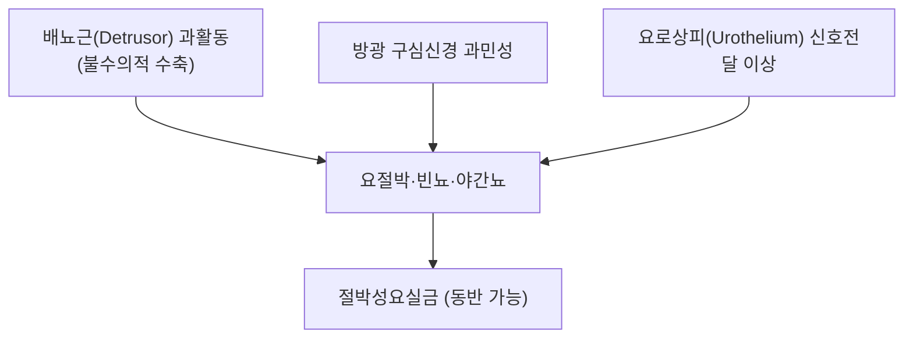

---
aliases:
  - Overactive Bladder
  - OAB
  - 過敏性膀胱症候群
  - 방광과민증
tags:
  - 질환
  - 비뇨기질환
  - 배뇨장애
---

# 🩺 과민성 방광 증후군 (過敏性膀胱症候群, Overactive Bladder, OAB)

> **핵심 3줄 요약 (Key Summary)**:
> - 📍 정의: 국제요실금학회(ICS) 정의에 따르면, 요로감염이나 다른 명백한 병리가 없는 상태에서 요절박(urgency)이 있으며, 대개 빈뇨(frequency)와 야간뇨(nocturia)를 동반하고, 절박성요실금(urge incontinence)을 동반할 수도 있는 증후군.
> - 🚩 병태생리: 배뇨근(detrusor)의 불수의적 수축(배뇨근 과활동), 방광 감각신경의 과민성, 요로상피(urothelium)의 비정상적 신호전달 등이 복합적으로 작용하는 것으로 이해됨 — 단일 원인이 아닌 다인성 증후군으로 재조명되고 있음.
> - 🛠️ 진단 & 치료: 임상적으로 배뇨일지·증상 평가로 진단하며 요로감염 등 다른 원인을 배제. 1차 치료는 행동치료(방광훈련, 골반저근 운동, 수분/카페인 조절), 2차 치료는 항무스카린제 또는 베타-3 작용제(미라베그론), 3차 치료는 보툴리눔 독소 방광 내 주입, 천골신경조절술 등.
> - ⚠️ 유의점: 혈뇨, 급격한 증상 악화, 재발성 요로감염, 배뇨통을 동반하는 경우 단순 OAB로 단정하지 말고 방광암·간질성방광염 등 기질적 질환 감별이 필요.

---

## 📌 목차
1. [정의 및 역학](#1-정의-및-역학)
2. [병태생리](#2-병태생리)
3. [임상 평가 & 진단](#3-임상-평가--진단)
4. [단계별 치료 전략](#4-단계별-치료-전략)
5. [감별해야 할 질환](#5-감별해야-할-질환)
6. [한의학적 연계](#6-한의학적-연계)
7. [출처 및 학술 참고 문헌 (References)](#7-출처-및-학술-참고-문헌-references)

---

## 1. 정의 및 역학

과민성 방광 증후군(OAB)은 국제요실금학회(International Continence Society, ICS)가 정의한 증상 기반 증후군으로, 요로감염이나 다른 명백한 국소 병리 없이 요절박을 핵심 증상으로 하며 대개 빈뇨·야간뇨를 동반합니다. 연령이 증가할수록 유병률이 높아지며, 삶의 질에 상당한 영향을 미치는 흔한 비뇨기 질환입니다.

---

## 2. 병태생리

2019년 *European Urology*에 발표된 Peyronnet 등의 포괄적 리뷰는 OAB가 단일 기전이 아닌 다양한 병태생리 경로(근원성, 신경원성, 요로상피성 등)가 복합적으로 작용하는 이질적 증후군임을 강조하며, 이에 따라 "맞춤형 치료(tailored treatment)"로의 전환 필요성을 제시했습니다.

* **배뇨근 과활동(Detrusor overactivity)**: 방광이 충분히 채워지지 않은 상태에서도 배뇨근이 불수의적으로 수축하여 요절박·요실금을 유발.
* **구심신경 과민성**: 방광 팽창에 대한 감각신경의 역치가 낮아져 적은 소변량에도 강한 요절박을 느낌.
* **요로상피 신호전달**: 방광 내벽의 요로상피세포가 단순 장벽 기능을 넘어 감각 신호전달에 능동적으로 관여한다는 개념이 최근 병태생리 이해에 추가됨.

---

## 3. 임상 평가 & 진단

* **핵심 증상**: 요절박(참을 수 없는 급박한 배뇨감), 주간빈뇨, 야간뇨, 절박성요실금(동반 가능).
* **평가 도구**: 배뇨일지(빈도·요량·수분섭취 기록), 증상 설문지.
* **배제해야 할 원인**: 요로감염, 방광결석, 방광암, 당뇨병(다뇨), 간질성방광염/방광통증증후군 등 — 소변검사로 감염·혈뇨 확인이 기본입니다.
* **복잡 증례**: 신경학적 질환 동반, 치료 저항성 등의 경우 요역동학검사(urodynamics)를 고려합니다.

---

## 4. 단계별 치료 전략

* **1차: 행동치료**: 방광훈련(배뇨 간격 늘리기), 골반저근 운동(케겔), 카페인·수분 섭취 조절, 체중 관리.
* **2차: 약물치료**:
  * 항무스카린제(옥시부티닌, 솔리페나신, 톨테로딘 등) — 배뇨근 M3 수용체 차단을 통한 수축 억제.
  * 베타-3 아드레날린 작용제(미라베그론) — 배뇨근 이완을 통한 저장 기능 개선, 항무스카린제 대비 구갈·변비 등 항콜린성 부작용이 적음.
* **3차: 침습적 치료**: 방광 내 보툴리눔독소 주입, 천골신경조절술(SNM), 경피 후경골신경자극술(PTNS) 등 — 1·2차 치료에 반응하지 않는 난치성 OAB에서 고려.

---

## 5. 감별해야 할 질환

* **요로감염**: 배뇨통·발열 동반 시 우선 배제.
* **간질성방광염/방광통증증후군**: 방광 충만 시 통증이 핵심 특징으로 OAB와 감별 필요.
* **방광암**: 무통성 혈뇨가 있는 경우 반드시 정밀 비뇨기과적 평가.
* **다뇨를 유발하는 전신질환**: 당뇨병, 요붕증 등.

---

## 6. 한의학적 연계

과민성 방광 증후군의 빈뇨·요절박은 한의학적으로 방광습열(膀胱濕熱) 또는 신기허(腎氣虛)·신양허(腎陽虛)로 변증하는 경우가 많으며, 청열이습(淸熱利濕) 또는 온신고삽(溫腎固澁) 치법 및 축천환(縮泉丸) 계열 처방이 임상에서 활용됩니다. 개별 처방의 구체적 임상 효과 근거 수준은 연구마다 차이가 있어 ⚠️ 내용 검토 필요로 남겨두며, 표준 약물치료·행동치료와 병행 시 상담이 필요합니다.

---

## 7. 출처 및 학술 참고 문헌 (References)

1. **Peyronnet B, Mironska E, Chapple C, et al. (2019)**. A Comprehensive Review of Overactive Bladder Pathophysiology: On the Way to Tailored Treatment. *European Urology*, 75(6), 988–1000. PMID: [30922690](https://pubmed.ncbi.nlm.nih.gov/30922690/)
   - **[연구 요약]**: OAB의 다양한 병태생리 기전(근원성·신경원성·요로상피성)을 종합하고, 맞춤형 치료 접근의 필요성을 제시한 대표적 리뷰.
2. **American Urological Association (AUA)/SUFU**. Guideline on the Diagnosis and Treatment of Idiopathic Overactive Bladder. [https://www.auanet.org/guidelines-and-quality/guidelines/idiopathic-overactive-bladder](https://www.auanet.org/guidelines-and-quality/guidelines/idiopathic-overactive-bladder)
   - **[요약]**: OAB의 표준 진단·단계별 치료(행동치료→약물치료→침습적 치료) 임상진료지침.
