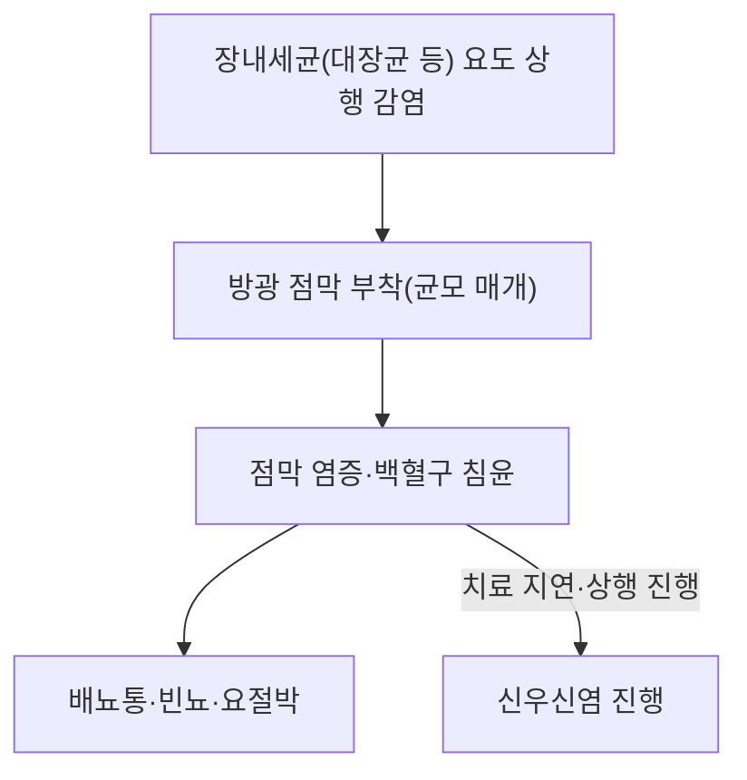

---
aliases:
  - Cystitis
  - 급성 방광염
  - 만성 방광염
  - 방광염
tags:
  - 질환
  - 신질환
  - 비뇨기질환
---

# 🩺 방광염 (Cystitis)

> **핵심 3줄 요약 (Key Summary)**:
> - 📍 병소 부위 & 병태생리: 방광 점막의 감염성·비감염성 염증으로, 대부분(약 75~95%) 대장균(*E. coli*) 등 장내세균이 요도를 통해 상행 감염하여 발생하는 단순性 하부요로감염(uncomplicated UTI)이 가장 흔한 형태. 여성이 요도가 짧고 항문·질과 가까워 남성보다 훨씬 흔하게 발생.
> - 🚩 전형적 임상 양상: 배뇨통(dysuria)·빈뇨(frequency)·요절박(urgency)의 전형적 3대 증상, 치골상부 불편감, 혼탁뇨·혈뇨가 동반될 수 있음. 발열·옆구리 통증이 동반되면 신우신염 등 상부요로감염으로의 진행을 의심.
> - 🛠️ 핵심 진단 & 치료: 요검사(소변시험지·현미경검사)에서 백혈구뇨·아질산염 양성이 진단의 핵심이며, 단순 방광염은 소변배양 없이 임상 증상만으로 진단·치료를 시작하는 경우가 많음. 치료는 경험적 항생제(니트로푸란토인·트리메토프림-설파메톡사졸·포스포마이신 등)가 표준.
> - ⚠️ 레드플래그: 발열·오한·옆구리 통증·전신 쇠약이 동반되면 신우신염·패혈증 진행을 의심해야 하며, 남성·임신부·소아·재발성/복잡성 요로감염은 정밀 검사와 전문의 진료가 필요.

---

## 📌 목차
1. [질환 개요 & 분류](#1-질환-개요--분류)
2. [병태생리](#2-병태생리)
3. [임상 증상 & 진단](#3-임상-증상--진단)
4. [치료 전략](#4-치료-전략)
5. [재발성 방광염 예방](#5-재발성-방광염-예방)
6. [한의학적 연계](#6-한의학적-연계)
7. [출처 및 학술 참고 문헌 (References)](#7-출처-및-학술-참고-문헌-references)

---

## 1. 질환 개요 & 분류

* **단순성(비복잡성) 방광염**: 해부학적·기능적으로 정상인 비임신 여성에서 발생하는 방광염으로, 가장 흔한 형태.
* **복잡성 방광염**: 남성, 임신부, 요로 폐쇄·기형, 유치도뇨관, 면역저하 환자 등에서 발생하며 치료가 더 어렵고 합병증 위험이 높음.
* **간질성 방광염(Interstitial cystitis)**: 세균 감염 없이 만성 골반통·빈뇨를 특징으로 하는 비감염성 방광 증후군으로, [[과민성 방광 증후군]]과 감별이 필요.

---

## 2. 병태생리

요도구 주변 상재균(주로 대장균)이 요도를 통해 방광으로 상행하여 방광 점막에 부착·증식하면서 국소 염증 반응을 일으킵니다. 여성은 요도 길이가 짧고 항문·질 입구와 가까워 세균의 상행이 용이해 남성보다 발생률이 현저히 높습니다. 성교, 폐경 후 에스트로겐 저하로 인한 질 점막 위축, 방광 배출 장애(잔뇨) 등이 위험인자로 작용합니다.

---

## 3. 임상 증상 & 진단

* **증상**: 배뇨통(작열감), 빈뇨, 요절박, 치골상부 불편감·압통, 혼탁뇨 또는 악취뇨, 육안적 혈뇨(일부).
* **진단**: 소변시험지 검사에서 백혈구 에스터라제·아질산염 양성이 신속 진단에 활용되며, 전형적 증상(배뇨통+빈뇨, 질 분비물 없음)만으로도 임상 진단이 가능한 경우가 많음. 재발성·복잡성 감염이 의심되면 소변배양검사를 시행.
* **감별진단**: 질염, 요도염(성병 관련), 간질성 방광염, 신우신염(발열·옆구리 통증 동반 시).

---

## 4. 치료 전략

* **경험적 항생제**: 니트로푸란토인, 트리메토프림-설파메톡사졸(내성률 낮은 지역), 포스포마이신 단회요법 등이 단순성 방광염의 1차 치료로 권고됨(현지 항생제 내성 패턴 고려).
* **대증치료**: 충분한 수분 섭취, 배뇨통에 대한 요로진통제(페나조피리딘 등)가 보조적으로 활용됨.
* **복잡성/재발성**: 원인 감별(폐쇄·기형·잔뇨) 및 배양 결과에 기반한 표적 항생제 치료, 필요시 영상 검사.

---

## 5. 재발성 방광염 예방

크랜베리 제제, 성교 후 배뇨, 폐경 후 여성에서의 국소 에스트로겐 요법, 재발이 잦은 경우 저용량 예방적 항생제 요법 등이 최신 비뇨기과 가이드라인(AUA/CUA/SUFU, 2025)에서 다뤄지고 있습니다.

---

## 6. 한의학적 연계

방광염은 한의학적으로 임증(淋證) 범주에 속하며, 습열하주(濕熱下注)로 변증하는 경우가 많아 [[팔정산]] 등 청열이습통림(淸熱利濕通淋) 치법의 처방이 활용됩니다. [[금전초]]·[[모근]](백모근)·차전자 등이 청열이습·이수통림 목적으로 배오됩니다. 다만 급성기 감염 소견이 뚜렷한 경우 항생제 치료를 우선하고 한약은 보조적으로 병용하는 것이 안전합니다.

---

## 7. 출처 및 학술 참고 문헌 (References)

1. **Acute Cystitis**. *StatPearls (NCBI Bookshelf)*. [https://www.ncbi.nlm.nih.gov/books/NBK459322/](https://www.ncbi.nlm.nih.gov/books/NBK459322/)
   - **[요약]**: 급성 방광염의 병태생리·진단·치료를 정리한 임상 참고자료.
2. **Recurrent Uncomplicated Urinary Tract Infections in Women: AUA/CUA/SUFU Guideline (2025)**. *American Urological Association*. [https://www.auanet.org/guidelines-and-quality/guidelines/recurrent-uti](https://www.auanet.org/guidelines-and-quality/guidelines/recurrent-uti)
   - **[요약]**: 재발성 요로감염(방광염 포함)에 대한 최신 미국비뇨기과학회 진료지침.
3. **Urinary Tract Infections: Core Curriculum 2024**. *American Journal of Kidney Diseases*. [https://www.ajkd.org/article/S0272-6386(23)00837-5/fulltext](https://www.ajkd.org/article/S0272-6386(23)00837-5/fulltext)
   - **[요약]**: 요로감염(방광염 포함) 전반에 대한 최신 핵심 커리큘럼 리뷰.
