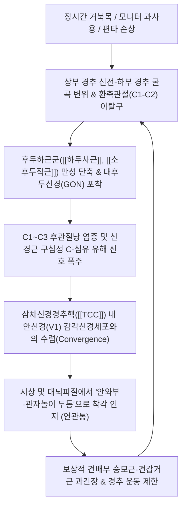

# 🩺 [[경추성 두통]] (Cervicogenic Headache / 頸椎性頭痛, G44.847)

> **핵심 3줄 요약 (Key Summary)**:
> - 📍 **병소 부위 & 해부·병태생리**: 상부 경추(C1~C3)의 골관절·추간판·후두하근막 병변에서 기원한 통각 신호가 [[삼차신경경추핵]](Trigeminocervical Complex, TCC)에서 [[삼차신경]](CN V) 안신경(V1) 감각 섬유와 2차 감각신경세포로 수렴(Convergence)되어 안와 및 전두부 연관통으로 투사되는 대표적 이차성 두통.
> - 🚩 **전형적 임상 양상 & 3대 징후**: 후두부에서 시작하여 동측 관자놀이 및 안와부("눈골이 빠질 것 같다")로 방사되는 고정된 **편측성 비박동성 통증**, 목의 특정 신전/회전 자세에 의한 두통 유발, 동측 견배부 긴장 및 경추 관절가동범위(ROM) 제한.
> - 🛠️ **핵심 감별 검사 & 한·양방 다각적 치료 전략**: 경추 굴곡-회전 검사([[FRT]], 32도 이하 제한 시 양성), C0-C1/C1-C2 환축관절 가동화 및 후두하근막 이완 [[추나요법]], [[풍지]](GB20)·[[천주]](BL10)·[[완골]](GB12) 전침 및 [[오공약침]]/[[봉약침]], 풍한습어 변증 한약([[청상견통탕]], [[갈근탕]]).
> - ⚠️ **응급 의뢰 레드플래그 & 악화 요인**: 경동맥/추골동맥 박리(Vertebrobasilar dissection)를 시사하는 벼락두통(Thunderclap headache), 급성 신경학적 결손(시야장애, 복시, 실조, 구음장애), 호너 증후군 동반 시 상부경추 회전 추나 절대 금기 및 즉각적 혈관 응급 영상(CTA/MRA) 의뢰.

---

## 📌 목차
1. [질환 개요 & 해부학적 병태생리](#1-질환-개요--해부학적-병태생리)
2. [병태생리 메커니즘 & 생체역학적 악순환 네트워크](#2-병태생리-메커니즘--생체역학적-악순환-네트워크)
3. [임상 증상 & 이학적 검사(Physical Exam) 알고리즘](#3-임상-증상--이학적-검사physical-exam-알고리즘)
4. [감별 진단 매트릭스 (Differential Diagnosis)](#4-감별-진단-매트릭스-differential-diagnosis)
5. [한의 통합 치료 프로토콜 (침·약침·추나·한약)](#5-한의-통합-치료-프로토콜-침약침추나한약)
6. [재활 운동 & 생활습관 티칭 가이드](#6-재활-운동--생활습관-티칭-가이드)
7. [💡 사용자 진료실 핵심 필기 & 임상 노하우 (Melt-In 잔여 심화 집약)](#7--사용자-진료실-핵심-필기--임상-노하우-melt-in-잔여-심화-집약)
8. [출처 및 학술 참고 문헌 (References)](#8-출처-및-학술-참고-문헌-references)

---

## 1. 질환 개요 & 해부학적 병태생리

![[경추성 두통_1.png|450]]
> [그림 1: ① 질환/병태생리 메디컬 일러스트 — 삼차신경(CN V) V1·V2·V3 분지 주행 및 삼차신경경추핵(TCC) 수렴 메커니즘]

### 1) 질환 정의 및 역학
경추성 두통([[Cervicogenic headache]], CEH, ICD-10 G44.847)은 경추골, 추간판, 후관절(Facet joint), 인대 및 두경부 근육근막의 해부학적·기계적 기능 부전에서 기인하여 두부로 연관통(Referred pain)을 투사하는 대표적인 **경추 기인성 이차성 두통(Secondary headache)**이다. 

만성 두통 환자의 약 15~20%를 차지하며, 편타성 손상(Whiplash injury)이나 경추 염좌 후 발생하는 만성 두통 환자의 50% 이상에서 주원인으로 지목된다. 현대 사회에서는 스마트폰의 과도한 사용과 컴퓨터 모니터 주시로 인한 전방머리자세(거북목, Forward head posture) 및 일자목 변형이 급증하면서 30~50대 직장인과 수험생을 중심으로 유병률이 급상승하고 있다. 여성 대 남성의 발병 비율은 약 3~4:1로 여성에서 현저히 호발한다.

### 2) 관련 해부학적 구조물
* **상부 경추 골관절 복합체**:
  * **환후두관절(C0-C1, Atlanto-occipital joint)**: 후두골 과상돌기와 제1경추(환추, Atlas) 외측괴가 이루는 관절로, 주로 두부 굴곡-신전 운동을 담당하며 후두골 기저부 통증을 유발.
  * **환축관절(C1-C2, Atlantoaxial joint)**: 경추 전체 회전 운동의 약 50%를 담당하는 축성 관절. 회전 시 비틀림 스트레스와 연골 마모로 인해 C2 척수신경을 기계적으로 자극.
  * **C2-C3 후관절(Facet joint)**: 제3후두신경(Third occipital nerve, TON)이 관절낭을 직접 감싸며 주행하므로 관절염 발생 시 후두부 및 측두부 연관통의 핵심 병소가 됨.
* **근육 및 근경막 복합체**:
  * **후두하근군(Suboccipital muscles)**: [[대후두직근]](Rectus capitis posterior major), [[소후두직근]](Rectus capitis posterior minor), [[상두사근]](Obliquus capitis superior), [[하두사근]](Obliquus capitis inferior).
  * **근경막 브릿지(Myodural bridge)**: 소후두직근 및 하두사근의 섬유성 결합조직이 환추후두막을 뚫고 들어가 경추 경막(Dura mater)과 직접 연결되어 있음. 근육의 만성 단축은 척수 경막을 직접 기계적으로 견인하여 광범위한 두개내압 이상 감각 및 긴장성 두통을 유발함.
  * **표재 경부 신근군**: [[두반극근]](Semispinalis capitis), [[두판상근]](Splenius capitis), [[승모근]](Trapezius) 상부 섬유.
* **신경 주행 경로**:
  * **대후두신경([[대후두신경]], Greater occipital nerve, GON)**: C2 척수신경 후지의 내측지. 하두사근 하연을 감아돌아 두반극근을 관통하고 상항선(Superior nuchal line)을 넘어 두정부까지 주행.
  * **소후두신경(Lesser occipital nerve, LON)**: C2-C3 전지 기원 경신경총 분지. 흉쇄유돌근 후연을 따라 후두측두부로 주행.

---

## 2. 병태생리 메커니즘 & 생체역학적 악순환 네트워크

![[경추성 두통_2.png|450]]
> [그림 2: ② 관련 해부학적 구조물 — 후두하근군(대·소후두직근, 상·하두사근) 및 환축관절(C1-C2) 복합체 해부 도해]

### 1) 삼차신경-경추 복합체(Trigeminocervical Complex, TCC) 수렴 기전
경추성 두통의 병태생리학적 핵심은 **'신경 수렴-투사 모델(Convergence-Projection Model)'**이다.
* 뇌간 하부의 삼차신경 척수핵 미측핵(Spinal trigeminal nucleus pars caudalis)은 상부 경추(C1, C2, C3) 분절의 척수 후각(Dorsal horn) 교양질과 조직학적 경계 없이 직접 연속되어 하나의 기능적 통합체인 **삼차신경-경추 복합체([[TCC]])**를 이룬다.
* 상부 경추의 후관절, 인대, 후두하근에서 기원한 C1~C3 감각 구심 섬유와, 안구·안와·전두부 감각을 담당하는 제5뇌신경 [[삼차신경]](Trigeminal nerve)의 제1분지인 안신경(Ophthalmic nerve, V1) 섬유가 **동일한 2차 통각 투사 뉴런(Second-order nociceptive neuron)**에 시냅스를 형성하여 수렴한다.
* 상부 경추의 지속적인 관절 마찰 및 근막 유착 신호가 2차 뉴런을 과흥분시키면, 대뇌 감각피질은 이 입력 신호가 경추에서 온 것인지 안와부에서 온 것인지 명확히 구별하지 못하고 **"눈 뒤쪽이 빠개지듯이 아프다", "관자놀이와 이마가 쑤신다"**는 안면·두부 통증으로 착각하여 인식하게 된다.

### 2) 생체역학적 불균형과 근막 연쇄 부하
* 전방머리자세(Forward head posture)가 형성되면 머리의 무게중심이 전방으로 이동하여, 경추 1cm 전방 변위당 후두하근군에는 약 2~3kg의 추가적인 등척성 부하가 가해진다.
* 특히 [[하두사근]](Obliquus capitis inferior)의 지속적 강직은 그 아래를 통과하는 [[대후두신경]](GON)을 직접 압박하여 신경내막 허혈과 압박성 신경염을 일으킨다.
* 동시에 소후두직근 건막에 부착된 근경막 브릿지가 경추 경막(Dura)을 견인함으로써 기침, 재채기, 목을 숙이는 동작 시 두통이 즉각 악화되는 기계적 악순환이 완성된다.

---

## 3. 임상 증상 & 이학적 검사(Physical Exam) 알고리즘

### 1) 주소증 및 임상적 3대 특징
* **고정된 편측성 두통 (Unilateral Headache)**:
  * 통증이 좌우로 번갈아 나타나지 않고 항상 목덜미의 특정 이환측에서 시작하여 후두부, 두정부를 거쳐 동측 관자놀이와 안와부(눈 뒤쪽)로 투사됨.
* **기계적 유발 요인 (Mechanical Triggering)**:
  * 고개를 뒤로 젖히거나 한쪽으로 오래 돌리고 있을 때, 혹은 경추 특정 부위를 손가락으로 압박할 때 두통이 재현되거나 악화됨.
* **경추 운동성 감소 및 동측 견배통 동반**:
  * 능동적·수동적 경추 회전 각도가 감소하고, 동측 [[승모근]], [[견갑거근]], [[흉쇄유돌근]]의 팽팽한 띠(Taut band) 및 압통점이 항상 동반됨.

### 2) 필수 이학적 검사 프로토콜
* **경추 굴곡-회전 검사 (Flexion-Rotation Test, [[FRT]]) — ★최고 진단 가치**:
  * **검사 목적**: C1-C2(환축관절) 기능 부전 및 회전 제한 평가.
  * **검사 방법**: 환자를 앙와위로 눕히고, 경추를 완전히 최대로 굴곡시켜 C2~C7 하부 경추의 회전을 기계적으로 잠근(Locking) 상태에서 머리를 좌우로 부드럽게 회전시킴.
  * **판정 기준**: 정상 회전각은 양측 약 44°이나, 환축관절 병변 환자는 이환측 회전이 **32° 이하로 현저히 제한**되거나 전형적인 두통이 재현됨 (민감도 91%, 특이도 90%).
* **후두하삼각 및 상부 경추 후관절 촉진 검사**:
  * C1 횡돌기(유양돌기와 하악각 사이 함요처), C2 극돌기 외측 1cm 지점, [[풍지]](GB20) 및 [[천주]](BL10) 부위를 깊게 압박할 때 이마나 안와부로 뻗치는 방산통(Jump sign) 재현 여부 확인.
* **경추 추간공 압박 검사 ([[스펄링 검사]], Spurling test)**:
  * 하부 경추 신경근병증(C5-C7)과의 동반 여부 감별을 위해 경추 신전 및 이환측 측굴 후 축성 압박 시행.

---

## 4. 감별 진단 매트릭스 (Differential Diagnosis)

| 감별 항목 | [[경추성 두통]] (CEH) | [[편두통]] (Migraine) | 긴장형 두통 (TTH) | 후두신경통 (Occipital Neuralgia) |
| :--- | :--- | :--- | :--- | :--- |
| **통증 편측성** | **항상 편측성 고정** | 편측성 (간혹 좌우 교대) | **양측성** (머리 전체 띠) | 편측성 (후두부 중심) |
| **통증 양상** | 둔하고 쑤시는 심부 연관통 | 박동성(욱신거림, 심장 뜀) | 조이고 압박하는 비박동성 | **찌릿찌릿 쏘는 발작성 전격통** |
| **목 움직임 유발** | **뚜렷하게 유발/악화 (FRT+)** | 목 움직임과 무관 | 무관하거나 경미 | 목 신전 시 순간적 방전 |
| **동반 자율증상** | 목 운동 제한, 견배통 | **오심·구토, 빛/소리 공포증** | 일상활동 시 악화 없음 | 대후두신경 주행로 감각저하 |
| **시발 부위** | 후두부/목덜미 $\rightarrow$ 안와 | 측두부/안와 $\rightarrow$ 후두부 | 전두부·두정부 전반 | 후두골 기저부 국한 |

---

## 5. 한의 통합 치료 프로토콜 (침·약침·추나·한약)

![[경추성 두통_4.jpg|450]]
> [그림 3: ③ 한의 통합 치료 시술점 — 후두하부 풍지(GB20)·천주(BL10)·완골(GB12) 약침 및 추나 치료 타겟 도해]

### 1) 경추 가동 및 근막 이완 추나요법 (Chuna Manual Therapy)
* **C0-C1 환후두관절 견인-신전 가동화**:
  * 술자의 양측 시지 외측연으로 후두골 기저부를 받치고 부드러운 장축 견인(Long-axis traction)을 가하여 후두골과 환추 사이의 수직 압박 해제.
  * 환자의 호흡 주기와 동기화하여 흡기 시 경추 신전을 유도하고 호기 시 장축 신장력을 3단계로 점진적 적용.
* **C1-C2 환축관절 회전 교정 추나 (JS 관절가동술)**:
  * 경추를 완전 굴곡시켜 하부 경추를 잠근 상태에서 C1 외측괴를 전방으로 지지하며 회전 제한 분절의 관절 유연성을 생리학적 범위 내에서 부드럽게 회복 (고속저진폭 thrust는 추골동맥 안전을 위해 엄격 배제).
  * 회전 장애가 있는 측으로 저항 감각(End-feel) 지점까지 서서히 가동한 후 5초간 등척성 대항 수축(PIR, Post-isometric relaxation) 유도.
* **후두하근막 후두골 부착부 압박 이완술(Suboccipital Release)**:
  * 앙와위에서 검사자의 손가락 끝(제2~4지)을 풍지·천주 부위에 대고 머리의 자중을 이용하여 3~5분간 지속적인 허혈성 압박(Ischemic compression)을 가해 근경막 브릿지 긴장 완화.
  * 상항선과 하항선 사이의 비후된 건막을 횡방향으로 탄발(Plucking)하여 두반극근 관통부의 대후두신경 포착 해제.

### 2) 침구 및 전침 치료 (Acupuncture & Electroacupuncture)
* **표적 경혈군**:
  * 족소양담경: [[풍지]](GB20), [[완골]](GB12), 현로(GB5), 솔곡(GB8).
  * 족태양방광경: [[천주]](BL10), 옥침(BL9), 통천(BL7), 곤륜(BL60).
  * 수소양삼초경: 예풍(TE17), 각손(TE20), 외관(TE5).
  * 원위 배혈: [[합곡]](LI4) - [[태충]](LR3) 사관혈, 후계(SI3), 족임읍(GB41).
* **전침 통전 파라미터**:
  * 전극 연결: 이환측 [[풍지]](GB20) - [[천주]](BL10) 쌍, 후두하근 건복 쌍.
  * 주파수: **2Hz 저주파 단속파**로 20분간 유침하여 후두하근의 강박성 연축을 진정시키고 중추 세로토닌 및 엔돌핀 분비 유도.
  * 만성적인 삼차신경 감작이 동반된 경우 2/100Hz 밀보파를 15분간 추가 통전하여 척수 후각의 C-섬유 통각 신호 차단(GABA 분비 촉진).

### 3) 약침 요법 (Pharmacopuncture)
* **약침 제제 및 시술 부위**:
  * **[[오공약침]](Scolopendra)**: 만성적인 삼차신경경추핵 감작 및 신경성 염증 환자에서 풍지, 완골 혈위에 각 0.2~0.3cc 주입하여 강력한 진통 및 신경막 과흥분 억제.
  * **[[봉약침]](Bee Venom)**: C2-C3 후관절낭의 만성 관절염 및 인대 비후 부위에 0.1~0.2cc(피내 및 관절 주위) 주입하여 국소 미세혈류 증진 및 소염.
  * **신바로약침 또는 자하거약침**: 후두하근막 유착부에 수력학적 박리(Hydrodissection) 방식으로 1.0cc 주입.

### 4) 한약 치료 (Herbal Medicine)
* **변증별 핵심 처방**:
  * **풍한습비(風寒濕痺) 및 경항강통(頸項强痛)형 (초기·한랭 악화)**:
    * [[갈근탕]](갈근 12~16g, 마황, 계지, 백작약, 감초, 생강, 대조) 가 천궁, 백지: 항배부의 모세혈관 경련을 풀고 땀을 내어 한사를 체표 밖으로 배출.
  * **풍열두통(風熱頭痛) 및 간양상항(肝陽上亢)형 (눈 충혈, 관자놀이 열감)**:
    * [[청상견통탕]](황금, 천궁, 당귀, 백지, 강활, 독활, 방풍, 창출, 맥문동, 감초 등): 두면부의 열독과 풍열을 맑히고 안와부 방산통을 신속 진통.
  * **기체어혈(氣滯瘀血)형 (편타 손상 후유증, 만성 고정통)**:
    * 통규활혈탕 합 당귀수산 가 전갈, 오공: 두경부 미세혈관의 어혈을 제거하고 경락을 소통.

---

## 6. 재활 운동 & 생활습관 티칭 가이드

### 1) 후두하근 자가 이완 및 턱 당기기 훈련
* **친인(Chin-Tuck) 경추 심부 굴근 강화 운동**:
  * 등을 벽에 대고 선 자세에서 손가락으로 턱을 수평 후방으로 가볍게 밀어 넣으며 정수리를 천장 쪽으로 길게 늘임 (10초 유지, 15회 반복). 경추 심부 굴근(두장근, 경장근)을 강화하여 전방머리자세를 기계적으로 교정.
* **테니스공 후두하근 셀프 마사지**:
  * 두 개의 테니스공을 양말에 묶어 후두골 바로 아래 목덜미 함요처에 받치고 누워, 고개를 좌우로 천천히 "도리도리" 20회 반복하여 긴장된 근육을 이완.

### 2) 생활습관 및 작업 환경 티칭
* **모니터 높이 교정**: 모니터 상단 1/3 라인이 눈높이와 수평이 되도록 받침대 설치.
* **스마트폰 거치 자세**: 턱을 숙이지 말고 팔을 들어 눈높이에서 화면을 바라보도록 지도.
* **베개 높이 설정**: 측와위 시 경추가 바닥과 수평이 되고, 앙와위 시 주먹 하나 높이(6~8cm)로 C자형 전만을 지지하는 경추 베개 사용 권장.

---

## 7. 💡 사용자 진료실 핵심 필기 & 임상 노하우 (Melt-In 잔여 심화 집약)

### 1) 진료실 핵심 필기 원문 융합
* **"눈이 빠질 것 같은 두통" 환자의 감별 노하우**:
  * 환자가 안과나 신경과를 전전하며 "눈골이 쑤시고 빠질 것 같아서 뇌 MRI, 안과 검사를 다 했는데 아무 이상이 없다고 합니다"라며 내원할 때, 십중팔구 경추성 두통([[CEH]])이다.
  * **원장의 1초 진단법**: 엄지손가락으로 환자의 C2 극돌기 외측 1.5cm 부위([[풍지]]-하두사근 라인)를 뒤에서 앞으로 꾹 눌러준다. 이때 환자가 "아! 원장님, 지금 누르시는 그 자리가 눈 뒤쪽으로 찌릿하게 통증이 뻗쳐요!"라고 하면 삼차신경경추핵(TCC) 수렴에 의한 경추성 두통을 100% 확진할 수 있다.
* **FRT(굴곡-회전 검사) 시 주의점**:
  * 목을 어설프게 숙이고 돌리면 C3~C7이 함께 회전하여 각도가 정상처럼 보일 수 있음.
  * 반드시 턱이 쇄골에 닿을 정도로 **최대 굴곡(Full flexion)**을 시켜서 하부 경추의 관절면을 완벽히 잠근 상태에서 회전시켜야만 C1-C2 순수 병변을 정확히 잡아낼 수 있음.
* **약침 시술 깊이와 방향 팁**:
  * 풍지혈 자침 시 과도하게 내측 상방으로 깊이 찌르면 연수(Medulla)나 추골동맥 손상 위험이 있음.
  * 반드시 **반대편 안와(눈) 방향**을 향해 0.8~1.2寸 깊이로 안전하게 자입해야 하며, 흡인(Regurgitation) 테스트를 통해 혈관 내 주입이 없는지 확인한 후 오공약침이나 신바로약침을 주입해야 함.
* **추나 치료 시 절대 금기**:
  * 노인 환자나 골다공증, 류마티스 관절염(환축추 아탈구 위험), 경동맥 경화 환자에게 상부 경추의 강한 비틀기 회전 스러스트(Thrust)는 절대 금물임.
  * 부드러운 장축 견인과 관절 가동술(Mobilization)만으로도 후두하근막이 풀리며 두통이 극적으로 소실됨.

---

## 8. 출처 및 학술 참고 문헌 (References)

* Chiropractic Management of Adults with Cervicogenic or Tension-Type Headaches: Development of a Clinical Practice Guideline. *J Integr Complement Med*. 2026. PMID: [41685545](https://pubmed.ncbi.nlm.nih.gov/41685545)
  * [연구 요약] 성인 경추성 두통에 대한 도수 치료, 관절 가동술 및 침구 통합 중재의 임상 진료 가이드라인 및 통증 강도 개선 근거 제시.
* Acupuncture plus massage for cervicogenic headache: A protocol for systematic review and meta-analysis. *Medicine (Baltimore)*. 2022. PMID: [35089247](https://pubmed.ncbi.nlm.nih.gov/35089247)
  * [연구 요약] 경추성 두통 환자에 대한 침구 치료와 추나 마사지 병용 요법의 두통 빈도, 강도(VAS) 및 경추 관절가동범위 회복 효과 체계적 문헌고찰.
* Assessment of the efficacy of tuina on treating cervicogenic headache: A protocol for systematic review and meta-analysis. *Medicine (Baltimore)*. 2021. PMID: [34087902](https://pubmed.ncbi.nlm.nih.gov/34087902)
  * [연구 요약] 상부 경추 변위 및 후두하근 긴장 완화를 목표로 하는 추나요법의 경추성 두통 완화 기전 및 메타분석 프로토콜.
* Cervicogenic headache: an assessment of the evidence on clinical diagnosis, invasive tests, and treatment. *Lancet Neurol*. 2009. PMID: [19747657](https://pubmed.ncbi.nlm.nih.gov/19747657)
  * [연구 요약] 삼차신경경추핵(TCC) 신경 수렴 기전, 상부 경추 C1-C3 후관절 연관통 병태생리 및 진단적 신경 차단 가이드라인.
* Cervicogenic headache: criteria, classification and epidemiology. *Clin Exp Rheumatol*. 2000. PMID: [10932840](https://pubmed.ncbi.nlm.nih.gov/10932840)
  * [연구 요약] 경추성 두통의 국제적 진단 기준, 편측성 두통 발현 양상 및 목 움직임에 따른 기계적 두통 유발 기준 확립.
