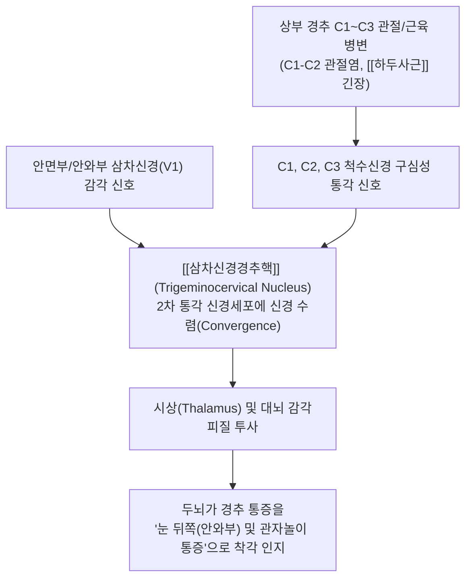

---
aliases:
  - 경추성 두통
  - Cervicogenic headache
  - CEH
tags:
  - 질환
  - 신경계질환
  - 두통
  - 상부경추
  - 삼차신경경추핵
---
# 🧠 [[경추성 두통]] (Cervicogenic Headache, CEH)

> **핵심 요약 (Key Summary)**:
> 상부 경추(C1~C3)의 골관절·추간판·근막 병변으로 인해 발생하는 대표적인 이차성 두통입니다.
> [[삼차신경경추핵]](Trigeminocervical nucleus)에서 C1-C3 감각신경과 [[삼차신경]] 안신경 분지가 수렴(Convergence)되어 안와 및 관자놀이로 연관통을 방사합니다.
> 목 움직임에 의해 두통이 유발되며 상부 경추 후관절 및 후두하근 이완 추나요법과 풍지·천주혈 [[오공약침]] 치료의 핵심 적응증입니다.

---

## 📌 목차
1. [질환 개요 및 역학 (Overview)](#1-질환-개요-및-역학-overview)
2. [병태생리: 삼차신경경추핵 수렴 기전 (Pathophysiology)](#2-병태생리-삼차신경경추핵-수렴-기전-pathophysiology)
3. [해부학적 통증 유발 원인 구조물](#3-해부학적-통증-유발-원인-구조물)
4. [임상 증상 및 감별 진단 (편두통 vs 긴장형두통)](#4-임상-증상-및-감별-진단-편두통-vs-긴장형두통)
5. [이학적 검사 및 진단 랜드마크](#5-이학적-검사-및-진단-랜드마크)
6. [한의학적 통합 치료 프로토콜 (추나·약침·한약)](#6-한의학적-통합-치료-프로토콜-추나약침한약)
7. [출처 및 학술 참고 문헌 (References)](#7-출처-및-학술-참고-문헌-references)

---

## 1. 질환 개요 및 역학 (Overview)

* **정의**:
  * 경추 및 두경부 연부조직(근육, 인대, 후관절, 추간판, 경막)의 기계적·염증성 기능부전에서 기인하여 머리로 투사되는 **경추 기인성 이차성 두통(Secondary Headache)**.
* **유병률**:
  * 전체 만성 두통 환자의 약 15~20%, 경추 외상(편타성 손상, Whiplash) 후 만성 두통 환자의 50% 이상 차지.
  * 스마트폰 및 PC 장시간 사용으로 인한 일자목/거북목 환자군에서 급증.

---

## 2. 병태생리: 삼차신경경추핵 수렴 기전 (Pathophysiology)

* **삼차신경-경추 복합체(Trigeminocervical Complex, TCC)**:
  * 삼차신경 척수핵의 미측핵(Pars caudalis)은 상부 경추(C1~C3) 척수 후각(Dorsal horn)과 해부학적으로 단절 없이 연속되어 있습니다.
  * 상부 경추(C1-C3)에서 들어오는 유해 자극과 삼차신경 제1분지(V1, 안신경)의 유해 감각이 척수 후각의 동일한 2차 감각신경세포에서 합류(Convergence)됩니다.
  * 뇌는 후두부의 통증 자극을 안구 후방, 안와상부, 관자놀이, 전두부의 통증으로 투사하여 환자는 "눈골이 빠질 것 같다", "이마와 관자놀이가 쑤신다"고 호소합니다.

---

## 3. 해부학적 통증 유발 원인 구조물

1. **환축관절 (C1-C2 Lateral Atlantoaxial Joint)**:
   * 회전 운동 시 마찰과 퇴행성 관절염으로 C2 신경근 압박.
2. **C2-C3 후관절 (Facet Joint)**:
   * 제3후두신경(Third occipital nerve, TON)이 후관절낭을 감싸며 주행하여 후두-측두 방산통 유발 (제3후두신경 두통).
3. :
   * : 하연을 지나는 [[대후두신경]] 포착.
   * : 척수 경막과 연결된 근경막 브릿지(Myodural bridge)를 당겨 두개내압 감각 이상 초래.
4. **표재성 경부 근육**:
   * [[두반극근]], [[두판상근]], [[승모근]] 상부 섬유의 발통점(TP)에 의한 연관통.

---

## 4. 임상 증상 및 감별 진단 (편두통 vs 긴장형두통)

| 감별 항목 | [[경추성 두통]] (CEH) | [[편두통]] (Migraine) | 긴장형 두통 (TTH) |
| :--- | :--- | :--- | :--- |
| **통증 편측성** | 거의 항상 편측성 고정 | 편측성 또는 교대성 | 주로 양측성 (모자 쓴 듯 조임) |
| **통증의 시발점** | 후두부/목덜미 $\rightarrow$ 안와·전두부 | 측두부/안와부에서 시작 | 후두부·전두부 전반 |
| **목 움직임 유발** | 목 회전/신전 시 뚜렷하게 유발 | 목 움직임과 무관 | 무관하거나 경미 |
| **동반 증상** | 목 가동범위 제한, 동측 어깨 통증 | 오심, 구토, 빛/소리 공포증, 전조증상 | 경미한 식욕부진 외 드묾 |
| **통증 양상** | 둔하고 쑤시며 묵직한 통증 | 박동성(욱신욱신) 통증 | 띠로 꽉 조이는 듯한 비박동성 통증 |

---

## 5. 이학적 검사 및 진단 랜드마크

* **경추 굴곡-회전 검사 (Flexion-Rotation Test, FRT)**:
  * 앙와위에서 경추를 최대로 굴곡(C2~C7 고정)시킨 상태에서 머리를 좌우로 회전.
  * 정상 회전각은 양측 각 44° 내외이나, C1-C2 병변 시 이환측 회전이 **32° 이하로 현저히 제한**되거나 통증 재현 (민감도·특이도 90% 이상).
* **상부 경추 관절낭 및 후두하근 압통 검사**:
  * C1 횡돌기, C2 극돌기, 후두하삼각 부위 압박 시 안와부로 뻗치는 방산통 재현 확인.

---

## 6. 한의학적 통합 치료 프로토콜 (추나·약침·한약)

* **추나요법 (Chuna Manual Therapy)**:
  * **C0-C1, C1-C2 관절가동화 추나**: 환축관절의 회전 변위 및 후두하 가동성 회복.
  * **후두하근막 이완술**: 손끝으로 후두골 기저부를 견인하며 근막 긴장 완화.
  * **경추 생리적 전만 회복 추나**: 거북목 교정을 위한 하부 경추 신전-흉추 가동화 병행.
* **약침 및 침도 치료**:
  * **표적 혈위**: 풍지(GB20), 천주(BL10), 완골(GB12), C2-C3 후관절 부위.
  * **약침 제제**: 대후두신경 포착 해소 및 관절낭 염증 완화를 위한 [[오공약침]](0.3~0.5ml) 또는 [[봉약침]].
* **한약 치료**:
  * **풍한습/기혈어체**: [[청상견통탕]], [[갈근탕]](경항강통 동반 시), [[소요산]](스트레스성 간울), [[천궁다조산]].

---

## 7. 출처 및 학술 참고 문헌 (References)
* Sjaastad O, Fredriksen TA. Cervicogenic headache: criteria, classification and epidemiology. *Clin Exp Rheumatol*. 2000;18(2 Suppl 19):S3-S6.
  * `[연구 요약]`: 경추성 두통의 국제적 진단 기준, 편측성 발현 특성 및 경추 유발 요인 규명.
* Bogduk N, Govind J. Cervicogenic headache: an assessment of the evidence on clinical diagnosis, invasive tests, and treatment. *Lancet Neurol*. 2009;8(10):959-968.
  * `[연구 요약]`: 삼차신경경추핵(TCC) 수렴 메커니즘과 상부 경추 후관절 및 후두신경 치료 중재 근거 분석.
