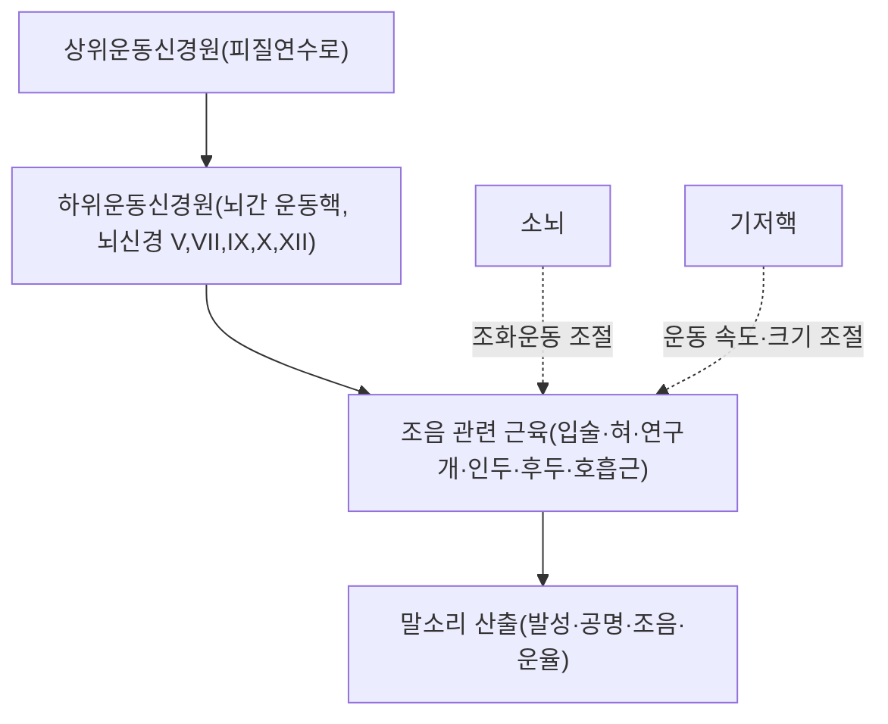

---
aliases:
  - Dysarthria
  - 構音障礙
  - 마비말장애
  - 조음장애
tags:
  - 질환
  - 신경계질환
  - 언어장애
---

# 🩺 구음 장애 (構音障礙, Dysarthria)

> **핵심 3줄 요약 (Key Summary)**:
> - 📍 정의 & 병태생리: 언어 자체(어휘·문법·이해)는 보존되어 있으나, 발성·조음에 관여하는 근육(입술, 혀, 연구개, 인두, 후두, 호흡근)의 신경학적 마비·약화·조화운동장애로 인해 말의 명료도가 떨어지는 운동성 언어장애. 실어증(aphasia, 언어 자체의 장애)과는 구분되는 개념.
> - 🚩 임상적 분류: 병소에 따라 이완성(하위운동신경원 손상, 예: 연수마비), 경직성(상위운동신경원 손상, 예: 양측 피질연수로 병변), 실조성(소뇌 병변), 운동감소성/운동과다성(기저핵 병변, 파킨슨병 등), 혼합성으로 분류.
> - 🛠️ 핵심 평가 & 관리: 임상적으로 말의 속도·강도·억양·명료도를 평가하며, 원인 감별을 위해 뇌졸중·근위축성측삭경화증(ALS)·파킨슨병·중증근무력증 등 기저 신경학적 질환을 반드시 확인. 언어치료(구음훈련)가 핵심 재활 수단.
> - ⚠️ 응급 레드플래그: 급성으로 발생한 구음 장애는 특히 편측 위약·안면마비·연하곤란을 동반할 경우 급성 뇌졸중을 강력히 시사하므로 즉시 응급 평가(FAST 프로토콜)가 필요.

---

## 📌 목차
1. [정의 및 실어증과의 감별](#1-정의-및-실어증과의-감별)
2. [해부생리학적 기전](#2-해부생리학적-기전)
3. [병소별 분류](#3-병소별-분류)
4. [원인 질환](#4-원인-질환)
5. [평가 및 관리](#5-평가-및-관리)
6. [한의학적 연계](#6-한의학적-연계)
7. [출처 및 학술 참고 문헌 (References)](#7-출처-및-학술-참고-문헌-references)

---

## 1. 정의 및 실어증과의 감별

구음 장애(Dysarthria)는 발성·조음에 관여하는 근육의 신경근육학적 이상으로 인해 말소리 산출이 어려워지는 운동성 언어장애입니다. 언어의 이해·표현(어휘, 문법)은 정상이라는 점에서, 대뇌 언어중추 손상으로 언어 자체(듣기·말하기·읽기·쓰기)에 장애가 생기는 실어증(Aphasia)과는 근본적으로 다른 개념입니다.

---

## 2. 해부생리학적 기전

정상적인 말소리 산출은 호흡(발성 에너지), 발성(성대), 공명(연구개), 조음(입술·혀), 운율(속도·억양)이 통합적으로 조절되어야 하며, 이 경로의 어느 단계든 손상되면 구음 장애가 발생할 수 있습니다.

---

## 3. 병소별 분류

| 유형 | 병소 | 특징적 말소리 |
| :--- | :--- | :--- |
| 이완성(Flaccid) | 하위운동신경원(뇌신경핵·말초신경, 예: 연수마비, 중증근무력증) | 콧소리(과다비성), 기식성 음성, 근육 위축 동반 가능 |
| 경직성(Spastic) | 상위운동신경원(양측 피질연수로, 예: 가성연수마비) | 긴장되고 쥐어짜는 듯한 음성, 느린 말속도 |
| 실조성(Ataxic) | 소뇌 | 불규칙한 강세, 스캐닝 음성(음절이 끊어지는 느낌) |
| 운동감소성(Hypokinetic) | 기저핵(파킨슨병) | 작고 단조로운 음성, 빠르고 불분명한 말속도 |
| 운동과다성(Hyperkinetic) | 기저핵(무도병, 근긴장이상 등) | 불규칙하고 갑작스러운 음량·음도 변화 |
| 혼합성(Mixed) | 다발성 병소(예: ALS, 다발성경화증) | 여러 유형의 특징이 혼재 |

---

## 4. 원인 질환

* **급성**: 뇌졸중(특히 뇌간·소뇌 경색/출혈) — 급성 발생 시 응급 뇌졸중 감별이 최우선.
* **만성 진행성**: 근위축성측삭경화증(ALS), 파킨슨병, 다발성경화증, 다계통위축증 등 퇴행성 신경질환.
* **신경근육접합부 질환**: 중증근무력증(피로에 따라 증상이 변동하는 것이 특징).
* **기타**: 외상성 뇌손상, 뇌성마비, 특정 약물·알코올 중독.

---

## 5. 평가 및 관리

* **임상 평가**: 말의 속도, 강도, 음도, 공명, 명료도를 종합적으로 평가하며, 연하곤란·안면마비 등 동반 신경학적 징후를 함께 확인합니다.
* **감별진단**: 급성 발생 시 뇌영상(CT/MRI)으로 뇌졸중 등 구조적 병변을 신속히 배제해야 합니다.
* **언어치료(구음훈련)**: 조음 정확도 향상, 말속도 조절, 호흡·발성 훈련 등이 핵심 재활 수단입니다.
* **보완대체의사소통(AAC)**: 중증 구음 장애로 의사소통이 어려운 경우 그림판·음성출력기기 등을 활용합니다.

---

## 6. 한의학적 연계

한의학에서는 중풍(中風) 후유증으로서의 구음 장애를 어삽(語澁)·설강(舌强) 등으로 표현하며, 풍담조락(風痰阻絡)·기허혈어(氣虛血瘀) 등으로 변증하여 침구치료(염천혈·아문혈 등)와 거풍화담·보기활혈 치법의 한약을 병행하는 경우가 많습니다. 다만 급성 발생 시에는 반드시 응급 뇌졸중 감별이 선행되어야 하며, 한의 치료는 원인 질환의 표준 응급·재활 치료와 병행하는 보조적 관점에서 접근해야 합니다.

---

## 7. 출처 및 학술 참고 문헌 (References)

1. **StatPearls (NCBI Bookshelf)**. Dysarthria. [https://www.ncbi.nlm.nih.gov/books/NBK592453/](https://www.ncbi.nlm.nih.gov/books/NBK592453/)
   - **[요약]**: 구음 장애의 병소별 분류(이완성·경직성·실조성·운동감소성·운동과다성·혼합성), 원인 질환, 평가·관리 원칙을 정리한 임상 참고 자료.
2. **Duffy JR (Mayo Clinic)**. Disorders of communication: dysarthria. PMID: [23312647](https://pubmed.ncbi.nlm.nih.gov/23312647/)
   - **[요약]**: 구음 장애의 신경학적 분류 체계와 임상적 접근을 정리한 리뷰.
