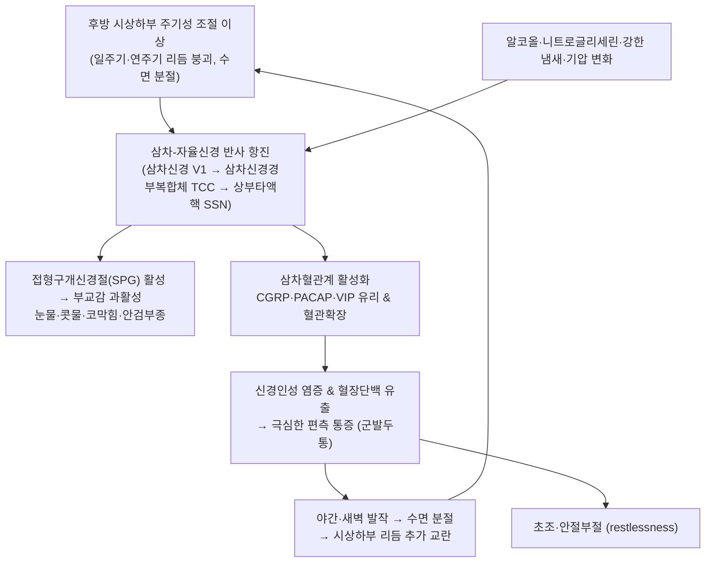

# 🩺 [[군발두통]] (Cluster Headache / 群發頭痛, ICD-10 G44.0 / KCD-8 G44.0)

> **핵심 3줄 요약 (Key Summary)**:
> - 📍 병소 부위 & 해부·병태생리: 원발성 **삼차자율신경두통(TAC)** 중 가장 흔한 유형으로, **후방 시상하부의 주기성 조절 이상**과 **삼차신경 제1지(V1) — 삼차신경경부복합체 — 상부타액핵 — 접형구개신경절(SPG)** 로 이어지는 **삼차-자율신경 반사(trigeminal-autonomic reflex)** 항진이 핵심 축이다. CGRP·PACAP·VIP 등 신경펩타이드 유리와 신경인성 염증이 통증을 증폭시킨다.
> - 🚩 전형적 임상 양상 & 3대 징후: ① 편측 **안와부·안와상부·측두부**의 극심한 통증이 **15~180분** 지속, ② 격일 1회~**하루 8회**의 발작성 군집(cluster period), ③ 동측 **두개자율신경증상**(결막충혈·눈물·코막힘·콧물·안검부종·동공축소·안검하수) + **초조·안절부절(restlessness)**. 야간·새벽 발작이 흔하다.
> - 🛠️ 핵심 감별 검사 & 한·양방 다각적 치료 전략: 진단은 **임상 진단(ICHD-3)** 이 원칙이며, 비전형 소견 시 [[뇌 MRI]], 뇌하수체 조영 MRI·MRA로 2차 원인 배제. 급성기 1차는 **100% 고유량 산소(12~15 L/min, 15~20분)** 와 **수마트립탄 6 mg 피하주사**, 예방은 **베라파밀**(ECG 감시) 등이며, 한의 치료(침·약침·추나·한약)는 **보조적 통합 치료**로 접근한다.
> - ⚠️ 응급 의뢰 레드플래그 & 악화 요인: 첫 발작·50세 이후 발병·지속적 Horner 증후군·뇌신경 마비·발작 양상 변화·발열/경부강직·체중감소·암 병력·외상 후 발병은 **속발성 두통**을 시사하므로 즉시 영상검사 의뢰. 알코올·니트로글리세린·강한 냄새·수면 분절이 대표적 악화 요인이며, **내경동맥 박리 미배제 상태의 경추 고속 회전 추나는 절대 금기**.

---

## 📌 목차
1. [질환 개요 & 해부학적 병태생리](#1-질환-개요--해부학적-병태생리)
2. [병태생리 메커니즘 & 생체역학적 악순환 네트워크](#2-병태생리-메커니즘--생체역학적-악순환-네트워크)
3. [임상 증상 & 이학적 검사(Physical Exam) 알고리즘](#3-임상-증상--이학적-검사physical-exam-알고리즘)
4. [감별 진단 매트릭스 (Differential Diagnosis)](#4-감별-진단-매트릭스-differential-diagnosis)
5. [한의 통합 치료 프로토콜 (침·약침·추나·한약)](#5-한의-통합-치료-프로토콜-침약침추나한약)
6. [재활 운동 & 생활습관 티칭 가이드](#6-재활-운동--생활습관-티칭-가이드)
7. [💡 사용자 진료실 핵심 필기 & 임상 노하우 (Melt-In 잔여 심화 집약)](#7--사용자-진료실-핵심-필기--임상-노하우-melt-in-잔여-심화-집약)
8. [출처 및 학술 참고 문헌 (References)](#8-출처-및-학술-참고-문헌-references)

---

## 1. 질환 개요 & 해부학적 병태생리

![[군발두통_1.jpg|540]]
> [그림 1: Cluster headache.png]

![[군발두통_2.jpg|540]]
> [그림 2: Ciliary ganglion.png]

* **질환 정의 및 분류**:
  * **정의**: 군발두통은 ICHD-3에서 **삼차자율신경두통(TAC, Trigeminal Autonomic Cephalalgias)** 군에 속하는 원발두통으로, 편측 안와부/안와상부/측두부에 극심한 통증이 **분 단위(15~180분)** 로 발작적으로 발생하고, 동측의 두개자율신경증상과 초조감을 동반하는 것이 특징이다. TAC 군에는 군발두통 외에 발작성 반두통(paroxysmal hemicrania), SUNCT, SUNA, 지속성 반두통(hemicrania continua)이 포함된다(PMID: 38568490, PMID: 36648786).
  * **진단 기준(ICHD-3 요지)**: ① 최소 5회 이상의 발작, ② 편측 안와부·안와상부·측두부 중 하나에 중등도~극심한 통증이 15~180분(치료 없을 때) 지속, ③ 동측 두개자율신경증상 **또는** 동측 초조·안절부절 중 최소 1개 동반, ④ 발작 빈도가 격일 1회~하루 8회, ⑤ 다른 진단으로 더 잘 설명되지 않음.
  * **아형 분류**: 
    * **삽화성 군발두통(Episodic)**: 3개월 이상의 기간 동안 1개월 이상 무통기(remission)가 존재.
    * **만성 군발두통(Chronic)**: 1년 이상 재발이 지속되며 무통기가 3개월 미만이거나 전혀 없음. 만성형은 치료 저항성이 상대적으로 높아 감별과 약물 조정이 더 중요하다(PMID: 36648786).
  * **역학적 특성**: 평생 유병률은 대략 **1,000명당 1명(약 0.1%)** 수준으로 보고되며, 원발두통 중에서는 비교적 드물다(PMID: 29493566). 전통적으로 **남성 우세(약 3:1 내외)** 로 알려졌으나 최근 코호트에서는 성비 차이가 감소하는 경향이 기술된다 — **개별 코호트의 정확한 성비 수치는 제공 문헌 범위 내에서 근거 미확인**. 호발 연령은 대개 **20~40대**이며, 흡연력·음주력이 있는 군에서 발병 연관성이 자주 보고된다. 직업군 특이성은 뚜렷하게 확립된 바 없다(근거 미확인).
  * **위험 요인 및 유발 인자**: 알코올(특히 군발기 중), 니트로글리세린 등 혈관확장제, 강한 냄새(페인트·담배 연기·향수), 수면 분절 및 야간 각성, 고도 변화, 기상·기압 변화 등이 대표적이다. 이는 통상 **발작 시작 후 수십 분 내** 유발되는 패턴으로, 삼차신경 자극 및 시상하부 리듬 교란과 연결된다(PMID: 29493566).

* **관련 해부학적 구조물**:
  * **두개골 및 안와 구조**: [[안와(orbit)]], [[접형골]], [[전두동·상악동]] 등 부비동 구조물은 2차성 두통(부비동염·치성 병변) 감별에서 반드시 확인해야 하는 부위다.
  * **신경 및 신경절**: 
    * **[[삼차신경]](CN V)**: 제1지(V1, 안구분지)와 제2지(V2, 상악분지)의 분포가 통증의 주 무대이며, [[안와상신경]](supraorbital n.), [[활차상신경]](supratrochlear n.), [[전두신경]]이 안와주위·이마 통증을 담당한다.
    * **[[접형구개신경절]](Sphenopalatine Ganglion, SPG)**: 상부타액핵(superior salivatory nucleus)에서 기원한 부교감 신경절로, 눈물샘·비점막 분비 및 안와·비강 혈관 확장을 매개한다. 군발두통의 자율신경 증상 및 신경조절 치료(SPG 자극)의 핵심 타겟이다(PMID: 29493566, PMID: 38568490).
    * **[[상부타액핵]] → [[경추상부교감신경절]]**: 교감신경 기능 저하가 동측 **동공축소(miosis)·안검하수(ptosis)** 를 유발한다. 발작 중에만 일시적으로 나타나면 양성이며, **지속성 Horner 증후군은 2차성 원인을 강하게 시사**한다.
    * **[[대후두신경]](Greater occipital n.)·[[소후두신경]]**: 후두부 통증 연관 및 후두신경 차단(GON block) 시술 부위.
    * **[[삼차신경경부복합체]](TCC)**: 삼차신경과 상위 경추신경(C1–C3)이 교차하는 이차 신경원 부위로, 경추 상부 기능 이상이 두통을 악화시킬 수 있는 해부학적 연결고리다.
    * **[[후방 시상하부]](posterior hypothalamus)**: 일주기·연주기 리듬, 자율신경 조절의 상위 중추로, 기능적 영상에서 발작 시 활성화가 반복 보고된다(PMID: 29493566).
  * **혈관**: [[내경동맥]], [[중대뇌동맥]], [[천막동맥]] 및 해면정맥동(cavernous sinus) 주변 구조. **해면정맥동·내경동맥 병변은 군발두통양 2차 두통의 대표적 원인**이므로, 비전형 양상에서는 혈관 평가가 필수다.

---

## 2. 병태생리 메커니즘 & 생체역학적 악순환 네트워크

### 1) 해부학적·신경생물학적 기전
* **시상하부 중심설**: 군발두통의 가장 독특한 특징은 **시계처럼 규칙적인 발작 주기**다. 야간(특히 REM 수면 인접 시점) 발작, 계절성 군집, 코르티솔·멜라토닌 등 신경내분비 리듬의 변동이 관찰되며, 기능적 영상에서 **후방 시상하부의 발작 시 활성화**가 반복 확인되었다(PMID: 29493566). 즉, 시상하부는 "발작을 일으키는 상위 스위치"로 이해된다.
* **삼차-자율신경 반사(trigeminal-autonomic reflex)**: V1 자극 → 삼차신경경부복합체(TCC) → 상부타액핵(SSN) → 접형구개신경절(SPG)·기타 부교감 신경절로 이어지는 반사 회로가 항진되면 **동측 눈물·콧물·코막힘·안검부종·이마 발한**이 나타난다. 동시에 경추상부교감신경 기능 저하로 **miosis·ptosis**가 동반된다(PMID: 38568490).
* **신경펩타이드와 신경인성 염증**: 삼차신경 말단에서 **CGRP(calcitonin gene-related peptide)** 가 유리되어 혈관 확장과 혈장단백 유출을 일으키고, 부교감계에서는 **VIP·PACAP**가 분비된다. CGRP는 편두통 치료제(항-CGRP 단클론항체)가 군발두통에서도 연구되는 근거가 되며, PACAP는 시상하부-삼차 축을 잇는 후보 물질로 논의된다(PMID: 29493566, PMID: 36648786). **개별 펩타이드의 정량적 기여도는 제공 문헌만으로는 근거 미확인**.
* **유전적 소인**: 가족성 발생이 일부 보고되며 특정 유전자(HCRTR2, ADCYAP1R1 등) 연관성이 제기되었으나 재현성 논란이 있어, **특정 유전자-표현형의 확정적 인과관계는 근거 미확인**으로 정리한다. 임상적으로는 **가족력 청취**가 문진 항목에 포함된다.
* **반측성(hemiplegic) 변이**: 2025년 리뷰에서는 **편측 운동마비를 동반한 군발두통(hemiplegic cluster headache)** 이라는 드문 변이가 정리되었다. 마비가 동반된 경우 편마비성 편두통, 뇌경색, 뇌종양 등과의 감별이 필수이며, 영상검사가 우선된다(PMID: 41307608).

### 2) 악순환 연쇄 (Vicious Cycle)
* **수면 분절 → 시상하부 리듬 악화 → 야간 발작 재발 → 다시 수면 분절**의 자기강화 고리가 핵심이다.
* **교감신경 기능저하 + 부교감 과활성**은 각각 동공·안검 증상과 분비·충혈 증상을 만들며, 통증 강도가 클수록 자율신경 증상도 뚜렷해지는 양상이 관찰된다.
* **경추 상부 기능 제한**이 있는 환자에서는 TCC 수준의 반복 자극이 발작 역치를 낮출 가능성이 있다. 다만 이 경추 인자가 **원발성 군발두통의 원인**이라는 주장은 근거가 약하며, 임상적으로는 **주변 요인·악화 요인**으로 다루는 것이 타당하다(근거 미확인).

---

## 3. 임상 증상 & 이학적 검사(Physical Exam) 알고리즘

### 1) 주소증 및 신경학적 증상
* **통증(핵심 주소증)**: 
  * **부위**: 편측 **안와부(orbital), 안와상부(supraorbital), 측두부(temporal)** 가 전형적이며, 이마·볼·상악·후두부로 확산될 수 있다.
  * **강도**: 중등도~**극심(very severe)**. 환자들은 "눈이 빠질 듯하다", "쇠꼬챙이로 찌른다"고 표현한다.
  * **지속시간**: 치료 없이 **15~180분**. 이 **'분 단위' 특성**이 초 단위의 SUNCT/SUNA, 시간 단위의 편두통과의 결정적 감별점이다(PMID: 38568490).
  * **빈도**: **격일 1회 ~ 하루 8회**. 군발기(cluster period) 동안 매일 같은 시간대(야간·새벽)에 반복되는 주기성이 특징적이다.
* **두개자율신경 증상(동측)**: 결막충혈, 눈물흘림, 코막힘, 콧물, 안검부종, 이마·얼굴 발한, 안면 홍조, 귀 충만감, **동공축소(miosis)**, **안검하수(ptosis)**.
* **행동 양상**: **초조·안절부절(restlessness)** 로 발작 중 가만히 있지 못하고 걷거나 몸을 흔든다. 이는 통증을 줄이려 움직임을 멈추고 어두운 방에 눕는 **편두통 환자와의 중요한 감별점**이다.
* **동반 증상**: 구역·구토는 상대적으로 드물고, 광공포·음공포는 일부에서 동반될 수 있다. 야간 발작으로 인한 수면 부족, 집중력 저하, 우울·불안이 이차적으로 흔하다.
* **주의할 비전형 소견**: 지속성 동공축소·안검하수, 뇌신경 마비, 마비(hemiplegia), 진행성 악화, 발작 부위의 고정적인 변화는 **속발성(2차성) 원인**을 시사한다(PMID: 38568490, PMID: 41307608).

### 2) 필수 이학적 검사법 (Physical Examination)
* [[신경학적 검사]](Neurologic exam): 뇌신경(I~XII), 운동·감각·반사, 소뇌 기능을 기본으로 확인. **초점 신경학적 결손이 있으면 진단이 흔들리므로 영상검사 우선**.
* [[Horner 증후군 검사]]: 동공축소·안검하수·안구함몰·발한 저하를 평가. **발작 중 일시적 양성 vs 지속적 양성**을 반드시 구분하여 기록한다.
* [[삼차신경 검사]]: V1·V2·V3 분포의 감각 역치 비교, 각막반사, 저작근력. 삼차신경통 감별에 필요하다.
* [[각막반사]] 및 [[안저검사]]: 두개내압 상승, 시신경유두부종 여부 확인(2차성 두통 감별).
* [[경추 상부 가동성 검사]]: 후두하근 단축, C1–C2 회전 제한, 상부경추 압통을 확인. 단, **고속 회전 검사는 혈관 병변 배제 전에는 신중**해야 한다.
* [[뇌 MRI / MRA]] 및 **뇌하수체 프로토콜 MRI**: 비전형 양상, 50세 이후 발병, 지속성 자율신경 증상, 치료 저항성 만성형에서 시행. 시상하부-뇌하수체 축 병변과 해면정맥동·내경동맥 병변을 확인한다(PMID: 36648786).
* **감별을 위한 선별 검사**: 필요 시 부비동 평가(CT), 치과적 평가, 혈액검사(염증 지표), 수면다원검사(폐쇄성 수면무호흡 의심 시).

---

## 4. 감별 진단 매트릭스 (Differential Diagnosis)

| 감별 질환 | 호발 병소 및 원인 | 주소증 차이점 | 특이적 이학적 검사 소견 |
| :--- | :--- | :--- | :--- |
| [[군발두통]] (본 질환) | 후방 시상하부 + 삼차-자율신경 반사(V1, SPG, TCC) | 편측 안와부·측두부 극심통 **15~180분**, 격일~1일 8회, 동측 자율신경증상 + **초조** | 발작 중 일시적 miosis/ptosis, 고유량 산소·수마트립탄에 반응, 인도메타신 무반응 |
| [[발작성 반두통]](Paroxysmal Hemicrania) | 삼차-자율신경계 (병태 기전은 군발두통과 유사 계열) | 편측 극심통 **2~30분**, **하루 5회 이상**의 잦은 발작 | **인도메타신에 극적·절대적 반응**(진단적 시험), 산소 반응은 상대적으로 떨어짐 |
| [[SUNCT / SUNA]] | 삼차-자율신경계, V1 중심 | **1~600초**의 초 단위 극단적 단발통, 하루 3~200회 | 인도메타신 무반응, 라모트리진 등 항경련제 반응 보고. SUNA는 결막충혈/눈물 중 **하나만** 동반 |
| [[지속성 반두통]](Hemicrania Continua) | 삼차-자율신경계 | **지속성 편측** 통증에 발작성 악화 삽입 | 인도메타신 극적 반응 |
| [[편두통]](Migraine) | 삼차혈관계, CGRP 중심 (시상하부 연관) | **4~72시간** 지속, 박동성, 구역·구토·광/음공포, 움직임 회피 | 자율신경 증상은 경미 또는 양측성, 발작 중 **가만히 누움**(초조 없음) |
| [[삼차신경통]](Trigeminal Neuralgia) | V2·V3, 신경 압박(혈관 등) | **수초~2분** 전기충격양 통증, 세안·양치 등 유발점 | 자율신경 증상 없음, carbamazepine 반응, 삼차신경 압박 병변 감별 필요 |
| [[속발성 군발두통양 두통]] | **뇌하수체 선종**, 해면정맥동 병변, 내경동맥 박리/동맥류, 부비동·치성 병변, 종양, 수막염 | 발작 양상이 비전형적(진행성, 지속성 자율신경 증상, 신경학적 결손 동반) | 뇌신경 마비, 지속성 Horner, 시야결손, 발열·경부강직 등 **레드플래그 양성** → 영상검사 필수 |
| [[편마비성 편두통]] | 피질 확산성 억제 등 (편마비성 군발두통과 감별 필요) | 마비가 **두통에 앞서거나 동반** | 운동 결손의 시간적 진행 양상, 영상검사로 뇌경색·병변 배제(PMID: 41307608) |

> **임상 포인트**: TAC 군의 감별은 **① 발작 지속시간(초–분–시간), ② 하루 빈도, ③ 인도메타신 반응성** 세 축으로 정리하면 빠르게 좁혀진다(PMID: 38568490, PMID: 34003158).

---

## 5. 한의 통합 치료 프로토콜 (침·약침·추나·한약)

> ⚠️ **근거 수준 고지**: 군발두통은 **신경생물학적 질환**으로, 급성기에는 100% 고유량 산소 및 트립탄 계열이 표준 1차 치료다. 한의 치료(침·약침·추나·한약)는 **표준 치료를 대체하는 것이 아니라 보조·통합 치료**로 접근해야 하며, 군발두통 자체에 대한 침·약침·한약의 무작위대조시험 근거는 **제공 문헌 범위 내에서 근거 미확인**이다. 아래는 변증 논리와 임상적 적용 원칙에 기반한 정리다.

* **침구 치료 (Acupuncture)**:
  * **발작기**: 강자극보다 **안와주위·전두부의 淺刺·피내 자침**으로 자율신경 반사를 조절하는 접근이 환자 수용성이 높다. 삼차신경 V1 분포의 [[찬죽]](攢竹), [[어요]](魚腰), [[사죽공]](絲竹空), [[태양]](太陽), [[양백]](陽白), [[두유]](頭維), [[인당]]을 배혈하고, 원위취혈로 [[합곡]](LI4), [[태충]](LR3), [[족임읍]](GB41), [[양백]]·[[풍지]](GB20), [[완골]](GB12), [[천주]](BL10), [[솔곡]](GB8)을 병용한다.
  * **발작간기(예방적)**: [[풍지]]–[[천주]]–[[완골]] 라인의 후두하근·상부경추 주변 이완, [[족삼리]](ST36), [[삼음교]](SP6), [[태계]](KI3)로 기혈 보충.
  * **전침 세팅**: 2 Hz 중심의 저주파(내재성 아편계 기전) 또는 2/100 Hz 교대 자극을 20~30분 적용하는 방식이 일반적이다. **군발두통 특이 최적 주파수는 근거 미확인**.
* **약침 치료 (Pharmacopuncture)**:
  * **후두신경 주행**: [[풍지]]–[[완골]]–[[천주]] 라인에 0.3~0.5 mL 수준으로 소량 주입하여 상부경추 근긴장과 후두신경 자극을 완화한다. **주사 전 흡인(aspiration)으로 혈관 내 주입을 반드시 배제**한다.
  * **안와주위**: [[찬죽]]–[[태양]]–[[사죽공]] 라인은 피내 수준으로 0.05~0.1 mL씩 극소량 주입하여 자극을 최소화한다. 안구 천자는 절대 금기.
  * **변증별 약침**: 어혈 변증에는 활혈거어 계열, 기혈허 변증에는 보익 계열 약침을 고려한다. **봉약침은 아나필락시스 위험이 있으므로 과거력 확인 후 신중히 적용**한다.
* **추나 치료 (Chuna Manipulation)**:
  * 적용: 후두하근·상부 승모근 이완(JS 계열 근막 이완 수기), C1–C2 저속 관절가동술, 흉추 신전 가동으로 두개-경추 정렬 개선.
  * **금기**: **내경동맥 박리·해면정맥동 병변이 배제되지 않은 상태에서의 경추 고속 회전 교정 수기는 절대 금지**한다. 신경학적 결손, 지속성 Horner, 외상 후 발병 환자에서 특히 엄격히 적용한다.
* **한약 치료 (Herbal Medicine)** — 변증 기반:

| 변증 | 주요 소견 | 대표 처방(예) | 치료 원칙 |
| :--- | :--- | :--- | :--- |
| 간양상항(肝陽上亢) | 편측 격렬한 박동성 통증, 안면 홍조, 이명, 성격 조급, 설홍 태황 | 천마구등음, 청간탕 계열 | 평간잠양(平肝潛陽) |
| 담음상요(痰飮上擾) | 두중감, 어지럼, 구역, 설담태니 | 반하백출천마탕 | 화담거습(化痰祛濕) |
| 어혈(瘀血) | 아픈 부위 고정, 야간 악화, 오래된 만성형 | 통규활혈탕, 천궁다조산 계열 | 활혈거어(活血祛瘀) |
| 기혈허(氣血虛) | 만성 피로, 발작 후 탈력, 설담 | 보중익기탕, 팔진탕 계열 | 보기양혈(補氣養血) |

> 처방 선택은 변증에 따르며, **군발두통에 대한 특정 처방의 유효성을 입증한 임상시험은 제공 문헌에 포함되어 있지 않다(근거 미확인)**. 양방 예방약(베라파밀 등) 복용 중인 환자는 약물 상호작용(특히 QT 연장, 간효소 유도)을 고려하여 병용 여부를 판단해야 한다.

---

## 6. 재활 운동 & 생활습관 티칭 가이드

* **수면 리듬 안정화 (최우선)**:
  * 취침·기상 시간을 **매일 동일하게** 유지한다. 야간 발작이 잦은 환자는 수면 분절이 곧 발작 악화 요인이므로, 낮잠은 짧고 규칙적으로 제한한다.
  * 코골이·주간 졸림·목격된 무호흡이 있으면 **폐쇄성 수면무호흡(OSA)** 선별 검사를 의뢰한다.
* **유발 인자 회피 (절대적)**:
  * **군발기에는 금주**한다. 니트로글리세린 등 혈관확장제 노출을 피하고, 페인트·담배 연기·강한 향수 등 자극적 냄새를 차단한다.
  * 흡연은 중단을 권고한다(발병 및 악화 연관성이 반복 기술됨, PMID: 29493566).
* **이완 및 스트레칭 (Stretching)**:
  * 후두하근·상부 승모근·흉쇄유돌근에 대한 **정적 스트레칭 30초 × 3회**, 하루 2세트.
  * 흉추 신전 스트레칭과 견갑 안정화로 두개-경추 정렬 부담을 줄인다.
* **강화 및 안정화 운동 (Strengthening)**:
  * 심부 경추 굴곡근(턱 당기기, chin tuck) 10회 × 3세트, 견갑 후인근 강화를 주 3~5회 시행. 단, **발작기에는 강도 높은 운동을 피하고 통증 조절 후 단계적으로 재개**한다.
  * 규칙적 유산소 운동(빠르게 걷기 등)은 리듬 안정과 스트레스 조절에 도움이 된다.
* **신경 활주 운동 (Neurodynamics)**:
  * 삼차신경 및 상부경추 신경계의 과긴장 완화 목적의 부드러운 신경 활주는 **발작간기에만** 적용하고, 발작 유발 시 즉시 중단한다(군발두통에서의 특이적 신경 활주 프로토콜은 근거 미확인).
* **일상생활 자세 티칭 (Ergonomics)**:
  * 화면 상단을 눈높이에 맞추고, 장시간 고개 숙임 작업을 30분 단위로 휴식한다.
  * 베개 높이를 조절하여 상부경추 과신전을 피한다.
* **가정용 산소 사용 교육**:
  * 100% 산소를 **12~15 L/min로 15~20분** 흡입하는 프로토콜을 숙지시키고, **발작 시작 후 가능한 한 이른 시점(수 분 내)** 에 사용하도록 교육한다. 비재호흡 마스크(non-rebreather mask) 사용을 권장한다.
* **두통 일지 작성**: 발작 시각, 지속시간, 유발 요인, 동반 자율신경 증상, 사용한 급성기 치료 및 반응을 기록하면 예방 치료 조정에 직접 도움이 된다.

---

## 7. 💡 사용자 진료실 핵심 필기 & 임상 노하우 (Melt-In 잔여 심화 집약)

> [!IMPORTANT]
> 아래는 상부 1~6번 섹션에 이미 녹여낸 기본 개념(정의·해부·증상·감별·치료 원칙)을 **중복 나열하지 않고**, 진료실에서 즉시 쓰이는 **고유 실전 노하우·문진 스크립트·치료 순서**만 선별하여 집약한 것이다.

* **상부 섹션에 미처 다 담지 못한 고유 임상 관찰**:
  * 군발두통 환자는 "머리가 아프다"고 하지 않고 **"눈 뒤가 터질 것 같다"** 고 표현하는 경우가 많다. **통증 위치를 손가락으로 정확히 짚게 하면 안와부 한 점**을 가리키는 경우가 전형적이다.
  * 발작 강도가 최고조에 이르는 시간이 매우 짧아, 환자가 내원했을 때는 이미 발작이 끝나 있는 경우가 흔하다. 따라서 **초진에서 발작을 직접 관찰하지 못하면 "발작 중 촬영한 동영상"을 요청**하는 것이 자율신경 증상 확인에 효과적이다.
  * 야간 발작형과 주간 발작형은 예방약 반응 및 생활 교정 포인트가 달라, **발작 시각대를 반드시 기록**하게 한다.

* **진료실 실전 감별 & 치료 노하우**:
  1. **실전 문진 체크리스트 (5문항 요약)**:
     * ① "통증이 **한쪽 눈 주위**에 집중되나요? 몇 **분** 지속되나요?" → 초/분/시간 단위 확인이 감별의 출발점.
     * ② "발작 때 **눈물·콧물·코막힘·눈꺼풀 처짐**이 같은 쪽에 나타나나요?"
     * ③ "발작 중 **가만히 누워 계시나요, 아니면 돌아다니시나요?**" → 돌아다니면 TAC 쪽으로 무게.
     * ④ "**술**을 마시면 30분~1시간 뒤에 발작이 오나요?" / "**니트로글리세린** 패치·설하정 사용 후 발작이 있었나요?"
     * ⑤ "**산소**를 마시면 15분 안에 사라지나요? **수마트립탄**이 듣나요?" → 반응성 자체가 진단적 단서.
     * 추가 확인: 발병 연령(50세 이후면 2차성 의심), 가족력, 흡연력, 코골이/주간졸림, 체중 변화, 암 병력, 최근 외상.
  2. **감별 직관 3초 룰**:
     * **"분 단위 + 동측 자율신경 + 초조"** → 군발두통.
     * **"초 단위 + 찌르는 통증"** → SUNCT/SUNA.
     * **"인도메타신 먹으면 극적으로 사라진다"** → 발작성 반두통 / 지속성 반두통.
     * **"지속되는 동공축소·안검하수"** → 즉시 영상검사. 절대 원발성으로 단정하지 않는다.
  3. **치료 순서 및 손맛 노하우**:
     * **1단계(급성기)**: 100% 고유량 산소 → 수마트립탄 6 mg SC(심혈관 금기·고령·조절 안 된 고혈압 확인) → 반응 불충분 시 전문과 의뢰. 한방 시술은 **발작이 가라앉은 뒤** 시행하는 것이 안전하다.
     * **2단계(발작간기 한방 보조)**: ① 후두하근·상부경추 이완(추나 JS) → ② [[풍지]]·[[완골]]·[[천주]] 부위 약침 소량 → ③ [[찬죽]]·[[태양]]·[[사죽공]] 피내 자침 → ④ 변증 한약. **자극량은 "약하게, 짧게, 자주"** 를 원칙으로 한다(강자극은 오히려 발작을 유발할 수 있다는 경험적 판단 — 근거 미확인).
     * **3단계(예방)**: 양방 예방약(베라파밀 등, ECG 감시)과 생활 교정을 병행하며, 한약 병용 시 **QT 연장·간효소 상호작용**을 반드시 확인한다.
  4. **환자 티칭 스크립트(그대로 읽어도 되는 문장)**:
     * "이 두통은 뇌혈관이 막힌 병이 아니라, **뇌의 시계(시상하부)와 삼차신경이 함께 폭주하는 질환**입니다. 그래서 발작이 **정해진 시간에 반복**되는 게 특징입니다."
     * "**산소가 가장 빠른 응급약**입니다. 발작이 시작된 뒤 5분 안에 12~15 L로 15~20분 마시도록 집에 산소를 준비하세요."
     * "**군발기에는 술을 끊는 것이 약보다 중요**합니다. 담배 연기, 페인트 냄새, 향수도 방아쇠가 됩니다."
     * "발작이 오면 **참지 말고 바로 기록**하세요. 언제, 몇 분, 어느 쪽 눈이었는지가 다음 치료를 결정합니다."
  5. **절대 금기·주의 리마인더**:
     * 내경동맥 박리·해면정맥동 병변·두개내 병변이 배제되지 않은 상태에서의 **경추 고속 회전 추나 금기**.
     * 안와 내 약침·심자(深刺) 금기.
     * 봉약침 아나필락시스 과거력이 있으면 사용 금지.
     * 임신·수유 중에는 베라파밀·수마트립탄 등 약물 사용을 반드시 전문과와 상의하도록 안내.

---

## 8. 출처 및 학술 참고 문헌 (References)

1. **May A, Schwedt TJ (2018)**. *Cluster headache*. **Nat Rev Dis Primers**. PMID: 29493566
   - **[연구 요약]**: 군발두통의 정의, 역학, 시상하부 중심 병태생리, 삼차-자율신경 반사, CGRP 등 신경펩타이드 기전, 진단 기준 및 급성기·예방 치료 전략을 총괄한 대표 리뷰. 본 노트의 병태생리 및 역학 기술의 주 근거.
2. **Burish M (2024)**. *Cluster Headache, SUNCT, and SUNA*. **Continuum (Minneap Minn)**. PMID: 38568490
   - **[연구 요약]**: TAC 군(군발두통, SUNCT, SUNA)의 감별 진단과 임상 특징을 정리. 발작 지속시간·빈도·자율신경 증상 패턴에 따른 감별표 구성의 근거. *(제공 목록에 동일 문헌이 중복 기재되어 있어 1회로 통합)*
3. **Cheema S, Matharu M (2021)**. *Cluster Headache: What's New?* **Neurol India**. PMID: 34003158
   - **[연구 요약]**: 군발두통의 최신 병태생리 이해와 치료(신경조절, 항-CGRP 치료 등) 업데이트를 다룬 리뷰. 감별 및 치료 최신 동향 기술에 참조.
4. **Riso IL, Peres MFP (2025)**. *Hemiplegic Cluster Headache*. **Curr Pain Headache Rep**. PMID: 41307608
   - **[연구 요약]**: 운동마비를 동반한 드문 군발두통 변이를 정리. 편마비 동반 시 뇌경색·편마비성 편두통 등과의 감별 및 영상검사 필요성의 근거.
5. **Diener HC, Tassorelli C (2023)**. *Management of Trigeminal Autonomic Cephalalgias Including Chronic Cluster: A Review*. **JAMA Neurol**. PMID: 36648786
   - **[연구 요약]**: 만성 군발두통을 포함한 TAC 군의 치료 전략(급성기 치료, 예방 치료, 신경조절, 난치성 관리)을 정리한 리뷰. 만성형 치료 저항성 및 예방약 운용 기술의 근거.

> **정리 메모**: 본 노트는 제공된 PubMed 문헌(PMID: 29493566, 38568490, 34003158, 41307608, 36648786)만을 인용하였다. 한의 치료(침·약침·추나·한약) 파트는 전통적 변증 논리와 임상 적용 원칙을 정리한 것으로, 해당 중재의 군발두통 특이적 유효성·최적 용량·빈도는 **제공 문헌 범위 내 근거 미확인**이며, 표준 양방 치료를 대체하지 않는다.