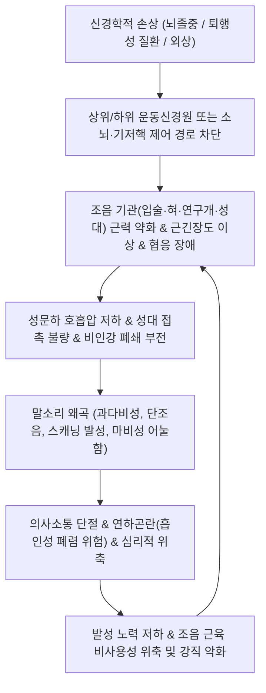

# 🩺 [[구음 장애]] (Dysarthria / 構音障礙, R47.1)

> **핵심 3줄 요약 (Key Summary)**:
> - 📍 **병소 부위 & 해부·병태생리**: 대뇌 피질연수로([[피질연수로]]), 기저핵, 소뇌, 뇌간 운동핵 및 뇌신경(CN V, VII, IX, X, XII) 등 조음 운동 제어 경로의 손상으로 입술·혀·연구개·인후두·호흡근의 운동 조절이 마비·약화·실조되어 말소리 산출이 왜곡되는 **운동성 구어장애(Motor Speech Disorder)**.
> - 🚩 **전형적 임상 양상 & 3대 징후**: 언어의 이해·어휘·문법 체계는 완벽히 보존되어 있으나 발음이 뭉개지는 **말소리 명료도 저하(Slurred speech)**, 병소에 따른 특징적 음성 왜곡(이완성 과다비성, 경직성 쥐어짜는 음성, 실조성 스캐닝 음성), [[연하장애]](Dysphagia) 및 안면마비 동반.
> - 🛠️ **핵심 감별 검사 & 한·양방 다각적 치료 전략**: 언어 자체의 중추 결손인 [[실어증]](Aphasia)과의 임상적 감별, 개규이언(開竅利言)을 목표로 하는 [[염천]](CV23)·[[아문]](GV15)·[[통리]](HT5) 심자 침구 및 설근 전침, 6자결(六字訣) 발성·조음 재활 훈련, 풍담조락·기허혈어 변증 한약([[보양환오탕]], [[도담탕]]).
> - ⚠️ **응급 의뢰 레드플래그 & 악화 요인**: 급성으로 갑자기 발생한 구음 장애는 편측 상하지 위약, 안면마비, 복시를 동반하지 않더라도 뇌간·소뇌·피질하 급성 뇌경색/뇌출혈([[뇌졸중]])의 강력한 경고 징후이므로 즉시 골든타임(4.5시간) 내 응급실(Brain CT/MRI, tPA 타겟) 전원.

---

## 📌 목차
1. [질환 개요 & 해부학적 병태생리](#1-질환-개요--해부학적-병태생리)
2. [병태생리 메커니즘 & 생체역학적 악순환 네트워크](#2-병태생리-메커니즘--생체역학적-악순환-네트워크)
3. [임상 증상 & 이학적 검사(Physical Exam) 알고리즘](#3-임상-증상--이학적-검사physical-exam-알고리즘)
4. [감별 진단 매트릭스 (Differential Diagnosis)](#4-감별-진단-매트릭스-differential-diagnosis)
5. [한의 통합 치료 프로토콜 (침·약침·추나·한약)](#5-한의-통합-치료-프로토콜-침약침추나한약)
6. [양방 치료 & 병용·의뢰 기준 (Conventional Treatment & Referral)](#6-양방-치료--병용의뢰-기준-conventional-treatment--referral)
7. [재활 운동 & 생활습관 티칭 가이드](#6-재활-운동--생활습관-티칭-가이드)
8. [💡 사용자 진료실 핵심 필기 & 임상 노하우 (Melt-In 잔여 심화 집약)](#7--사용자-진료실-핵심-필기--임상-노하우-melt-in-잔여-심화-집약)
9. [출처 및 학술 참고 문헌 (References)](#8-출처-및-학술-참고-문헌-references)

---

## 1. 질환 개요 & 해부학적 병태생리

![[구음 장애_1.png|450]]
> [그림 1: ① 질환/병태생리 메디컬 일러스트 — 피질연수로(Corticobulbar tract) 경로 및 조음 근육 신경지배 도해]

### 1) 질환 정의 및 개념적 본질
구음 장애([[Dysarthria]], 마비말장애, ICD-10 R47.1)는 중추 및 말초신경계의 기질적 병변으로 인해 발성(Phonation), 조음(Articulation), 공명(Resonance), 호흡(Respiration), 운율(Prosody) 등 말소리를 물리적으로 형성하는 근육군의 운동 제어에 장애가 발생하여 발음이 어눌해지는 **운동성 말장애**이다.

임상적으로 가장 중요한 대원칙은 **"언어(Language)와 말(Speech)의 엄격한 분리"**이다. 환자의 뇌 속 어휘 창고, 문법적 조합 능력, 듣고 이해하는 능력(수용 언어), 글을 읽고 쓰는 능력은 완전히 정상 보존되어 있으나, 이를 입 밖으로 소리 내어 전달하는 '말초 실행 기관(근육)'이 마비되어 의사소통이 좌절되는 상태를 의미한다. 이는 대뇌 언어 피질(브로카/베르니케 영역) 손상으로 언어 기호 체계 자체가 붕괴되는 [[실어증]](Aphasia)과 병태생리학적으로 완벽히 구분된다.

### 2) 조음 기관의 신경학적 지배 네트워크
정상적인 말소리를 만들기 위해서는 5단계 하위 시스템의 정밀한 협응이 요구된다.
* **호흡기계 (에너지원)**: 횡격막, 늑간근, 복근군 ([[경신경총]] C3-C5, 흉수 신경 T1-T12 지배) $\rightarrow$ 성대를 진동시킬 수 있는 충분한 성문하 압력(Subglottic pressure) 공급.
* **발성계 (음원 생성)**: 후두 내재근군([[반회후두신경]], Recurrent laryngeal nerve, CN X [[미주신경]] 지배) $\rightarrow$ 성대의 접촉, 진동, 긴장도 조절로 기본 주파수 및 음량 결정.
* **공명계 (음색 조절)**: 연구개 거근, 구개수근 (CN X, [[설인신경]] CN IX 지배) $\rightarrow$ 비인강 폐쇄(Velopharyngeal closure)를 통해 구강음과 비강음을 조절. 기능 부전 시 콧소리(Hypernasality) 발생.
* **조음계 (명료한 발음 형성)**:
  * 혀(Tongue): [[설하신경]](Hypoglossal nerve, CN XII 지배) $\rightarrow$ 자음(/ㄷ/, /ㅌ/, /ㄹ/, /ㄱ/, /ㅋ/)과 모음의 구체적 음소 형성.
  * 입술 및 뺨(Lips & Cheeks): [[안면신경]](Facial nerve, CN VII 지배) $\rightarrow$ 양순음(/ㅂ/, /ㅍ/, /ㅁ/) 형성 및 구순 봉합.
  * 하악(Jaw): [[삼차신경]](Trigeminal nerve, CN V 운동지 지배) $\rightarrow$ 저작근(교근, 측두근, 익돌근)을 통한 구강 개폐 조절.

---

## 2. 병태생리 메커니즘 & 생체역학적 악순환 네트워크

![[구음 장애_2.png|450]]
> [그림 2: ② 관련 해부학적 구조물 — 뇌간 뇌신경 운동핵(CN V·VII·IX·X·XII) 및 혀·인후두 조음기관 해부도]

### 1) 신경 해부학적 병소별 6대 분류 체계 (Darley, Aronson, Brown 분류)
* **1. 이완성 구음 장애 (Flaccid Dysarthria)**:
  * **손상 병소**: 하위운동신경원(LMN) — 뇌간 운동핵(CN V, VII, IX, X, XII) 또는 말초 뇌신경 본간 손상. 대표 질환: 진성 [[연수마비]](Bulbar palsy), 길랭-바레 증후군, [[중증근무력증]].
  * **특징**: 근육의 이완성 마비, 근위축, 근섬유다발수축(Fasciculation). 연구개 마비로 공기가 코로 새는 **심한 콧소리(과다비성, Hypernasality)**, 성대 불완전 폐쇄로 바람 빠지는 소리(기식성 음성, Breathiness).
* **2. 경직성 구음 장애 (Spastic Dysarthria)**:
  * **손상 병소**: 양측 상위운동신경원(UMN) — 양측 [[피질연수로]](Corticobulbar tract) 손상. 대표 질환: [[가성연수마비]](Pseudobulbar palsy), 양측성 다발성 뇌경색.
  * **특징**: 근긴장도 항진, 병적 반사. 목을 쥐어짜는 듯한 긴장된 음성(Strained-strangled voice), 거칠고 느린 말속도(Slow rate), 조음 정밀도 저하. 감정 실금(이유 없는 울음이나 웃음) 동반.
* **3. 실조성 구음 장애 (Ataxic Dysarthria)**:
  * **손상 병소**: [[소뇌]](Cerebellum) 또는 소뇌 연결 섬유 손상. 대표 질환: 소뇌 경색/출혈, 척수소뇌실조증.
  * **특징**: 조화운동 불능 및 타이밍 장애. 음절마다 힘이 불규칙하게 들어가 끊어지듯 말하는 **스캐닝 음성(Scanning speech)**, 취한 사람처럼 혀가 꼬이고 강세가 엉뚱한 곳에 들어감.
* **4. 운동감소성 구음 장애 (Hypokinetic Dysarthria)**:
  * **손상 병소**: [[기저핵]](Basal ganglia) 흑질-선조체 도파민계 손상. 대표 질환: [[파킨슨병]](Parkinson's disease).
  * **특징**: 가동범위 축소, 경직. 목소리가 매우 작아지고(단조로운 작은 음량), 억양 없이 단조로운 음도(Monopitch), 말이 점점 빨라지며 불분명해지는 가속 보행과 유사한 현상(Short rushes of speech).
* **5. 운동과다성 구음 장애 (Hyperkinetic Dysarthria)**:
  * **손상 병소**: 기저핵 억제 회로 손상. 대표 질환: 헌팅턴 무도병(Chorea), 근긴장이상증(Dystonia).
  * **특징**: 불수의적 비자발적 근육 수축으로 인해 말하는 도중 갑자기 목소리가 커지거나 끊김, 불규칙한 조음 왜곡.
* **6. 혼합형 구음 장애 (Mixed Dysarthria)**:
  * 다발성 신경계 침범. 대표 질환: [[근위축성 측삭경화증]](ALS, 경직성+이완성 혼합), 다발성 경화증(MS, 경직성+실조성 혼합).

---

## 3. 임상 증상 & 이학적 검사(Physical Exam) 알고리즘

### 1) 구음 기관의 이학적 검사법
* **안면 및 입술 운동성 평가 (CN VII)**:
  * "이-", "우-" 소리를 내게 하여 구순의 대칭적 수축과 입술 오므림 평가.
  * 볼에 바람을 넣게 하여 구륜근 마비로 인한 공기 누출 여부 확인.
* **혀의 운동성 및 위축 평가 (CN XII)**:
  * 혀를 앞으로 길게 내밀게 하여 중심선 편위 여부 확인 (편측 하위운동신경원 마비 시 병변 측으로 혀가 휨).
  * 혀의 좌우 볼 안쪽 밀기 저항력을 손가락으로 촉진하여 설근력 측정.
  * 혀 표면의 잔떨림(Fasciculation)과 주름진 근위축 관찰 (진성 연수마비 감별).
* **연구개 및 구개수 평가 (CN IX, X)**:
  * 입을 벌리고 "아-" 소리를 낼 때 연구개의 대칭적 거상 여부 확인 (편측 마비 시 구개수가 정상 측으로 편위됨).
* **교대운동속도 검사 (Diadochokinetic Rate, DDK)**:
  * 환자에게 빠른 속도로 조음 교대 운동을 지시하여 초당 반복 횟수와 규칙성 측정.
  * **"파(pa-pa-pa)"**: 순음(입술, CN VII) 기능 평가 (정상 5~6회/초).
  * **"타(ta-ta-ta)"**: 설첨음(혀끝, CN XII) 기능 평가.
  * **"카(ka-ka-ka)"**: 설근음(연구개, CN X/XII) 기능 평가.
  * **"파타카(pataka-pataka)"**: 복합 조음 협응력 및 소뇌 조절 평가.

### 2) 삼킴 기능 동반 평가
* 구음 장애 환자의 60% 이상에서 [[연하장애]](Dysphagia)가 동반되므로, 물 30ml 삼키기 검사(Gugging Swallowing Screen)를 즉시 시행하여 사레, 기침, 젖은 목소리(Wet voice) 여부를 확인하고 흡인성 폐렴을 예방해야 함.

---

## 4. 감별 진단 매트릭스 (Differential Diagnosis)

| 감별 질환 | 손상 부위 및 원인 | 언어 이해 및 문법 | 말소리 명료도 | 특이적 동반 증상 |
| :--- | :--- | :--- | :--- | :--- |
| **[[구음 장애]]** (본 질환) | 피질연수로, 뇌간, 뇌신경, 소뇌 | **완전 정상 (100% 보존)** | **발음 왜곡, 뭉개짐** | 연하곤란, 안면마비, 혀 편위, 비성 |
| **브로카 실어증 ([[실어증]])** | 좌측 전두엽 운동언어영역 | 이해는 양호하나 표현 불가 | 실어증성 왜곡 (어휘 빈곤) | 비유창성, 전보문식 문장, 우측 편마비 |
| **베르니케 실어증 ([[실어증]])** | 좌측 측두엽 감각언어영역 | **이해력 심각한 상실** | 말은 유창하나 의미 없음 | 신조어 왜곡, 말비빔(Word salad), 병식 없음 |
| **말실행증 (Apraxia of Speech)** | 전운동피질, 보조운동영역 | 정상 | 단어 발음 시도 시 주저함 | 근육 마비는 없으나 조음 프로그래밍 실패 |
| **음성장애 (Dysphonia)** | 성대 국소 질환(결절, 마비) | 정상 | 발음은 정확하나 쉰 목소리 | 성대 국소 병변(후두경 확인), 조음 정상 |

---

## 5. 한의 통합 치료 프로토콜 (침·약침·추나·한약)

![[구음 장애_4.jpg|450]]
> [그림 3: ③ 한의 치료 시술점 및 조음 재활 타겟 — 전면 두경부 개규이언 경혈(염천·아문·인영·풍지) 자침 치료점]

### 1) 개규이언(開竅利言) 침구 및 설근 전침 치료
* **핵심 특효 혈위**:
  * **[[염천]](CV23)**: 설골 상연 중앙 함요처. 침 끝을 설근(혀뿌리) 방향으로 1.0~1.5寸 후상방으로 심자하여 설하신경과 설골설근 자극.
  * **[[아문]](GV15)**: 제1~2경추 극돌기 사이. 환자의 턱을 약간 숙이게 한 후 하악골 방향으로 0.5~0.8寸 직자 (절대 상방으로 깊이 찌르지 않음). 피질연수로 자극.
  * **방염천(傍廉泉)**: 염천 양외측 0.5寸. 설골상근군 직접 자극.
  * 원위 조음 배혈: [[통리]](HT5, 수소음심경 락혈로 설강부어의 요혈), [[합곡]](LI4), [[내관]](PC6), [[태충]](LR3), 풍지(GB20).
* **설근 직접 전침 및 자극 기법**:
  * 환자의 혀 밑 설소대 양측의 금진(金津)·옥액(玉液) 혈위에 멸균 단침으로 가볍게 점자출혈(點刺出血)하거나, 염천-방염천 혈위에 저주파(2~10Hz) 전침을 걸어 설골 거상근의 규칙적 수축을 유도.
  * 메커니즘: 뇌간 연수 운동핵의 혈류를 개선하고, 대뇌 피질 운동영역과의 신경 가소성(Neuroplasticity) 회복을 촉진함.

### 2) 약침 요법 (Pharmacopuncture)
* **주입 혈위 및 약침 제제**:
  * **신바로약침 또는 중성어혈약침**: 양측 풍지(GB20), 완골(GB12), 예풍(TE17), 인영(ST9)에 각 0.3~0.5cc 주입하여 뇌저동맥 및 뇌간부 미세순환 증진.
  * **[[자하거약침]](Hominis Placenta)**: 만성기 신경퇴행 환자의 염천, 아문 혈위에 0.5cc 주입하여 신경영양인자 공급 및 설인두 신경의 퇴행성 위축 방어.
  * **황련해독탕 약침**: 뇌졸중 급성기 풍담화열(風痰火熱)로 인한 설강어삽 환자에게 협거, 지창, 예풍에 0.2cc씩 피내 및 근막층 주입하여 뇌혈관의 무균성 염증 및 국소 부종 신속 흡수.

### 3) 설하신경 및 구순 근육 도침·근막 이완 수기요법
* **이하선 및 하악각 주변 근막 이완(Myofascial Release)**:
  * 교근(Masseter)과 내측익돌근(Medial pterygoid)의 강직으로 개구 장애가 동반된 경우, 하악각 내측연을 무지로 부드럽게 지압하며 능동적 개구 운동을 보조.
* **설골 상근군(Suprahyoid muscles) 스트리핑**:
  * 악이복근(Digastric)과 하악설골근(Mylohyoid)을 설골 체부에서 하악골 체부 방향으로 횡방향 탄발 마사지하여 인후두 거상력 개선.

### 4) 한약 치료 (Herbal Medicine)
* **변증 분형별 처방**:
  * **풍담조락(風痰阻絡)형 (중풍 급성기~아급성기 발음 마비 최빈발)**:
    * [[도담탕]](반하, 남성, 복령, 진피, 지실, 창출 등) 합 견정산(백부자, 백강잠, 전갈): 풍담이 경락을 막아 혀가 굳고 말이 어눌한 증상을 신속 개규(開竅).
  * **기허혈어(氣虛血瘀)형 (뇌졸중 회복기 만성 마비말장애)**:
    * [[보양환오탕]](황기 60~120g, 당귀미, 적작약, 천궁, 도인, 홍화, 지룡) 가 원지, 석창포, 울금: 대량의 황기로 원기를 대보하고 어혈을 풀어 뇌신경 세포막 재생 가속 및 상위운동신경원 가소성 촉진.
  * **음허풍동(陰虛風動) 및 신허(腎虛)형 (파킨슨병, ALS 퇴행성 구음장애)**:
    * 지황음자(숙지황, 산수유, 석곡, 맥문동, 오미자, 육종용, 부자, 원지, 석창포 등): 설본(舌本)을 관장하는 신음(腎陰)을 자양하여 혀의 위축을 방지하고 중추 신경계 신경전달물질 고갈 억제.

---

## 6. 양방 치료 & 병용·의뢰 기준 (Conventional Treatment & Referral)

> 🎯 **이 섹션의 목적**: 환자가 **양방약을 이미 복용 중인 경우가 많다.** 한의원 1차 진료에서 양방 치료를 이해하고, 병용 가능·주의·금기를 판단하며, 언제 의뢰할지 결정한다.

* **약물 치료 (Medication)**:
  * 계열별 약물·용량·기간 — 국내 처방 관행 반영.
  * 작용 기전과 한의 치료와의 상호작용.
* **비약물 시술 (Procedures)**:
  * 주사·차단술·물리치료·보조기 등.
* **수술·시술 적응증 (Surgical Indication)**:
  * 언제 수술로 가는가 — 절대·상대 적응증, 수술 후 경과.
* **한의 병용 판단 (Combination Therapy)**:
  * 병용 가능 / 주의 / 금기. 복용 중 환자의 감량 타이밍·반동 현상.
* **양방·전문과 의뢰 기준 (Referral Criteria)**:
  * 응급 의뢰 트리거와 전문과 의뢰 기준(정형외과·신경외과·내과 등).

	(작성 필요)

---

## 7. 재활 운동 & 생활습관 티칭 가이드

### 1) 구음 기관 조음 재활 운동 (Oral-Motor Exercises)
* **혀 근력 및 가동성 훈련**:
  * 혀를 최대한 길게 내밀어 5초 유지 $\rightarrow$ 코끝을 향해 올리기 $\rightarrow$ 턱 끝을 향해 내리기 $\rightarrow$ 좌우 입꼬리 찍기 (각 10회).
  * 설압자(Tongue depressor)를 혀끝으로 밀어내는 등척성 저항 운동.
* **입술 및 뺨 강화 훈련**:
  * 입술을 꽉 다물고 볼에 공기를 넣어 5초간 버티기.
  * 빨대로 종이 조각 옮기기, 단추를 실에 묶어 입술 사이에 끼우고 당기며 버티기.
* **호흡-발성 협응 훈련 (6자결 호흡법)**:
  * 깊은 복식호흡 후 한 호흡에 모음 "아-"를 10초 이상 안정적으로 유지하는 최대발성지속시간(MPT) 증대 훈련.

### 2) 보완대체의사소통(AAC) 및 대화 에티켓
* 발음이 뭉개질 때는 문장을 짧게 끊어서 말하고, 음절 사이 쉬는 시간을 의도적으로 길게 갖도록 지도.
* 필담판, 그림 의사소통판, 태블릿 음성 출력 애플리케이션(AAC)을 조기에 도입하여 환자의 심리적 고립감 해소.

---

## 8. 💡 사용자 진료실 핵심 필기 & 임상 노하우 (Melt-In 잔여 심화 집약)

### 1) 진료실 핵심 필기 원문 융합
* **환자 보호자의 "치매나 실어증인가요?" 공포 안심시키기**:
  * 보호자가 "원장님, 우리 아버지가 갑자기 딴소리를 하고 말을 못 해요. 치매나 뇌가 망가진 실어증 아닌가요?" 하며 패닉 상태로 올 때가 많음.
  * **원장의 즉석 확인법**: 환자에게 연필과 종이를 쥐여주거나 눈짓으로 신호를 주며 간단한 질문("성함이 무엇인가요?", "오늘이 며칠인가요?", "오른손을 들어보세요")을 해본다. 환자가 정확히 글을 쓰거나 지시에 맞게 행동한다면, **"언어 중추는 100% 정상이고 단지 입술과 혀 근육만 마비된 구음 장애"**임을 설명하여 환자와 보호자를 안도시키는 것이 진료의 출발점이다.
* **아문(GV15)혈 자침의 절대적 안전각도**:
  * 아문혈은 뇌간 연수(Medulla)와 매우 가까우므로 절대 위쪽을 향해 찌르면 안 됨.
  * 침 끝을 **환자의 하악골(턱) 방향으로 수평 또는 약간 하방**을 향하게 하여 0.5~0.8寸 이내로 조심스럽게 자입해야 함.
* **염천혈 자침 임상 팁**:
  * 염천혈을 찌를 때는 침 끝을 머리 정수리가 아니라 **환자의 귀 뒤쪽 후두골 방향(설근부)**으로 45도 기울여 1.2寸 깊이로 깊숙이 찔러 넣어야 혀뿌리 근육이 뻐근하게 닿으면서 발음 개선 효과가 나타남.
* **급성 발병 시 전원 기준 (FAST)**:
  * 다른 마비 증상이 없더라도, 평소 멀쩡하던 고혈압 환자가 갑자기 발음이 새거나 혀가 꼬인다면 이는 소뇌나 뇌간의 열공성 뇌경색(Lacunar infarction)일 확률이 매우 높음. 지체 없이 즉시 뇌 MRI를 촬영하도록 응급 전원해야 함.

---

## 9. 출처 및 학술 참고 문헌 (References)

* Kaiqiao Liyan acupuncture therapy combined with six-character exercise in treatment of post-stroke dysarthria: a randomized controlled trial. *Zhongguo Zhen Jiu*. 2026. PMID: [41558697](https://pubmed.ncbi.nlm.nih.gov/41558697)
  * [연구 요약] 뇌졸중 후 구음 장애 환자 대상 무작위배조시험에서 개규이언(염천·아문) 침구 치료와 육자결 호흡 발성 훈련 병용 시 조음 명료도(CFCP) 및 혀 운동성 유의 개선 규명.
* Acupuncture combined with speech rehabilitation training for post-stroke dysarthria: A systematic review and meta-analysis of randomized controlled trials. *Integr Med Res*. 2020. PMID: [32637314](https://pubmed.ncbi.nlm.nih.gov/32637314)
  * [연구 요약] 뇌졸중 후 구음 장애에 대한 침구 치료와 언어 재활 훈련 병용 요법의 임상적 유효성 및 음성 음향학적 지표 개선 메타분석.
* Acupuncture at pharyngeal acupoints for true bulbar paralysis after cerebral infarction: a randomized controlled trial. *Zhongguo Zhen Jiu*. 2020. PMID: [32100493](https://pubmed.ncbi.nlm.nih.gov/32100493)
  * [연구 요약] 뇌경색 후 진성 연수마비에 대한 인후부 특효 혈위 자침의 구음 및 연하 기능 회복 기전 임상 시험.
* Interventions for dysarthria due to stroke and other adult-acquired, non-progressive brain injury. *Cochrane Database Syst Rev*. 2017. PMID: [28121021](https://pubmed.ncbi.nlm.nih.gov/28121021)
  * [연구 요약] 뇌졸중 및 후천성 뇌손상 후 구음 장애 중재에 대한 코크란 체계적 문헌고찰 및 행동학적·신경조절 치료 근거 평가.
