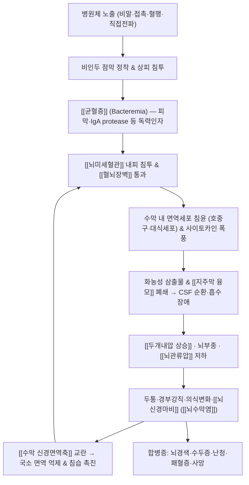

# 🩺 [[뇌수막염]] (Meningitis / 腦膜炎, ICD-10 G00–G03 / KCD G00–G03)

> **핵심 3줄 요약 (Key Summary)**:
> - 📍 **병소 부위 & 해부·병태생리**: [[뇌수막]](경막·지주막·연막)과 [[지주막하강]](subarachnoid space)·[[뇌척수액]](CSF)의 급성/만성 염증. 병원체가 비인두 점막을 침투해 [[균혈증]]을 일으킨 뒤 [[뇌미세혈관]] 내피를 통과하여 지주막하강에 정착하고, 여기서 증식하며 호중구 침윤·사이토카인 폭풍·[[혈뇌장벽]](BBB) 파괴를 유발한다.
> - 🚩 **전형적 임상 양상 & 3대 징후**: [[발열]], [[두통]], [[경부강직]](목 뻣뻣함)의 고전적 3징후(전형 3징후가 모두 갖춰지는 경우는 일부에 불과), 여기에 [[의식 변화]]·[[광공포증]]·[[구역/구토]]·[[피부 자반]]이 동반될 수 있다. [[Kernig 징후]], [[Brudzinski 징후]], [[jolt accentuation]]이 수막 자극을 시사한다.
> - 🛠️ **핵심 감별 검사 & 한·양방 다각적 치료 전략**: [[요추천자]](LP) 및 [[뇌척수액 검사]](세포수·단백·포도당·그람염색·배양)가 확진의 핵심. **세균성은 초기 1시간 내 경험적 항생제 + 필요 시 덱사메타손**이 표준이며, 한의 치료(침·약침·추나·한약)는 **급성기 단독 치료가 아니라 회복기·후유증 관리의 보조 요법**으로만 위치시킨다(뇌수막염 자체에 대한 한의 단독 치료 근거는 **근거 미확인**).
> - ⚠️ **응급 의뢰 레드플래그 & 악화 요인**: 발열 + 경부강직 + 의식 변화 + 자반, 발작, 국소 신경학적 결손, 유두부종, 면역억제 상태, 최근 두부수술/CSF 단락(VP shunt) → **즉시 응급실 이송, 경추 회전/강압 추나 절대 금기.**

---

## 📌 목차
1. [질환 개요 & 해부학적 병태생리](#1-질환-개요--해부학적-병태생리)
2. [병태생리 메커니즘 & 생체역학적 악순환 네트워크](#2-병태생리-메커니즘--생체역학적-악순환-네트워크)
3. [임상 증상 & 이학적 검사(Physical Exam) 알고리즘](#3-임상-증상--이학적-검사physical-exam-알고리즘)
4. [감별 진단 매트릭스 (Differential Diagnosis)](#4-감별-진단-매트릭스-differential-diagnosis)
5. [한의 통합 치료 프로토콜 (침·약침·추나·한약)](#5-한의-통합-치료-프로토콜-침약침추나한약)
6. [재활 운동 & 생활습관 티칭 가이드](#6-재활-운동--생활습관-티칭-가이드)
7. [💡 사용자 진료실 핵심 필기 & 임상 노하우 (Melt-In 잔여 심화 집약)](#7--사용자-진료실-핵심-필기--임상-노하우-melt-in-잔여-심화-집약)
8. [출처 및 학술 참고 문헌 (References)](#8-출처-및-학술-참고-문헌-references)

---

## 1. 질환 개요 & 해부학적 병태생리
![[뇌수막염_2.jpg|540]]

> [그림 1: ① 병태생리·영상 — 뇌수막염_2]

* **질환 정의 및 분류**:
  * **뇌수막염(Meningitis)**은 [[경막]](dura mater)·[[지주막]](arachnoid mater)·[[연막]](pia mater)으로 구성된 [[뇌수막]]과 [[지주막하강]], 그리고 그 안을 순환하는 [[뇌척수액]]에 염증이 생기는 질환이다. 뇌 실질 자체의 염증인 [[뇌염]](encephalitis)과는 개념이 구분되지만, 실제 임상에서는 [[수막뇌염]](meningoencephalitis)으로 함께 진행되는 경우가 흔하다.
  * **원인별 분류**: 크게 ① 세균성(화농성), ② 바이러스성(무균성, aseptic), ③ 결핵성·진균성(아급성~만성), ④ 비감염성(자가면역·약물·종양)으로 나눈다(Putz & Hayani, 2013; Bulaeva & Derber, 2025).
  * **경과별 분류**: 급성(수시간~수일)과 [[만성 뇌수막염]](증상이 4주 이상 지속 또는 반복)으로 구분한다(Madle-Samardzija & Diklić, 1997).
  * **호발 연령/역학**: 세균성 뇌수막염은 **영아·소아·고령·면역억제자**에서 위험이 높고, 원인균의 연령 분포가 뚜렷하다. 신생아기에는 B군 연쇄구균(group B *Streptococcus*)·대장균(*E. coli*)·리스테리아(*Listeria*)가, 영아 이후 소아기에는 [[폐렴연쇄구균]](*Streptococcus pneumoniae*)과 [[수막구균]](*Neisseria meningitidis*)이 주요 원인이다(Kim, 2010). [[Hib 백신]]·[[폐렴구균 백신]](PCV)·[[수막구균 백신]] 도입 이후 선진국에서 소아 세균성 뇌수막염 발생률은 크게 감소하였다(Kim, 2010).
  * **임상적 중요성**: 세균성 뇌수막염은 **수시간 내 치명적일 수 있는 응급 감염질환**으로, 진단·치료가 지연될수록 사망률과 신경학적 후유증(청력소실·인지장애·운동장애·간질)이 급격히 증가한다(Bulaeva & Derber, 2025).
* **관련 해부학적 구조물**:
  * **골격 및 관절**: [[두개골]], [[척추관]](spinal canal), [[후두골]]·[[측두골]]·[[접형골]]의 뇌기저부 구조물. [[사골판]](cribriform plate)과 [[측두골 유양돌기]]는 부비동·중이염이 뇌수막으로 직접 파급되는 해부학적 통로다(직접 전파 경로).
  * **근육 및 근막**: 해부학적으로 "관절·근육 질환" 범주는 아니지만, 수막 자극에 대한 **방어적 근긴장**이 [[후경부 심부신근]](두반극근·경반극근)·[[승모근 상부섬유]]·[[흉쇄유돌근]]에 나타나며, 이 때문에 감염성 뇌수막염 초기의 경부강직이 **근막성/경추성 목 통증으로 오인**되는 것이 대표적 임상 함정이다.
  * **신경 및 혈관**: [[경막]](특히 경막동·정맥동), [[지주막하강]], [[지주막 융모]](arachnoid villi, CSF 흡수), [[뇌실계]](측뇌실–제3뇌실–중뇌수도–제4뇌실). [[뇌신경]] 중 제3·제4·제6·제7·제8 뇌신경이 지주막하강을 통과하며, 염증성 삼출물이나 두개내압 상승에 의해 압박되어 [[뇌신경마비]]·[[감각신경성 난청]]이 발생할 수 있다.
  * **면역학적 구조**: 경막에는 **다양한 면역세포와 림프관**이 존재하여 중추신경계 면역 감시를 담당한다(Rua & McGavern, 2018). 이 "수막 면역 구획"의 존재가 뇌수막염 병태생리 이해의 핵심 축이다.

---

## 2. 병태생리 메커니즘 & 생체역학적 악순환 네트워크

![[뇌수막염_3.jpg|540]]
> [그림 2: ② 관련 해부 구조물 — MRI of a patient with a past medical history of “uneventful sinus surgery” 7 years ago. Patient suffers from intercurren]

### 1) 해부학적 포착 및 압박 기전
* **혈행성 감염 경로**: 대부분의 세균성 뇌수막염은 비인두 정착 → 상피 침투 → [[균혈증]] → [[뇌미세혈관]] 내피세포 통과 → 지주막하강 정착의 순서로 발생한다(Kim, 2010). 세균은 캡슐·리포테이코산·펩티도글리칸 등 독력인자로 숙주 면역을 회피하며, 숙주 쪽에서는 [[패턴인식수용체]](TLR 등)를 통한 선천면역 반응이 과도하게 작동해 조직 손상의 상당 부분을 스스로 만든다.
* **직접 전파 경로**: [[부비동염]]·[[중이염]]·[[유양돌기염]]·[[두개골 골절]](특히 사골판) 등을 통해 해부학적 인접 구조에서 직접 파급될 수 있고, 신경외과 수술·VP shunt·경막외 카테터 등 의료행위 관련 감염도 존재한다(Bulaeva & Derber, 2025).
* **삼출물과 폐쇄 기전**: 수막에 화농성 삼출물이 쌓이면 뇌기저부에서 [[지주막 융모]]와 [[뇌실계]] 통로가 막히고, 이로 인한 [[뇌수두증]](hydrocephalus)과 [[두개내압 상승]]이 이차적으로 발생한다. 뇌부종이 진행되면 [[뇌관류압]]이 떨어져 허혈성 손상이 심화된다.
* **수막 신경면역축(neuroimmune axis)**: 최근 연구에 따르면 병원체가 수막의 **통각 신경(특히 TRPV1+ 감각신경)**을 이용하여 국소 면역 반응을 억제하는 기전이 확인되었다. 세균이 감각신경을 활성화하면 통증이 유발되는 동시에 호중구 모집이 억제되어 뇌 침습이 촉진된다(Pinho-Ribeiro & Deng, 2023). 이는 "수막 면역은 능동적으로 조절되는 구획"이라는 관점(Rua & McGavern, 2018)과 결합되어, 뇌수막염을 단순한 국소 감염이 아닌 **신경–면역 상호작용 질환**으로 재조명하게 한다.
* **수막 면역 구획의 역할**: 경막에는 림프관과 다양한 면역세포가 존재하여 중추신경계를 지속적으로 감시한다(Rua & McGavern, 2018). 따라서 염증 초기에 어떤 면역세포가 어떤 속도로 동원되는지가 예후를 좌우한다.
* **만성 뇌수막염 기전**: 결핵·진균·매독·보렐리아·사르코이드증·베체트병·종양(수막암종증) 등은 수막에 만성적으로 육아종성 또는 림프구성 염증을 일으켜 4주 이상 지속되는 비특이적 증상(두통·미열·인지저하·뇌신경마비)을 만든다(Madle-Samardzija & Diklić, 1997). 반복적 LP와 배양, 영상검사가 진단에 필수적이다.

### 2) 생체역학적 연쇄 반응 (Kinetic Chain)
* 뇌수막염은 본질적으로 감염·면역 질환이므로 근골격계 "생체역학적 연쇄"와는 성격이 다르다. 다만 임상적으로 다음 연쇄가 문제된다.
  1. 수막 자극 → **후경부 방어성 근긴장**([[두반극근]]·[[경반극근]]·[[상부 승모근]]) → 경추 가동 제한.
  2. 경추 강직 → 환자가 목을 움직이지 않으려 함 → **경추성 통증으로 오진** 위험.
  3. 두개내압 상승 환자에서 **경추 회전·강압 수기**를 가하면 뇌탈출·뇌간 압박 위험 → **절대 금기**.
* 따라서 뇌수막염에서 "생체역학" 개념은 **치료 대상이 아니라 위험 관리 항목**으로 다루어야 한다.

---

## 3. 임상 증상 & 이학적 검사(Physical Exam) 알고리즘

### 1) 주소증 및 신경학적 증상
* **전신 및 수막 자극 증상**:
  * [[발열]](고열 또는 저체온), [[오한]], [[두통]](전체적·지속적, 기침/체위변화 시 악화), [[구역]]·[[구토]](두개내압 상승 시 사출성), [[광공포증]](photophobia), [[청각과민]].
  * [[경부강직]](nuchal rigidity): 수동적 목 굽힘에 저항.
  * 세균성 뇌수막염의 고전적 **3징후(발열·경부강직·의식 변화)**는 실제로는 일부 환자에서만 모두 나타나므로, "3징후가 없으면 안심"은 위험한 사고방식이다(Bulaeva & Derber, 2025).
* **의식 및 고위피질 기능**:
  * [[의식 변화]](혼돈·기면·혼수), [[경련]], 국소 신경학적 결손(편마비·실어증).
  * 영아에서는 **비특이적 양상**이 흔하다: [[불안정한 체온]], [[수유 저하]], [[과도한 보챔]], [[천문 팽륭]], [[경련]], [[경직 자세]](Kim, 2010).
* **피부 및 혈관/자율신경 증상**:
  * [[자반]](petechiae/purpura)·[[점상출혈]]은 수막구균성 뇌수막염에서 특징적이며 급속 진행한다.
  * [[패혈증]] 동반 시 말초 순환 부전(냉감·청색증·맥박 약화·저혈압)이 나타난다.
  * 장기 후유증으로 [[감각신경성 난청]], [[인지기능 저하]], [[운동장애]], [[뇌전증]]이 남을 수 있다.

### 2) 필수 이학적 검사법 (Physical Examination)
* **[[경부강직]](Nuchal rigidity) 검사**: 환자를 앙와위로 두고 검사자가 고개를 수동적으로 굽힘. 저항·통증이 있으면 수막 자극 시사. **단, 후경부 근육긴장·경추 질환에서도 양성**이므로 단독 진단은 불가.
* **[[Kernig 징후]]**: 앙와위에서 [[고관절]]을 90° 굽힌 뒤 [[슬관절]]을 펴서 [[햄스트링]]에 통증/저항이 유발되면 양성. 수막 자극의 대표적 검사.
* **[[Brudzinski 징후]]**: 수동적 경부 굽힘 시 양측 고관절·슬관절이 **불수의적으로 굽어지면** 양성.
* **[[jolt accentuation]]**: 머리를 좌우로 초당 2~3회 빠르게 회전시켜 두통이 악화되면 양성. 두통 환자에서 뇌수막염 가능성을 시사하는 유발 검사.
* **검사의 한계(중요)**: 위 수막 자극 징후들은 **민감도가 충분히 높지 않아**, 음성이라고 해서 뇌수막염을 배제할 수 없다. 따라서 **임상적 의심이 우선**이고, 의심 시 [[요추천자]]로 확진한다(Putz & Hayani, 2013; Bulaeva & Derber, 2025).
* **[[요추천자]](LP) 및 [[뇌척수액 검사]] — 확진의 핵심**:

| CSF 항목 | 세균성 (급성 화농성) | 바이러스성 (무균성) | 결핵성·진균성 (만성) |
| :--- | :--- | :--- | :--- |
| 개방압 | 상승 | 정상~경도 상승 | 상승 |
| 세포수/세포종 | 수백~수만, **호중구 우세** | 수십~수백, **림프구 우세** | 수십~수백, 림프구 우세 |
| 단백 | 현저히 상승 | 정상~경도 상승 | 상승 |
| 포도당 | **감소** (혈당 대비 저하) | 정상 | 감소 |
| 특수검사 | 그람염색·배양·PCR | 바이러스 PCR | 항산균 도말·배양, 진균 배양, 결핵 PCR |

> 위 수치는 **전형적 패턴**이며, 초기 항생제 투여 후에는 세포·포도당 소견이 비전형으로 바뀔 수 있다.
* **혈액검사·영상**: [[혈액배양]](항생제 투여 전 시행), [[CRP]]·[[PCT]](procalcitonin), [[두부 CT]](LP 전 뇌탈출 위험 평가 및 감별), [[뇌 MRI]].

---

## 4. 감별 진단 매트릭스 (Differential Diagnosis)

| 감별 질환 | 호발 병소 및 원인 | 주소증 차이점 | 특이적 이학적/검사 소견 |
| :--- | :--- | :--- | :--- |
| [[뇌수막염]] — 세균성(본 질환) | 지주막하강, 폐렴구균·수막구균·GBS 등 | 급성 고열+두통+경부강직, 자반, 빠른 악화 | CSF 호중구 우세·포도당 감소·그람염색 양성 |
| [[바이러스성 뇌수막염]] (무균성) | 장바이러스 등, 수막 위주 | 발열·두통은 있으나 전신상태 비교적 양호 | CSF 림프구 우세·포도당 정상·배양 음성 |
| [[결핵성 뇌수막염]] / [[진균성 뇌수막염]] | 뇌기저부 수막, 결핵균·크립토코쿠스 등 | **수일~수주에 걸친 아급성/만성** 두통, 뇌신경마비 | CSF 림프구 우세·포도당 저하·항산균/진균 검출 |
| [[지주막하출혈]](SAH) | 지주막하강, 파열 동맥류 | **벼락두통**(thunderclap), 발열은 경미 | CT·LP에서 혈성/xanthochromia, 경부강직 동반 가능 |
| [[뇌농양]] / [[경막하농양]] | 뇌실질·경막하 공간 | 국소 신경학적 결손·두개내압 상승 우세 | CT/MRI 링 조영 증강, CSF 소견은 상대적으로 경미 |
| [[비감염성 뇌수막염]] (약물·자가면역) | 수막, NSAIDs·TMP-SMX·[[SLE]]·[[베체트병]] | 반복성·재발성, 발열 경미 | 약물 중단/스테로이드 반응, 원인 항체·전신 소견 |
| [[수막암종증]] | 수막 전이 | 만성 두통·뇌신경마비·체중감소 | CSF 세포학 검사 악성세포 |

---

## 5. 한의 통합 치료 프로토콜 (침·약침·추나·한약)

![[뇌수막염_4.jpg|540]]
> [그림 3: ③ 치료·시술점 — Paediatric acu-moxa: opsithotonos in children, Chinese]

> [!WARNING] 🚨 **한의 치료의 위치 — 반드시 전제로 삼을 것**
> **급성 세균성 뇌수막염은 응급 항생제 치료 질환**이다. 침·약침·추나·한약은 이를 대체할 수 없으며, **항생제 투여 없이 한방 단독 치료를 하는 것은 절대 금기**다. 아래 프로토콜은 **① 서양의학적 표준치료를 받는 중의 보조(회복기 두통·근긴장 관리), ② 퇴원 후 후유증 재활 단계**에 한정해 적용한다. 뇌수막염 자체에 대한 침·약침·한약의 유효성 근거는 제공된 논문 범위에서 **근거 미확인**이며, 이 노트는 임상 추론 및 경험적 접근으로 기술한다.

* **침구 치료 (Acupuncture)**:
  * **적용 국면**: 발열이 해소되고 항생제 치료가 안정기에 들어간 **회복기**의 잔여 두통·후경부 긴장·피로·수면장애 관리.
  * **두통·수막 잔여 증상**: [[GV20 백회]], [[GB20 풍지]], [[GV14 대추]], [[LI4 합곡]], [[LI11 곡지]], [[TE5 외관]], [[SI3 후계]].
  * **후경부 근긴장**: [[GB20]], [[BL10 천주]], [[경추 방추근 부착부]], [[상부 승모근 TP]]에 자침.
  * **전침 세팅**: 두통·근긴장에는 저빈도(2~4 Hz) 위주로 완만하게 운용한다. **고빈도 강자극은 급성 염증기 환자에게 부적합**하다(일반 원칙, 근거 미확인).
  * **금기**: 발열 지속기, 혈역학적 불안정, 의식 변화, 항응고제 복용 + 혈소판 저하 시 자침 금기.
* **약침 치료 (Pharmacopuncture)**:
  * 뇌수막염에 대한 약침의 직접 근거는 **근거 미확인**. 회복기 근긴장·통증 관리 목적으로만 제한적으로 고려한다.
  * 후경부 압통점·근막 트리거포인트에 소량씩 주입하는 접근을 경험적으로 사용하나, **감염 활동성/패혈증 소견이 있으면 절대 시행하지 않는다**.
* **추나 치료 (Chuna Manipulation)**:
  * **절대 금기(최우선)**: 발열·경부강직·의심 뇌수막염·두개내압 상승·VP shunt 환자에서 **경추 회전/강압 추나 금기**. 뇌탈출 위험이 있다.
  * **적용 가능 국면**: 완전히 회복된 이후의 잔여 경추 가동 제한, 근막 이완(JS) 수기 정도. 이때도 두통·발열 재발 여부를 매번 확인한다.
* **한약 치료 (Herbal Medicine)**:
  * **급성기**: 청열해독(淸熱解毒) 계열 방제를 감염열성 질환에 응용하는 접근이 전통적으로 있으나, **뇌수막염에 대한 임상 근거는 근거 미확인**이며 항생제 대체 불가.
  * **회복기·후유증기**: [[보익제]] 계열(기혈 보충·신경 회복 목적)을 체질·증상에 따라 고려. 예: [[십전대보탕]], [[보중익기탕]], [[귀비탕]] 등 — **증상·체질 변증 기반, 뇌수막염 특이 근거 미확인**.
  * **주의**: 간기능·신기능 저하, 면역억제 환자에서는 상호작용 위험을 우선 검토한다.

---

## 6. 재활 운동 & 생활습관 티칭 가이드

* **급성기 원칙 (절대 준수)**:
  * 발열·경부강직·의식변화가 있는 동안에는 **운동·스트레칭·수기치료 전면 금지**. 이 시기의 유일한 우선순위는 응급실 이송과 항생제 치료다.
* **이완 및 스트레칭 (회복기)**:
  * 후경부 근긴장이 남은 경우 **경추 등척성(isometric) 이완 → 점진적 능동 가동범위(AROM)** 순서로 진행.
  * 급성기 직후에는 **강한 경추 신전·회전 스트레칭 금지**.
* **강화 및 안정화 운동 (회복기)**:
  * 심부 경부 굴곡근([[두장근]]·[[두장근]]) 및 견갑 안정화 근육([[전거근]]·[[하부 승모근]]) 강화.
  * 전정 재활: 어지럼·균형장애가 남을 경우 시선 안정화(gaze stabilization)·습관화 훈련.
* **인지 및 청각 재활**:
  * 인지저하가 남으면 단계적 인지 재활.
  * **퇴원 전후 청력검사 필수** — 감각신경성 난청은 흔한 후유증이며 조기 발견이 중요하다(Kim, 2010).
* **일상생활 자세 티칭 (Ergonomics)**:
  * 모니터 높이를 눈높이에 맞추고, 장시간 고개 숙임 작업 회피.
  * 회복기에는 **충분한 수면과 단계적 활동 재개(에너지 보존)**를 강조.
* **예방 교육 (가장 중요)**:
  * [[폐렴구균 백신]]·[[Hib 백신]]·[[수막구균 백신]] 접종 — 백신 도입 후 소아 발생률이 크게 감소하였다(Kim, 2010).
  * 손위생, 호흡기 위생, 수막구균 접촉자 예방적 화학요법 필요성 안내(Bulaeva & Derber, 2025).

---

## 7. 💡 사용자 진료실 핵심 필기 & 임상 노하우 (Melt-In 잔여 심화 집약)

> [!IMPORTANT]
> **🛡️ 아래는 상부 1~6번 섹션에 완전히 녹여내지 못한, 진료실 실전에서만 얻어지는 고유 관찰·노하우만 엄선한 것이다. 기본 병태생리·검사법·치료 원칙은 상부 섹션을 참조할 것.**

* **상부 섹션에 미처 다 담지 못한 고유 원문 필기**:
  * **"목이 뻣뻣하다"는 환자 표현을 곧이곧대로 믿지 말 것.** 뇌수막염 초기 경부강직은 환자가 "근육이 뭉쳤다"고 표현하는 경우가 매우 많아, 단순 근막통증증후군으로 1~2일 지연되는 것이 전형적 실수 경로다. **반드시 발열력·최근 상기도감염·예방접종력**을 함께 물어야 한다.
  * **영아는 절대 고전 3징후로 판단하지 않는다.** 보챔·수유 저하·천문 팽륭·체온 불안정이 유일한 단서일 수 있다(Kim, 2010).
  * **만성 두통 환자에서 "결핵·진균·종양"을 잊지 말 것.** 4주 이상 지속되는 두통+뇌신경마비는 만성 뇌수막염 감별이 필수다(Madle-Samardzija & Diklić, 1997).
* **진료실 실전 감별 & 치료 노하우**:
  1. **실전 문진 체크리스트 (3분 스크리닝)**:
     - ① **발열이 동반되었는가?** (최근 1~2주 이내)
     - ② **목을 굽힐 때 저항/통증이 있는가?** (환자에게 직접 "턱을 가슴에 대보세요"라고 지시)
     - ③ **빛이 눈부신가?** (광공포증)
     - ④ **의식이 평소와 다른가?** (보호자에게 확인 — 환자 본인은 인지 못함)
     - ⑤ **피부에 붉은 반점/자반이 있는가?** (옷을 벗겨 전신 확인)
     - ⑥ **최근 두부외상·뇌수술·VP shunt·면역억제제 복용력?**
     - → 위 중 하나라도 양성이면 **한방 치료 고려 대상이 아니라 전원 대상**이다.
  2. **치료 순서 및 손맛 노하우**:
     - **자침 순서(회복기)**: 원위부([[LI4]], [[TE5]], [[SI3]]) 먼저 → 국소부([[GB20]], [[BL10]], [[GV20]]) 나중. 발열감이 남아 있으면 자극량을 최소화.
     - **약침**: 후경부에 주입할 때는 **깊은 주입을 피하고 천자 시 환자 반응을 실시간 확인**. 어지럼·오심 호소 시 즉시 중단.
     - **추나 적용 시 체위 팁**: 발열·수막자극 음성 확인 후에만. 앙와위에서 **최소 각도, 최소 강도**로 시작하며, 시술 중 새로운 두통·구역·시야 이상 발생 시 즉시 중단하고 응급 평가.
  3. **환자 티칭 스크립트 (그대로 읽어줄 수 있는 문장)**:
     - **회복기 환자에게**: "이 병은 항생제 치료가 본치료입니다. 한약과 침은 회복을 돕는 보조입니다. **열이 다시 나거나 목이 아프고 머리가 심하게 아프면 그날 바로 응급실에 가셔야 합니다.** 절대 '괜찮아지겠지' 하고 넘기지 마세요."
     - **예방 교육 시**: "아이에게는 폐렴구균·Hib·수막구균 백신을 국가 일정에 맞춰 접종하는 것이 가장 확실한 예방입니다."
     - **재발 방지**: "면역이 떨어지는 시기(과로·수면부족)에는 사람 많은 곳에서 마스크를 쓰고, 감염성 질환자와의 밀접 접촉을 피하세요."
* **임상 감별 직관 팁 (Red Flag 직관 3원칙)**:
  * **"열 + 목 + 머리"** 3단 콤보는 뇌수막염으로 간주하고 움직여라.
  * **"자반이 보이면 시계가 빨라진다"** — 수막구균은 수시간 단위로 악화된다.
  * **"경추 수기 후 두통이 바뀌면"** — 그 수기는 금기였고, 즉시 신경학적 평가가 필요하다.

---

## 8. 출처 및 학술 참고 문헌 (References)

1. **대한정형외과학회 / 척추신경외과학회 교과서** — 감염성 척추·중추신경계 질환 감별 및 레드플래그 참고.
2. **Putz K, Hayani K (2013)**. *Meningitis*. **Prim Care**, PMID: 23958365.
   - **[연구 요약]**: 일차의료에서의 뇌수막염 접근을 정리한 개관. 원인별 분류(세균성·바이러스성 등), 임상 양상, 진단적 접근과 감별의 기본 틀을 제공한다.
3. **Rua R, McGavern DB (2018)**. *Advances in Meningeal Immunity*. **Trends Mol Med**, PMID: 29731353.
   - **[연구 요약]**: 수막이 중추신경계 면역 감시를 담당하는 능동적 면역 구획임을 정리. 경막 림프관·면역세포 집단의 역할을 다루며, 뇌수막염 병태생리를 "신경–면역 상호작용" 관점으로 확장하는 근거를 제공한다.
4. **Madle-Samardzija N, Diklić V (1997)**. *[Chronic meningitis]*. **Med Pregl**, PMID: 9441211.
   - **[연구 요약]**: 4주 이상 지속되는 만성 뇌수막염의 원인(결핵·진균·기타 감염 및 비감염성 원인)과 진단적 접근을 정리. 아급성/만성 두통 및 뇌신경마비 감별에 참고.
5. **Pinho-Ribeiro FA, Deng L (2023)**. *Bacteria hijack a meningeal neuroimmune axis to facilitate brain invasion*. **Nature**, PMID: 36859544.
   - **[연구 요약]**: 병원체가 수막의 감각(통각) 신경을 이용하여 국소 면역 반응을 억제하고 뇌 침습을 촉진하는 기전을 규명. 통증 발생과 면역 억제가 동시에 일어나는 신경면역축 개념을 제시한다.
6. **Bulaeva A, Derber C (2025)**. *Bacterial Meningitis*. **Med Clin North Am**, PMID: 40185548.
   - **[연구 요약]**: 세균성 뇌수막염의 최신 개관 — 원인균, 임상 양상, 진단(LP 및 CSF 소견), 경험적 항생제 치료와 응급 대응 원칙을 정리.
7. **Kim KS (2010)**. *Acute bacterial meningitis in infants and children*. **Lancet Infect Dis**, PMID: 20129147.
   - **[연구 요약]**: 영아·소아 급성 세균성 뇌수막염의 원인균 연령 분포, 임상 특징, 보조적 덱사메타손 치료 및 백신(PCV·Hib·수막구균) 도입에 따른 발생률 감소를 정리. 소아·영아의 비특이적 발현과 후유증(청력소실 등) 관리의 근거를 제공한다.

> **근거 수준 표기 안내**: 본 노트에서 "근거 미확인"으로 표기한 항목(특히 5번 한의 치료 프로토콜, 7번 진료실 노하우)은 제공된 논문에서 직접 확인되지 않은 임상 추론·경험적 내용이다. 실제 진료 적용 시 최신 지침과 환자 상태를 우선 확인할 것.