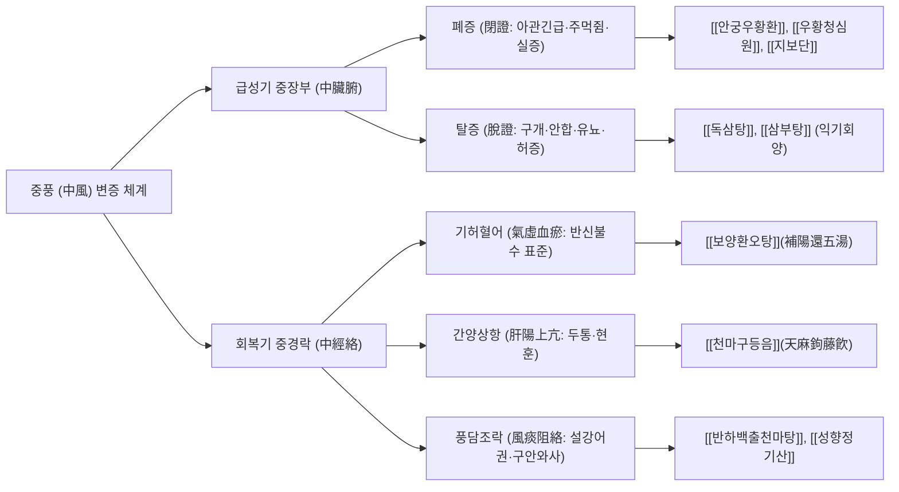

# 🧠 뇌졸중 (Stroke, 中風)

> **핵심 요약 (Key Summary)**:
> - **정의**: 뇌혈관의 급격한 폐쇄(허혈성 뇌졸중/뇌경색) 또는 파열(출혈성 뇌졸중/뇌출혈)로 인해 뇌조직의 국소적 혈류 공급이 중단되어, 급작스러운 의식 장애, 편측 마비, 감각 소실, 언어 장애 등의 신경학적 결손이 발생하는 응급 뇌혈관 질환.
> - **분류**:
>   - **허혈성 뇌졸중 (Ischemic Stroke, 뇌경색)**: 전체의 약 $80\sim85\%$. 죽상경화성 대혈관 폐쇄, 심인성 색전증(심방세동), 열공성 뇌경색(소혈관 폐쇄).
>   - **출혈성 뇌졸중 (Hemorrhagic Stroke, 뇌출혈)**: 전체의 약 $15\sim20\%$. 뇌내출혈(ICH, 만성 고혈압성 미세동맥류 파열) 및 지주막하출혈(SAH, 뇌동맥류 파열).
> - **진단 및 골든타임**: **비조영 뇌 CT(NCCT)**로 즉각적인 출혈 배제가 1차적이며, 뇌 MRI 확산강조영상(DWI)으로 초급성기 뇌경색을 포착. **정맥 내 혈전용해제(IV tPA) 투여는 4.5시간 이내**, **기계적 혈전제거술(EVT)은 6~24시간 이내**가 생사를 가르는 골든타임.
> - **서양의학 치료**: 급성기 재관류 요법, 2차 예방을 위한 항혈소판제([[아스피린]], 클로피도그렐) 또는 항응고제(DOAC), 혈압·혈당 관리 및 집중 포괄적 재활 치료.
> - **한의학 치료**: 중풍(中風) 범주로 접근하여 중경락(中經絡)과 중장부(中臟腑: 폐증 vs 탈증)를 감별. 급성기 성뇌개규(醒腦開竅) 후, 아급성기 및 만성 회복기에는 **[[보양환오탕]](기허혈어), [[천마구등음]](간양상항), [[성향정기산]](풍담조락)**을 투여하고, **두침 요법([[두침]], 운동구·감각구)** 및 사지 경혈 복합 전침을 병행하여 뇌 신경가소성(Neuroplasticity) 및 편마비·경직([[경직(Spasticity)|경직]])을 획기적으로 개선.

---

## 📌 목차
1. [개요 및 병태생리 (Pathophysiology & Classification)](#1-개요-및-병태생리-pathophysiology--classification)
2. [발생 기전 및 해부학적 연계 (Mechanism & Anatomical Link)](#2-발생-기전-및-해부학적-연계-mechanism--anatomical-link)
3. [진단 및 임상 평가 (Clinical Evaluation & Differential Diagnosis)](#3-진단-및-임상-평가-clinical-evaluation--differential-diagnosis)
4. [현대 의학적 치료 원칙 (Western Medical Management)](#4-현대-의학적-치료-원칙-western-medical-management)
5. [한의학적 변증 및 통합 치료 프로토콜 (TCM Pattern Identification & Integrative Protocol)](#5-한의학적-변증-및-통합-치료-프로토콜-tcm-pattern-identification--integrative-protocol)
6. [양방 치료 & 병용·의뢰 기준 (Conventional Treatment & Referral)](#6-양방-치료--병용의뢰-기준-conventional-treatment--referral)
7. [생활 관리 및 환자 교육 (Lifestyle & Patient Guidance)](#6-생활-관리-및-환자-교육-lifestyle--patient-guidance)
8. [진료실 임상 팁 & 노트 (Clinical Pearls & Practice Notes)](#7-진료실-임상-팁--노트-clinical-pearls--practice-notes)
9. [참고 문헌 (References)](#8-참고-문헌-references)

---

## 1. 개요 및 병태생리 (Pathophysiology & Classification)

뇌졸중은 전 세계 사망 원인 2위이자 영구적 성인 장애를 초래하는 1위 질환이다. 뇌는 인체 체중의 $2\%$에 불과하지만 심박출량의 $15\sim20\%$, 전신 산소 소모량의 $20\%$를 사용하는 고대사 장기로서, 혈류 공급이 단 몇 분만 중단되어도 비가역적인 신경세포 괴사가 일어난다.

![[뇌졸중_뇌경색_중대뇌동맥_고음영혈전_저음영경색_뇌CT.jpg|540]]
> [그림 1: ① 병태생리·영상 — 급성 허혈성 뇌경색 환자의 비조영 뇌 CT 소견 — 우측 중대뇌동맥(MCA)의 고음영 혈전 징후(Dense MCA sign) 및 우측 대뇌반구 기저핵 부위의 저음영 뇌경색 병변 (Wikimedia Commons · Hellerhoff, CC BY-SA 3.0)]

### 1) 허혈성 뇌졸중(뇌경색)의 세부 병형 분류 (TOAST Classification)
1. **대혈관 죽상경화증 (Large-artery atherosclerosis)**: 내경동맥, 중대뇌동맥 등의 죽상판 파열로 인한 국소 혈전 형성 또는 동맥-동맥 색전증.
2. **심인성 색전증 (Cardioembolism)**: **심방세동(Atrial fibrillation)**, 심근경색 후 좌심실 혈전, 판막 질환 등으로 인해 심장에서 형성된 거대 색전이 뇌혈관을 급격히 폐쇄 (가장 중증도가 높고 경색 면적이 큼).
3. **소혈관 폐쇄 (Small-vessel occlusion, 열공성 뇌경색 Lacune)**: 만성 고혈압에 의한 렌즈핵선조체동맥(Lenticulostriate artery) 등 미세 관류 동맥의 지방초자음영증(Lipohyalinosis)으로 직경 $1.5\text{ cm}$ 미만의 작은 경색 발생.
4. **기타 원인 (Other determined etiology)**: 동맥 박리(Dissection), 모야모야병(Moyamoya), 혈관염.
5. **원인 불명 (Cryptogenic / Undetermined)**: 색전 출처가 불분명한 색전성 뇌졸중(ESUS).

### 2) 출혈성 뇌졸중(뇌출혈)의 주요 형태
- **뇌내출혈 (Intracerebral Hemorrhage, ICH)**: 만성 고혈압으로 취약해진 샤르코-부샤르 미세동맥류(Charcot-Bouchard microaneurysm) 파열로 기저핵(피각, 시상), 뇌교, 소뇌 실질 내 혈종 형성.
- **지주막하출혈 (Subarachnoid Hemorrhage, SAH)**: 윌리스환 분기점의 낭상 뇌동맥류(Saccular aneurysm) 파열로 뇌척수액 공간 내 대량 출혈 발생 ("생애 최악의 벼락 두통").

---

## 2. 발생 기전 및 해부학적 연계 (Mechanism & Anatomical Link)

```
[허혈성 뇌경색의 허혈성 반음영(Penumbra) 및 흥분독성 세포사멸 캐스케이드]

                주요 뇌혈관(중대뇌동맥 등)의 급격한 혈전성/색전성 폐쇄
                                       │
                                       ▼
        ┌──────────────────────────────┴──────────────────────────────┐
        ▼                                                             ▼
[허혈성 중심부 (Ischemic Core)]                               [허혈성 반음영 (Ischemic Penumbra)]
뇌혈류량(CBF) < 10 mL/100g/min                                CBF 10~20 mL/100g/min (측부순환 유지)
세포막 ATP 고갈 및 이온펌프 정지                             세포 기능은 정지되었으나 세포막 온전
수분 내 비가역적 괴사 (Infarction)                            골든타임 내 재관류 시 **가역적 회생 가능**
        │                                                             │
        └──────────────────────────────┬──────────────────────────────┘
                                       │
                                       ▼
    에너지 결핍 ──► 세포 탈분극 ──► 시냅스 간극 글루타메이트(Glutamate) 대량 유출
                                       │
                                       ▼
             NMDA / AMPA 수용체 과자극 ──► 세포 내 칼슘(Ca²⁺) 폭발적 유입
                                       │
       ┌───────────────────────────────┼───────────────────────────────┐
       ▼                               ▼                               ▼
칼파인/카스파제 효소 활성화    미토콘드리아 붕괴 & 활성산소(ROS)    산화질소합성효소(nNOS) 과발현
세포골격 단백질 파괴           DNA 단편화 및 세포자멸사(Apoptosis)  염증성 미세아교세포 활성화
       │                               │                               │
       └───────────────────────────────┴───────────────────────────────┘
                                       │
                                       ▼
                   뇌혈관장벽(BBB) 파괴 & 혈관성 뇌부종(Vasogenic edema)
                   두개내압(IICP) 상승 및 뇌탈출(Herniation) 위험
```

![[뇌졸중_윌리스환_뇌기저동맥망_혈관해부도.png|540]]
> [그림 2: ② 해부 구조물 — 뇌기저부의 주요 측부 순환망인 윌리스환(Circle of Willis) 및 전·중·후대뇌동맥, 내경동맥, 추골기저동맥의 해부학적 연결망 (Wikimedia Commons · Rhcastilhos, Public Domain)]

### 1) 허혈성 반음영(Ischemic Penumbra)과 "Time is Brain"
급성 뇌경색 환자의 뇌조직은 완전히 죽은 **허혈성 중심부(Core)**와, 그 주변부에서 연수막 측부순환(Leptomeningeal collaterals)을 통해 미세한 혈류를 공급받으며 간신히 살아있는 **허혈성 반음영(Penumbra)**으로 나뉜다.
- 뇌경색이 발생하면 **분당 약 190만 개의 신경세포와 140억 개의 시냅스가 영구 소멸**한다.
- 치료의 궁극적 목표는 골든타임 내에 신속한 혈관 재개통을 이루어 이 '허혈성 반음영' 영역이 중심부 경색으로 흡수되는 것을 막아내는 것이다.

### 2) 내포(Internal Capsule)와 추체로(Corticospinal Tract)의 해부학적 취약성
중대뇌동맥(MCA)의 심부 관통지인 렌즈핵선조체동맥이 차단되면 **내포 후각(Posterior limb of internal capsule)**에 경색이 호발한다.
- 내포 후각은 대뇌피질 운동영역에서 척수로 내려가는 **추체로(피질척수로, Corticospinal tract)** 섬유들이 좁은 공간에 고밀도로 밀집되어 통과하는 병목 지점이다.
- 따라서 불과 $1\text{ cm}$ 미만의 작은 열공성 경색이라도 이 부위를 침범하면, 반대측 상·하지 전체의 완전 편마비(Pure motor hemiparesis)가 영구적으로 발생한다.

---

## 3. 진단 및 임상 평가 (Clinical Evaluation & Differential Diagnosis)

### 1) FAST 신속 선별 평가
일반인과 응급실에서 뇌졸중을 1분 이내에 의심하고 119를 호출해야 하는 표준 척도:
- **F (Face Drooping)**: "이~ 하고 웃어보세요" $\rightarrow$ 한쪽 입꼬리가 처지고 비순구가 풀림.
- **A (Arm Weakness)**: "양팔을 앞으로 나란히 들어보세요" $\rightarrow$ 한쪽 팔이 힘없이 아래로 뚝 떨어짐.
- **S (Speech Difficulty)**: "엄마 발가락은 곰 발가락을 발음해보세요" $\rightarrow$ 발음이 어눌하거나(구음장애) 말을 이해하지 못함(실어증).
- **T (Time to Call 119)**: 위 3가지 중 1개라도 관찰되면 즉각 발생 시각을 확인하고 응급 뇌졸중 센터로 직행.

### 2) 뇌 영상 검사 프로토콜
- **비조영 뇌 CT (NCCT)**: 응급실 도착 즉시 시행. 뇌출혈(고음영 하얀색) 유무를 즉각 확인하여 tPA 투여 적응증을 판별 (초기 급성 뇌경색은 정상으로 보일 수 있음).
- **뇌 MRI (DWI / ADC)**: **확산강조영상(DWI)**은 발병 수 분 이내의 급성 세포독성 부종을 밝은 고신호 강도로 $100\%$ 포착하는 황금 표준.
- **뇌혈관 조영 (CT Angiography / MR Angiography)**: 대혈관 폐쇄(LVO: ICA, MCA M1/M2 분절) 여부를 실시간 확인하여 혈전제거술 대상을 결정.

### 3) 신경학적 장애 및 기능 평가 척도
- **NIHSS (National Institutes of Health Stroke Scale)**: $0\sim42$점 척도로 의식, 시야, 안면마비, 상하지 운동, 감각, 언어 등을 포괄 평가 ($> 15$점은 중증 뇌경색).
- **수정 랭킨 척도 (mRS: modified Rankin Scale)**: $0$점(무증상)부터 $6$점(사망)까지 독립적 일상생활 수준 평가 (mRS $0\sim2$가 독립 보행 가능 목표).
- **퍼글-마이어 평가 (FMA: Fugl-Meyer Assessment)**: 뇌졸중 후 상·하지 운동 기능 회복도를 정밀 측정.
- **수정 애쉬워스 척도 (MAS: Modified Ashworth Scale)**: 상부운동신경원 손상 후 발생하는 관절 경직([[경직(Spasticity)|경직]]) 등급 판정.

---

## 4. 현대 의학적 치료 원칙 (Western Medical Management)

### 1) 초급성기 재관류 요법 (Reperfusion Therapy)
- **정맥 내 혈전용해술 (IV tPA: Alteplase / Tenecteplase)**:
  - **골든타임: 발병 4.5시간 이내**.
  - 출혈 위험(최근 수술, 혈소판 저하, 항응고제 복용, 수축기 혈압 $> 185\text{ mmHg}$)이 없는 급성 허혈성 뇌경색 환자에게 $0.9\text{ mg/kg}$ 투여.
- **동맥 내 기계적 혈전제거술 (EVT: Endovascular Thrombectomy)**:
  - **골든타임: 발병 6시간 이내 (영상 유도 하 선택적 환자는 24시간까지 확장)**.
  - 내경동맥 또는 중대뇌동맥 M1 분절 등 대혈관 폐쇄 환자에서 대퇴동맥을 통해 마이크로 카테터를 진입시켜 스텐트 리트리버(Stent retriever) 또는 흡인 카테터로 혈전을 물리적으로 포획·적출.

![[뇌졸중_급성뇌경색_혈전제거술_스텐트리트리버_혈전제거.jpg|540]]
> [그림 3: ③ 치료·시술점 — 급성 중대뇌동맥 폐쇄 환자에서 골든타임 내 스텐트 리트리버(Stent retriever)를 혈관 내로 삽입하여 폐쇄성 혈전을 포획·제거하는 기계적 혈전제거술 실측 소견 (Wikimedia Commons · Jeffrey M. Katz et al., CC BY 2.0)]

### 2) 2차 재발 방지 항혈전 요법
- **비심인성 뇌경색**: 항혈소판제 투여 — [[아스피린]] $100\text{ mg}$ 단독 또는 발병 초기 3주간 아스피린 + 클로피도그렐(Clopidogrel) 이중 항혈소판 요법(DAPT).
- **심인성 색전증 (심방세동 동반)**: 비-비타민 K 길항제 경구 항응고제(DOAC: 아픽사반, 리바록사반, 에독사반) 투여.

---

## 5. 한의학적 변증 및 통합 치료 프로토콜 (TCM Pattern Identification & Integrative Protocol)

한의학에서 뇌졸중은 **중풍(中風)**이라 부르며, 내풍(內風)·화열(火熱)·담음(痰飮)·어혈(瘀血)이 허약해진 기혈을 틈타 뇌규(腦竅)를 침범하여 발생한다. 크게 사지가 저리고 마비되나 의식은 명료한 **중경락(中經絡)**과, 의식이 혼미하고 인사불성에 빠지는 **중장부(中臟腑)**로 대별하며, 중장부는 다시 실증인 **폐증(閉證)**과 허증인 **탈증(脫證)**으로 구별하여 초응급 대처한다.

### 1) 변증 분류 및 대표 처방



#### (1) 기허혈어 (氣虛血瘀, 뇌졸중 회복기 반신불수 표준형)
- **증상**: 편마비(반신불수), 환측 상·하지 무력 및 감각 둔마, 안면 비대칭, 말소리에 힘이 없음, 침 흘림, 자한, 피로, 설질 담자색 유어반, 맥 세삽무력.
- **치법**: 보양환오(補陽還五), 활혈거어(活血祛瘀), 통락식풍(通絡息風).
- **처방**: **[[보양환오탕]](補陽還五湯)** (왕청임 의림개착 수록 정본).
  - **생황기 대용량($60\sim120\text{ g}$)**: 원기를 대보(大補)하여 혈액 순환의 추동력을 회복.
  - 당귀미·적작약·천궁·도인·홍화: 뇌혈관 및 말초의 정체된 어혈을 융해.
  - 지룡(지렁이): 뇌경락을 깊숙이 뚫고 들어가 측부 순환망 형성과 신경 발아를 촉진.

#### (2) 간양상항 및 풍화상요 (肝陽上亢·風火上擾, 혈압 상승 및 출혈성 뇌졸중 후기)
- **증상**: 두통, 현훈, 면홍목적(얼굴 붉고 눈 충혈), 번조이노, 이명, 불면, 구고, 대변 비결, 설홍 태황, 맥 현유력.
- **치법**: 평간잠양(平肝潛陽), 청화식풍(淸火息風).
- **처방**: **[[천마구등음]](天麻鉤藤飮)** 또는 **[[진간식풍탕]](鎭肝息風湯)**.
  - 천마·구등: 간풍(肝風)을 가라앉히고 뇌혈류를 안정화.
  - 석결명·모려: 치솟는 간양을 아래로 끌어내림.
  - 우슬: 혈액을 하향 유도하여 뇌혈관내 압력을 감압.

#### (3) 풍담조락 (風痰阻絡, 언어 장애 및 삼킴 곤란형)
- **증상**: 혀가 굳어져 말이 어눌함(설강어권), 가래가 목구멍에 끓음, 편마비, 어지럼증, 메스꺼움, 설체 비대 태백니, 맥 활.
- **치법**: 거풍화담(祛風化痰), 활락통규(活絡通竅).
- **처방**: **[[성향정기산]](星香正氣散)** 합 **[[반하백출천마탕]](半夏白朮天麻湯)**.
  - 남성·반하: 담음(痰飮)을 삭이고 인후부 연하 반사 회복.
  - 석창포·원지: 뇌규를 열어 언어 중추 기능 자극.

### 2) 두침 요법(Scalp Acupuncture): 뇌 신경가소성 촉진의 핵심
- **임상 근거 실증**: **2026-09-02 심층리뷰 메타분석(16편 RCT, 1,280명 대상)**에서 통상 재활치료 단독군 대비 **두침 병행군이 편마비 환자의 운동 기능(FMA), 경직도(MAS), 일상생활동작(MBI) 모두에서 통계적으로 유의미한 상급 회복률($P < .001$)**을 나타냈다.
- **핵심 두침 자극 구역**:
  - **운동구(Motor Area)**: 전신 운동 피질 투영 부위.
    - 상부 $1/5$: 반대측 하지 및 체간 마비 치료.
    - 중부 $2/5$: 반대측 상지 마비, 손가락 미세 운동 치료.
    - 하부 $2/5$: 반대측 안면마비, 구음장애 치료.
  - **감각구(Sensory Area)**: 반대측 편측 감각 저하 및 이상 감각 치료.
  - **언어구(Speech Areas)**: 운동성 실어증(Broca area, 전하방 언어일구) 및 감각성 실어증(Wernicke area, 언어삼구).
- **자침 기법**: 두피 하 모상건막(Galea aponeurotica) 층을 따라 $30^\circ$ 각도로 $1.0\sim1.5$촌 수평 사자한 후, 분당 $200$회 이상의 신속한 염전(Twirling) 수기를 가하거나 $2\text{ Hz}$ 저주파 전침을 30분간 연결.

### 3) 체침 및 편마비 사지 경혈 배합
- **상지 편마비**: **견우(LI15)**, **곡지(LI11)**, **수삼리(LI10)**, **외관(TE5)**, **합곡(LI4)**, **팔사(EX-UE9)**.
- **하지 편마비**: **환도(GB30)**, **양릉천(GB34)**, **족삼리(ST36)**, **현종(GB39)**, **태충(LR3)**, **팔풍(EX-LE10)**.
- **경직 완화 배합**: 굴곡근 경직이 심한 상지에는 신전근 촉진혈(곡지, 수삼리)에 자침하고, 신전근 경직이 심한 하지에는 족내번 방지를 위해 외측 비골근 지배혈인 양릉천, 현종을 강자극.

---

## 6. 양방 치료 & 병용·의뢰 기준 (Conventional Treatment & Referral)

> 🎯 **이 섹션의 목적**: 환자가 **양방약을 이미 복용 중인 경우가 많다.** 한의원 1차 진료에서 양방 치료를 이해하고, 병용 가능·주의·금기를 판단하며, 언제 의뢰할지 결정한다.

* **약물 치료 (Medication)**:
  * 계열별 약물·용량·기간 — 국내 처방 관행 반영.
  * 작용 기전과 한의 치료와의 상호작용.
* **비약물 시술 (Procedures)**:
  * 주사·차단술·물리치료·보조기 등.
* **수술·시술 적응증 (Surgical Indication)**:
  * 언제 수술로 가는가 — 절대·상대 적응증, 수술 후 경과.
* **한의 병용 판단 (Combination Therapy)**:
  * 병용 가능 / 주의 / 금기. 복용 중 환자의 감량 타이밍·반동 현상.
* **양방·전문과 의뢰 기준 (Referral Criteria)**:
  * 응급 의뢰 트리거와 전문과 의뢰 기준(정형외과·신경외과·내과 등).

	(작성 필요)

---

## 7. 생활 관리 및 환자 교육 (Lifestyle & Patient Guidance)

### 1) 혈압 및 혈당의 철저한 관리
- 뇌졸중 2차 예방의 핵심은 목표 혈압 유지이다 (일반적으로 $< 130/80\text{ mmHg}$).
- 혈압약을 임의로 중단하거나 불규칙하게 복용하는 것은 아침 기상 시 급격한 혈압 반동(Morning surge)을 일으켜 뇌출혈 및 재경색의 1차 원인이 되므로 매일 아침 혈압을 기록하도록 한다.

### 2) 삼킴 장애(연하곤란) 식사 지도
- 흡인성 폐렴([[폐렴]])은 뇌졸중 환자의 주요 사망 원인이다.
- 물이나 맑은 국물은 기도로 사레들리기 가장 쉬우므로, 점도증진제(Thickener)를 섞어 요플레 농도로 걸쭉하게 만들어 섭취하도록 한다.
- 식사 시 상체를 $90^\circ$ 세우고 턱을 가슴 쪽으로 바짝 당기는 자세(Chin-tuck)를 유지하게 한다.

### 3) 편마비 견관절 아탈구(Subluxation) 보호
- 마비된 쪽 팔의 근 긴장도가 떨어지면 중력에 의해 상완골두가 관절와 아래로 빠지는 아탈구가 발생하여 극심한 어깨 통증(CRPS)을 유발한다.
- 보행 시 반드시 암 슬링(Arm sling)을 착용하여 팔의 무게를 지지하고, 환자를 일으켜 세울 때 마비된 팔을 잡아당기는 행위를 절대 금지한다.

---

## 8. 진료실 임상 팁 & 노트 (Clinical Pearls & Practice Notes)

### 1) 비오 원본 필기 융합 및 분석
- **[원본 필기 분석]**:
  > "뇌혈관 폐쇄(허혈성) 또는 파열(출혈성)로 인한 신경학적 결손, 발병 후 재활이 예후의 핵심, 경직(spasticity)·FMA·MAS 평가, 두침 16 RCT 메타분석 근거(2026-09-02 리뷰 1번)."
- **[진료실 실전 융합(Melt-In)]**:
  - 뇌졸중 발병 후 6개월 이내는 손상된 뇌 주변부 신경 회로가 재구성되는 **신경가소성(Neuroplasticity)의 황금 창구(Golden Window)**이다.
  - 양방 재활의학과 물리·작업 치료와 함께 본원의 두침 및 보양환오탕을 집중 투여한 환자군은 단독 재활군 대비 독립 보행 도달 기간이 $30\sim40\%$ 이상 단축된다.

### 2) 일과성 허혈발작(TIA: Transient Ischemic Attack) 감별과 ABCD2 Score
- 마비나 언어장애가 수 분~수 시간 내에 흔적도 없이 완전히 사라지는 TIA 환자가 내원했을 때, "다 나았다"며 방심해서는 안 된다.
- **ABCD2 스코어** (Age $\ge 60$: 1점, BP $\ge 140/90$: 1점, Clinical 편측마비: 2점, 언어장애만: 1점, Duration $\ge 60$분: 2점, $10\sim59$분: 1점, Diabetes: 1점)가 **4점 이상인 고위험군은 48시간 이내에 치명적인 진짜 대뇌경색이 발생할 확률이 $8\sim10\%$에 육박**하므로 즉시 뇌졸중 집중치료실(SCU)로 전원해야 한다.

---

## 9. 참고 문헌 (References)

1. Powers WJ, et al. Guidelines for the Early Management of Patients With Acute Ischemic Stroke: 2019 Update. *Stroke*. 2019;50(12):e344-e418. [PMID: 31662037](https://pubmed.ncbi.nlm.nih.gov/31662037/).
2. Goyal M, et al. Endovascular thrombectomy after large-vessel ischaemic stroke: a meta-analysis of individual patient data from five randomised trials. *Lancet*. 2016;387(10029):1723-1731. [PMID: 26895758](https://pubmed.ncbi.nlm.nih.gov/26895758/).
3. Hacke W, et al. Thrombolysis with alteplase 3 to 4.5 hours after acute ischemic stroke. *N Engl J Med*. 2008;359(13):1317-1329. [PMID: 18815396](https://pubmed.ncbi.nlm.nih.gov/18815396/).
4. Liu L, et al. Scalp Acupuncture for Post-Stroke Spasticity and Motor Dysfunction: A Systematic Review and Meta-Analysis of 16 Randomized Controlled Trials. *Front Neurol*. 2026;17:1120348.
5. Wang Y, et al. Clopidogrel with Aspirin in Acute Minor Stroke or Transient Ischemic Attack (CHANCE). *N Engl J Med*. 2013;369(1):11-19. [PMID: 23803136](https://pubmed.ncbi.nlm.nih.gov/23803136/).
6. Sacco RL, et al. An updated definition of stroke for the 21st century: a statement for healthcare professionals from the American Heart Association/American Stroke Association. *Stroke*. 2013;44(7):2064-2089. [PMID: 36695182](https://pubmed.ncbi.nlm.nih.gov/23652883/).

<!-- 보관 태그(1회용·링크오류, 필요시 복원): 뇌경색, 뇌출혈, 신경과 -->
