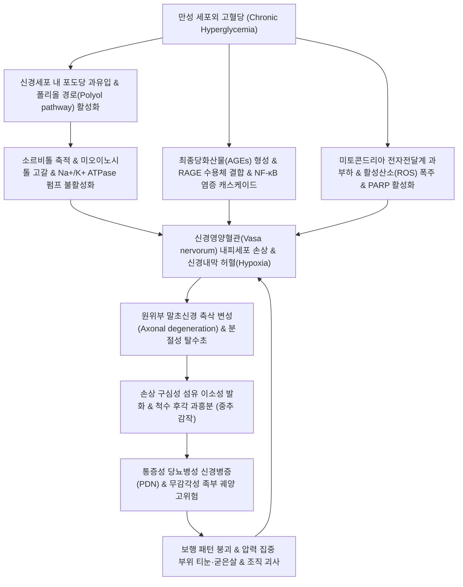

# 🩺 [[당뇨병성 말초신경병증]] (Diabetic Peripheral Neuropathy / 糖尿病性末梢神經病症, E10.4 / E11.4 / G63.2*)

> **핵심 3줄 요약 (Key Summary)**:
> - 📍 **병소 부위 & 해부·병태생리**: 만성 고혈당에 의한 소르비톨([[폴리올 경로]]) 축적, [[최종당화산물]](AGEs) 침착, 미세혈관 허혈(Endoneurial hypoxia) 및 [[활성산소]](ROS) 폭주로 인해 가장 긴 축삭부터 손상되는 **길이의존성 원위 대칭성 다발신경병증(Distal Symmetric Polyneuropathy, DSPN)**.
> - 🚩 **전형적 임상 양상 & 3대 징후**: 양측 족부에서 시작하여 상향하는 **장갑-양말형(Stocking-glove pattern)** 감각 둔마, 야간에 악화되는 작열통(Burning pain)·전격통(Electric shock)·이질통([[Allodynia]]), 아킬레스건 반사 소실 및 심부 감각 장애로 인한 보행 불안정.
> - 🛠️ **핵심 감별 검사 & 한·양방 다각적 치료 전략**: 10g 셈스-와인스타인 모노필라멘트([[Semmes-Weinstein Monofilament]]) 및 128Hz 음차 진동각 검사 선별, 1차 진통 약제([[프레가발린]] + [[둘록세틴]] 병용), 하지 경혈([[족삼리]]·[[삼음교]]·[[태충]]) 2~10Hz 전침([[전침]]) 및 [[TENS]](척수 관문조절 및 아데노신 A1 활성화), 보기활혈통락 한약([[황기계지오물탕]], [[보양환오탕]]).
> - ⚠️ **응급 의뢰 레드플래그 & 악화 요인**: 무통성 족부 궤양(Diabetic foot ulcer), 봉와직염, 골수염, 샤르코 관절병증([[Charcot joint]]) 의심 시 정형외과/족부클리닉 즉각 전원; 감각 소실 부위 직접 구법(뜸) 및 고온 온열기 사용 절대 금기(중증 3도 화상 및 괴사 유발 위험).

---

## 📌 목차
1. [질환 개요 & 해부학적 병태생리](#1-질환-개요--해부학적-병태생리)
2. [병태생리 메커니즘 & 생체역학적 악순환 네트워크](#2-병태생리-메커니즘--생체역학적-악순환-네트워크)
3. [임상 증상 & 이학적 검사(Physical Exam) 알고리즘](#3-임상-증상--이학적-검사physical-exam-알고리즘)
4. [감별 진단 매트릭스 (Differential Diagnosis)](#4-감별-진단-매트릭스-differential-diagnosis)
5. [한의 통합 치료 프로토콜 (침·약침·추나·한약)](#5-한의-통합-치료-프로토콜-침약침추나한약)
6. [재활 운동 & 생활습관 티칭 가이드](#6-재활-운동--생활습관-티칭-가이드)
7. [💡 사용자 진료실 핵심 필기 & 임상 노하우 (Melt-In 잔여 심화 집약)](#7--사용자-진료실-핵심-필기--임상-노하우-melt-in-잔여-심화-집약)
8. [출처 및 학술 참고 문헌 (References)](#8-출처-및-학술-참고-문헌-references)

---

## 1. 질환 개요 & 해부학적 병태생리

![[당뇨병성 신경병증_1.jpg|450]]
> [그림 1: ① 질환/병태생리 메디컬 일러스트 — 당뇨병성 말초신경병증의 길이의존성 축삭 변성 및 장갑-양말형(Stocking-glove) 감각소실]

### 1) 질환 정의 및 임상적 역학
당뇨병성 말초신경병증([[Diabetic peripheral neuropathy]], DPN)은 [[당뇨병]](Diabetes mellitus)의 가장 흔하고 치명적인 미세혈관 만성 합병증 중 하나이다. 제1형 및 제2형 당뇨병 환자의 약 50%에서 평생 동안 신경병증이 발생하며, 이 중 30~50%는 참을 수 없는 신경병증성 통증을 호소하는 **통증성 당뇨병성 말초신경병증([[PDN]], Painful DPN)**으로 진행한다. 통증은 수면 장애, 우울, 불안, 일상생활 장애를 유발하여 삶의 질을 극도로 저하시키며, 무통성 감각 저하 환자의 경우 외상을 인지하지 못해 당뇨발(Diabetic foot) 족부 궤양 및 하지 절단으로 이어지는 주원인이 된다.

### 2) 분류 체계
* **원위 대칭성 다발신경병증 (Distal Symmetric Polyneuropathy, DSPN)**: 전체 DPN의 80~90%를 차지하는 가장 흔한 형태로, 말초에서 중추로 상향 진행하는 대칭성 길이의존성 신경병증.
* **자율신경병증 (Diabetic Autonomic Neuropathy, DAN)**: 기립성 저혈압, 위마비(Gastroparesis), 당뇨병성 설사, 신경인성 방광, 발한 이상, 발기부전 등 동반.
* **근위부 당뇨병성 신경병증 (Diabetic Amyotrophy / Bruns-Garland 증후군)**: 골반대 및 대퇴사두근의 급격한 비대칭성 통증과 심한 근위축 유발.
* **단일신경병증 및 포착신경병증 (Mononeuropathy & Entrapment)**: 제3·6 뇌신경 마비, 정중신경의 [[수근관 증후군]], 척골신경 포착, 비골신경 마비의 발생률이 일반인 대비 2~3배 높음.

### 3) 해부학적 신경 섬유 침범 패턴
인체의 말초신경은 섬유의 굵기와 수초화 여부에 따라 기능이 나뉘며, 당뇨병성 신경병증은 이들 섬유를 순차적 또는 복합적으로 침범한다.
* **소구경 무수초/박수초 섬유 (Small Fibers, C-fibers & Aδ-fibers)**:
  * 초기 침범 표적: 통각(Pinprick), 온각(Temperature)을 전달하며 자율신경 기능을 담당.
  * 손상 시 증상: 표재성 작열통(Burning pain), 전격통, 무감각, 땀 분비 소실, 족부 피부 건조 및 균열.
* **대구경 유수초 섬유 (Large Fibers, Aβ-fibers & Aα-fibers)**:
  * 진행기 침범 표적: 진동각(Vibration), 위치감각(Proprioception), 가벼운 촉각, 심부 건반사를 전달.
  * 손상 시 증상: 먹먹함(Numbness), 걸을 때 모래밭이나 스펀지 위를 걷는 듯한 감각, 롬베르그([[Romberg]]) 양성 보행실조, 발목 건반사 소실.

---

## 2. 병태생리 메커니즘 & 생체역학적 악순환 네트워크

![[소갈지중소_인슐린_포도당_대사.png|450]]
> [그림 2: ② 관련 대사·병태생리 구조물 — 만성 고혈당에 의한 인슐린 저항성, 폴리올 대사 경로 및 최종당화산물(AGEs) 신경 손상 기전]

### 1) 대사적 및 혈관성 복합 병태생리
* **폴리올 경로(Polyol Pathway) 활성화**:
  * 세포 내 포도당 과잉 시 알도스 환원효소(Aldose reductase)에 의해 포도당이 소르비톨(Sorbitol)로 전환됨.
  * 삼투압 상승으로 세포 부종이 발생하고, NADPH 고갈로 체내 항산화제인 글루타치온(GSH) 합성이 억제되어 산화 스트레스가 극대화됨. 또한 미오이노시톨 고갈로 신경 세포막의 Na+/K+-ATPase 펌프 활성이 저하되어 신경전도 속도가 급감함.
* **최종당화산물([[최종당화산물]], Advanced Glycation End-products, AGEs) 축적**:
  * 단백질과 지질이 비효소적으로 당화되어 혈관 기저막과 콜라겐에 비가역적으로 침착됨.
  * RAGE(Receptor for AGEs)와의 결합은 전사인자 NF-κB를 활성화하여 전염증성 사이토카인(TNF-α, IL-6)을 분비시키고 혈관 내피 손상을 촉진함.
* **신경내막 미세순환 부전 (Endoneurial Microvascular Ischemia)**:
  * 신경에 산소와 영양분을 공급하는 신경영양혈관(Vasa nervorum)의 내피세포 비후 및 미세혈전 형성으로 국소 만성 허혈이 발생하여 신경 섬유가 질식사(Ischemic axonal dying-back)함.

### 2) 통증 발생 및 중추 감작 기전
* **말초 감작 (Peripheral Sensitization)**:
  * 손상된 C-섬유 말단에서 전압개폐성 나트륨 채널(Nav1.7, Nav1.8)의 비정상적 과발현 및 이소성 발화(Ectopic pacemaker activity) 발생.
* **척수 및 중추 감작 ([[중추 감작]], Central Sensitization)**:
  * 척수 후각(Dorsal horn)으로의 지속적 통각 유입은 시냅스 후 뉴런의 NMDA 수용체를 감작시키고, 칼슘 유입 증가(α2δ 전압개폐 칼슘 채널 상향 조절)를 유발함.
  * 뇌간에서 내려오는 하행성 세로토닌·노르에피네프린 억제 경로([[하행성 통증억제계]])의 기능 부전이 겹치면서 스치는 자극에도 극심한 통증을 느끼는 이질통([[Allodynia]])과 통각과민(Hyperalgesia)이 고착화됨.

---

## 3. 임상 증상 & 이학적 검사(Physical Exam) 알고리즘

### 1) 주요 임상 증상 및 특징적 패턴
* **대칭성 길이의존성 발현 (Dying-back pattern)**:
  * 인체에서 가장 긴 신경 축삭을 가진 발가락 끝에서부터 최초로 발현. 점차 발목, 하퇴부 무릎 아래까지 상향 진행하며, 하지의 증상이 무릎 높이에 도달할 무렵 상지의 손가락 끝에서도 증상이 시작되어 전형적인 **'장갑-양말형(Stocking-glove)'** 분포를 형성함.
* **양성 감각 증상 (Positive Symptoms, 통증성 PDN)**:
  * 발바닥이 화끈거리고 불에 타는 듯함(Burning pain).
  * 칼로 찌르거나 전기가 찌릿찌릿 통하는 느낌(Electric shock-like, Lancinating).
  * 이불 깃만 스쳐도 몹시 쓰라리고 아픔(Allodynia).
  * **야간 악화 경향**: 낮에는 활동으로 감각 입력이 분산되나, 밤에 휴식을 취하거나 취침 시 억제계 저하 및 집중으로 통증이 극심해져 불면증 초래.
* **음성 감각 증상 (Negative Symptoms, 무통성 결손)**:
  * 발바닥에 가죽이나 스펀지를 덧댄 것처럼 남의 살 같고 먹먹함(Numbness).
  * 뜨거운 온수나 못에 찔려도 통증을 전혀 인지하지 못함(무통성 외상).

### 2) 4대 필수 이학적 검사 프로토콜
* **10g 셈스-와인스타인 모노필라멘트 검사 (Semmes-Weinstein Monofilament, SWM)**:
  * **목적**: 보호 감각(Protective sensation) 소실 여부 선별.
  * **방법**: 10g 나일론 필라멘트를 모지 말절 배면, 제1·3·5 중족골두 족저면 등 10개 표준 지점에 수직으로 눌러 활처럼 휘어질 때까지(1~2초) 압박 후 감각 인지 여부 확인. 10곳 중 4곳 이상 불인지 시 족부 궤양 고위험군으로 판정.
* **128Hz 음차 진동각 검사 (128Hz Tuning Fork Test)**:
  * 대구경 Aβ 섬유 기능 평가. 128Hz 음차를 진동시켜 모지 내측 지간관절 골융기부에 대고 환자가 진동 소실을 인지하는 시간을 검사자의 엄지손가락 인지 시간과 대조(검사자보다 5초 이상 일찍 소실 시 이상).
* **아킬레스건 반사 (Achilles Reflex, S1)**:
  * 발목을 가볍게 배굴시킨 후 아킬레스건을 타진하여 족저 굴곡 반응 확인. DSPN 환자의 80% 이상에서 양측성 반사 저하 또는 완전 소실.
* **핀프릭(Pinprick) 및 온도감각 검사**:
  * 소구경 섬유 손상 평가. 소독된 핀과 차가운 알코올 솜을 족부 원위부에서 근위부로 접촉시키며 정상 감각 부위와의 경계선 확인.

---

## 4. 감별 진단 매트릭스 (Differential Diagnosis)

| 감별 질환 | 호발 원인 및 특징 | 통증 및 감각 분포 패턴 | 건반사 및 특이 소견 |
| :--- | :--- | :--- | :--- |
| **[[당뇨병성 말초신경병증]] (DSPN)** | 당뇨 만성 고혈당, 대사성 손상 | 양측 대칭성, 족부 원위부 시작(장갑-양말형) | 아킬레스건 반사 조기 소실, 10g 모노필라멘트 양성 |
| **[[요추신경근병증]] (L5/S1 Herniation)** | 추간판 탈출, 척추관 협착 | 편측성(비대칭), 특정 피부분절(L5: 모지배측, S1: 족외측) | [[하지직거상검사]](SLR) 양성, 요통 및 둔부 방사통 동반 |
| **비타민 B12 결핍증 (아급성 연합 변성)** | 위절제술, 메트포르민 장기 복용, 채식 | 양측 대칭성 감각 이상 + 심한 진동·위치감각 소실 | 롬베르그 징후 양성, 거대적혈구성 빈혈, 바빈스키 양성(척수 침범) |
| **알코올성 다발신경병증** | 만성 과음, 티아민(B1) 결핍 | 하지 원위부 통증 및 작열감, 비복근 극심한 압통 | 비복근 압통 저명, 비타민 B1 보충 시 호전 |
| **수근관/족근관 증후군 ([[족근관 증후군]])** | 국소 연부조직 터널 내 신경 포착 | 편측 또는 비대칭, 족저 내측/외측 국한 | [[티넬 징후]](Tinel sign) 양성, 족근관 국소 압통 |

---

## 5. 한의 통합 치료 프로토콜 (침·약침·추나·한약)

![[통증_신경전달경로_및_중추조절기전.png|450]]
> [그림 3: ③ 한의/양방 치료 시술점 및 신경조절 기전 — 척수 후각 관문조절 및 하행성 억제계 활성화를 유도하는 하지 혈위(족삼리·삼음교·태충) 전침·TENS 치료점]

### 1) 침구 및 전침 치료 (Electroacupuncture & TENS)
* **표적 하지 경혈 취혈**:
  * 족삼양경 및 족삼음경의 원위 혈위 복합 배혈: [[족삼리]](ST36), [[삼음교]](SP6), [[태충]](LR3), [[태계]](KI3), [[곤륜]](BL60), [[양릉천]](GB34), 현종(GB39), 팔풍혈(EX-LE).
* **전침 및 신경자극 파라미터**:
  * 전극 연결: [[족삼리]](ST36) - [[삼음교]](SP6) 쌍, [[현종]](GB39) - [[태충]](LR3) 쌍.
  * 주파수: **2~10Hz 연속 저주파** (통증이 격심한 야간 급성기에는 2/100Hz 밀보파 교차 통전).
  * 통전 시간: 30분, 주 2~3회, 최소 8~12주간 지속 시술.
* **신경생리학적 진통 및 재생 메커니즘**:
  * **관문조절설([[관문조절설]])**: 굵은 구심성 Aβ 섬유를 흥분시켜 척수 후각 교양질(Substantia gelatinosa)의 억제성 중간신경원을 자극, C-섬유 유입 차단.
  * **신경내인성 오피오이드 및 아데노신 분비**: 척수 내 메트-엔케팔린([[엔케팔린]])과 다이노르핀([[다이노르핀]]) A 농도를 유의하게 증가시키며, 국소 조직의 [[아데노신]] A1 수용체를 활성화하여 강력한 말초 진통 효과 발휘.
  * **신경영양혈류 개선**: 신경내막 혈류량을 증가시키고 혈관내피성장인자([[VEGF]]) 및 신경성장인자(NGF) 발현을 유도하여 왈러 변성 지연 및 축삭 재생 촉진.

### 2) 약침 요법 (Pharmacopuncture)
* **치료 타겟 및 약침 제제**:
  * **신바로약침 또는 중성어혈약침**: [[삼음교]], [[태계]], [[족삼리]] 등 주요 경혈 주위 피하 및 근막층에 0.5~1.0cc 주입. 국소 미세혈관 염증 억제 및 혈행 장애 개선.
  * **[[자하거약침]](Hominis Placenta)**: 만성 허혈성 신경 섬유의 영양 보충을 위해 양측 삼음교 및 태계에 1.0cc 분할 주입 (신경 영양 인자 공급).
  * ⚠️ 주의: 당뇨 환자는 미세혈관 순환 저하로 국소 감염 위험이 높으므로 시술 부위의 엄격한 무균 소독을 준수해야 함.

### 3) 한약 치료 (Herbal Medicine)
* **한의학적 병인병기**:
  * 소갈(消渴)의 병정이 만성화되어 기혈이 휴손(氣血虧損)되고 어혈과 습담이 낙맥을 차단(絡脈瘀阻)하여 발생하는 **'혈비(血痺)', '마목(麻木)', '위증(痿證)'**의 범주.
* **임상 다용 핵심 처방**:
  * **기허어혈(氣虛瘀血)형 (만성 통증 및 저림 최빈발)**:
    * [[황기계지오물탕]](황기, 계지, 백작약, 생강, 대조) 합 [[보양환오탕]](황기 60~120g, 당귀미, 적작약, 천궁, 도인, 홍화, 지룡).
    * 대량의 황기로 원기를 북돋우고 모세혈관 투과성을 개선하며, 활혈통락 약재로 신경외막 미세혈전을 용해.
  * **음허열성(陰虛熱盛) 및 작열통형 (야간 화끈거림 심한 환자)**:
    * 지백지황탕 합 사물탕 가 우슬, 목단피, 지모, 황백, 현삼: 신음(腎陰)을 보하고 허화(虛火)를 내리며 신경막 과흥분 안정.
  * **습담어조(濕痰瘀阻)형 (하지 무거움, 스펀지 보행감)**:
    * 이진탕 합 오적산 가 천련자, 현호색.

### 4) 양방 1차 통증 약물과의 병용 요법
* **α2δ 리간드 & SNRI 1차 약제**:
  * [[프레가발린]](Pregabalin 150~300mg/day) 또는 가바펜틴(Gabapentin): 척수 후각 칼슘 채널 차단.
  * [[둘록세틴]](Duloxetine 60mg/day): 하행성 세로토닌·노르에피네프린 재흡수 억제.
* **병용 치료의 임상적 의의**:
  * 약물 단독 요법 시 효과가 불충분하거나 어지럼, 졸림 등 부작용으로 증량이 불가능할 때 침·전침·한약 요법을 병행함으로써 통증 강도(NRS)를 추가로 50% 이상 감소시키고 약물 요구량을 감량할 수 있음.

---

## 6. 재활 운동 & 생활습관 티칭 가이드

### 1) 당뇨발(Diabetic Foot) 예방을 위한 족부 관리 수칙 — ★절대 지침
* **매일 족부 육안 관찰**: 거울을 이용하여 발바닥, 발가락 사이, 발뒤꿈치의 굳은살, 물집, 상처, 발적 여부를 매일 취침 전 점검.
* **올바른 보온 및 세족**: 미지근한 물(반드시 손목 안쪽으로 온도 확인)로 발을 씻고 발가락 사이를 완전히 건조시킴.
* **신발 및 양말 선택**: 맨발 보행 절대 금지, 통기성이 좋고 이음새가 없는 밝은색 면양말 착용, 발가락을 압박하지 않는 맞춤형 당뇨화 착용.

### 2) 보행 안정성 재활 운동
* **고유수용감각 자극 운동**: 발가락으로 수건 집어당기기, 바닥에 앉아 발목 배굴-저굴 펌핑 운동(종아리 혈류 펌프 활성화).
* **균형 훈련**: 안전 손잡이를 잡고 한 발 서기, 뒤꿈치 들기 운동을 통해 하지 감각 결손으로 인한 낙상 위험 방지.

---

## 7. 💡 사용자 진료실 핵심 필기 & 임상 노하우 (Melt-In 잔여 심화 집약)

### 1) 진료실 핵심 필기 및 심층 논문 분석 융합
* **전침 임상 RCT 결론의 해리와 올바른 해석 (축삭형 DSPN 연구)**:
  * NCV로 확진된 축삭형 DSPN 환자 대상 이중맹검 파일럿 RCT에서, **[[DN-4]] 등 신경병증 진단 도구는 전침 치료 후에도 점수 변화가 없었으나, 환자의 실제 통증 강도(NRS)는 진짜 전침군에서만 60% 안팎 급감(-58%~-63%)**함.
  * **원장의 통찰**: 전침은 손상된 신경의 물리적 범위나 구조적 손상을 하룻밤 사이에 되돌리는 것이 아니라, 척수 수준에서 **통증 지각 강도(Perception)**를 강력하게 조절하는 기전임. 환자에게 "신경이 다 살아났다"고 과장하지 말고 "통증과 저림 강도를 줄여 숙면을 취하게 하고 약물을 줄여나가는 치료"로 명확히 목표를 합의해야 신뢰가 형성됨.
* **TENS 네트워크 메타분석 (PMID 40253366)의 진료실 적용**:
  * 15편의 비침습 신경/뇌자극 NMA에서 대뇌 피질 rTMS 뇌자극은 유의성이 없었던 반면, **말초 TENS만이 통증(SMD -1.67)과 수면장애(-1.63) 모두에서 압도적 1위**를 기록함.
  * 이는 병변이 말초(축삭·수초)에 있으므로 중추 피질만 두드리는 것보다 말초 경혈(족삼리, 삼음교, 태충)을 직접 자극하는 침/전침/TENS의 표적-수준 일치성이 치료 성패를 결정함을 입증함.
* **약물 병용 시너지 전략**:
  * 프레가발린 단독으로 불면과 잔여 통증이 남는 환자에게 둘록세틴 저용량 병용과 함께 하지 전침(주 2회)을 병행하면, 약물 용량을 무리하게 올리지 않고도 부작용 없이 통증을 컨트롤할 수 있음.
* **⚠️ 진료실 절대 금기 안전 수칙**:
  * 감각이 둔마된 당뇨 환자에게 **직접구(직접 뜸), 간접구, 핫팩, 전기 찜질기**를 발에 직접 대어주는 행위는 **의료사고의 지름길**임. 환자가 뜨거움을 느끼지 못해 3도 화상을 입고 급속한 족부 괴사로 이어질 수 있음.
  * 전침 시술 시에도 환자의 주관적 느낌에만 의존해 강도를 올리지 말고, 근육이 부드럽게 씰룩거리는 최소 강도로 세팅해야 전기 화상을 방지할 수 있음.

---

## 8. 출처 및 학술 참고 문헌 (References)

* Effect of electroacupuncture for pain relief in diabetic distal symmetric polyneuropathy: a pilot randomized clinical trial. *BMC Complement Med Ther*. 2025. PMID: [41366387](https://pubmed.ncbi.nlm.nih.gov/41366387)
  * [연구 요약] 당뇨병성 원위 대칭성 다발신경병증(DSPN) 환자 대상 무작위배조시험에서 전침 치료가 척수 후각 신경세포 감작을 완화하고 NRS 통증 점수를 유의하게 감소시킴을 규명.
* Non-invasive brain and nerve stimulation for diabetic peripheral neuropathy: a systematic review and network meta-analysis. *J NeuroEngineering Rehabil*. 2025. PMID: [40253366](https://pubmed.ncbi.nlm.nih.gov/40253366)
  * [연구 요약] 15편의 RCT(1,139명) 네트워크 메타분석에서 하지 말초 신경자극(TENS)이 통증 강도(SMD -1.67) 및 수면 장애 개선에서 가장 우수한 중재 효과를 입증.
* Acupuncture for diabetic peripheral neuropathy: A systematic review and Bayesian network meta-analysis. *Medicine (Baltimore)*. 2025. PMID: [40797458](https://pubmed.ncbi.nlm.nih.gov/40797458)
  * [연구 요약] 당뇨병성 말초신경병증에 대한 침 치료의 임상적 유효성 및 전침의 신경전도속도(SNCV, MNCV) 개선 효과에 대한 베이지안 네트워크 메타분석.
* Traditional Chinese medicine for diabetic peripheral neuropathy: a network meta-analysis. *Front Endocrinol (Lausanne)*. 2025. PMID: [40937416](https://pubmed.ncbi.nlm.nih.gov/40937416)
  * [연구 요약] 황기계지오물탕 및 보양환오탕 등 보기활혈 계열 한약 처방의 당뇨병성 신경병증 통증 완화 및 미세혈류 순환 개선 네트워크 메타분석.
* Efficacy and safety of pregabalin combined with duloxetine in painful diabetic peripheral neuropathy: a systematic review and meta-analysis. *Front Endocrinol*. 2026. PMID: [41890179](https://pubmed.ncbi.nlm.nih.gov/41890179)
  * [연구 요약] 통증성 당뇨병성 신경병증 환자에서 프레가발린과 둘록세틴 병용 투여 시 통증 감소(MD -1.82) 및 반응률 개선 효과 분석.
