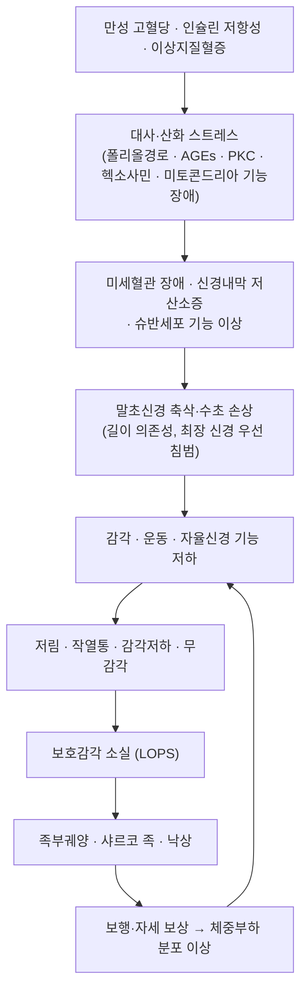

# 🩺 [[당뇨병성 신경병증]] (Diabetic Neuropathy / 糖尿病性神經病變, ICD-10 E11.42 · G63.2\* / KCD E11.4)

![[당뇨병성 신경병증_1.jpg|540]]
> [그림 1: ① 병태생리·영상 — 당뇨병성 신경병증_1]

![[당뇨병성 신경병증_1.jpg|540]]
> [그림 1: ① 병태생리·영상 — 당뇨병성 신경병증_1]

> **핵심 3줄 요약 (Key Summary)**:
> - 📍 **병소 부위 & 해부·병태생리**: 만성 고혈당에 의한 **길이 의존성(length-dependent) 말초신경 축삭 손상**이 핵심이다. 가장 긴 신경(족지→족부→하지 원위부)이 먼저 침범되어 [[족부]] 말초 감각신경, [[자율신경]], 후근신경절 및 슈반세포가 일차 표적이 되며, 폴리올 경로·[[AGEs]]·산화 스트레스·신경내막 미세혈관 허혈이 복합 작용한다.
> - 🚩 **전형적 임상 양상 & 3대 징후**: ① 양측 대칭성 말초 저림·작열통(Stocking-Glove 분포), ② 야간 악화되는 [[신경병성 통증]]과 접촉통증(allodynia), ③ 보호감각 소실(LOPS)로 인한 무통성 [[족부궤양]]·[[샤르코 족]]·낙상 위험 증가.
> - 🛠️ **핵심 감별 검사 & 한·양방 다각적 치료 전략**: [[Semmes-Weinstein 단일섬유 검사]](10 g, 5.07 monofilament), 128 Hz [[진동각 검사]], [[아킬레스 반사]], [[신경전도검사]](NCS)가 기본 세트이며, 한방에서는 [[족삼리]]·[[삼음교]]·[[태계]]·[[곤륜]]·[[팔풍]] 중심의 침·[[전침]], [[봉독약침]]·[[홍화약침]]·[[자하거약침]], 변증별 [[보양환오탕]]·[[황기계지오물탕]]·[[육미지황환]] 계열 처방과 족부 관리 교육을 병행한다.
> - ⚠️ **응급 의뢰 레드플래그 & 악화 요인**: 급성으로 뜨겁고 붉게 부어오르는 무통성 족부(급성 [[샤르코 족]]), 궤양의 감염·[[골수염]] 진행, 급속 진행성 비대칭 근력저하(당뇨병성 요천추신경총병증), 무증상 심근경색·기립성 저혈압 등 [[자율신경병증]] 적신호. <b>감각이 소실된 족부에 뜨거운 족욕·찜질·부항기 직접 자극·맨발 보행은 절대 금기.</b>

---

## 📌 목차
1. [질환 개요 & 해부학적 병태생리](#1-질환-개요--해부학적-병태생리)
2. [병태생리 메커니즘 & 생체역학적 악순환 네트워크](#2-병태생리-메커니즘--생체역학적-악순환-네트워크)
3. [임상 증상 & 이학적 검사(Physical Exam) 알고리즘](#3-임상-증상--이학적-검사physical-exam-알고리즘)
4. [감별 진단 매트릭스 (Differential Diagnosis)](#4-감별-진단-매트릭스-differential-diagnosis)
5. [한의 통합 치료 프로토콜 (침·약침·추나·한약)](#5-한의-통합-치료-프로토콜-침약침추나한약)
6. [재활 운동 & 생활습관 티칭 가이드](#6-재활-운동--생활습관-티칭-가이드)
7. [💡 사용자 진료실 핵심 필기 & 임상 노하우 (Melt-In 잔여 심화 집약)](#7--사용자-진료실-핵심-필기--임상-노하우-melt-in-잔여-심화-집약)
8. [출처 및 학술 참고 문헌 (References)](#8-출처-및-학술-참고-문헌-references)

---

## 1. 질환 개요 & 해부학적 병태생리

![[당뇨병성 신경병증_1.jpg|540]]
> [그림 1: Arterial ulcer peripheral vascular disease.jpg]

* **질환 정의 및 분류**:
  * **정의**: [[당뇨병]] 환자에서 다른 원인(알코올, 비타민 결핍, 요독증, 갑상선 질환, 약물, 유전성 등) 없이 발생하는 말초 및 자율신경의 손상성 질환군. 당뇨병의 **가장 흔한 미세혈관 합병증**이며, 임상적으로는 말초신경병증과 자율신경병증이 혼재되어 나타나는 경우가 많다.
  * **분류(스펙트럼)** — Dillon BR, Ang L(2024)이 정리한 최신 분류 축을 따르면 다음과 같이 크게 나눈다.
    1. **대칭성 다발신경병증(Distal Symmetric Polyneuropathy, DSPN)** — 전체 당뇨병성 신경병증의 대부분을 차지하는 최다 유형. 길이 의존성, Stocking-Glove 분포.
    2. **자율신경병증(Autonomic Neuropathy)** — 심혈관(기립성 저혈압, 안정시 빈맥, 무증상 심근경색), 위장관(위마비, 변비·설사), 비뇨생식기(방광 기능장애, 발기부전), 발한 이상, 저혈당 무감지증.
    3. **당뇨병성 요천추신경총병증(Diabetic Radiculoplexus Neuropathy, 구 Bruns-Garland 증후군 / 당뇨병성 근위축증)** — 비대칭성, 근위부 침범, 심한 통증, 체중 감소를 동반하는 급성 아형.
    4. **단일신경병증(Mononeuropathy) 및 다발단일신경병증** — [[손목터널증후군]](정중신경), 척골신경병, [[외안근마비]](제3·제6 뇌신경, 동공 보존형).
    5. **치료 유발성 신경병증(Treatment-induced Neuropathy of Diabetes)** — 급격한 혈당 개선(인슐린 급증량) 후 급성 통증성 신경병증 발생.
    6. **CIDP와의 중복(Overlap)** — 당뇨병 환자에서 [[만성 염증성 탈수초성 다발신경병증]]이 동반될 수 있어 치료 반응성 감별이 중요하다 (Zakin E, Abrams R, 2019).
  * **역학**: 당뇨병 이환 기간이 길수록 유병률이 증가하며, 2형 당뇨병에서는 **진단 시점에 이미 신경병증이 존재하는 경우가 적지 않다**(진단 전 무증상 고혈당 기간 반영). 구체적 유병률 퍼센트는 본 노트에 인용된 4편의 논문 원문에서 수치를 직접 확인하지 못했으므로 **근거 미확인**으로 표기한다. 임상적으로는 "당뇨병 환자의 상당수(교과서적으로 약 절반 내외)가 평생 한 번은 신경병증을 경험한다"는 수준으로 이해하고, 개별 환자에서는 선별검사 결과로 판단한다.
  * **선별검사 시점**: 2형 당뇨병은 **진단 시부터**, 1형 당뇨병은 **진단 후 5년경부터** 연 1회 신경병증 선별검사를 시행하는 것이 국제 지침의 통상 권고이며, 이후 매년 반복한다(Vinik AI, Nevoret ML, 2013; Zakin E, Abrams R, 2019). 정확한 권고 문구·등급은 원문 대조가 필요한 항목이다.
  * **한의학적 관점**: 당뇨병성 신경병증은 [[소갈]](消渴)의 만성 합병증으로서 **[[비증]](痺證)**과 **[[위증]](痿證)**의 범주에 대응시켜 접근한다. 즉 ① 기혈허·음허로 인한 근맥 실양(불영(不榮))과 ② 어혈·담습·습열이 경락을 저체(沮滯)한 두 축을 동시에 본다. 임상 변증은 陰虛火旺, 氣陰兩虛, 陰陽兩虛, 瘀血阻絡, 濕熱瘀阻 등으로 나누는 것이 일반적이다(구체적 변증 비율 통계는 **근거 미확인**).

* **관련 해부학적 구조물**:
  * **골격 및 관절**: [[족부]]의 [[중족골두]], [[족근관]](tarsal tunnel), [[거골하관절]], [[족관절]], 슬관절, [[요천추]]. 감각 저하로 인한 반복 미세외상이 중족골두 골절·[[샤르코 족]] 변형(중족궁 붕괴, 로커바텀 변형)으로 이어진다.
  * **근육 및 근막**: [[전경골근]], [[장지신근]], [[비복근]], [[가자미근]], [[족저근막]], [[후경골근]], 대퇴사두근(요천추신경총병증 시 근위부 위축). 특징적으로 **족관절 배굴근(전경골근)과 족지 신전근이 약화**되어 낙상 위험과 보행 패턴 이상(족하수 경향, 보폭 축소)을 유발한다.
  * **신경 및 혈관**: [[좌골신경]], [[경골신경]], [[비골신경]], [[비복신경]], [[족저내·외측신경]], [[후경골동맥]], [[족배동맥]]. **족지신경 → 족저신경 → 경골신경 → 좌골신경 순으로 역행성으로 침범 범위가 확대**되는 길이 의존성 패턴이 핵심이다. 자율신경계는 [[미주신경]], [[교감신경절]], [[내장신경]] 경로가 관여한다.

---

## 2. 병태생리 메커니즘 & 생체역학적 악순환 네트워크

### 1) 세포·분자 수준 병태생리 (대사 가설 + 혈관 가설)

* **폴리올(aldose reductase) 경로 항진**: 포도당이 알도즈 환원효소에 의해 **소르비톨 → 과당**으로 전환되어 신경 내 삼투압 상승 및 [[myo-inositol]] 고갈, Na⁺/K⁺-ATPase 활성 저하를 유발한다. 이는 신경전도 속도 저하와 직접 연결되는 고전적 기전이다(Dillon BR, Ang L, 2024; Vinik AI, Nevoret ML, 2013).
* **[[AGEs]](최종당화산물) 축적**: 단백질 비효소적 당화로 생성된 AGEs가 신경 구조단백·수초를 변성시키고, 수용체(RAGE)를 통한 산화 스트레스·염증 사이토카인 분비를 증폭시킨다.
* **산화 스트레스 및 미토콘드리아 기능장애**: 과잉 활성산소종(ROS)이 신경세포 사멸 경로를 활성화하고, 신경내막(endoneurial) 미세혈관의 혈류를 저해한다.
* **단백질키나아제 C(PKC) 경로 및 헥소사민 경로 활성화**: 혈관 투과성 증가, 혈관수축 물질 증가, 신경 혈류 저하를 초래한다.
* **신경내막 허혈 및 미세혈관병증**: vasa nervorum의 기저막 비후·폐쇄로 신경 내 저산소증이 발생하며, 이는 축삭 변성의 직접 원인이 된다. 이 때문에 당뇨병성 신경병증은 **[[당뇨병성 망막병증]], [[당뇨병성 신증]]과 같은 미세혈관 합병증 축**에서 함께 이해해야 한다.
* **슈반세포 및 신경영양인자(NGF, IGF-1 등) 신호 저하**: 수초 형성·재생 능력이 떨어지고, 손상 후 재수초화가 지연된다.

### 2) 해부학적 손상 패턴 — 왜 '발끝'부터 아픈가?

* **길이 의존성(length-dependent) 손상**: 세포체(후근신경절)에서 가장 먼 축삭 말단일수록 대사·영양 공급이 취약하여, **가장 긴 신경인 족지신경 말단부가 최초 침범점**이 된다. 그래서 증상은 항상 **발끝 → 발등 → 발목 → 하퇴 → 손끝** 순으로 상행하며, 이를 Stocking-Glove(장갑-양말) 분포라 한다.
* **대섬유(Aα, Aβ) 손상** → 진동각 저하, 고유수용감각 저하, 균형 실조, 아킬레스 반사 소실.
* **소섬유(Aδ, C) 손상** → 작열통, 찌르는 통증, 열·통각 저하, 자율신경 증상. **소섬유는 NCS에서 정상으로 나올 수 있어** 신경전도검사가 정상이라는 이유로 배제하면 안 된다.
* **자율신경 손상** → 무증상 심근경색, 기립성 저혈압, 위마비, 발한 이상, 저혈당 무감지증.

### 3) 생체역학적 연쇄 반응 (Kinetic Chain)

* **말초 감각 소실 → 고유수용 피드백 저하** → 자세 흔들림 증가, 보행 시 발끝 들어올림 감소(족하수 경향), 보폭 축소 → 낙상 위험 상승.
* **족관절 배굴근 약화 + 후경골근 약화** → 종골 내반·중족궁 붕괴 → 중족골두 압력 집중 → 압력성 궤양.
* **무통성 반복 미세외상** → 골절·탈구가 통증 없이 진행되어 **급성 [[샤르코 족]]**으로 발현.
* **상행 보상** → 슬관절·고관절·요추부 과부하 → 만성 [[요추 신경근병증]]·[[족저근막염]]과의 혼재 양상 발생.
* **신경 압박 취약 구역**: [[족근관]](경골신경), [[비골두]](총비골신경), [[손목터널]](정중신경). 당뇨병 환자에서는 정상인보다 압박성 단일신경병증 발생률이 높으므로, **대칭성 말초신경병증 + 국소 포착이 겹쳐 있는지** 항상 확인한다(Zakin E, Abrams R, 2019).

### 4) 악순환 요약

고혈당 → 대사·산화 스트레스 → 미세혈관 및 축삭 손상 → 감각 소실 → (무의식적 과부하·미세외상 반복) → 궤양·변형 → 자세 붕괴 → 추가 신경 압박·허혈 → 증상 악화의 **자기강화(self-reinforcing) 루프**를 형성한다. 치료의 핵심은 이 루프의 ①입력(혈당) 차단과 ②출력(족부 부하·통증) 차단을 동시에 하는 것이다.

---

## 3. 임상 증상 & 이학적 검사(Physical Exam) 알고리즘

### 1) 주소증 및 신경학적 증상

* **감각 이상 (Positive symptoms)**:
  * 발끝부터 시작되는 **저림(paresthesia)**, **화끈거림(burning)**, **전기 찌르는 통증(lancinating)**, **얼얼함, 개미 기어가는 느낌(formication)**.
  * **야간 악화**가 전형적이며, 이불·양말 등 가벼운 접촉에도 통증이 유발되는 **[[이질통]](allodynia)**, 자극이 과도하게 아프게 느껴지는 **과통증(hyperalgesia)**이 동반된다.
  * **무통 증상(Negative symptoms)**: 감각 저하, 무감각, "양말을 신은 느낌", 온도 감각 소실. **이쪽이 더 위험하다** — 통증이 없기 때문에 환자가 방치하고 궤양이 진행된다.
* **운동 장애**:
  * 말초: 족지 신전·배굴력 저하, 발가락 벌림 저하, 발 소근육 위축(갈퀴발 변형).
  * 근위부(요천추신경총병증 아형): **비대칭성 대퇴사두근 위축·무력**, 계단 오르기 곤란, 체중 감소. 통증이 매우 심하다.
  * 뇌신경(단일신경병증): 복시, 안검하수 — **동공은 보존**되는 것이 당뇨병성 제3뇌신경마비의 전형(압박성 원인과 감별 요점).
* **자율신경 증상**:
  * 심혈관: 기립성 어지럼·실신, 안정시 빈맥, **무통성 심근경색**.
  * 위장관: 조기 포만, 오심, 위마비, 변비 또는 야간 설사.
  * 비뇨생식기: 배뇨 곤란·잔뇨, [[발기부전]].
  * 기타: 무한증/다한증, 저혈당 무감지증.
* **혈관 증상과의 감별 포인트**: 당뇨병성 신경병증에서는 발이 **따뜻하고 맥박이 잡힐 수 있다**(감각신경병증 우세). 반대로 [[말초동맥질환]](PAD)은 냉감, 청색증, 맥박 약화, 족모 소실, 파행(claudication)이 특징이다. 두 질환은 **한 환자에 공존**할 수 있으므로 ABI와 맥박 촉지를 반드시 병행한다.

### 2) 필수 이학적 검사법 (Physical Examination)

| 검사 | 방법 | 양성 소견 / 진단적 가치 |
| :--- | :--- | :--- |
| [[Semmes-Weinstein 단일섬유 검사]] | 10 g(5.07) monofilament를 발바닥 4~10개 지점에 수직 압박 | 감지 실패 → **보호감각 소실(LOPS)**, 궤양·절단 고위험군. 임상에서 가장 실용적 |
| [[128 Hz 진동각 검사]] | 진동음차를 제1족지 원위부에 얹고 진동 감지 시간 비교 | 감소/소실 → 대섬유 기능 저하. 아킬레스 반사 소실과 함께 가장 재현성 높은 조합 |
| [[아킬레스 반사 검사]] | 망치로 아킬레스건 타진 | 소실이 가장 이른 객관적 징후 중 하나 |
| [[침자극 검사]](pinprick) | 안전핀으로 자극, 통각·날카로움 감지 | 소섬유 기능 평가. 진동각과 함께 시행 |
| 온도 감각 검사 | 차가운/따뜻한 금속 팁 또는 [[정량적 감각검사]](QST) | 소섬유 손상의 조기 지표 |
| [[이포위치 감지 검사]](Ipswich Touch Test) | 검사자가 검지·중지를 환자 제1·5족지에 1~2초 접촉 | 신발·양말 착용 상태에서 시행 가능한 간편 스크리닝 |
| [[신경전도검사]](NCS) | 감각·운동 신경 전도 속도 및 진폭 측정 | 감각신경활동전위(SNAP) 진폭 저하, 전도속도 지연, 길이 의존성 패턴. **소섬유 손상은 정상으로 나올 수 있음** |
| [[피부생검]](IENFD) | 족부 원위부 피부 생검으로 표피내 신경섬유 밀도 측정 | 소섬유 신경병증의 진단적 표준에 가장 근접. 연구 및 애매한 증례에서 활용 |
| [[각막공초점현미경]](CCM) | 각막 신경섬유 형태 관찰 | 비침습적 소섬유 평가 지표로 최근 연구에서 주목(Dillon BR, Ang L, 2024) |
| 자율신경 검사 | 기립성 혈압 측정, 심박변이도(HRV), QSART 등 | 자율신경병증 정량 평가 |

> **진료실 실전 팁**: 위 검사 세트(단일섬유 + 진동음차 + 아킬레스 반사 + 침자극)는 **양발을 모두, 신발·양말을 벗기고, 앉은 자세와 누운 자세에서 각각** 시행한다. 한쪽만 검사하거나 시각적 확인 없이 "저림 있으세요?"라고 묻는 문진만으로 끝내면 무증상 궤양을 놓친다.

---

## 4. 감별 진단 매트릭스 (Differential Diagnosis)

| 감별 질환 | 호발 병소 및 원인 | 주소증 차이점 | 특이적 이학적 검사 소견 |
| :--- | :--- | :--- | :--- |
| [[당뇨병성 신경병증]] (본 질환) | 양측 원위부 대칭성, 길이 의존성(족지→하지), 만성 고혈당 | 발끝부터 대칭성 저림·작열통, 야간 악화, 무통성 감각저하 | 10 g 단일섬유 감지 실패, 진동각 저하, 아킬레스 반사 소실, 발은 따뜻하고 맥박 촉지됨 |
| [[요추 신경근병증]] (추간판 탈출·척추관 협착) | 편측 신경근(L5, S1 등), 척추 분절 | **단측성·피부분절 분포**, 요통 동반, 기침·재채기 시 악화, 좌위에서 악화 | [[하지직거상검사]](SLR) 양성, 근력저하가 단일 근육분절에 국한, 감각저하는 피부분절 경계 명확 |
| [[만성 염증성 탈수초성 다발신경병증]](CIDP) | 근위+원위 동시 침범, 면역매개 탈수초 | 대칭성이나 **근위부도 침범**, 진행이 수주~수개월, 심부건반사 광범위 소실 | 광범위 무반사, 뇌척수액 단백-세포 해리, **면역치료(IVIG·스테로이드) 반응** — 당뇨병 환자에서 감별 중요(Zakin E, Abrams R, 2019) |
| [[비타민 B12 결핍성 신경병증]] | 후삭·측삭, 위절제·메트포르민 장기복용·채식 | 양측 대칭성이나 **고유수용감각·운동실조 우세**, 인지 변화 동반 가능 | 거대적혈구성 빈혈, [[롬버그 검사]] 양성, methylmalonic acid/homocysteine 상승 |
| [[알코올성 신경병증]] | 양측 원위부 대칭성 | 당뇨병성과 임상적으로 거의 구분 불가 | 음주력 문진, 간기능 이상, 티아민 결핍 동반 |
| [[요독성 신경병증]] | 만성콩팥병 환자, 양측 원위부 | 저림·하지불안증상, 투석 시작 후 악화 | 신기능 저하(eGFR), 크레아티닌 상승 |
| [[말초동맥질환]](PAD) | 대혈관 죽상경화, 하지 동맥 | **파행(claudication)**, 운동 시 장딴지 통증, 휴식 시 호전 | [[발목상완지수]](ABI) 저하, 족배·후경골 맥박 약화, 족모 소실, 피부 위축·궤양 경계 예리 |
| [[족근관 증후군]] | 족근관 내 경골신경 압박 | 발바닥 앞쪽·발가락 저림, 야간 악화 | [[티넬 징후]] 양성(족근관 부위), 발목 내번 시 유발 |
| [[모턴 신경종]] | 제3-4 중족골간 신경 | 특정 발가락(주로 3·4지) 국소 통증, 신발 착용 시 악화 | 중족골간 압박 시 통증 재현, 국소 Tinel |
| [[샤르코 족]] (신경병성 관절병증) | 당뇨병성 신경병증의 합병증 | 급성기에는 **통증이 경미한데 발이 뜨겁고 붉게 부어오름** | 국소 열감·부종·변형, 체중부하 X선/ MRI에서 골절·탈구 |

> **감별의 핵심 원칙**: "대칭성 · 원위부 · 발끝 시작 · 야간 악화 · 반사 소실"이면 당뇨병성 신경병증을 1순위로 두되, **① 편측/비대칭, ② 근위부 우세, ③ 급속 진행, ④ 운동 증상 우세** 중 하나라도 있으면 반드시 척추 질환·CIDP·신경총병증을 재검토한다.

---

## 5. 한의 통합 치료 프로토콜 (침·약침·추나·한약)

> ⚠️ **전제**: 아래 한의 치료 프로토콜은 (1) 혈당·혈압·지질 조절과 (2) 족부 보호(궤양 예방)라는 양방 표준관리를 **대체하지 않고 병행**하는 것을 원칙으로 한다. 한의 치료의 개별 효과크기·표준화 프로토콜에 대한 대규모 무작위대조시험 근거는 본 노트에 인용된 논문들에서 직접 확인되지 않았으므로, 해당 부분은 **근거 미확인(임상 경험 기반)**으로 명시한다.

* **침구 치료 (Acupuncture)**:
  * **기본 취혈**: [[족삼리]](ST36), [[삼음교]](SP6), [[태계]](KI3), [[곤륜]](BL60), [[태충]](LR3), [[양릉천]](GB34), [[현종]](GB39), [[해계]](ST41), [[팔풍]](EX-LE10), [[곡지]](LI11), [[합곡]](LI4).
  * **근위 취혈**: [[환도]](GB30), [[질변]](BL54), [[위중]](BL40), [[승산]](BL57), [[비골두]] 주변(총비골신경 자극점), [[족근관]] 주변.
  * **전침(Electroacupuncture) 세팅**: 저주파(2~10 Hz)는 국소 관류 개선·진통, 고주파(50~100 Hz)는 통각 억제 기전(GABA/엔케팔린 경로) 목적으로 선택하는 것이 통상적이다. 말초 감각이 소실된 부위에는 **자극 강도를 낮게 시작**하고 불필요한 고강도 자극을 피한다.
  * **자율신경 조절**: [[내관]](PC6), [[신문]](HT7), [[백회]](GV20) 병용으로 위마비·기립성 증상 완화를 도모한다.
* **약침 치료 (Pharmacopuncture)**:
  * **원칙**: 신경 포착점·근건 접합부·경혈 주입 3개 층위를 나누어 접근한다. 당뇨병 환자는 **감염 위험과 조직 회복 지연**이 있으므로 주입 전 피부 소독을 엄격히 하고, 궤양·홍반·열감 부위에는 절대 주입하지 않는다.
  * **추천 약침(임상 활용 기준)**:
    * [[봉독약침]]: 소염·진통 목적. **아나필락시스 병력 확인 필수**, 소량 피부반응 확인 후 진행.
    * [[홍화약침]] / [[중성어혈약침]]: 활혈거어, 국소 순환 개선 목적.
    * [[자하거약침]]: 만성기 신경 재생·기력 보충 목적으로 사용.
    * [[오공약침]], [[당귀약침]]: 근맥 이완·활혈 목적으로 병용.
  * **주입점**: [[족삼리]], [[삼음교]], [[태계]], [[곤륜]], [[팔풍]], [[양릉천]], [[환도]], [[질변]], [[위중]], 비복근 TP, 족저근막 기시부.
* **추나 치료 (Chuna Manipulation)**:
  * **적응**: 요천추·골반 정렬 이상, 슬관절·족관절 가동제한, 근막경선 단축이 신경 압박을 가중시키는 경우.
  * **기법**: ① 근막 이완(JS 수기) — 비복근·가자미근·족저근막·장경인대, ② 족관절·거골하관절 가동 추나, ③ 요추 신전/회전 추나로 요천추부 부하 분산, ④ 골반 교정.
  * **금기·주의**: **급성 [[샤르코 족]], 감염성 궤양, 골절 의심, 심한 무감각으로 통증 피드백이 없는 하지**에는 강한 추나·신연을 시행하지 않는다(환자가 손상 신호를 못 느낌). 자율신경병증이 심한 환자는 **기립성 저혈압** 발생 여부를 보며 체위를 서서히 변경한다.
* **한약 치료 (Herbal Medicine)**:
  * 변증별 처방 선택(전통적 활용 기준):

    | 변증 | 병기 특성 | 대표 처방 |
    | :--- | :--- | :--- |
    | 기음양허·어혈 | 초·중기, 저림 위주, 피로감 | [[보양환오탕]], [[황기계지오물탕]], [[보중익기탕]] 가미 |
    | 음허화왕 | 구갈·번열·야간 작열통 | [[육미지황환]] 가미, [[지백지황환]] |
    | 신양허·음양양허 | 만성, 냉감·무력감·야뇨 | [[팔미지황환]], [[제생신기환]] |
    | 기혈양허 | 위축·무력, 창백, 근력저하 | [[십전대보탕]], [[인삼양영탕]] |
    | 어혈저체 | 자통·자색·야간 고정통 | [[신통축어탕]], [[혈부축어탕]], [[도홍사물탕]] |
    | 습열어조 | 작열감·부종·화끈거림 | [[당귀점통탕]], [[이묘산]] 가미 |

  * **활혈거어제([[활혈거어제]])**는 어혈·미세순환 개선 축, **보익제([[보익제]])**는 만성기 신경 재생·기혈 보충 축으로 이해하고 병기에 따라 배합 비중을 조절한다.
  * **주의**: 항혈소판제·항응고제 복용 환자에서 활혈거어제를 장기 고용량 투여할 때는 출혈 경향을 모니터링한다. 당뇨병 처방과의 상호작용·혈당 변동 감시는 필수이며, 개별 처방의 혈당 강하 효과 크기는 **근거 미확인**이다.
* **양방 표준요법 병행 지식(참고)**:
  * 통증성 당뇨병성 말초신경병증에서 국제적으로 근거가 축적된 약물 축은 [[둘록세틴]](SNRI), [[프레가발린]]·[[가바펜틴]](α2δ 리간드), 삼환계([[아미트립틸린]]), 국소 [[캡사이신]]·[[리도카인 패치]], 필요 시 트라마돌·탭ентадол 계열 등이며, 난치성에는 [[척수자극술]]도 고려된다(Dillon BR, Ang L, 2024; Rosenberger DC, Blechschmidt V, 2020). **약물 간 병용·용량은 반드시 처방 의료진 판단을 따른다.**
  * 병태생리 표적 보조요법으로 [[알파리포산]], [[벤포티아민]] 등이 연구되어 왔으나, 국내 허가·보험·용량 기준과 근거 수준은 별도 확인이 필요하다(**근거 미확인 항목 존재**).
  * **핵심**: 증상 조절 약물은 통증을 줄일 뿐 신경 손상을 되돌리지 못하므로, **혈당 조절이 모든 치료의 기반**이다. 다만 혈당을 지나치게 급격히 개선하면 오히려 **치료 유발성 신경병증**이 발생할 수 있어 감량 속도 조절이 필요하다(Zakin E, Abrams R, 2019).

---

## 6. 재활 운동 & 생활습관 티칭 가이드

* **이완 및 스트레칭 (Stretching)**:
  * [[비복근]]·[[가자미근]] 벽 밀기 스트레칭: 30초 × 3회, 하루 2회. 발목 배굴 제한을 완화하여 보행 시 전족부 압력을 줄인다.
  * [[족저근막]] 스트레칭: 앉아서 수건으로 전족부를 당겨 30초 유지.
  * 대퇴후면·장딴지 근막 이완: 좌골신경 긴장도를 낮춰 신경 활주 운동의 전처치로 활용.
* **강화 및 안정화 운동 (Strengthening)**:
  * **족관절 배굴근 강화([[전경골근]])**: 벽에 기대 발끝 들기, 저항 밴드 사용. 낙상 예방의 핵심.
  * **족지 굴곡·신전 및 발 소근육**: 수건 집기, 구슬 집기, 발가락 벌리기.
  * **심부 안정화**: 브리징, 데드버그, 복횡근 활성화 — 보행 시 골반 안정.
  * **균형 훈련**: 한 발 서기(단계별 난이도 상향), [[태극권]] — 당뇨병성 신경병증 환자의 균형·낙상 위험 감소에 연구적으로 주목받는 운동 형태(Dillon BR, Ang L, 2024 계열의 재활 접근). 시각 의존을 줄이기 위해 눈 감고 서기는 **반드시 지지대를 잡고** 시행.
* **신경 활주 운동 (Neurodynamics)**:
  * **좌골신경 슬라이더/텐서**: 앉아서 무릎 신전 + 발목 배굴 + 목 굴곡 조합을 천천히 반복(통증 유발 없이 10회 × 2세트). 신경 자체의 유착·긴장을 줄이고 하지 저림 완화를 도모.
  * **족근관 신경 활주**: 발목 배굴-족저 굴곡을 부드럽게 반복.
  * 원칙: **저림이 원위부로 퍼지는 순간 즉시 중단**(신경 자극 과부하 신호).
* **일상생활 자세 및 족부 관리 티칭 (Ergonomics & Foot Care)**:
  * **매일 발 검사**: 거울 또는 가족의 도움으로 발바닥·발가락 사이·발뒤꿈치까지 확인. 못·돌·이물질, 물집, 색 변화, 상처 확인.
  * **맨발 보행 절대 금지**: 실내에서도 슬리퍼 착용. 여름철 해변·수영장·뜨거운 모래·아스팔트 주의.
  * **신발**: 발가락이 눌리지 않는 넓은 앞코, 봉제선 없는 내부, 착용 전 신발 안 이물질 확인, 새 신발은 짧게 여러 번 길들이기.
  * **온열 자극 금지**: 뜨거운 족욕, 찜질팩, 발난로, 전기장판 직접 접촉 — **감각 소실로 화상 위험**. 온도는 반드시 팔꿈치나 손으로 확인.
  * **발톱 관리**: 일자로 자르고 모서리 파고들지 않게, 시술은 전문가에게.
  * **혈당·혈압·지질·금연**: 신경병증 진행 억제의 유일한 근본 축. 금연은 말초 순환 개선에 필수.
  * **알코올 제한**: 알코올성 신경병증 중복 위험.
  * **낙상 예방**: 야간 조명, 욕실 미끄럼 방지 매트, 침대 옆 조명, 카펫 고정.
  * **스트레스 관리**: 통증 만성화에 심리적 요인이 크게 작용하므로 수면·정서 관리 병행(Rosenberger DC, Blechschmidt V, 2020).

---

## 7. 💡 사용자 진료실 핵심 필기 & 임상 노하우 (Melt-In 잔여 심화 집약)

* **상부 섹션에 미처 다 담지 못한 고유 원문 필기**:
  * **"통증이 심한 환자가 아니라, 통증을 못 느끼는 환자가 더 위험하다."** 진료실에서 반복 확인되는 핵심 명제. 작열통을 호소하며 걸어 들어오는 환자는 오히려 관리가 되고 있고, "발이 좀 둔해요"라고 담담히 말하는 환자가 이미 궤양 전단계인 경우가 많다.
  * **소섬유 vs 대섬유 손상의 진료실 감별 직관**: 진동음차·반사는 정상인데 작열통·이질통이 심하면 **소섬유 우세 손상**(NCS 정상이어도 배제 불가). 반대로 통증은 없는데 균형이 흔들리고 진동각이 떨어져 있으면 **대섬유 우세 손상**(낙상·샤르코 위험 우선 관리).
  * **"당뇨 조절이 갑자기 좋아지면서 통증이 심해졌다"**는 병력은 치료 유발성 신경병증을 시사하는 중요 단서. 혈당이 좋아졌는데 환자가 더 아파하면 "조절이 잘못됐다"고 설명하지 말고 이 아형을 먼저 떠올린다.
  * **좌우 비대칭 + 근위부 위축 + 체중 감소**는 요천추신경총병증의 삼징(三徵). 이 조합은 침·약침 반응이 느리고 회복 기간이 길며, 양방 신경과 협진 우선순위가 높다.
  * **한의학적으로는 "비(痺)와 위(痿)의 동시 발현"**으로 정리한다. 저림·통증(痺)이 주소증이어도 근위축·무력(痿)이 이미 진행 중인 경우가 많아, 어혈거어만 반복하면 기혈 보익 축이 빠져 회복이 정체된다. **활혈과 보익의 비중을 병기에 따라 바꾸는 것이 임상 노하우**.
* **진료실 실전 감별 & 치료 노하우**:
  * **1. 실전 문진 체크리스트 (내원 즉시 8문)**
    1. 증상이 **양발 대칭**인가, **한쪽만**인가? (비대칭 → 척추·신경총병증 감별)
    2. 어디서 **가장 먼저** 시작되었는가? (발끝 시작 → 길이 의존성)
    3. **밤에 더 심한가**? (신경병성 통증의 전형)
    4. **이불·양말 접촉**이 아픈가? (이질통)
    5. **신발 안에서 이물감·상처를 못 느낀 적**이 있는가? (LOPS, 궤양 위험)
    6. **어지럼·실신·소화불량·발기력 저하**가 있는가? (자율신경병증)
    7. **최근 혈당이 급격히 좋아졌는가**? (치료 유발성 신경병증)
    8. **당뇨 이환 기간 / HbA1c / 복용 약물**(메트포르민 장기복용 시 B12 결핍 감별)
  * **2. 치료 순서 및 손맛 노하우**
    * **순서 원칙**: ① 하지 말초 순환·근막 이완(비복근·족저근막 JS) → ② 요천추·골반 정렬 정리 → ③ 원위부 경혈 자침(족삼리·삼음교·태계·곤륜·팔풍) → ④ 전침 연결 → ⑤ 약침(마지막, 환자 안정 상태에서).
    * **약침 주입 각도**: 八風穴은 족배부 피부가 얇고 부종이 흔하므로 **15~30° 얕은 자입**, 흡입 확인 후 0.05~0.1 cc 소량. 足三里·三陰交는 直刺 0.5~1촌. **당뇨 환자는 피하조직 회복이 느려 주입량을 정상인의 절반 이하로 줄이는 것이 안전**.
    * **전침 주파수 선택**: 작열통·이질통이 주소증이면 2~4 Hz 위주, 둔한 저림·냉감이 주소증이면 2 Hz + 국소 온감 유도. 강도는 "찌릿하지 않고 은은하게 울리는" 수준까지.
    * **환자 체위 팁**: 추나는 복와위에서 시작해 측와위로 전환. **자율신경병증 환자는 급격한 체위 변경 시 기립성 저혈압이 오므로 상체를 단계적으로 올리고 1~2분 앉아 있게 한 뒤 일으킨다.**
    * **절대 금기 리마인드**: 급성 샤르코 족(열감·부종·홍반) 의심 시 해당 족부에 침·약침·추나·부항 일체 금지 → 즉시 체중부하 금지 + 영상 검사 의뢰. 궤양 부위 직접 자극 금지.
  * **3. 환자 티칭 스크립트 (그대로 읽어줄 수 있는 멘트)**
    * "발이 저린 건 신경이 오래 나빠졌다는 신호입니다. 이 신경은 한 번 나빠지면 천천히만 돌아오기 때문에, **혈당을 잡는 것이 치료의 절반, 발을 지키는 것이 나머지 절반**입니다."
    * "가장 위험한 건 **아픈 발이 아니라 안 아픈 발**입니다. 통증을 못 느끼면 상처가 나도 모르고, 그 상처가 곪아서 발을 잃는 경우가 생깁니다. **매일 자기 전 거울로 발바닥을 확인**해 주세요."
    * "**뜨거운 족욕·찜질은 금지**입니다. 온도를 못 느껴 화상을 입어도 모릅니다. 따뜻하게 하실 땐 발이 아니라 손이나 팔꿈치로 온도를 먼저 확인하세요."
    * "**맨발로 다니지 마세요.** 집 안에서도 슬리퍼를 신고, 신발을 신기 전에 손을 넣어 이물질을 확인해 주세요."
    * "담배는 끊으셔야 합니다. 발로 가는 혈관이 좁아지면 신경 회복이 더 느려집니다."
    * "혈당을 갑자기 확 떨어뜨리면 **오히려 통증이 심해지는 경우**도 있습니다. 급하게 바꾸지 말고 주치의와 상의해 천천히 조절하세요."
  * **4. 재발·악화 감시 체크(다음 내원 시 확인)**
    * 발의 **색·온도·부종·상처 유무**를 그래프로 기록해 변화 추세 판단.
    * 통증 **NRS·야간 각성 횟수·수면시간** 3항목으로 치료 반응 추적.
    * 균형: 한 발 서기 유지 시간 변화.
    * 자율신경: 누운 자세→선 자세 혈압 차이, 배뇨·소화 증상 변화.

---

## 8. 출처 및 학술 참고 문헌 (References)

1. Dillon BR, Ang L (2024). *Spectrum of Diabetic Neuropathy: New Insights in Diagnosis and Treatment*. **Annu Rev Med**. PMID: 38285516
   - **[연구 요약]**: 당뇨병성 신경병증의 스펙트럼(대칭성 다발신경병증, 자율신경병증, 요천추신경총병증, 단일신경병증, 치료 유발성 신경병증 등)을 정리하고, 진단 접근(선별검사, 단일섬유·진동각·NCS·피부생검·각막공초점현미경 등)과 치료의 최신 지견을 제시한 종설. 병태생리(폴리올 경로, AGEs, 산화 스트레스, 미세혈관 허혈)와 증상 조절 전략을 아우른다.
2. Vinik AI, Nevoret ML (2013). *Diabetic neuropathy*. **Endocrinol Metab Clin North Am**. PMID: 24286949
   - **[연구 요약]**: 당뇨병성 신경병증의 분류·역학·병태생리·진단·치료를 체계적으로 서술한 고전적 임상 종설. 길이 의존성 손상 패턴, 자율신경병증 평가, 통증성 신경병증 관리 원칙을 폭넓게 다룬다.
3. Rosenberger DC, Blechschmidt V (2020). *Challenges of neuropathic pain: focus on diabetic neuropathy*. **J Neural Transm (Vienna)**. PMID: 32036431
   - **[연구 요약]**: 신경병성 통증, 특히 당뇨병성 신경병증 통증의 기전(말초·중추 감작, 이온통로 변화)과 약물학적·비약물학적 치료의 난제를 정리한 종설. 만성 통증의 심리·수면 요인 관리 필요성을 강조한다.
4. Zakin E, Abrams R (2019). *Diabetic Neuropathy*. **Semin Neurol**. PMID: 31639839
   - **[연구 요약]**: 임상 실전 중심의 당뇨병성 신경병증 개요. 대칭성 다발신경병증과 CIDP·압박성 단일신경병증의 감별, 치료 유발성 신경병증, 혈당 조절 속도 조절의 임상적 함의를 다룬다.

> **참고**: 본 노트의 한의학적 변증·처방·경혈·시술 프로토콜은 임상 활용 관행을 정리한 것으로, 위 4편의 서양의학 논문에서 직접 검증된 내용이 아니다. 해당 부분의 효과 크기·표준화 근거는 **근거 미확인(임상 경험 기반)**으로 간주하고, 환자별 양방 표준관리(혈당 조절·족부 관리)를 반드시 병행한다.