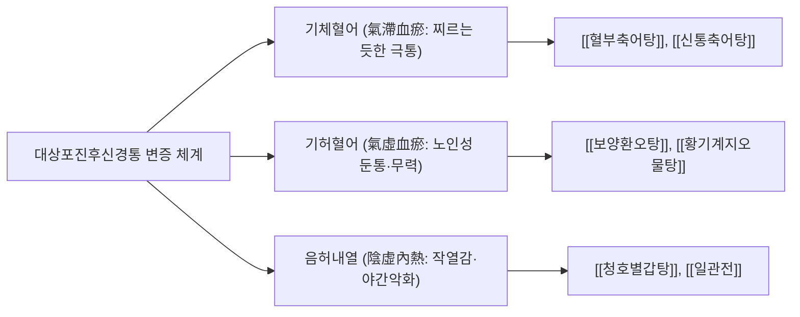

# ⚡ 대상포진후신경통 (Postherpetic Neuralgia, PHN)

> **핵심 요약 (Key Summary)**:
> - **정의**: 수두대상포진바이러스(VZV)에 의한 급성 대상포진 피부 발진이 완전히 치유(가피 형성 및 탈락)된 이후에도 해당 **피부분절(Dermatome)에 3개월(90일) 이상 지속되는 극심한 신경병증성 만성 통증 증후군**.
> - **주요 원인 및 위험인자**: 척수 후근신경절(DRG) 및 척수 후각 신경세포의 바이러스성 괴사와 비가역적 섬유화. **60세 이상 고령, 급성기 극심한 통증 및 광범위 발진, 전구 통증 동반 환자**에서 발생 위험이 폭증.
> - **통증 양상**: 칼로 베는 듯한 작열통(Burning pain), 전기가 통하는 듯한 찌릿찌릿한 전격통(Stabbing/Shooting), 그리고 옷깃만 스쳐도 비명을 지르는 **이질통(Allodynia)** 및 통각과민(Hyperalgesia)이 3대 특징.
> - **서양의학 치료**: 1차 표준 약제로 **가바펜티노이드([[프레가발린]], 가바펜틴)**, **SNRI([[둘록세틴]])**, 삼환계 항우울제(아미트립틸린) 및 $5\%$ 리도카인 국소 패치를 병용.
> - **한의학 치료**: 급성기 습열독(濕熱毒) 이후 기체어혈(氣滯瘀血) 및 간신음허(肝腎陰虛)로 변증하여 [[혈부축어탕]], [[보양환오탕]], [[신통축어탕]], [[청호별갑탕]]을 투여하고, **협척혈(EX-B2) 및 배수혈 저주파 전침([[전침]], 2026년 JAMA Neurology 다기관 RCT 근거)**과 봉약침·자하거 약침을 병행.

---

## 📌 목차
1. [개요 및 병태생리 (Pathophysiology & Classification)](#1-개요-및-병태생리-pathophysiology--classification)
2. [발생 기전 및 해부학적 연계 (Mechanism & Anatomical Link)](#2-발생-기전-및-해부학적-연계-mechanism--anatomical-link)
3. [진단 및 임상 평가 (Clinical Evaluation & Differential Diagnosis)](#3-진단-및-임상-평가-clinical-evaluation--differential-diagnosis)
4. [현대 의학적 치료 원칙 (Western Medical Management)](#4-현대-의학적-치료-원칙-western-medical-management)
5. [한의학적 변증 및 통합 치료 프로토콜 (TCM Pattern Identification & Integrative Protocol)](#5-한의학적-변증-및-통합-치료-프로토콜-tcm-pattern-identification--integrative-protocol)
6. [생활 관리 및 환자 교육 (Lifestyle & Patient Guidance)](#6-생활-관리-및-환자-교육-lifestyle--patient-guidance)
7. [진료실 임상 팁 & 노트 (Clinical Pearls & Practice Notes)](#7-진료실-임상-팁--노트-clinical-pearls--practice-notes)
8. [참고 문헌 (References)](#8-참고-문헌-references)

---

## 1. 개요 및 병태생리 (Pathophysiology & Classification)

대상포진후신경통(PHN)은 대상포진의 가장 흔하고 고통스러운 만성 합병증이다. 대상포진 환자의 약 $10\sim20\%$가 PHN으로 이행되며, 70세 이상 고령 환자에서는 절반 가까이($50\%$)가 이환된다. "스치기만 해도 살이 타는 것 같다"는 극심한 통증으로 인해 수면 장애, 우울증, 불안증을 수반하며 환자의 삶의 질을 파탄시키는 대표적인 난치성 질환이다.

![[대상포진_흉부_피부분절_수포성발진_임상소견.png|540]]
> [그림 1: ① 병태생리·영상 — 흉부 T4-T5 피부분절(Dermatome)을 따라 편측 띠 모양으로 발생한 대상포진 수포성 발진 및 신경병증성 피부 병변 실제 임상 소견 (Wikimedia Commons · Fisle, CC BY-SA 3.0)]

### 1) 질환의 기본 특성 및 고위험군

| 항목 | 내용 및 세부 판정 기준 |
| :--- | :--- |
| **진단 기준 시점** | 대상포진 피부 발진 발생 후 **최소 90일(3개월) 이상 지속**되는 신경병증성 통증 |
| **주요 호발 부위** | 흉부 늑간신경 피부분절($50\sim60\%$), 삼차신경 안신경 분지(V1, $15\sim20\%$), 경추부 및 요천추부 |
| **3대 고위험 인자** | 1. **고령 (60세 이상)**: 면역 노화로 인한 심각한 신경절 손상<br>2. **급성기 중증 통증**: 발진 초기 통증 강도가 VAS 7점 이상인 경우<br>3. **광범위한 발진 및 피부 괴사**: 바이러스 부하(Viral load)가 높음을 시사 |
| **통증의 3대 요소** | 지속적 자발통(작열감), 발작성 전격통(칼로 찌름), 유발통(**이질통 Allodynia**) |

---

## 2. 발생 기전 및 해부학적 연계 (Mechanism & Anatomical Link)

```
[대상포진후신경통의 말초 및 중추 감작(Central Sensitization) 캐스케이드]

              수두대상포진바이러스(VZV) 재활성화 (T세포 면역 저하)
                                       │
                                       ▼
        척수 후근신경절(Dorsal Root Ganglion, DRG) 내 폭발적 바이러스 증식
                                       │
        ┌──────────────────────────────┴──────────────────────────────┐
        ▼                                                             ▼
[말초 신경 손상 및 이소성 발화]                               [중추 신경계 구조적 개형]
  - 대형 유수신경섬유(Aβ, Aδ) 괴사 및 탈수초화                  - 척수 후각 교질(Substantia gelatinosa) 손상
  - 손상된 C-통각섬유 말초에서 자발적 방전                     - 억제성 개재신경원(GABA/Glycine) 세포 사멸
    (이소성 발화, Ectopic pacemaker 생성)                        - 하행성 통증억제계(DLF) 기능 붕괴
        │                                                             │
        ▼                                                             ▼
[말초 감작 (Peripheral Sensitization)]                         [중추 감작 (Central Sensitization)]
  - 볼티지 의존성 칼슘/나트륨 채널 과발현                      - Aβ 촉각 섬유가 C섬유 통각 층판으로 비정상 발아
    (Nav1.7, Nav1.8, α2δ 칼슘채널)                              (Sprouting into Lamina II)
  - 기계적 자극 역치 급락                                      - NMDA 수용체 인산화 및 과흥분성 획득
        │                                                             │
        └──────────────────────────────┬──────────────────────────────┘
                                       │
                                       ▼
                     [난치성 신경병증성 통증 복합체]
          • 작열통 (Burning pain): C섬유 손상 및 자발 발화
          • 기계적 이질통 (Mechanical Allodynia): 가벼운 스침(Aβ)이 통증(C)으로 오인 전달
          • 침해수용 과민 (Hyperalgesia): 미세한 통증 자극이 극통으로 증폭
```

![[대상포진_후근신경절_바이러스재활성화_신경손상_도해.png|540]]
> [그림 2: ② 해부 구조물 — 수두대상포진바이러스(VZV)가 척수 후근신경절(DRG)에 잠복해 있다가 면역 저하 시 감각신경 축삭을 따라 역행하여 피부분절 신경을 파괴하고 척수 후각 신경을 감작시키는 병태 도해 (Wikimedia Commons · NIAID/NIH, Public Domain)]

### 1) 척수 후근신경절(DRG) 파괴 및 억제성 개재신경원(Interneuron) 소실
VZV는 척수 후근신경절(DRG)과 삼차신경절의 감각 신경세포체에 잠복한다.
- 재활성화 시 바이러스 증식으로 신경절 내 대식세포와 림프구가 침윤하여 극심한 출혈성 괴사와 섬유화가 발생한다.
- 척수 후각의 제II교질판(Substantia gelatinosa of Rolando)에 위치한 **GABA성 및 글라이신성 억제성 개재신경원이 파괴**된다.
- 정상 상태에서는 촉각 신호가 들어왔을 때 통증 신호를 억제하는 '관문 조절(Gate control)' 기전이 작동하지만, 억제성 신경원이 사라짐으로써 통증 억제 브레이크가 완전히 고장 난 상태가 된다.

### 2) A$\beta$ 섬유의 비정상적 신경 발아(Aberrant Sprouting)와 이질통(Allodynia)
PHN 환자 통증의 가장 특징적이고 고통스러운 현상은 **이질통(Allodynia)**이다.
- 정상적으로 가벼운 스침, 바람, 옷깃과의 접촉 등 무해한 촉각을 전달하는 신경은 굵은 **A$\beta$ 유수신경섬유**이다.
- 통증을 전달하는 얇은 C섬유가 괴사되어 소실되면, A$\beta$ 섬유 말단이 원래 종말해야 할 척수 후각 심부(Lamina III~IV)를 벗어나 C섬유가 있던 표층(Lamina II)으로 비정상적인 측지 발아(Sprouting)를 일으킨다.
- 이로 인해 뇌에서는 **"단순한 옷깃의 스침"을 "칼로 살을 베는 듯한 극심한 화상 통증"으로 오인하여 인식**하게 된다.

---

## 3. 진단 및 임상 평가 (Clinical Evaluation & Differential Diagnosis)

### 1) 임상 진단 기준 및 필수 감별
대상포진 병력이 뚜렷하고 특징적인 피부분절 통증이 3개월 이상 지속되면 임상적으로 확진한다:
- **감별 진단**:
  - 당뇨병성 말초신경병증([[당뇨병성 말초신경병증]]): 양측 대칭성, 사지 말단 장갑-양말(Glove-stocking) 분포.
  - 신경근병증(Radiculopathy): 추간판 탈출증이나 척추관 협착증에 의한 신경근 압박 (피부 변화 및 작열통 부재, 자세에 따른 악화).
  - 복합부위통증증후군(CRPS): 부종, 피부 체온 변화, 발한 이상 등 자율신경계 이상 동반.

### 2) 신경병증성 통증 선별 도구 및 평가 척도
- **DN4 (Douleur Neuropathique 4 Questions)**: 10개 문항 중 4점 이상 시 신경병증성 통증 확진 (민감도 $83\%$, 특이도 $90\%$).
  - 1부(환자 호소): 작열감, 시린 느낌, 전기 통하는 느낌.
  - 2부(동반 감각): 저림, 바늘로 찌름, 둔한 감각, 가려움.
  - 3부(신체 검진): 솔 접촉 시 통증(이질통), 핀 압박 시 감각 저하.
- **painDETECT 설문지**: $0\sim38$점 중 19점 이상 시 신경병증성 성분 양성.
- **수면 및 정서 평가**: 불면증 척도(ISI), 우울증 척도(PHQ-9)를 병행 평가하여 통증으로 인한 이차적 정신과적 피폐도를 측정.

---

## 4. 현대 의학적 치료 원칙 (Western Medical Management)

### 1) 1차 권고 경구 약물 치료 (First-Line Pharmacotherapy)

| 약제 분류 | 대표 약물 | 권고 용량 및 투약법 | 주요 작용 기전 및 부작용 |
| :--- | :--- | :--- | :--- |
| **가바펜티노이드** | **[[프레가발린]] (Pregabalin)** | $75\text{ mg}$ BID로 시작 $\rightarrow$ $150\sim300\text{ mg}$ BID 유지 (최대 $600\text{ mg/일}$) | 전압의존성 칼슘채널 $\alpha_2\delta$ 소단위 결합 $\rightarrow$ 흥분성 신경전달물질(Glutamate, Substance P) 유리 차단. 부작용: 어지럼증, 졸림, 말초 부종. |
| | **가바펜틴 (Gabapentin)** | $300\text{ mg}$ QD 취침 전 시작 $\rightarrow$ $300\text{ mg}$ TID 증량 (최대 $3,600\text{ mg/일}$) | 작용 기전 동일하나 생체이용률이 포화성을 보여 용량 적정에 수주 소요됨. |
| **SNRI** | **[[둘록세틴]] (Duloxetine)** | $30\text{ mg}$ QD 1주 복용 후 $60\text{ mg}$ QD로 증량 | 세로토닌·노르에피네프린 재흡수 차단 $\rightarrow$ 하행성 통증억제계 강화. 오심, 불면 주의. |
| **TCA** | **아미트립틸린 (Amitriptyline)** | $10\sim25\text{ mg}$ 취침 전 저용량 투여 (최대 $75\text{ mg}$) | 강력한 진통 효과 있으나 항콜린성 부작용(구갈, 변비, 기립성 저혈압, 요폐)으로 노인 주의. |

### 2) 국소 외용제 요법
- **$5\%$ 리도카인 패치 (Lidocaine 5% Patch)**:
  - 통증이 가장 심한 피부 분절에 1일 최대 3장까지 12시간 부착 후 12시간 휴약.
  - 전신 흡수가 적어 노인 환자에서 매우 안전하며, 특히 기계적 이질통 완화에 탁월.
- **$8\%$ 캡사이신 패치 (Capsaicin 8% Patch)**:
  - TRPV1 수용체를 고농도로 과자극하여 신경 말단의 Substance P를 고갈시키고 무감각화 유도 (시술 전 국소 마취 필요).

### 3) 중재적 시술 (Interventional Procedures)
- **경막외 신경차단술 (Epidural Block) / 척추주위 신경차단술 (Paravertebral Block)**: 국소마취제와 스테로이드를 주입하여 급성 통증 회로 차단.
- **펄스 고주파술 (Pulsed Radiofrequency, PRF)**: 손상된 후근신경절(DRG)에 비열성 펄스 고주파를 가하여 신경 기능을 정상화.

---

## 5. 한의학적 변증 및 통합 치료 프로토콜 (TCM Pattern Identification & Integrative Protocol)

한의학에서 대상포진은 **사주창(蛇串瘡)**, **전요화단(纏腰火丹)**이라 부르며, 수포가 가라앉은 후 발생하는 만성 신경통은 **기체어혈(氣滯瘀血)**, **낙맥어저(絡脈瘀阻)**, 그리고 **간신음허(肝腎陰虛)**로 파악한다. 급성기의 습열화독(濕熱火毒)이 경락을 불태우고 진액을 말려 어혈이 형성되고 기혈 순환이 단절되어(불통즉통, 不通則痛), 신경이 영양을 받지 못하는(불영즉통, 不榮則痛) 복합 병태이다.

![[청강의감27_12_대상포진_환절기_주의.jpg|540]]
> [그림 3: ③ 치료·시술점 — 대상포진 급성기 습열독(濕熱毒) 발산 및 만성 후신경통 기체어혈(氣滯瘀血) 척결을 위한 한의 통합 치료 프로토콜 도해 (Simbio 임상자료)]

### 1) 변증 분류 및 대표 처방



#### (1) 기체어혈 (氣滯血瘀, 칼로 베는 듯한 전격통 중심형)
- **증상**: 피부 병변은 아물었으나 통증 부위가 칼로 찌르거나 베는 듯함, 통증 부위가 고정되어 있고 밤에 심해짐, 환부 피부에 암자색 색소침착 잔존, 설질 암홍 유어반, 맥 현삽.
- **치법**: 활혈화어(活血化瘀), 행기지통(行氣止痛), 통락식풍(通絡息風).
- **처방**: **[[혈부축어탕]](血府逐瘀湯)** 또는 **[[신통축어탕]](身痛逐瘀湯)** 가 전갈, 오공, 지룡.
  - 도인·홍화·단삼: 미세혈관의 어혈을 풀고 신경초 주위 미세순환을 재개.
  - 전갈·오공·지룡: 충류(蟲類) 약재로서 경락 깊숙이 침투하여 신경병증성 연축과 통증을 뚫어줌.
  - 시호·지실: 기울(氣鬱)을 풀어 통증에 대한 과민 반응 억제.

#### (2) 기허혈어 (氣虛血瘀, 65세 이상 고령 허약형)
- **증상**: 지속적인 은은한 작열통과 저림, 조금만 피로해도 통증 악화, 기운이 없고 말소리에 힘이 없음, 식욕 부진, 자한, 설담 태백, 맥 세약무력.
- **치법**: 익기활혈(益氣活血), 온통경락(溫通經絡).
- **처방**: **[[보양환오탕]](補陽還五湯)** 합 **[[황기계지오물탕]](黃芪桂枝五物湯)**.
  - 대용량 생황기($60\sim120\text{ g}$): 정기를 크게 보하여 손상된 신경 축삭의 영양 공급과 재생을 주도.
  - 당귀미·적작약·천궁: 보혈과 활혈을 동시에 달성.
  - 계지: 체표와 경락을 따뜻하게 소통시켜 냉증성 통증 완화.

#### (3) 음허내열 (陰虛內熱, 불타는 듯한 작열감 중심형)
- **증상**: 피부가 화끈거리고 불에 데인 듯함, 야간에 열감이 치솟아 이불을 덮지 못함, 구갈, 수족심열, 도한, 불면, 혀가 붉고 태가 없거나 적음, 맥 세삭.
- **치법**: 양음청열(養陰淸熱), 윤경통락(潤經通絡).
- **처방**: **[[청호별갑탕]](靑蒿鼈甲湯)** 또는 **[[일관전]](一貫煎)** 가 지골피, 현삼.
  - 별갑·사삼·맥문동: 말라버린 신경계의 진액을 보충하여 신경 탈수포화(Demyelination) 방어.
  - 청호·지골피: 신경 내막의 만성 허열과 작열통을 식힘.

### 2) 협척혈 전침(Electroacupuncture) 치료: 2026년 JAMA Neurology 실증 근거
- **최신 임상 근거**: **2026년 다기관 무작위 배정 대조시험(JAMA Neurol 2026; PMID: 42189557)**에서 표준 약물에 불응하는 중등도 이상 만성 PHN 환자 448명을 대상으로 협척혈 전침(EA)을 시행한 결과, 4주 차 통증 강도(NRS) 감소량이 **전침군 $-1.52$점 vs 샴(Sham) 전침군 $-0.99$점(보정 차이 $-0.53$, $P < .001$)**으로 통계적으로 유의한 우월성을 입증하였으며, 통증이 $30\%$ 이상 감소한 반응률 역시 **$46.68\%$ vs $24.28\%$**로 2배 가까이 높았다.
- **자침 프로토콜**:
  - **이환 피부분절의 척수 분절 협척혈(華佗夾脊穴, EX-B2)**: 극돌기 하연 외방 0.5촌 부위에 $1.5\sim2.0$촌 직자하여 척수신경 후지(Posterior ramus)를 직접 자극.
  - **전침 매개변수**: **저주파 $2\text{ Hz}$** 연속파 또는 밀보파, 환자가 뻐근한 득기감을 느끼는 강도로 30분간 유침.
  - **작용 기전**: 척수 후각에서 내인성 오피오이드($\beta$-엔도르핀, 다이노르핀) 방출을 촉진하고, 신경교세포(Microglia)의 과활성화를 억제하여 중추 감작을 차단.

### 3) 봉약침(Sweet Bee Venom) 및 자하거 약침 요법
- **봉약침 요법**: 멜리틴(Melittin) 성분이 신경내 염증 사이토카인(TNF-$\alpha$, IL-1$\beta$)을 강력히 차단하고 통증 역치를 정상화. 이환 피부분절 협척혈 및 아시혈에 주 2회 저용량($0.05\sim0.1\text{ mL}$) 피내/피하 주입.
- **자하거(인태반) 약침**: 신경 성장 인자(NGF, BDNF)를 다량 함유하여 만성 위축된 감각신경의 수초 재생을 촉진 (음허·기허형 고령자에게 최적).

---

## 6. 생활 관리 및 환자 교육 (Lifestyle & Patient Guidance)

### 1) 기계적 이질통(Allodynia) 피부 보호법
- 옷깃만 스쳐도 발생하는 극심한 통증을 줄이기 위해 부드러운 순면 소재의 헐렁한 의류를 착용하도록 지도한다.
- 여성의 경우 흉부 병변 시 브래지어 착용을 피하고 넉넉한 조끼나 실크 내의를 입도록 한다.
- 필요 시 환부에 랩(Saran wrap)이나 실리콘 드레싱 폼을 덧대어 옷감이 피부를 직접 문지르지 않도록 물리적으로 차단한다.

### 2) 온·냉 자극 노출 주의
- 환부에 직접적인 얼음찜질이나 뜨거운 핫팩을 적용하는 것은 감각신경이 손상된 피부에 동상이나 저온 화상을 입힐 수 있으며, 신경을 과흥분시켜 통증을 악화시키므로 엄격히 금지한다. 미온수 샤워 후 부드러운 수건으로 톡톡 두드리듯 물기를 제거한다.

### 3) 만성 통증과 수면 장애 극복
- 야간 통증으로 수면 박탈이 지속되면 통증 감수성이 $2\sim3$배 악화되는 악순환에 빠진다. 취침 1시간 전 가바펜티노이드 복용 및 귀비탕이나 온담탕 복용으로 숙면을 유도한다.

---

## 7. 진료실 임상 팁 & 노트 (Clinical Pearls & Practice Notes)

### 1) 비오 원본 진료 필기 보존 및 분석
- **[원본 필기 분석]**:
  > "3개월(90일) 이상 지속되는 신경병증성 통증, VZV 재활성화에 따른 후근신경절(DRG) 손상, 중추 감작 및 이질통, 1차 가바펜티노이드/SNRI 불응 시 전침 병용의 중요성."
- **[진료실 실전 융합(Melt-In)]**:
  - 원본 필기에서 강조된 바와 같이, PHN 환자 치료의 궁극적 목표는 "통증 제로($\text{NRS } 0$)"라는 비현실적인 완치가 아니라 **"통증을 $30\sim50\%$ 이상 감량시켜 수면을 취하고 일상생활을 영위하는 것"**으로 현실적인 기대치를 설정해야 환자의 치료 순응도가 유지된다.
  - 가바펜틴이나 프레가발린을 최대 용량까지 복용하고도 극심한 통증과 어지럼증으로 고통받는 환자들에게 협척혈 저주파 전침 치료를 주 2~3회 병행하면, 2~4주 이내에 진통제 복용량을 $30\sim50\%$ 이상 감량하면서도 통증 점수를 안정적으로 유지할 수 있다.

### 2) 람세이 헌트 후신경통(삼차신경 침범)의 특수성
- 삼차신경 제1분지(안신경, V1)를 침범한 안구 대상포진 후신경통은 각막 감각 저하로 인한 신경영양성 각막염(Neurotrophic keratitis) 위험이 높으므로, 통증 치료와 함께 안과적 정기 검진을 반드시 병행해야 한다.

---

## 8. 참고 문헌 (References)

1. Zhang Y, et al. Electroacupuncture for Postherpetic Neuralgia: A Multicenter Randomized Clinical Trial. *JAMA Neurol*. 2026;83(3):e261443. [PMID: 42189557](https://pubmed.ncbi.nlm.nih.gov/42189557/).
2. Johnson RW, Rice AS. Clinical practice. Postherpetic neuralgia. *N Engl J Med*. 2014;371(16):1526-1533. [PMID: 25337750](https://pubmed.ncbi.nlm.nih.gov/25337750/).
3. Finnerup NB, et al. Pharmacotherapy for neuropathic pain in adults: a systematic review and meta-analysis. *Lancet Neurol*. 2015;14(2):162-173. [PMID: 25575710](https://pubmed.ncbi.nlm.nih.gov/25575710/).
4. Dworkin RH, et al. Recommendations for the management of herpes zoster: a consensus statement. *Clin Infect Dis*. 2007;44 Suppl 1:S1-26. [PMID: 17143845](https://pubmed.ncbi.nlm.nih.gov/17143845/).
5. Baron R, et al. Peripheral neuropathy: targeted treatments for postherpetic neuralgia. *Lancet*. 2016;387(10034):2184-2186. [PMID: 26549586](https://pubmed.ncbi.nlm.nih.gov/26549586/).
6. Latremoliere A, Woolf CJ. Central sensitization: a generator of pain hypersensitivity by central neural plasticity. *J Pain*. 2009;10(9):895-926. [PMID: 19712899](https://pubmed.ncbi.nlm.nih.gov/19712899/).

<!-- 보관 태그(1회용·링크오류, 필요시 복원): PHN, VZV -->
