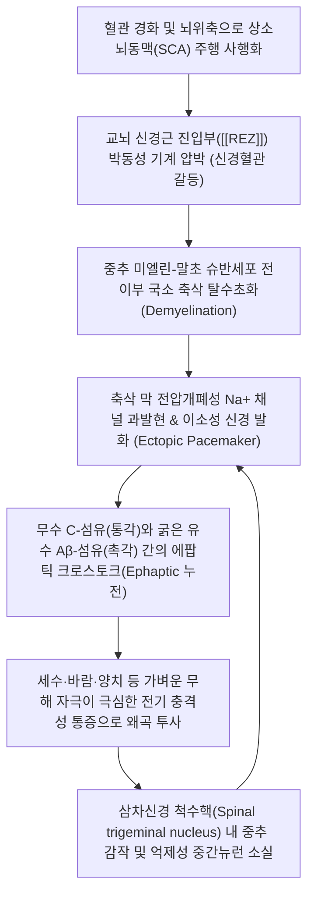

# 🩺 [[삼차신경통]] (Trigeminal Neuralgia / 三叉神經痛, G50.0)

> **핵심 3줄 요약 (Key Summary)**:
> - 📍 **병소 부위 & 해부·병태생리**: 제5뇌신경인 [[삼차신경]](CN V)이 교뇌(Pons)에서 빠져나오는 **신경근 진입부(Root Entry Zone, REZ)**에서 [[상소뇌동맥]](SCA) 등 비정상적 혈관 고리에 의해 박동성 압박을 받아 축삭 탈수초화(Demyelination) 및 무수 C섬유와 유수 Aβ섬유 간의 비정상적 시냅스 누전(**에팝틱 크로스토크, Ephaptic Transmission**)이 발생하는 신경병증.
> - 🚩 **전형적 임상 양상 & 3대 징후**: 세수·양치·식사·바람 등 가벼운 무해 자극에 의해 벼락 맞듯 발작적으로 폭발하는 **극심한 칼로 찌르거나 전기가 통하는 듯한 편측 안면통증(Tic douloureux)**, 특정 안면 분지(V2/V3) 유발대(Trigger zone), 통증 발작 사이의 완전한 무통 불응기(Refractory period).
> - 🛠️ **핵심 감별 검사 & 한·양방 다각적 치료 전략**: ICHD-3 진단 기준 충족 및 치통/악관절장애 배제, 1차 항경련제([[카바마제핀]], [[옥스카바제핀]]), 찬죽·사백·하관·협거 전침(2~100Hz 밀보파) 및 안면 신경 감작 차단 [[봉약침]]/오공약침, 어혈저락·간담화왕 변증 한약([[청상견통탕]], [[갈근해기탕]], [[당귀수산]]), 약물 불응 시 외과적 미세혈관 감압술([[MVD]]).
> - ⚠️ **응급 의뢰 레드플래그 & 악화 요인**: 40세 미만 젊은 층에서 발생하거나 양측성 통증, 지속적 감각 둔마(Hypoesthesia)나 각막반사 소실이 동반될 경우 [[다발성 경화증]](MS) 또는 소뇌교각부 종양(CPA tumor, 청신경초종/수막종) 등 속발성 원인을 강력히 의심하여 즉각 뇌 조영 MRI 의뢰; 멀쩡한 치아의 오진 발치 절대 주의.

---

## 📌 목차
1. [질환 개요 & 해부학적 병태생리](#1-질환-개요--해부학적-병태생리)
2. [병태생리 메커니즘 & 생체역학적 악순환 네트워크](#2-병태생리-메커니즘--생체역학적-악순환-네트워크)
3. [임상 증상 & 이학적 검사(Physical Exam) 알고리즘](#3-임상-증상--이학적-검사physical-exam-알고리즘)
4. [감별 진단 매트릭스 (Differential Diagnosis)](#4-감별-진단-매트릭스-differential-diagnosis)
5. [한의 통합 치료 프로토콜 (침·약침·추나·한약)](#5-한의-통합-치료-프로토콜-침약침추나한약)
6. [양방 치료 & 병용·의뢰 기준 (Conventional Treatment & Referral)](#6-양방-치료--병용의뢰-기준-conventional-treatment--referral)
7. [재활 운동 & 생활습관 티칭 가이드](#6-재활-운동--생활습관-티칭-가이드)
8. [💡 사용자 진료실 핵심 필기 & 임상 노하우 (Melt-In 잔여 심화 집약)](#7--사용자-진료실-핵심-필기--임상-노하우-melt-in-잔여-심화-집약)
9. [출처 및 학술 참고 문헌 (References)](#8-출처-및-학술-참고-문헌-references)

---

## 1. 질환 개요 & 해부학적 병태생리

![[삼차신경통_얼굴_신경분지_통증도해.png|450]]
> [그림 1: ① 질환/병태생리 메디컬 일러스트 — 삼차신경 V1·V2·V3 분지 주행 및 안면 감각 투사 영역]

### 1) 질환 정의 및 임상적 역학
삼차신경통([[Trigeminal neuralgia]], TN, ICD-10 G50.0)은 안면부 감각을 전담하는 제5뇌신경(Cranial Nerve V)의 하나 이상의 분지 영역에서 발생하는 극심한 발작성 편측 안면 통증 증후군이다. 통증의 강도가 인간이 겪을 수 있는 가장 극렬한 고통 중 하나로 꼽히며, 발작 시 환자가 통증으로 인해 얼굴을 일그러뜨리는 특징에서 유래하여 역사적으로 **'유통성 틱(Tic douloureux)'**으로 불려왔다.

* **호발 연령 및 성별**: 50세 이상 중장년층에서 호발하며, 60~70대에 유병률이 정점에 달한다. 남녀 비는 약 1:1.5~2로 여성에서 유의하게 높다.
* **발생 부위 및 분지별 빈도**: 95% 이상에서 편측성(Unilateral)으로 발생하며, 우측 안면이 좌측보다 약 1.5배 빈발한다.
  * 제2분지 상악신경(V2) 단독: 약 35%
  * 제3분지 하악신경(V3) 단독: 약 30%
  * V2 + V3 복합 침범: 약 30%
  * 제1분지 안신경(V1) 단독 침범: 5% 미만으로 극히 드묾 (V1 단독 통증 시 대상포진이나 두개내 종양 배제 필수).

### 2) 삼차신경의 3대 해부학적 분지 경로
삼차신경은 교뇌 외측에서 나와 측두골 암양부 첨판의 메켈 게실(Meckel's cave) 내 반월신경절(Gasserian/Semilunar ganglion)을 형성한 후 3대 분지로 갈라진다.
1. **안신경 (Ophthalmic nerve, V1)**:
   * 두개골 출구: 상안와열(Superior orbital fissure).
   * 주행 및 감각 영역: 안와 내부, 안구, 각막(각막반사 구심로), 상안검, 이마, 두피 전반부, 콧등. 안와상공(Supraorbital notch)에서 안와상신경으로 분기 (침구 혈위: [[찬죽]], 어요).
2. **상악신경 (Maxillary nerve, V2)**:
   * 두개골 출구: 정원공(Foramen rotundum).
   * 주행 및 감각 영역: 익구개와를 지나 하안검, 뺨, 비익(콧망울), 상순(윗입술), 상악 치아 및 잇몸, 경구개 점막. 안와하공(Infraorbital foramen)에서 안와하신경으로 분기 (침구 혈위: [[사백]], 거료).
3. **하악신경 (Mandibular nerve, V3)**:
   * 두개골 출구: 난원공(Foramen ovale).
   * 주행 및 감각 영역: 하순(아랫입술), 턱, 하악 치아 및 잇몸, 혀 전방 2/3 감각 지배.
   * 운동 분지: 저작근군([[교근]], [[측두근]], [[내익상근]], [[외익상근]]) 및 악설골근, 악이복근 전복 운동 지배. 이공(Mental foramen)에서 이신경으로 분기 (침구 혈위: [[하관]], [[협거]], [[지창]]).

---

## 2. 병태생리 메커니즘 & 생체역학적 악순환 네트워크

![[삼차신경_미세혈관압박_신경혈관갈등.jpg|450]]
> [그림 2: ② 관련 해부학적 구조물 — 뇌간 신경근 진입부(REZ)에서 상소뇌동맥(SCA)의 삼차신경 압박 및 에팝틱 전달 병태]

### 1) 신경근 진입부(Root Entry Zone, REZ)의 해부학적 취약성
삼차신경 감각근이 뇌간 교뇌(Pons)로 진입하는 첫 2~6mm 부위인 **신경근 진입부([[REZ]])**는, 중추신경계의 핍돌기고세포(Oligodendrocyte)가 만드는 수초에서 말초신경계의 슈반세포(Schwann cell)가 만드는 수초로 전환되는 해부학적 전이 지점(Transition zone)이다. 이 구역은 결합조직 신경외막(Epineurium) 완충층이 매우 얇아 혈관의 박동성 충격에 취약하다. 노화로 인해 동맥경화가 진행된 **[[상소뇌동맥]](Superior cerebellar artery, SCA)**(약 75~80%) 또는 전하소뇌동맥(AICA)이 사행(Tortuous)하면서 REZ를 지속적으로 타격하여 국소 압박성 허혈과 수초 탈락을 초래한다.

### 2) 축삭 탈수초와 에팝틱 누전 전달 (Ephaptic Crosstalk)
* **에팝틱 전달(Ephaptic Transmission)**:
  * 수초가 벗겨져 나출된 축삭(Naked axons)들이 인접하여 밀집되면, 정상적인 절연 상태가 파괴된다.
  * 가벼운 바람이나 접촉을 감지하는 굵은 유수 촉각 섬유(**Aβ 섬유**)를 따라 흐르던 활동전위가, 인접한 가는 무수 통각 섬유(**C 섬유**) 및 **Aδ 섬유**로 전기장 간섭(Artificial synapse)을 통해 직접 누전(Short-circuiting)된다.
  * 결과적으로 환자는 얼굴을 살짝 스치거나 음식을 씹는 무해한 자극(Non-noxious stimuli)만으로도 벼락을 맞은 듯한 극렬한 통각 발작(Allodynia)을 겪게 된다.
* **이소성 발화 및 중추 감작**:
  * 손상된 축삭 막에서 전압의존성 나트륨 통로(Nav1.3, Nav1.7)가 과발현되어 스스로 전기를 뿜어내는 '이소성 박동조율기(Ectopic pacemaker)'로 변모하며, 삼차신경 척수핵 교양질의 억제 회로가 파괴되는 중추 감작이 완성된다.

---

## 3. 임상 증상 & 이학적 검사(Physical Exam) 알고리즘

### 1) 주소증 및 3대 핵심 특징
* **발작성 전격통 (Paroxysmal Electric-Shock Pain)**:
  * 전기가 감전되듯 찌릿찌릿하거나, 송곳으로 찌르고, 칼로 도려내는 듯한 격통이 수초에서 최대 2분간 지속된 후 거짓말처럼 멈춤.
* **유발대 (Trigger Zones)**:
  * 비익(콧망울 외측), 상순(인중), 구각(입꼬리), 잇몸 점막, 턱 끝 등 특정 부위가 유발 스위치로 작용함.
  * 세수하기, 칫솔질, 면도, 식사, 대화, 찬 바람 쐬기, 화장하기 등에 의해 즉각 격발됨.
* **불응기 (Refractory Period)**:
  * 한번 극심한 발작이 지나간 직후 수십 초~수 분 동안은 동일한 유발대를 아무리 자극해도 통증이 유발되지 않는 생리학적 휴지기가 존재함 (치통과의 결정적 감별 포인트).

### 2) ICHD-3 고전적 삼차신경통 진단 기준
1. 삼차신경 1개 이상의 분지 영역에 국한되며 얼굴의 정중선을 절대 넘지 않는 편측성 통증 발작.
2. 통증 특성: ① 수초~2분간 지속되는 반복 발작 ② 전기 충격, 찌름, 찢어짐 같은 극심한 강도 ③ 비유해성 기계적 자극에 의한 유발대 격발.
3. 발작 사이 기간에는 객관적인 신경학적 결손(안면 감각 저하 등)이 전혀 없음.
4. 뇌 MRI(CISS/FIESTA 기법)에서 상소뇌동맥 등에 의한 REZ 신경혈관 압박 확인.

---

## 4. 감별 진단 매트릭스 (Differential Diagnosis)

| 감별 질환 | 통증 양상 및 지속 시간 | 유발 요인 | 수반 징후 및 특징 | 핵심 감별 소견 |
| :--- | :--- | :--- | :--- | :--- |
| **[[삼차신경통]]** (본 질환) | **벼락 치듯 찌릿한 격통 (수초~2분)** | 세수, 양치, 식사, 찬 바람 (유발대) | **불응기 존재, 감각 저하 없음 (0%)** | [[카바마제핀]] 투여 시 극적 호전 |
| 치수염 / 치통 | 지속적인 욱신거림, 심장 박동통 | 온수/냉수 섭취, 저작 압력 | 치아 타진통, 잇몸 종창, 야간통 심화 | 치과 방사선 X-ray 치수 병소 |
| [[대상포진후신경통]] (PHN) | 지속적인 작열통, 칼로 베는 쓰라림 | 옷깃 스침, 가벼운 마찰 | 선행 수포 피진 병력, 피부 감각 저하 | V1 안신경 침범 흔함, 피진 흉터 |
| 지속성 삼차신경병증 (속발성) | 둔하고 쑤시는 지속통 위에 발작 중첩 | 접촉 및 무자극 상태 지속 | **안면 감각 저하(마목), 각막반사 소실** | 뇌 MRI상 종양, MS 다발경화 플라크 |
| 악관절 장애 ([[악관절 증후군]]) | 턱 주변의 둔한 뻐근함, 조임통 | 입을 크게 벌릴 때, 딱딱한 음식 | 턱관절 마찰음(Clicking), 개구 장애 | [[교근]], [[외익상근]] 국소 압통 |

---

## 5. 한의 통합 치료 프로토콜 (침·약침·추나·한약)

![[안면신경마비_침구치료_경혈자침_임상사진.jpg|450]]
> [그림 3: ③ 한의 치료 시술점 — 안면 삼차신경 분지 유발대 및 경혈(찬죽·사백·하관·협거·지창) 침구·약침 치료점]

### 1) 침구 및 전침 치료 (Electroacupuncture)
* **신경공(Foramen) 표적 국소 취혈**:
  * **V1 분지**: [[찬죽]](BL2, 상안와공 상안와신경 자극), 양백(GB14), 어요(EX-HN4), 태양(EX-HN5), 사죽공(TE23).
  * **V2 분지**: [[사백]](ST2, 안와하공 안와하신경 자극), 거료(ST3), 관료(SI18), 영향(LI20), 권료.
  * **V3 분지**: [[하관]](ST7, 하악절흔 난원공 투영점), [[협거]](ST6), [[지창]](ST4), 대영(ST5), 승읍(ST1), 예풍(TE17, 이개측두신경 분지부).
* **원위 사관 배혈 및 원격 신경조절**:
  * [[합곡]](LI4, 수양명대장경 원혈로 두면부 질환의 총혈로 삼차신경 감작 억제), [[태충]](LR3), 내관(PC6), [[풍지]](GB20), 족삼리(ST36).
* **전침 통전 프로토콜**:
  * 전극 연결: 하관(ST7) - 협거(ST6) 쌍, 사백(ST2) - 지창(ST4) 쌍.
  * 주파수: **2/100Hz 밀보파(Dense-Disperse wave)**를 20~25분간 통전.
  * 생리 기전: 2Hz 저주파는 척수 후각 교양질의 β-엔돌핀 및 엔케팔린 방출을 자극하고, 100Hz 고주파는 척수 내 다이노르핀 방출을 유도하여 나트륨 채널 과발현에 의한 이소성 신경 발화를 차단함. 또한 삼차신경 척수핵 내 미세아교세포(Microglia)의 염증성 사이토카인(TNF-α, IL-1β) 발현을 유의하게 억제함.

### 2) 약침 요법 (Pharmacopuncture)
* **약침 제제 및 주입 타겟**:
  * **[[봉약침]](Sweet Bee Venom, BV)**: 멜리틴(Melittin)과 아파민(Apamin) 성분이 신경내막 무균성 염증과 미세순환 장애를 억제. 하관, 사백, 찬죽 혈위에 0.05~0.1cc씩 극미량 피내 및 피하 주입 (시술 전 스킨 알레르기 테스트 필수). 만성 난치성 통증 환자에서 10~20% 농도로 점진적 증량.
  * **[[오공약침]](Scolopendra)**: 만성적인 풍담어혈형 난치성 면통 환자의 하관, 협거 부위에 0.2~0.3cc 주입하여 강력한 진경(鎭痙) 및 진통 작용 유도.
  * **신바로약침 또는 자하거약침**: 악관절 및 저작근 긴장이 동반된 경우 익상근 및 교근 부착부에 0.5cc 수력학적 박리 주입하여 신경 주위 압박 완화.

### 3) 관절 추나요법 (TMJ & Cervical Chuna)
* **악관절-두개천골(CST) 추나**:
  * 삼차신경 하악분지(V3)가 통과하는 난원공(Foramen ovale) 주변 측두골 및 접형골의 가동성을 회복하기 위해 접형후두저관절(SBS) 감압 기법 및 악관절 견인 교정 적용.
* **상부 경추(C1-C2) 관절가동화**:
  * 삼차신경경추핵(TCC) 과흥분을 완화하기 위해 C1-C2 후관절의 비틀림 변위 교정.

### 4) 한약 치료 (Herbal Medicine)
* **변증 분형별 처방**:
  * **풍한강체형(風寒凝滯) (한랭 노출 후 통증 격발)**:
    * [[갈근탕]] 합 [[오적산]] 가 세신, 백지, 천궁: 안면 체표의 모세혈관 경련을 풀고 찬 기운을 몰아냄.
  * **간담화왕형(肝膽火旺) (스트레스, 분노 시 격발, 안면 열감)**:
    * [[용담사간탕]] 합 [[청상견통탕]](용담초, 황금, 치자, 시호, 천궁, 강활, 방풍, 백지 등): 간담의 치솟는 화열을 내리고 삼차신경 통각 경로 안정.
  * **어혈저락형(瘀血阻絡) (만성 난치성 바늘로 찌르는 고정통)**:
    * 통규활혈탕 합 [[당귀수산]] 가 전갈, 오공: 뇌저혈관 및 안면 신경 미세순환계의 어혈을 용해.

### 5) 양방 1차 항경련제 관리
* **[[카바마제핀]](Carbamazepine, 테그레톨)**: 1차 선택 약제로 초기 100~200mg/day로 시작하여 600~1,200mg/day까지 증량. 부작용(어지럼, 졸림, 백혈구감소증, 간독성, SJS) 모니터링을 위해 정기적 일반혈액검사(CBC) 및 LFT 필수.
* **[[옥스카바제핀]](Oxcarbazepine, 트리렙탈)**: 부작용이 적은 프로드러그 제제로 600~1,800mg/day 분할 투여.

---

## 6. 양방 치료 & 병용·의뢰 기준 (Conventional Treatment & Referral)

> 🎯 **이 섹션의 목적**: 환자가 **양방약을 이미 복용 중인 경우가 많다.** 한의원 1차 진료에서 양방 치료를 이해하고, 병용 가능·주의·금기를 판단하며, 언제 의뢰할지 결정한다.

* **약물 치료 (Medication)**:
  * 계열별 약물·용량·기간 — 국내 처방 관행 반영.
  * 작용 기전과 한의 치료와의 상호작용.
* **비약물 시술 (Procedures)**:
  * 주사·차단술·물리치료·보조기 등.
* **수술·시술 적응증 (Surgical Indication)**:
  * 언제 수술로 가는가 — 절대·상대 적응증, 수술 후 경과.
* **한의 병용 판단 (Combination Therapy)**:
  * 병용 가능 / 주의 / 금기. 복용 중 환자의 감량 타이밍·반동 현상.
* **양방·전문과 의뢰 기준 (Referral Criteria)**:
  * 응급 의뢰 트리거와 전문과 의뢰 기준(정형외과·신경외과·내과 등).

	(작성 필요)

---

## 7. 재활 운동 & 생활습관 티칭 가이드

### 1) 일상생활 유발대 차단 수칙 — ★절대 지침
* **온도 자극 방어**: 겨울철 찬 바람이나 여름철 에어컨 바람이 얼굴에 직접 닿는 행위 엄격 차단 (외출 시 방한 마스크, 목도리, 챙 넓은 모자 착용 필수).
* **저자극 세안 및 칫솔질**:
  * 유발대가 입술이나 코 옆에 있는 경우 손으로 박박 문지르지 말고 미온수로 패팅하듯 가볍게 세안.
  * 극미세모 칫솔을 사용하고, 통증 발작기에는 구강 청결제로 양치를 대체.
* **식단 및 저작 지도**:
  * 통증이 없는 건측 치아로만 씹도록 훈련.
  * 너무 뜨겁거나 차가운 음식, 맵고 자극적인 양념, 질긴 음식 피하고 죽이나 유동식 위주 섭취.

### 2) 저작근 및 안면 근육 이완 운동
* 혀끝을 위 앞니 뒤쪽 입천장에 대고 턱을 가볍게 벌리는 턱관절 중립 안정화 운동(N-자세 훈련).

---

## 8. 💡 사용자 진료실 핵심 필기 & 임상 노하우 (Melt-In 잔여 심화 집약)

### 1) 진료실 핵심 필기 원문 융합
* **비극적인 멀쩡한 치아 발치 오진 방지 (원장실 팁)**:
  * 삼차신경통 환자의 50% 이상이 발병 초기에 "어금니가 쑤신다"며 치과를 찾아감.
  * 충치가 없음에도 극심한 통증 호소에 의해 신경치료를 받거나 멀쩡한 어금니를 1~3개씩 뽑고 나서도 통증이 전혀 줄지 않아 울면서 한의원에 오는 환자가 허다함.
  * **원장의 1초 감별 공식**: 찬물이나 뜨거운 물을 마실 때 치아 자체가 시리고 욱신거리는지(치통), 아니면 칫솔이나 숟가락이 잇몸을 살짝 스치는 순간 벼락 맞듯 뺨 전체로 번개가 치는지(삼차신경통)를 물어봐야 함. 후자는 치아 문제가 아니므로 절대 발치하지 못하도록 막아야 함.
* **카바마제핀(테그레톨) 테이퍼링 노하우**:
  * 환자들이 양약 고용량 복용으로 멍함, 극심한 졸림, 보행 비틀거림, 간 수치 상승으로 고통받다가 한의원에 옴.
  * 이때 절대로 양약을 한 번에 끊게(Cold turkey) 하면 안 됨. 반동 현상(Rebound)으로 통증 발작이 통제 불능 상태(Status trigeminus)로 폭발함.
  * 침·전침·봉약침과 한약([[청상견통탕]]) 투여로 통증 발작 횟수가 주당 절반 이하로 안정화되면, 1~2주 간격으로 테그레톨을 100mg씩 아주 서서히 감량해야 성공적인 감약 및 단약이 가능함.
* **침 치료 시 유발대 직접 자극 금기**:
  * 환자의 통증 스위치인 유발대(Trigger zone) 부위에 직접 침을 찔러 강자극을 주면 발작을 촉발할 수 있음.
  * 유발대를 피해 신경 본간이 나오는 신경공(하관, 안와하공 인근) 및 원위 사관혈(합곡, 태충) 위주로 조심스럽게 시술해야 함.

---

## 9. 출처 및 학술 참고 문헌 (References)

* Trigeminal Neuralgia. *N Engl J Med*. 2020. PMID: [32813951](https://pubmed.ncbi.nlm.nih.gov/32813951)
  * [연구 요약] 뇌간 신경근 진입부(REZ)의 미세혈관 압박 병태생리, MRI 진단 기법, 카바마제핀 1차 약물 요법 및 미세혈관 감압술(MVD)의 적응증을 종합 정리한 세계 최고 권위 총설.
* European Academy of Neurology guideline on trigeminal neuralgia. *Eur J Neurol*. 2019. PMID: [30860637](https://pubmed.ncbi.nlm.nih.gov/30860637)
  * [연구 요약] 유럽신경과학회 공식 가이드라인으로 삼차신경통의 분류 체계(고전적, 이차성, 특발성), 약물 치료 근거 수준 및 외과적 수술의 단계별 추천 등급 규정.
* Does Acupuncture Produce Durable Analgesia in Trigeminal Neuralgia? An Updated Systematic Review and Meta-Analysis. *Healthcare (Basel)*. 2026. PMID: [42450934](https://pubmed.ncbi.nlm.nih.gov/42450934)
  * [연구 요약] 원발성 삼차신경통 환자에서 침구 및 전침 치료가 통증 점수(VAS) 감소 및 장기 진통 지속성에 미치는 효과와 카바마제핀 약물 감량 효과 메타분석.
* Meta-analysis and sequential analysis of acupuncture compared to carbamazepine in the treatment of trigeminal neuralgia. *World J Clin Cases*. 2024. PMID: [39109001](https://pubmed.ncbi.nlm.nih.gov/39109001)
  * [연구 요약] 삼차신경통 치료에서 침 치료와 카바마제핀 단독 투여군 간의 치료 유효율 및 이상반응 발생률을 비교한 메타분석 및 시험순차분석.
* Efficacy and safety of different acupuncture-related therapies for primary trigeminal neuralgia: a systematic review and network meta-analysis. *Front Pain Res*. 2026. PMID: [42524199](https://pubmed.ncbi.nlm.nih.gov/42524199)
  * [연구 요약] 전침, 약침, 도침 등 복합 한의 중재의 삼차신경통 통증 완화 시너지 효과와 신경병증성 과감작 차단 네트워크 메타분석.

---
## 📎 개념 학습 보충 (2026-09-25 논문 연계)
- **보툴리눔 독소 A의 위치가 정리됐다 (Clin J Pain 2024, PMID 38385501)**: 총 23개 연구(무작위 4편 + 단일군 14편 + 계층화 5편) 종합에서 BTX-A가 **기저 대비 VAS를 유의하게 감소**(RCT 4편 효과크기 −4.05, 95% CI −6.13~−1.97, p=0.002), 비무작위 19편 단일군 통합에서도 VAS −5.19·발작빈도 −17.85·반응자 비율 유의
- **용량-반응은 없다**: 대표 용량비교 시험(25 U vs 75 U, PMID 25263254)에서 두 용량의 효과가 유사했고 8주 반응률은 25 U 70.4%·75 U 86.2% 대 위약 32.1%였다 → 고용량이 더 낫다고 말할 수 없다 → [[보툴리눔 톡신 A]]
- **치료 서열 재확인**: 1차는 약물 — [[카바마제핀]](200~1,200 mg/일, Level A) 또는 [[옥스카바제핀]](600~1,800 mg/일, Level B). BTX-A는 **난치성·불내성 또는 수술이 어려운 환자의 3차 옵션**이다 → [[ICHD-3]]
- **기전**: BTX-A는 [[SNARE 복합체]]를 절단해 아세틸콜린 유리를 차단할 뿐 아니라, 삼차신경절·말초 말단에서 [[CGRP]]·[[Substance P]]·글루타메이트 유리를 억제해 신경인성 염증·말초 감작을 줄인다 → [[TRPV1]] · [[말초 감작]]
- **진료실 1차 역할은 조기 감별**: 전기충격양 발작통 + 유발대 + 발작 간 무증상이면 본 질환을 의심하고, **양측성·40세 이전 발병·안면 감각 저하**이면 [[다발성 경화증]]·종양 등 이차성 원인 배제를 위한 영상 검사가 먼저다
- **한계**: 무작위 시험 4편뿐이고 주입 부위·깊이·간격이 통일되지 않아 최적 프로토콜 미확정, 국내 보험 적응도 아니다. 침·약침은 1차 치료를 대체하지 않고 통증·수면 조절 목적의 보조로 위치시킨다
- 관련: [[2026-09-25_신경계통증의학_심층리뷰]] 3번 · [[삼차신경통]] · [[5. 삼차신경|삼차신경]]

