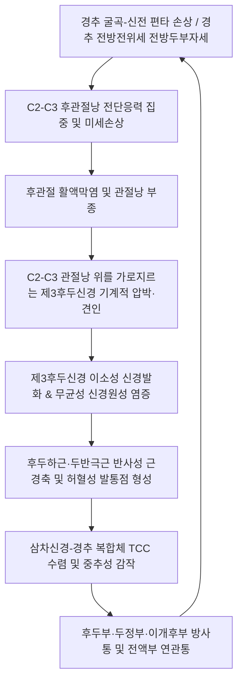

# 🩺 제3후두신경 두통 (Third Occipital Headache, TOH)

> **핵심 3줄 요약 (Key Summary)**:
> - 📍 **병소 부위 & 해부·병태생리**: C3 척수신경 후지(dorsal ramus)의 천지(superficial branch)인 [[제3후두신경]](Third Occipital Nerve, TON)이 C2-C3 [[후관절]](zygapophysial joint)의 관절낭을 교차·지배하며, 편타성 손상(whiplash)이나 퇴행성 관절증으로 인해 기계적 자극·포착을 받아 발생하는 유두돌기·후두하부 특이 두통이다.
> - 🚩 **전형적 임상 양상**: C2-C3 후관절 외측 및 후두하 부위의 둔통·자통으로 시작하여 후두부 정중선 외측 및 두정부·이개후부로 방사되는 편측성 두통이며, 경추 회전·신전 시 악화된다.
> - 🛠️ **핵심 검사 & 치료 전략**: C2-C3 후관절 압통 유발 검사 및 관절강·신경 차단 반응 평가가 표준이며, 한의 임상에서는 [[풍지]](GB20)·[[천주]](BL10)·[[완골]](GB12) 취혈 침·[[약침치료]], C2-C3 후관절 가동 추나요법, [[갈근]]·[[천궁]] 기반 방제를 병용한다.
> - ⚠️ **응급 의뢰 레드플래그**: 벼락두통(thunderclap headache), 발열·수막자극징후, 경동맥·추골동맥 박리 의심 증상(Horner 증후군, 급성 어지럼, 구음장애), 신경학적 결손 동반 시 즉시 뇌혈관 정밀검사(MRA/CTA)를 의뢰한다.

---

## 📌 목차
1. [질환 개요 & 해부학적 병태생리](#1-질환-개요--해부학적-병태생리)
2. [병태생리 메커니즘 & 생체역학적 악순환 네트워크](#2-병태생리-메커니즘--생체역학적-악순환-네트워크)
3. [임상 증상 & 이학적 검사(Physical Exam) 알고리즘](#3-임상-증상--이학적-검사physical-exam-알고리즘)
4. [감별 진단 매트릭스 (Differential Diagnosis)](#4-감별-진단-매트릭스-differential-diagnosis)
5. [한의 통합 치료 프로토콜 (침·약침·추나·한약)](#5-한의-통합-치료-프로토콜-침약침추나한약)
6. [양방 치료 & 병용·의뢰 기준 (Conventional Treatment & Referral)](#6-양방-치료--병용의뢰-기준-conventional-treatment--referral)
7. [재활 운동 & 생활습관 티칭 가이드](#7-재활-운동--생활습관-티칭-가이드)
8. [💡 사용자 진료실 핵심 필기 & 임상 노하우 (Melt-In 잔여 심화 집약)](#8--사용자-진료실-핵심-필기--임상-노하우-melt-in-잔여-심화-집약)
9. [출처 및 학술 참고 문헌 (References)](#9-출처-및-학술-참고-문헌-references)

---

## 1. 질환 개요 & 해부학적 병태생리

제3후두신경 두통(Third Occipital Headache, TOH)은 제3경추신경(C3) 후지의 표재지인 제3후두신경(Third Occipital Nerve, TON)의 기계적 자극 또는 신경병증성 병변으로 인해 발생하는 대표적인 [[경추성 두통]](Cervicogenic Headache)의 일종이다. 1986년 Nikolai Bogduk 교수에 의해 독립된 임상 질환 단위로 규명되었으며, 경추 외상(특히 후방 추돌로 인한 편타 손상) 후 만성 후두부 두통 환자의 약 27%~56%에서 C2-C3 후관절 및 제3후두신경이 주요 원인 병소로 지목된다.

![[제3후두신경_두통_01_후두부후지신경및제3후두신경해부도해.png]]
> [그림 1: ① 병태생리·해부 — Wikimedia Commons — File:Gray800.png (Gray's Anatomy Plate 800)]

### 해부학적 주행 및 신경 분포
1. **기원 및 주행**: C3 척수신경의 후지(dorsal ramus)는 추간공을 통과한 후 심지(deep branch)와 표재지(superficial branch)로 분지한다. 이 중 표재지가 바로 제3후두신경(TON)이다.
2. **C2-C3 후관절과의 밀착 관계**: 제3후두신경은 C2-C3 후관절(zygapophysial joint)의 후외측 관절낭(capsule) 위를 밀착하여 가로질러 주행한다. 이 과정에서 관절낭의 감각을 지배하는 관절지(articular branches)를 분지하므로, C2-C3 후관절의 염증, 관절증, 또는 외상성 신전 시 신경이 직접적으로 신장·포착된다.
3. **근육 관통 및 피부분포**: 이후 신경은 두반극근(semispinalis capitis)과 승모근(trapezius) 건막을 관통하여 후두하 및 외후두융기 하방의 피부 영역으로 주행하여 감각을 담당한다.

---

## 2. 병태생리 메커니즘 & 생체역학적 악순환 네트워크

제3후두신경 두통의 병태생리는 국소 후관절의 기계적 손상과 삼차신경-경추 복합체(Trigeminocervical Complex, TCC)를 통한 중추성 감작이 결합된 다단계 악순환으로 설명된다.

![[제3후두신경_두통_02_경추측면방사선C2C3후관절소견.png]]
> [그림 2: ② 관련 해부 영상 — Wikimedia Commons — File:Normal lateral cervical spine X-ray.jpg]

### 병태생리 3단계 기전
1. **C2-C3 관절낭의 구조적 취약성**: 상부 경추(C1-C2)의 큰 회전 가동성에 이어 C2-C3 분절은 회전 운동과 굴곡-신전 운동의 전이 지점에 위치하여 생체역학적 전단응력(shear stress)에 매우 취약하다.
2. **신경 포착과 무균성 신경염**: 염증성 사이토카인(TNF-α, IL-1β)과 Substance P, CGRP의 방출로 인해 신경 상막(epineurium) 부종이 발생하고 국소 허혈이 동반된다.
3. **삼차신경-경추 수렴(Convergence)**: C1-C3 척수신경의 유입 섬유는 연수의 삼차신경 척수로핵(trigeminal spinal nucleus)과 2차 신경원을 공유하므로, 상부 경추의 통증 신호가 삼차신경 제1지(안와·전두부)로 투사되는 연관통(referred pain)을 유발할 수 있다.

---

## 3. 임상 증상 & 이학적 검사(Physical Exam) 알고리즘

### 임상 증상 (Clinical Features)
- **통증의 위치**: 외후두융기(EOP) 직하부 및 C2-C3 후관절 부위의 깊은 둔통(dull ache)과 쑤시는 통증(throbbing)이 주를 이루며, 편측성인 경우가 80% 이상이다.
- **방사 패턴**: 통증이 유두돌기 후방, 후두정부(occipitoparietal), 때로는 측두부 및 이환측 안와 심부로 방사된다.
- **악화 인자**: 목을 뒤로 젖히거나(경추 신전) 이환측으로 회전할 때 관절낭이 압박되면서 증상이 즉각 유발·악화된다.
- **동반 증상**: 경부 강직감, 후두하근 압통, 현기증(cervicogenic dizziness), 경미한 오심이 동반될 수 있다.

### 이학적 검사 프로토콜
1. **C2-C3 후관절 촉진 검사(Facet Joint Palpation)**:
   - 환자를 앙와위로 눕히고 경추 근육을 이완시킨 상태에서, 유두돌기 하방 약 2cm, C2 극돌기 외측 1.5~2cm 지점의 C2-C3 후관절 부위를 깊게 압박한다.
   - 환자의 평소 두통이 재현되거나 극심한 국소 압통이 유발되면 양성이다.
2. **경추 신전-회전 검사(Extension-Rotation Test)**:
   - 경추를 신전시킨 상태에서 이환측으로 수동 회전시킬 때 후관절이 맞물리며 후두부 통증이 재현된다.
3. **후두하 신경 타진 검사(Tinel Sign)**:
   - 상항선 직하부 제3후두신경 주행 부위를 가볍게 타진하여 방전통이나 이상감각 발생 여부를 확인한다.
4. **[[스펄링 검사]](Spurling Test) 및 추간공 압박 검사**:
   - 경추 신경근증(radiculopathy)과의 감별을 위해 시행하며, 통증이 상지 피부분절로 방사되지 않음을 확인한다.

---

## 4. 감별 진단 매트릭스 (Differential Diagnosis)

| 감별 질환 | 호발 연령 / 유병률 | 통증 양상 및 부위 | 유발 / 악화 요인 | 감별 핵심 포인트 (Discriminator) |
| :--- | :--- | :--- | :--- | :--- |
| **제3후두신경 두통 (TOH)** | 30~50대, 외상력 빈발 | 후두하부 정중선 외측, C2-C3 분절 둔통 및 두정부 방사 | 경추 신전 및 동측 회전, 후관절 촉진 | C2-C3 후관절 정확한 압통, C2-C3 후지 신경차단 시 소실 |
| **[[대후두신경통]](GON)** | 전 연령 | 상항선 부위 전격성 자통, 두정부 및 전액부 방사 | 후두부 타진(Tinel 징후), 두피 접촉 | 두반극근 관통부 압통, 이상감각 및 찌릿한 방전통 우세 |
| **[[경추성 두통]](일반)** | 40~60대 | 후두부에서 시작하여 전두·안와부로 진행되는 둔통 | 불량 자세 유지, 경추 굴곡-신전 | 경추 전반의 가동역(ROM) 제한, 다분절 관절증 동반 |
| **[[긴장형 두통]]** | 20~40대 다발 | 양측성 모자 조이는 듯한 압박감, 비박동성 | 스트레스, 피로, 오후 악화 | 양측성 통증, 경추 움직임에 따른 통증 유발 없음, 일상생활 지속 가능 |
| **[[편두통]]** | 가임기 여성 우세 | 편측성 박동성 통증, 중등도~중증 강도 | 빛·소리 자극, 월경 주기 | 오심·구토, 빛·소리 공포증, 전조증상(조짐) 동반 |

---

## 5. 한의 통합 치료 프로토콜 (침·약침·추나·한약)

제3후두신경 두통의 한의 치료는 후두하 삼각 및 C2-C3 후관절 주변의 기계적 압박을 해소하고, 경추의 생체역학적 부정렬을 교정하며, 신경원성 염증을 가라앉히는 통합 접근을 취한다.

![[제3후두신경_두통_05_침구치료후두부풍지천주완골혈위도해.png]]
> [그림 3: ③ 치료·시술점 — Wikimedia Commons — File:Acupuncture chart, Chinese, 17th century Wellcome L0034708.jpg (CC BY 4.0)]

### 1) 침구 치료 (Acupuncture)
- **주요 혈위**:
  - [[천주]](BL10): 방광경 혈위로 두반극근 및 대후두신경·제3후두신경 주행로에 위치, 0.8~1.2치 직자 또는 하방 사자하여 득기 유도.
  - [[풍지]](GB20): 담경 혈위로 흉쇄유돌근과 승모근 사이 함요처, 대·소후두신경 및 후두하근육군 이완.
  - [[완골]](GB12): 유두돌기 후하방 함요처로 제3후두신경의 외측 분지 및 경추 신경얼기 자극.
  - [[후계]](SI3): 독맥과 통하는 팔맥교회혈로 경추부 경결 완화 원위 취혈.
- **전침(Electroacupuncture)**: 천주-풍지 간 2Hz/100Hz 혼합파(dense-disperse wave)를 15~20분간 적용하여 엔도르핀 방출 및 국소 근경련을 해제한다.

### 2) 약침 치료 (Pharmacopuncture)
- **주입 부위**: C2-C3 후관절 외측 관절낭 연접부 및 후두하근 심부 건막 부착부.
- **약침 제제**:
  - **신바로약침 / 중성어혈약침**: 국소 무균성 염증 제거 및 미세혈류 순환 촉진, 0.5~1.0cc 분할 주입.
  - **봉약침(Sweet BV)**: 만성화된 신경병증성 감작 완화, 0.1cc 미량 피내·근막하 주입(사전 알레르기 피부 반응검사 필수).

### 3) 추나요법 (Chuna Manual Therapy)
- **경추 가동기법(Mobilization)**: C2-C3 분절의 후관절 가동술(facet opening technique). 경추 굴곡 상태에서 부드러운 회전-측굴 유도를 통해 관절내압을 감소시킨다.
- **후두하근 이완술(Suboccipital Release)**: 검자의 양 손가락 끝으로 환자의 후두골 하연(상항선 직하)을 접촉하여 상방 견인 및 지속적 허혈성 압박(ischemic compression)을 2~3분간 유지.
- **경추 JS신연기법**: 경추 축방향 신연을 통해 추간공 및 후관절 간격을 확보.

### 4) 한약 치료 (Herbal Medicine)
- **풍한습비형(風寒濕痺型)**: [[갈근탕]](葛根湯) 가 [[강활]], [[방풍]], [[천궁]] — 경항부 근육 강직 및 외감성 악화 완화.
- **기체어혈형(氣滯瘀血型)**: [[오약순기산]](烏藥順氣散) 또는 당귀수산 합 서경탕 — 편타 손상 후 국소 어혈과 신경 포착 해소.
- **간양상항·음허형(肝陽上亢·陰虛型)**: [[천마구등음]](天麻鉤藤飮) 가 [[작약]], [[감초]](작약감초탕 합방) — 신경 과흥분 및 근육攣急(근연급) 완화.

---

## 6. 양방 치료 & 병용·의뢰 기준 (Conventional Treatment & Referral)

### 1) 약물 치료 (Medication)
- **1차 진통소염제**: NSAIDs (Aceclofenac 100mg bid, Celecoxib 200mg qd) 및 중추성 근이완제 (Eperisone 50mg tid). 급성기 관절낭 염증 조절에 사용.
- **신경병증성 통증 완화제**: 통증이 만성화되어 두피 감각이상이나 작열감이 동반될 경우 Pregabalin (75~150mg/일) 또는 Gabapentin (300~900mg/일) 투여.
- **삼환계 항우울제(TCA)**: Amitriptyline 10~25mg 취침 전 복용으로 중추 감작 및 수면장애 개선.

### 2) 비수술적 중재술 (Interventional Procedures)
- **제3후두신경 차단술(TON Block)**: C2-C3 후관절을 투시장치(C-arm fluoroscopy) 하에 확인하고 국소마취제(Lidocaine/Bupivacaine)와 소량의 스테로이드(Triamcinolone)를 주입. 진단과 치료를 겸함.
- **고주파 열응고술(Radiofrequency Neurotomy)**: 반복적인 신경 차단술 후 통증이 재발하는 난치성 TOH 환자에서 제3후두신경을 표적으로 고주파 열변성을 유도하여 6~12개월간 통증 전도를 차단함 (Govind et al., 2003).

### 3) 한의 병용 판단 및 상호작용
- **병용 권장**: NSAIDs 복용 중인 급성기 환자에게 침·추나·약침 병용 시 약물 감량 기간을 단축시키고 위장관 부작용을 줄일 수 있음.
- **주의 사항**: 국소마취제/스테로이드 블록 직후 24~48시간 동안은 국소 감염 예방을 위해 해당 주사점에 직접적인 자침이나 강한 추나 압박을 피한다.

### 4) 양방·전문과 의뢰 기준 (Referral Triggers)
- **즉각 응급 의뢰 (Emergency)**:
  - 갑작스러운 극심한 두통(Thunderclap headache) — 지주막하 출혈(SAH) 감별.
  - Horner 증후군(동공 축소, 안검하수), 구음장애, 보행 실조 동반 — 내경동맥 또는 [[추골동맥 박리]](Vertebral Artery Dissection) 의심.
  - 발열, 경부 경직(neck stiffness), 의식 변화 — 수막염 감별.
- **정형외과 / 신경외과 의뢰**:
  - 상지 근력 저하(deltoid, biceps, triceps), 건반사 소실 등 명확한 경추 신경근증 동반.
  - 적극적인 보존적 한의 치료 4~6주 후에도 통증 지수(VAS)의 변화가 없고 일상생활이 불가능한 경우 (신경차단술 및 고주파 절제술 고려).

---

## 7. 재활 운동 & 생활습관 티칭 가이드

### 1) 경추 심부 굴곡근 강화 (Deep Neck Flexor Training)
- **친턱 운동(Chin-Tuck Exercise)**:
  - 앙와위에서 턱을 가볍게 목 쪽으로 당겨 경추 전만을 회복하고 상부 경추의 과신전을 방지.
  - 5초 유지, 10회 반복, 하루 3세트. 경추 후관절에 가해지는 압박 부하를 감소시킴.

### 2) 후두하근 자가 스트레칭 & 폼롤러 이완
- 턱을 당긴 상태에서 양손으로 후두부를 부드럽게 앞으로 숙여 상부 경추 후면 근육을 신장.
- 마사지볼 또는 땅콩볼을 후두골 하연(풍지·천주 부위)에 대고 완만하게 좌우로 회전하며 근막 이완.

### 3) 생활습관 및 자세 교정
- **모니터 및 스마트폰 높이 조절**: 시선이 15도 하방을 향하도록 화면 높이를 눈높이로 맞추어 거북목 자세(Forward Head Posture) 교정.
- **베개 높이 최적화**: 경추의 C자 커브를 지지할 수 있는 경추 베개 사용 권장(너무 높거나 딱딱한 베개는 C2-C3 후관절을 과신전시킴).
- **장시간 고정 자세 회피**: 50분 작업 후 5분간 경추 스트레칭 및 흉추 신전 운동 시행.

---

## 8. 💡 사용자 진료실 핵심 필기 & 임상 노하우 (Melt-In 잔여 심화 집약)

1. **대후두신경통과의 임상 감별 Tip**:
   - 대후두신경(GON) 병변은 두피 상부를 타고 정수리(백회) 및 전두부까지 전기 오듯 뻗치는 방전통(shooting pain)이 특징인 반면, 제3후두신경(TON) 병변은 후두하부 정중선 외측과 C2-C3 관절 부위의 '묵직하고 쑤시는 심부 둔통'이 지배적이다.
2. **자침 깊이 및 안전 가이드**:
   - 천주(BL10)와 풍지(GB20) 자침 시 환자의 상부 경추 후두공 방향으로 과도하게 상방 사자하면 연수 및 추골동맥 손상의 위험이 있다. 반드시 하악각 방향이나 반대측 안와 방향으로 완만하게 사자하거나 수직 방향으로 직자하되 심도를 1.5치 이내로 제어한다.
3. **만성 난치성 환자의 흉추 가동성 체크**:
   - 상부 경추(C2-C3)에만 과부하가 걸리는 근본 원인은 흉추 후만(Thoracic Kyphosis)의 증가와 흉추 회전 가동성 상실에 있다. 흉추 1~4번 신연 추나를 병행해야 두통의 재발을 막을 수 있다.

---

## 9. 출처 및 학술 참고 문헌 (References)

1. **Bogduk N, Marsland A. (1986)**. On the concept of third occipital headache. *Journal of Neurology, Neurosurgery, and Psychiatry*, 49(7):775-780. [PMID: 3018167](https://pubmed.ncbi.nlm.nih.gov/3018167/)

2. **Lord SM, Barnsley L, Wallis BJ, Bogduk N. (1994)**. Third occipital nerve headache: a prevalence study. *Journal of Neurology, Neurosurgery, and Psychiatry*, 57(10):1187-1190. [PMID: 7931379](https://pubmed.ncbi.nlm.nih.gov/7931379/)

3. **Govind J, et al. (2003)**. Radiofrequency neurotomy for the treatment of third occipital headache. *Journal of Neurology, Neurosurgery, and Psychiatry*, 74(1):88-93. [PMID: 12486273](https://pubmed.ncbi.nlm.nih.gov/12486273/)

4. **Bogduk N. (2004)**. The neck and headaches. *Neurologic Clinics*, 22(1):151-171, vii. [PMID: 15062532](https://pubmed.ncbi.nlm.nih.gov/15062532/)

---

## 관련 노트

- [[경추성 두통]]
- [[대후두신경통]]
- [[소후두신경통]]
- [[긴장형 두통]]
- [[편두통]]
- [[추간판 탈출증]]
- [[근막통증증후군]]
