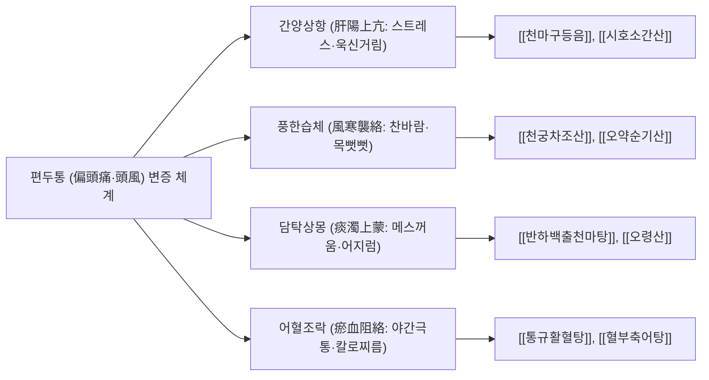

# ⚡ 편두통 (Migraine, 偏頭痛·頭風)

> **핵심 요약 (Key Summary)**:
> - **정의**: 삼차신경혈관 복합체(Trigeminovascular System, TVS)의 비정상적 활성화와 신경펩타이드 유리로 인해 뇌막 혈관의 무균성 염증과 확장이 촉발되어, 오심, 구토, 광공포증(Photophobia), 소리공포증(Phonophobia)을 동반한 **반복적인 중등도~중증의 박동성 두통**이 발생하는 만성 신경혈관성 질환.
> - **역학 및 영향**: 전 세계적으로 약 10억 명 이상이 앓고 있으며, 50세 미만 성인에서 전 세계 장애수명손실(YLD) 2위를 차지하는 대표적인 삶의 질 저하 질환 (여성 유병률이 남성의 3배).
> - **병태생리 핵심**: 후두엽에서 시작되는 신경세포 탈분극의 서파인 **피질확산억제(Cortical Spreading Depression, CSD)**가 시각 조짐(Aura)을 유발하고, 삼차신경 말단에서 **칼시토닌유전자관련펩타이드([[CGRP]])**, 물질 P(Substance P), PACAP을 방출하여 신경인성 염증과 혈관 확장을 촉발하며 중추 감작([[중추 감작]])으로 이행.
> - **서양의학 치료**: 급성기 발작 치료로 세로토닌 5-HT$_{1\text{B}/1\text{D}}$ 작용제인 **트립탄(Triptans)**, 5-HT$_{1\text{F}}$ 작용제 딧탄(Lasmiditan), 경구 CGRP 길항제 게판트(Gepants)를 조기 투여하고, 만성/빈번 발작 시 **항-CGRP 단클론항체(갈카네주맙, 에레누맙, 프레마네주맙)**, 보툴리눔 톡신 A 주사, 경구 예방약(베타차단제, 토피라메이트, 아토게판트)을 투여.
> - **한의학 치료**: 편두통(偏頭痛), 두풍(頭風) 범주로 접근하여 간양상항(肝陽上亢)에 [[천마구등음]], 풍한습체(風寒襲絡)에 [[천궁차조산]], 어혈조락(瘀血阻絡)에 [[통규활혈탕]]을 투여하고, **풍지·태양·솔곡·백회·합곡·태충 자침([[전침]], 2025/2026년 JAMA Netw Open 다기관 RCT 근거)** 및 안면-경추 근막 추나를 병행.

---

## 📌 목차
1. [개요 및 병태생리 (Pathophysiology & Classification)](#1-개요-및-병태생리-pathophysiology--classification)
2. [발생 기전 및 해부학적 연계 (Mechanism & Anatomical Link)](#2-발생-기전-및-해부학적-연계-mechanism--anatomical-link)
3. [진단 및 임상 평가 (Clinical Evaluation & Differential Diagnosis)](#3-진단-및-임상-평가-clinical-evaluation--differential-diagnosis)
4. [현대 의학적 치료 원칙 (Western Medical Management)](#4-현대-의학적-치료-원칙-western-medical-management)
5. [한의학적 변증 및 통합 치료 프로토콜 (TCM Pattern Identification & Integrative Protocol)](#5-한의학적-변증-및-통합-치료-프로토콜-tcm-pattern-identification--integrative-protocol)
6. [양방 치료 & 병용·의뢰 기준 (Conventional Treatment & Referral)](#6-양방-치료--병용의뢰-기준-conventional-treatment--referral)
7. [생활 관리 및 환자 교육 (Lifestyle & Patient Guidance)](#6-생활-관리-및-환자-교육-lifestyle--patient-guidance)
8. [진료실 임상 팁 & 노트 (Clinical Pearls & Practice Notes)](#7-진료실-임상-팁--노트-clinical-pearls--practice-notes)
9. [참고 문헌 (References)](#8-참고-문헌-references)

---

## 1. 개요 및 병태생리 (Pathophysiology & Classification)

편두통은 단순한 일차성 두통 증상이 아니라 복잡한 유전적 소인과 뇌신경 회로망의 기능 부전이 결합된 만성 뇌 질환이다. 환자들은 통증기뿐만 아니라 두통 발생 수 시간~수일 전의 전구기(피로, 목 뻣뻣함, 하품, 식탐), 조짐기(시각 이상), 그리고 두통 후의 후구기(극심한 피로, 집중력 저하)를 거치며 일상생활의 광범위한 장애를 겪는다.

![[편두통_시각조짐_섬광암점_시야결손_임상시뮬레이션.jpg|540]]
> [그림 1: ① 병태생리·영상 — 편두통 발작 직전 후두엽 피질확산억제(CSD)로 인해 시야 중심부에서 외곽으로 지그재그 성곽 모양(Fortification spectra)으로 번져나가는 전형적 섬광 암점(Scintillating scotoma) 및 시야 결손 시뮬레이션 (Wikimedia Commons · S. Wetzel, CC BY-SA 3.0)]

### 1) 국제두통질환분류(ICHD-3)에 따른 편두통 분류
1. **무조짐 편두통 (Migraine without aura)**: 전체 편두통의 약 $75\%$. 조짐 없이 발생하는 전형적인 박동성 두통.
2. **조짐 편두통 (Migraine with aura)**: 전체의 약 $25\%$. 두통 발생 $5\sim60$분 전에 가역적인 국소 신경학적 증상이 선행.
   - **시각 조짐 (Visual aura, 90% 이상)**: 섬광 암점(Scintillating scotoma), 지그재그 선, 시야 흐림, 터널 시야.
   - **감각 조짐 (Sensory aura)**: 손가락 끝에서 시작하여 팔과 입술로 퍼지는 찌릿찌릿한 저림 및 무감각.
   - **언어 조짐 (Speech aura)**: 단어가 잘 떠오르지 않는 일과성 실어증.
   - **운동 조짐 (편마비 편두통 Hemiplegic migraine)**: 편측 사지 근력 저하 동반 (CACNA1A 등 유전자 변이).
3. **만성 편두통 (Chronic Migraine)**: 최근 3개월 이상 월 15일 이상의 두통이 발생하고, 그중 **최소 월 8일 이상이 편두통성 양상**을 보이거나 트립탄에 반응하는 상태.
4. **삽화성 편두통 (Episodic Migraine)**: 월 두통 발생 일수가 15일 미만인 상태.

---

## 2. 발생 기전 및 해부학적 연계 (Mechanism & Anatomical Link)

```
[편두통의 삼차신경혈관계 활성화 및 중추 감작 캐스케이드]

  유전적 취약성 / 스트레스 / 호르몬 변동(에스트로겐 급락) / 수면 불규칙
                             │
                             ▼
  후두엽 대뇌피질에서 **피질확산억제(Cortical Spreading Depression, CSD)** 발생
  (신경세포 대량 탈분극 ──► 세포외 칼륨 및 글루타메이트 폭증 ──► [시각 조짐 유발])
                             │
                             ▼
     경막(Dura mater) 미세혈관 주위의 삼차신경 안신경(V1) 감각 섬유 자극
                             │
                             ▼
  신경 펩타이드 대량 방출: **[[CGRP]](Calcitonin Gene-Related Peptide)** & Substance P
                             │
       ┌─────────────────────┴─────────────────────┐
       ▼                                           ▼
[경막 혈관의 급격한 확장]                 [무균성 신경인성 염증]
혈관 평활근의 CGRP 수용체 결합          비만세포 탈과립 & 혈장 단백질 누출
혈류량 급증 및 박동성 통증 박차        국소 프로스타글란딘, 세로토닌 유리
       │                                           │
       └─────────────────────┬─────────────────────┘
                             │
                             ▼
     삼차신경절(Trigeminal Ganglion) 경유 구심성 신호 전달
                             │
                             ▼
  삼차신경-경추 복합체 (Trigeminocervical Complex, TNC: C1~C2 경수 후각)
                             │
                             ▼
            [말초 감작 ──► 2차 신경원 중추 감작(Central Sensitization)]
            시상(Thalamus) 및 대뇌피질 체감각 영역 투사
                             │
                             ▼
  [중증 두통 발작, 오심·구토, 광음공포증, 두피 피부 이질통(Cutaneous Allodynia)]
```

![[삼차신경_3대분지_해부도.png|540]]
> [그림 2: ② 해부 구조물 — 편두통 통증 전달의 핵심 신경인 제5뇌신경 삼차신경(Trigeminal nerve)의 반월신경절(Gasserian ganglion) 및 안신경(V1)·상악신경(V2)·하악신경(V3) 3대 분지와 경막 혈관을 감싸는 감각 신경망 해부도 (Henry Gray, Anatomy of the Human Body, Public Domain)]

### 1) 삼차신경-경추 복합체(Trigeminocervical Complex, TNC)와 후두통의 연계
삼차신경의 제1분지(안신경, V1)에서 전달된 통각 신호는 뇌간의 삼차신경 척수핵(Spinal trigeminal nucleus)으로 들어오며, 이 핵은 **상부 경수 신경근(C1, C2, C3)의 후각 세포와 해부학적으로 완전한 시냅스 수렴(Convergence)**을 이룬다.
- 이 해부학적 구조를 **삼차신경-경추 복합체(TNC)**라 한다.
- 안면과 안구 주변의 통증 신호가 상부 경추 후두부(대후두신경, 소후두신경) 신호와 뒤섞여 뇌로 전달되기 때문에, **전형적인 편두통 환자의 $70\%$ 이상이 뒷목 뻣뻣함(Neck stiffness)과 후두부 통증을 동시에 호소**한다.
- 따라서 경추부 경혈인 풍지(GB20), 풍부(GV16) 자침 및 상부 경추 추나요법이 편두통 통증 회로를 차단하는 강력한 신경해부학적 통로가 된다.

### 2) CGRP(칼시토닌 유전자 관련 펩타이드)의 분자약리학적 역할
- CGRP는 37개 아미노산으로 구성된 강력한 혈관확장 신경펩타이드이다.
- 편두통 발작 시 경정맥 혈중 CGRP 농도가 급상승하며, 두통이 호전되면 정상화된다.
- CGRP는 경막 모세혈관 평활근의 CLR/RAMP1 수용체에 결합하여 cAMP를 증가시켜 혈관을 확장시키고, 비만세포를 자극하여 염증을 증폭시키며, TNC의 통증 전달 효율을 극대화한다.

---

## 3. 진단 및 임상 평가 (Clinical Evaluation & Differential Diagnosis)

### 1) ICHD-3 무조짐 편두통 진단 기준
임상적으로 다음 조건을 모두 만족할 때 확진한다:
- **A**: 기준 B~D를 만족하는 두통 발작이 **최소 5회 이상**.
- **B**: 치료하지 않거나 치료가 불충분할 때 두통이 **$4\sim72$시간 지속**.
- **C**: 다음 4가지 통증 특성 중 **최소 2가지 이상** 만족:
  1. 편측성 (Unilateral location).
  2. 박동성 (Pulsating quality, 욱신욱신함).
  3. 중등도 또는 심도의 통증 강도 (Moderate to severe intensity).
  4. 걷기나 계단 오르기 등 일상 신체 활동에 의해 악화되거나 이를 기피하게 됨.
- **D**: 두통이 있는 동안 다음 중 **최소 1가지 이상** 동반:
  1. 오심(Nausea) 및/또는 구토(Vomiting).
  2. 빛공포증(Photophobia) 및 소리공포증(Phonophobia).
- **E**: 다른 ICHD-3 질환으로 더 잘 설명되지 않음.

### 2) 이차성 위험 두통 감별: SNOOPP 감별 프로토콜
뇌출혈, 뇌종양, 뇌수막염 등 치명적인 이차성 두통을 배제하기 위한 레드 플래그:
- **S (Systemic symptoms)**: 발열, 체중 감소, 암 또는 HIV 병력.
- **N (Neurologic signs)**: 의식 저하, 마비, 보행 장애, 유두부종.
- **O (Onset)**: 벼락 맞듯 갑자기 시작되어 1분 내 최고조에 달함 (Thunderclap headache $\rightarrow$ 지주막하출혈 의심).
- **O (Older age)**: 50세 이후 처음 시작된 새로운 양상의 두통 (측두동맥염, 뇌종양 의심).
- **P (Pattern change)**: 기존 두통의 양상, 빈도, 강도가 급격히 변화.
- **P (Postural / Papilledema)**: 누우면 악화(두개내압 상승) 또는 서면 악화(저뇌척수압증).

### 3) 두통 장애 척도
- **MIDAS (Migraine Disability Assessment)**: 지난 3개월간 직장, 가사, 여가 활동에서 두통으로 손실된 일수를 산출 ($0\sim5$점 I등급, $\ge 21$점 IV등급 중증 장애).
- **HIT-6 (Headache Impact Test-6)**: 6개 문항 설문 ($\ge 60$점 이상 시 일상생활 극심한 장애).

---

## 4. 현대 의학적 치료 원칙 (Western Medical Management)

### 1) 급성기 발작 치료 (Acute Treatment)
두통 발작이 시작되면 **가능한 한 초기($15\sim30$분 이내), 두통이 아직 경미할 때 신속히 투약**해야 중추 감작 진행을 차단할 수 있다.

| 약제 분류 | 대표 약물 | 작용 기전 및 임상 특징 |
| :--- | :--- | :--- |
| **트립탄 (Triptans)** | **수마트립탄 (Sumatriptan)**<br>졸미트립탄, 나라트립탄 | $5-\text{HT}_{1\text{B}/1\text{D}}$ 작용제. 경막 혈관을 수축시키고 삼차신경 말단의 CGRP 유리를 억제. 중등도 이상 두통의 1차 선택약. 관상동맥 질환, 뇌졸중 환자 금기. |
| **딧탄 (Ditans)** | **라스미디탄 (Lasmiditan)** | 선택적 $5-\text{HT}_{1\text{F}}$ 작용제. 혈관 수축 작용이 전혀 없어 심혈관 질환자에게 안전하게 사용 가능. 중추 진정 부작용(운전 금지 8시간). |
| **게판트 (Gepants)** | **우브로게판트 (Ubrogepant)**<br>리메게판트 (Rimegepant) | 경구 CGRP 수용체 길항제. 혈관 수축 없이 두통을 억제하며 트립탄 불응 환자나 심혈관 위험군에 이상적. |
| **단순 진통제** | NSAIDs (나프록센, 이부프로펜)<br>아세트아미노펜 | 경증 편두통에 1차 투여. 트립탄과 복합 시 시너지(예: 수마트립탄 + 나프록센). |

> ⚠️ **약물과용 두통(MOH: Medication Overuse Headache) 경고**:
> 트립탄, 복합 진통제, 마약성 진통제를 **월 10일 이상**, 단순 NSAIDs를 **월 15일 이상 3개월 이상 지속 복용**할 경우, 약물 자체가 뇌의 통증 역치를 떨어뜨려 매일 두통이 발생하는 '약물과용 두통'으로 변질된다.

### 2) 예방 치료 (Preventive Therapy)
- **적응증**: 월 편두통 일수 $\ge 4$일, 일상생활 장애가 심한 경우, 급성기 약물에 부작용이나 금기가 있는 경우, 약물과용 두통 위험군.
- **최신 표적 치료제 (CGRP Monoclonal Antibodies)**:
  - **갈카네주맙 (Galcanezumab, 앰겔러티)** / **프레마네주맙 (Fremanezumab, 아조비)**: CGRP 리간드에 결합하여 중화. 월 1회 피하 주사.
  - **에레누맙 (Erenumab, 수비고)**: CGRP 수용체를 직접 차단.
  - 임상 효과: 3~6개월 투약 시 월 편두통 일수를 $50\%$ 이상 감소시키는 반응률이 $60\sim70\%$에 달하며 내약성이 극히 우수.
- **경구 예방약**:
  - $\beta$-차단제: 프로프라놀롤 ($40\sim160\text{ mg/일}$, 고혈압 동반 환자 1차).
  - 항뇌전증약: 토피라메이트 ($50\sim100\text{ mg/일}$, 체중 감량 효과, 감각이상/인지저하 부작용), 발프로산.
  - 삼환계 항우울제: 아미트립틸린 ($10\sim50\text{ mg}$, 수면 장애 동반 환자).
  - 경구 게판트 예방제: 아토게판트 (Atogepant, PROGRESS 3상 연구 입증).
- **만성 편두통 주사**: 보툴리눔 톡신 A (OnabotulinumtoxinA) 31개 두경부 근육 포인트 주사 (PREEMPT 프로토콜).

---

## 5. 한의학적 변증 및 통합 치료 프로토콜 (TCM Pattern Identification & Integrative Protocol)

한의학에서 편두통은 머리의 한쪽이 아픈 **편두통(偏頭痛)** 또는 바람을 쐬면 발작하는 **두풍(頭風)**이라 칭한다. 머리는 제양지회(諸陽之會)이자 청양지부(淸陽之府)로서 맑은 기운이 통하고 탁한 기운이 없어야 하나, 정서적 스트레스로 인한 간양상항(肝陽上亢), 풍한·풍열의 사기(外邪), 또는 비위 기능 저하로 인한 담탁(痰濁)과 어혈(瘀血)이 뇌맥을 막아(맥락어저, 脈絡瘀阻) 극심한 통증이 발생한다.

![[청강의감26_12_CGRP_신경불편_분비.jpg|540]]
> [그림 3: ③ 치료·시술점 — 삼차신경혈관 복합체 활성화 시 방출되는 CGRP 신경전달물질의 뇌혈관 확장 및 무균성 염증 기전과 이를 표적으로 억제하는 침구·본초 치료 작용점 도해 (Simbio 임상자료)]

### 1) 변증 분류 및 대표 처방



#### (1) 간양상항 (肝陽上亢, 스트레스·박동성 통증형, 다빈도)
- **증상**: 편측 관자놀이 부위의 욱신거리는 박동성 두통, 화가 나거나 스트레스를 받으면 발작, 어지럼증, 눈의 피로와 충혈, 이명, 불면, 구고, 설홍 태황, 맥 현삭.
- **치법**: 평간잠양(平肝潛陽), 청화식풍(淸火息風).
- **처방**: **[[천마구등음]](天麻鉤藤飮)** 또는 **[[조등산]](釣藤散)**.
  - 천마·구등: 뇌혈관의 과도한 연축과 확장을 조절하고 간풍을 진정.
  - 황금·치자: 삼초와 간담의 울열을 식혀 뇌혈류 과충혈 완화.
  - 우슬·두충: 혈액을 하체로 유도하여 뇌혈관 팽창 압력을 감소.

#### (2) 풍한습체 (風寒襲絡, 찬 공기 노출 및 후두통 동반형)
- **증상**: 찬바람을 쐬거나 에어컨 바람을 맞으면 두통 발작, 뒷목과 어깨가 뻣뻣하게 굳음, 따뜻하게 찜질하면 호전, 오한, 맑은 콧물, 설태 박백, 맥 부긴.
- **치법**: 소풍산한(疏風散寒), 통락지통(通絡止痛).
- **처방**: **[[천궁차조산]](川芎茶調散)** 가 강활, 백지.
  - 천궁(川芎, 두통의 성약): 혈액 순환을 촉진하고 삼차신경 영역의 통각 역치를 정상화.
  - 백지·강활·세신: 전두통 및 후두통의 냉증성 근막 연축을 해소.
  - 박하: 가볍고 맑은 기운으로 두면부의 열감을 흩음.

#### (3) 담탁상몽 및 수독 (痰濁上蒙, 극심한 구토·소화불량형)
- **증상**: 두통 시 심한 메스꺼움과 구토(체한 것 같음), 머리가 모자를 쓴 것처럼 무겁고 띵함(두중여과), 어지럼증, 가래, 연변, 혀가 뚱뚱하고 이빨 자국(치흔)이 있으며 태백니, 맥 활.
- **치법**: 조습화담(燥濕化痰), 강역지구(降逆止嘔).
- **처방**: **[[반하백출천마탕]](半夏白朮天麻湯)** 합 **[[오령산]](五苓散)**.
  - 반하·백출·천마: 뇌-장관 신경축(Brain-Gut Axis)의 신호전달을 안정시키고 오심을 멎게 함.
  - 복령·택사·저령: 체내 수분 대사 불균형(수독)을 조절하여 뇌혈관 부종 경감.

#### (4) 어혈조락 (瘀血阻絡, 만성 난치성 고정통형)
- **증상**: 찌르는 듯한 통증이 특정 부위에 고정되어 수개월~수년간 지속, 야간에 악화, 진통제에 반응하지 않음, 설질 암홍 유어반, 맥 세삽.
- **치법**: 활혈화어(活血化瘀), 통락식풍(通絡息風).
- **처방**: **[[통규활혈탕]](通竅活血湯)** 가 도인, 홍화, 전갈, 백강잠.
  - 사향(또는 석창포)·천궁·도인: 뇌혈관장벽을 통과하여 뇌 미세혈관의 혈전을 녹이고 혈류를 개선.

### 2) 침구 치료 프로토콜: 2025/2026년 다기관 RCT 실증 근거
- **최신 임상 근거 (JAMA Netw Open 2025; PMID: 41591775)**: 무조짐 편두통 성인 120명을 대상으로 주 3회 4주간(총 12회) 침 치료를 시행한 결과, 샴침군 대비 **월 편두통 일수(MMD)가 유의하게 감소($P = .02$)**하였으며 두통 영향 척도(HIT-6) 및 편두통 삶의 질(MSQ)에서 통계적으로 유의한 우월성을 입증하였다. fMRI 신경영상 분석 결과, 침 자극은 삼차신경-경추 복합체(TNC)의 통각 입력을 조절하고 **CGRP 분비를 억제하여 디폴트모드네트워크(DMN)와 운동 피질 간의 뇌 연결망을 정상화**시키는 것으로 확인되었다.
- **핵심 혈위 조합**:
  - **두면부 국소혈**: **풍지(GB20, TNC 직접 조절)**, **태양(EX-HN5)**, **솔곡(GB8, 측두근 긴장 완화)**, **백회(GV20)**, **풍부(GV16)**, **찬죽(BL2)**, **인당(EX-HN3)**.
  - **원격 사지혈**: **합곡(LI4)**, **태충(LR3, 사관혈)**, **족임읍(GB41)**, **외관(TE5)**.
- **자침 기법**:
  - 풍지혈은 대측 안구를 향해 $1.0\sim1.2$촌 사자하여 후두하근군을 통과하며 뻐근한 득기감을 유도.
  - 태양-솔곡혈은 측두근 근막을 따라 피하 수평 자침하여 20분간 유침.
- **약물 반응 불충분 만성 편두통 레이저침 add-on 근거 (PMID: 39198866)**: 기존 예방약 복용에도 조절되지 않는 만성 편두통 환자에게 풍지·태양·솔곡 레이저침(810 nm, 150 mW)을 주 2회 4주간 병용 시 12주 차 월 두통일수가 위약군 대비 유의하게 감소($-7.3$일 vs $-1.8$일, $P = .001$)하여 약물 실패 환자의 강력한 비약물 옵션으로 입증됨.

---

## 6. 양방 치료 & 병용·의뢰 기준 (Conventional Treatment & Referral)

> 🎯 **이 섹션의 목적**: 환자가 **양방약을 이미 복용 중인 경우가 많다.** 한의원 1차 진료에서 양방 치료를 이해하고, 병용 가능·주의·금기를 판단하며, 언제 의뢰할지 결정한다.

* **약물 치료 (Medication)**:
  * 계열별 약물·용량·기간 — 국내 처방 관행 반영.
  * 작용 기전과 한의 치료와의 상호작용.
* **비약물 시술 (Procedures)**:
  * 주사·차단술·물리치료·보조기 등.
* **수술·시술 적응증 (Surgical Indication)**:
  * 언제 수술로 가는가 — 절대·상대 적응증, 수술 후 경과.
* **한의 병용 판단 (Combination Therapy)**:
  * 병용 가능 / 주의 / 금기. 복용 중 환자의 감량 타이밍·반동 현상.
* **양방·전문과 의뢰 기준 (Referral Criteria)**:
  * 응급 의뢰 트리거와 전문과 의뢰 기준(정형외과·신경외과·내과 등).

	(작성 필요)

---

## 7. 생활 관리 및 환자 교육 (Lifestyle & Patient Guidance)

### 1) 편두통 유발 식품 (Triggers) 회피
- **티라민(Tyramine) 함유 식품**: 숙성 치즈, 적포도주, 초콜릿, 발효 식품 (교감신경을 자극하여 혈관 연축 촉발).
- **인공 조미료 및 감미료**: MSG(글루타메이트 과다), 아스파탐.
- **가공육류**: 소시지, 베이컨, 햄 등에 보존제로 사용되는 아질산염(Nitrite, 일산화질소 방출로 뇌혈관 급격 확장).
- **카페인 관리**: 하루 1~2잔의 커피는 혈관을 수축시켜 일시적 진통 효과가 있으나, 하루 3잔 이상의 만성 섭취는 카페인 금단성 편두통을 유발하므로 점진적 제한.

### 2) 규칙적인 생체 리듬 유지 (SEEDS 프레임워크)
- **S (Sleep)**: 수면 부족뿐만 아니라 주말에 몰아서 자는 과다 수면 역시 편두통을 촉발하므로 매일 같은 시간에 취침하고 기상한다.
- **E (Exercise)**: 주 3회, 회당 30분 이상의 중강도 유산소 운동(누적 900분 권장). 단, 두통 발작 중 격렬한 운동은 뇌혈관 박동을 증폭시키므로 금기.
- **E (Eat)**: 공복 시 혈당 저하는 편두통 발작의 강력한 방아쇠이므로 식사를 거르지 않고 정시에 섭취.
- **D (Diary)**: 두통 일기(Headache Diary)를 스마트폰 앱이나 노트에 기록하여 본인만의 유발 인자와 약물 복용 횟수를 객관적으로 추적.
- **S (Stress)**: 스트레스가 극에 달할 때보다, 주말에 스트레스가 풀리며 긴장이 이완될 때(Let-down migraine) 발작이 호발함을 인지.

---

## 8. 진료실 임상 팁 & 노트 (Clinical Pearls & Practice Notes)

### 1) 비오 원본 필기 융합 및 분석
- **[원본 필기 내용]**:
  > "삼차혈관계 활성화와 CGRP 유리, 중추 감작, 예방치료 목표(월 두통일수 50% 이상 감소), 트립탄/CGRP 억제제 및 한의 침/추나 접근, 무조짐 편두통 침 RCT 120명(JAMA Netw Open 2025; PMID: 41591775), 만성편두통 레이저침 add-on(PMID: 39198866)."
- **[진료실 실전 융합(Melt-In)]**:
  - 원본 필기에서 강조된 바와 같이, 편두통 예방 치료의 효과 판정은 **"최소 8~12주간 투약/시술 후 월 두통일수가 50% 이상 감소했는가"**를 기준으로 삼아야 한다. 환자가 2~4주 만에 "두통이 또 왔다"며 치료를 포기하지 않도록 지연·증강 회복 패턴을 치료 초기에 반드시 교육해야 한다.
  - 내원 환자의 절반은 급성기 진통제를 주 3~4회 이상 복용하는 약물과용 두통(MOH) 상태이다. 이때 급성기 진통제를 즉시 중단시키면 심각한 반동 두통(Rebound headache)이 오므로, 풍지·태양혈 자침과 천마구등음/천궁차조산을 투여하여 뇌혈관 염증을 가라앉히면서 2~4주에 걸쳐 진통제를 서서히 테이퍼링해야 성공한다.

### 2) 월경 편두통 (Menstrual Migraine) 특화 프로토콜
- 월경 시작 2일 전부터 월경 3일 차까지의 에스트로겐 급격한 소퇴(Estrogen withdrawal)가 뇌내 세로토닌 저하와 CGRP 분비를 자극하여 발생한다.
- 일반 편두통보다 통증이 훨씬 격렬하고 치료 불응성이 높으므로, 월경 예정일 3~5일 전부터 선제적으로 소요산이나 가미소요산, 조등산을 예방 투약하면 발작 빈도와 강도를 $60\%$ 이상 줄일 수 있다.

---

## 9. 참고 문헌 (References)

1. Headache Classification Committee of the International Headache Society (IHS). The International Classification of Headache Disorders, 3rd edition. *Cephalalgia*. 2018;38(1):1-211. [PMID: 29368949](https://pubmed.ncbi.nlm.nih.gov/29368949/).
2. Zheng H, et al. Acupuncture vs Sham Acupuncture for Migraine Without Aura: A Randomized Clinical Trial. *JAMA Netw Open*. 2025;8(2):e2555454. [PMID: 41591775](https://pubmed.ncbi.nlm.nih.gov/41591775/).
3. Pozo-Rosich P, et al. Atogepant for the preventive treatment of chronic migraine (PROGRESS): a randomised, double-blind, placebo-controlled, phase 3 trial. *Lancet*. 2023;402(10404):775-785. [PMID: 37516125](https://pubmed.ncbi.nlm.nih.gov/37516125/).
4. Ashina M, et al. Migraine and other headache disorders. *Lancet*. 2021;397(10283):1496-1508. [PMID: 33864753](https://pubmed.ncbi.nlm.nih.gov/33864753/).
5. Goadsby PJ, et al. Pathophysiology of Migraine: A Disorder of Sensory Processing. *Physiol Rev*. 2017;97(2):553-622. [PMID: 28179394](https://pubmed.ncbi.nlm.nih.gov/28179394/).
6. Ailani J, et al. The American Headache Society Consensus Statement: Update on integrating new migraine treatments into clinical practice. *Headache*. 2021;61(7):1021-1039. [PMID: 34160823](https://pubmed.ncbi.nlm.nih.gov/34160823/).

<!-- 보관 태그(1회용·링크오류, 필요시 복원): 트립탄, 만성두통 -->
