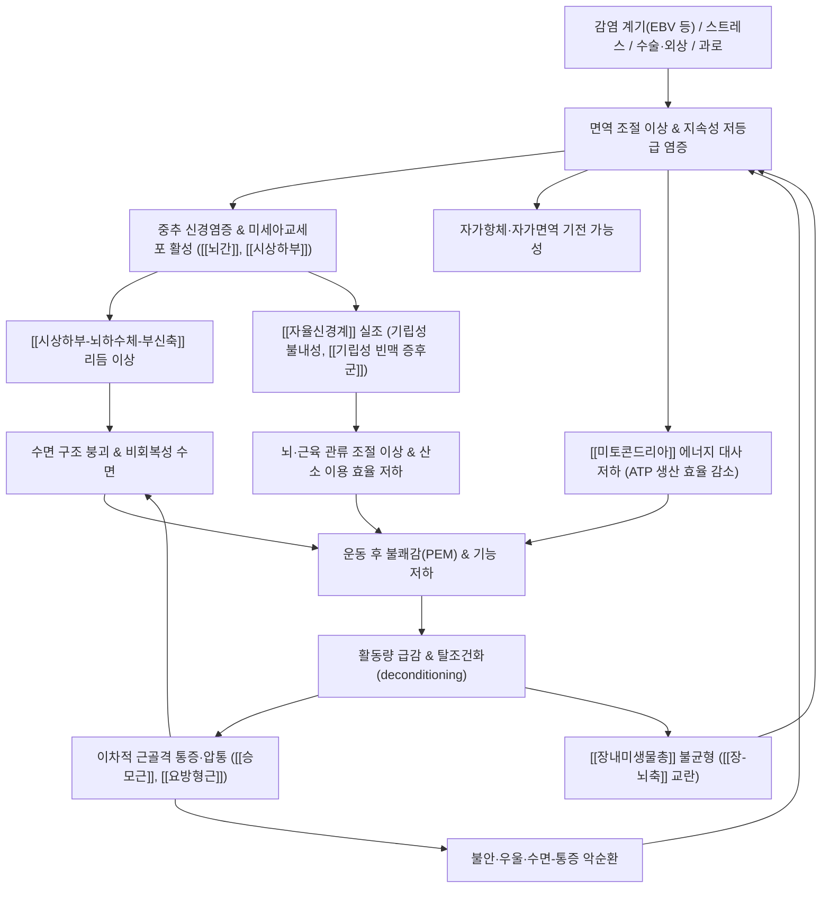

# 🩺 [[만성 피로 증후군]] (Myalgic Encephalomyelitis/Chronic Fatigue Syndrome, 慢性疲勞症候群, ICD-10 G93.3 / KCD-8 G93.3)

> **핵심 3줄 요약 (Key Summary)**:
> - 📍 병소 부위 & 해부·병태생리: 특정 관절·근육 하나에 국한된 국소 질환이 아니라 **중추신경계(뇌간·시상하부)–[[시상하부-뇌하수체-부신축]](HPA axis)–[[자율신경계]]–[[미토콘드리아]]–[[장내미생물총]]**을 축으로 하는 **전신성·다계통(multi-system) 질환**이다. 면역 조절 이상, 신경염증, 세포 에너지 대사 저하, 자율신경 실조가 맞물린다.
> - 🚩 전형적 임상 양상 & 3대 징후: ① **운동 후 불쾌감(PEM, Post-Exertional Malaise)** — 일상적 활동 후 수시간~수일 지속되는 압도적 악화, ② **비회복성 수면**, ③ **인지기능 저하(뇌안개, brain fog)**. 여기에 기립성 불내성, 근육통·관절통·인후통·림프절 압통, 두통이 동반된다.
> - 🛠️ 핵심 감별 검사 & 한·양방 다각적 치료 전략: 갑상선·빈혈·대사·감염·자가면역·수면·정신과적 감별을 위한 혈액검사와 [[기립 활력징후 검사]], [[섬유근육통 압통점 검사]] 등 이학적 검사가 핵심. 치료는 **양방의 증상별 대증 관리 + 페이싱(pacing)**과 **한방의 침·약침·추나·한약(보익·소간·화담) 통합 프로토콜**을 병행한다.
> - ⚠️ 응급 의뢰 레드플래그 & 악화 요인: 설명되지 않는 체중 감소·야간 발열·야한(night sweats)·국소 신경학적 결손·림프절 종대는 악성종양/감염/자가면역 질환 적신호. 자살 사고·중증 우울, 실신을 동반한 기립성 저혈압, 흉통·호흡곤란은 즉시 의뢰. **무리한 점진적 운동요법(GET)과 과도한 자극성 침·강한 사혈은 PEM을 유발·악화시킬 수 있어 절대적으로 신중히 적용한다.**

---

## 📌 목차
1. [질환 개요 & 해부학적 병태생리](#1-질환-개요--해부학적-병태생리)
2. [병태생리 메커니즘 & 생체역학적 악순환 네트워크](#2-병태생리-메커니즘--생체역학적-악순환-네트워크)
3. [임상 증상 & 이학적 검사(Physical Exam) 알고리즘](#3-임상-증상--이학적-검사physical-exam-알고리즘)
4. [감별 진단 매트릭스 (Differential Diagnosis)](#4-감별-진단-매트릭스-differential-diagnosis)
5. [한의 통합 치료 프로토콜 (침·약침·추나·한약)](#5-한의-통합-치료-프로토콜-침약침추나한약)
6. [재활 운동 & 생활습관 티칭 가이드](#6-재활-운동--생활습관-티칭-가이드)
7. [💡 사용자 진료실 핵심 필기 & 임상 노하우 (Melt-In 잔여 심화 집약)](#7--사용자-진료실-핵심-필기--임상-노하우-melt-in-잔여-심화-집약)
8. [출처 및 학술 참고 문헌 (References)](#8-출처-및-학술-참고-문헌-references)

---

## 1. 질환 개요 & 해부학적 병태생리

![[만성 피로 증후군_1.jpg|540]]
> [그림 1: White matter (WM) volume interaction results for (A). Group × asleep heart rate (Table 3, items 2, 7, 8 and Fig. 4B,C), ]

![[만성 피로 증후군_2.jpg|540]]
> [그림 2: Normal adult TUS anatomy in detail.]

* **질환 정의 및 분류**:
  * **정의**: 만성 피로 증후군(CFS)은 **의학적으로 설명되지 않는 심한 피로가 6개월 이상 지속**되면서, 수면·휴식으로 회복되지 않고, 일상생활 기능을 현저히 저하시키는 질환군이다. 1994년 Fukuda 등이 제시한 CDC 감시 기준(case definition)은 ① 임상적으로 평가되고 설명되지 않는 지속적·재발성 피로가 6개월 이상 지속되어 직업·사회·개인 활동을 50% 이상 감소시키는 경우를 전제로, ② 다음 8개 부속 증상 중 4개 이상이 동반될 것을 요구한다 — 기억력·집중력 손상, 인후통, 경부·액와 림프절 압통, 근육통, 다관절통, 새로운 양상의 두통, 비회복성 수면, 그리고 **운동 후 24시간 이상 지속되는 불쾌감(post-exertional malaise)**. (Fukuda K, Straus SE, 1994, PMID: 7978722)
  * **명칭의 이원화**: 과거 영국·유럽 계열에서 사용하던 **근육통성 뇌척수염(Myalgic Encephalomyelitis, ME)**과 미국 계열의 **CFS**가 통합되어 현재는 **ME/CFS**로 병기하는 것이 국제적 관행이다. Sharpe M(1996)은 당시 CFS의 개념 형성과 진단 체계의 논쟁점을 정리하며, 증상 기반 증후군으로서의 진단적 한계와 감별의 중요성을 강조하였다. (Sharpe M, 1996, PMID: 8856816)
  * **진단 체계의 변천**: Grach SL, Seltzer J(2023)는 ME/CFS의 **진단 기준의 변천과 실제 임상에서의 적용, 그리고 관리 전략**을 종합적으로 정리하였다. 이 문헌에서 핵심은 "배제 진단(exclusion)"이 아니라 **특징적 증상 군집의 확인 + 감별 질환 배제**를 병행하는 접근이며, 특히 PEM이 진단적 중핵으로 취급된다는 점이다. (Grach SL, Seltzer J, 2023, PMID: 37793728)
  * **분류 코드**: ICD-10 / KCD-8 상 **G93.3**(바이러스 감염 후 피로 증후군, 양성 근육통성 뇌척수염)로 분류된다. 단순한 "피로"만 있는 경우는 **R53.82**(만성 피로, 상세불명)로 구분되므로, 진단서·청구 코드 기재 시 감별이 필요하다.
  * **역학적 특성**: 성인 여성에서 남성보다 흔하고, 30~50대에 호발하는 것으로 보고된다. 유병률은 **연구 설계와 적용한 진단 기준에 따라 추정치의 편차가 매우 커서 일률적 수치 제시가 어렵다(근거 미확인)**. 소아청소년에서도 발생하며, Chutko LS, Surushkina SY(2024)는 소아 CFS의 임상 양상과 치료 접근을 별도로 다루고 있다 — 소아에서는 **학업 수행 저하, 두통, 수면장애, 정서·행동 문제**가 성인과 다른 양상으로 두드러진다. (Chutko LS, Surushkina SY, 2024, PMID: 39435774)
  * **유발 계기**: Epstein-Barr virus(EBV) 등 바이러스 감염 후 발병하는 **감염 후 피로 증후군(post-infectious fatigue)** 양상이 흔하다. Arron HE, Marsh BD(2024)는 ME/CFS를 "방치된 질환(neglected disease)"으로 규정하며, 감염 계기 이후 **면역계의 지속적 이상이 남는 기전**을 주요 축으로 검토하였다. (Arron HE, Marsh BD, 2024, PMID: 38887284)

* **관련 해부학적 구조물** (국소 해부가 아닌 **기능적 해부 단위** 중심으로 정리):
  * **중추신경계**: [[뇌간]] 및 [[시상하부]] — 자율신경 중추 조절, 체온·수면·호르몬 리듬 조절 부위. 신경염증(neuroinflammation) 및 미세아교세포(microglia) 활성화가 논의되는 영역이다. [[대상회]], [[전전두엽]] — 인지기능 저하·뇌안개의 기능적 상관 부위.
  * **내분비축**: [[시상하부-뇌하수체-부신축]](HPA axis) — 코르티솔 일중 리듬 이상, 스트레스 반응 둔화가 보고되는 축.
  * **자율신경계**: [[미주신경]](부교감), 교감신경절 — 기립성 불내성, [[기립성 빈맥 증후군]](POTS) 유사 양상, 말초 냉감·혈류 조절 이상과 연결된다.
  * **근육 및 근막**: [[승모근]], [[경추 심부굴근]], [[요방형근]], [[대둔근]] 등 — 만성 통증·압통 호소 부위. 단, 이는 **원발성 근육병변이 아니라 중추 감작(central sensitization) 및 활동 저하로 인한 이차적 근골격 문제**로 해석하는 것이 타당하다.
  * **면역·림프계**: [[경부 림프절]], [[액와 림프절]] — 압통성 종대 없이 압통만 호소하는 경우가 특징적(Fukuda 1994의 부속 증상).
  * **장축**: [[장내미생물총]], [[장-뇌축]](gut-brain axis) — 미생물총 불균형과 전신 염증성 사이토카인 변화가 연구 축으로 제시된다.
  * **세포 소기관**: [[미토콘드리아]] — 산화적 인산화(oxidative phosphorylation) 효율 저하, 에너지 대사 이상이 "운동 후 악화"의 생물학적 기반으로 논의된다.

---

## 2. 병태생리 메커니즘 & 생체역학적 악순환 네트워크

### 1) 면역 조절 이상 & 지속성 염증 기전
* ME/CFS에서는 **급성 감염이 종결된 후에도 면역 활성화 상태가 완전히 종료되지 않는** 양상이 관찰된다. Arron HE, Marsh BD(2024)는 자연살해(NK)세포 기능 저하, T세포 아형 분포 변화, 사이토카인 프로파일 이상, 그리고 자가항체 존재 가능성 등을 "방치된 질환"의 생물학적 근거로 종합하였다. (PMID: 38887284)
* 즉, 본 질환은 **"피로"라는 주관적 증상의 문제가 아니라, 면역–신경–내분비 상호작용의 조절 실패**로 이해하는 것이 병태생리의 출발점이다.
* 다만 개별 환자에서 어떤 면역 지표가 일관되게 이상을 보이는지에 대해서는 **연구 간 이질성이 크며 확정된 단일 바이오마커는 아직 없다(근거 미확인)**.

### 2) 중추신경계 신경염증 & 인지기능 저하
* 미세아교세포 활성화, 신경전달물질 대사 변화가 뇌안개·집중력 저하·감각 과민과 연결된다는 가설이 제시된다. (Arron HE, Marsh BD, 2024, PMID: 38887284)
* 임상적으로는 **"피로해서 집중이 안 된다"가 아니라 "인지 자원 자체가 고갈되어 오류가 급증한다"**는 양상으로 나타나며, 이는 단순 우울증의 인지 증상과 감별 포인트가 된다.

### 3) 미토콘드리아·에너지 대사 기전 — PEM의 생물학
* 본 질환의 가장 특징적인 증상인 **PEM(post-exertional malaise)**은 "피로가 조금 더 심해짐"이 아니라 **역치를 넘는 활동 이후 수시간~수일간 기능이 붕괴되는 현상**이다.
* 산화적 인산화 효율 저하, 젖산 대사 이상, 산소 이용 효율 저하 등의 기전이 논의되며, 이는 **운동부하검사에서 정상인과 다른 대사 반응 패턴**으로 나타난다는 연구들이 있다. 다만 검사 프로토콜과 결과 해석은 표준화되어 있지 않아 **임상 진단 도구로의 사용은 근거 미확인**이다.
* 임상적 결론: **"조금씩 늘려가면 된다"는 통상적 재활 논리가 이 질환에서는 성립하지 않는다**. 이것이 한의 치료 프로토콜 설계 시에도 결정적 전제가 된다.

### 4) 자율신경 실조 & 순환 조절 이상
* 기립 시 혈압·맥박 조절 실패로 어지럼, 실신감, 말초 냉감, 두통이 나타난다. POTS(기립성 빈맥 증후군)와의 중복 진단이 흔하다. (Grach SL, Seltzer J, 2023, PMID: 37793728)
* 뇌 관류 및 근육 산소 공급 효율 저하는 다시 피로·인지 저하를 악화시키는 **양성 피드백 고리**를 형성한다.

### 5) HPA축·수면·정서의 삼각 악순환
* 코르티솔 일중 변동성 둔화, 스트레스 반응 저하가 보고된다.
* **수면–통증–정서**의 삼각 고리가 자율신경 실조와 결합해 만성화를 주도한다. 이 고리는 한의학적으로는 **기허(氣虛)·혈허(血虛)·간울(肝鬱)·담습(痰濕)**의 복합 병기로 해석할 수 있는 지점이다.

### 6) 생체역학적 연쇄 반응 (Kinetic Chain)
* 활동량 급감 → 심폐·근골격 탈조건화 → 경추 심부굴근·견갑 안정화 근군 약화 → 상부 승모근·흉쇄유돌근 과긴장 → [[긴장성 두통]] 및 경부 통증 → 수면 악화 → 피로 심화.
* 요추부에서는 [[요방형근]]·[[대둔근]] 약화로 골반 안정성이 저하되고, 장시간 와위·좌위 생활이 이를 가속한다.
* **중요**: 이 연쇄는 원인이 아니라 **결과**다. 따라서 근골격 치료만으로는 근본 해결이 되지 않으며, 에너지 관리(pacing)와 전신 조절이 선행되어야 한다.

---

## 3. 임상 증상 & 이학적 검사(Physical Exam) 알고리즘

### 1) 주소증 및 신경학적 증상

* **핵심 증상 3종 (진단적 중핵)**:
  * **운동 후 불쾌감(PEM)**: 평소 가능했던 활동 후 수시간~수일간 극심한 피로·인지 저하·통증 악화. **본 질환을 다른 피로 질환과 구분하는 가장 강력한 단서**이다. (Grach SL, Seltzer J, 2023, PMID: 37793728)
  * **비회복성 수면**: 충분히 자도 개운하지 않음, 수면 시간과 무관한 피로.
  * **인지기능 저하(뇌안개)**: 단어 찾기 어려움, 집중 유지 실패, 작업 기억 저하.

* **동반 증상 (Fukuda 1994 부속 증상군)**:
  * **감각·통증 이상**: [[근육통]], [[다관절통]](부종·발적 없음), 신경병증성 통증보다는 **미만성·이동성 심부 통증** 양상.
  * **두통**: 새로운 양상·새로운 강도의 두통.
  * **인후통**: 반복적, 경미하나 지속적.
  * **림프절 압통**: 경부·액와부, **종대는 동반하지 않는 압통**이 특징. 종대가 있으면 감별 필요.
  * **자율신경 증상**: 기립 시 어지럼·실신감, 말초 냉감, 안면 홍조, 소화불량, 과민성 방광, 체온 조절 이상.
  * **운동 장애**: 객관적 근력 저하는 흔치 않으나, **근력 발현의 지속성(endurance) 저하**와 정밀 동작 오류 증가가 나타난다. 진짜 근력 저하·근위축이 있으면 신경계 질환 감별이 우선이다.
  * **혈관 증상**: 청색증·부종은 흔치 않다. 있다면 심부전·정맥질환 감별.

* **소아청소년 특이 양상**: Chutko LS, Surushkina SY(2024)에 따르면 소아 CFS에서는 **학업 수행 저하, 집중력 저하, 두통, 수면장애, 정서 불안정**이 주요 호소로 나타나며, 성인보다 **보호자·학교 환경 요인의 영향**이 크다. 성장·발달 평가와 등교 거부 등 이차적 문제에 대한 접근이 함께 필요하다. (PMID: 39435774)

### 2) 필수 이학적 검사법 (Physical Examination)

ME/CFS는 **"정상 이학적 소견"이 오히려 전형적**이라는 역설을 이해해야 한다. 따라서 이학적 검사의 목적은 진단 확정이 아니라 **감별 질환 배제**와 **기능 평가**에 있다.

* [[기립 활력징후 검사]](Orthostatic Vital Signs): 누운 자세와 기립 후 1·3·5·10분의 혈압·맥박 측정. 기립성 저혈압 및 POTS 감별. **본 질환에서 가장 수율이 높은 이학적 검사**로, 양성 시 자율신경 실조 동반을 시사한다. (Grach SL, Seltzer J, 2023, PMID: 37793728)
* [[섬유근육통 압통점 검사]]: 18개 압통점 중 11개 이상 압통 시 섬유근육통 중복 진단을 고려. ME/CFS와의 중복은 흔하나, **PEM의 유무**가 감별의 결정적 단서다.
* [[갑상선 촉진]] 및 전신 림프절 촉진: 갑상선 종대·결절, 림프절 종대(악성종양·감염 적신호) 확인.
* [[신경학적 검사]](뇌신경·심부건반사·근력·감각·협응·보행): **국소 신경학적 결손이 있으면 ME/CFS 진단을 보류하고 중추신경계 질환을 우선 배제**한다.
* [[심폐 청진]] 및 활력징후: 심잡음, 부정맥, 호흡음 이상 확인.
* [[수면 평가]](수면 일지, 필요 시 수면다원검사): 수면무호흡, 주기성 사지운동, 하지불안증후군 배제.
* [[정신건강 선별검사]](PHQ-9, GAD-7 등): 우울·불안의 중복 여부 평가. **단, 우울증이 있다고 해서 ME/CFS 진단이 배제되는 것은 아니며, 반대로 ME/CFS가 있다고 우울증 평가를 생략해서는 안 된다.** 자살 사고는 반드시 별도 확인.
* **보조적 평가(연구적·선별적)**: 2일 연속 운동부하검사(CPET)에서 대사 역치 저하 패턴이 보고되나 **표준화 부족으로 임상 상용화는 근거 미확인**. 기립경 검사(tilt table)는 POTS 감별에 유용.

---

## 4. 감별 진단 매트릭스 (Differential Diagnosis)

> **핵심 원칙**: ME/CFS는 배제 진단적 성격을 강하게 지닌다. 반드시 **갑상선·혈액·대사·감염·자가면역·수면·정신과** 영역의 감별을 선행한다.

| 감별 질환 | 호발 병소 및 원인 | 주소증 차이점 | 특이적 이학적 검사 소견 |
| :--- | :--- | :--- | :--- |
| **[[만성 피로 증후군]] (본 질환)** | 면역–신경–내분비–미토콘드리아 다계통 | **PEM이 핵심.** 활동 후 수일 지속 악화, 비회복성 수면, 뇌안개, 기립성 불내성 | 이학적 소견 대개 정상. [[기립 활력징후 검사]] 이상 가능, 림프절 압통(종대 없음), 혈액검사 정상 |
| **[[갑상선기능저하증]]** | 갑상선 호르몬 결핍 | 추위 민감, 체중 증가, 변비, 건조 피부, 서맥. **활동 후 며칠간 붕괴되는 PEM 양상은 드묾** | 갑상선 종대/결절, 심부건반사 이완 지연, TSH·free T4 이상 |
| **[[수면무호흡증]]** | 상기도 폐쇄, 야간 저산소혈증 | 주간 졸림(수면 후에도 졸림), 코골이, 아침 두통. **"자면 개운해지는가" 문진으로 감별** | 비만, 구인두 협착, 수면다원검사 AHI 상승 |
| **[[우울증]] / [[양극성장애]]** | 중추 단가아민 조절 이상 | 무쾌감증·죄책감·자살 사고가 전면. **PEM 양상은 비특징적** (단, 중복 가능) | PHQ-9/GAD-7 양성, 정신운동 지연 또는 초조 |
| **[[철결핍성 빈혈]] 및 기타 빈혈** | 철·B12·엽산 결핍, 만성 출혈 | 노작성 호흡곤란, 창백, 이식증, 설염 | 결막 창백, Hb·ferritin·MCV 이상 |
| **[[기립성 빈맥 증후군]](POTS)** | 자율신경 조절 실패 | 기립 시 심계항진·어지럼이 우세. **ME/CFS와 고빈도 중복** | 기립 10분 내 맥박 30bpm 이상 상승(성인), 혈압 강하 동반 가능 |
| **[[부신기능저하증]]** | 부신皮质 호르몬 결핍 | 체중 감소, 기립성 저혈압, 색소침착, 염분 갈망 | 기립성 저혈압, Na↓ K↑, 코르티솔·ACTH 이상 |
| **[[당뇨병]] / 대사증후군** | 인슐린 저항성 | 다음·다뇨·체중 변화, 식후 졸림 | 공복혈당·HbA1c 이상 |
| **[[류마티스관절염]] / [[전신홍반루푸스]]** | 자가면역 염증 | 관절 종창·조조강직, 발진·광과민, 장기 침범 | 관절 종창, RF·anti-CCP·ANA 양성, ESR·CRP 상승 |
| **[[다발성경화증]] 등 중추신경계 탈수초질환** | 중추 탈수초 | **국소 신경학적 결손**(시신경염, 감각 이상, 운동 약화) | 신경학적 검사 이상, MRI 병변 |
| **만성 감염(EBV 재활성, HIV, 결핵, C형간염)** | 지속성 병원체 | 야간 발열, 야한, 체중 감소, 림프절 종대 | 발열, 림프절 종대, 혈청학적 검사 양성 |
| **악성종양(림프종 등)** | 종양성 전신 반응 | **설명되지 않는 체중 감소·야한·림프절 종대** | 림프절 종대, 야간 발열, 종양 표지자·영상 이상 |
| **약물 유발 피로** | 베타차단제, 항히스타민, 벤조디아제핀, 스타틴 등 | 복용 시작과 증상 발생의 시간적 연관성 | 약물 검토로 감별 |

---

## 5. 한의 통합 치료 프로토콜 (침·약침·추나·한약)

> **치료 대전제**: 본 질환의 핵심 병리는 **에너지 생산 효율 저하와 조절계 실조**이므로, **"강하게 자극해서 몰아붙이는 치료"는 금기**에 가깝다. 치료 목표는 ① 자율신경 안정, ② 수면 질 개선, ③ 에너지 대사 회복 지원, ④ 이차적 근골격 통증 완화이며, **치료 강도는 환자의 PEM 역치 이내로 제한**한다.

* **침구 치료 (Acupuncture)**:
  * **기본 방향**: 자율신경 안정 + 기혈 보충 + 소간 해울.
  * **주요 혈위**:
    * 전신 조절·보기(補氣): [[족삼리]](ST36), [[삼음교]](SP6), [[관원]](CV4), [[기해]](CV6), [[태계]](KI3).
    * 안신·수면: [[신문]](HT7), [[내관]](PC6), [[사신총]](EX-HN1), [[백회]](GV20), [[안면]](EX-HN3).
    * 배수혈 조정: [[심수]](BL15), [[간수]](BL18), [[비수]](BL20), [[신수]](BL23).
    * 경항부 이차 통증: [[풍지]](GB20), [[천주]](BL10), [[견정]](GB21) — **자극 강도 최소화**.
  * **전침 세팅**: 저주파(2 Hz) 위주로 자율신경 안정 목적 사용. **고빈도·강자극(100 Hz, 강한 근수축 유발)은 피로 악화를 유발할 수 있어 회피**(임상적 권고, 근거 미확인). 유침 시간 15~20분 내외로 짧게, 첫 방문은 특히 짧게 설정.
  * **자극량 원칙**: 환자가 시술 직후 "개운함"을 보고하면 적정, 시술 당일 밤~다음날 증상이 악화되면 **자극량 과다**로 판정하고 다음 회차에 혈위 수와 자극 강도를 줄인다. 이는 본 질환 한방 치료의 가장 중요한 안전 규칙이다.

* **약침 치료 (Pharmacopuncture)**:
  * **목적**: 보기(補氣) 및 소염·순환 개선. **주입량은 통상보다 적게(0.1~0.3 mL/점), 주입점 수도 4~6점 이내로 제한**하는 것이 안전하다.
  * **추천 약침**:
    * [[황기 약침]]: 기허형 만성 피로의 기본. 보기 고양 목적.
    * [[인삼 약침]] / [[녹용 약침]]: 심기허·양허형, 극심한 무력감 동반 시.
    * [[자하거 약침]]: 기혈허·신허형, 회복 지연형.
    * [[당귀 약침]]: 혈허형, 어지럼·창백 동반.
    * [[봉독 약침]]: 항염·면역 조절 목적이나 **아나필락시스 위험과 자율신경 자극 가능성**이 있어 본 질환에서는 신중. 반드시 피부반응 검사 후 소량으로 시작.
  * **주요 시술점**: [[족삼리]](ST36), [[삼음교]](SP6), [[신수]](BL23), [[비수]](BL20), [[견정]](GB21), [[풍지]](GB20) 및 경항부 압통점.
  * **금기**: 발열·감염 의심 시, 항응고제 복용 중, 임신부 특정 혈위, 봉독 알레르기 병력.

* **추나 치료 (Chuna Manipulation)**:
  * **방향**: 강한 교정(high-velocity thrust)보다 **이완·가동성 회복 위주**가 원칙. 목표는 통증 완화를 통한 **수면 질 개선**이다.
  * **적용 기법**:
    * 경항부·흉추부 [[근막 이완 수기(JS)]] 및 연부조직 이완.
    * 흉추 가동 추나(thoracic mobilization): 호흡 보조 및 자율신경 안정 목적.
    * 골반·요추부 이완: 장시간 와위로 인한 [[요방형근]]·[[대둔근]] 긴장 완화.
    * 두개천골 리듬 접근(craniosacral): 이완 유도, 스트레스 반응 완화 목적.
  * **금기 수기**: 경추부 고속 회전 교정(high-velocity cervical thrust) — 본 질환에서는 **혈류 조절 이상 및 자율신경 예민성**을 고려해 가급적 회피한다. 골절·종양·감염·척추 불안정성 의심 시 추나 전면 금기.
  * **강도 원칙**: 시술 후 피로감이 다음 날까지 지속되면 강도 과다. "치료 다음 날 더 아프면 실패한 치료"라고 환자에게 미리 설명한다.

* **한약 치료 (Herbal Medicine)**:
  * **변증별 기본 방향**:

| 변증 유형 | 주요 증상 | 대표 방향 | 대표 처방(예시) |
| :--- | :--- | :--- | :--- |
| **기허(氣虛)** | 무력감, 기력 저하, 자한, 식욕 저하, 변 무름 | 보기(補氣) | [[보중익기탕]], [[사군자탕]], [[향사육군자탕]] |
| **기혈양허(氣血兩虛)** | 심계, 어지럼, 불면, 창백, 손발 저림 | 기혈 쌍보 | [[십전대보탕]], [[팔진탕]], [[귀비탕]] |
| **음허(陰虛)** | 오심번열, 야간 도한, 구건, 불면, 홍조 | 자음(滋陰) | [[육미지황환]], [[지백지황환]], [[천왕보심단]] |
| **간울(肝鬱)** | 스트레스 시 악화, 흉협고만, 탄식, 우울·불안 | 소간 해울 | [[소요산]], [[시호소간산]], [[가미소요산]] |
| **담습(痰濕)** | 몸이 무겁고 처짐, 두중감, 구갈 불욕음, 설태 후니 | 화담 건비 | [[이진탕]], [[온담탕]], [[반하백출천마탕]] |
| **어혈(瘀血)** | 통증 고정, 야간 악화, 안색 암침, 설 암자 | 활혈 거어 | [[부원환]], [[계지복령환]](하초 어혈 시) |

  * **급성기 vs 만성기 접근**: 감염 직후 발병 초기에는 **청열·화담·소간** 위주(급성 반응 조절), 6개월 이상 만성기에는 **보기·양혈·자음** 중심으로 전환한다. 단, **감염 증상(발열·인후통 급성기)이 남아 있는 시점에 무리한 보익제(인삼·녹용 등)를 투여하면 열이 남아 있을 수 있어 주의**한다.
  * **복약 지도**: 하루 2~3회 복용, 공복 시 위장 장애가 있으면 식후 복용. 카페인·에너지 드링크와 병용 금지(수면 리듬 교란).
  * **주의**: 한약의 ME/CFS에 대한 임상적 유효성은 **대규모 무작위 대조시험 근거가 확립되어 있지 않다(근거 미확인)**. 따라서 본 프로토콜은 변증 논리에 기반한 임상적 접근이며, 양방 감별·관리와 병행함을 원칙으로 한다.

---

## 6. 재활 운동 & 생활습관 티칭 가이드

> **최우선 원칙: Pacing(페이싱, 에너지 관리) > 운동 강화.** 본 질환에서 통상적 "조금씩 늘려가는 운동요법"은 PEM을 유발해 기능을 악화시킬 수 있다. Grach SL, Seltzer J(2023)의 관리 전략에서도 **에너지 관리와 증상별 대증 접근이 중심**이며, 환자 개별화가 강조된다. (PMID: 37793728)

* **에너지 봉투 이론(Energy Envelope) 티칭**:
  * 환자에게 "하루에 쓸 수 있는 에너지 총량은 정해진 통장 잔고와 같다"고 설명한다. 잔고를 초과 인출하면 **다음 날이 아니라 24~72시간 후에 청구서가 온다**.
  * **기준선(baseline) 설정**: "증상이 악화되지 않고 할 수 있는 활동량"을 찾아 그 **80% 수준**에서 일상을 유지한다.
  * **PEM 회피 규칙**: 활동 후 증상 악화가 다음 날까지 지속되면 그 활동량은 **역치 초과**로 판정하고, 즉시 감량한다.

* **이완 및 스트레칭 (Stretching)**:
  * 단축된 [[승모근]], [[견갑거근]], [[흉쇄유돌근]]에 대한 **가벼운 정적 스트레칭 15~20초 × 3회**. 통증 없는 범위에서만.
  * 요추부는 [[요방형근]], [[장요근]] 이완 위주.
  * **전신 스트레칭을 20분 이상 지속하는 것은 PEM 유발 위험** — 짧게, 하루 1~2회로 분할한다.

* **강화 및 안정화 운동 (Strengthening)**:
  * **등척성(isometric) 저강도 운동부터**: 복횡근·다열근 활성화, 견갑 안정화(serratus anterior, lower trapezius) 위주. **1세트 5~8회, 주 2~3회로 극히 소량 시작**.
  * **절대 원칙**: 운동 중 어지럼·심계항진·인지 흐려짐이 발생하면 즉시 중단.
  * 유산소 운동은 PEM이 안정된 환자에서만, **와위·좌위 자전거 등 기립 부담이 적은 형태**로 초단위(3~5분) 시작.

* **신경 활주 운동 (Neurodynamics)**:
  * 경항부 긴장 및 상지 저림감 호소 시 신경 슬라이딩(median nerve slider 등)을 **저강도·소량**으로 적용.
  * 본 질환에서 신경 포착이 원발 병리가 아니므로, 이는 **이차적 긴장 완화 목적으로만 사용**한다.

* **자율신경·기립성 관리**:
  * 기상 시 **30초~1분간 천천히 일어나기**, 필요 시 압박 스타킹·복부 압박.
  * 수분·염분 섭취 조절(단, 고혈압·심장질환 시 의사 상담 필수).
  * 아침 기립 훈련은 **짧고 반복적으로**.

* **수면 위생 (Sleep Hygiene)**:
  * 기상 시간 고정(취침 시간보다 기상 시간 고정이 우선).
  * 낮잠은 20~30분 이내, 오후 3시 이전.
  * 카페인은 오후 2시 이후 금지, 알코올은 수면 구조를 파괴하므로 금지.
  * 스크린 사용은 취침 1시간 전 중단.

* **일상생활 자세 티칭 (Ergonomics)**:
  * 모니터 상단을 눈높이에 맞추고, 팔꿈치 90도, 발바닥 전체 지지.
  * 장시간 앉기보다 **20~30분마다 짧은 기립·스트레칭**(단, 과도한 기립은 자율신경 증상 유발 가능).
  * 가사·업무는 **분할 수행** 원칙: 20분 활동 → 10분 휴식, 하루 활동의 총량은 계획적으로 예산 배분.

* **식이 및 보조 요법**:
  * 규칙적 소량 식사, 정제당·카페인·알코올 최소화.
  * 수분 섭취 충분히. 단, 특정 영양보충제(코엔자임Q10, D-리보스, 마그네슘 등)의 유효성은 **근거 미확인**이며, 복용 시 담당 의사와 상의하도록 안내.

---

## 7. 💡 사용자 진료실 핵심 필기 & 임상 노하우 (Melt-In 잔여 심화 집약)

> [!IMPORTANT]
> **🛡️ 7번 섹션 운용 원칙**
> 1. 본 질환은 **국소 근골격 질환이 아니라 조절계 질환**이라는 관점을 치료실 운영 전체에 일관되게 적용한다. 기본 병태생리·증상·치료 원칙은 상부 1~6번 섹션에 융합(Melt-In)하였다.
> 2. 아래에는 **상부에 다 담기지 않은 진료실 실전 운영 노하우**만 압축한다.

* **상부 섹션에 미처 다 담지 못한 고유 원문 필기**:
  * **"CFS는 진단명이 아니라 배제의 결론"**: 환자가 "만성피로증후군이라고 들었다"며 내원하면, **그 진단명에 안주하지 말고 감별 목록을 처음부터 다시 점검**한다. 실제로 갑상선 질환, 수면무호흡, 약물 부작용, 우울증이 뒤늦게 발견되는 경우가 적지 않다. 본 질환 노트의 4번 섹션 감별표는 내원 초진 시 **체크리스트로 실제 사용**한다.
  * **"피로의 성질을 구분하라"**: 환자가 말하는 "피로"를 반드시 세 가지로 나누어 문진한다 — ① 밤에 잠을 자면 풀리는 피로(수면 문제·일과성), ② 지속적으로 깔려 있는 피로(기허·혈허·대사 문제), ③ **활동 후 뒤늦게 몰려오는 붕괴형 피로(③이면 PEM, 즉 ME/CFS 쪽)**. ③번을 확인하는 순간 치료 강도 설정이 완전히 달라진다.
  * **한의학적 병기 해석**: ME/CFS의 PEM은 **"기(氣)가 회복되기 전에 다시 소모된 상태"**로 볼 수 있다. 따라서 보익제를 쓰더라도 **환자가 활동량을 줄이지 않으면 한약 효과가 상쇄된다**. 진료실에서 한약 처방과 함께 반드시 **활동 예산표(activity budget sheet)**를 종이에 적어 건네는 것이 핵심이다.

* **진료실 실전 감별 & 치료 노하우**:
  * **1. 실전 문진 체크리스트 (초진 5분 내 확인)**
    1. "**자고 나면 개운한가요?**" — 아니오 → 비회복성 수면, ME/CFS 의심도 상승.
    2. "**무리한 다음 날 바로 힘든가요, 아니면 하루 이틀 뒤에 힘든가요?**" — **지연성 악화**라면 PEM 가능성 높음.
    3. "**일할 때 예전처럼 머리가 돌아가나요?**" — 뇌안개 확인.
    4. "**일어설 때 어지럽거나 심장이 두근거리나요?**" — 자율신경 실조/POTS 선별.
    5. "**체중이 줄었나요? 밤에 식은땀이 나나요?**" — 있으면 **즉시 악성종양·감염 의뢰**.
    6. "**기분 문제로 약을 드신 적 있나요? 지금 자살 생각이 드나요?**" — 정신과적 응급 확인(반드시 직접 질문).
  * **2. 치료 순서 및 손맛 노하우**
    * **자침 순서**: ① 환자를 편안한 와위로 눕히고 호흡을 30초간 안정시킨 뒤 ② [[백회]]·[[사신총]]·[[안면]]으로 상부 안신 → ③ [[내관]]·[[신문]] → ④ [[족삼리]]·[[삼음교]]·[[태계]] 순으로 **말단에서 중심으로** 진행한다. 자침 전 호흡 안정 단계를 생략하면 환자가 긴장한 상태로 자극이 들어가 **시술 후 오히려 피로를 호소**하는 경우가 많다.
    * **자극량 판정의 실전 감각**: 유침 중 환자가 **얕은 잠에 빠지면 적정**, 눈을 크게 뜨고 긴장하면 과자극이다. 조용한 환경과 조도 낮춤이 자극량 조절의 절반이다.
    * **약침 주입 각도**: 경항부는 **피하 0.5~1 cm 사자(斜刺)로 천자**하고 흡인 후 주입. [[족삼리]]·[[삼음교]]는 직자 1~1.5 cm. **주입 직후 5분간 환자를 앉히지 않고 와위 유지**시켜 미주신경 반응(어지럼·식은땀)을 예방한다.
    * **추나 적용 체위**: 경항부 이완은 반드시 **앙와위에서 베개를 낮게** 하고, 시술자는 손끝이 아닌 **전완(forearm)을 이용한 넓은 면적 압박**으로 접근한다. 좁은 면적의 강한 지압은 다음 날 통증과 피로를 유발한다.
    * **치료 간격 조정**: 일반 근골격 질환은 주 2~3회로 시작하지만, 본 질환은 **주 1회, 심한 경우 격주 1회로 시작**하고 환자 반응을 보고 조절한다. 잦은 내원 자체가 에너지 소모 요인이 될 수 있음을 환자에게 설명한다.
    * **"다음 날 컨디션"을 항상 다음 진료의 첫 질문으로 삼는다.** 이 답변이 곧 지난 회차 치료 강도의 채점표다.
  * **3. 환자 티칭 스크립트 (재발 방지·오해 교정용)**
    * **운동 권유를 거절해야 할 때**: "다른 질환에서는 운동이 약입니다. 그런데 지금 ○○님의 피로는 **운동으로 몸을 혹사시키면 며칠 뒤 청구서가 날아오는 유형**입니다. 지금은 근육을 키우는 단계가 아니라 **쓸 수 있는 에너지를 지키는 단계**입니다. 운동은 컨디션이 안정된 다음에 시작합니다."
    * **주변의 오해 대응**: "검사에서 이상이 없다고 해서 아픈 게 아닌 게 아닙니다. 이 질환은 **피로를 만드는 조절 시스템의 문제**라서 피검사에 잘 드러나지 않습니다. 대신 증상의 양상이 아주 특징적이라 그걸로 진단합니다."
    * **가족·직장 설명용**: "이 병은 의지의 문제가 아니라 **에너지 대사와 자율신경 조절의 문제**입니다. '마음먹기 나름'이라는 말은 증상을 악화시킵니다. 대신 **활동을 계획적으로 나누는 것**이 실제 치료입니다."
    * **재발 방지 3원칙**: ① **기상 시간 고정**, ② **활동은 계획하고 80%만**, ③ **몸이 보내는 지연 신호(다음 날 악화)를 무시하지 않기**.
    * **마무리 멘트**: "완치까지 시간이 걸리는 질환이지만, **강도를 낮추고 리듬을 맞추는 것만으로도 삶의 질이 확실히 올라갑니다.** 좋아졌다고 갑자기 활동을 늘리는 것이 가장 흔한 재발 원인입니다."

---

## 8. 출처 및 학술 참고 문헌 (References)

1. **Grach SL, Seltzer J (2023)**. *Diagnosis and Management of Myalgic Encephalomyelitis/Chronic Fatigue Syndrome*. **Mayo Clin Proc**. PMID: 37793728
   - **[연구 요약]**: ME/CFS의 진단 기준 변천과 임상 적용, 감별 진단의 실제, 그리고 PEM·자율신경 실조·수면 문제 등 증상별 관리 전략을 종합한 임상 리뷰. 본 노트의 진단·감별·이학적 검사(특히 기립 활력징후) 부분의 근거로 사용.
2. **Chutko LS, Surushkina SY (2024)**. *[Chronic fatigue syndrome in children]*. **Zh Nevrol Psikhiatr Im S S Korsakova**. PMID: 39435774
   - **[연구 요약]**: 소아청소년 만성 피로 증후군의 임상 양상과 치료 접근을 다룬 문헌. 성인과 다른 소아 특유의 학업 기능 저하·정서·수면 문제 양상의 근거로 인용.
3. **Sharpe M (1996)**. *Chronic fatigue syndrome*. **Psychiatr Clin North Am**. PMID: 8856816
   - **[연구 요약]**: CFS 개념 형성기의 진단 체계와 논쟁점, 정신과적 감별의 중요성을 정리한 고전적 문헌. 본 질환의 명칭 이원화(ME vs CFS) 및 개념사 서술의 근거로 사용.
4. **Fukuda K, Straus SE (1994)**. *The chronic fatigue syndrome: a comprehensive approach to its definition and study. International Chronic Fatigue Syndrome Study Group*. **Ann Intern Med**. PMID: 7978722
   - **[연구 요약]**: CFS의 국제적 감시 기준(case definition)을 확립한 문헌. 6개월 이상의 설명되지 않는 피로 + 8개 부속 증상 중 4개 이상(운동 후 불쾌감 포함)이라는 진단 구성 요소의 근거.
5. **Grach SL, Seltzer J (2023)**. *Diagnosis and Management of Myalgic Encephalomyelitis/Chronic Fatigue Syndrome*. **Mayo Clin Proc**. PMID: 37793728
   - **[연구 요약]**: 1번 문헌과 동일 문헌(중복 기재). 관리 전략 파트의 재확인용으로 참조.
6. **Arron HE, Marsh BD (2024)**. *Myalgic Encephalomyelitis/Chronic Fatigue Syndrome: the biology of a neglected disease*. **Front Immunol**. PMID: 38887284
   - **[연구 요약]**: ME/CFS를 "방치된 질환"으로 규정하고 면역 조절 이상, 신경염증, 자가면역 가능성, 에너지 대사·미토콘드리아 이상, 장-뇌축 등 생물학적 기전을 종합한 리뷰. 본 노트의 2번 섹션 병태생리 네트워크의 핵심 근거.

> **※ 근거 수준 표기 원칙**: 본 노트에서 "근거 미확인"으로 표시한 항목(정확한 유병률 수치, 확정된 단일 바이오마커, 2일 CPET의 임상 상용화, 특정 영양보충제 및 한약 처방의 대규모 RCT 유효성 등)은 **제공된 문헌만으로 확정할 수 없는 내용**이다. 임상 적용 시 최신 지침과 추가 문헌 확인이 필요하다.