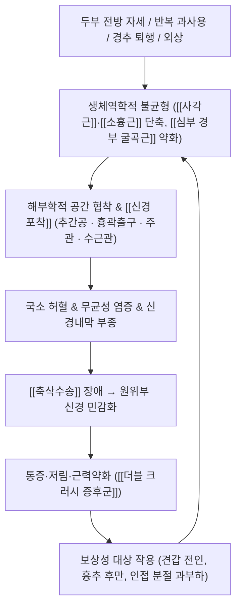

# 🩺 [[더블 크러시 증후군]] (Double Crush Syndrome / 二重壓迫症候群, ICD-10 별도 코드 없음 — G58.8\* / KCD-8 G58.8\*)

> **핵심 3줄 요약 (Key Summary)**:
> - 📍 **병소 부위 & 해부·병태생리**: 하나의 신경 축을 따라 **두 곳 이상**에서 포착이 겹치는 상태. 대표적으로 [[경추 신경근]](C5–C7, 추간공 협착) → [[사각근]]·제1늑골 부위 [[흉곽출구]]([[흉곽출구증후군]]) → [[주관]]·[[수근관]] 순으로 압박이 누적된다. 근위부 병소가 [[축삭수송]]을 저해해 원위부 신경을 압박에 취약(민감화)하게 만드는 것이 핵심 기전이다.
> - 🚩 **전형적 임상 양상 & 3대 징후**: ① 경추 피부분절(Dermatome)과 말초신경 자율영역이 **중첩된** 저림·이상감각, ② 야간에 악화되어 손을 털어야 하는 통증, ③ 악력 저하·무지구/제1배측골간근 위축. 단일 포착 병변에 비해 증상 강도가 세고 회복이 느리다.
> - 🛠️ **핵심 감별 검사 & 한·양방 다각적 치료 전략**: [[Spurling 검사]]·[[경추 견인 검사]]로 근위부를, [[Phalen 검사]]·[[Tinel 검사]]·[[주관 신경긴장검사]]로 원위부를, [[Adson 검사]]·[[Roos 검사]]로 흉곽출구를 **각각 독립적으로** 확인한다. 침·약침(포착점별 표적)·추나(경추 신연 + 제1늑골 하강 + 흉추 교정)·한약의 단계적 통합 프로토콜을 적용한다.
> - ⚠️ 응급 의뢰 레드플래그 & 악화 요인: 진행성 근력 저하(손 내재근 위축·악력 급감), 척수증·마미증후군(보행장애, 대소변 장애, 상·하지 동시 증상), 종양·감염·골절을 시사하는 야간통·발열·체중감소, 급성 흉곽출구 혈전(팔 부종·청색증·맥박 소실).

---

## 📌 목차
1. [질환 개요 & 해부학적 병태생리](#1-질환-개요--해부학적-병태생리)
2. [병태생리 메커니즘 & 생체역학적 악순환 네트워크](#2-병태생리-메커니즘--생체역학적-악순환-네트워크)
3. [임상 증상 & 이학적 검사(Physical Exam) 알고리즘](#3-임상-증상--이학적-검사physical-exam-알고리즘)
4. [감별 진단 매트릭스 (Differential Diagnosis)](#4-감별-진단-매트릭스-differential-diagnosis)
5. [한의 통합 치료 프로토콜 (침·약침·추나·한약)](#5-한의-통합-치료-프로토콜-침약침추나한약)
6. [양방 치료 & 병용·의뢰 기준 (Conventional Treatment & Referral)](#6-양방-치료--병용의뢰-기준-conventional-treatment--referral)
7. [재활 운동 & 생활습관 티칭 가이드](#6-재활-운동--생활습관-티칭-가이드)
8. [💡 사용자 진료실 핵심 필기 & 임상 노하우 (Melt-In 잔여 심화 집약)](#7--사용자-진료실-핵심-필기--임상-노하우-melt-in-잔여-심화-집약)
9. [출처 및 학술 참고 문헌 (References)](#8-출처-및-학술-참고-문헌-references)

---

## 1. 질환 개요 & 해부학적 병태생리

![[더블 크러시 증후군_1.jpg|540]]
> [그림 1: Battle casualties in Korea - studies of the Surgical Research Team (IA battlecasualties00unit).pdf]

* **질환 정의 및 분류**:
  * **정의**: 더블 크러시 증후군(Double Crush Syndrome, DCS)은 **동일한 신경 축(nerve axis)의 주행 경로를 따라 두 개 이상의 해부학적 부위에서 만성 압박(포착)이 발생**하여, 각 압박을 단독으로 평가했을 때 예상되는 것보다 훨씬 심한 신경 기능 장애가 나타나는 상태를 말한다. 즉 근위부 병소(예: [[경추 신경근병증]], [[흉곽출구증후군]])가 원위부 신경(예: [[정중신경]])을 **민감화(sensitization)**시켜, 원위부에 존재하는 두 번째 병소(예: [[수근관증후군]])에서 증상이 발현·증폭되는 개념이다 (Kane & Daniels, 2015; Osterman, 1988).
  * **역사 및 개념 발전**: Upton과 McComas가 1973년에 "double crush" 개념을 처음 제시하였고, Osterman(1988)이 상지 신경 포착 영역에서 이를 임상적으로 체계화하였다. 이후 Kane & Daniels(2015)가 JAAOS 종설로, Phan & Shah(2021)가 상지 DCS에 특화된 JBJS Reviews 리뷰로 정리하였으며, Ghali & Ehlen(2026)의 *Hand* 리뷰가 최신 문헌을 종합하였다. 나아가 압박이 3개 이상 겹치는 **다발성 압박(multiple crush)** 개념으로 확장되었다.
  * **분류**: ① 전형적(정방향) DCS — 근위부 병소가 원위부 병소를 취약하게 만드는 형태. ② **역방향 DCS(reverse DCS)** — 원위부 병변(예: [[당뇨병성 말초신경병증]])이 근위부 신경의 취약성을 증가시키는 형태. ③ 부위별 분류 — 상지형(경추·흉곽출구·주관·수근관), 하지형(요추 신경근·비골두·족근관).
  * **호발 연령/성별/직업군**: 정확한 유병률·발생률은 **근거 미확인**. 정의와 진단 기준이 연구마다 다르고 후향적 진단에 의존하기 때문이다. 다만 반복적 상지 과사용 직업군(컴퓨터 작업, 주방·미용·용접·조립 라인), 두부 전방 자세가 고착된 사무직, 경추 퇴행성 변화가 있는 중·장년층에서 상지 DCS가 흔히 관찰된다 (Phan & Shah, 2021).
  * **동반율에 대한 주의**: Upton & McComas의 원 보고에서 수근관증후군·척골신경병증 환자의 상당수(흔히 "약 70%"로 인용)에서 경추 신경근 병변이 확인되었다고 하나, **원문 수치의 정확한 재확인은 근거 미확인**(Osterman, 1988 재인용). 문헌마다 보고율 편차가 커 일괄 수치 제시는 피해야 한다.
  * **코드 관련 주의**: ICD-10/KCD-8에 "더블 크러시 증후군" 전용 코드는 없으며, 실제 청구는 **구성 병변별 코드**로 이루어진다(예: G56.0 수근관증후군, G54.2 경부 신경근 장애, G54.0 흉곽출구증후군 등). 단일 코드가 필요할 때 G58.8(기타 단일신경병증)로 대표 기재하는 경우가 있다.

* **관련 해부학적 구조물**:

  * **골격 및 관절**:
    * [[경추 추간공]] — 구상돌기(uncinate process) 비후, 후관절 골극, 추간판 탈출로 좁아지며 신경근을 직접 압박.
    * [[흉곽출구]] — 제1늑골, 쇄골, 제1흉추, 흉골이 이루는 세 개의 통로(사각근 삼각·늑쇄삼각·구훼삼각).
    * [[주관]](cubital tunnel) — 상완골 내측상과 후방 골성 홈과 활차-구상 인대(Osborne ligament).
    * [[수근관]] — 주상골 결절·유구골이 만드는 골성 아치와 굴근지대(flexor retinaculum).
    * [[가이욘관]](Guyon's canal) — 두상골과 유구골 사이, 척골신경 말초 분지 포착.
  * **근육 및 근막**:
    * [[전사각근]]·[[중사각근]] — 완신경총(C5–T1)이 근 사이를 통과하므로 단축 시 직접 압박.
    * [[소흉근]] — 구훼돌기-제3~5늑골 주행, 견갑 전인 시 단축되어 구훼삼각(신경혈관속)을 협소화.
    * [[흉쇄유돌근]], [[후두하근군]] — 경추 전만 소실 시 보상적 긴장.
    * [[원회내근]] — 정중신경이 두 갈래 사이를 통과(회내근 증후군).
    * [[척측수근굴근]] 두 갈래 — 주관에서 척골신경을 덮는 지붕 구조.
    * 하지형: [[대퇴이두근]](비골두에서 [[총비골신경]] 압박), [[족근관]] 부위 굴근지대.
  * **신경 및 혈관**:
    * [[완신경총]](C5–T1) → [[정중신경]], [[척골신경]], [[요골신경]], [[근피신경]].
    * 동반 주행 혈관: [[액와동맥]], [[상완동맥]], [[척골동맥]] 및 신경영양혈관(vasa nervorum) — 외부 압박 시 신경 허혈을 함께 유발.

---

## 2. 병태생리 메커니즘 & 생체역학적 악순환 네트워크

### 1) 해부학적 포착 및 압박 기전

* **경추 신경근(근위부 1차 병소)**: 추간공 협착으로 신경근이 저압(low-pressure) 만성 압박을 받으면, 신경근초 자극과 함께 척수 전각세포에서 축삭 말단으로 향하는 물질 수송이 저하된다. 이는 원위부 신경의 **대사 예비능(reserve capacity)을 감소**시킨다.
* **흉곽출구(근위부 2차 병소)**: 사각근 삼각(전·중사각근 사이), 늑쇄삼각(제1늑골-쇄골 사이), 구훼삼각(소흉근 아래) 중 어느 하나라도 좁아지면 완신경총 하간(C8–T1)이 만성 자극을 받는다.
* **주관 및 수근관(원위부 병소)**: 굴근지대 아래에서 정중신경은 굴근건들과 함께 좁은 공간을 지나며, 손목 신전·굴곡 시 관내압이 상승한다. 이미 근위부에서 "탈진"된 축삭은 이 생리적 압력 상승만으로도 전도 차단을 일으킨다.
* **공통 원리**: 만성 압박 → 신경내막 미세순환 저하 → **혈류-신경장벽(blood-nerve barrier) 붕괴** → 신경내막 부종 → 섬유아세포 증식 및 신경내 섬유화. 이때 압박 부위의 압력-용적 곡선이 좌측 이동하여, 정상인에서는 무증상인 압력에도 증상이 유발된다.

### 2) 분자·세포 수준 기전 (요약)

* **축삭수송(axonal transport) 장애 이론** — 현재 가장 널리 받아들여지는 설명. 미세소관-키네신/다이닌계 수송이 저해되면 세포체 유래 영양인자·미토콘드리아·막성분의 원위부 공급이 줄어든다 (Kane & Daniels, 2015).
* **이온채널 이상** — 만성 압박을 받은 무수섬유에서 전압개폐 나트륨채널이 축적되어 이소성 발화(ectopic firing)가 발생, 저림·작열감으로 발현된다.
* **탈수초와 재수초화 실패** — 지속 압박 시 분절성 탈수초가 누적되고 재수초화가 불완전해져 전도 속도 저하·전도 차단으로 이어진다.
* **주의**: 위 기전들은 개념적으로 정립되어 있으나 **정량적 매개체 수치와 인과관계의 완전한 규명은 근거 미확인**이며, 여러 리뷰에서 "가설적 기전"으로 서술되고 있다. 따라서 임상에서는 "기전이 증명되었다"기보다 "이중 압박이 실제로 증상을 악화시킨다"는 **임상 관찰**에 근거해 접근하는 것이 안전하다 (Osterman, 1988; Childs, 2003).

### 3) 생체역학적 연쇄 반응 (Kinetic Chain)

* **상부 교차 패턴**: 두부 전방 자세 → [[후두하근군]]·[[상부 승모근]]·[[견갑거근]] 단축 + [[심부 경부 굴곡근]]·[[하부 승모근]]·[[전거근]] 약화 → 경추 전만 감소 → 추간공 용적 감소 + 흉곽출구 공간 협소화.
* **견갑 전인 패턴**: 흉추 후만 증가 → 견갑골 전인·하방회전 → [[소흉근]] 단축 → 구훼삼각 협소화 → 신경혈관속 압박.
* **신경 슬라이딩 제한**: 완신경총·정중신경의 주행 경로가 여러 근육 관을 지나므로, 어느 한 곳의 긴장이 전체 신경 장력을 상승시켜 원위부(수근관) 신경내압까지 올린다.
* **역방향 연쇄**: 말초(수근관) 병변이 오래 지속되면 신경세포체 수준의 변화를 유발해 근위부 신경근의 역치를 낮출 수 있다 — **역방향 더블 크러시** 개념으로, 당뇨병성 다발신경병증 환자에서 수근관증후군 유병률이 높게 관찰되는 이유로 제시된다 (Phan & Shah, 2021).
* **임상적 함의**: 근위부만 치료하면 원위부 포착이 남아 증상이 재발하고, 원위부만 수술·치료하면 근위부 문제로 재발한다. **두 지점을 동시에 평가·치료**하는 것이 DCS 관리의 핵심 원칙이다 (Kane & Daniels, 2015; Osterman, 1988).

---

## 3. 임상 증상 & 이학적 검사(Physical Exam) 알고리즘

### 1) 주소증 및 신경학적 증상

* **감각 이상**:
  * **중첩 패턴이 핵심 단서** — 경추 피부분절(C6: 엄지·검지, C7: 중지, C8: 제4·5수지 및 전완 내측)과 말초신경 자율영역(정중: 요측 3½수지, 척골: 척측 1½수지)이 **겹쳐서** 나타나면 단일 병변보다 DCS 가능성이 높다.
  * 야간 악화, 손을 흔들거나 털어야 완화되는 증상(shaking sign), 자다가 깨는 저림.
  * 둔중감, 무거움, 화끈거림, "모래가 발라진 느낌" 등 이상감각.
* **운동 장애**:
  * 악력 저하, 집게(pinch) 힘 약화, 단추 채우기·핀 집기 등 정밀 동작 장애.
  * [[무지구 위축]](정중신경 만성 병변), [[제1배측골간근 위축]](척골신경 만성 병변), 전완 근위축.
  * 경추 신경근 침범 시 삼각근(C5), 상완이두근(C6), 삼두근(C7) 근력 저하 및 심부건반사 저하.
* **혈관/자율신경 증상**:
  * 냉감, 손 색깔 변화(창백·청색), 부종, 맥박 약화 — 특히 흉곽출구증후군(신경형) 동반 시.
  * [[레이노 현상]]과의 감별이 필요(혈관형 TOS 또는 결체조직질환).

### 2) 필수 이학적 검사법 (Physical Examination)

**A. 근위부(경추 신경근) 평가**

* [[Spurling 검사]](경추 압박-회전 검사): 경추를 신전·측굴·회전시킨 상태에서 축성 압박을 가해 동측 상지로 방사통이 재현되면 양성. 경추 신경근 병소를 시사하며, DCS에서 근위부 병소 확인의 1차 검사.
* [[경추 견인 검사]](Distraction test): 두부를 축성 견인했을 때 방사통이 **감소**하면 근위부 신경근 병소를 시사. Spurling과 함께 해석하면 특이도가 올라간다.
* [[Jackson 압박 검사]], [[Bakody 징후]](손을 머리 위에 올리면 통증 완화), [[어깨 외전 완화 징후]] — C5–C6 신경근 병변 시사.

**B. 흉곽출구(TOS) 평가**

* [[Adson 검사]]: 앉은 자세에서 환측 팔을 외전하고 손목 요골맥박을 촉지한 상태로 심흡기·두부 신전·환측 회전 시 맥박 소실 또는 감약 → 양성.
* [[Roos 검사]](EAST, Elevated Arm Stress Test): 양팔을 90° 외전·외회전하고 3분간 주먹을 쥐었다 펴게 했을 때 증상 재현 → 양성. 신경형 TOS에서 유용.
* [[Wright 검사]](과도 외전 검사), [[늑쇄 압박 검사]]: 각각 늑쇄삼각·구훼삼각 협소화 평가.
* **주의**: 이들 검사는 **가양성이 흔하므로** 증상 재현의 "질"과 신경학적 소견을 함께 해석해야 한다.

**C. 원위부(주관·수근관) 평가**

* [[Phalen 검사]]: 손목을 최대 굴곡한 상태로 60초 유지 시 요측 3½수지 저림 재현 → 수근관증후군 시사.
* [[Tinel 검사]](수근관): 손목掌측 굴근지대 위를 타진하여 정중신경 지배영역으로 전기 쇼크감 → 양성.
* [[주관 Tinel 검사]] 및 [[주관 신경긴장검사]]: 주관 부위 타진 시 척측 1½수지로 방사통.
* [[정중신경 신경긴장검사]](ULNT Median): 팔을 어깨 90° 외전, 전완 회외, 손목 신전, 경추 측굴 상태에서 요측 수지 저림 재현.
* [[ULNT]](Upper Limb Neurodynamic Test): median/ulnar/radial 각 신경 축의 슬라이딩 제한과 증상 재현을 정량적으로 평가.

**D. 감각·운동 정량 평가**

* [[Semmes-Weinstein 단일섬유 검사]]: 감각 역치 정량화(치료 전후 추적에 유용).
* [[2점 식별 검사]](2PD): 정적/동적, 정상치는 부위별로 다르며 검사 부위별 규준을 확인해야 함.
* 악력계(Grip dynamometer), 파지력(Pinch gauge): 객관적 추적 지표.

**E. 전기진단 및 영상**

* **[[신경전도검사]](NCS)/[[근전도검사]](EMG)**: 원위 잠복기 연장(수근관)과 근위부 병변(경추 신경근) 소견이 **동시에** 확인되면 DCS를 강하게 시사한다. DCS가 의심되면 **상지 전체 신경 축을 반드시 함께 검사**해야 하며, 원위부만 검사하고 끝내면 근위부 병소를 놓친다.
* **경추 [[MRI]]**: 추간공 협착, 추간판 탈출, 후관절 비후 확인.
* **흉곽출구 평가**: 필요 시 유발 자세에서의 혈관 초음파, 만성·비전형례에서 MRI/MRA 고려.

---

## 4. 감별 진단 매트릭스 (Differential Diagnosis)

| 감별 질환 | 호발 병소 및 원인 | 주소증 차이점 | 특이적 이학적 검사 소견 |
| :--- | :--- | :--- | :--- |
| [[더블 크러시 증후군]] (본 질환) | 신경 축상 **2개 이상** 포착점(경추 + 흉곽출구 + 주관/수근관) | 피부분절 + 말초 자율영역 **중첩**, 증상 강도 세고 치료 반응 느림, 한 부위 치료 후 재발 | [[Spurling 검사]] 양성 **이면서 동시에** [[Phalen 검사]]/[[Tinel 검사]] 양성, [[ULNT]] 제한 |
| [[수근관증후군]] (단독) | 수근관 내 정중신경 압박 | 정중신경 영역(요측 3½수지)에 국한, 경추 회전 시 유발 없음 | [[Phalen 검사]]·[[Tinel 검사]] 양성, Spurling 음성, NCS 원위 잠복기만 연장 |
| [[경추 신경근병증]] (단독) | 추간공 협착·추간판 탈출 | 피부분절에 국한된 방사통, 경추 움직임에 비례, 손 자체 압통 없음 | [[Spurling 검사]]·[[Jackson 검사]] 양성, [[경추 견인 검사]] 양성, Phalen 음성 |
| [[흉곽출구증후군]] | 사각근/제1늑골/소흉근 부위 완신경총 압박 | 팔 **전체**의 둔중·무거움, 팔을 올리면 악화, 자세성 | [[Adson 검사]]·[[Roos 검사]]·[[Wright 검사]] 양성 |
| [[주관증후군]] | 주관 내 척골신경 압박 | 척측 1½수지 저림, 제1배측골간근 위축, 새끼손가락 벌림 약화 | 주관 Tinel 양성, [[프로멘 징후]](엄지-검지 집기 약화) |
| [[당뇨병성 다발신경병증]] | 대사성 다발성 신경 손상 | **대칭성** 말단(발→손) 저림, 야간 악화, 다발성 분포 | 대칭성 감각 저하, 심부건반사 소실, 단일 포착점 국소화 안 됨 |
| [[경추 척수증]] | 척수 자체 압박 | 상·하지 동시 증상, 보행 불안정, 미세 손동작 저하, 대소변 장애 | [[호프만 징후]], [[다발성 반사항진]], Lhermitte 징후 |
| [[말초 혈관질환]] / [[레이노 현상]] | 혈관 폐색·연축 | 색깔 변화가 주 증상, 감각 저하는 말초성·경계 불명확 | 맥박 촉지 이상, Allen 검사, 냉자극 유발 |
| [[드퀘르벵 건초염]] / [[류마티스 관절염]] | 건·활막 염증 | 국소 압통·종창, 야간 통증은 있으나 피부분절 분포 아님 | 국소 압통, [[팔렌 검사]] 음성, 염증수치 상승(RA) |

> **실전 감별 포인트**: 한 환자에서 **두 개 이상의 검사가 동시에 양성**으로 나오면 단순 병변 중복이 아니라 DCS(또는 다발성 압박)를 적극 의심한다. 반대로 모든 검사가 음성인데 증상이 심하면 척수증·종양·대사성 신경병증 등 다른 축의 감별로 전환한다.

---

## 5. 한의 통합 치료 프로토콜 (침·약침·추나·한약)

> **근거 수준 안내**: 더블 크러시 증후군 자체를 표적으로 한 한의학 임상연구(무작위 대조시험 등)는 **근거 미확인**이다. 아래 프로토콜은 ① DCS 진단 시 반드시 **두 개 이상의 포착점을 각각 치료**해야 한다는 서양의학 리뷰의 치료 원칙(Kane & Daniels, 2015; Osterman, 1988; Phan & Shah, 2021)과 ② 경추 신경근병증·흉곽출구증후군·수근관증후군 등 **구성 병변별 한의 치료 경험**을 결합한 임상 적용 수준의 접근이다.

* **침구 치료 (Acupuncture)**:
  * **원칙**: 근위부(경추·흉곽출구)와 원위부(주관·수근관)를 **한 세션에서 모두** 자극한다. 한쪽만 치료하면 남은 병소 때문에 재발한다.
  * **근위부 타겟**:
    * [[전사각근]]·[[중사각근]] (C4–C7 횡돌기 전결절 부근) — 천자 시 **늑막 천자 위험**이 있으므로 얕게(1~1.5 cm), 흡기 없이 자침하고 자침 후 방사통 여부 확인.
    * [[후두하근군]]·[[견정]](GB21) — 견갑거근 상부, 두부 전방 자세 교정. **임신부 금기**.
    * [[천종]](SI11), [[곡원]](SI13), [[견정]](GB21), [[대추]](GV14), [[풍지]](GB20).
    * [[소흉근]] (견부 전면, 제3~5늑간 부근) — 심폐 질환 배제 후 자침, 기흉 위험 부위이므로 얕은 자침.
  * **원위부 타겟**:
    * [[곡지]](LI11), [[수삼리]](LI10), [[외관]](TE5), [[합곡]](LI4), [[후계]](SI3), [[양지]](TE4), [[팔사]](EX-UE11), [[양계]](LI5), [[양곡]](SI5), [[소해]](HT3).
    * 정중신경 포착: [[내관]](PC6), [[대릉]](PC7), [[노궁]](PC8).
  * **전침 세팅**: 만성 포착성 신경병증에는 **저주파(2–10 Hz)** 자극이 통증 조절에, 신경 재생·근력 회복 목적으로는 **2 Hz 위주**가 임상적으로 선호된다. 근위-원위 연결(예: 곡지-합곡, 소해-양곡)로 전류를 흘리면 신경 축 전체를 따라 자극할 수 있다. 강도는 환자가 견딜 수 있는 **가벼운 근수축이 보이는 정도**. (구체 주파수의 DCS 특이적 근거는 **근거 미확인**.)

* **약침 치료 (Pharmacopuncture)**:
  * **적용 원칙**: 국소 혈관·신경 주행을 확인하고 **저용량(0.1–0.3 mL/site)·다점** 주입. 신경 내 직접 주입은 금기.
  * **추천 약침 및 배합**:
    * [[자하거 약침]] — 신경 재생·세포 재생 목적, 만성기 근위축 동반 시.
    * [[봉독 약침]] — 소염·진통. **아나필락시스 위험**이 있으므로 반드시 피부반응 검사 후 사용, 심혈관질환·임신부·아토피 중증 환자 금기.
    * [[홍화 약침]] / [[오공 약침]] — 활혈거어·항염 목적, 급성기 통증.
    * [[당귀 약침]] / [[오가피 약침]] — 만성기 기혈 보충, 신경영양.
  * **주입 포인트**:
    * 경추 추간공 주위 압통점(신경근 출구), 사각근 압통점(TP), 제1늑골 상방 늑쇄삼각, 소흉근 TP.
    * 주관 주위(내측상과 후방 — 척골신경 주행 바로 위는 **피내 또는 근육 내 얕게**), 수근관 주위(굴근지대 근위부, 정중신경 주행을 피해 요측/척측에서 접근).
    * 견갑거근·능형근·극하근 TP — 경추 신경근 병변 시 대상통이 흔히 만져지는 곳.

* **추나 치료 (Chuna Manipulation)**:
  * **경추 신연·교정**: 앙와위 또는 좌위에서 경추 신연 → 후관절·추간공 용적 확보. **급성 외상 직후, 골다공증, 종양·감염, 척추동맥 박리 위험군에서는 금기**.
  * **사각근 이완 수기(JS 등 연부조직 기법)**: 전·중사각근을 횡문 방향으로 얕게 이완. 경동맥·미주신경이 인접하므로 **양측 동시 압박 금기**.
  * **제1늑골 하강 추나**: 늑쇄삼각 협소화로 증상이 유발되는 흉곽출구증후군에서 유효. 호흡에 맞춰 하강 방향으로 유도.
  * **흉추 신전·교정**: 흉추 후만 교정 → 견갑 전인 패턴 개선 → 구훼삼각 압력 완화.
  * **주관·수근관 신경 활주 수기**: 관절 교정이 아니라 신경 슬라이딩을 유도하는 방향성 수기(능동 보조 운동 병행).
  * **금기 수기**: 경추 격렬한 회전 도수(High-velocity rotation)는 DCS에서 **금기 또는 극도로 신중**. 척추동맥 손상, 추간판 탈출 악화, 척수증 환자에는 절대 금기.

* **한약 치료 (Herbal Medicine)**:
  * **급성기(어혈·염증 우세, 통증 심함)**: 活血祛瘀·通絡止痛
    * [[오약순기산]](경항통·견배통), [[갈근탕]] / [[계지가갈근탕]](경항 긴장·두부 전방 자세), [[작약감초탕]](근 긴장·경련 완화), [[신경보양환]] 계열(국내 임상 활용).
    * 구성 원리: 活血(당귀·천궁·홍화·도인) + 祛風通絡(오약·강활·독활·계지).
  * **만성기(기혈허·신경 재생)**: 益氣養血·補肝腎·通絡
    * [[황기계지오물탕]](당뇨병성 말초신경병증 등 신경병증성 저림에 국내 임상 다용), [[보양환오탕]], [[독활기생탕]](하지 무력·관절통), [[십전대보탕]]·[[팔진탕]](기혈 허약 전반).
    * 주의: [[황기계지오물탕]]은 **자율신경 실조·다한** 경향 환자에서 부작용 보고가 있으므로 체질·체온·혈압을 확인 후 처방.
  * **근거 수준**: 위 처방들은 **구성 병변(경추 신경근병증, 당뇨병성 신경병증 등) 단위의 연구**에 기반하며, DCS 자체에 대한 한약 무작위 대조시험은 **근거 미확인**. 따라서 처방 선택은 병태(급성/만성)와 주소증 중심으로 접근한다.
  * **양방 병용 주의**: 항응고제 복용 환자(와파린, DOAC 등)에게 活血祛瘀 처방·봉독약침 병용 시 출혈 위험 상승 — 반드시 복용약 확인.

---

## 6. 양방 치료 & 병용·의뢰 기준 (Conventional Treatment & Referral)

> 🎯 **이 섹션의 목적**: 환자가 **양방약을 이미 복용 중인 경우가 많다.** 한의원 1차 진료에서 양방 치료를 이해하고, 병용 가능·주의·금기를 판단하며, 언제 의뢰할지 결정한다.

* **약물 치료 (Medication)**:
  * 계열별 약물·용량·기간 — 국내 처방 관행 반영.
  * 작용 기전과 한의 치료와의 상호작용.
* **비약물 시술 (Procedures)**:
  * 주사·차단술·물리치료·보조기 등.
* **수술·시술 적응증 (Surgical Indication)**:
  * 언제 수술로 가는가 — 절대·상대 적응증, 수술 후 경과.
* **한의 병용 판단 (Combination Therapy)**:
  * 병용 가능 / 주의 / 금기. 복용 중 환자의 감량 타이밍·반동 현상.
* **양방·전문과 의뢰 기준 (Referral Criteria)**:
  * 응급 의뢰 트리거와 전문과 의뢰 기준(정형외과·신경외과·내과 등).

	(작성 필요)

---

## 7. 재활 운동 & 생활습관 티칭 가이드

* **이완 및 스트레칭 (Stretching)**:
  * **사각근 스트레칭**: 앉은 자세에서 한 손으로 의자를 잡아 견갑을 하강 고정, 반대 손으로 두부를 반대측으로 측굴+약간 회전시켜 20–30초 유지, 3세트. 강한 통증·어지럼 유발 시 중단(경동맥·추골동맥 자극 주의).
  * **소흉근 스트레칭**: 문틀에 팔꿈치 90°로 팔을 걸고 몸통을 앞으로 → 30초, 3회.
  * **흉쇄유돌근·후두하근 이완**: 턱 당기기 후 두부 미세 상하 움직임.
  * **전완 굴근군 스트레칭**: 팔꿈치 신전, 손목 신전, 손가락 폄 상태 유지 — 수근관 관내압을 낮추는 데 도움.
* **강화 및 안정화 운동 (Strengthening)**:
  * **심부 경부 굴곡근 강화**: 턱 당기기(chin tuck) 5초 유지 × 10회, 하루 2–3세트. 경추 전만 회복 목적.
  * **하부 승모근·전거근 강화**: 프론 Y-raise, 벽 밀기 플러스, 견갑 후인-하강.
  * **견갑 안정화**: 세라밴드 로우, 페이스 풀 — 견갑 전인 패턴 교정.
  * **악력·손 내재근 강화**: 테라볼 짜기, 손가락 벌리기 밴드, 점토 요법. 근위축이 동반된 경우 **수술적 감압 검토 대상**이 될 수 있으므로 진행성 약화 시 반드시 의뢰.
* **신경 활주 운동 (Neurodynamics)**:
  * **정중신경 슬라이더**: 팔을 어깨 높이로 벌리고 손목 신전 + 두부 반대측 측굴 → 손목 굴곡 + 두부 동측 측굴을 반복(긴장 유지하지 말고 미끄러뜨리는 방식). 10–15회, 통증 없는 범위.
  * **척골신경 슬라이더**: 팔을 외전·외회전, 팔꿈치 굽힘 + 손목 신전/폄 교대.
  * **요골신경 슬라이더**: 팔을 내리고 손목 굴곡 + 팔꿈치 신전 교대.
  * **주의**: 신경 슬라이딩은 **스트레칭이 아니라 미끄러뜨리기**다. 말단에서 저림이 **증가하면 즉시 중단** — 신경을 과긴장시키면 오히려 증상이 악화된다.
* **일상생활 자세 티칭 (Ergonomics)**:
  * **모니터**: 눈높이 상단이 모니터 상단과 일치하도록, 거리 50–70 cm. 노트북 단독 사용 금지(받침대+외부 키보드).
  * **책상·의자**: 팔꿈치 90–100°, 손목 중립, 발바닥 완전 접지, 요추 지지.
  * **수면**: 손목을 굽힌 자세(태아 자세에서 손목 굴곡) 회피 → 야간 부목 또는 수건 롤로 손목 중립 유지.
  * **휴대폰**: 목을 60° 이상 숙이지 않도록 기기를 눈높이로 올리기.
  * **작업 휴식**: 30–45분마다 2–3분 스트레칭, 반복 상지 작업 시 손목 받침대 사용.
  * **금기 자세**: 팔을 머리 위로 오래 유지(흉곽출구 악화), 무거운 배낭 어깨 걸기, 팔꿈치를 책상에 괴고 전화 통화(주관 압박).

---

## 8. 💡 사용자 진료실 핵심 필기 & 임상 노하우 (Melt-In 잔여 심화 집약)

> [!IMPORTANT]
> **🛡️ 원문 융합(Melt-In) 확인**: 본 질환의 정의, 발생 기전(축삭수송 장애·민감화), 호발 조합(경추+수근관, 흉곽출구+주관 등), 감각·운동 증상, 이학적 검사(Spurling·Phalen·Tinel·Adson·Roos·ULNT), 전기진단 소견, 한의 치료(침·약침·추나·한약), 재활·자세 티칭은 상부 1~6번 섹션에 융합 완료하였다. 아래는 상부에 담기 어려운 **진료실 실전 노하우와 고유 필기**만 수록한다.

* **상부 섹션에 미처 다 담지 못한 고유 원문 필기**:
  * **DCS는 "진단명"이 아니라 "사고방식"이다.** 검사상 수근관증후군이 확실해도, 경추 검사에서 조금이라도 걸리면 "이 환자는 두 곳이 문제일 수 있다"는 전제로 치료 계획을 세운다. 이 전제 하나가 재발률을 크게 바꾼다.
  * **증상의 "분포 지도"를 그려라.** 환자에게 손 그림을 주고 저린 부위를 색칠하게 하면, 피부분절(경추)과 말초신경 영역(정중/척골)이 겹치는 양상이 한눈에 보인다. 이 지도가 DCS 의심의 가장 빠른 단서다.
  * **치료 반응의 시간차를 활용하라.** 근위부(경추)를 먼저 풀면 원위부(수근관) 증상이 늦게 따라 좋아지는 패턴이 관찰된다. 반대로 원위부만 치료하면 2–3주 호전 후 정체기(plateau)에 빠지고, 그때 근위부를 치료하면 다시 반응한다. 이 "정체기"가 사실상 DCS의 임상적 확인이다.
  * **역방향 DCS를 항상 염두에 둘 것** — 당뇨·갑상선질환·알코올성 신경병증이 있는 환자의 수근관증후군은 단순 수근관 치료로 잘 반응하지 않는다. 이때는 대사 질환 관리가 치료의 절반이다.

* **진료실 실전 감별 & 치료 노하우**:

  * **1. 실전 문진 체크리스트 (내원 5분 안에 확인)**
    1. "저린 곳이 손가락 몇 개인가요? 어느 손가락인가요?" → 정중(1–3½)/척골(4–5)/피부분절 패턴 구분.
    2. "목을 뒤로 젖히거나 돌릴 때 손이 저리나요?" → 근위부(경추) 관여 확인.
    3. "팔을 올리고 있으면 더 무겁고 저리나요?" → 흉곽출구 관여 확인.
    4. "밤에 자다가 깨나요? 손을 털면 좀 낫나요?" → 말초 포착성 병변 시사.
    5. "몇 개월째인가요? 어느 병원에서 무슨 치료를 받았고, 그때 반응이 어땠나요?" → 단일 치료에 반응했다 정체된 병력이면 DCS 가능성↑.
    6. "당뇨·갑상선·술·항암치료 병력이 있나요?" → 역방향 DCS·다발신경병증 감별.
    7. "체중이 줄었거나, 밤에 통증 때문에 잠을 못 자는 정도로 아픈가요?" → 종양·감염 레드플래그.

  * **2. 치료 순서 및 손맛 노하우**
    * **자침 순서**: ① 원위부 이완(합곡·외관·후계 등)으로 긴장을 먼저 낮춘 뒤 → ② 근위부(견정·천종·사각근 주위)로 진입. 근위부를 먼저 강하게 자극하면 환자가 긴장해 근 경직이 오히려 심해지는 경우가 있다.
    * **사각근 자침**: 환자를 앙와위, 얼굴을 반대측으로 살짝 돌린 상태에서, 흡기 정지 없이 **얕게·천천히**. 자침 중 목·어깨로 "찌릿"이 오면 즉시 후퇴(완신경총 직접 자극). 늑막 천자 방지를 위해 1~1.5 cm 이상 깊게 넣지 않는다.
    * **약침 주입 각도**: 수근관 주위는 **굴근지대 근위 1 cm, 요측 또는 척측 경사 접근**으로 정중신경 주행을 피한다. 주관 주위는 팔꿈치를 약간 굽힌 상태에서 내측상과 후방을 피해 **피내 또는 얕은 근육 내**로. 신경 주행 위 직접 주입은 절대 피한다.
    * **추나 체위 팁**: 경추 신연은 앉은 자세에서 환자가 완전히 이완된 후 시행. 제1늑골 하강은 환자를 앙와위로 눕히고 치료사의 손을 쇄골하방에 두고 **환자의 호기 말**에 맞춰 하강 유도 — 흡기 중에 밀면 근 긴장으로 실패한다.
    * **전침 리듬**: 근위(견정)–원위(합곡) 또는 소해–양곡을 연결해 2 Hz로 15~20분. 자극 강도는 "따끔하지 않고 저리게 울리는" 정도가 환자 순응도가 가장 좋다.

  * **3. 환자 티칭 스크립트 (그대로 읽어줄 수 있는 표현)**
    * **개념 설명**: "이건 손목 한 군데가 눌린 게 아니라, 목에서 나온 신경이 가는 길에 **두 군데 이상 좁아진** 상태입니다. 그래서 손목만 치료하면 금방 다시 아파지고, 목만 봐도 마찬가지입니다. 두 곳을 같이 봐야 합니다."
    * **재발 방지**: "모니터는 눈높이에 맞추고, 노트북만 쓰지 마세요. 30분마다 일어나서 목과 어깨를 움직여 주시는 것만으로도 절반은 예방됩니다."
    * **수면 교육**: "자는 동안 손목을 굽힌 자세가 문제입니다. 옆으로 누워서 손을 베개 밑에 넣는 습관이 있다면, 수건을 말아 손목 아래에 받치고 주무세요."
    * **경고 문구**: "만약 손 힘이 갑자기 빠지거나, 물건을 자꾸 떨어뜨리거나, 다리에 힘이 빠지고 소변·대변 조절이 안 되면 즉시 큰 병원 응급실로 가셔야 합니다."
    * **기대치 설정**: "단일 질환보다 회복이 느립니다. 최소 4–8주는 꾸준히 하셔야 하고, 좋아지는 속도가 중간에 멈춘 것처럼 보여도 계속 관리하시면 다시 좋아집니다."

  * **_의학/04_임상 감별 직관 팁**
    * **"검사는 양성인데 증상이 과하다"** → DCS를 의심하는 첫 번째 신호.
    * **"치료는 잘 되는데 자꾸 재발한다"** → 남아 있는 두 번째 포착점을 찾아야 한다.
    * **"손 저림 + 발 저림이 같이 있다"** → 대사성 다발신경병증(역방향 DCS) 감별.
    * **"밤에만 아프고 자세와 무관하다"** → 종양·감염 등 레드플래그 우선 배제.
    * **"양측성이고 대칭적이다"** → 국소 포착보다 전신성 원인.

---

## 9. 출처 및 학술 참고 문헌 (References)

> 아래 문헌은 본 노트에 제공된 실제 PubMed 데이터만을 정리한 것이다. 제공 목록에서 Kane PM & Daniels AH(2015)는 중복 등재되어 있어 1회로 통합하였다.

1. **Kane PM, Daniels AH (2015)**. *Double Crush Syndrome*. **J Am Acad Orthop Surg**. PMID: **26306807**
   - **[연구 요약]**: DCS 개념의 종설. 근위부 신경 압박이 원위부 신경을 압박 손상에 취약하게 만든다는 축삭수송 장애 가설을 정리하고, 수근관증후군·주관증후군 등 말초 포착성 신경병증 환자에서 경추 신경근병증·흉곽출구증후군을 **반드시 함께 평가**해야 한다는 진단 원칙을 제시한다. 근위·원위 병소를 동시에 치료해야 한다는 치료 지침의 근거 문헌.

2. **Childs SG (2003)**. *Double crush syndrome*. **Orthop Nurs**. PMID: **12703395**
   - **[연구 요약]**: 간호·임상 실무 관점에서 DCS를 개관한 문헌. 정의, 흔한 압박 조합, 임상 평가 시 주의점과 환자 교육 포인트를 다룬다. 병태생리의 세부 정량 근거는 제한적이며 개론적 수준.

3. **Osterman AL (1988)**. *The double crush syndrome*. **Orthop Clin North Am**. PMID: **3275922**
   - **[연구 요약]**: 상지 신경 포착 영역에서 DCS 개념을 임상적으로 체계화한 고전적 문헌. 수근관증후군·주관증후군 환자에서 경추 신경근 병변이 동반되는 양상과, 한쪽만 치료했을 때의 실패 원인을 논한다. Upton & McComas의 원 개념을 임상 적용으로 확장한 위치의 문헌.

4. **Phan A, Shah S (2021)**. *Double Crush Syndrome of the Upper Extremity*. **JBJS Rev**. PMID: **34910699**
   - **[연구 요약]**: 상지 DCS에 특화된 리뷰. 상지에서 가능한 포착 조합(경추 신경근·흉곽출구·주관·수근관 등)과 진단 시 전체 신경 축 평가의 필요성, 근위-원위 병소를 함께 다루는 치료 전략을 정리한다.

5. **Ghali M, Ehlen QT (2026)**. *Double Crush Syndrome: A Review of the Literature*. **Hand (N Y)**. PMID: **40684370**
   - **[연구 요약]**: DCS에 대한 최신 문헌 리뷰. 개념의 역사적 변천, 진단 기준의 이질성, 다양한 압박 조합과 치료 결과를 종합한 최신 종설로, 본 노트의 개념 정리에 참조하였다.

> **근거 공백 안내**: ① DCS 자체를 표적으로 한 한의학 임상시험(침·약침·추나·한약)은 확인되지 않음(**근거 미확인**). ② 정확한 유병률·동반율, 축삭수송 장애의 정량적 매개체 수치는 문헌 간 이질성이 커 **근거 미확인**으로 표기하였다. ③ 본 노트에서 언급한 한약 처방·약침·경혈은 구성 병변별 임상 활용에 기반한 것으로, DCS 특이적 효능 근거는 아직 없다.

<!-- 보관 태그(1회용·링크오류, 필요시 복원): 사각근증후군 -->
