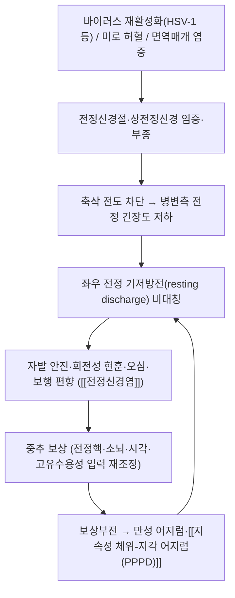

# 🩺 [[전정신경염]] (Vestibular Neuritis / 前庭神經炎, ICD-10 H81.2 / KCD H81.2)

> **핵심 3줄 요약 (Key Summary)**:
> - 📍 병소 부위 & 해부·병태생리: 내이(內耳) 전정기관에서 뇌간 전정핵으로 주행하는 [[전정신경]](제8뇌신경 전정분지) 중 특히 **상전정신경(superior vestibular nerve)** 과 그 신경절([[Scarpa 신경절]])의 급성 염증·부종. 바이러스 재활성화설(HSV-1 등)과 미로 혈관 허혈설([[미로동맥]])이 주된 병태생리로 제시된다.
> - 🚩 전형적 임상 양상 & 3대 징후: ① **24시간 이상 지속되는 급성 자발성 회전 현훈**, ② **단일 방향성 수평-회전 혼합 안진**(속도빠른상이 병변 반대측, 시고정으로 억제), ③ **병변측 양성 두부충동검사(HIT) 및 체간 편향** — 이 세 가지가 말초성 급성 전정증후군(AVS)의 골격이다. 청력 저하는 동반되지 않는다.
> - 🛠️ 핵심 감별 검사 & 한·양방 다각적 치료 전략: [[HINTS 검사]](Head Impulse–Nystagmus–Test of Skew) + [[두부충동검사]](vHIT) + [[온도안진검사]] + [[순음청력검사]]로 중추·와우 침범을 배제. 한방은 변증(痰濕·肝陽·氣血兩虛)에 따른 침·약침·한약 + **조기 전정재활** 병행이 회복을 앞당긴다.
> - ⚠️ 응급 의뢰 레드플래그 & 악화 요인: 두통·경부통·복시·구음장애·연하곤란·편측 마비·심한 체간 실조(혼자 앉지 못함), 방향전환성 안진, skew deviation, **HIT가 정상인 급성 전정증후군**은 중추성(뇌경색·소뇌출혈) 적신호. 급성기 강한 경추 회전 추나·고난도 균형 과제는 금기.

---

## 📌 목차
1. [질환 개요 & 해부학적 병태생리](#1-질환-개요--해부학적-병태생리)
2. [병태생리 메커니즘 & 생체역학적 악순환 네트워크](#2-병태생리-메커니즘--생체역학적-악순환-네트워크)
3. [임상 증상 & 이학적 검사(Physical Exam) 알고리즘](#3-임상-증상--이학적-검사physical-exam-알고리즘)
4. [감별 진단 매트릭스 (Differential Diagnosis)](#4-감별-진단-매트릭스-differential-diagnosis)
5. [한의 통합 치료 프로토콜 (침·약침·추나·한약)](#5-한의-통합-치료-프로토콜-침약침추나한약)
6. [양방 치료 & 병용·의뢰 기준 (Conventional Treatment & Referral)](#6-양방-치료--병용의뢰-기준-conventional-treatment--referral)
7. [재활 운동 & 생활습관 티칭 가이드](#6-재활-운동--생활습관-티칭-가이드)
8. [💡 사용자 진료실 핵심 필기 & 임상 노하우 (Melt-In 잔여 심화 집약)](#7--사용자-진료실-핵심-필기--임상-노하우-melt-in-잔여-심화-집약)
9. [출처 및 학술 참고 문헌 (References)](#8-출처-및-학술-참고-문헌-references)

---

## 1. 질환 개요 & 해부학적 병태생리
![[전정신경염_2.jpg|540]]

> [그림 1: ① 병태생리·영상 — 전정신경염_2]

* **질환 정의 및 분류**:
  * **정의**: 내이 전정기관에서 기원하는 제8뇌신경 전정분지의 급성 일측성 기능 저하로, **24시간 이상 지속되는 자발성 어지럼 + 단일 방향성 안진 + 병변측 전정안반사(VOR) 저하**를 특징으로 하며 청각 증상을 동반하지 않는 말초성 전정질환이다.
  * **용어 정리**: 최근에는 병리·해부가 명확하지 않다는 이유로 **급성 일측성 전정병증(acute unilateral vestibulopathy, AUVP)** 이라는 상위 용어로 통칭할 것이 권고되며, '전정신경염(vestibular neuritis)'은 염증성 원인이 추정되는 아형으로 분류된다 (Strupp & Bisdorff, 2022, PMID 35723133 — Barány Society 진단기준).
  * **분류 위치**: 어지럼의 3대 말초성 원인 중 하나로, 임상적으로는 **급성 전정증후군(Acute Vestibular Syndrome, AVS)** 의 대표 질환이며, 감별의 최우선 축은 '말초 vs 중추'이다. AVS는 ① 급성 자발 현훈, ② 안진, ③ 두위 불내성, ④ 균형 장애, ⑤ 멀미 유사 증상으로 구성된 증후군 개념이다.
  * **역학**: 연간 발생률은 인구 10만 명당 약 3.5명 수준으로 보고된 바 있으며(Jeong & Kim, 2013, PMID 24057821), 문헌·지역에 따라 편차가 있어 정확한 값은 추가 확인이 필요하다. 30~60대 성인에서 호발하고 소아에서는 드물며, 성별 차이는 문헌마다 보고가 엇갈려 **근거 미확인**으로 둔다.
  * **계절·직업**: 특정 직업군 호발이나 계절성은 확립된 근거가 확인되지 않음. 다만 고령·혈관 위험인자(고혈압, 당뇨, 흡연, 심방세동) 보유자는 '말초가 아니라 중추'일 확률이 유의하게 올라가므로 역학보다 **위험인자 층화**가 실제 진료에서 더 중요하다.

* **관련 해부학적 구조물**:
  * **골격 및 골성 구조**: [[측두골]] 암석부(petrous part) 내 [[골미로]], [[내이도]](internal acoustic meatus)가 전정신경의 통로이며, 내이도의 골성 협착·해부학적 변이는 신경 포착성 병리의 배경이 될 수 있다(다만 전정신경염에서 골성 협착의 인과성은 **근거 미확인**).
  * **막미로 및 감각기**: 세 개의 [[반고리관]](전·후·수평), [[난형낭]](utricle), [[구형낭]](saccule). 전정신경염에서는 **상전정신경 영역(전반고리관·수평반고리관·난형낭)이 선택적으로 이환**되는 경우가 흔해, 후반고리관(하전정신경 지배)은 상대적으로 보존된다.
  * **근육 및 근막**: 직접 이환되는 근육은 없다. 다만 ① 외안근([[전정안반사]]의 말단, 안진 발생), ② 경추 심부 굴곡근·후두하근(자세 안정과 [[전정척수반사]] 보상을 담당)이 기능적으로 관여하며, 급성기에는 이들의 긴장 이상과 이차성 경항통이 흔히 동반된다. 후두하근 단축과 경추 가동 제한은 회복기 보상 전략을 왜곡시킨다.
  * **신경 및 혈관**: [[전정신경]](제8뇌신경 전정분지) → [[전정신경절]](Scarpa's ganglion) → [[내이도]] → [[소뇌교각]](CPA cistern) → 뇌간 [[전정핵]]. 상전정신경은 수평·전반고리관 및 난형낭을, 하전정신경은 후반고리관 및 구형낭을 지배한다. 혈액 공급은 [[미로동맥]](labyrinthine artery, 주로 AICA 분지) → 전정동맥이며, 이는 말초 기원(cerebellar-type AICA infarction 시 미로 + 소뇌가 함께 침범되어 중추·말초 혼합 양상을 만들 수 있음)의 감별 함정이 된다.

---

## 2. 병태생리 메커니즘 & 생체역학적 악순환 네트워크

![[전정신경염_4.jpg|540]]
> [그림 2: ② 관련 해부 구조물 — (a) (MRI-T2 image) Fascicular and nuclear lesion of the <b>vestibular</b> nerve due to a multiple sclerosis plaque mimic]

### 1) 해부학적 포착 및 압박 기전
* **바이러스 재활성화설**: 잠복해 있던 [[단순포진바이러스 제1형]](HSV-1)이 [[전정신경절]]에서 재활성화되어 신경에 국소 염증을 일으킨다는 가설이 가장 널리 지지된다. 그 외 VZV, 인플루엔자, 볼거리, 홍역, CMV, EBV 등이 후보로 거론되어 왔으나 **어떤 바이러스가 주된 원인인지에 대한 확정적 결론은 근거 미확인**이다 (Le & Westerberg, 2019, PMID 30947184 — 원인론 고찰).
* **허혈설**: [[미로동맥]] 및 전정동맥의 분지 폐색 또는 저관류가 전정신경의 선택적 손상을 유발한다는 가설. 상전정신경이 골성 내이도 내에서 더 길고 굴곡이 많아 허혈에 취약하다는 해부학적 논거가 제시된다.
* **면역매개설**: 상기도 감염 후 지연성 면역반응이 신경에 무균성 염증을 일으킨다는 설명. 어느 가설이든 최종 경로는 **"일측 전정신경의 전도 저하 → 기저방전 감소 → 좌우 비대칭"** 으로 수렴한다.
* **선택적 침범의 임상적 의미**: 상전정신경이 우세하게 이환되면 후반고리관 기능이 보존되어, 급성기에는 수평반고리관성 안진이 두드러지고, **회복기에는 이탈한 이석(otoconia)으로 인한 수평반고리관 [[양성돌발성두위현훈(BPPV)]]이 이차적으로 잘 생긴다.** 이것이 '전정신경염 후 두위변환성 어지럼'이 흔한 이유다.

### 2) 생체역학적 연쇄 반응 (Kinetic Chain)
* **감각 재가중(sensory reweighting)**: 일측 전정 입력이 끊기면 뇌는 시각(optokinetic)과 고유수용성(경추·족저) 입력 비중을 급격히 올린다. 그 결과 ① 어두운 곳·눈 감은 상태에서 증상이 급격히 악화되고, ② 무늬 있는 바닥·에스컬레이터·슈퍼마켓 같은 복잡한 시각 환경에서 악화되며(시각 의존성 현훈), ③ 고개를 빠르게 돌릴 때 시야 흔들림([[osillopsia]])이 나타난다.
* **자세 조절 연쇄**: 체간이 병변측으로 밀리면서 경추 주위근과 체간 안정화근이 과긴장 → 이차성 경항통·후두하 통증 → 경추 가동성 저하 → 다시 전정 입력 감소의 악순환.
* **중추 보상과 보상부전**: 소뇌와 전정핵의 [[전정 보상]](vestibular compensation)은 통상 수일~수주 내 작동하지만, ① 침상 안정으로 감각 간 오차 신호가 줄고, ② 진정제성 전정억제제를 장기 복용하고, ③ 불안·과경계가 동반되면 보상이 지연되어 만성 어지럼([[PPPD]])으로 이행할 수 있다. **따라서 '안정'이 아니라 '조기 노출·재활'이 병태생리적으로 옳은 개입이다.**

---

## 3. 임상 증상 & 이학적 검사(Physical Exam) 알고리즘

### 1) 주소증 및 신경학적 증상
* **핵심 주소증(현훈)**: 갑작스럽게 시작된 **회전성 어지럼이 24시간 이상 지속**된다. '발작적으로 왔다가 사라지는' 형태가 아니라 지속형이며, 두위를 변화시키면 증상이 심해진다(두위 불내성). 오심·구토·식은땀 등 자율신경 증상이 동반된다.
* **감각 이상**: 피부분절성 저림·감각저하는 원칙적으로 관찰되지 않는다. 만약 동반된다면 중추성 병변 또는 경추 병변을 먼저 의심해야 한다.
* **운동 장애**: 진성 근력 약화는 없어야 한다. 다만 병변측으로 몸이 밀리는 **체간 편향(truncal deviation)** 과 보행 시 편향(deviation of gait)이 관찰되며, 급성기에는 혼자 서 있기 어렵다. **혼자 앉지 못할 정도의 심한 실조**는 중추성 적신호다.
* **혈관/자율신경 증상**: 오심·구토·창백·식은땀. 기립성 저혈압과의 감별을 위해 기립 시 혈압·맥박 변화를 반드시 확인한다.
* **청각 증상(감별점)**: 이명·이충만감·난청이 **없어야** 전정신경염이다. 청력 저하가 동반되면 [[미로염]](labyrinthitis)으로 분류가 바뀐다 (Strupp & Bisdorff, 2022).
* **두통·뇌신경 증상**: 복시, 구음장애, 연하곤란, 안면감각저하, 편측 위약감, 새로운 심한 두통/경부통이 있으면 중추성으로 즉시 전환 판단.

### 2) 필수 이학적 검사법 (Physical Examination)
* **[[HINTS 검사]]** — 급성 전정증후군에서 '말초 vs 중추'를 가르는 핵심 3종 세트. 세 소견이 모두 말초형이면 말초성 가능성이 높고, 하나라도 중추형이면 뇌영상이 우선이다.
  * **H – [[두부충동검사]](Head Impulse Test)**: 환자의 머리를 좌우로 빠르게(약 20° 내외 진폭) 돌려 VOR를 평가. 병변측에서 눈이 따라가지 못하고 **교정성 단속운동(catch-up saccade)** 이 나타나면 '양성 = 말초형'. **급성 전정증후군에서 HIT가 정상이면 중추형(뇌경색)을 강하게 시사**하며, 이는 초기 MRI-DWI의 위음성률보다 민감하다고 알려져 있어 임상적으로 매우 중요하다.
  * **N – 안진(Nystagmus)**: **단일 방향성(unidirectional), 수평-회전 혼합, 속도빠른상(fast phase)이 병변 반대측**을 향하고, 시고정에 의해 억제되며, 주시 방향에 따라 강도가 변하는 [[Alexander 법칙]]을 따른다면 말초형. **방향전환성(direction-changing)·순수 수직·순수 회전 안진**은 중추형.
  * **TS – [[Skew 편위 검사]](Test of Skew)**: 교대 안구가림(cover-uncover) 후 수직 정렬 이탈(skew deviation)이 있으면 중추형. 근거리/원거리 교대 주시(alternate cover test)로 확인한다.
  * **HINTS plus**: HINTS에 청력 평가를 더한 개념. 편측 청력 저하는 미로 침범(AICA 영역 뇌경색 포함)을 시사할 수 있다.
* **[[온도안진검사]](Caloric test)**: 냉·온수 자극으로 각각의 수평반고리관 반응을 정량화. 병변측 반응 저하, 통상 **20~25% 이상의 비대칭**을 이상으로 판정한다(검사실 기준에 따라 상이). 급성기에는 [[자발 안진]] 때문에 판독이 어려울 수 있고, 검사 자체가 증상을 유발할 수 있어 급성기에는 후순위로 두는 경우가 많다.
* **[[vHIT]](video Head Impulse Test)**: VOR 이득(gain)을 수치화. 병변측 이득 저하 + 잠복기성·분산성 교정성 단속운동(saccade)이 특징. 정확한 이득 cutoff는 장비·연령 정상치에 따라 달라 **근거 미확인**이며, 소속 검사실 기준치를 확인해 사용한다.
* **[[oVEMP]] / [[cVEMP]]**: oVEMP는 난형낭-상전정신경 경로를, cVEMP는 구형낭-하전정신경 경로를 반영한다. 전정신경염에서 **oVEMP 진폭 저하(병변측)가 비교적 흔하고 cVEMP는 보존**되는 패턴이 보고된다 — 상전정신경 선택성의 전기생리학적 단서.
* **[[Dix-Hallpike 검사]] / 두위회전검사(Supine Roll Test)**: 이차성 BPPV 감별. 짧은 잠복기 후 회전성 안진과 함께 수 초~1분 이내 소실되는 발작성이면 BPPV.
* **체간·보행 검사**: [[Romberg 검사]](병변측으로 전도, 눈 감을 때 악화), [[Fukuda stepping test]](병변측으로 회전), [[Unterberger 검사]]. **Romberg에서 눈을 감았을 때 낙상할 정도로 심하면 말초 단독으로 보기 어렵다.**
* **[[순음청력검사]](PTA)**: 반드시 시행. 편측 감각신경성 난청이 있으면 미로염·청신경종·AICA 경색 쪽으로 감별 축을 옮긴다.
* **[[안구운동검사]]**: 주시유지(gaze holding), 추적(smooth pursuit), 반대단속(saccadic) 검사에서 중추 패턴 확인. 중추성 안구운동 이상이 하나라도 있으면 뇌영상 우선.
* **[[이경검사]](Otoscopy)**: 고막 병변·중이염·이물 등 전도성 원인 배제. 전정신경염에서는 정상 소견이어야 한다.

---

## 4. 감별 진단 매트릭스 (Differential Diagnosis)

| 감별 질환 | 호발 병소 및 원인 | 주소증 차이점 | 특이적 이학적 검사 소견 |
| :--- | :--- | :--- | :--- |
| [[전정신경염]] (본 질환) | [[상전정신경]]/[[전정신경절]] 염증성·허혈성 손상 | **24시간 이상** 지속되는 급성 회전성 현훈, 오심·구토, 두위 불내성, **청력 정상** | HINTS 말초형(병변측 양성 HIT + 단일방향 안진 + skew 없음), 병변측 온도안진 반응 저하, oVEMP 저하·cVEMP 보존 |
| [[미로염]] (Labyrinthitis) | 미로 전체(전정 + 와우) | 현훈 + **난청·이명·이충만감 동반** | 말초형 HINTS + 동측 감각신경성 난청(PTA) |
| [[양성돌발성두위현훈]](BPPV) | 반고리관 내 이석(otoconia) | 두위 변환 시 **수 초~1분** 발작성, 지속형 아님, 자율신경 증상 경미 | Dix-Hallpike/Supine Roll 양성, 잠복기 있는 회전성 안진 |
| [[메니에르병]] | 내림프수종 | **반복 발작**(20분~12시간), 변동성 난청·이명·난청 | 저주파 감각신경성 난청, 발작 간 온도안진 저하 |
| 중추성 AVS ([[소뇌경색]], [[뇌간경색]], [[소뇌출혈]]) | 소뇌·뇌간(전정핵, PICA/AICA 영역) | 급성 현훈 + **두통·경부통·복시·구음장애·연하곤란·편측 위약·심한 실조** | **HINTS 중추형**(HIT 정상, 방향전환 안진, skew deviation), 혼자 앉지 못하는 체간 실조 |
| [[전정편두통]] | 삼차신경-전정계 연관 | 반복 발작성 현훈 + 두통·광공포·이명, 과거 유사 삽화 | 발작 간 검사 대개 정상, 두통 병력이 진단 단서 |
| [[전정신경초종]](청신경종) | 제8뇌신경(내이도~교뇌각) | **진행성** 단측 난청·이명, 완만하고 지속적 어지럼 | PTA 비대칭, MRI 조영증강 병변 |
| [[기립성 저혈압]]·[[실신전현훈]] | 전신 순환(자율신경) | 기립 시 어지럼·아찔함, 실신감, **회전성 아님** | 기립 시 혈압 강하, 안진 없음, HIT 정상 |
| [[약물성 현훈]](아미노글리코사이드 등) | 이독성 약물 | 양측성·진행성, 균형장애 위주 | 양측 온도안진 저하, 약물력 결정적 |
| [[지속성 체위-지각 어지럼(PPPD)]](PPPD) | 중추 보상부전·불안 과경계 | 3개월 이상 지속되는 비회전성 어지럼, 시각 자극 취약 | 급성기 검사 소견 소실, 기능성 검사 위주 |

---

## 5. 한의 통합 치료 프로토콜 (침·약침·추나·한약)

> ⚠️ **근거 수준 안내**: 아래 한의 치료 내용은 전통적 변증 체계와 임상 관행에 기반한 것이다. 본 노트에 인용된 4편의 논문(Le & Westerberg 2019 / Strupp & Bisdorff 2022 / Huang & Chen 2024 / Jeong & Kim 2013)에서는 **전정신경염에 대한 침·약침·추나·한약의 유효성을 검증한 임상시험이 확인되지 않는다(근거 미확인)**. 따라서 한방 치료는 ① 중추성·응급 원인 배제 후, ② 양방 표준치료(필요 시 스테로이드·전정억제제)와 병행하는 보조 축으로 운용하고, 환자에게도 그 위치를 정확히 설명한다.

* **변증(辨證) 접근 — 眩暈 辨證**:
  * **痰濕中阻**: 두중감(머리가 무겁고 눌린 느낌), 오심·구토, 흉민, 설태 백니(白膩), 맥 활(滑) → [[半夏白朮天麻湯]], [[澤瀉湯]] 계열.
  * **肝陽上亢**: 두통·이명·안면홍조·성급함·변비, 설홍(舌紅) 태황, 맥 현(弦) → [[天麻鉤藤飲]], [[龍膽瀉肝湯]] 계열.
  * **氣血兩虛**: 만성·재발성, 심계·피로·안색 창백, 설담(舌淡) 맥 세약(細弱) → [[歸脾湯]], [[補中益氣湯]], [[八物湯]] 계열.
  * **腎精虧虛**: 만성 경과, 이명·요슬산연·건망 → [[六味地黃丸]], [[左歸丸]] 계열.
  * **瘀血阻竅**: 두부 외상력 또는 장기 미회복, 통증 고정, 설암자(舌暗紫) → [[通竅活血湯]], [[血府逐瘀湯]] 계열.
  * ※ 고전적 변증 체계는 [[東醫寶鑑]] 眩暈門, [[丹溪心法]]의 "無痰不作眩", [[景岳全書]]의 "無虛不作眩" 논의를 참조하되, 현대 질환 분류와의 대응은 임상적 해석임을 명시한다.

* **침구 치료 (Acupuncture)**:
  * **주 치료혈**: [[百會]](GV20), [[風池]](GB20), [[翳風]](TE17), [[完骨]](GB12), [[天柱]](BL10), [[內關]](PC6), [[太衝]](LR3), [[合谷]](LI4).
  * **변증 배혈**: 담습 → [[中脘]](CV12), [[豐隆]](ST40), [[陰陵泉]](SP9), [[足三里]](ST36). 기혈허 → [[足三里]](ST36), [[三陰交]](SP6), [[氣海]](CV6). 간양상항 → [[太衝]](LR3), [[行間]](LR2), [[俠谿]](GB43). 신허 → [[太谿]](KI3), [[腎俞]](BL23).
  * **국소(이주위) 배혈**: [[聽宮]](SI19), [[耳門]](TE21), [[率谷]](GB8), [[頭維]](ST8), [[太陽]](EX-HN5), [[印堂]](EX-HN3).
  * **전침(Electroacupuncture)**: 風池–完骨, 百會–印堂, 內關–足三里 조합이 임상적으로 자주 쓰인다. 주파수는 **저주파(2 Hz 중심)** 로 자율신경 안정·근이완 목적 운용이 일반적이나, 전정신경염에서의 최적 주파수·자극량은 **근거 미확인**이므로 환자 반응(어지럼 유발 여부)을 보며 조절한다.
  * **자침 시 주의**: ① [[風池]]·[[完骨]]·[[天柱]]는 심자 시 추골동맥·척수·후두하 신경혈관 손상 위험이 있어 **각도·깊이를 보수적으로** 한다. ② [[翳風]]은 안면신경 손상 및 심자 위험이 있어 자침 깊이를 제한한다. ③ 급성기 심한 오심·구토 상태에서는 자침 전 자세(앙와위, 두부 고정)를 안정시키고 시술한다.

* **약침 치료 (Pharmacopuncture)**:
  * **이주위·후두하 소염 목적**: 風池·翳風·完骨·天柱 주변에 소염·진통 계열 약침(예: 청열·활혈 계열 처방 약침)을 소량(0.05~0.1 mL/점) 주입하는 방식이 임상에서 시도된다. **전정신경염에 대한 약침 RCT 근거는 확인되지 않음(근거 미확인)**.
  * **변증 목적**: 中脘·足三里·三陰交 등에 健脾除濕·補氣 계열 약침.
  * **금기·주의**: ① [[봉독 약침]] 등은 아나필락시스 위험이 있어 반드시 피부반응검사 및 응급 대비가 선행되어야 한다. ② 항응고제 복용자, 임산부, 국소 감염·피부 병변 부위는 금기. ③ 어지럼이 심한 환자는 시술 중 체위성 실신 위험이 있으므로 앙와위 유지.

* **추나 치료 (Chuna Manipulation)**:
  * **적용 대상**: 급성기를 지나 회복기로 들어간 환자에서 ① 경추 상부 가동 제한, ② 후두하근·상부 승모근 과긴장, ③ 흉추 후만 증가로 인한 두부 전방 자세가 확인될 때.
  * **기법**: 枕下筋 이완(근막이완 계열), 경추 관절가동술(mobilization, 저속도·저진폭), 흉추 신연·가동. **고속·고진폭 회전 도수(high-velocity low-amplitude cervical rotation manipulation)는 급성기 및 혈관 위험인자 보유자에서 금기** — 척추기저동맥 허혈 위험.
  * **금기 수기 및 사전 스크리닝**: 시술 전 반드시 ① 새로운 두통·경부통, ② 복시·구음장애·연하곤란, ③ 편측 감각·운동 이상, ④ 혈관 위험인자(고혈압·당뇨·흡연·심방세동, 고령)를 확인하고, 하나라도 있으면 추나를 보류하고 중추 평가를 우선한다.
  * **금기 자세·수기**: 급성기 두위 회전 유발 검사성 수기, 급격한 체위 변환, 장시간 복와위(증상 악화).

* **한약 치료 (Herbal Medicine)**:
  * **급성기(痰·火·風)**: 半夏白朮天麻湯, 天麻鉤藤飲, 澤瀉湯 등으로 담습·간양을 조정. 전정억제제와 병용 시 진정 중복 가능성을 고려해 용량을 조절한다.
  * **회복기(氣血·腎)**: 歸脾湯, 補中益氣湯, 六味地黃丸 등으로 보익. 전정 보상이 지연되는 만성 어지럼에서 기혈 보충 축을 사용.
  * **瘀血·만성**: 通竅活血湯, 血府逐瘀湯.
  * ※ 각 처방의 전정신경염 특이적 임상시험 근거는 본 노트 인용 문헌에서 확인되지 않음. **한약-양약 상호작용(스테로이드·와파린·항혈소판제 등) 및 간기능 모니터링**을 고려한다.

---

## 6. 양방 치료 & 병용·의뢰 기준 (Conventional Treatment & Referral)

> 🎯 **이 섹션의 목적**: 환자가 **양방약을 이미 복용 중인 경우가 많다.** 한의원 1차 진료에서 양방 치료를 이해하고, 병용 가능·주의·금기를 판단하며, 언제 의뢰할지 결정한다.

* **약물 치료 (Medication)**:
  * 계열별 약물·용량·기간 — 국내 처방 관행 반영.
  * 작용 기전과 한의 치료와의 상호작용.
* **비약물 시술 (Procedures)**:
  * 주사·차단술·물리치료·보조기 등.
* **수술·시술 적응증 (Surgical Indication)**:
  * 언제 수술로 가는가 — 절대·상대 적응증, 수술 후 경과.
* **한의 병용 판단 (Combination Therapy)**:
  * 병용 가능 / 주의 / 금기. 복용 중 환자의 감량 타이밍·반동 현상.
* **양방·전문과 의뢰 기준 (Referral Criteria)**:
  * 응급 의뢰 트리거와 전문과 의뢰 기준(정형외과·신경외과·내과 등).

	(작성 필요)

---

## 7. 재활 운동 & 생활습관 티칭 가이드

* **치료 원칙 — "억제가 아니라 적응"**: 급성기 48~72시간을 지나면 **전정억제제 장기 복용은 중추 보상을 지연시킨다.** 진정 목적 약물은 단기간으로 제한하고, 어지럼을 유발하는 움직임에 점진적으로 노출시키는 것이 회복을 앞당긴다. Huang & Chen(2024, PMID 37339059)의 체계적 고찰 및 메타분석은 전정신경염 환자에서 **전정재활이 어지럼 자각도(DHI 등)와 균형 기능 개선에 이점을 보인다**고 정리한다(구체적 효과크기·치료 기간·프로토콜 세부는 원문 확인 필요).

* **이완 및 스트레칭 (Stretching)**:
  * **후두하근·상부 승모근·흉쇄유돌근**의 부드러운 정적 스트레칭 (20~30초 × 3회). 어지럼을 유발하지 않는 범위에서만 시행하며, 급격한 회전·신전은 피한다.
  * **흉추 신전 스트레칭**(폼롤러 등)으로 두부 전방 자세를 교정 — 경추 과긴장을 줄여 잔여 어지럼을 감소시키는 보조 전략.
  * 금기: 어지럼이 유발되는 상태에서의 강한 경추 회전 스트레칭, 도수 견인식 자가 스트레칭.

* **강화 및 안정화 운동 (Strengthening & Stabilization)**:
  * **경추 심부 굴곡근 강화**(턱 당기기, 크랜iocervical flexion): 앉은 자세에서 통증·어지럼 없는 범위로 10회 × 3세트.
  * **체간·하지 안정화**: 앉아서 하는 체중 이동 → 기립 시 발판 딛기 → 정적 기립 균형(양발 → 한발) 순으로 단계화.
  * **단계 원칙**: ① 앉은 자세 → ② 선 자세(양발, 눈 뜨고) → ③ 선 자세(눈 감고, 안전 확보) → ④ 한발 서기 → ⑤ 고무매트·쿠션 등 불안정 지지면.

* **신경 활주 운동 (Neurodynamics)**:
  * 급성기에는 적용하지 않는다. 회복기 잔여 경추 긴장·이차성 신경계 증상이 있을 때 경추 신경근의 부드러운 슬라이딩을 보조적으로 고려한다. **전정신경 자체는 신경활주 기법의 표적이 아니며, 이 영역에 대한 전정신경염 특이 근거는 확인되지 않음(근거 미확인).**

* **전정재활 핵심 4요소 (Vestibular Rehabilitation)** — Huang & Chen(2024) 고찰의 치료 축과 임상적으로 통용되는 구성을 정리:
  1. **습관화(Habituation)**: 어지럼을 유발하는 동작(고개 돌리기, 구부리기, 앉았다 일어나기)을 **약한 강도로 반복 노출**해 반응을 감소시킨다. 1일 2~3회, 각 동작 5~10회, 증상 강도가 5/10을 넘지 않게 조절.
  2. **시고정 안정화(Gaze Stabilization / VOR ×1, ×2)**: 정면의 표적(글자 카드, 손가락)을 고정한 채 머리를 좌우·상하로 **작고 빠르게** 흔든다. VOR 적응을 유도.
  3. **대체(Substitution)**: 시각·고유수용성 단서를 적극 사용 — 눈을 뜨고 균형 잡기, 무늬 있는 바닥·쿠션 등 감각 단서를 바꿔가며 훈련.
  4. **[[Cawthorne-Cooksey 운동]]**: 침상에서의 안구·두부 운동 → 앉아서의 어깨·몸통 운동 → 기립·보행·계단 운동으로 단계화된 고전적 홈 프로그램.
  * **이차성 BPPV 동반 시**: [[Brandt-Daroff 운동]] 또는 이석정복술([[Epley 수기]], [[Semont 수기]])을 먼저 적용해 이석을 정복한 후 전정재활을 이어간다.

* **일상생활 자세 티칭 (Ergonomics)**:
  * **시각 환경**: 화면 밝기와 주변 조도 균형 맞추기, 강한 무늬 벽지·무빙 워크·에스컬레이터 초기 회피 → 적응 단계에서 점진 노출.
  * **동작 원칙**: 고개는 크게 한 번에 돌리지 않고 **눈과 머리를 함께** 움직여 회전(체성 감각 활용). 야간 기상 시 즉시 일어나지 말고 30초 앉았다가 일어난다.
  * **낙상 예방**: 야간 조명, 욕실 미끄럼 방지 매트, 필요 시 보행 보조기 사용. 급성기(특히 첫 1~2주)에는 운전·고소 작업·수영을 피한다.
  * **수면 자세**: 과도한 경추 굴곡·회전을 피하고, 머리 높이를 낮춘 편평한 자세 권장(현훈 악화 여부에 따라 조정).
  * **작업 환경**: 모니터 상단을 눈높이에 맞춰 경추 전방 자세 감소, 30~40분마다 1~2분 기립·목 스트레칭.

---

## 8. 💡 사용자 진료실 핵심 필기 & 임상 노하우 (Melt-In 잔여 심화 집약)

> [!IMPORTANT]
> **🛡️ 원문 융합(Melt-In) 및 7번 섹션 작성 불변 규칙 (CRITICAL)**
> 1. **기존 필기 내용 상부 전면 융합 (Melt-In)**: 질환의 정의, 해부학적 원인, 증상, 이학적 검사법, 치료법, 생활 티칭 등 기본 내용은 상부 1~6번 섹션에 유기적으로 100% 녹여내어(Melt-In) 고도화한다.
> 2. **7번 섹션의 차별화된 심화 집약 (녹이고 남은 고유 필기만 수록)**: 7번 섹션은 상부에 이미 녹여낸 기본 원문을 단순 중복 나열(복사-붙여넣기)하는 공간이 아니다. **상부 1~6번에 다 담기지 않은, 원장님만의 독창적인 진료실 노하우, 실전 문진 체크리스트, 환자 설명 스크립트, 임상 감별 직관 팁 등만이 엄선되어 집약**되어야 한다.

* **상부 섹션에 미처 다 담지 못한 고유 원문 필기**:
  * **"현훈은 시간(time course)이 진단의 8할이다"** — 병명을 맞히려 하지 말고 **'지속형(>24h) / 발작형(분~시간) / 체위유발형(수초~1분)'** 세 갈래로 먼저 분류한다. 전정신경염은 첫 번째 칸이다.
  * **"청력이 정상이면 전정신경염, 청력이 빠지면 미로염, 두통·복시·실조가 붙으면 중추"** — 이 3분법을 문진 첫 1분에 돌린다.
  * **"회복기 환자가 뒤늦게 다시 어지러워지면 이차성 BPPV를 먼저 의심한다"** — 상전정신경 이환으로 후반고리관이 상대적으로 보존되었던 환자가, 시기에 따라 수평반고리관성 이석증을 얻는 패턴.
  * **"말초는 억제하지 말고 노출시켜라, 중추는 노출하지 말고 영상으로 가라"** — 치료 방향과 응급 판단 방향을 좌우하는 한 줄 원칙.

* **진료실 실전 감별 & 치료 노하우**:
  * 1. **실전 문진 체크리스트 (5문 5답)**: 내원 즉시 이 순서로 확인한다.
    1. **발병 양상**: "갑자기 왔는가, 몇 초 만에 최고조에 도달했는가?" (돌연 최고조 → 혈관성/염증성 가능성 ↑)
    2. **지속 시간**: "지금도 계속 어지러운가, 아니면 움직일 때만 어지러운가?" (**24시간 이상 지속 = AVS 계열**, 수초~1분 = BPPV, 20분~수시간 반복 = 메니에르)
    3. **동반 증상 4종**: 난청/이명·이충만감? 새로운 두통 또는 경부통? 복시·구음장애·연하곤란·손발 위약? 자리에서 못 앉을 정도의 심한 실조?
    4. **과거 삽화**: "예전에도 똑같은 어지럼이 반복되었는가?" (반복성 삽화 → 메니에르·전정편두통 쪽으로 무게중심 이동)
    5. **위험인자·약물**: 고혈압·당뇨·흡연·심방세동·고령, 아미노글리코사이드/항경련제/이뇨제 복용력.
  * 2. **치료 순서 및 손맛 노하우**:
    * **제1단계(중추 배제)**: HINTS + 청력 + 신경학적 검사. 하나라도 중추 패턴이면 즉시 영상 의뢰. 이 단계를 건너뛰고 한방 치료부터 시작하지 않는다.
    * **제2단계(급성기 안정)**: 환자를 앙와위로 눕혀 두부를 고정하고, 심한 오심·구토가 있으면 자침을 서두르지 않는다. 風池·完骨·天柱는 **깊이보다 각도**가 중요 — 후두골 하연을 따라 사자(斜刺)로 짧게. 內關(GV) 자극으로 구역감을 먼저 잡으면 환자 협조도가 올라간다.
    * **제3단계(보상 촉진)**: 증상이 진정된 뒤에는 침 치료와 함께 **시고정 안정화 운동을 그 자리에서 1분간 시연**하고 숙제로 준다. "치료실에서 어지러워지는 것을 무서워하지 마세요. 그게 회복 신호입니다"라는 설명이 치료 순응도를 좌우한다.
    * **제4단계(재발·만성 관리)**: 3~6주가 지나도 남는 어지럼은 보상부전/PPPD 축으로 보고, 변증을 氣血兩虛·腎精虧虛로 전환해 보익 위주로 처방을 바꾼다.
    * **추나 적용 팁**: 급성기에는 **금지**. 회복기에는 환자를 앉힌 자세에서 枕下筋 이완 → 경추 저속 가동 → 흉추 가동 순으로 5~10분. 시술 중 어지럼이 올라오면 즉시 중단하고 앙와위로 전환한다.
  * 3. **환자 티칭 스크립트 (그대로 읽어도 되는 문장)**:
    * **설명**: "이 어지럼은 귀 안쪽의 평형 신경에 염증이 생겨서, 뇌가 좌우 균형 신호를 서로 다르게 받아들이기 때문에 생깁니다. 뇌가 다시 균형을 배우는 데 보통 몇 주가 걸립니다."
    * **행동 지침**: "어지럽다고 계속 누워만 있으면 뇌가 배울 기회를 잃습니다. 어지럼이 5점 정도(10점 만점) 올라오는 선에서, 조금씩 고개를 돌리고 걷는 연습을 해주세요."
    * **안전 지침**: "야간에는 반드시 조명을 켜고 일어나시고, 계단·욕실에서는 손잡이를 잡으세요. 첫 1~2주는 운전과 높은 곳 작업은 쉬시는 게 안전합니다."
    * **재내원 기준(레드플래그 스크립트)**: "갑자기 심한 두통이나 목 통증, 사물이 두 개로 보임, 말이 어눌해짐, 한쪽 팔·다리가 힘이 빠지는 증상이 나타나면 즉시 응급실로 가셔야 합니다."
    * **예후 설명**: "대부분 수 주 안에 좋아지지만 일부는 어지럼이 오래 남거나 다시 올 수 있어, 재활 운동을 꾸준히 하는 것이 가장 중요합니다." (정확한 만성화·재발 비율은 본 노트 인용 문헌에서 확인되지 않아 **근거 미확인**으로 두고, 수치를 단정해 말하지 않는다.)

---

## 9. 출처 및 학술 참고 문헌 (References)

1. **Le TN, Westerberg BD (2019)**. *Vestibular Neuritis: Recent Advances in Etiology, Diagnostic Evaluation, and Treatment*. **Adv Otorhinolaryngol**. PMID: 30947184
   - **[연구 요약]**: 전정신경염의 최신 지견을 정리한 고찰. 원인론(바이러스 재활성화설·허혈설·면역설), 진단적 평가(HIT·온도안진·vEMP 등), 치료(전정억제제·스테로이드·항바이러스제·전정재활)의 흐름을 다룬다. **스테로이드의 조기 투여가 전정기능 회복에 이점이 있다는 보고**와 함께, **항바이러스제 병용의 추가 이득은 입증되지 않았다**는 취지의 정리가 이루어진 것으로 파악되나, 구체적 용량·투여 기간·효과 크기는 원문 확인이 필요하다.

2. **Strupp M, Bisdorff A (2022)**. *Acute unilateral vestibulopathy/vestibular neuritis: Diagnostic criteria*. **J Vestib Res**. PMID: 35723133
   - **[연구 요약]**: Barány Society의 진단기준 합의문. **24시간 이상 지속되는 급성 자발 현훈**, **시고정으로 억제되는 단일 방향성 수평-회전 안진**, **병변측 VOR 저하(HIT 양성/온도안진 저하/oVEMP 비대칭)**, **중추 신경학적 징후 부재(특히 skew deviation·gaze-evoked nystagmus 없음)**, **급성 청력 저하 부재**를 축으로 definite/probable/possible 등급을 제시한다. 용어는 'acute unilateral vestibulopathy'를 상위 개념으로 사용할 것을 권고.

3. **Huang HH, Chen CC (2024)**. *Efficacy of Vestibular Rehabilitation in Vestibular Neuritis: A Systematic Review and Meta-analysis*. **Am J Phys Med Rehabil**. PMID: 37339059
   - **[연구 요약]**: 전정신경염 환자에서 전정재활의 효과를 정량화한 체계적 고찰·메타분석. 어지럼 자각도 및 균형 관련 지표에서 전정재활의 이점을 보고한다. **개별 연구의 치료 프로토콜(운동 종류·빈도·기간), 비교군 설정, 효과크기 및 이질성**은 원문 확인 필요.

4. **Jeong SH, Kim HJ (2013)**. *Vestibular neuritis*. **Semin Neurol**. PMID: 24057821
   - **[연구 요약]**: 전정신경염의 임상 개론. 역학(연간 발생률 약 10만 명당 3.5명 수준으로 보고), 병태생리, 임상 양상, 진단적 접근 및 치료 원칙을 종합적으로 정리한다. 소아에서는 드물고 성인 연령대에서 호발한다는 내용을 포함한다.

5. **교과서 참고(직접 인용하지 않음)**: 대한이비인후과학회·대한신경과학회 관련 교과서 및 [[東醫寶鑑]] 眩暈門 등 한의학 고전은 본 노트에서 **위키링크 수준의 개념 참조**로만 사용하였으며, 직접 인용 및 근거 등급 부여는 하지 않았다(근거 미확인).

<!-- 보관 태그(1회용·링크오류, 필요시 복원): 말초성현훈, AVS -->
