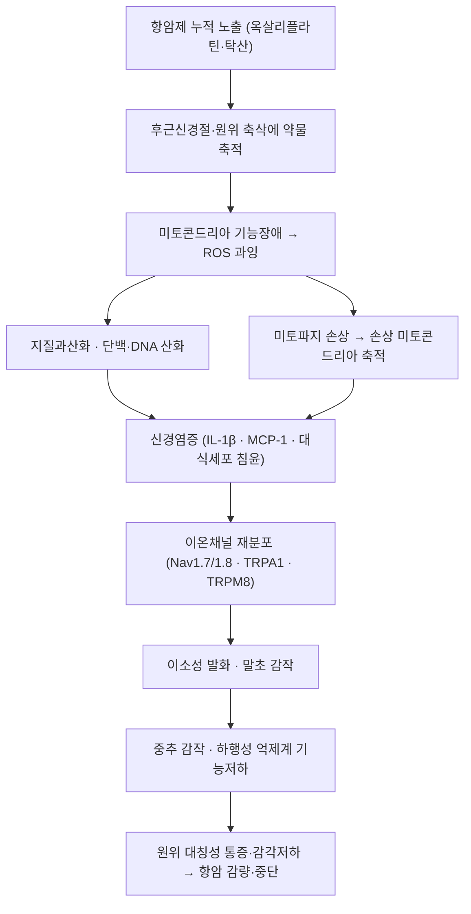

# 🩺 [[항암치료 유발 말초신경병증]] (Chemotherapy-induced peripheral neuropathy / 抗癌治療 誘發 末梢神經病症, G62.0 / G63.2*)

> 🖼️ 이미지 미확보 — 이번 회차는 감각소실 분포 도해와 후근신경절 해부 도해 2장만 확보했다. 병태생리 도해·환자 임상 사진·검사 영상은 확보하지 못해 다음 회차 보완 대상으로 남긴다(파일명 Blind Linking 금지 원칙에 따라 미검증 이미지는 넣지 않았다).

> **핵심 3줄 요약 (Key Summary)**:
> - 📍 병소 부위 & 해부·병태생리: 백금계·탁산계 항암제가 [[후근신경절]]과 원위 축삭에 축적되어 미토콘드리아 기능장애·[[산화 스트레스]]·[[미토파지]] 손상·신경염증을 일으키고, 가장 긴 축삭부터 손상되는 길이의존성 원위 대칭성 다발신경병증으로 발현한다.
> - 🚩 전형적 임상 양상 & 3대 징후: 양측 손끝·발끝에서 시작하는 저림·감각이상, 한랭 유발 통증(옥살리플라틴 특이), 감각 저하로 인한 균형 저하·낙상 위험 — 통증·감각이상이 항암 용량 감량·중단의 주요 원인이 된다.
> - 🛠️ 핵심 감별 & 한·양방 치료 전략: 예방 목적의 확립된 약제는 없다(ASCO 2020 '권고 없음'). 확립된 통증성 CIPN에는 [[둘록세틴]]이 가장 근거가 강하고, [[황기계지오물탕]] 예방 RCT·[[지압]]·[[반사요법]]·[[마사지]] 같은 비약물 중재가 보완 축이다.
> - ⚠️ 응급 의뢰 레드플래그: 항암제 용량·주기 조절은 반드시 종양내과가 결정한다 — 한의 단독 판단으로 감량·중단을 권하면 안 된다. 무통성 족부 병변·봉와직염·[[마미증후군]] 신호(회음부 감각저하·배뇨장애)는 즉시 의뢰 대상이다.

---

## 📌 목차
1. [질환 개요 & 병태생리 (Disease Overview)](#1-질환-개요--병태생리-disease-overview)
2. [병태생리 메커니즘 & 신경손상 네트워크](#2-병태생리-메커니즘--신경손상-네트워크)
3. [임상 증상 & 환자 소견 (Clinical Presentation)](#3-임상-증상--환자-소견-clinical-presentation)
4. [감별 진단 매트릭스 (Differential Diagnosis)](#4-감별-진단-매트릭스-differential-diagnosis)
5. [한의 통합 치료 프로토콜 (침·약침·한약)](#5-한의-통합-치료-프로토콜-침약침한약)
6. [양방 치료 & 병용·의뢰 기준 (Conventional Treatment & Referral)](#6-양방-치료--병용의뢰-기준-conventional-treatment--referral)
7. [재활·자기관리 & 낙상 예방 티칭 가이드](#7-재활자기관리--낙상-예방-티칭-가이드)
8. [💡 진료실 핵심 필기 & 임상 노하우](#8--진료실-핵심-필기--임상-노하우)
9. [출처 및 학술 참고 문헌 (References)](#9-출처-및-학술-참고-문헌-references)

---

## 1. 질환 개요 & 병태생리 (Disease Overview)

![[항암치료유발말초신경병증_01_감각소실분포_Servier.png|430]]
> [그림 1: 말초신경병증의 원위 대칭성 감각소실 분포 — 음영 부위(손·전완, 발·하지 원위)가 감각 저하 영역으로, CIPN의 '장갑-양말형(glove-and-stocking)' 분포와 같은 자리다 — Laboratoires Servier, CC BY-SA 3.0, Wikimedia Commons]

* **질환 정의 및 분류**:
  * 항암치료 중 또는 종료 후 발생하는 말초신경 손상으로, 감각섬유가 운동·자율신경섬유보다 먼저·심하게 침범되는 것이 특징이다. 원인 약제는 백금계(옥살리플라틴·시스플라틴), 탁산계(파클리탁셀·도세탁셀), 빈카알칼로이드(빈크리스틴), 보르테조밉, 탈리도마이드 계열 등이다.
  * 임상적으로는 급성과 만성으로 나뉘며, 옥살리플라틴은 두 형태가 모두 나타나 대표적 모델이 된다.
  * 급성(옥살리플라틴 특이): 주입 직후~수일 내 발생하고 대개 수일 내 소실되는 한랭 유발 감각이상·인후후두 감각이상(pharyngolaryngeal dysesthesia, '목이 조이는 느낌').
  * 만성(누적 독성): 치료 주기가 누적되며 3개월 이상 지속되는 원위 대칭성 감각이상·통증. 한랭 유발 증상은 만성화의 예측 인자로 다뤄진다.
  * CTCAE(Common Terminology Criteria for Adverse Events)와 Levi 척도가 임상시험의 표준 등급 도구이며, 만성 grade 이상 2등급 발생률이 예방 임상시험의 대표 1차 종료점이다.
* **관련 장기 및 조직**:
  * 주 이환 조직: [[후근신경절]]과 말초 감각 축삭 — 특히 원위 종말부.
  * 연관 조절계: [[TRPA1]] · [[TRPM8]](한랭 감각) · [[전압의존성 칼슘채널]] α2δ · [[전압의존성 나트륨채널]] 계열.
  * 신경염증 매개: [[IL-1β]] · [[MCP-1]] · [[TNF-a]] · [[ROS]] · [[지질과산화]] 지표(MDA·8-iso-PGF2α).
* **역학**: 옥살리플라틴 기반 항암요법 환자의 최대 80%에서 신경병증이 발생하며, 대장암 보조요법(XELOX: 옥살리플라틴+카페시타빈)에서 치료 성적을 좌우하는 용량제한 독성이다.

---

## 2. 병태생리 메커니즘 & 신경손상 네트워크

![[후근신경절_01_척수신경형성_Gray675.png|400]]
> [그림 2: 척수신경의 형성 — 후근(posterior root)이 척수신경절(spinal ganglion, 후근신경절)을 거쳐 전근과 합류해 척수신경을 이룬다. 후근신경절은 감각 뉴런의 세포체가 모여 있는 곳으로, 옥살리플라틴이 축적되어 이소성 발화를 만드는 CIPN의 1차 표적이다 — Gray's Anatomy, Public domain]

### 1) 분자·세포 수준 기전
* 미토콘드리아 손상과 산화 스트레스가 중심축이다. 백금 화합물은 후근신경절에 장기간 축적되어 미토콘드리아 호흡 사슬을 억제하고 ROS를 증가시킨다. 이때 정상적으로 작동해야 할 [[미토파지]](손상 미토콘드리아 선택적 제거)가 억제되면 손상 미토콘드리아가 축적되어 악순환이 만들어진다.
* 신경염증: 손상 신경에서 [[IL-1β]]와 [[MCP-1]](CCL2)이 상승하고 대식세포가 후근신경절로 모여 감각 뉴런의 과흥분을 유지한다. 항암 환자 혈청에서도 항암 중 상승한 IL-1β·MCP-1이 한약 중재군에서 유의하게 억제된 보고가 있다(§9 1번).
* 이온채널 변화: 손상 감각 뉴런에서 Nav1.7·Nav1.8의 발현·분포가 바뀌어 역치 이하 자극에도 발화한다. 옥살리플라틴의 한랭 유발 증상은 [[TRPA1]]·[[TRPM8]] 계열 한랭 감각 채널이 관여하는 것으로 설명된다.

### 2) 장기·계통 수준 결과
* 원위 축삭에서 시작해 근위부로 진행하는 'dying-back' 패턴을 보이고, 감각 > 운동 > 자율신경 순으로 침범한다.
* 대섬유(Aβ) 손상 시 진동각·위치감각 저하 → 균형 저하·낙상 위험이, 소섬유(Aδ·C) 손상 시 작열통·이질통이 나타난다.
* 지속적 통각 입력은 척수 후각의 [[중추 감작]]과 [[하행성 통증억제계]] 기능저하를 유발해, 항암 종료 후에도 통증이 남는 'persistent CIPN' 상태로 이어질 수 있다.

### 3) 위험인자와 진행 단계
* 위험인자: 누적 용량(옥살리플라틴 누적 >850 mg/m²에서 위험 급증), 치료 기간, 기저 [[당뇨병성 말초신경병증]], 알코올 섭취, 고령, 낮은 신체활동, 기존 신경병증.
* 단계: 급성 한랭 감각이상기 → 누적 감각저하기(grade 1~2) → 통증성·기능장애기(grade 2~3, 감량 결정) → 잔존 신경병증기(항암 종료 후 수개월~수년 지속).

---

## 3. 임상 증상 & 환자 소견 (Clinical Presentation)

### 1) 주소증 및 핵심 증상
* 전형 증상: ① 양측 손끝·발끝 저림 ② 화끈거림·찌릿함(작열통·전격통) ③ 이불·옷깃만 스쳐도 아픈 이질통 ④ 차가운 것에 닿을 때 심해지는 통증(옥살리플라틴) ⑤ 단추 잠그기·글씨 쓰기·계단 내려가기 같은 미세운동·균형 저하.
* 비전형·경증 발현: '양말이 두 겹 신은 느낌', '발바닥에 솜을 깐 듯한 느낌'처럼 통증 없이 감각 둔마만 있는 경우. 무통성 감각저하는 궤양·화상 위험이 더 크다.
* 악화·완화 인자: 악화 — 한랭(차가운 음료·냉장고·겨울 외출), 야간, 피로. 완화 — 온기, 가벼운 움직임, 진통제.

### 2) 객관적 소견 (Signs & Labs)
* 신체 소견: 원위 감각 저하(핀프릭·온도·진동각), 심부건반사 저하(아킬레스건 반사 소실), [[롬베르그]] 양성(대섬유 손상 시), 압통역치 저하.
* 검사: [[신경전도검사]]는 대섬유 손상을 반영하나 초기·소섬유 손상은 정상으로 나올 수 있다. 정량감각검사(QST)와 피부생검(표피내 신경섬유밀도)은 소섬유 평가에 쓰인다. 혈액검사로 [[비타민 B12]]·[[HbA1c]]·갑상선기능·단백전기영동을 확인해 다른 신경병증을 배제한다.
* 환자보고 도구: NRS·VAS가 통증 축, EORTC QLQ-CIPN20·FACT/GOG-Ntx가 CIPN 특이 삶의 질 축이다.

### 3) 병기·중증도 판정
* grade 1(증상 있으나 기능 영향 없음) → 2(증상이 일상도구 사용·보행에 영향, 감량 검토) → 3(통증·감각저하로 자가돌봄 불가, 감량·중단) → 4(기능 위협·생명 위협).
* 실제 감량·중단 결정은 종양내과가 항암 치료 성적과 환자 선호를 함께 고려해 내린다.

---

## 4. 감별 진단 매트릭스 (Differential Diagnosis)

| 감별 질환 | 특징적 양상 | 감별 포인트 (검사·수치) |
| :--- | :--- | :--- |
| [[항암치료 유발 말초신경병증]] (본 질환) | 항암 노출 후 원위 대칭성 감각이상, 한랭 유발 | 항암 용량·주기 병력, CTCAE/Levi 등급 |
| [[당뇨병성 말초신경병증]] | 서서히 진행, 무증상 감각저하 장기간 | [[HbA1c]], 기저 [[당뇨병]] 병력, 항암 전부터 존재했는지 시점 판정 |
| [[비타민 B12 결핍성 신경병증]] | 진동·위치감각 소실 우세, 인지 변화 동반 | [[비타민 B12]] 수치, 거대적혈구성 빈혈, 메트포르민 장기 복용력 |
| [[만성 염증성 탈수초성 다발신경병증]] (CIDP) | 근위·원위 혼재, 진행성 운동약화 | 심부건반사 소실 범위, 뇌척수액 단백세포 해리 |
| [[요추 신경근병증]] | 편측성, 특정 피부분절 분포, 요통 동반 | [[SLR test]] · 영상검사, 분포가 비대칭 |
| 종양의 신경침범 재발 | 비대칭·편측 진행, 급격한 악화 | 영상검사, 종양표지자·주치의 판단 |

> 🚩 레드플래그 감별: [[마미증후군]](회음부 감각저하·배뇨장애·진행성 하지마비)과 척수 전이 압박은 응급이다. CIPN으로 단정하기 전에 배뇨·배변·비대칭 진행 여부를 반드시 문진한다.

---

## 5. 한의 통합 치료 프로토콜 (침·약침·한약)

* **변증 분류**:
  * 기허혈어(氣虛血瘀): 피로·자색 순환장애·저림. 익기활혈.
  * 기혈양허(氣血兩虛): 창백·현훈·수족냉·감각둔마. 익기양혈.
  * 비위허약(脾胃虛弱): 항암 오심·식욕부진·설사 동반. 건비화위.
  * 한습비조(寒濕痺阻): 한랭 노출 시 통증 악화. 온경산한.
* **침구 치료 (Acupuncture)**:
  * 항암 환자에서 침·전침은 통증·삶의 질 보조로 쓰이며, 오심·기력저하에 대한 부수 이익도 함께 평가된다. 자극은 환자의 혈소판·출혈 경향을 확인한 뒤 시행한다.
  * 이번 회차 근거(§9 3번)에서 사용된 배혈은 합곡(LI4)·곡지(LI11)·수삼리(LI10)·족삼리(ST36)·외관(TE5)·삼음교(SP6)·팔사(EX-UE9)·팔풍(EX-LE10)이었고, 각 혈당 10초~2분·하루 3회·3주~6항암주기였다(지압·자극 연구이므로 침 프로토콜로 그대로 전용하지 않는다).
* **약침 치료 (Pharmacopuncture)**:
  * 말초 감각이 저하된 항암 환자는 침·약침 시술 시 감각 회복 확인이 늦을 수 있어 자극 강도를 낮게 시작한다. 감염 위험이 높은 시기(호중구 감소)에는 시술을 피한다.
* **한약 치료 (Herbal Medicine)**:
  * [[황기계지오물탕]]: 옥살리플라틴 유발 말초신경병증 예방을 목적으로 한 12기관 무작위 이중맹검 위약대조 시험(§9 1번)에서 만성 grade 이상 2등급 발생률 21.3% 대 38.6%(OR 0.43)로 유의한 예방 효과를 보였고 이상반응 차이는 없었다.
  * [[보양환오탕]]·[[당귀]]·[[천궁]] 계열의 보기활혈통락 접근은 당뇨병성 말초신경병증에서 임상적으로 널리 쓰이며, CIPN에서는 병증이 유사하다는 이유로 준용되어 왔으나 고품질 CIPN 임상 근거는 아직 제한적이다.
  * 항암 환자 한약 사용 시에는 간기능·혈소판·출혈 경향을 매 항암주기 전 확인하고, 항암 주치의와 병용 사실을 공유한다.
* **뜸·부항·기타**:
  * 감각 저하 부위의 직접구(뜸)·고온 온열은 화상 위험이 커 금기다. 온열이 필요하면 환자가 온도를 느낄 수 있는 부위에 한해 낮은 온도로 제한한다.

> ⚠️ 이 섹션 이미지는 1장까지 — CIPN은 술기 비중이 낮은 내과·신경계 질환이므로 치료 표·변증표를 우선한다.

---

## 6. 양방 치료 & 병용·의뢰 기준 (Conventional Treatment & Referral)

* **약물 치료 (Medication)**:
  * 예방: 확립된 약제가 없다. ASCO 2020 업데이트는 CIPN 예방 목적 약제를 '권고 없음'으로 정리했다.
  * 확립된 통증성 CIPN: [[둘록세틴]]이 가장 근거가 강한 약물(적응증 외 사용). 2026년 체계적 문헌고찰(§9 2번)에서 하루 20~60 mg 범위가 쓰였고, 증량은 30 mg 1일 1회로 시작해 60 mg까지 올리는 방식이 대표적이었다.
  * [[프레가발린]]·[[가바펜틴]]: 신경병증성 통증의 일반 1차 약이나 CIPN 특이 근거는 제한적이다. [[미로가발린]]은 일본에서 CIPN 포함 말초신경병증성 통증에 허가되어 있다.
  * 국소 [[아미트립틸린]] 10% 겔: 전신 부작용 부담이 적어 고령·다약제 환자의 대안. 근거 수준은 낮다.
  * 병용: 둘록세틴+[[프레가발린]] 병용이 단독보다 큰 통증 감소 경향을 보였으나 가산·상승 효과를 입증한 근거는 불충분하다.
* **비약물 치료 (Procedures)**:
  * [[지압]]·[[반사요법]]·[[마사지]]를 묶은 수기 중재 메타분석(§9 3번, 11편·646명)에서 삶의 질·감각 증상·통증·수면이 유의하게 개선됐다. 다만 GRADE 근거 수준은 낮음~매우 낮음이었고, 개선은 중재 기간이 4주를 넘고 전문가가 시행했을 때 더 컸다.
* **수술·시술 적응증 (Surgical Indication)**:
  * CIPN 자체의 수술 적응증은 없다. 다만 감각저하로 인한 족부 궤양·[[샤르코 관절병증]]이 의심되면 정형외과·족부클리닉 의뢰가 필요하다.
* **한의 병용 판단 (Combination Therapy)**:
  * 병용 가능: [[둘록세틴]]·항경련제 복용 중 한약·침은 대체로 병용 가능하나, CYP1A2·CYP2D6 대사 상호작용과 어지럼·기립성 저혈압을 함께 관찰한다.
  * 주의: 혈소판 감소(<50,000/µL)·출혈 경향 시 침·부항·마사지 강도를 낮추거나 연기한다. MAO 억제제 병용, 조절되지 않는 협우각 녹내장, 중증 간기능 저하는 둘록세틴 회피 대상이다.
  * 금기: 항암 용량·주기를 한의 판단으로 조절하는 행위.
* **양방·전문과 의뢰 기준 (Referral Criteria)**:
  * 응급: [[마미증후군]] 신호, 발열성 호중구 감소 의심, 급격한 비대칭 운동마비.
  * 전문과: 신경병증 등급 악화·감량 판단 → 종양내과. 감각저하 진행·보행장애 → 신경과·재활의학과. 족부 병변 → 족부클리닉.

---

## 7. 재활·자기관리 & 낙상 예방 티칭 가이드

* **감각 보호 (가장 중요)**: 감각이 떨어진 부위는 뜨거운 물·온열기·전기장판·뜸을 쓰지 않는다. 목욕 전 물 온도를 손(감각이 남은 부위)으로 확인하고, 발은 매일 시진해 상처·물집을 확인한다.
* **한랭 관리(옥살리플라틴)**: 외출 시 장갑·양말·목도리로 보온, 차가운 음료·아이스크림 회피. 한랭 유발 감각이상은 대개 예방 가능한 축이다.
* **낙상 예방·균형**: 진동각 저하 환자는 어두운 계단·욕실에서 위험이 커진다. 야간 조명·미끄럼 방지 매트, 필요시 지팡이. 균형 훈련과 발목·고관절 근력 운동을 저강도로 병행한다.
* **피부·족부 관리**: 건조·균열은 감염 통로가 되므로 보습을 유지하고, 발톱은 직선으로 다듬는다. 굳은살·티눈은 스스로 깎지 않는다.
* **환자 교육 스크립트**: "손발 저림은 항암제가 신경 끝부분에 쌓여서 생기는 증상이고, 시작 전부터 한약으로 예방하는 연구 결과가 나와 있습니다. 다만 항암 용량을 조절하는 일은 담당 종양내과 선생님만 결정할 수 있으니, 저는 통증·수면·감각 보호를 맡겠습니다."
* **정기 추적 항목**: 매 항암주기 전 간기능·혈소판·신경학적 증상 등급, 주기적 [[HbA1c]]·[[비타민 B12]] 확인(다른 신경병증 배제), 족부 시진.

---

## 8. 💡 진료실 핵심 필기 & 임상 노하우

* **실전 문진 체크리스트(3문)**: ① "차가운 것에 닿으면 손발이 더 아프거나 목이 조이는 느낌이 있나요?"(급성 옥살리플라틴) ② "단추 잠그기·글씨 쓰기·계단 내려가기가 예전보다 어려워졌나요?"(기능 영향 = grade 2 이상) ③ "발에 상처·물집이 생겼는데 아프지 않았던 적이 있나요?"(무통성 감각저하 = 궤양 고위험).
* **시점이 진단이다**: '항암 시작 전부터 있던 증상'과 '항암 후 새로 생긴 증상'을 구분하지 않으면 기존 [[당뇨병성 말초신경병증]]을 CIPN으로 오진한다. 첫 방문에서 항암 시작일과 증상 시작일을 나란히 적는다.
* **예방 프로토콜로 읽는 황기계지오물탕**: 이 근거의 사용법은 '증상 발생 후 치료'가 아니라 '항암 시작과 동시에 예방'이다. 국내에서 동일 과립(47.5 g/포)을 구할 수 없으므로 원방을 기본으로 기허·어혈·비위허약에 맞춘 가미로 대응하고, 용량·구성을 진료기록에 남긴다.
* **약침·침 운용**: 항암 기간에는 감염·출혈 위험을 매주 확인한 뒤 시행 여부를 결정하는 루틴을 만들어 둔다(항암 주기별 혈액검사 결과 확인).
* **수기 중재는 '병행'으로 설명한다**: 지압·반사요법·마사지 근거는 근거 수준이 낮다. 침·한약을 대체하는 방법이 아니라 통증·수면·삶의 질을 보완하는 병행 요법으로 위치시켜 환자 기대를 관리한다.

---

## 9. 출처 및 학술 참고 문헌 (References)

1. **Phytomedicine 2026;159:158539** — Huangqi Guizhi Wuwu Decoction for oxaliplatin-induced peripheral neuropathy: a 12-center randomized, double-blind trial with mechanistic validation. [PMID 42435525](https://pubmed.ncbi.nlm.nih.gov/42435525/) · [DOI 10.1016/j.phymed.2026.158539](https://doi.org/10.1016/j.phymed.2026.158539)
   - **[연구 요약]** XELOX 예정 대장암 360명(수정 ITT 354명)에서 황기계지오물탕 과립 47.5 g/포 1일 2회군의 만성 grade 이상 2등급 OIPN 발생률이 21.3% 대 위약 38.6%(OR 0.43; 95% CI 0.27–0.69; P<0.001)로 낮았고, 이상반응 발생은 군간 차이가 없었다(OR 1.27; P=0.524).
2. **Pharmacology Research & Perspectives 2026;14(5):e70327** — The Role of the Antidepressants in Managing Chemotherapy-Induced Neuropathic Pain: A Systematic Review. [PMID 42755421](https://pubmed.ncbi.nlm.nih.gov/42755421/) · [DOI 10.1002/prp2.70327](https://doi.org/10.1002/prp2.70327) · [PMC13586660](https://pmc.ncbi.nlm.nih.gov/articles/PMC13586660/)
   - **[연구 요약]** 892편 검색 → 11편 선정. 둘록세틴이 VAS·NRS·CTCAE에서 임상적으로 의미 있는 통증 감소를 보였고(한 위장관암 40명 연구에서 말초 감각신경병증 점수가 위약보다 낮음, P=0.01), 둘록세틴+프레가발린 병용이 단독보다 큰 감소 경향을 보였으나 가산 효과는 불충분했다.
3. **Supportive Care in Cancer 2026;34(4):288** — Effectiveness of manual interventions on overall symptoms, pain and quality of life in patients with chemotherapy-induced peripheral neuropathy: a systematic review and meta-analysis. [PMID 41792539](https://pubmed.ncbi.nlm.nih.gov/41792539/) · [DOI 10.1007/s00520-026-10530-3](https://doi.org/10.1007/s00520-026-10530-3) · [PMC12966241](https://pmc.ncbi.nlm.nih.gov/articles/PMC12966241/)
   - **[연구 요약]** RCT 11편·646명 메타분석에서 수기 중재(지압·반사요법·마사지)가 삶의 질(SMD 1.05; 95% CI 0.60–1.50), 감각 증상(SMD −0.62), 운동 증상(SMD −0.42), 통증(SMD −0.77), 수면(SMD −1.08)을 유의하게 개선했으나 GRADE 근거 수준은 낮음~매우 낮음이었다.
4. **ASCO Guideline Update** — Prevention and Management of Chemotherapy-Induced Peripheral Neuropathy in Survivors of Adult Cancers. J Clin Oncol 2020;38(28):3325-3348. [PMID 32663120](https://pubmed.ncbi.nlm.nih.gov/32663120/) · [DOI 10.1200/JCO.20.01399](https://doi.org/10.1200/JCO.20.01399)
   - **[연구 요약]** 예방 목적 약제는 '권고 없음', 확립된 통증성 CIPN에서는 둘록세틴만 근거가 있다고 정리한 기준 문서다.
5. **임상시험 등록(사전 프로토콜, 동일 연구진)** — Huangqi Guizhi Wuwu Decoction for oxaliplatin-induced peripheral neurotoxicity. [NCT04261920](https://clinicaltrials.gov/study/NCT04261920)
   - **[연구 요약]** 단미 과립 기준 생황기 5.5 g·계지 0.9 g·백작약 1.6 g·건강 1.7 g·대추 7 g을 1포로 1일 2회 복용하는 프로토콜이 등록되어 있어 국내 재현 시 참고가 된다.

---

## 🔗 함께 보기
- [[2026-10-01_통합의학약리학_심층리뷰]] · [[2026-10-01_통합의학약리학_개념학습]]
- [[당뇨병성 말초신경병증]] · [[신경병증성 통증]] · [[후근신경절]] · [[미토파지]] · [[산화 스트레스]] · [[옥살리플라틴]]
- [[황기계지오물탕]] · [[둘록세틴]] · [[프레가발린]] · [[미로가발린]] · [[아미트립틸린]] · [[지압]] · [[반사요법]] · [[마사지]]
- [[중추 감작]] · [[말초 감작]] · [[하행성 통증억제계]] · [[관문조절설]] · [[전침]] · [[이침]] · [[마미증후군]] · [[당뇨발]]
