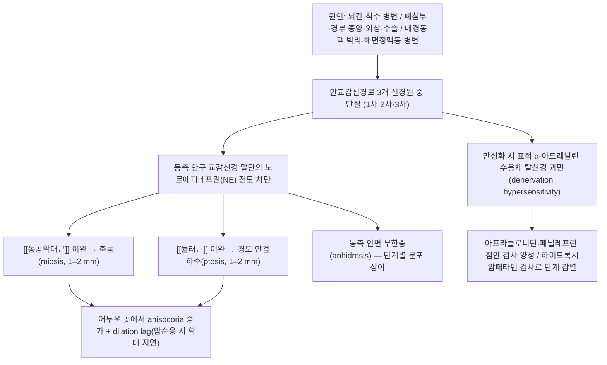
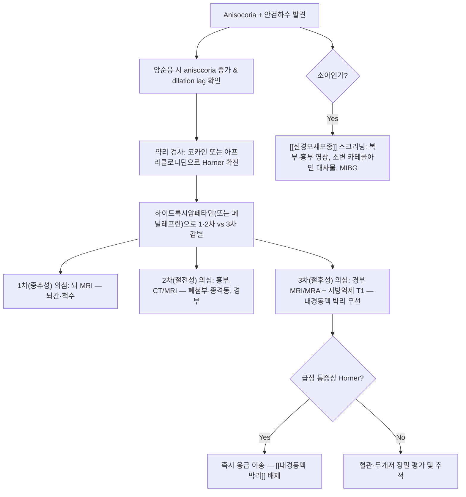

# 🩺 [[호너 증후군]] (Horner Syndrome / 霍納症候群, ICD-10 G90.2)

> **핵심 3줄 요약 (Key Summary)**:
> - 📍 병소 부위 & 해부·병태생리: 시상하부에서 시작해 뇌간·척수(C8–T2 척수중간외측세포주) → [[상경신경절]] → [[내경동맥신경총]] → 안와에 이르는 **3개 신경원(1차 중추성 / 2차 절전성 / 3차 절후성)으로 구성된 안교감신경로(oculosympathetic pathway)** 중 어느 한 곳이든 단절되어 동측 안구의 교감신경 지배가 소실된 상태. 동공확대근([[동공확대근]])과 상안검판근([[뮬러근]])의 이완, 동측 안면 발한 소실이 핵심이다.
> - 🚩 전형적 임상 양상 & 3대 징후: **경도 안검하수(ptosis, 1–2 mm) + 축동(miosis, 1–2 mm) + 동측 무한증(anhidrosis)** 의 3대 징후. 안검하수로 인한 가성 안구함몰(apparent enophthalmos)이 동반되며, anisocoria는 **밝은 곳보다 어두운 곳에서 더 커지는** 것이 특징적이다.
> - 🛠️ 핵심 감별 검사 & 한·양방 다각적 치료 전략: 이학적 검사로 anisocoria·안검하수 정량화 → 국소 점안약 약리 검사([[코카인 검사]], [[아프라클로니딘 검사]], [[하이드록시암페타민 검사]])로 병소 단계 국소화 → **원인 질환 배제를 위한 뇌·경부·흉부 영상**이 진단의 본질. 한방에서는 [[보중익기탕]]·[[보양환오탕]]·[[혈부축어탕]] 계열의 변증 투여와 안와 주위·경항부·교감신경절 상응 혈위 자침·약침을 병용한다(한방 치료 근거는 대부분 **근거 미확인**, 원인 질환 치료가 최우선).
> - ⚠️ 응급 의뢰 레드플래그 & 악화 요인: **급성 통증성 Horner(두통·경통·안통 동반) = [[내경동맥 박리]] 응급(Fast-track 이송)**. 흡연자의 어깨·상지 통증 동반 시 [[판코스트 종양]], 소아에서는 [[신경모세포종]], Horner + 현훈·삼킴곤란·교차성 감각저하 시 [[바렌베르크 증후군]]을 즉시 배제해야 한다. 안와 주위 심자(深刺)·경부 대혈관 상부 심자·기흉 유발 혈위 자극은 절대 금기.

---

## 📌 목차
1. [질환 개요 & 해부학적 병태생리](#1-질환-개요--해부학적-병태생리)
2. [병태생리 메커니즘 & 생체역학적 악순환 네트워크](#2-병태생리-메커니즘--생체역학적-악순환-네트워크)
3. [임상 증상 & 이학적 검사(Physical Exam) 알고리즘](#3-임상-증상--이학적-검사physical-exam-알고리즘)
4. [감별 진단 매트릭스 (Differential Diagnosis)](#4-감별-진단-매트릭스-differential-diagnosis)
5. [한의 통합 치료 프로토콜 (침·약침·추나·한약)](#5-한의-통합-치료-프로토콜-침약침추나한약)
6. [양방 치료 & 병용·의뢰 기준 (Conventional Treatment & Referral)](#6-양방-치료--병용의뢰-기준-conventional-treatment--referral)
7. [재활 운동 & 생활습관 티칭 가이드](#6-재활-운동--생활습관-티칭-가이드)
8. [💡 사용자 진료실 핵심 필기 & 임상 노하우 (Melt-In 잔여 심화 집약)](#7--사용자-진료실-핵심-필기--임상-노하우-melt-in-잔여-심화-집약)
9. [출처 및 학술 참고 문헌 (References)](#8-출처-및-학술-참고-문헌-references)

---

## 1. 질환 개요 & 해부학적 병태생리
![[호너 증후군_1.jpg|540]]

> [그림 1: ① 병태생리·영상 — 호너 증후군_1]

> [그림 2: Diagram summarising the pathophysiology of cluster headache (CH) and other trigeminal autonomic cephalalgias (TACs) acco]

* **질환 정의 및 분류**:
  * **정의**: 안교감신경(oculosympathetic) 경로의 1차(중추성)·2차(절전성, preganglionic)·3차(절후성, postganglionic) 신경원 중 하나가 병변으로 차단되어, 동측 안구의 교감신경 지배가 소실된 증후군. 즉 "질환"이라기보다 **병소를 가리키는 임상 증후군(syndrome)** 이므로, 진단의 최종 목표는 증후군 자체가 아니라 **그 뒤에 있는 원인 질환을 찾아내는 것**이다 (Martin TJ, 2018).
  * **분류**: ① 병소 단계에 따른 분류(1차/2차/3차) ② 발생 시기에 따른 분류(선천성/후천성) ③ 동반 증상에 따른 분류(통증성 — 특히 [[내경동맥 박리]] 시사 / 무통성).
  * **호발 연령·성별·직업군**: 정확한 인구기반 유병률·성별비는 **근거 미확인**. 원인 질환의 분포가 연령대를 결정한다 — 소아·영아에서는 [[신경모세포종]](neuroblastoma)이 가장 중요한 감별 대상이며, Horner 증후군이 종양의 **최초 발현 징후**일 수 있다(Khalatbari H, Ishak GE, 2021). 성인의 급성 통증성 Horner는 내경동맥 박리를 강하게 시사하고, 경부·흉부 수술력(특히 갑상선 수술, 경부 림프절 곽청술)이 있는 경우 절전성/절후성 병변을 우선 고려한다(Tang M, Yin S, 2022).
  * **역학적 특성(요약)**: 갑상선 관련 수술 후 Horner 증후군은 수술적 접근법·수술 범위에 따라 보고 빈도가 다르며, 대부분 일측성이고 수술 직후 또는 수술 후 수일 내 발견된다(Tang M, Yin S, 2022).

* **관련 해부학적 구조물**:

  * **골격 및 관절**:
    * [[경추]] 및 [[상부흉추]](특히 C8–T1–T2 분절) — 교감신경 1차 신경원 세포체가 위치하는 척수 분절과 그 골성 통로. 경추 늑골(cervical rib), 제1흉추 늑골, 쇄골, 상부 늑골의 폐첨부 구조가 2차 신경원의 기계적 압박 위험 구역을 형성한다.
    * [[두개저]]·[[해면정맥동]]·[[안와]] — 3차 신경원의 주행 통로. 해면정맥동 병변 시 다른 뇌신경(III, IV, V1, V2, VI) 증상이 동반될 수 있다.
  * **근육 및 근막**:
    * [[동공확대근]](dilator pupillae, 방사근) — 교감신경 지배를 받아 동공을 확대. 마비 시 축동.
    * [[상안검판근]](Müller 근, superior tarsal muscle) — 상안검을 1–2 mm 정도 거상하는 교감신경 지배 평활근. 마비 시 경도의 안검하수.
    * [[안면부 발한 관련 구조]]·[[한선]] — 얼굴·이마의 발한을 담당. 병소 단계에 따라 무한증 범위가 달라져 국소화(localization)의 단서가 된다.
    * 목·어깨 근군([[사각근]], [[흉쇄유돌근]], [[승모근]]) — 경부 교감신경 사슬과 근접하며, 근긴장·섬유화가 2차성 압박 요인으로 작용할 수 있다(**한의 임상 관점, 근거 미확인**).
  * **신경 및 혈관(3개 신경원 주행 경로)**:

    | 단계 | 신경원 성격 | 세포체(기시) | 주행 경로 | 병변 시 발한 |
    | :--- | :--- | :--- | :--- | :--- |
    | **1차(중추성)** | Central / first-order | 시상하부 → 뇌간(교·연수) 망상구조 → **척수 C8–T2 척수중간외측세포주**(Budge 중심) | 뇌간 내림로, 척수 측주 | 동측 **얼굴·목·상지·동체** 발한 감소(범위 넓음) |
    | **2차(절전성)** | Preganglionic / second-order | 척수 C8–T2 | 전근 → 백색교통지 → 교감신경 사슬 → **[[성상신경절]]**(stellate ganglion) 통과 → 폐첨부·쇄골하혈관·경동맥초를 따라 상행 → **[[상경신경절]]** | 동측 **얼굴 전체** 무한증 |
    | **3차(절후성)** | Postganglionic / third-order | [[상경신경절]] | 내경동맥을 따라 상행 → [[내경동맥신경총]] → 해면정맥동 → 안와 → 장모양체신경 → [[동공확대근]]·[[뮬러근]] | 무한증 **경미 또는 이마 내측 국한**(외경동맥을 따라가는 발한 섬유는 보존) |

  * **경계 부위(clinically critical junction)**: ① 척수 C8–T2 분절 ② 성상신경절–상경신경절 사이 경부 교감 사슬 ③ 내경동맥 기시부–해면정맥동 구간. 이 세 구간은 각각 경추 병변/경부 수술, 경부 외상, 내경동맥 박리와 직결된다.

---

## 2. 병태생리 메커니즘 & 생체역학적 악순환 네트워크

![[호너 증후군_4.jpg|540]]
> [그림 2: ② 관련 해부 구조물 — Schematic drawing demonstrating the <b>anatomy</b> of the posterior portion of the cavernous sinus on the right side. Oc]

### 1) 해부학적 포착 및 압박 기전
* **1차 신경원(중추성)**: 뇌간 병변의 전형적 예가 [[바렌베르크 증후군]](외측 연수경색)으로, 이때 Horner 증후군은 현훈·안진·삼킴곤란·교차성 감각저하와 함께 나타난다. 그 외 뇌간 종양, 다발성경화증 등 탈수초 질환, 척수공동증(syringomyelia), 아놀드-키아리 기형, 경추 척수 손상 등이 원인이 된다(Martin TJ, 2018).
* **2차 신경원(절전성)**: 해부학적 통로가 길고 곡선이어서 외부 병변에 가장 취약하다. 폐첨부의 [[판코스트 종양]], 경추 늑골, 쇄골하혈관 이상, 경부·흉부 외상 및 수술(경부 곽청술, 상부 흉부 수술, 일부 접근법의 갑상선 수술), 분만 손상에 의한 상완신경총 손상(Klumpke 마비)이 해당된다(Tang M, Yin S, 2022; Walton KA, Buono LM, 2003).
* **3차 신경원(절후성)**: [[내경동맥 박리]]가 가장 위험한 원인이며, 박리로 인한 동통성 경부·두부 통증과 함께 급성 통증성 Horner를 만든다. 그 외 경부 외상, 해면정맥동 병변(종양·혈전·동맥류), 두개저 종양, 중이 질환, 내경동맥 결찰·경동맥 내막절제술, 경정맥 중심정맥관 삽입 등이 있다. 3차 병변에서는 발한 섬유의 상당 부분이 외경동맥을 따라가므로 **무한증이 뚜렷하지 않을 수 있다**(Martin TJ, 2018).
* **약리학적 기전의 핵심**: 교감신경 말단에서 유리된 노르에피네프린이 [[동공확대근]]의 α1 수용체를 자극해 동공을 확대한다. 병변 후 시간이 지나면 표적 기관에 **탈신경 과민(denervation hypersensitivity)** 이 발생하며, 이것이 아프라클로니딘(α1 작용/α2 부분작용)과 페닐레프린(α1 작용제) 점안 검사의 원리이다.

### 2) 생체역학적 연쇄 반응 (Kinetic Chain)
* Horner 증후군은 근골격계 질환이 아니므로 고전적 개념의 운동학적 연쇄(kinetic chain)보다는 **"신경학적 연쇄"** 로 이해하는 것이 적절하다.
  * **축동 → 시기능 변화**: 사물이 어둡게 느껴짐, 야간 시력 저하 호소 가능(정도는 미미, **근거 미확인**).
  * **안검하수 → 안면 비대칭 → 보상적 이마근(전두근) 과긴장**: 환자가 눈을 크게 뜨려 이마에 힘을 주어 [[전두근]] 과사용, 두통·이마 주름 비대칭이 이차적으로 발생할 수 있다.
  * **경부 원인 병변이 동반된 경우**: 경부 근긴장 이상, 상부 경추 기능부전이 교감신경 사슬 주변의 기계적 자극을 유지·악화시킬 수 있다는 가설적 관점(**근거 미확인, 한의 임상 관점**).
  * **만성화 시**: 탈신경 과민으로 α수용체 반응성이 증가하고, 후천성 3차 병변에서는 시간이 지나며 미세 축동이 남는 경우가 있다.

---

## 3. 임상 증상 & 이학적 검사(Physical Exam) 알고리즘

### 1) 주소증 및 신경학적 증상
* **안과적 3대 징후**:
  * **경도 안검하수(ptosis)**: 보통 1–2 mm로 미미하고, 환자 스스로는 "눈이 처진다"보다 "눈이 작아 보인다"고 표현하는 경우가 많다. 상안검거근(levator) 마비와 감별이 필요하다.
  * **축동(miosis)**: 동측 동공이 1–2 mm 작다. **어두운 환경에서 anisocoria가 커지는 것**이 핵심 감별점이다(생리적 anisocoria는 조명 변화와 무관하게 일정).
  * **무한증(anhidrosis)**: 병소 단계에 따라 동측 얼굴 전체(1·2차성) 또는 이마 내측 국한(3차성). 환자는 "한쪽 얼굴에 땀이 안 난다"고 호소한다.
  * **동반 소견**: 가성 안구함몰(apparent enophthalmos — 실제 안구 위치는 정상이나 안검하수로 함몰처럼 보임), 선천성인 경우 **[[홍채이색증]](heterochromia iridis)** — 정상측은 갈색, 이환측은 밝은 색으로 발현.
* **자율신경성 증상**: 동측 안면 홍조·피부 온도 변화, 이명·현훈 동반 가능(단, 이는 원인 병변에 기인).
* **원인 질환에 따른 동반 신경학적 증상(국소화의 열쇠)**:
  * 1차성: 어지럼, 안진, 복시, 삼킴곤란, 편측 감각저하/운동마비, 반대측 통증·온도 감각 소실(교차성).
  * 2차성: 어깨·상지의 통증 및 저림, 상지 근력저하(폐첨부 종양·상완신경총 병변), 경부 종괴, 이전 경부/흉부 수술력.
  * 3차성: **동측 두통·경통·안와통(내경동맥 박리 시사)**, 안구운동 제한, 안면통(해면정맥동 병변).
* **소아 특이 소견**: 복부 종괴, 체중 감소, 발열, 골통, 안구돌출 등 [[신경모세포종]] 관련 증상 동반 여부를 반드시 확인한다(Khalatbari H, Ishak GE, 2021).

### 2) 필수 이학적 검사법 (Physical Examination)

| 검사 | 방법 | 양성 소견 | 진단적 가치 |
| :--- | :--- | :--- | :--- |
| **[[Anisocoria 측정 검사]]** | 밝은 조명과 어두운 조명에서 각각 동공 크기 측정(자 또는 동공계) | **어두운 곳에서 anisocoria ≥ 1 mm 증가** | Horner의 가장 기본 스크리닝. 생리적 anisocoria(≤0.4 mm, 조명 무관)와 감별 |
| **[[Dilation lag 검사]]** | 암순응 후 5초·15초 시점의 동공 확대 지연 관찰 | 이환측 확대가 지연(수 초 이상) | 절후성 병변에서 두드러짐. 확대가 느린 동공 촬영으로 확인 가능 |
| **[[코카인 점안 검사]]** | 4% 또는 10% 코카인 점안 후 30–60분 관찰 | **이환측 동공이 확대되지 않음**(정상측은 확대) | Horner 확진에 가장 고전적·특이적. 단, 국내 사용 제한·초기 급성기 위음성 가능 |
| **[[아프라클로니딘 점안 검사]]** | 0.5% 또는 1% 점안 후 30–45분 관찰 | **이환측 동공이 확대되어 anisocoria 역전** | 코카인 대체 검사로 소아·성인 모두 유용. 영아에서는 무호흡·기면 보고가 있어 주의 |
| **[[하이드록시암페타민 점안 검사]]** | 1% 점안 후 45–60분 관찰 | 이환측 동공 **확대 → 1·2차성(절전성, 절후신경원 보존)** / **미확대 → 3차성(절후성)** | 단계 국소화의 핵심 검사. 3차성에서 위음성 가능 |
| **[[페닐레프린 점안 검사]]** | 1% 점안 후 관찰 | 이환측이 **더 크게 확대(≥1 mm) = 탈신경 과민** | 3차성 시사. 1%에서 반응 없으면 2.5–10%로 재시도(진단적 가치는 상대적) |
| **[[안검하수 정량화(MRD1)]]** | 각막 반사광–상안검연 거리 측정 | 이환측 MRD1 감소(1–2 mm) | 상안검거근 마비(중증 하수)와 감별 |
| **[[안구운동 및 뇌신경 검사]]** | 외안근 운동, 복시, 안면 감각, 구개·혀 운동 | 뇌신경 마비 동반 시 해면정맥동·두개저 병변 시사 | 3차성 병변의 위험도 평가 |
| **[[경부·상지 신경학적 검사]]** | 상지 근력·감각·심부건반사, 호너 반사, 경부 종괴 촉진 | 상지 증상 동반 시 2차성(폐첨부/신경총) 시사 | 흉부 영상 의뢰 결정 |

### 3) 진단 알고리즘 (국소화 → 원인 배제)

* **핵심 원칙**: 약리 검사는 어디까지나 **국소화 도구**이며, 확진 이후 반드시 영상 검사로 원인을 배제해야 한다. 특히 소아 Horner는 신경모세포종 연관 평가가 필수적이다(Khalatbari H, Ishak GE, 2021).

---

## 4. 감별 진단 매트릭스 (Differential Diagnosis)

| 감별 질환 | 호발 병소 및 원인 | 주소증 차이점 | 특이적 이학적 검사 소견 |
| :--- | :--- | :--- | :--- |
| **[[호너 증후군]]** (본 질환) | 안교감신경로 1·2·3차 신경원 단절 | 경도 안검하수 + 축동 + 무한증 3징 동반, 어두울 때 anisocoria 증가 | 코카인/아프라클로니딘 검사 양성, 하이드록시암페타민으로 단계 감별 |
| **[[생리적 Anisocoria]]** | 정상 변이 | 안검하수·무한증 없음, 무증상 | 조명 조건과 무관하게 anisocoria ≤ 0.4 mm, 시간 경과 시 일정 |
| **[[상안검거근 마비성 안검하수]](노인성/건막성 안검하수)** | 상안검거근 건막 이완, 노화, 외상 | 안검하수는 뚜렷하나 **동공 변화 없음** | 동공 크기 정상, 무한증 없음, MRD1·안검주름 증가 |
| **[[중증근무력증]]** | 신경근접합부 자가면역 | **피로성** 안검하수(저녁 악화), 복시, 일중 변동 | Tensilon/항AChR 항체, 냉온 부하 검사, 동공은 정상 |
| **[[동안신경 마비]](제3뇌신경 마비)** | 후교통동맥류, 당뇨, 염증 | 안검하수는 **완전**, 동공은 **산동(mydriasis)** — Horner와 정반대 | 동공 산대 + 외안근 마비(내직근·상하직근·하사근), 복시 |
| **[[아르가일 로버트슨 동공]]** | 신경매독(중뇌) | 소동공·불규칙, **양측성** | 빛-근접 반사 해리(빛 반사 소실, 근접 반사 보존), 안검하수 없음 |
| **[[아디 긴장성 동공]]** | 모양체신경절 병변 | 산동 + 빛-근접 반사 해리, 무한증 없음 | 0.125% 필로카르핀 점안 시 축동(탈신경 과민) |
| **[[군발성 두통]]** | 삼차-자율신경 반사 | 발작성 편측 안통 + 일시적 Horner 유사 증상 | 발작기 동안만 부분적 Horner 징후, 발작 간기 정상화 |
| **[[홍채염·요전방 질환]]** | 염증성 축동 | 동통·광선공포·충혈 동반, 안검하수 없음 | 세극등 소견, 전방 염증세포 |
| **[[내경동맥 박리]]** (Horner의 원인) | 경부 혈관 손상 | **급성 통증성 Horner**, 경통·두통·안와통, TIA 증상 | 경부 MRA/CTA + 지방억제 T1에서 혈관벽 혈종(mural hematoma) |

> **감별의 제1원칙**: 동공이 **작아지면**(축동) Horner, **커지면**(산동) 제3뇌신경 마비/아디 동공을 먼저 생각한다. 단, 동공 크기 변화가 없으면 근성·건막성 안검하수와 신경근접합부 질환을 우선한다.

---

## 5. 한의 통합 치료 프로토콜 (침·약침·추나·한약)

![[호너 증후군_5.jpg|540]]
> [그림 3: ③ 치료·시술점 — Unilateral idiopathic <b>Horner's syndrome</b> in an English Cocker Spaniel was cured by ST-4 and GB-1 acupuncture <b>tr]

> ⚠️ **전제**: 호너 증후군은 **원인 질환 치료가 본질**이며, 한의 치료는 ① 원인이 배제된 후의 잔여 증상 관리 ② 자율신경 균형 회복 ③ 동반된 경항부·안면 근긴장 개선을 목표로 한다. 아래 한의 치료 내용은 **한방 임상 관행에 기반한 것으로, 호너 증후군 자체에 대한 무작위대조시험 근거는 현재 확인되지 않음(근거 미확인)**.

* **침구 치료 (Acupuncture)**:
  * **안와 주위 국소 혈위**: 睛明(BL1), 攒竹(BL2), 陽白(GB14), 絲竹空(TE23), 瞳子髎(GB1), 四白(ST2), 太陽(EX-HN5) — 안검하수·안면 근긴장 완화 목적. **睛明·瞳子髎는 안구 천자·혈종 위험이 있으므로 안구를 향한 심자 금지, 0.5촌 이내 얕은 자침 또는 지압 대체**.
  * **경항부 및 교감신경 관련 혈위**: 風池(GB20), 天柱(BL10), 頸夾脊(C1–C7, 특히 C8–T2 상응 부위), 大椎(GV14), 天牖(TE16), 肩井(GB21) — 경부 교감신경 사슬 주변의 근긴장 완화. **天牖·肩井은 기흉 위험으로 심자·방향성 자침 절대 금기**.
  * **전신 변증 배혈**: 合谷(LI4), 太衝(LR3, 開四關), 足三里(ST36), 百會(GV20), 上星(GV23), 神門(HT7), 三陰交(SP6) — 기혈 순환 및 자율신경 조절.
  * **전침(Electroacupuncture)**: 안와 주변–경항부 또는 合谷–太衝 배합에 2–10 Hz, 15–20분 세팅이 임상적으로 흔히 쓰이나, **호너 증후군에서의 최적 주파수는 근거 미확인**. 頸夾脊 자침 시 감각 이상 유발 여부를 지속 확인.
  * **성상신경절(星狀神經節) 자극 접근**: 성상신경절은 C6–C7 횡돌기 전방·기관과 경동맥 사이에 위치하며, 天突(CV22)·缺盆(ST12) 인근에서 시술된다. 다만 **기관·경동맥·폐첨부와 인접하여 침 시술로는 매우 위험**하므로, 한의 임상에서는 직접 심자보다 경항부 이완과 전신 자율신경 조절을 우선한다.
* **약침 치료 (Pharmacopuncture)**:
  * **경항부 근긴장 완화 목적**: 風池·天柱·頸夾脊 주위의 근막 긴장점에 소량(0.1–0.3 cc/점) 주입.
  * **변증별 약침 선택(임상 관행, 근거 미확인)**: 기허 → 黃芪·人蔘 계열 자하거/황기 약침, 어혈 → 紅花·丹蔘 계열, 풍담 → 陳皮·半夏 계열. **약침의 호너 증후군 특이 효능은 검증된 바 없으므로, 원인 질환 치료 이후 보조적 접근으로 한정**.
  * **금기 부위**: 안와 내 주입 절대 금지, 경부 대혈관(내경동맥·경정맥) 및 기관 주위 심부 주입 금지, 항응고제 복용자·내경동맥 박리 의심 환자에서는 경부 약침 전면 금지.
* **추나 치료 (Chuna Manipulation)**:
  * **적응 개념**: 원인이 배제된 만성기에서 상부 경추·상부 흉추 기능부전이 동반된 경우, 경항부 근막 이완(JS 수기)과 상부 흉추 관절가동술로 주변 조직 긴장을 낮춘다.
  * **금기**: ① 내경동맥 박리 의심 또는 진단된 경우 **경부 회전·신전 도수 절대 금기**(박리 악화 위험) ② 경추 불안정·골절·종양·감염 ③ 진행성 신경학적 결손 ④ 소아 Horner에서 원인 미배제 상태.
  * **주의**: 고속 저진폭(HVLA) 경추 회전 교정은 척추동맥·내경동맥 손상과의 연관성이 논쟁 중이므로, 본 증후군 환자에서는 **저속·저부하 가동술로 제한**하는 것이 안전하다.
* **한약 치료 (Herbal Medicine)**:
  * **안검하수·기허하함(氣虛下陷)형**: 補中益氣湯 계열([[보중익기탕]]) — 안검하수에 대한 한방 전통 접근의 대표 처방. 단, 호너 증후군 대상 임상시험 근거는 **미확인**.
  * **어혈·신경 재생 도모형**: 補陽還五湯([[보양환오탕]]), 血府逐瘀湯([[혈부축어탕]]) — 마비·저림 동반 시 변증상 활용.
  * **풍담·경락 폐색형**: 牽正散(견정산) 계열 — 안면 근긴장·안검 운동 이상 동반 시 고려.
  * **간신부족·안계 실양형**: 杞菊地黃丸 계열 — 눈의 피로·야간 시력 저하 동반 시 고려.
  * **처방 선택 원칙**: 병소 단계(1·2·3차)에 따른 처방 특이성은 없으며, **환자의 전신 변증(기허/어혈/담습/간신허)에 따라 선택**한다. 혈압 변동성, 자율신경 안정성, 위장관 내약성을 고려하여 용량을 조절한다(모두 **근거 미확인, 임상 경험적 접근**).

---

## 6. 양방 치료 & 병용·의뢰 기준 (Conventional Treatment & Referral)

> 🎯 **이 섹션의 목적**: 환자가 **양방약을 이미 복용 중인 경우가 많다.** 한의원 1차 진료에서 양방 치료를 이해하고, 병용 가능·주의·금기를 판단하며, 언제 의뢰할지 결정한다.

* **약물 치료 (Medication)**:
  * 계열별 약물·용량·기간 — 국내 처방 관행 반영.
  * 작용 기전과 한의 치료와의 상호작용.
* **비약물 시술 (Procedures)**:
  * 주사·차단술·물리치료·보조기 등.
* **수술·시술 적응증 (Surgical Indication)**:
  * 언제 수술로 가는가 — 절대·상대 적응증, 수술 후 경과.
* **한의 병용 판단 (Combination Therapy)**:
  * 병용 가능 / 주의 / 금기. 복용 중 환자의 감량 타이밍·반동 현상.
* **양방·전문과 의뢰 기준 (Referral Criteria)**:
  * 응급 의뢰 트리거와 전문과 의뢰 기준(정형외과·신경외과·내과 등).

	(작성 필요)

---

## 7. 재활 운동 & 생활습관 티칭 가이드

* **이완 및 스트레칭 (Stretching)**:
  * **상부 승모근·견갑거근·흉쇄유돌근·사각근**의 정적 스트레칭을 20–30초 × 3회/일 실시. 경부 교감신경 사슬 주변의 긴장을 낮추기 위한 목적(기전적 근거는 제한적, **근거 미확인**).
  * **흉곽상부 호흡(inspiratory hold) 스트레칭**으로 제1–2 늑골 및 폐첨부 공간 확장 유도.
  * **금기 스트레칭**: 경부 완전 신전 + 회전 조합(척추동맥 손상 위험), 통증성 Horner 급성기에 모든 경부 운동.
* **강화 및 안정화 운동 (Strengthening)**:
  * **심부 경부 굴곡근(deep neck flexor)** 강화: 턱 당기기(chin tuck) 10회 × 2세트, 통증 없는 범위에서.
  * **견갑 안정화(serratus anterior, lower trapezius)** 강화로 경부 부하 감소.
  * **안면 근육**: 전두근 과사용을 줄이기 위한 이완 훈련(강제 이완, 눈썹 힘 빼기). 과도한 눈 찡그림 습관 교정.
* **신경 활주 운동 (Neurodynamics)**:
  * 상완신경총 신경 활주(brachial plexus slider)는 **2차성(절전성) 병변의 원인이 상완신경총 손상·유착인 경우에 한해** 부드럽게 시행한다. 슬라이더 기법(어깨 신전 + 손목 굴곡 + 경부 반대측 굴곡)으로 10회 × 2세트, 저부하로.
  * **금기**: 종양·전이, 급성 신경 압박, 검사상 신경학적 결손이 진행 중인 경우.
  * 안와 주변에는 신경 활주 기법을 적용하지 않는다.
* **일상생활 자세 티칭 (Ergonomics)**:
  * 모니터 상단을 눈높이에 맞추고 40–60 cm 거리 유지 → 상부 경추 신전·경부 긴장 최소화.
  * 스마트폰 사용 시 목을 30° 이상 숙이지 않기.
  * 수면 시 베개 높이를 6–8 cm로 낮추고 경부 중립 유지, 엎드려 자는 자세 회피.
  * 어깨에 가방을 한쪽으로 메는 습관 교정(편측 승모근·경부 부하).
* **안과적 생활 관리**:
  * 실내 조명을 과도하게 밝히지 않기(양쪽 동공 반응 차이로 인한 눈부심 완화).
  * 자외선 차단 선글라스 착용으로 glare 감소.
  * 안검하수로 시야 가림이 있는 경우 안과에서 미용적/기능적 교정 상담.
  * **환자 교육상 가장 중요한 점**: "이 증상은 눈 자체의 문제가 아니라 신경 회로와 그 뒤의 원인 질환 문제이므로, 원인 검사(영상·혈액·소변 검사)를 반드시 끝까지 받아야 한다."

---

## 8. 💡 사용자 진료실 핵심 필기 & 임상 노하우 (Melt-In 잔여 심화 집약)

> [!IMPORTANT]
> **🛡️ 원문 융합(Melt-In) 및 7번 섹션 작성 불변 규칙 (CRITICAL)**
> 1. **기존 필기 내용 상부 전면 융합 (Melt-In)**: 이 노트의 질환 정의, 해부학적 3개 신경원 경로, 단계별 무한증 분포, 이학적 검사(코카인·아프라클로니딘·하이드록시암페타민·페닐레프린), 감별 진단, 변증별 한약·침·약침 전략, 생활 티칭은 상부 1~6번 섹션에 100% 녹여내었다.
> 2. **7번 섹션의 차별화된 심화 집약 (녹이고 남은 고유 필기만 수록)**: 아래는 상부에 담기 어려운 **진료실 실전 문진·손맛·설명 스크립트**로 한정한다.

* **상부 섹션에 미처 다 담지 못한 고유 원문 필기**:
  * **"한쪽 눈이 작아 보인다"는 호소는 세 갈래로 갈라 듣는다.** ① 안검하수만 → 근성/건막성 ② 안검하수 + 축동 → **호너** ③ 안검하수 + 산동 + 복시 → **제3뇌신경**. 진료실에서 손전등만으로 3초 만에 1차 분류가 가능하다.
  * **어두운 곳에서 확인하라.** 진료실 조명이 밝으면 호너의 anisocoria가 오히려 작아져 놓친다. 조명을 낮추고 1분 대기 후 다시 관찰하는 것이 진료실 수준의 가장 값싼 확진 보조법이다.
  * **무한증은 "이마"를 본다.** 얼굴 전체 무한증이면 1·2차성, 이마 내측만 안 나면 3차성을 시사 → 영상 검사 방향이 완전히 달라진다.
  * **소아를 절대 가볍게 보지 않는다.** 소아 호너는 신경모세포종의 첫 신호일 수 있다. "눈이 작아 보인다"는 소아 환자에서 복부 촉진·체중 추이·발열 여부를 반드시 확인하고 소아과/영상 의뢰를 주저하지 않는다(Khalatbari H, Ishak GE, 2021).
  * **갑상선 수술력은 반드시 캐묻는다.** 경부 수술 후 발생한 호너는 절전성/절후성 병변일 수 있고, 대개 일측성으로 수술 직후 또는 수일 내 발현한다(Tang M, Yin S, 2022).

* **진료실 실전 감별 & 치료 노하우**:
  * **1. 실전 문진 체크리스트(5문항)**
    1. **언제 시작되었는가?** (급성 = 혈관/박리, 서서히 = 종양/압박)
    2. **아픈가?** (동측 두통·경통·안와통 = 내경동맥 박리 최우선)
    3. **한쪽 얼굴에 땀이 나는가?** (범위 확인 → 단계 국소화)
    4. **어깨·팔 저림, 기침, 흡연력?** (폐첨부 병변)
    5. **경부/흉부/갑상선 수술력, 외상력, 중심정맥관 삽입력?** (의인성 원인)
  * **2. 치료 순서 및 손맛 노하우**
    * **자침 순서**: ① 원위부(合谷·太衝·足三里) 먼저 자침하여 전신 긴장을 낮춘다 → ② 경항부(風池·天柱·頸夾脊) 저부하 자침 → ③ 마지막에 안와 주변(攒竹·陽白·絲竹空)을 얕게. 안와 주변을 먼저 자극하면 환자가 긴장하여 눈을 감고 움츠러들어 자침이 어려워진다.
    * **눈 주위 자침 각도**: 안와연을 따라 접선 방향으로 15–30°, 골막을 긁지 않도록. 자침 후 안구 운동을 시켜 이상감·복시 여부를 반드시 확인.
    * **경항부 약침**: 風池·天柱는 근막층에 0.1–0.2 cc씩, 흡인(aspiration) 후 주입. 주입 전 반드시 혈관 내 역류 여부 확인.
    * **추나 적용 체위**: 상부 경추는 앉은 자세에서 저속 저부하 가동술로 시작하고, 어지럼 유발 시 즉시 중단. **경추 회전 HVLA는 이 환자군에서 시행하지 않는다.**
    * **치료 반응 판정**: 동공 크기보다 **어두운 곳 anisocoria와 안검하수(MRD1)** 를 주 1회 기록하여 추적하는 것이 실무적으로 유용하다. 단, 한방 치료가 동공 크기에 영향을 준다는 근거는 **미확인**이다.
  * **3. 환자 티칭 스크립트**
    * **설명 멘트(원인 중심)**: "이건 눈 자체의 병이 아니라, 뇌에서 눈으로 가는 교감신경 회로가 어딘가에서 막힌 겁니다. 그래서 눈꺼풀이 살짝 처지고 동공이 작아지고 한쪽 얼굴에 땀이 덜 나는 겁니다. **중요한 건 이 회로를 막은 원인을 찾는 것**이라서, 영상 검사 결과를 반드시 확인해야 합니다."
    * **급성 통증성 호소 시(응급 안내)**: "목이나 머리가 아프면서 눈이 갑자기 작아졌다면 혈관 문제일 수 있어, 지금 바로 큰 병원 응급실에서 혈관 검사를 받으셔야 합니다. 한방 치료는 그 결과를 확인한 뒤에 진행합니다."
    * **생활 멘트**: "밤에 운전하실 때 전조등이 부담되면 선글라스를 쓰시고, 화면 밝기는 낮게, 잠들 때는 낮은 베개를 사용하세요. 그리고 한쪽 가방 메는 습관은 목 근육을 계속 긴장시켜서 증상을 오래 남게 합니다."
    * **재발/추적 멘트**: "동공 크기와 눈꺼풀 처짐을 매주 같은 조명에서 관찰해서 알려주세요. 갑자기 눈이 더 처지거나 팔 저림·삼킴 불편이 생기면 바로 오세요."

---

## 9. 출처 및 학술 참고 문헌 (References)

1. **Martin TJ (2018)**. *Horner Syndrome: A Clinical Review*. **ACS Chemical Neuroscience**.
   - **PMID**: 29260849
   - **[연구 요약]**: 안교감신경로의 1·2·3차 신경원 해부와 단계별 원인 질환, 코카인·하이드록시암페타민 등 약리 검사의 원리와 국소화 전략, 영상 검사 접근을 정리한 임상 종설. 본 노트의 병소 단계 분류 및 약리 검사 체계의 주요 근거.
2. **Tang M, Yin S (2022)**. *Horner syndrome after thyroid-related surgery: a review*. **Langenbeck's Archives of Surgery**.
   - **PMID**: 35947219
   - **[연구 요약]**: 갑상선 수술 및 관련 경부 수술 후 발생하는 호너 증후군의 발생 기전(경부 교감신경 사슬·성상신경절 주변 조작), 임상 양상, 경과를 정리한 리뷰. 의인성 절전성/절후성 병변 감별에 참고.
3. **Walton KA, Buono LM (2003)**. *Horner syndrome*. **Current Opinion in Ophthalmology**.
   - **PMID**: 14615640
   - **[연구 요약]**: 호너 증후군의 임상 감별, 약리학적 검사 해석, 성인 및 소아에서의 원인 질환 스펙트럼을 정리한 고전적 리뷰. 병소 국소화 및 영상 의뢰 지침의 기초 자료.
4. **Khalatbari H, Ishak GE (2021)**. *Imaging of Horner syndrome in pediatrics: association with neuroblastoma*. **Pediatric Radiology**.
   - **PMID**: 33025064
   - **[연구 요약]**: 소아 호너 증후군에서 신경모세포종과의 연관성을 중심으로 영상 검사의 적응증, 검사 범위(MRI/CT, MIBG 등)와 해석 포인트를 제시. 소아 환자 평가 프로토콜의 근거.

> ※ 제공된 논문 목록에서 Martin TJ (2018, PMID 29260849) 및 Khalatbari H, Ishak GE (2021, PMID 33025064)는 중복 기재되어 있어 1회씩만 수록하였다.
> ※ 본 노트의 한의 변증·침구·약침·추나 치료 내용은 원인 질환에 대한 양방 진단·치료를 대체하지 않으며, 해당 중재들의 호너 증후군 특이적 효능은 현재까지 확인된 학술 근거가 없다(**근거 미확인**).

<!-- 보관 태그(1회용·링크오류, 필요시 복원): 신경계 질환, 안검하수, 축동, 호너증후군 -->
