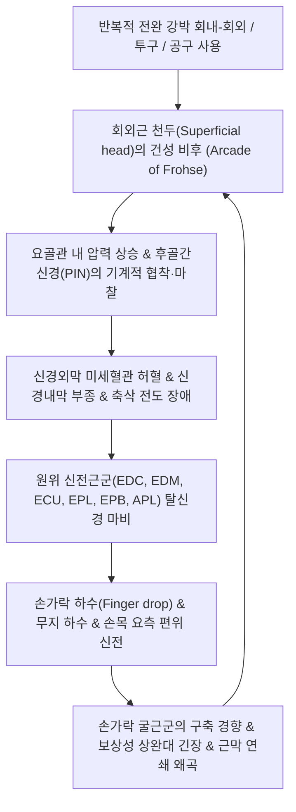

# 🩺 [[후골간신경 마비]] (Posterior Interosseous Nerve Palsy / 後骨間神經痲痺, G56.3)

> **핵심 3줄 요약 (Key Summary)**:
> - 📍 **병소 부위 & 해부·병태생리**: [[상완신경총]](C5-T1)의 [[요골신경]] 심부 운동 분지인 후골간신경([[PIN]])이 주관절 전외측의 [[회외근]](Supinator) 상연 건성 섬유성 반월형 아치인 **프로세 건궁([[Arcade of Frohse]])**을 통과하며 기계적으로 압박·포착되어 발생함.
> - 🚩 **전형적 임상 양상 & 3대 징후**: 피부 감각 장애는 **100% 정상 보존(0% 감각 저하)**되면서 중수수지관절(MCP) 및 엄지를 펴지 못하는 **수지하수([[Finger drop]] / Thumb drop)**, 완관절 신전 시 [[장요측수근신근]](ECRL)만 단독 작용하여 손목이 노뼈 쪽으로 비스듬히 기울어지는 **손목 요측 편위 신전(Radial deviation on wrist extension)**.
> - 🛠️ **핵심 감별 검사 & 한·양방 다각적 치료 전략**: 건고정 효과([[Tenodesis effect]])를 통한 신전건 파열과의 감별, 초음파 유도하 프로세 건궁 및 회외근 섬유대 [[도침요법]](Acupotomy) 미세 절개 감압술, [[곡지]](LI11)·[[수삼리]](LI10) 전침(2~20Hz) 및 신경 재생 한약([[보양환오탕]], [[황기계지오물탕]]) 투여.
> - ⚠️ **응급 의뢰 레드플래그 & 악화 요인**: 요골두 주변의 거대 결절종(Ganglion cyst), 지방종, 신경초종 등 공간 점유 병변에 의한 급속한 진행성 운동 마비 및 3~6개월 이상의 적극적 보존/침도 감압 치료에도 불응하는 완전 축삭단열성 위축 환자는 외과적 건 이전술(Tendon transfer) 또는 관혈적 신경 감압술 즉각 의뢰.

---

## 📌 목차
1. [질환 개요 & 해부학적 병태생리](#1-질환-개요--해부학적-병태생리)
2. [병태생리 메커니즘 & 생체역학적 악순환 네트워크](#2-병태생리-메커니즘--생체역학적-악순환-네트워크)
3. [임상 증상 & 이학적 검사(Physical Exam) 알고리즘](#3-임상-증상--이학적-검사physical-exam-알고리즘)
4. [감별 진단 매트릭스 (Differential Diagnosis)](#4-감별-진단-매트릭스-differential-diagnosis)
5. [한의 통합 치료 프로토콜 (침·약침·추나·한약)](#5-한의-통합-치료-프로토콜-침약침추나한약)
6. [양방 치료 & 병용·의뢰 기준 (Conventional Treatment & Referral)](#6-양방-치료--병용의뢰-기준-conventional-treatment--referral)
7. [재활 운동 & 생활습관 티칭 가이드](#6-재활-운동--생활습관-티칭-가이드)
8. [💡 사용자 진료실 핵심 필기 & 임상 노하우 (Melt-In 잔여 심화 집약)](#7--사용자-진료실-핵심-필기--임상-노하우-melt-in-잔여-심화-집약)
9. [출처 및 학술 참고 문헌 (References)](#8-출처-및-학술-참고-문헌-references)

---

## 1. 질환 개요 & 해부학적 병태생리

![[요골관증후군_요골관_신경압박_병태생리도해.jpg|450]]
> [그림 1: ① 질환/병태생리 메디컬 일러스트 — 요골관 내 후골간신경(PIN) 주행 및 프로세 건궁(Arcade of Frohse) 압박 부위]

### 1) 질환 정의 및 개념
후골간신경 마비([[Posterior interosseous nerve palsy]], PIN palsy, G56.3)는 [[요골신경]](Radial nerve)이 주관절 외측에서 천지(천요골신경, SRN)와 심지(심요골신경, DRN)로 분지된 후, 심요골신경이 전완 근위부의 섬유-근육성 터널(요골관, Radial tunnel)을 지나 [[회외근]](Supinator) 천두와 심두 사이를 관통하여 전완 후면 골간막으로 진입하는 과정에서 기계적 압박을 받아 발생하는 **순수 운동신경 마비 증후군**이다.

동일한 해부학적 요골관 구역에서 신경이 압박되더라도 통증 위주로 발현하며 운동 마비가 없는 상태는 [[요골관 증후군]](Radial tunnel syndrome)으로 분류하고, 통증 여부와 관계없이 전완 신근군의 마비(손가락 및 엄지 신전 불능)가 주증상인 경우를 본 질환인 '후골간신경 마비'로 진단한다.

### 2) 주행 경로 및 5대 해부학적 포착 병소
후골간신경은 감각 신경섬유를 거의 포함하지 않고 전완 후면 신전근들을 지배하는 순수 운동신경(단, 완관절낭과 골간막의 고유수용성 감각섬유 극소수 제외)이다. 주관절 외측상과 전방 약 3~4cm 근위부에서 분지하여 주두 하방 약 5cm 구역까지 주행하는 동안 다음의 5개 구조물에 의해 포착된다.

1. **프로세 건궁([[Arcade of Frohse]]) — ★임상 최빈발 (75~85%)**:
   * [[회외근]](Supinator) 천두(Superficial head)의 근위부 가장자리를 형성하는 반월형의 건성(Tendinous) 섬유 밴드.
   * 태아기에는 막성이지만 성인이 되면서 반복적 전완 회내·회외 운동의 마찰에 의해 두꺼운 건성 구조로 변성되며(성인의 30~50%에서 비후 관찰), 전완의 완전 회내(Pronation) 시 신경을 강력하게 조인다.
2. **[[단요측수근신근]](ECRB)의 근위 내측 건막연**:
   * ECRB의 근위부 건성 가장자리가 날카롭게 비후되어 신경 주행로를 전외측에서 압박.
3. **헨리 혈관륜(Leash of Henry)**:
   * 회귀 요골동맥(Recurrent radial artery)과 그 동반 정맥들이 PIN의 전방을 가로지르며 신경을 누르는 혈관성 올가미.
4. **[[상완이두근]] 건막(Bicipital aponeurosis)의 외측 섬유 밴드**:
   * 이두근 건막의 섬유성 확장이 주관절 외측으로 뻗어나와 요골신경 분지부를 덮음.
5. **[[회외근]] 원위부 출구(Distal margin of Supinator)**:
   * 신경이 회외근을 빠져나와 후골간 구획으로 나가는 출구부의 치밀 결손막.

---

## 2. 병태생리 메커니즘 & 생체역학적 악순환 네트워크

![[요골관증후군_요골신경심지_회외근관통_해부도해.jpg|450]]
> [그림 2: ② 관련 해부학적 구조물 — 요골신경 심부 운동 분지(PIN)의 회외근 천두 관통 및 지배 근육 해부 도해]

### 1) 지배 근육의 단계적 분지와 마비 양상 매커니즘
후골간신경 마비의 임상적 특징은 신경이 포착되는 '프로세 건궁 이전'에 분지하는 근육과 '포착 통과 후'에 분지하는 근육의 기능 차이에서 기인한다.

* **포착 상부에서 이미 분지되어 완전 정상 보존되는 근육**:
  * [[상완요골근]](Brachioradialis): 주관절 굴곡 유지.
  * [[장요측수근신근]](ECRL): 완관절 신전 및 요측 편위를 담당하며, 정상 수축력을 유지함.
* **포착부 주변에서 분지되어 부분 마비 또는 보존되는 근육**:
  * [[단요측수근신근]](ECRB): 순수 손목 신전. 근위부에서 분지하므로 50%의 환자에서는 보존되어 완관절 배굴력을 지탱함.
  * [[회외근]](Supinator): 심두는 마비되나, 전완 회외 기능은 상완이두근([[상완이두근]])의 강력한 회외 보조 작용으로 보상됨.
* **프로세 건궁 하방에서 완전 마비되는 근육군 (탈신경 손상)**:
  * **표층군**: [[총지신근]](EDC, 제2~5지 MCP 신전), 소지신근(EDM, 제5지 신전), [[척측수근신근]](ECU, 손목 척측 편위 신전).
  * **심층군**: 장무지외전근(APL, 엄지 외전), 단무지신근(EPB, 엄지 MCP 신전), 장무지신근(EPL, 엄지 IP 신전), 시지신근(EIP, 제2지 독립 신전).

### 2) 왜 완전 손목하수(Wrist drop)가 아니라 '요측 편위 신전'인가?
고위 요골신경 마비에서는 ECRL, ECRB, ECU가 모두 마비되므로 손목이 완전히 아래로 처지는 손목하수([[Wrist drop]])가 발생한다.
그러나 후골간신경 마비에서는 포착점 상부에서 분지하는 **[[장요측수근신근]](ECRL)이 완벽하게 보존**된다. 반면 손목을 새끼손가락 쪽으로 당기며 신전시키는 **[[척측수근신근]](ECU)은 완전 마비**된다. 따라서 환자에게 손목을 뒤로 젖히라고 지시하면, 척측으로 당겨주는 균형 추가 사라진 채 장요측수근신근만 단독으로 수축하여 **손목이 노뼈(요측) 방향으로 강하게 꺾이면서 위로 들리는 특이적 요측 편위 신전(Dorsal Radial Deviation)** 현상이 일어난다.

---

## 3. 임상 증상 & 이학적 검사(Physical Exam) 알고리즘

### 1) 주소증 및 신경학적 3대 특징
* **손가락 하수 ([[Finger drop]] / Thumb drop)**:
  * 중수수지관절(MCP joint)을 펼 수 없어 주먹을 쥐었다가 손가락을 펴지 못하고 구부정한 상태를 보임.
  * 엄지손가락을 밖으로 벌리거나(APL 마비) 뒤로 젖히지(EPL/EPB 마비) 못하여 물건을 집거나 잡는 정밀 동작이 현저히 손상됨.
  * 단, 충양근(Lumbricals)과 골간근(Interossei)은 정중신경과 척골신경의 지배를 받으므로, 근위지간관절(PIP)과 원위지간관절(DIP)을 펴는 동작은 제한적으로 유지됨.
* **100% 정상 감각 보존**:
  * 제1수간구 배면을 포함하여 손등, 전완부, 상완부의 모든 피부 촉각 및 통각 검사에서 **감각 저하가 0%**임. 환자가 저림이나 감각 이상을 호소한다면 고위 요골신경 손상이나 경추신경근증을 의심해야 함.
* **심부 건반사 보존**:
  * 상완이두근 반사(C5), 상완요골근 반사(C6), 상완삼두근 반사(C7)가 모두 정상으로 나타남.

### 2) 필수 이학적 검사법
* **수지 능동 신전 검사 (MCP Extension Test)**:
  * 환자의 완관절을 검사자가 받쳐준 상태에서 제2~5수지의 중수수지관절(MCP)을 능동적으로 펴보도록 지시: 완전 불능 시 양성.
* **손목 요측 편위 신전 관찰**:
  * 완관절 배굴 지시 시 손목이 엄지손가락 쪽으로 비틀리며 신전되는 양상 확인.
* **건고정 효과 검사 (Tenodesis Effect Test — ★신전건 파열 감별)**:
  * 환자의 손목을 검사자가 수동으로 굴곡(Flexion)시킬 때, 건의 정상적인 탄성 장력에 의해 손가락들이 저절로 펴지는(Extension) 정상 반응이 나타나면 신경 마비([[후골간신경 마비]])를 확진할 수 있음. 만약 손목을 꺾어도 손가락이 전혀 펴지지 않는다면 신전건 파열(Extensor tendon rupture)임.
* **프로세 건궁 국소 압통 및 유발 검사**:
  * 요골두 전방 약 4cm 하방(회외근 상연)을 깊게 촉진할 때 극심한 국소 압통 및 타진 시 수지 신근부로의 방산통 관찰.
  * 주관절 신전 및 전완 회내 상태에서 중지 신전 저항 검사(Maudsley test) 시 요골관 국소 통증 유발.

---

## 4. 감별 진단 매트릭스 (Differential Diagnosis)

| 감별 질환 | 호발 병소 및 병태 | 운동 마비 양상 | 감각 이상 구역 | 특이 감별 소견 |
| :--- | :--- | :--- | :--- | :--- |
| **[[후골간신경 마비]] (PIN)** | 주관절 [[회외근]] [[Arcade of Frohse]] | 손가락 하수(Finger drop), 손목 요측 편위 신전 | **감각 장애 전혀 없음 (0%)** | 건고정 효과 정상, 순수 운동신경 마비 |
| **[[요골신경 마비]] (고위/나선구)** | [[상완골]] 나선구 압박 (토요일 밤 마비) | 완전 손목하수([[Wrist drop]]) + 수지 하수 | 제1수간구 손등 배측 감각 소실 | 상완요골근 위약 및 건반사 소실 동반 |
| **[[요골관 증후군]] (RTS)** | 요골관 내 동일 병소 포착 | **운동 마비 전혀 없음 (MMT 정상)** | 감각 저하 없음 (통증만 호소) | 외측상과염(테니스엘보)과 유사한 지속 통증 |
| **신전건 파열 (Tendon Rupture)** | 류마티스 관절염, 외상성 건 단열 | 특정 손가락 신전 불능 (보통 제4, 5지) | 감각 장애 없음 | **건고정 효과(Tenodesis) 음성**, 수동 손목 굴곡 시에도 손가락 안 펴짐 |
| **[[경추신경근병증]] (C8 Radiculopathy)** | C7-T1 추간판 탈출, 신경근 압박 | 손가락 신근 및 수부 내재근 위약 동반 | 제4~5수지 및 전완 척측 감각 저하 | 경추 추간공 압박([[스펄링 검사]]) 양성, 경항통 동반 |

---

## 5. 한의 통합 치료 프로토콜 (침·약침·추나·한약)

![[요골관증후군_전완신전근군_침구시술_해부도해.jpg|420]]
> [그림 3: ③ 한의 치료 시술점 및 감압 타겟 — 전완 신전근군 및 회외근 포착부 도침·침구 시술 해부도]

### 1) 침도(도침) 신경 미세 감압술 (Acupotomy Decompression)
* **해부학적 시술 포인트**:
  * 요골두(Radial head) 전외측 하방 3~4cm 지점의 프로세 건궁([[Arcade of Frohse]]) 투영부위([[수삼리]]와 [[곡지]] 사이 외측선).
* **시술 방법**:
  * 0.5×50mm 멸균 일회용 도침(Acupotomy)을 사용하여 신경 간과 직각이 아닌 주행로에 평행하게 자입.
  * 회외근 천두의 비후된 건성 섬유 밴드를 부드럽게 절개(Stripping & Cutting)하여 요골관 내부의 물리적 내압을 즉시 감압.
  * 혈관 손상(Leash of Henry)을 방지하기 위해 과도한 깊이의 자입을 지양하고 초음파 가이드 병용을 권장함.

### 2) 침구 및 전침 치료 (Electroacupuncture)
* **타겟 혈위**:
  * 수양명대장경: [[곡지]](LI11), [[수삼리]](LI10), 주료(LI12), 편력(LI6), [[합곡]](LI4).
  * 수소양삼초경: [[외관]](TE5), 양지(TE4), 사독(TE9), 중저(TE3).
  * 특효혈: 수사공(手四空, 전완 배면 신근 건간 함요처).
* **전침 자극 프로토콜**:
  * 전극 연결: [[곡지]](LI11) - [[수삼리]](LI10) 쌍 (포착 상하부 신경 흥분성 회복), [[외관]](TE5) - 총지신근 건복 쌍 (마비된 근육군 직접 수축).
  * 주파수: **2Hz 저주파 단속파** 및 2/20Hz 밀보파 교차 통전.
  * 통전 시간: 20~25분간 자극하여 지신근군의 율동적 신전 수축을 유도, 비사용성 근위축 방지.

### 3) 약침 요법 (Pharmacopuncture)
* **약침 제제 및 주입 타겟**:
  * **신바로약침 또는 중성어혈약침**: 프로세 건궁 및 회외근 포착부위에 0.5~1.0cc 주입하여 국소 염증성 부종 흡수 및 신경외막 유착 박리(Hydrodissection).
  * **[[자하거약침]](Hominis Placenta)**: 마비가 장기화된 총지신근 및 장무지외전근 건복에 1.0cc 분할 주입하여 신경영양인자 공급 및 근위축 완화.

### 4) 관절 추나 및 근막 이완 기법
* **근위 요척관절(Proximal Radioulnar Joint) 가동 추나**:
  * 요골두가 후외측으로 아탈구되거나 변위된 경우 요골관 입구가 좁아지므로, 주관절 굴곡 상태에서 요골두를 전방 및 내측으로 활주시추나(Mobilization) 시행.
* **회외근 및 신근군 수기 근막 이완(Myofascial Release)**:
  * 전완을 회외시킨 상태에서 무지 압박법으로 회외근 심부를 압박하며 전완을 천천히 회내시키는 능동-보조 이완술 적용.

### 5) 한약 치료 (Herbal Medicine)
* **병기별 처방 구성**:
  * **초기 기체어혈(氣滯瘀阻)형**: 외상이나 과사용 후 발생한 급성 마비.
    * [[보양환오탕]] 가 감초, 모과, 강황, 오약: 미세혈류 순환 촉진 및 신경 손상 부위 부종 제거.
  * **만성 근맥실양(筋脈失養) 및 위증(痿證)형**: 1개월 이상 손가락 마비가 지속되어 근위축이 진행된 상태.
    * [[황기계지오물탕]] 합 대보음환 가 구척, 우슬, 토사자: 기혈을 보양하고 말초 신경의 수초 재형성 가속화.

---

## 6. 양방 치료 & 병용·의뢰 기준 (Conventional Treatment & Referral)

> 🎯 **이 섹션의 목적**: 환자가 **양방약을 이미 복용 중인 경우가 많다.** 한의원 1차 진료에서 양방 치료를 이해하고, 병용 가능·주의·금기를 판단하며, 언제 의뢰할지 결정한다.

* **약물 치료 (Medication)**:
  * 계열별 약물·용량·기간 — 국내 처방 관행 반영.
  * 작용 기전과 한의 치료와의 상호작용.
* **비약물 시술 (Procedures)**:
  * 주사·차단술·물리치료·보조기 등.
* **수술·시술 적응증 (Surgical Indication)**:
  * 언제 수술로 가는가 — 절대·상대 적응증, 수술 후 경과.
* **한의 병용 판단 (Combination Therapy)**:
  * 병용 가능 / 주의 / 금기. 복용 중 환자의 감량 타이밍·반동 현상.
* **양방·전문과 의뢰 기준 (Referral Criteria)**:
  * 응급 의뢰 트리거와 전문과 의뢰 기준(정형외과·신경외과·내과 등).

	(작성 필요)

---

## 7. 재활 운동 & 생활습관 티칭 가이드

### 1) 자가 능동·수동 재활 운동법
* **수동적 수지 신전 스트레칭 (Passive Finger Extension)**:
  * 건측 손으로 마비측 손가락 4개를 잡고 뒤로 부드럽게 젖혀 손가락 굴근군의 굴곡 구축(Flexion contracture) 방지 (회당 15초 유지, 일 5세트).
* **책상 면 지지 손가락 들기 훈련**:
  * 손바닥을 평평한 탁자에 밀착시킨 후, 손가락 끝을 하나씩 또는 전체를 위로 들어 올리는 신전근 재교육 운동.
* **엄지 대립 및 외전 저항 운동**:
  * 탄력 밴드를 다섯 손가락 외측에 걸고 손가락을 방사형으로 벌리는 훈련.

### 2) 생활습관 및 자세 교정 티칭
* **전완 강박 회내-회외 동작 금지**:
  * 드라이버 돌리기, 테니스 백핸드 스트로크, 걸레 비틀어 짜기 등 요골관 내압을 급상승시키는 동작 엄격 제한.
* **보조기 착용 가이드**:
  * 손가락 처짐이 심한 경우 중수수지관절(MCP)을 0도 중립으로 받쳐주는 동적 신전 스프린트(Dynamic extension splint)를 장착하여 일상생활 동작(ADL)을 보조.

---

## 8. 💡 사용자 진료실 핵심 필기 & 임상 노하우 (Melt-In 잔여 심화 집약)

### 1) 진료실 핵심 필기 원문 융합
* **마비 패턴 한눈에 감별하기**:
  * 손목하수(Wrist drop)가 없고 손가락만 축 처져 있으면 십중팔구 후골간신경 마비([[PIN palsy]])다.
  * 손목을 젖혀보라고 했을 때 똑바로 올라오지 않고 엄지손가락 쪽으로 비스듬히 꺾이며 들리는 것(요측 편위 신전)을 확인하면 1초 만에 확진할 수 있다.
* **신전건 파열 환자와의 결정적 감별법 (원장실 팁)**:
  * 류마티스 관절염 병력이 있는 고령 환자가 "어느 날 갑자기 넷째, 다섯째 손가락이 안 펴져요" 하고 올 때가 있음.
  * 이때 건고정 효과([[Tenodesis effect]])를 모르면 신경 마비로 오진하기 십상임.
  * 환자의 손목을 아래로 팍 꺾었을 때, 손가락이 건 장력에 의해 저절로 핑 펴지면 신경 마비([[후골간신경 마비]])이고, 손목을 꺾어도 손가락이 힘없이 늘어져 있으면 건이 끊어진 신전건 파열이므로 즉시 정형외과 건봉합술로 전원시켜야 함.
* **도침 치료 시 타겟팅 노하우**:
  * 수삼리혈 외측 5푼 지점에서 요골두 하방 약 3横指 부위를 만져보면 딱딱하고 팽팽한 건성 밴드가 만져지며, 환자가 악 소리 나게 아파하는 압통점이 바로 프로세 건궁이다.
  * 이곳에 도침으로 2~3회 살짝 종절개를 가해주고 전침을 걸어주면, 3~4주간 꼼짝도 안 하던 손가락이 1~2주 만에 움직이기 시작하는 경우가 많다.
* **예후 설명 시 주의점**:
  * 감각이 정상이므로 환자가 대수롭지 않게 여기다가 손가락 관절이 굳어버릴 수 있음.
  * 반드시 손가락 굴곡구축 방지 스트레칭을 숙지시키고, 신경 회복에는 최소 6~12주의 시간이 걸림을 미리 티칭하여 치료 지속성을 확보해야 함.

---

## 9. 출처 및 학술 참고 문헌 (References)

* Surgical anatomy of deep branch of the radial nerve at the Arcade of Frohse: geometric relationships relevant to posterior interosseous nerve entrapment. *Surg Radiol Anat*. 2026. PMID: [42771016](https://pubmed.ncbi.nlm.nih.gov/42771016)
  * [연구 요약] 프로세 건궁(Arcade of Frohse)과 요골신경 심부 분지의 해부학적 기하 구조 및 포착 호발 지점의 정량적 계측 데이터 제시.
* Role of high-resolution dynamic ultrasonography in the evaluation of posterior interosseous nerve compression at radial tunnel: a prospective case-control study. *J Hand Surg Eur Vol*. 2026. PMID: [42036961](https://pubmed.ncbi.nlm.nih.gov/42036961)
  * [연구 요약] 고해상도 동적 초음파를 통한 요골관 내 후골간신경 압박 진단과 회외근 내 단면적 증가 및 유착 병태 규명.
* The neurogenic elbow disharmony loop: a pathophysiologic model for chronic elbow pain supported by one hundred and fifty seven radial tunnel decompressions. *Int Orthop*. 2026. PMID: [42373985](https://pubmed.ncbi.nlm.nih.gov/42373985)
  * [연구 요약] 157례의 요골관 감압술을 바탕으로 한 주관절 후골간신경 압박 및 생체역학적 불균형 병태생리 모델 검증.
* Case Report: Ultrasound-guided nerve mobilization and rehabilitation for non-traumatic posterior interosseous nerve palsy associated with a ganglion cyst. *Front Rehabil Sci*. 2026. PMID: [42245619](https://pubmed.ncbi.nlm.nih.gov/42245619)
  * [연구 요약] 비외상성 후골간신경 마비에서 초음파 유도하 신경 가동화 및 보존적 재활 치료를 통한 완전 기능 회복 보고.
