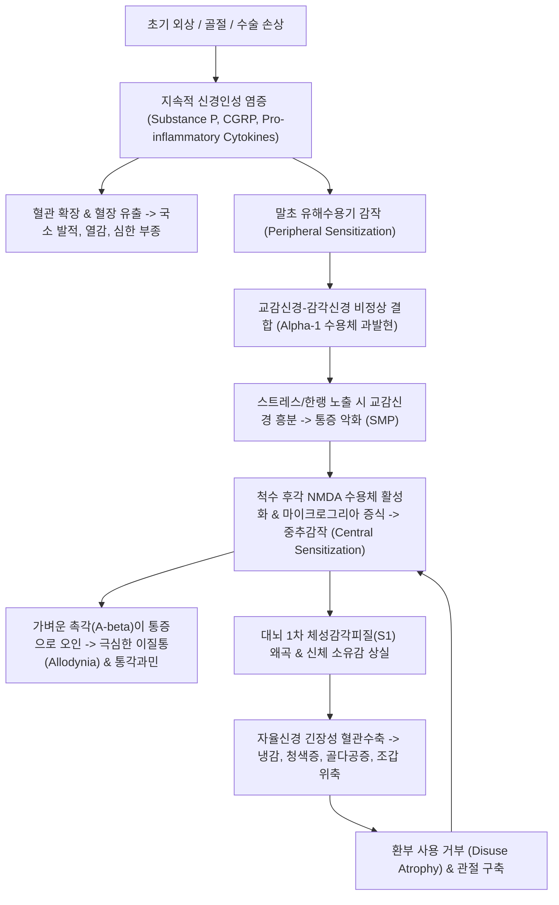

---
aliases:
  - 복합부위통증증후군
  - 복합 부위 통증 증후군
  - Complex Regional Pain Syndrome
  - CRPS
  - 반사성 교감신경성 이영양증
  - RSD
  - 작열통
  - Causalgia
  - 비증
  - 주통
  - G90.5
  - 복합부위통증 증후군
tags:
  - 이론
  - 질환
  - 신경계
title: 복합부위통증증후군
date: 2026-09-16
출처: "PMID: 20493633"
---

# 🩺 [[복합부위통증증후군]] (Complex Regional Pain Syndrome, CRPS / 複合部位痛症症候群, G90.5)

> **핵심 3줄 요약 (Key Summary)**:
> - 📍 병소 부위 & 해부·병태생리: 외상·수술·골절 후 사지 말단에 불비례적으로 발생하는 만성 신경병증성 통증 증후군으로, 지속적 신경인성 염증(CGRP, Substance P 폭발), 교감신경-감각신경 이상 커플링, 척수 후각 및 대뇌 체성감각피질의 병리적 중추감작(Central sensitization).
> - 🚩 전형적 임상 양상 & 3대 징후: 가벼운 옷깃이나 바람에도 극심한 통증을 느끼는 이질통(Allodynia), 비대칭적 피부 체온·색조 변화(DITI 소견), 환부의 심한 부종·발한 이상 및 피하·조갑·골질의 이영양성 위축(Trophic changes).
> - 🛠️ 핵심 감별 검사 & 한·양방 다각적 치료 전략: IASP Budapest 임상 진단 기준 및 적외선 체열진단(DITI), 원위 취혈 및 비침습 감각 재훈련, 교감신경 긴장 완화 전침 요법, 온경통락 [[당귀사역탕]] 및 활혈거어 신통축어탕, 양방 가바펜티노이드([[프레가발린]])·케타민·성상신경절차단술(SGB)·척수자극술(SCS).
> - ⚠️ 응급 의뢰 레드플래그 & 악화 요인: 극심한 난치성 통증으로 인한 자살 위기(Suicide risk), 심부정맥혈전증(DVT) 및 급성 구획증후군 감별, 통증 공포로 인한 절대적 부동화(Immobilization) 방지 및 조기 다학제 중재.

---

## 📌 목차
1. [질환 개요 & 해부학적 병태생리](#1-질환-개요--해부학적-병태생리)
2. [병태생리 메커니즘 & 생체역학적 악순환 네트워크](#2-병태생리-메커니즘--생체역학적-악순환-네트워크)
3. [임상 증상 & 이학적 검사(Physical Exam) 알고리즘](#3-임상-증상--이학적-검사physical-exam-알고리즘)
4. [감별 진단 매트릭스 (Differential Diagnosis)](#4-감별-진단-매트릭스-differential-diagnosis)
5. [한의 통합 치료 프로토콜 (침·약침·추나·한약)](#5-한의-통합-치료-프로토콜-침약침추나한약)
6. [재활 운동 & 생활습관 티칭 가이드](#6-재활-운동--생활습관-티칭-가이드)
7. [💡 사용자 진료실 핵심 필기 & 임상 노하우 (Melt-In 잔여 심화 집약)](#7--사용자-진료실-핵심-필기--임상-노하우-melt-in-잔여-심화-집약)
8. [출처 및 학술 참고 문헌 (References)](#8-출처-및-학술-참고-문헌-references)

---

## 1. 질환 개요 & 해부학적 병태생리

![[CRPS_right_leg_edema_erythema.jpg|450]]
> [그림 1: 수술 및 외상 후 우측 하지에 발생한 복합부위통증증후군(CRPS) 환자의 임상 실사. 정상측인 좌측 하지와 비교하여 심한 미만성 부종, 적자색 홍반, 피부 표면의 번들거림(광택), 체모 탈락 및 이영양성 변화가 명확히 관찰됨]

* **질환 정의 및 분류**:
  * 신체 말단(손, 발, 사지)의 외상, 골절, 염좌 또는 수술 후에 발생하며, 초기 유발 손상의 정도와 비례하지 않는 극심하고 지속적인 통증과 자율신경계 기능 이상, 운동 장애, 영양성 변화가 복합적으로 나타나는 희귀 난치성 질환입니다.
  * **CRPS Type I (과거명: 반사성 교감신경성 이영양증, RSD)**: 명백한 주요 단일 신경 손상의 증거가 없는 경우 (전체의 약 90%).
  * **CRPS Type II (과거명: 작열통, Causalgia)**: 특정 주요 말초신경(좌골신경, 정중신경 등)의 직접적 손상이 확인되는 경우.
* **관련 해부학적 구조물**:
  * **말초 감각신경계**: C-무수초 통각 섬유 및 A-$\delta$ 섬유. 손상 부위에서 지속적인 역방향 축삭 반사(Antidromic axon reflex)로 신경펩타이드를 분비합니다.
  * **자율신경계 (교감신경계)**: 척추 주변 교감신경절(흉부 성상신경절, 요부 교감신경절). 정상적으로는 감각신경과 분리되어 있으나, 병리적 상태에서는 교감신경 말단의 아드레날린 수용체가 감각 C섬유에 과발현되어 교감신경 흥분이 직접적인 통증을 유발하는 **교감신경 매개 통증(Sympathetically Maintained Pain, SMP)**이 발생합니다.
  * **중추신경계 (척수 후각 & 대뇌)**: 척수 후각의 광역 역치 신경원(WDR neuron)과 대뇌 1차 체성감각피질(S1). 통증 유입 지속 시 S1 피질 내 환부 표상 영역이 축소·왜곡되는 대뇌 가소성 붕괴가 일어납니다.

---

## 2. 병태생리 메커니즘 & 생체역학적 악순환 네트워크

![[Hyperalgesia_and_Allodynia_mechanisms.png|450]]
> [그림 2: 정상 상태와 조직/신경 손상 후의 통증 자극-반응 역치 곡선 대비 도해. 정상적인 통각 역치 이하의 비유해성 자극에 통증을 느끼는 이질통(Allodynia, 회색 영역)과 정상적 통증 자극에 극대화된 통증을 느끼는 통각과민(Hyperalgesia)으로의 역치 좌측 이동 메커니즘]

### 1) 3단계 핵심 병태생리 축
* **지속적 신경인성 염증 (Persistent Neurogenic Inflammation)**:
  * 외상 부위 C섬유에서 Substance P, 칼시토닌 유전자 관련 펩타이드(CGRP), 뉴로키닌 A가 지속적으로 대량 유리되어 강력한 혈관 확장과 부종을 유발합니다.
  * 국소 대식세포와 비만세포를 자극하여 TNF-$\alpha$, IL-1$\beta$, IL-6가 폭발적으로 증가합니다.
* **자율신경계 기능 이상 및 교감신경-구심성 커플링 (Sympathetic-Afferent Coupling)**:
  * 손상된 일차 감각신경 세포막에 $\alpha_1$-아드레날린 수용체가 병리적으로 과발현됩니다.
  * 그 결과 교감신경에서 방출되는 노르에피네프린이 통각 섬유를 직접 자극하여, 환자가 불안하거나 추위에 노출되어 교감신경이 항진될 때마다 극심한 작열통이 악화됩니다.
* **중추신경계 감작 (Central Sensitization) 및 뇌 피질 재구성**:
  * 척수 후각의 NMDA 수용체 인산화 및 미세아교세포(Microglia) 활성화로 인해 유해 자극의 중추 전도가 극대화됩니다.
  * 비유해성 접촉 자극을 전달하는 A-$\beta$ 촉각 섬유가 척수 내에서 통각 전달 경로를 활성화시켜 **이질통(Allodynia)**을 유발합니다.
  * 대뇌 기능성 MRI(fMRI) 상 환측 신체를 담당하는 일차 체성감각피질(S1) 영역이 위축되고 경계가 흐려져, 환자는 환측 사지를 '내 몸이 아닌 이물질'처럼 느끼는 인지 왜곡을 겪습니다.

---

## 3. 임상 증상 & 이학적 검사(Physical Exam) 알고리즘

![[CRPS_thermography_DITI_temperature_asymmetry.jpg|350]]
> [그림 3: 좌측 족부 CRPS 환자의 적외선 체열진단(DITI) 영상. 정상적인 우측 족부(적색/황색, 34°C 근처)에 비해 좌측 발목 및 발가락 부위가 심각한 혈관수축으로 인해 청자색(22~24°C, 체온 차이 >2.0°C)으로 현저히 떨어져 있는 자율신경실조 소견]

### 1) Budapest 진단 기준 (IASP 부다페스트 임상 기준)
CRPS 진단은 원인 질환 없이 다음 **4가지 범주 중 3가지 이상의 증상(환자 진술)**과 **2가지 이상의 징후(의사 검진)**를 동시에 만족해야 합니다:

| 평가 범주 | 주관적 증상 (Symptoms) | 객관적 신체 징후 (Signs) |
| :--- | :--- | :--- |
| **1. 감각 이상 (Sensory)** | 통각과민(Hyperalgesia) 또는 이질통(Allodynia) 호소 | 솜깃/브러시 접촉 시 통증(이질통) 또는 핀프릭 과민 반응 |
| **2. 혈관운동 이상 (Vasomotor)** | 피부 체온 비대칭(뜨거움/차가움) 또는 피부색 변화 | 건측 대비 $\ge 1^\circ\text{C}$ 이상의 체온 차이(DITI) 또는 색조 비대칭 |
| **3. 발한 / 부종 (Sudomotor / Edema)** | 환부의 심한 부종 또는 과도한 땀/건조감 보고 | 환부의 함요 부종(Pitting edema) 또는 땀 분비의 좌우 비대칭 |
| **4. 운동 / 영양 변화 (Motor / Trophic)** | 관절 가동범위 제한, 근력 저하, 떨림, 조갑/모발 변화 | 능동 ROM 저하, 진전/근긴장이상, 조갑 비후/취약, 골다공증 |

### 2) 이학적 검사 방법
* **동적 기계적 이질통 검사 (Dynamic Mechanical Allodynia)**: 탈지면이나 부드러운 브러시로 피부를 가볍게 스칠 때 환자가 비명을 지르며 팔/다리를 피하는 도피 반사(Withdrawal reflex) 확인.
* **적외선 체열진단 (DITI)**: 좌우 대칭 부위 체온을 측정하여 $1.0^\circ\text{C}$ 이상의 유의미한 비대칭 확인. 초기 급성기(Warm phase, 환측 고온) $\rightarrow$ 만성기(Cold phase, 환측 저온)로 이행.

---

## 4. 감별 진단 매트릭스 (Differential Diagnosis)

| 감별 질환 | 호발 원인 및 병태생리 | 주소증 및 임상 양상 | 감별 진단 핵심 포인트 |
| :--- | :--- | :--- | :--- |
| [[복합부위통증증후군]] (본 질환) | 외상 후 신경인성 염증 + 교감신경 이상 | 극심한 작열통, 이질통, 체온/색조 비대칭 | Budapest 기준 충족, DITI 체온 비대칭, 깃털 이질통 |
| [[말초신경병증]] (당뇨병성 등) | 대사성 신경 축삭 손상 | 양측 대칭성 장갑-양말형 저림, 감각 저하 | 대칭성 발현, 자율신경 영양 변화 적음, 당뇨 병력 |
| [[심부정맥혈전증]] (DVT) | 정맥 혈류 정체 및 혈전 형성 | 급성 하지 종창, 보행 시 장딴지 통증 | Homans sign 양성, D-dimer 상승, 혈관 초음파 혈전 |
| [[봉와직염]] (Cellulitis) | 피하 연조직 세균 감염 | 국소 발적, 열감, 압통, 림프절염 | 백혈구/CRP 상승, 항생제 반응 양호, 이질통 없음 |
| 전환장애 / 신체증상장애 | 심리적 갈등의 신체화 | 비해부학적 마비 또는 감각 소실 | 객관적 자율신경 징후(DITI 비대칭, 조갑 변화) 결여 |

---

## 5. 한의 통합 치료 프로토콜 (침·약침·추나·한약)

CRPS 환자는 침습적 자극에 대해 과민 반응(Wind-up)을 일으킬 수 있으므로, **환부 직접 자침을 피하고 건측(반대측) 및 원위부 경혈을 활용하는 분구 취혈 원칙**이 필수적입니다.

### 1) 침구 치료 (Acupuncture)
* **건측(반대측) 대응점 자침 요법**:
  * 환측이 우측 족부인 경우, 환부를 건드리지 않고 건측 좌측 수부나 족부의 상응 경혈(예: 환측 구허-건측 양계, 환측 족삼리-건측 곡지)에 자침.
  * 뇌의 체성감각피질을 간접 활성화하여 중추 감작을 완화(Cross-inhibition).
* **교감신경 조절 전침 요법**:
  * 배수혈(유효 척추 분절 협척혈): 경추 협척혈(C4-C7) 또는 요추 협척혈(L1-L3)에 2Hz 저주파 전침 적용.
  * 교감신경 절전/절후 섬유 흥분을 억제하고 혈류 확장을 유도.
* **자율신경 안정 요혈**:
  * 백회(GV20), 인당(EX-HN3), 신문(HT7), 내관(PC6) — 만성 통증으로 인한 뇌 변연계(Limbic system)의 과각성 억제.

### 2) 약침 치료 (Pharmacopuncture)
* **자하거(인태반) 약침**: 신경 영양 인자(NGF, BDNF) 합성을 유도하고 미세신경 혈류를 개선하기 위해 척추 협척혈 및 관절 원위부에 0.2~0.5cc 주입.
* **황련해독탕 / 중성어혈 약침**: 급성기 국소 열감과 부종이 심한 온난형(Warm CRPS) 환자에게 신경근 분절 및 림프 순환로 주변에 미량 피내 주입.

### 3) 한약 치료 (Herbal Medicine)
한의학적으로 CRPS는 풍한습(風寒濕)의 침범과 심각한 **어혈저체(瘀血沮滯)** 및 **기혈어체(氣血瘀滯)**로 인한 골비(骨痺)·주통(走痛)의 범주입니다:
* **만성 한냉형 (환측이 얼음장처럼 차고 푸르스름하며 시린 통증)**:
  * [[당귀사역탕]] (當歸四逆湯) 또는 당귀사역가오수유생강탕: 온경통락(溫經通絡)하여 말초 혈관 연축을 해소하고 체온을 복원.
* **어혈 정체형 (극심한 찌르는 작열통, 흑자색 피부, 야간 악화)**:
  * 신통축어탕(身痛逐瘀湯) 또는 계지복령환 가 홍화·단삼: 미세혈관 내 미세혈전을 용해하고 혈행을 정상화.
* **기허혈어형 (만성 쇠약, 근위축, 전신 무력)**:
  * 보양환오탕(補陽還五湯): 대용량 황기로 기운을 북돋우고 사지 말초로 혈류를 밀어내어 신경 회복 촉진.

---

## 6. 재활 운동 & 생활습관 티칭 가이드

* **점진적 탈감작 요법 (Graded Desensitization)**:
  * 환자가 견딜 수 있는 가장 부드러운 질감(실크, 깃털)부터 시작하여 환부 피부를 하루 수회 5분씩 가볍게 접촉시킵니다.
  * 점차 부드러운 수건, 일반 면, 약간 거친 천 순서로 질감을 높여 뇌가 촉각 신호를 통증으로 오인하지 않도록 훈련합니다.
* **거울 치료 (Mirror Therapy / Graded Motor Imagery, GMI)**:
  * 상자 사이에 거울을 두고 건측 사지를 비추면서 건측을 움직이게 하여, 뇌가 환측 사지가 통증 없이 정상적으로 움직이고 있다는 시각적 피드백(Visual feedback)을 받도록 유도합니다. 뇌 피질 왜곡을 복원하는 최상급 비약물 요법입니다.
* **절대 부동화 금지 (Gentle Weight-bearing)**:
  * 아프다고 기브스를 하거나 전혀 디디지 않으면 골다공증과 관절 구축이 급속히 악화되므로, 수중 운동이나 지지대 체중 부하를 조기에 시작해야 합니다.

---

## 7. 💡 사용자 진료실 핵심 필기 & 임상 노하우 (Melt-In 잔여 심화 집약)

* **CRPS 환자 대면 시 절대 금기 3원칙**:
  * 1) **환부를 동의 없이 덥석 잡거나 만지지 말 것**: 솜털만 스쳐도 10/10의 쇼크성 고통을 느끼므로 진찰 전 반드시 "살짝 닿아도 될까요?" 묻고 시각적으로 확인시켜 주어야 합니다.
  * 2) **환측에 무리한 강자극(강한 침, 부항, 강한 추나) 절대 금지**: 환부에 직접적인 침습적 자극을 주면 염증 폭풍(Wind-up)을 일으켜 환자가 며칠간 실신할 정도로 악화될 수 있습니다.
  * 3) **"꾀병" 취급 절대 금지**: X-ray나 MRI상 뼈가 다 붙었다고 해서 이상이 없다고 하면 안 됩니다. CRPS는 통증 시스템 자체의 중추성 회로 고장입니다.
* **거울 치료 실전 적용 팁**:
  * 진료실에서 거울 치료 박스를 적극 활용합니다. 건측 손가락을 쥐었다 폈다 하는 동작을 거울을 통해 10분간 바라보게 하는 것만으로도, 진료실을 나설 때 환측의 뻣뻣함과 작열통이 20~30% 즉각 경감되는 극적인 경험을 자주 관찰할 수 있습니다.
* **양방 중재 연계 타이밍**:
  * 초기 3~6개월 내에 호전되지 않고 체온 비대칭과 부종이 심화될 경우, 마취통증의학과에 의뢰하여 **성상신경절 차단술(SGB)** 또는 요부 교감신경 차단술을 병행하도록 권고하는 것이 만성 영구 장애로 넘어가는 것을 막는 최선책입니다.

---

## 8. 출처 및 학술 참고 문헌 (References)

* Harden RN, Bruehl S, Perez RS, et al. Validation of proposed diagnostic criteria (the "Budapest Criteria") for Complex Regional Pain Syndrome. *Pain*. 2010;150(2):268-274. [PMID: 20493633](https://pubmed.ncbi.nlm.nih.gov/20493633/)
  - `[연구 요약]`: 국제통증연구학회(IASP)의 CRPS 부다페스트 진단 기준의 민감도(0.99)와 특이도(0.68)를 대규모 다기관 임상 연구를 통해 검증하고 현대 표준 진단 체계를 확립한 핵심 논문.
* Marinus J, Moseley GL, Birklein F, et al. Clinical features and pathophysiology of complex regional pain syndrome. *Lancet Neurol*. 2011;10(7):637-648. [PMID: 21683930](https://pubmed.ncbi.nlm.nih.gov/21683930/)
  - `[연구 요약]`: CRPS의 3대 병태생리 축인 지속적 신경인성 염증, 자율신경 기능부전, 중추신경계 감작 및 대뇌 체성감각피질 가소성 왜곡을 종합 규명한 권위 있는 종설.
* Korpan MI, Dezu Y, Schneider B, Leitha T, Fialka-Moser V. Acupuncture in the treatment of posttraumatic pain syndrome. *Acta Orthop Belg*. 1999;65(2):197-201. [PMID: 10487440](https://pubmed.ncbi.nlm.nih.gov/10487440/)
  - `[연구 요약]`: 외상 후 복합부위통증증후군(CRPS/RSD) 환자에서 침 치료가 교감신경 과흥분을 억제하고 혈류를 개선하여 통증 점수 및 부종을 유의미하게 감소시킴을 입증한 임상 연구.

<!-- 보관 태그(1회용·링크오류, 필요시 복원): 만성난치성통증, 자율신경실조, G90.5 -->
