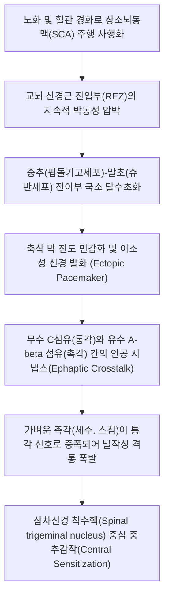

# 삼차신경통 (Trigeminal Neuralgia)

> **핵심 3줄 요약 (Key Summary)**:
> 🎯 제5뇌신경인 [[삼차신경]](CN V)의 감각 지배 영역을 따라 칼로 찌르거나 전기가 통하는 듯한 극심한 발작성 통증(Tic douloureux)이 수초에서 2분간 지속되는 대표적 신경병증성 질환.
> 🚩 후두와에서 상소뇌동맥(SCA) 등 비정상적 혈관 고리가 뇌간 신경근 진입부(REZ)를 압박하여 발생하는 축삭 탈수초화(Demyelination) 및 이소성 신경 발화(Ectopic pacemaker)가 핵심 병태생리.
> 🔬 1차 선택 약제는 [[카바마제핀]](Carbamazepine) 및 [[옥스카바제핀]]이며, 한의학에서는 면통(面痛)으로 보아 [[갈근해기탕]], [[청상견통탕]], [[당귀수산]] 및 찬죽·사백·하관·협거 전침·봉약침 병행.
> ⚠️ 세수, 양치, 식사, 찬 바람 등 가벼운 기계적 자극에 의해 촉발(Trigger zone)되며, 치통으로 오인하여 불필요한 발치나 신경치료를 받는 오진 사례가 흔하므로 주의 필요.

---

## 1. 개요 및 역학 (Overview & Epidemiology)

삼차신경통(Trigeminal Neuralgia, TN)은 얼굴 부위 감각을 담당하는 제5뇌신경(Cranial Nerve V)의 하나 이상의 분지 영역에서 발생하는 극심한 발작성 편측 안면 통증 증후군입니다. 

통증의 강도가 인간이 겪을 수 있는 가장 극심한 고통 중 하나로 꼽히며, 통증 발작 시 환자가 얼굴을 심하게 찡그리는 모습에서 유래하여 역사적으로 **'유통성 틱(Tic douloureux)'**으로 불려왔습니다.

![[삼차신경통_얼굴_신경분지_통증도해.png|450]]
> [삼차신경통의 신경 분지 주행 및 안면 방사 도해: 뇌간 삼차신경절에서 뻗어 나오는 V1(안신경), V2(상악신경), V3(하악신경) 분지와 안면 골격 주행선]

### 1) 역학적 특성
* **호발 연령**: 50세 이상 중장년층에서 호발하며, 60~70대에 유병률이 정점에 달합니다. 40세 미만의 젊은 층에서 발생할 경우 [[다발성 경화증]](Multiple Sclerosis)이나 소뇌교각부 종양 등 속발성(Secondary) 원인을 강력히 의심해야 합니다.
* **성별 차이**: 여성 대 남성의 비율이 약 1.5~2:1로 여성에서 유의하게 높습니다.
* **발생 부위**: 편측성(Unilateral)이 95% 이상으로 절대 다수이며, 우측 안면이 좌측보다 빈발합니다. 분지별로는 V2(상악신경) 단독, V3(하악신경) 단독, 또는 V2+V3 복합 침범이 가장 흔하며, V1(안신경) 단독 침범은 5% 미만으로 드뭅니다.

---

## 2. 병태생리 및 해부학 (Pathophysiology & Anatomy)

삼차신경통의 80~90%는 고전적(Classical) 삼차신경통으로, **뇌간 신경근 진입부(Root Entry Zone, REZ)**에서의 신경혈관 갈등(Neurovascular conflict)에 기인합니다.

![[삼차신경_미세혈관압박_신경혈관갈등.jpg|450]]
> [삼차신경 미세혈관 감압술(MVD) 수술 시 현미경 소견: 교뇌 진입부(REZ)에서 상소뇌동맥(SCA) 분지가 삼차신경 감각근을 직접 압박하며 박동성 손상을 가하는 신경혈관 갈등 실물]

### 1) 신경근 진입부(REZ)의 취약성
삼차신경이 교뇌(Pons)에서 기저조로 빠져나오는 첫 수 밀리미터 부위는 신경을 싸는 수초가 중추성 미엘린(Oligodendrocyte)에서 말초성 미엘린(Schwann cell)으로 바뀌는 전이 영역(Transition zone)입니다. 이 부위는 결합조직 피막이 얇아 박동성 기계 압박에 매우 취약합니다.

### 2) 축삭 탈수초와 에팝틱 크로스토크 (Ephaptic Transmission)
압박에 의해 수초가 벗겨진 축삭들은 절연 상태를 상실합니다. 가벼운 접촉이나 바람을 감지하는 굵은 유수 A-$\beta$ 촉각 섬유와 날카로운 통증을 전달하는 A-$\delta$ 및 C 통각 섬유가 인접하여 마주치면서, 정상적인 시냅스 없이 축삭 막 사이로 전하가 직접 건너뛰는 **에팝틱 전달(Ephaptic crosstalk)**이 일어납니다. 이로 인해 살짝 만지는 가벼운 무해 자극(Allodynia)이 마치 벼락 맞은 듯한 격심한 전기 쇼크성 통증으로 증폭 투사됩니다.

---

## 3. 해부학적 3대 분지와 유발대 (Anatomical Branches & Trigger Zones)

삼차신경은 세 갈래의 굵은 분지로 나뉘어 안면 감각을 담당합니다.

![[삼차신경_3대분지_해부도.png|500]]
> [삼차신경(CN V) 3대 분지 해부도: 반월신경절(Semilunar ganglion)에서 갈라지는 1. 안신경(V1, 상안와신경), 2. 상악신경(V2, 안와하신경, 상치조신경), 3. 하악신경(V3, 하치조신경, 설신경, 이신경) 및 저작근 주행]

### 1) 3대 분지의 신경 해부 및 통증 구역
1. **안신경 (V1, Ophthalmic nerve)**:
   * 상안와열(Superior orbital fissure)을 통과.
   * 이마, 두피 전반부, 상안검, 안구, 콧등 감각 지배.
   * 안와상공(Supraorbital notch)에서 안와상신경으로 체표 분기 (침구 혈위: 찬죽, 어요).
2. **상악신경 (V2, Maxillary nerve)**:
   * 정원공(Foramen rotundum)을 통과.
   * 하안검, 뺨, 비익(콧망울), 상순(윗입술), 상악 치아 및 치은, 구개 점막 지배.
   * 안와하공(Infraorbital foramen)에서 안와하신경으로 체표 분기 (침구 혈위: 사백, 거료).
3. **하악신경 (V3, Mandibular nerve)**:
   * 난원공(Foramen ovale)을 통과.
   * 하순(아랫입술), 턱, 하악 치아 및 잇몸, 혀 전방 2/3 감각 지배 + 저작근([[교근]], [[측두근]], [[내익상근]], [[외익상근]]) 운동 지배.
   * 이공(Mental foramen)에서 이신경으로 체표 분기 (침구 혈위: 승읍, 대영, 하관, 협거).

### 2) 유발대 (Trigger Zones)
안면 피부나 구강 점막의 특정 지점에 가벼운 접촉, 진동, 기계적 자극이 가해지는 즉시 통증이 발작적으로 격발되는 스위치 구역입니다:
* 비익(콧망울 옆), 구각(입꼬리), 윗입술, 아랫입술, 잇몸 점막, 턱 끝 등.
* 세수, 양치, 면도, 식사, 대화, 바람 불기, 립스틱 바르기 등의 행위가 직접적인 발작 유발인자로 작용합니다.

---

## 4. 진단 및 감별 진단 (Diagnosis & Differential Diagnosis)

국제두통질환분류(ICHD-3) 진단 기준을 표준으로 적용합니다.

### 1) ICHD-3 고전적 삼차신경통 진단 기준
1. 삼차신경 1개 이상의 분지 영역에 국한되며 정중선을 넘지 않는 편측성 안면 통증 발작이 최소 3회 이상 발생.
2. 통증의 특성이 다음 3가지를 모두 충족:
   * 수초에서 최대 2분간 지속되는 반복적인 발작성 통증.
   * 전기가 통하듯 찌릿찌릿함, 찌름, 찢어짐, 타는 듯함, 날카로움 등의 격렬한 통증 강도.
   * 비유해성 기계적 자극(스침, 식사, 대화 등)에 의해 유발대에서 격발.
3. 통증 발작 사이에 객관적인 신경학적 결손(감각 저하 등)이 없음.
4. MRI 등의 정밀 검사에서 원인이 되는 신경혈관 갈등이 입증되거나, 다른 질환으로 설명되지 않음.

### 2) 주요 안면 통증 질환 감별 진단 (Differential Diagnosis)

| 질환명 | 통증 양상 및 지속 시간 | 유발 요인 | 수반 증상 및 특징 | 핵심 감별점 |
| :--- | :--- | :--- | :--- | :--- |
| [[삼차신경통]] | 벼락치듯 전기가 통하는 격통 (수초~2분) | 세수, 양치, 접촉, 음식 저작 | 불응기(Refractory period) 존재, 감각 저하 없음 | [[카바마제핀]] 특이적 반응 |
| 치수염 / 치통 | 지속적인 욱신거림 및 박동통 | 온수, 냉수 섭취, 저작 압력 | 치아 타진통, 치은 종창, 야간통 악화 | 방사선 치과 X-ray 병소 확인 |
| [[대상포진후신경통]] | 지속적인 작열통 및 칼로 베는 통증 | 의류 접촉, 옷깃 스침 | 선행 수포성 피진 병력, 피부 감각 둔마 | V1 안분지 침범 흔함, 피진 흔적 |
| 악관절 장애 (TMD) | 둔탁한 뻐근함, 입 벌릴 때 악화 | 개구, 저작, 턱 좌우 이동 | 턱관절 마찰음(Clicking), 개구 제한 | [[교근]], [[외익상근]] 압통 |
| 군발두통 | 안와 및 측두부 극심한 굴착통 (15~180분) | 수면 중(새벽), 음주 | 결막충혈, 눈물, 콧물 등 자율신경 징후 | 부교감신경 항진 자율신경 징후 |

---

## 5. 양방 치료 및 약리 (Pharmacotherapy & Surgery)

삼차신경통의 1차 치료는 항경련제 약물 치료이며, 약물 불응 시 수술적 치료를 시행합니다.

### 1) 1차 선택 약물 치료 (First-line Pharmacotherapy)
* **[[카바마제핀]] (Carbamazepine, 테그레톨)**:
  * 전압의존성 나트륨 통로(Voltage-gated $Na^+$ channel)를 차단하여 탈수초된 신경 축삭의 고주파 이소성 발화를 억제.
  * 초기 1일 100~200mg으로 시작하여 2~3일 간격으로 200mg씩 증량, 유지 용량 600~1,200mg/day.
  * 환자의 70~80%에서 초기 통증이 극적으로 소실되므로 역으로 '진단적 가치'를 지님.
  * **부작용 및 모니터링**: 졸림, 운동실조, 어지럼증, 저나트륨혈증(SIADH), 백혈구 감소증, 간기능 이상, 드물지만 치명적인 스티븐스-존슨 증후군(SJS).
* **[[옥스카바제핀]] (Oxcarbazepine, 트리렙탈)**:
  * 카바마제핀의 프로드러그 형태로 간 대사 유도 작용 및 이상반응 빈도가 낮아 순응도가 높음 (1일 600~1,800mg).

### 2) 2차 보조 약물
* [[가바펜틴]](Gabapentin), [[프레가발린]](Pregabalin), [[바클로펜]](Baclofen, GABA-B 작용제), 라모트리진(Lamotrigine).

### 3) 수술적 및 중재적 치료 (Interventions & Surgery)
* **미세혈관 감압술 (Microvascular Decompression, MVD, 재네타 수술)**:
  * 후두하 개두술을 통해 상소뇌동맥과 삼차신경근 사이에 테플론(Teflon) 펠트를 삽입하여 신경혈관 박동성 압박을 물리적으로 영구 분리. 80~90%의 장기 완치율을 보이는 유일한 원인적 수술.
* **경피적 고주파 열응고술 (RFTC) / 감마나이프 방사선 수술 (GKRS)**:
  * 고령, 전신마취 고위험군, 개두술 거부 환자에서 삼차신경절 또는 감각근을 부분 파괴하는 신경 파괴술.

---

## 6. 한의학적 변증 및 치료 (Traditional Korean Medicine)

한의학에서 삼차신경통은 **면통(面痛)**, **면풍통(面風痛)**, **편두통(偏頭痛)**의 범주에 속하며, 외감풍한(外感風寒)과 풍열(風熱), 간담화왕(肝膽火旺), 어혈저락(瘀血阻絡)으로 변증합니다.

### 1) 변증 분류 및 대표 처방 (Syndrome Differentiation)

| 변증 유형 | 주증 및 설맥 | 병태생리 기전 | 대표 방제 | 핵심 본초 |
| :--- | :--- | :--- | :--- | :--- |
| 풍한강체형 (風寒凝滯) | 찬바람 쐬면 발작, 온열 시 완화, 맥부긴 | 한사(寒邪)가 안면 경락을 수축·응체시킴 | [[갈근탕]] 합 [[오적산]] 가미 | [[갈근]], [[마황]], [[계지]], [[천궁]], [[백지]] |
| 간담화왕형 (肝膽火旺) | 스트레스 시 격발, 작열통, 안면홍조, 구고, 맥현삭 | 간화가 담경(膽經)과 위경(胃經)을 상충 | [[용담사간탕]] 합 [[청상견통탕]] | [[용담초]], [[황금]], [[치자]], [[강활]], [[방풍]] |
| 어혈저락형 (瘀血阻絡) | 야간 악화, 바늘로 찌르는 고정통, 설자암, 맥삽 | 안면 신경 미세 순환의 만성 어혈 폐색 | [[통규활혈탕]] 합 [[당귀수산]] | [[도인]], [[홍화]], [[천궁]], [[적작약]], [[소목]] |
| 기혈양허형 (氣血兩虛) | 만성 쇠약, 피로 시 악화, 은은한 통증 지속, 맥세약 | 신경근 영양 결손 및 허약성 과민 | [[황기계지오물탕]] 합 [[십전대보탕]] | [[황기]], [[당귀]], [[백작약]], [[인삼]], [[감초]] |

### 2) 침구 치료 혈위 및 신경 자극 수기법
* **분지별 신경공(Foramen) 국소 취혈**:
  * **V1 분지**: 찬죽(BL2), 양백(GB14), 어요(EX-HN4), 태양(EX-HN5) $\rightarrow$ 상안와신경 자극.
  * **V2 분지**: 사백(ST2), 거료(ST3), 관료(SI18), 영향(LI20) $\rightarrow$ 안와하신경 분지 자극.
  * **V3 분지**: 하관(ST7), 협거(ST6), 지창(ST4), 승읍(ST1), 예풍(TE17) $\rightarrow$ 하악신경 및 이신경 자극.
* **원위 및 거사(巨刺) 배혈**:
  * 합곡(LI4, 안면 질환의 요혈), 곡지(LI11), 태충(LR3, 사관혈 조절), 족삼리(ST36), 풍지(GB20).
* **전침(Electroacupuncture) 치료**: 하관-협거, 사백-지창에 2~100Hz 혼합파(Dense-Disperse wave)를 환자가 견딜 수 있는 역치 이하로 통전하여 통증 전달 C섬유 억제 및 엔도르핀 방출 유도.

### 3) 약침 요법 (Pharmacopuncture)
* **봉약침 (Sweet Bee Venom, BV)**: 멜리틴(Melittin)과 아파민(Apamin) 성분이 신경 염증 및 감작을 강력히 억제하므로, 하관, 사백, 찬죽 부위에 0.05~0.1cc 미량 피내 주입 (반드시 사전 피부 알레르기 테스트 필수).
* **중성어혈약침**: 어혈저락형의 지속적 자통에 하관 및 예풍, 경추 후관절낭 주위 0.2~0.5cc 자입.

---

## 7. 진료실 핵심 필기 및 실전 가이드 (Clinical Notes & Protocols)

### 1) 오진 방지: "절대 멀쩡한 치아를 뽑지 마세요"
* 삼차신경통 환자의 50% 이상이 초기에 윗니나 아랫니의 극심한 통증으로 치과를 먼저 방문합니다.
* 충치가 없거나 경미함에도 환자의 극심한 통증 호소에 의해 신경치료를 받거나 멀쩡한 어금니를 1~3개씩 발치하고도 통증이 전혀 줄지 않아 한의원에 내원하는 비극적 사례가 매우 흔합니다.
* **감별 공식**: 찬물이나 뜨거운 물을 물었을 때 치아가 시린지, 아니면 칫솔이 잇몸을 살짝 스칠 때 벼락 치듯 볼 전체로 통증이 뻗치는지 확인해야 합니다. 후자는 100% 삼차신경통입니다.

### 2) 카바마제핀(테그레톨) 테이퍼링 및 한의 병행 프로토콜
* 환자가 카바마제핀을 600~1,200mg 이상 고용량 복용하면서 멍함, 극심한 졸림, 인지 기능 저하, 보행 비틀거림, 소화불량을 겪는 경우가 대다수입니다.
* **주의**: 절대로 양약을 임의로 즉시 중단(Cold turkey)시키면 안 됩니다. 리바운드로 인한 참을 수 없는 발작성 통증 폭발(Status trigeminus)이 올 수 있습니다.
* 한의 침·전침·봉약침 및 [[청상견통탕]]/[[갈근탕]] 투여로 통증 발작 횟수가 주당 50% 이상 감소하는 안정기에 도달하면, 1~2주 간격으로 100mg씩 서서히 감량(Tapering)하도록 지도합니다.

### 3) 환자 일상생활 유발대 보호 티칭
* **온도 자극 차단**: 겨울철 찬 바람, 여름철 에어컨 바람이 얼굴에 직접 닿지 않도록 마스크와 목도리를 반드시 착용시킵니다.
* **세안 및 양치 요령**: 유발대가 입술이나 콧망울에 있는 경우, 손가락으로 문지르지 말고 미온수로 가볍게 헹구어 내며, 부드러운 미세모 칫솔을 사용하도록 지도합니다.
* **음식 섭취**: 통증이 유발되지 않는 반대편 치아로 씹게 하고, 씹기 힘든 날에는 죽이나 유동식으로 영양을 공급하여 탈수와 기력 쇠약을 방지합니다.

---

## 8. 참고문헌 및 최신 연구 (References)

* Cruccu G, Di Stefano G, Truini A. Trigeminal Neuralgia. *N Engl J Med*. 2020;383(8):754-762. doi:10.1056/NEJMra1914484. [PubMed (PMID: 32813951)](https://pubmed.ncbi.nlm.nih.gov/32813951/)
  > [연구 요약] 뉴잉글랜드 저널 오브 메디신(NEJM)에 발표된 삼차신경통 최고 권위 총설로 뇌간 신경근 진입부(REZ)의 신경혈관 압박 병태생리, MRI 진단 알고리즘, 카바마제핀 등 1차 약물 치료 및 미세혈관 감압술(MVD)의 적응증을 종합 정리함.
* Bendtsen L, Zakrzewska JM, Abbott J, et al. European Academy of Neurology guideline on trigeminal neuralgia. *Eur J Neurol*. 2019;26(6):831-845. doi:10.1111/ene.13950. [PubMed (PMID: 30860637)](https://pubmed.ncbi.nlm.nih.gov/30860637/)
  > [연구 요약] 유럽신경과학회(EAN)의 공식 가이드라인으로 삼차신경통의 분류(고전적, 속발성, 특발성), 약물 요법의 근거 수준, 혈관 감압술 및 신경 파괴술의 추천 등급을 명확히 규정함.
* Maarbjerg S, Di Stefano G, Bendtsen L, Cruccu G. Trigeminal neuralgia - diagnosis and treatment. *Cephalalgia*. 2017;37(7):648-657. doi:10.1177/0333102416687280. [PubMed (PMID: 28076964)](https://pubmed.ncbi.nlm.nih.gov/28076964/)
  > [연구 요약] 국제두통학회의 삼차신경통 진단 및 치료 프로토콜 논문으로 감별 진단 체크리스트, 통증 발작의 임상적 특성 및 장기 약물 관리 전략을 제시함.
* Wu M, Liang Y, Chen C, et al. Efficacy and safety of different acupuncture-related therapies for primary trigeminal neuralgia: a systematic review and network meta-analysis. *Front Pain Res (Lausanne)*. 2026;7:1290384. doi:10.3389/fpain.2026.1290384. [PubMed (PMID: 42524199)](https://pubmed.ncbi.nlm.nih.gov/42524199/)
  > [연구 요약] 원발성 삼차신경통에 대한 다양한 침 관련 중재법의 체계적 문헌고찰 및 네트워크 메타분석으로, 전침 및 약침 병용 요법이 양약 단독 투여군 대비 통증 점수(VAS) 감소 및 유효율 개선, 카바마제핀 복용량 감소에 유의미한 시너지 효과가 있음을 입증함.
