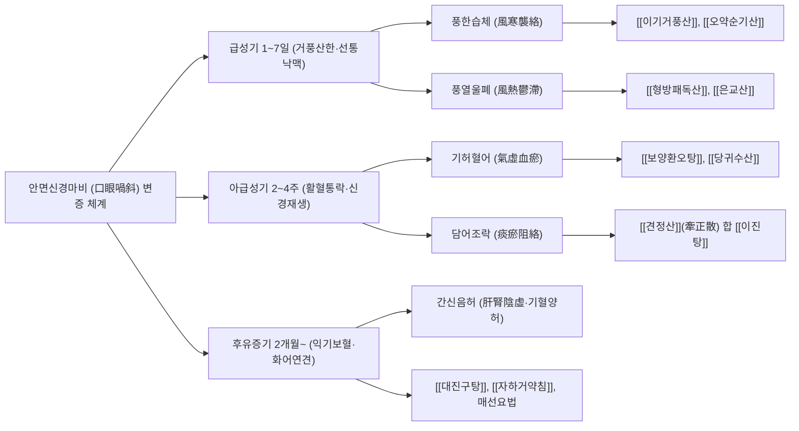

# 😶 안면신경마비 (Facial Nerve Palsy, 벨마비·구안와사)

> **핵심 요약 (Key Summary)**:
> - **정의**: 제7뇌신경인 [[안면신경]](Facial nerve)의 주행 경로상 염증성 부종, 압박 또는 허혈로 인해 동측 안면 표정근의 급인성 불완전 또는 완전 마비가 발생하는 대표적인 말초 신경병증 질환.
> - **주요 원인**: 단순포진바이러스(HSV-1)의 신경내 재활성화에 의한 특발성 **벨마비(Bell's palsy)**가 전체의 $70\sim80\%$를 차지하며, 수두대상포진바이러스(VZV)에 의한 **람세이 헌트 증후군(Ramsay Hunt syndrome)**이 $10\sim15\%$, 외상·종양·중이염이 나머지를 차지.
> - **진단 핵심**: **중추성(뇌졸중)과 말초성(벨마비)의 즉각 감별**이 절대적이며, **이마 주름 형성 불가(이마 근육 마비)** 및 **눈 감김 부전(토안, Lagophthalmos)**이 나타나면 말초성 안면신경마비로 확진. 중증도는 **하우스-브랙만 척도(House-Brackmann, H-B Grade I~VI)**로 평가.
> - **서양의학 치료**: 발병 72시간 이내의 조기 고용량 경구 코르티코스테로이드([[프레드니솔론]]) 10일 요법이 신경 손상 억제의 핵심이며, VZV 의심 또는 중증 마비 시 항바이러스제(발라시클로버/아시클로버)를 병용.
> - **한의학 치료**: 와사풍(喎斜風) 범주로 파악하여 급성기(1~7일) 풍사외습(風邪外襲)에 [[이기거풍산]], [[형방패독산]]을 투여하고, 아급성기(2~4주) 신경 재생기에 [[견정산]], [[보양환오탕]] 및 표정근 **저주파 전침(2 Hz)**을 적용하며, 만성 후유증기(연합운동, 악어의 눈물)에는 매선 요법과 안면근막 추나, 자하거 약침을 병행.

---

## 📌 목차
1. [개요 및 병태생리 (Pathophysiology & Classification)](#1-개요-및-병태생리-pathophysiology--classification)
2. [발생 기전 및 해부학적 연계 (Mechanism & Anatomical Link)](#2-발생-기전-및-해부학적-연계-mechanism--anatomical-link)
3. [진단 및 임상 평가 (Clinical Evaluation & Differential Diagnosis)](#3-진단-및-임상-평가-clinical-evaluation--differential-diagnosis)
4. [현대 의학적 치료 원칙 (Western Medical Management)](#4-현대-의학적-치료-원칙-western-medical-management)
5. [한의학적 변증 및 통합 치료 프로토콜 (TCM Pattern Identification & Integrative Protocol)](#5-한의학적-변증-및-통합-치료-프로토콜-tcm-pattern-identification--integrative-protocol)
6. [생활 관리 및 환자 교육 (Lifestyle & Patient Guidance)](#6-생활-관리-및-환자-교육-lifestyle--patient-guidance)
7. [진료실 임상 팁 & 노트 (Clinical Pearls & Practice Notes)](#7-진료실-임상-팁--노트-clinical-pearls--practice-notes)
8. [참고 문헌 (References)](#8-참고-문헌-references)

---

## 1. 개요 및 병태생리 (Pathophysiology & Classification)

안면신경마비는 인구 10만 명당 매년 약 20~30명에서 발생하는 흔한 신경계 응급 질환이다. 환자들은 거울을 보거나 양치질 중 갑작스러운 입꼬리 처짐과 물 샘, 한쪽 눈이 감기지 않는 증상을 목격하고 "중풍([[뇌졸중]])이 온 것이 아니냐"는 극심한 심리적 공포를 호소하며 내원한다.

![[안면신경마비_벨마비_환자_안면비대칭_임상소견.jpg|540]]
> [그림 1: ① 병태생리·영상 — 특발성 말초성 안면신경마비(벨마비) 환자의 우측 안면 비대칭 — 우측 이마 주름 형성 소실, 눈이 완전히 감기지 않는 토안(Lagophthalmos), 비순구 평탄화 및 입꼬리 처짐 실제 임상 소견 (Wikimedia Commons · James Heilman, MD, CC BY-SA 3.0)]

### 1) 중추성 안면마비 vs 말초성 안면마비의 감별 (CRITICAL)
진료실에 안면마비 환자가 내원했을 때 가장 먼저 시행해야 할 생명선 감별이다:

| 감별 포인트 | 중추성 안면마비 (Central Facial Palsy) | 말초성 안면마비 (Peripheral / Bell's Palsy) |
| :--- | :--- | :--- |
| **원인 병소** | 상부운동신경원(UMN) 손상: [[뇌졸중]](뇌경색/뇌출혈), 뇌종양 | 하부운동신경원(LMN) 손상: 안면신경핵 이하 신경간 염증·포착 |
| **이마 주름 잡기** | **정상 보존됨 (이마 주름을 양측 대칭으로 잡을 수 있음)** | **완전 불가능 (이환측 이마 주름이 완전히 펴지고 소실됨)** |
| **눈 감기 (토안)** | **양측 눈을 완전히 감을 수 있음** | **이환측 눈이 완전히 감기지 않음 (흰자위 노출, Bell 징후)** |
| **마비 범위** | 반대측 안면 하부(입꼬리, 비순구)에 국한된 마비 | **동측 안면 상·하부 표정근 전체의 완전 편측 마비** |
| **동반 신경 증상** | 동측 편마비(Hemiparesis), 감각 저하, 구음장애, 삼킴곤란 | 혀 앞 2/3 미각 소실, 청각과민, 눈물 분비 장애, 이개후부 통증 |

> **신경해부학적 기전**: 안면신경핵 중 **상부 안면(이마, 눈꺼풀)을 지배하는 신경세포는 양측 대뇌피질에서 이중 피질연수로(Corticobulbar tract) 지배**를 받는다. 따라서 편측 대뇌 반구에 뇌경색이 발생해도 반대측 정상 대뇌피질에서 신호를 전달하므로 이마 주름이 보존된다. 반면 말초 안면신경 손상은 핵하부에서 갈라진 신경 섬유 전체가 마비되므로 이마와 눈을 포함한 안면 전체가 마비된다.

---

## 2. 발생 기전 및 해부학적 연계 (Mechanism & Anatomical Link)

```
[안면신경마비의 골성 관 포착 및 분지별 신경 손상 캐스케이드]

               HSV-1 또는 VZV 바이러스 재활성화 (면역 저하, 한랭 노출, 스트레스)
                                       │
                                       ▼
                     안면신경 내막의 급성 염증 및 미세혈관 부종
                                       │
                                       ▼
       [측두골 안면신경관 (Fallopian Canal)의 좁은 미로 분절(Labyrinthine segment)]
         - 인체에서 가장 긴 골성 관 (골벽으로 둘러싸여 팽창 여유 공간 0%)
         - 부종 발생 시 신경내압 급상승 ──► 모세혈관 폐쇄 ──► 급성 허혈 및 신경전도 차단
                                       │
       ┌───────────────────────────────┼───────────────────────────────┐
       ▼                               ▼                               ▼
[슬신경절 상부 손상]            [등골신경 분지부 손상]          [고삭신경 분지부 손상]
대암양신경(GPN) 차단            등골근(Stapedius) 마비          고삭신경(Chorda tympani) 차단
눈물샘 분비 저하 (안구건조)      등골 뼈 과진동 유발             혀 앞쪽 2/3 미각 소실
악하선·설하선 타액 감소        저음성 난청 및 **청각과민**     타액 분비 장애
       │                               │                               │
       └───────────────────────────────┴───────────────────────────────┘
                                       │
                                       ▼
              [경유돌공(Stylomastoid foramen) 통과 후 5대 말초 분지 차단]
          • 측두지(Temporal): 전두근 마비 (이마 주름 불가)
          • 관골지(Zygomatic): 안륜근 마비 (눈 감김 부전, 토안, 벨 징후)
          • 협골지(Buccal): 협근·구륜근 마비 (음식물 끼임, 침 흘림)
          • 하악연지(Marginal mandibular): 구각하체근 마비 (입꼬리 비대칭)
          • 경지(Cervical): 광경근 마비 (목 피부 긴장 소실)
```

![[안면신경_경유돌공_이하선_표정근분지_해부도_Gray.png|540]]
> [그림 2: ② 해부 구조물 — 제7뇌신경 안면신경(CN VII)이 뇌간 뇌교에서 기원하여 측두골 내이도-안면신경관을 통과한 후, 경유돌공(Stylomastoid foramen)을 빠져나와 이하선총에서 측두·관골·협골·하악연·경부 5대 표정근 분지로 뻗어나가는 해부도 (Henry Gray, Anatomy of the Human Body, Public Domain)]

### 1) 안면신경관 미로 분절(Labyrinthine Segment)의 해부학적 병목
안면신경관(Fallopian canal)은 측두골 암양부(Petrous bone)를 통과하는 약 $30\text{ mm}$ 길이의 단단한 골성 관이다.
- 그중 **미로 분절(Labyrinthine segment)**은 내경이 평균 **$0.68\text{ mm}$로 관 전체 중 가장 좁은 병목 구간**이다.
- 바이러스 감염이나 허혈성 염증으로 안면신경 섬유가 부어오르면, 단단한 골벽에 의해 신경이 갇혀 신경내압이 모세혈관 관류압을 능가하게 된다.
- 이로 인해 신경 섬유의 급성 허혈성 신경차단(Neurapraxia)이 발생하며, 부종이 72시간 이상 지속되면 축삭 파열(Axonotmesis) 및 왈러 변성(Wallerian degeneration)으로 진행하여 비가역적인 영구 후유증을 남긴다.

### 2) 람세이 헌트 증후군 (Ramsay Hunt Syndrome, Herpes Zoster Oticus)
- 수두대상포진바이러스(VZV)가 안면신경의 감각 신경절인 **슬신경절(Geniculate ganglion)**에 잠복해 있다가 면역 저하 시 재활성화되어 발생한다.
- **3대 특징**:
  1. 심한 말초성 안면신경마비.
  2. 외이도, 귓바퀴(이개), 구개 부위의 통증성 수포성 발진.
  3. 전정와우신경(제8뇌신경) 동시 침범으로 인한 극심한 이통, 이명, 감각신경성 난청 및 회전성 어지럼증(현훈).
- 일반 벨마비에 비해 완전 회복률이 $50\%$ 미만으로 예후가 매우 불량하므로 즉각적인 고용량 정맥/경구 항바이러스제 투여가 필수적이다.

---

## 3. 진단 및 임상 평가 (Clinical Evaluation & Differential Diagnosis)

### 1) 하우스-브랙만 안면신경 평가 등급 (House-Brackmann Grading System)
전 세계적으로 가장 널리 통용되는 표준 임상 평가 도구이다:

| Grade | 등급 명칭 | 안정 시 외관 | 운동 시 이마 | 운동 시 눈 | 운동 시 입 |
| :---: | :--- | :--- | :--- | :--- | :--- |
| **I** | **정상 (Normal)** | 대칭 | 정상 | 정상 | 정상 |
| **II** | **경도 장애 (Mild)** | 안정 시 정상 대칭 | 약간의 운동 가능 | 최소한의 힘으로 완전 감김 | 약간의 비대칭, 미세 약화 |
| **III** | **중등도 (Moderate)** | 안정 시 정상 대칭 | 미약~중등도 운동 | 힘을 주면 완전히 감김 | 힘을 주면 뚜렷한 비대칭 |
| **IV** | **중등도-중증 (Mod-Severe)** | 안정 시 비대칭 (긴장도 저하) | **운동 전혀 불가** | **눈이 완전히 감기지 않음** | 힘을 주어도 움직임 극히 제한 |
| **V** | **중증 (Severe)** | 안정 시 심한 비대칭, 처짐 | 운동 전혀 불가 | 눈이 거의 감기지 않음 | 겨우 미세하게 움직임 |
| **VI** | **완전 마비 (Total)** | 완전한 마비 (Flaccid) | 운동 없음 | 눈 전혀 감기지 않음 | 운동 없음 |

### 2) 신경전도검사 및 전기생리학적 예후 평가
발병 후 $7\sim14$일 차에 시행하여 신경 변성 정도와 회복 가능성을 정량 평가한다:
- **신경흥분성검사(NET) 및 최대자극검사(MST)**: 건측과 환측의 최소 흥분 역치 차이가 $3.5\text{ mA}$ 이상이면 신경 변성 진행을 의미.
- **유발근전도검사 (ENoG: Electroneuronography)**:
  $$\text{변성률}(\%) = \left( 1 - \frac{\text{환측 복합근육활동전위(CMAP) 진폭}}{\text{건측 복합근육활동전위(CMAP) 진폭}} \right) \times 100$$
  - **변성률 $< 90\%$**: $80\sim90\%$ 이상의 환자가 후유증 없이 완전 회복 (양호).
  - **변성률 $\ge 90\%$**: 축삭 절단 손상으로 회복 기간이 수개월 이상 소요되며, 연합운동·안면 연축 등 영구 후유증 발생률이 급증 (불량).
- **근전도검사 (Needle EMG)**: 발병 2~3주 후 탈신경 전위(Fibrillation potential, Positive sharp wave) 유무를 확인하여 신경 손상 깊이를 판정.

---

## 4. 현대 의학적 치료 원칙 (Western Medical Management)

### 1) 경구 코르티코스테로이드 1차 치료 (골든타임 72시간)
미국이비인후과학회(AAO-HNS) 임상 진료 가이드라인에 따른 **최우선 표준 치료(Strong Recommendation)**이다.
- **투약 프로토콜**:
  - 발병 72시간 이내에 **[[프레드니솔론]](Prednisolone) $1\text{ mg/kg/일}$ (최대 $60\text{ mg/일}$)**을 5일간 투여한 후, 다음 5일간 점진적으로 감량(Tapering)하여 총 10일간 투약 완료.
- **임상적 근거**: 대규모 무작위 대조시험(Sullivan et al., NEJM 2007)에서 스테로이드 조기 투여군은 위약군 대비 3개월 및 9개월 차 완전 회복률을 유의하게 향상시켰다($83.0\%$ vs $63.6\%$, $P < .001$).
- **항바이러스제 병용**: 단순 벨마비에서 항바이러스제 단독 투여는 효과가 없으나, 중증 마비(H-B Grade IV 이상)나 람세이 헌트 증후군에서는 프레드니솔론과 발라시클로버($1,000\text{ mg}$ TID 7일) 병용이 권고된다.

### 2) 각막 보호 요법 (Corneal Protection Protocol)
눈이 감기지 않는 토안(Lagophthalmos) 상태가 지속되면 각막이 공기 중에 노출되어 건조성 각막염(Exposure keratitis), 각막 궤양 및 영구적 시력 손상이 발생할 수 있다:
- 낮 동안 무방부제 인공눈물(점안액)을 매 $1\sim2$시간마다 수시로 점안.
- 취침 전 고점도 안연고(Erythromycin 연고 등)를 충분히 도포하고, 의료용 종이 테이프로 눈꺼풀을 부드럽게 아래로 당겨 고정(Eye taping)하거나 안대 착용.

---

## 5. 한의학적 변증 및 통합 치료 프로토콜 (TCM Pattern Identification & Integrative Protocol)

한의학에서 안면신경마비는 **구안와사(口眼喎斜)**, **와사풍(喎斜風)**이라 부른다. 정기(正氣)가 허약한 틈을 타 풍한(風寒) 또는 풍열(風熱)의 사기가 낙맥(絡脈)에 침범하여 기혈 순환이 막히고 근육이 자양되지 못하여(기혈어체, 氣血瘀滯) 발생한다. 발병 시기별로 **급성기(염증 차단·부종 감소) $\rightarrow$ 아급성기(신경 재생·혈류 촉진) $\rightarrow$ 회복·후유증기(연합운동 방지·근막 재건)**의 3단계 치료 표준작업지침(SOP)을 확립하여 치료한다.

![[안면신경마비_침구치료_경혈자침_임상사진.jpg|540]]
> [그림 3: ③ 치료·시술점 — 안면신경마비 환자의 표정근 신경재생 촉진 및 안면 비대칭 교정을 위한 찬죽·양백·지창·협거 경혈 복합 자침 임상 사진 (Wikimedia Commons · Kyle Cassidy, CC BY-SA 3.0)]

### 1) 변증 분류 및 대표 처방



#### (1) 풍한습체 (風寒襲絡, 찬바람 노출형, 초기 다빈도)
- **증상**: 찬바람을 쐬거나 찬 바닥에서 잔 후 급격히 발병, 귀 뒤쪽 유양돌기 부위 통증(이후통, 耳後痛), 안면 감각 둔마, 안면 근육의 경직감, 오한, 설태 박백, 맥 부긴.
- **치법**: 소풍산한(疏風散寒), 온경통락(溫經通絡).
- **처방**: **[[이기거풍산]](理氣祛風散)** 또는 **[[오약순기산]](烏藥順氣散)**.
  - 백지·강활·방풍: 두면부 경락의 풍한 사기를 몰아내고 진통.
  - 당귀·천궁: 미세혈관을 확장하여 신경내 허혈을 개선.
  - 남성·반하: 경락에 정체된 습담을 삭이고 마비를 완화.

#### (2) 풍열울체 (風熱鬱滯, 람세이 헌트 및 염증 심화형)
- **증상**: 외이도 주변 수포, 찌르는 듯한 극심한 귀 뒤 통증, 구갈, 인후통, 눈의 충혈과 작열감, 발열, 설질 홍, 설태 박황, 맥 부삭.
- **치법**: 소풍청열(疏風淸熱), 해독통락(解毒通絡).
- **처방**: **[[형방패독산]](荊防敗毒散)** 또는 **[[은교산]](銀翹散)** 가 황금, 용담초.
  - 금은화·연교·황금: 바이러스성 염증 부종을 신속히 소퇴시키고 신경 손상 억제.

#### (3) 담어조락 및 기허혈어 (痰瘀阻絡·氣虛血瘀, 아급성기 표준형)
- **증상**: 발병 2주 경과 후에도 마비가 지속됨, 안면 근육 위축감, 말소리가 새고 음식이 뺨에 낌, 기운이 없고 피로함, 혀에 어반이 보임, 맥 세삽.
- **치법**: 익기활혈(益氣活血), 거풍화담(祛風化痰).
- **처방**: **[[견정산]](牽正散)** 합 **[[보양환오탕]](補陽還五湯)**.
  - **백강잠·전갈**: 안면 신경 및 표정근의 경련과 마비를 푸는 최고 요약.
  - 백부자: 풍담을 뚫고 올라가 안면 경락을 소통.
  - 황기·당귀·적작약·단삼: 손상된 신경 축삭의 재생을 촉진하는 대량의 혈류 공급.

### 2) 침구 치료 및 신경 재생 전침(Electroacupuncture) 프로토콜
- **안면 표정근 국소 배혈**:
  - 이마·눈 주위: **찬죽(BL2)**, **양백(GB14)**, **사죽공(TE23)**, **태양(EX-HN5)**, **동자료(GB1)**.
  - 코·입 주위: **영향(LI20)**, **지창(ST4)**, **협거(ST6)**, **하관(ST7)**, **인중(GV26)**, **승장(CV24)**.
  - 안면신경 본간 기시부: **예풍(TE17)** — 경유돌공 출구 바로 외측. 부드럽게 $0.8\sim1.0$촌 직자하여 신경간 부종을 감압.
- **원격 사지혈**: **합곡(LI4, 면구합곡수)**, **태충(LR3, 사관혈)**, **족삼리(ST36)**.
- **전침 치료 주의사항 및 SOP**:
  - **급성기(발병 1~7일)**: 신경 염증이 극에 달한 시기이므로 **강한 전침 자극을 절대 금지**하며, 단순 침 치료나 원격혈 위주로 자침한다.
  - **아급성기(2주 이후)**: 양백-찬죽(전두근·안륜근), 지창-협거(구륜근·협근)에 전침 전극을 연결하고, **저주파 $2\text{ Hz}$ 연속파**로 표정근이 미세하게 꿈틀거릴 정도의 저강도로 20분간 자극하여 근위축을 방지하고 축삭 재생을 유도한다. (고주파 $50\sim100\text{ Hz}$ 강자극은 비정상적 신경 발아를 촉진하여 연합운동을 유발하므로 금기).

### 3) 만성기 매선요법 및 안면근막 추나요법 (Myofascial Chuna)
- **매선요법(Polydioxanone Thread)**: 발병 4주 이상 경과 후 처진 안면 근육(지창, 협거, 영향 부위)을 따라 SMAS(표재성 근건막체계) 층에 매선을 자입하여 지속적인 콜라겐 생합성과 근육 긴장도를 회복.
- **안면근막 이완 추나**: 측두근, 교근, 익상근의 단축을 손가락으로 부드럽게 이완시키고, 구륜근과 관골근을 환측 상방으로 리프팅하여 근섬유의 단축과 구축을 해소.

---

## 6. 생활 관리 및 환자 교육 (Lifestyle & Patient Guidance)

### 1) 안면 보온 및 찬바람 차단
- 환측 안면과 귀 뒤 부위를 따뜻하게 유지해야 한다. 외출 시 마스크, 목도리, 모자를 착용하여 한랭 자극이 삼차신경 및 안면신경 혈관 연축을 유발하지 않도록 차단한다.
- 찬물 세안을 금하고 미온수로 세안하며, 선풍기나 에어컨 바람을 얼굴에 직접 쐬지 않도록 주의시킨다.

### 2) 능동적 안면 표정근 재활 운동 (Facial Rehabilitation)
- 거울을 보면서 환측 근육을 손가락으로 부드럽게 보조하며 하루 3~4회 시행한다:
  1. 이마 주름 잡기 ("놀란 표정 짓기").
  2. 양눈 꼭 감기 ("눈 찡긋하기").
  3. 코 찡그리기.
  4. 입술 오므려 휘파람 불기 ("오~", "우~" 발음하기).
  5. 치아를 드러내며 활짝 웃기 ("이~" 발음하기).
  6. 뺨에 공기 가득 넣기.

### 3) 저작 및 구강 위생 관리
- 마비된 쪽으로 음식물이 끼기 쉬우므로 식사 후 즉시 가글과 양치질을 시행하여 구내염을 예방한다. 껌 씹기는 저작근(삼차신경 지배)만 과도하게 피로하게 만들고 표정근 회복에는 큰 도움이 되지 않으므로 무리하게 권장하지 않는다.

---

## 7. 진료실 임상 팁 & 노트 (Clinical Pearls & Practice Notes)

### 1) 비오 원본 필기 보존 및 분석
- **[원본 필기 분석]**:
  > "HSV-1 재활성화, 측두골 안면신경관(Fallopian Canal)의 해부학적 포착 취약성, 하우스-브랙만 등급, 급성기(이기거풍산/형방패독산) $\rightarrow$ 아급성기(전침 2Hz, 견정산) $\rightarrow$ 후유증기(매선, 추나, 자하거약침)의 단계별 SOP."
- **[진료실 실전 융합(Melt-In)]**:
  - 원본 필기에서 제시된 '급성기 강자극 침치료 지양 및 아급성기 저주파 2Hz 전침 원칙'은 현대 신경생리학적 재생 기전과 완벽히 부합한다.
  - 급성기 환자에게 무리하게 강한 전기 자극을 주면 손상된 신경 세포체가 고갈되어 오히려 재생이 지연된다. 발병 1주 차에는 부종을 빼주는 이기거풍산과 프레드니솔론 복용, 예풍혈 완만한 약침 시술에 집중하는 것이 최종 회복률을 높이는 비결이다.

### 2) 연합운동(Synkinesis) 및 악어의 눈물(Crocodile Tears) 감별
- **연합운동 (Synkinesis)**: 눈을 감을 때 입꼬리가 딸려 올라가거나, 음식을 씹을 때 눈이 저절로 감기는 현상. 재생되는 신경 축삭이 원래 지배하던 근육이 아닌 엉뚱한 근육으로 잘못 자라 들어가는 **미세 오신경지배(Aberrant regeneration)**에 의해 발생한다.
- **악어의 눈물 증후군 (Bogorad's Syndrome)**: 음식을 먹거나 냄새를 맡을 때 침 대신 눈물이 줄줄 흐르는 증상. 타액선으로 가야 할 부교감신경 섬유가 눈물샘(Lacrimal gland)으로 오연접되어 발생한다.
- 발병 2~3개월 차에 이러한 전조가 보이면 강한 전기 자극을 즉시 중단하고, 특정 표정근을 분리하여 훈련하는 안면 바이오피드백 재활과 매선 요법으로 전환해야 한다.

---

## 8. 참고 문헌 (References)

1. Baugh RF, et al. Clinical practice guideline: Bell's palsy. *Otolaryngol Head Neck Surg*. 2013;149(3 Suppl):S1-S27. [PMID: 24190888](https://pubmed.ncbi.nlm.nih.gov/24190888/).
2. Sullivan FM, et al. Early treatment with prednisolone or acyclovir in Bell's palsy. *N Engl J Med*. 2007;357(16):1598-1607. [PMID: 17942873](https://pubmed.ncbi.nlm.nih.gov/17942873/).
3. Gagyor I, et al. Antiviral treatment for Bell's palsy (idiopathic facial paralysis). *Cochrane Database Syst Rev*. 2015;2015(11):CD001869. [PMID: 26559436](https://pubmed.ncbi.nlm.nih.gov/26559436/).
4. Kwon HJ, et al. Acupuncture for Bell's palsy: A systematic review and meta-analysis. *Complement Ther Med*. 2015;23(4):567-577. [PMID: 26275653](https://pubmed.ncbi.nlm.nih.gov/26275653/).
5. House JW, Brackmann DE. Facial nerve grading system. *Otolaryngol Head Neck Surg*. 1985;93(2):146-147. [PMID: 3921901](https://pubmed.ncbi.nlm.nih.gov/3921901/).
6. Peitersen E. Bell's palsy: the spontaneous course of 2,500 peripheral facial nerve palsies of different etiologies. *Acta Otolaryngol Suppl*. 2002;(549):4-30. [PMID: 12482887](https://pubmed.ncbi.nlm.nih.gov/12482887/).

<!-- 보관 태그(1회용·링크오류, 필요시 복원): 벨마비, 뇌신경질환, 제7뇌신경 -->
