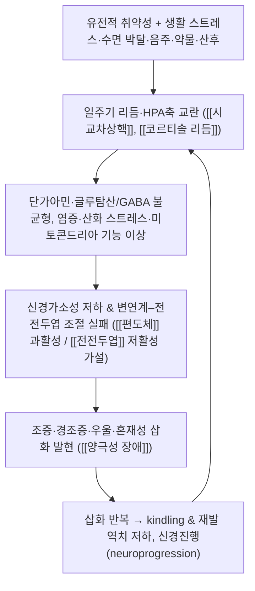

# 🩺 [[양극성 장애]] (Bipolar Disorder / 躁鬱病·癲狂, ICD-10 F31 / KCD F31)

> **핵심 3줄 요약 (Key Summary)**:
> - 📍 병소 부위 & 해부·병태생리: 특정 단일 병소가 아닌 **변연계–전전두엽 조절 회로**(편도체 [[편도체]], 해마 [[해마]], 배외측·복내측 [[전전두엽]])와 **시교차상핵(SCN) 기반 일주기 리듬 조절계**, **시상하부–뇌하수체–부신축(HPA axis)** 의 기능 이상이 핵심으로 이해된다. 단가아민(도파민·세로토닌·노르에피네프린) 및 글루탐산/GABA 균형 이상, 염증·산화 스트레스·미토콘드리아 기능 이상이 삽화 발생과 재발에 관여한다는 가설이 제시되어 있다(기전별로 이견 있음, [[근거 미확인]] 항목 다수).
> - 🚩 전형적 임상 양상 & 3대 징후: ① **조증 삽화** — 1주 이상(또는 입원이 필요한 경우 기간 무관) 기분 상승·과민 + 활동/에너지 증가, 수면욕 감소, 과대성, 사고 비약, 충동성; ② **경조증 삽화** — 4일 이상, 기능 손상이 경미하거나 없고 정신병적 증상 없음; ③ **우울 삽화** — 2주 이상의 우울 기분·흥미 상실, 다만 양극성 우울은 비전형적 특징(과다수면·과식·납중감)이 흔하다. 혼재성 삽화(조증+우울 동시)는 자·타해 위험이 특히 높다.
> - 🛠️ 핵심 감별 검사 & 한·양방 다각적 치료 전략: DSM-5-TR 기준 임상 면담이 진단의 기본이며 [[정신상태검사 MSE]], [[MDQ]](기분장애 질문지), [[YMRS]](조증 평가), [[MADRS]]/[[PHQ-9]], [[C-SSRS]](자살위험 평가)가 보조한다. 검사실로 갑상선기능·신기능·간기능·전해질·대사지표(혈당·지질)와 약물 혈중농도(리튬, 발프로에이트), 필요 시 소변 약물 스크리닝·뇌 MRI로 이차 원인을 배제한다. 양방은 기분조절제(리튬, 발프로에이트, 라모트리진)와 비정형 항정신병약을 축으로 하며, 한방은 [[변증]](간기울결·담화요심·심비양허·음허화왕 등)에 따른 침·한약으로 **잔존 증상·불면·불안·체력 저하 관리와 유지기 안정화**를 담당하는 협진 모델이 현실적이다.
> - ⚠️ 응급 의뢰 레드플래그 & 악화 요인: 자살 사고·계획·수단 확보, 타해 위협, 정신병적 증상(망상·환각) 동반 급성 조증, 혼재성 삽화, 카타토니아, 신경이완제 악성증후군(NMS), 세로토닌 증후군, 리튬 독성(진전·구토·운동실조·의식 저하), 발프로에이트 간독성 의심. 급성 삽화기에는 **한방 단독 치료로 양약을 대체하지 말고 정신건강의학과 협진을 최우선**한다. 수면 박탈·음주·각성제·스테로이드·항우울제 단독 투여·계절 변화·산후 시기가 대표적 악화 인자다.

---

## 📌 목차
1. [질환 개요 & 해부학적 병태생리](#1-질환-개요--해부학적-병태생리)
2. [병태생리 메커니즘 & 생체역학적 악순환 네트워크](#2-병태생리-메커니즘--생체역학적-악순환-네트워크)
3. [임상 증상 & 이학적 검사(Physical Exam) 알고리즘](#3-임상-증상--이학적-검사physical-exam-알고리즘)
4. [감별 진단 매트릭스 (Differential Diagnosis)](#4-감별-진단-매트릭스-differential-diagnosis)
5. [한의 통합 치료 프로토콜 (침·약침·추나·한약)](#5-한의-통합-치료-프로토콜-침약침추나한약)
6. [재활 운동 & 생활습관 티칭 가이드](#6-재활-운동--생활습관-티칭-가이드)
7. [💡 사용자 진료실 핵심 필기 & 임상 노하우 (Melt-In 잔여 심화 집약)](#7--사용자-진료실-핵심-필기--임상-노하우-melt-in-잔여-심화-집약)
8. [출처 및 학술 참고 문헌 (References)](#8-출처-및-학술-참고-문헌-references)

---

## 1. 질환 개요 & 해부학적 병태생리

![[양극성 장애_2_3.jpg|540]]
> [그림 1: ① 병태생리·영상 — Fpsyt-05-00098-g002.jpg]

* **질환 정의 및 분류**:
  * 양극성 장애는 **조증(manic) 또는 경조증(hypomanic) 삽화와 우울 삽화가 교대로 또는 혼재하여 나타나는 만성·재발성 기분장애**다. 조증 삽화가 최소 1회 있으면 **제1형(Bipolar I)**, 경조증 삽화 + 주요우울 삽화가 있으면 **제2형(Bipolar II)**, 경조증 수준에 미치지 못하는 아임상 삽화가 2년 이상 반복되면 **순환성 장애(cyclothymic disorder)** 로 분류한다(ICD-10 F31 계열 / DSM-5-TR 양극성 및 관련 장애 범주).
  * **발병 연령**: 대개 후기 청소년기~20대 전반에 첫 삽화가 시작되며, 60세 이후 첫 발병은 드물고 이 경우 이차성 원인(약물·내과질환·신경계질환)을 반드시 배제해야 한다. 조증 삽화의 평균 발병 시점이 우울 삽화보다 앞서는 경우가 흔하다고 보고된다(Smith & Whitham 2012).
  * **역학**: 양극성 스펙트럼의 평생 유병률은 연구 설계에 따라 차이가 크며 대략 **1~2% 내외**(0.5~2.5%까지 보고 편차, [[문헌별 이견]])로 제시된다. 제1형과 제2형은 성별 분포가 유사하다는 보고가 일반적이나, 제2형에서 여성 비율이 높다는 보고도 있어 일관되지 않다(McIntyre & Berk 2020).
  * **유전적 취약성**: 가족력이 가장 강력한 위험 인자이며, 쌍둥이 연구에서 유전율이 매우 높게(대략 60~85% 수준으로 보고, [[수치 문헌별 이견]]) 추정된다. 단일 유전자 질환이 아니라 다유전자성 취약성 + 환경 인자의 상호작용으로 이해된다(Smith & Whitham 2012).
  * **사회·경제적 부담**: 만성 경과, 높은 재발률, 인지기능 저하, 직업·대인 기능 손상, 사망률 증가(자살 및 심혈관·대사 질환 동반)를 동반하여 개인·사회적 질병 부담이 큰 질환이다(McIntyre & Berk 2020).
* **관련 해부학적 구조물** (특정 병소 개념이 아니라 **기능적 네트워크 단위**로 이해):
  * **변연계–전전두엽 회로**: [[편도체]](정서 반응성·위협 탐지), [[해마]](스트레스·기억 및 정서 조절), [[전전두엽]](배외측=인지 통제·작업기억, 복내측/안와전두=충동 조절·보상 평가), [[전대상피질]](오류 감지·정서 조절). 기능적 MRI 연구에서 삽화기와 관해기 신경활성 패턴 차이가 보고되나, 개별 환자 진단에 쓰일 만큼 일관된 영상 표지자는 확립되지 않았다([[근거 미확인]]).
  * **보상·동기 회로**: [[복측선조체]]·[[측좌핵]], [[중뇌 도파민 신경계]] — 조증기의 과활동성·충동성·쾌락 추구 증가와 관련된 가설적 기전.
  * **일주기 리듬 조절계**: [[시교차상핵(SCN)]]–[[송과체]](멜라토닌 분비) 축, 망막–시상하부 광수용 경로. 수면–각성 위상의 전진/지연, 계절성 삽화와 밀접하다. 수면 박탈이 조증 삽화를 유발(switch)할 수 있다는 관찰은 임상적으로 널리 받아들여진다.
  * **내분비·자율신경 축**: [[시상하부-뇌하수체-부신축(HPA)]] — 코르티솔 리듬 이상, 스트레스 반응 조절 실패. 덱사메타손 억제 검사 이상 등이 연구되었으나 진단 도구로서의 유용성은 제한적이다(Smith & Whitham 2012).
  * **신경전달·신경조절 물질**: 도파민(조증기 상승 가설), 세로토닌, 노르에피네프린, 글루탐산/GABA 균형, 아세틸콜린–도파민 상호작용, 세포 내 신호전달(GSK-3β, IP3, 단백질 키나아제 C, 뇌유래신경영양인자 BDNF) 등이 리튬 작용 기전과 함께 논의된다. 다만 "어떤 물질이 몇 % 변한다"는 식의 확정적 수치는 확립되어 있지 않다([[근거 미확인]]).

---

## 2. 병태생리 메커니즘 & 생체역학적 악순환 네트워크

![[양극성 장애_3_3.jpg|540]]
> [그림 2: ② 관련 해부 구조물 — Bipolar disorder.webm]

### 1) 삽화 발생의 핵심 기전 (현재까지의 개념 정리)
* **취약성–스트레스 모델**: 다유전자적 취약성을 가진 개인에서 생활 사건(상실, 수면 박탈, 교대 근무, 산후, 이사·해외여행 등 일주기 교란)이 삽화 방아쇠로 작용한다. 첫 삽화는 큰 스트레스가 필요하지만, 재발이 반복될수록 점점 작은 자극으로도 삽화가 유발되는 **kindling(점화) 가설**이 설명된다. 이는 삽화 횟수가 많을수록 유지 치료 필요성이 커지는 임상 원리와 연결된다(McIntyre & Berk 2020).
* **일주기·수면 조절 실패**: 조증기에는 수면 요구량 감소(불면이지만 피로감 없음), 활동량 급증, 야간 멜라토닌·코르티솔 리듬 위상 이상이 관찰된다. **사회적 리듬(수면·기상·식사·활동 시각)의 규칙화**(대인관계·사회적 리듬 치료, IPSRT)가 재발 방지에 효과적이라는 근거는 이 기전과 정합적이다(Lane & Smith 2023).
* **신경염증·산화 스트레스·미토콘드리아 가설**: 전신 염증 표지자 상승, 산화 스트레스 증가, 미토콘드리아 기능 저하가 보고되며, 이는 기분조절제 및 일부 보조 요법(예: N-아세틸시스테인 등) 연구의 이론적 배경이 된다. 다만 개별 환자 치료 결정에 직접 적용할 수준의 검사 지표는 아직 없다([[근거 미확인]]).
* **신경진행(neuroprogression)**: 삽화 반복에 따라 인지기능 저하, 해마 용적 변화 등이 진행된다는 개념이 제시되며, **조기 진단·조기 유지 치료**의 근거가 된다(McIntyre & Berk 2020).

### 2) 삽화 유발 인자 및 이차성 원인 (반드시 문진)
| 구분 | 대표 원인 | 임상 포인트 |
| :--- | :--- | :--- |
| 약물 | 스테로이드, 항우울제 단독(switch), 각성제·코카인, 인터페론, 이소니아지드, 일부 항생제·기관지확장제 | 항우울제 처방 후 갑작스러운 기분 상승·불면·과활동은 경조증/조증 전환 신호 |
| 내과질환 | 갑상선기능항진/저하, 쿠싱증후군, 부신기능 이상, 대사질환, 비타민 B12·엽산 결핍 | 갑상선기능검사는 기본 세트 |
| 신경계질환 | 뇌졸중(특히 우반구), 뇌종양, 외상성 뇌손상, 간질(측두엽), 다발성경화증, 헌팅턴병 | 40~50세 이후 첫 조증은 신경영상 검토 |
| 물질 | 알코올, 벤조디아제핀 금단, 대마, 흡입제 | 자·타해 위험 및 치료 순응도 평가 필수 |

### 3) 약물 작용 기전(요약)
* **리튬**: 세포 내 신호전달(GSK-3β 억제, IP3/PKC 조절), 신경보호·신경가소성 증진, 일주기 리듬 안정화 등 복합 기전으로 설명된다. **유지 치료에서 재발 및 자살 위험을 낮추는 근거가 가장 강한 약제**로 평가된다(Lane & Smith 2023; McIntyre & Berk 2020).
* **발프로에이트**: GABA성 신경전달 강화, 이온채널·신호전달 조절 기전. **급성 조증에서 위약 대비 우월성이 체계적 문헌고찰·메타분석 수준에서 지지**되나, **양극성 우울 삽화 및 유지 치료에서의 근거는 상대적으로 제한적·불일치**하다(Mari & Dieckmann 2024).
* **라모트리진**: 글루탐산 유리 억제 기전으로 **양극성 우울 삽화 예방 및 유지기 우울 삽화 억제**에 사용되며, 급성 조증에는 효과가 없다(Lane & Smith 2023).
* **비정형 항정신병약(퀘티아핀, 올란자핀, 아리피프라졸, 루라시돈 등)**: 급성 조증 및 양극성 우울 삽화, 유지 치료의 주요 축. 대사 부작용 모니터링이 필수다(McIntyre & Berk 2020).

---

## 3. 임상 증상 & 이학적 검사(Physical Exam) 알고리즘

### 1) 주소증 및 정신·신경학적 증상
* **조증 삽화 (DSM-5-TR 개념 정리)**:
  * 핵심: **기분의 상승·확대 또는 과민성** + **목표지향 활동/에너지의 지속적 증가**가 1주 이상(입원이 필요할 정도면 기간 조건 완화) 지속.
  * 부수 증상(7항목 중 3개 이상, 기분이 과민성일 때는 4개 이상): ① 자존감 팽창·과대성, ② 수면욕 감소(3시간 수면에도 개운함), ③ 평소보다 말이 많음·압박성 언어, ④ 사고 비약·생각의 경주, ⑤ 주의 산만, ⑥ 목표지향 활동 증가 또는 정신운동 초조, ⑦ 쾌락·위험 활동 증가(무분별한 소비, 성적 탈억제, 투자·운전 위험).
  * **기능 손상 또는 입원 필요성**이 있어야 하며, 정신병적 증상(망상·환각)이 동반되면 정신병적 조증으로 분류.
* **경조증 삽화**: 위 증상이 **4일 이상** 지속되지만 기능 손상이 뚜렷하지 않고 입원이 필요 없으며 정신병적 증상이 없다. 환자 본인은 "컨디션이 좋았던 시기"로 기억하는 경우가 많아 **가족·보호자 병력 청취가 결정적**이다.
* **우울 삽화**: 2주 이상의 우울 기분 또는 흥미·쾌감 상실 + 식욕·체중 변화, 수면 변화(특히 **과다수면**), 정신운동 지체/초조, 피로, 무가치감·죄책감, 집중력 저하, 자살 사고. **양극성 우울은 비전형적 특징**(과다수면·과식·납중감(leadern paralysis), 기분의 일중 변동)과 **정신운동 지체**가 상대적으로 흔하다(Hirschfeld 2014).
* **혼재성 삽화**: 조증과 우울 증상이 같은 기간에 동시에 나타나며, 초조·불면·충동성과 절망감이 겹쳐 **자살 위험이 가장 높은 국면**으로 취급한다.
* **삽화 간기(관해기)**: 완전 관해가 가능하지만, 잔존 우울 증상, 불안, 수면 불규칙, 인지기능 저하(집중·기억), 정서 불안정성이 남는 경우가 많고 이것이 재발 예측 인자가 된다.
* **자율신경·신체 증상**: 항정신병약·리튬·발프로에이트 사용 시 체중 증가, 진전, 다음·다뇨, 갑상선기능 이상, 신기능 저하, 간수치 상승 등 **약물 관련 신체 증상**이 주소증으로 올라온다 — 한의 진료실에서도 반드시 확인해야 하는 항목.

### 2) 필수 평가 알고리즘 (면담 + 신체검사 + 검사실)
* [[정신상태검사 MSE]]: 외모·행동(과활동, 초조), 언어(압박성·비약), 기분 및 정동, 사고 내용(과대·망상), 지각(환각), 인지기능(지남력·주의·기억), 병식과 판단력. **조증기에는 병식이 현저히 저하**되므로 보호자 정보가 필수다.
* [[기분장애 질문지 MDQ]]: 경조증 선별 도구. 민감도는 비교적 높으나 특이도가 낮아 **확진이 아니라 선별** 용도로만 사용한다(Hirschfeld 2014). 평생 조증/경조증 삽화의 과거력, 항우울제 유발 경조증, 가족력 항목이 포함된다.
* [[YMRS]](Young Mania Rating Scale): 조증 중증도 및 치료 반응 추적. [[MADRS]]·[[PHQ-9]]: 우울 중증도 추적.
* [[C-SSRS]] 또는 자살위험 구조화 면담: 자살 사고의 빈도·강도·계획·수단 접근성·과거 시도력을 매 방문 확인. **양극성 장애는 자살 사망 위험이 일반 인구보다 유의하게 높고, 자살 시도 평생 유병률도 상당히 높게 보고된다(수치는 연구별 이견, McIntyre & Berk 2020).**
* **감별을 위한 신체검사**: 활력징후(조증기 탈수·체중 감소), 체중·허리둘레·BMI(대사 모니터링), 갑상선 촉진, 신경학적 검사(진전, 반사, 운동실조 — 리튬 독성/신경계 질환 감별), 피부 병변, 간·비장 촉진.
* **검사실 기본 세트**: CBC, 전해질(Na/K/Ca), 신기능(BUN/Cr/eGFR), 간기능, 갑상선기능(TSH/free T4), 공복혈당·HbA1c·지질, 임신 검사(가임기 여성), 비타민 B12·엽산, 필요 시 소변 약물 스크리닝, 혈중 리튬·발프로에이트 농도.
  * 리튬 유지 치료 시 목표 혈중농도는 일반적으로 **0.6~1.2 mEq/L 범위**에서 개별 조정하며(급성기 상한, 유지기 하한 경향), **탈수·저염식·NSAIDs·ACE억제제·이뇨제 병용 시 독성 위험이 급증**한다(일반 임상 지침, 제공 논문 범위 외 안전성 원칙).
* **뇌 영상(MRI/CT)**: 40세 이후 첫 조증, 국소 신경학적 결손, 두부 외상력, 의식 변화 동반 시 반드시 시행.

---

## 4. 감별 진단 매트릭스 (Differential Diagnosis)

| 감별 질환 | 호발 병소 및 원인 | 주소증 차이점 | 특이적 이학적 검사 소견 |
| :--- | :--- | :--- | :--- |
| **[[양극성 장애]]** (본 질환) | 변연계–전전두엽 조절 회로 + 일주기·HPA축 기능 이상 | **조증/경조증 삽화의 존재**가 결정적. 삽화성 경과, 삽화 간 기능 회복 | [[MDQ]] 양성, [[YMRS]] 상승, 항우울제 유발 경조증 병력, 가족력 |
| **[[주요우울장애]]** | 기분 조절 회로 (단극성) | 조증/경조증 삽화 **없음**. 양극성 우울로 오진되기 쉬운 반대 방향 오류가 더 흔함 | 이른 발병, 삽화 빈도 많음, 비전형 특징, 가족력, 산후 삽화, 항우울제 반응 불량·급속 순환은 양극성 시사(Hirschfeld 2014) |
| **[[조현병 스펙트럼 장애]]** | 도파민계 이상 + 광범위 네트워크 | 기분 삽화 **없이** 망상·환각·와해된 언어가 주된 양상. 음성 증상 지속 | 기분 삽화가 정신병적 증상 기간의 일부에만 존재, 조증기 과대성과 망상의 구분 |
| **[[경계성 인격장애]]** | 정서 조절 취약성(기질+발달) | 만성적 정서 불안정·대인관계 진동, **삽화성 삽화가 아님**, 몇 시간~며칠 단위 변동 | 자해·공허감·버림받음 공포, 수면욕 감소 없음, YMRS 정상 범위 |
| **[[ADHD]] (특히 소아·청소년)** | 전전두엽 실행기능 발달 지연 | 만성적 주의력 저하·충동성, **기분 삽화성 경과 없음** | 증상이 아동기부터 지속·비삽화성, 조증성 수면욕 감소 없음(Malhi & Jadidi 2023) |
| **약물/물질 유발 양극성 및 관련 장애** | 각성제, 스테로이드, 항우울제, 알코올·금단 | 약물 시작·중단과 시간적 연관 | 소변 약물 검사, 병력 청취로 인과관계 확인 |
| **[[갑상선기능항진증]]** | 갑상선 호르몬 과다 | 초조·체중 감소·불면·빈맥이 조증과 유사 | TSH 저하, free T4 상승, 갑상선종·안구 증상 |
| **[[조현정동장애]]** | 기분 삽화 + 정신병적 증상 공존 | 정신병적 증상이 기분 삽화 **기간의 대부분**에 존재 | 삽화 간에도 망상·환각 잔존 |

> **실전 감별 포인트**: 양극성 장애 진단에서 가장 흔하고 위험한 오류는 **양극성 우울을 주요우울장애로 오진하여 항우울제 단독 투여 → 경조증/조증 전환·급속 순환 악화**를 유발하는 것이다. 반대로 소아·청소년에서는 과진단(정상적 짜증·ADHD를 조증으로 오인) 문제도 지적된다(Malhi & Jadidi 2023). 진단은 **삽화성(episodic) 경과 여부**와 **기능 손상 수준**을 축으로 삼는다.

---

## 5. 한의 통합 치료 프로토콜 (침·약침·추나·한약)

> **⚠️ 치료 원칙 선언**: 급성 조증·혼재성 삽화·정신병적 증상·자살 위험이 있는 경우 **한방 단독 치료는 금기**이며 정신건강의학과 입원·약물 치료가 우선이다. 한의 치료는 ① 정신건강의학과 치료에 **병행**하여 잔존 증상(불면, 불안, 초조, 피로, 소화불량, 체중·대사 문제) 완화, ② 관해기 **재발 예방과 체질·생활 관리**, ③ 양약 감량·유지기 **삶의 질 개선**을 목표로 한다. 한약–양약 상호작용 평가가 선행되어야 하며, 환자 임의로 양약을 중단하도록 해서는 절대 안 된다.

* **침구 치료 (Acupuncture)**:
  * **기본 방향**: 정신 안정(안신), 간기 소통, 담화(痰火) 청열, 심비(心脾) 보익.
  * **주요 혈위**: [[백회(GV20)]], [[인당(EX-HN3)]], [[사신총(EX-HN1)]], [[신문(HT7)]], [[내관(PC6)]], [[대릉(PC7)]], [[삼음교(SP6)]], [[태충(LR3)]], [[합곡(LI4)]], [[족삼리(ST36)]], [[풍륭(ST40)]], [[태계(KI3)]], [[조해(KI6)]].
    * 불면·초조 중심: 신문·삼음교·인당·조해 위주, 자침 후 정적 안정 유도.
    * 우울·무기력 중심: 백회·족삼리·기해(CV6)·관원(CV4) 위주로 보기(補氣).
    * 조증성 초조·충동성: 태충·합곡·풍륭 등 사기(瀉氣) 위주, 자극은 **과도하지 않게** 짧게.
  * **전침 세팅**: 불안·불면에는 저주파(2 Hz 전후)로 신문–삼음교, 백회–인당 자극이 임상적으로 사용된다. 조증기에는 강한 자극이 초조를 악화시킬 수 있어 **저강도·단시간** 원칙.
  * **전통 문헌**: 전광(癲狂)에 鬼門十三穴(귀문십삼혈) 등이 사용되어 온 기록이 있으나, 현대적 임상 근거는 확립되지 않았다([[근거 미확인]]).
* **약침 치료 (Pharmacopuncture)**:
  * 양극성 장애 자체를 대상으로 한 약침 RCT 근거는 **현재 확인되지 않는다([[근거 미확인]])**. 따라서 "약침이 조증을 치료한다"는 식의 설명은 하지 않는다.
  * 임상적으로는 **불면·불안·근긴장·소화불량 등 동반 신체 증상 완화 목적**의 보조로 신정(GV24)·인당·배부 [[방광경 배수혈]](심수 BL15, 간수 BL18, 비수 BL20, 신수 BL23) 등을 고려할 수 있으나, 이는 경험적 접근이며 근거 수준은 낮다. 시술 전 항응고제 복용 여부와 감염 위험을 확인한다.
* **추나 치료 (Chuna Manipulation)**:
  * 적응: 관해기의 경항부·흉추부 근긴장, 자세 불균형, 두통, 자율신경 불안정감. 경추 상부·흉추 이완 및 흉추 가동 추나로 호흡·긴장 완화를 도모한다.
  * **금기·주의**: 급성 조증기의 격렬한 정신운동 초조 상태에서는 **낙상·충돌 위험이 있어 시술을 보류**한다. 리튬·항정신병약 복용 중 어지럼·기립성 저혈압·진전이 있는 환자에서도 고강도 수기는 피한다. 약물 관련 골밀도 저하 가능성을 고려해 강한 thrust 기법은 신중히 적용한다([[근거 미확인]] — 인과관계 확립 안 됨).
* **한약 치료 (Herbal Medicine) — 변증별 접근**:

| 변증 | 주요 증상 양상 | 대표 처방(예) | 임상 포인트 |
| :--- | :--- | :--- | :--- |
| [[간기울결]](肝氣鬱結) | 우울·답답함·한숨·흉협창만·스트레스 반응 | [[소요산]], [[시호소간산]] | 관해기 우울 잔존·불안에 다용 |
| [[담화요심]](痰火擾心) | 초조·흥분·불면·변비·홍조·설홍태황 | [[온담탕]], [[황련온담탕]] | 조증성 초조·경조증 국면에서 고려. 열성 증상 확인 |
| [[심비양허]](心脾兩虛) | 무기력·과다수면·식욕 부진·건망·불안 | [[귀비탕]], [[보중익기탕]] 가미 | 우울 삽화 회복기, 체력 저하 |
| [[음허화왕]](陰虛火旺) | 오심번열·야간 조열·도한·불면·초조 | [[천왕보심단]], [[황련아교탕]], [[감맥대조탕]] | 수면 유지 곤란, 항정신병약·리튬 장기 복용자 |
| [[기혈양허]](氣血兩虛) | 기력 저하·어지럼·창백·불면·심계 | [[십전대보탕]], [[귀비탕]] 가미 | 관해기 전반적 회복 |

  * **처방 설명의 근거 수준**: 위 변증–처방 배합은 **한의학 전통 이론 및 임상 관행에 근거**한 것이며, 양극성 장애를 대상으로 한 대규모 무작위 대조시험 근거는 확인되지 않는다([[근거 미확인]]). 근거가 부족하다는 점과 함께 "양약을 대체할 수 없다"는 점을 환자에게 명확히 고지한다.
  * **한약–양약 상호작용 경고(중요)**:
    * **리튬 + 이뇨·사하 작용 한약(예: 대황·감수 포함 처방, 저염·탈수 유발 처방)**: 리튬 재흡수 증가로 **혈중농도 상승·독성 위험** → 병용 시 리튬 농도 추적.
    * **발프로에이트 + 간대사 영향 한약**: 간수치 상승 위험 → 간기능 추적.
    * **SSRI/SNRI + 세인트존스워트(성요한초)**: 세로토닌 증후군 위험 — 임의 복용 금지 교육.
    * 항정신병약 + 진정 작용 한약: 과진정·기립성 저혈압 위험.
  * **양방 치료 병행 요약**: 급성 조증은 리튬 또는 발프로에이트(또는 항정신병약) 중심, **양극성 우울 삽화는 라모트리진·퀘티아핀·루라시돈 등**, 유지기는 리튬 우선. 중증·치료저항·카타토니아에서는 전기경련요법(ECT)이 고려된다(Lane & Smith 2023; McIntyre & Berk 2020; Mari & Dieckmann 2024).

---

## 6. 재활 운동 & 생활습관 티칭 가이드

* **생활 리듬 안정화 (가장 중요한 재발 예방 축)**:
  * **수면·기상 시각을 매일 ±1시간 이내로 고정**. 주말 몰아자기, 밤샘, 시차가 큰 여행은 조증 전환의 방아쇠가 될 수 있다.
  * 야간 조명·스마트폰 블루라이트 노출 최소화, 카페인은 오후 이후 금지, 알코올은 원칙적으로 금주(수면 구조 파괴 + 우울 악화 + 약물 상호작용).
  * 식사·활동·사회적 접촉 시각을 규칙화하는 **사회적 리듬 요법(IPSRT)** 개념을 일상에 적용(Lane & Smith 2023).
* **이완 및 스트레칭 (Stretching)**:
  * 관해기 경항부·흉추부·견갑 주위 근긴장 완화 목적의 정적 스트레칭 5~10분/일.
  * 복식호흡·점진적 근이완법(PMS)·마음챙김 호흡 10분 — 초조·불안 완화 목적. 명상은 조증기에는 오히려 내적 자극이 될 수 있으므로 **관해기 또는 경도 불안 국면**에서 시행.
* **강화 및 안정화 운동 (Strengthening)**:
  * 주 3~5회, 30분 내외의 **중강도 유산소 운동**(빠르게 걷기, 자전거, 수영)이 기분 안정과 대사 부작용(체중·혈당·지질) 관리에 도움이 된다는 근거가 축적되어 있다(McIntyre & Berk 2020).
  * 저항 운동 주 2회 병행 — 항정신병약 장기 복용자의 근감소·대사증후군 예방.
  * 요가·태극권 등 부교감 활성화 중심 운동 — 불안·불면 보조.
* **신경 활주 운동 (Neurodynamics) 대체 개념 — 인지·주의 훈련**:
  * 양극성 장애에서는 신경 포착 개념보다 **인지기능 재활**이 중요하다. 관해기에 작업기억·주의력 훈련(독서, 악기, 외국어, 순차적 과제), 규칙적 두뇌 사용이 인지 저하 관리에 도움.
* **일상생활 자세 티칭 (Ergonomics)**:
  * 교대 근무·야간 근무는 재발 위험을 높이므로 가능한 한 피하고, 불가피하면 근무 일정 고정 + 수면 위생 강화 + 조기 경고 신호 자가 점검을 병행.
  * 작업 환경: 과도한 자극(소음·번쩍임) 회피, 업무량은 관해기 기준으로 단계적 복귀.
* **자가 모니터링 도구**:
  * **기분 일기(mood charting)**: 매일 기분(0~10), 수면시간, 활동량, 약 복용 여부, 특이 스트레스를 1분간 기록. 3~4주 패턴이 보이면 재발 징후를 조기에 포착할 수 있다.
  * **개인별 조기 경고 신호 목록 작성**: 예) "잠이 3시간으로 줄고 말이 빨라지고 지출이 늘면 조증 전조", "아침에 못 일어나고 사람 만나기가 싫어지면 우울 전조". 가족과 공유하여 가족이 먼저 알아차리게 하는 것이 효과적이다.
* **가족·보호자 교육**:
  * 삽화기에는 환자의 판단력이 떨어지므로 **가족이 약 복용과 수면을 관찰**하는 역할을 맡는다. 비난·논쟁은 중단하고, 안전 확보(운전 금지, 카드·현금 관리)를 우선한다.
  * 보호자에게 "의지 문제가 아니라 재발성 뇌 질환"이라는 설명을 반복해 낙인과 자책을 줄인다.
* **가임기·임신 상담**: 발프로에이트는 태아 신경관 결손 등 기형 위험이 있어 임신 가능성 있는 여성에서는 원칙적으로 회피/대체를 검토한다(일반 안전성 원칙). 리튬도 임신 전후 용량·모니터링 조정이 필요하므로 **임신 계획 시 반드시 정신건강의학과·산과 협진**. 계획되지 않은 임신에서 임의 중단은 금물.

---

## 7. 💡 사용자 진료실 핵심 필기 & 임상 노하우 (Melt-In 잔여 심화 집약)

> [!IMPORTANT]
> **🛡️ 원문 융합(Melt-In) 및 7번 섹션 작성 불변 규칙 (CRITICAL)**
> 1. **기존 필기 내용 상부 전면 융합 (Melt-In)**: 질환의 정의, 병태생리, 임상 증상, 평가법, 치료 전략, 생활 티칭에 해당하는 기본 내용은 상부 1~6번 섹션에 유기적으로 100% 녹여내어 고도화한다.
> 2. **7번 섹션의 차별화된 심화 집약**: 이 섹션은 상부에 이미 녹여낸 기본 내용을 단순 중복 나열하는 공간이 아니다. **상부 1~6번에 다 담기지 않은, 진료실에서만 얻어지는 고유한 실전 노하우(문진 체크리스트, 감별 직관, 치료 순서와 손맛, 환자 설명 스크립트)만** 엄선해 집약한다.
> 3. **이미지 관련**: 본 노트에는 제공된 이미지 블록이 없으므로 이미지 임베드 및 캡션을 넣지 않는다. 후일 실제 도해를 확보하면 ① 병태생리 도해, ② 관련 신경·해부 구조 도해, ③ 시술점 도해 순으로 배치한다(파일 확보 전 임의 파일명 생성 금지).

* **상부 섹션에 미처 다 담지 못한 고유 원문 필기**:
  * 양극성 장애는 **"증상의 강도"보다 "삽화성 주기성"이 진단의 본질**이다. 한 번의 상담으로 조증 삽화를 놓치면 이후 10년간 오진이 누적될 수 있으므로, 우울 환자를 볼 때마다 **"평생 한 번이라도, 잠이 줄고 기분이 비정상적으로 좋아지고 말이 빨라지고 돈을 크게 쓴 시기가 있었습니까?"** 를 반드시 묻는다.
  * 환자가 "그때가 인생에서 가장 자신감 있고 능률적이었던 시기"라고 회상하는 경우가 많아 **주관적 좋았던 시기 = 경조증 삽화**일 수 있다. 이때 가족에게 확인하면 병력이 뒤집히는 경우가 흔하다.
  * 한의 진료실에서 가장 자주 만나는 국면은 **① 항정신병약·리튬 복용 중인데 잔존 불면·불안·체중 증가·소화불량이 있는 경우, ② 관해기 환자가 "양약을 줄이고 싶다"며 내원하는 경우, ③ 양극성 우울로 오인되어 항우울제를 복용 중인데 초조·불면이 악화된 경우**다. 이 세 국면의 대응이 실제 임상의 대부분을 차지한다.
* **진료실 실전 감별 & 치료 노하우**:

  1. **실전 문진 체크리스트 (초진 5분 스크리닝)**
     * ① **삽화 과거력**: 기분이 비정상적으로 상승·과민했던 시기가 있었는지, 그때 지속 기간(4일/1주 기준), 입원 경험.
     * ② **수면 패턴**: 잠이 줄었는데도 피곤하지 않았던 시기(조증 핵심 신호), 현재 수면시간과 기상 시각.
     * ③ **약물 유발성**: 항우울제 복용 후 갑작스러운 기분 상승·조증 전환 경험, 스테로이드·각성제 사용.
     * ④ **자살 위험**: 현재 자살 사고의 강도·계획·수단 접근성, 과거 시도력, 혼재성 증상 여부.
     * ⑤ **가족력**: 부모·형제의 양극성 장애, 자살, 입원, 알코올 문제.
     * ⑥ **주기성·계절성**: 특정 계절(주로 봄·여름) 삽화 집중, 월경 주기 전 악화, 산후 삽화.
     * ⑦ **현재 복용 약과 혈중농도**: 리튬/발프로에이트 농도, 최근 검사 시점, 부작용(진전·다음·체중·갑상선).
     * ⑧ **기능 수준**: 직장·학업·가정 역할 수행, 최근 1개월 결근·지출 이상.
     * ⑨ **동반 질환**: 불안장애, 알코올·물질 사용, ADHD, 대사증후군, 편두통.
     * ⑩ **협진 여부**: 담당 정신건강의학과 전문의 유무, 주치의에게 한방 치료를 알렸는지.
  2. **치료 순서 및 손맛 노하우**
     * **1단계 — 안전 확보**: 자살·타해 위험과 정신병적 증상, 혼재성 삽화 여부를 먼저 확인하고, 해당 시 **즉시 협진·의뢰**. 이 단계를 건너뛰고 침·한약부터 시작하는 것은 금물.
     * **2단계 — 리듬 회복**: 첫 치료 목표는 기분이 아니라 **수면**이다. 신문(HT7)·삼음교(SP6)·인당·백회 중심으로 자침하고, 취침·기상 시각을 먼저 고정시킨다. 불면이 잡히면 기분 변동 폭도 같이 줄어드는 것을 임상에서 자주 관찰한다([[근거 미확인]] — 경험적 관찰).
     * **3단계 — 변증 확정**: 초진 2~3회차에 열성(성홍 설, 변비, 초조) vs 허성(창백, 무기력, 과다수면)을 판정해 처방을 결정한다. 조증기에는 온담탕·황련온담탕 계열, 우울·회복기에는 귀비탕·십전대보탕·천왕보심단 계열이 실전에서 자주 쓰인다.
     * **4단계 — 복약 조율**: 한약은 1일 2회, 식후 30분~1시간. **양약과 최소 1시간 이상 간격**을 두고 복용하도록 지도하며, 리튬 복용자는 한약 시작 후 1~2주 내 혈중농도·신기능 재검을 권한다.
     * **5단계 — 유지기 관리**: 2~4주 간격으로 기분 일기를 리뷰. 안정되면 4~6주 간격으로 전환하되 **계절성 삽화가 있는 환자는 위험 계절 4~6주 전에 선제적으로 내원**하도록 예약을 잡아둔다.
     * **자침 시 환자 체위 팁**: 초조·불안이 큰 환자는 앙와위에서 어깨·팔을 받침대로 안정시킨 뒤 자침한다. 유침 시간은 15~20분, 조증기에는 10~15분으로 짧게. 시술 중 진정 반응(깊은 호흡, 하품)이 나오면 좋은 신호로 본다.
     * **약침 관련 원칙**: 양극성 장애 자체를 적응증으로 한 약침 근거는 확인되지 않으므로, 환자에게 "약침이 조증을 낫게 한다"고 설명하지 않는다. 불면·근긴장 등 **동반 증상 완화 목적**으로만 제한적으로 시행하고, 그 근거 수준이 낮음을 솔직히 알린다.
     * **추나 적용 원칙**: 관해기의 경항·흉추 긴장에 한정해 부드러운 이완 기법 위주로 시행. 급성 조증의 초조 상태, 어지럼·기립성 저혈압이 있는 환자에서는 시행을 보류한다.
  3. **환자 티칭 스크립트 (그대로 읽어도 되는 문장)**
     * **질환 설명**: "이 병은 의지나 성격 문제가 아니라, 뇌의 기분 조절 회로와 수면 리듬이 반복적으로 흔들리는 재발성 질환입니다. 그래서 좋아졌다 나빠졌다를 반복하는 게 정상적인 경과이고, 반복될수록 다음 삽화가 더 쉽게 올 수 있어서 **삽화가 없을 때 관리하는 것이 가장 중요**합니다."
     * **양약 설명**: "리튬이나 발프로에이트 같은 약은 기분을 좋게 만드는 약이 아니라 **다음 삽화가 올 확률을 낮추는 약**입니다. 그래서 기분이 좋아 보여도 임의로 끊으면 안 됩니다. 끊고 싶으면 반드시 주치의와 상의해서 서서히 조절해야 합니다."
     * **한방 치료 위치 설명**: "한약과 침은 기분 삽화 자체를 막는 주 치료가 아니라, **잠을 안정시키고 불안·초조·소화불량·피로를 줄여 회복 속도를 돕는 보조 치료**입니다. 근거가 아직 부족한 부분이 있어서 정신과 치료와 함께 갈 때 가장 안전합니다."
     * **수면 교육**: "조증은 대개 **잠이 줄어드는 것으로 시작**됩니다. 3일 연속 잠이 4시간 이하로 줄고도 피곤하지 않다면, 그게 첫 번째 경보입니다. 그때 바로 연락하세요."
     * **생활 교육**: "술은 끊으시는 게 좋습니다. 잠을 깨뜨리고, 우울을 악화시키고, 약과 부딪힙니다. 카페인은 오후 2시 이후로는 피하시고, 주말에도 평일과 같은 시간에 일어나세요."
     * **금기 안내(반드시 명시)**: "기분이 너무 좋아지거나 화가 치솟아서 잠을 못 자고 말이 빨라지고 돈을 쓰는 상태라면, 그건 스스로 조절할 수 있는 상태가 아닙니다. 그때는 침·한약만으로 버티지 말고 **바로 정신건강의학과에 가셔야 합니다.**"
  4. **협진·의뢰 기준 (한의 진료실 판단)**
     * 즉시 의뢰: 자살 사고/계획/수단, 타해 위협, 정신병적 증상, 혼재성 삽화, 카타토니아, NMS·세로토닌 증후군 의심, 리튬 독성 의심(구토·운동실조·의식 변화), 임신 중 발프로에이트 복용.
     * 우선 협진 후 병행: 급성 조증/우울 삽화기, 약물 용량 조정기, 첫 발병 의심, 삽화 빈도 증가(급속 순환 의심: 1년에 4회 이상 삽화).
     * 한방 단독 관리 가능 범위: **관해기 또는 경도 잔존 증상**(불면, 불안, 피로, 소화불량, 근긴장) — 이 경우에도 정신건강의학과 정기 추적은 유지.

---

## 8. 출처 및 학술 참고 문헌 (References)

1. **Smith DJ, Whitham EA (2012)**. *Bipolar disorder*. **Handb Clin Neurol**. PMID: 22608626
   - **[연구 요약]**: 양극성 장애의 역사적 개념 정립부터 역학, 유전학, 임상 아형(I형·II형·순환성), 신경생물학적 기전, 약물 치료와 유지 요법을 포괄적으로 정리한 신경과 교과서 챕터. 본 노트의 질환 정의·분류·유전적 취약성·HPA축 및 신경전달 관련 서술의 기본 골격으로 인용하였다.
2. **Lane NM, Smith DJ (2023)**. *Bipolar disorder: Diagnosis, treatment and future directions*. **J R Coll Physicians Edinb**. PMID: 37649414
   - **[연구 요약]**: 진단 체계(DSM/ICD)와 감별의 실제, 리튬을 중심으로 한 기분조절제 및 항정신병약 치료 전략, 항우울제 사용의 주의점, 심리사회적 치료(사회적 리듬 요법 등), 정밀의학적 미래 방향을 논한 최신 종설. 유지 치료와 재발 예방, 리튬의 위치에 관한 본 노트 서술의 근거로 인용하였다.
3. **Malhi GS, Jadidi M (2023)**. *The diagnosis of bipolar disorder in children and adolescents: Past, present and future*. **Bipolar Disord**. PMID: 37433682
   - **[연구 요약]**: 소아·청소년 양극성 장애 진단의 변천사를 다루며, 과진단과 과소진단의 양방향 오류, ADHD·기분조절곤란장애(DMDD) 등과의 감별 문제, 발달 단계에 따른 임상 표현 차이를 논의. 본 노트의 소아·청소년 감별 및 진단 주의점 서술에 인용하였다.
4. **Hirschfeld RM (2014)**. *Differential diagnosis of bipolar disorder and major depressive disorder*. **J Affect Disord**. PMID: 25533909
   - **[연구 요약]**: 양극성 우울과 주요우울장애의 감별 지표(이른 발병, 반복 삽화, 비전형적 특징, 가족력, 산후 삽화, 항우울제 유발 경조증, 치료 반응)를 정리하고, MDQ 등 선별 도구의 활용과 한계를 제시. 본 노트의 감별 진단 매트릭스 및 실전 문진 항목의 근거로 인용하였다.
5. **McIntyre RS, Berk M (2020)**. *Bipolar disorders*. **Lancet**. PMID: 33278937
   - **[연구 요약]**: 양극성 장애의 역학·질병 부담, 병태생리(염증·산화 스트레스·미토콘드리아 기능 이상·신경진행), 진단, 그리고 급성기 및 유지기 치료 전략과 예후를 종합한 대표적 종설. 본 노트의 역학·병태생리 가설·재발 예방 및 대사 모니터링 관련 서술의 근거로 인용하였다.
6. **Mari J, Dieckmann LHJ (2024)**. *The efficacy of valproate in acute mania, bipolar depression and maintenance therapy for bipolar disorder: an overview of systematic reviews with meta-analyses*. **BMJ Open**. PMID: 39500601
   - **[연구 요약]**: 발프로에이트의 급성 조증, 양극성 우울 삽화, 유지 치료에서의 효능을 체계적 문헌고찰·메타분석들을 개관한 연구. 급성 조증에서는 위약 대비 우월성을 지지하는 근거가 축적되어 있으나, 양극성 우울 및 유지 치료에서는 근거가 제한적·불일치함을 보고하였다. 본 노트의 발프로에이트 효능 범위 서술에 인용하였다.

> **참고 교과서(PMID 없음, 개념 정리용)**:
> - American Psychiatric Association. *Diagnostic and Statistical Manual of Mental Disorders, Fifth Edition, Text Revision (DSM-5-TR)* — 삽화 진단 기준(조증·경조증·우울·혼재성) 서술에 사용.
> - 대한한방신경정신과학회. *한방신경정신과학* — 전광(癲狂)·울증(鬱證) 변증 및 처방 배합의 전통 이론 서술에 사용.
> - 대한정신약물학회 교재 및 국내 정신건강의학과 임상 지침 — 리튬·발프로에이트 혈중농도 및 안전성 모니터링 일반 원칙 서술에 사용.

> **⚠️ 근거 수준 고지**: 본 노트에서 `[[근거 미확인]]`으로 표시한 항목(개별 영상 표지자, 약침·추나의 양극성 장애 직접 치료 근거, 특정 한약 처방의 RCT 근거, 삽화 횟수·유전율 등의 세부 수치)은 제공된 논문 및 일반적으로 확립된 지침 범위를 벗어나거나 문헌 간 이견이 있는 내용이다. 임상 적용 시 최신 지침과 정신건강의학과 협진을 우선한다.

<!-- 보관 태그(1회용·링크오류, 필요시 복원): 기분장애, 리튬, mood-stabilizer -->
