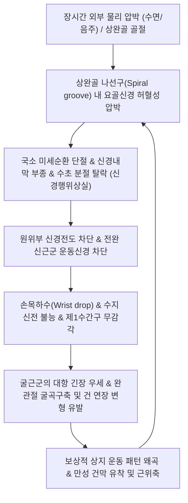

# 🩺 [[요골신경 마비]] (Radial Nerve Palsy / 橈骨神經痲痺, G56.3)

> **핵심 3줄 요약 (Key Summary)**:
> - 📍 **병소 부위 & 해부·병태생리**: [[상완신경총]](C5-T1) 후삭(Posterior cord)에서 기원한 [[요골신경]](Radial nerve)이 액와부, [[상완골]] 나선구(Spiral groove), 주관절 외측 건궁(Arcade of Frohse) 등에서 급성 압박·견인·골절 편에 의해 손상되어 신경전도 차단([[신경행위상실]]) 또는 축삭 단열을 유발함.
> - 🚩 **전형적 임상 양상 & 3대 징후**: 전완 신근군 마비로 인한 완관절 및 수지 신전 불능인 **손목하수([[Wrist drop]], 垂手/하수수)**, 제1수간구(First web space) 배측의 무감각·마목감, 주관절 신전 및 회외력 저하.
> - 🛠️ **핵심 감별 검사 & 한·양방 다각적 치료 전략**: 수근관절 능동 신전 검사 및 완관절 하수각 측정, [[상완요골근]] 건반사 소실 감별, 급성기 손목 신전 부목([[Cock-up splint]]) 장착 하에 [[곡지]](LI11)·[[수삼리]](LI10)·[[외관]](TE5) 전침(2~20Hz 저주파) 통전 및 신경 재생 한약([[보양환오탕]], [[황기계지오물탕]]) 투여.
> - ⚠️ **응급 의뢰 레드플래그 & 악화 요인**: 상완골 간부 골절(Holstein-Lewis 골절) 직후 개방성 손상이나 수술적 정복 후 발생한 급격한 신경 마비(신경 절단 의심), 3~4개월 보존 치료 후에도 근전도(EMG)상 탈신경 전위 지속 및 자발 운동 단위 미출현 시 외과적 신경 탐색술(Surgical exploration) 또는 건 이전술 즉각 의뢰.

---

## 📌 목차
1. [질환 개요 & 해부학적 병태생리](#1-질환-개요--해부학적-병태생리)
2. [병태생리 메커니즘 & 생체역학적 악순환 네트워크](#2-병태생리-메커니즘--생체역학적-악순환-네트워크)
3. [임상 증상 & 이학적 검사(Physical Exam) 알고리즘](#3-임상-증상--이학적-검사physical-exam-알고리즘)
4. [감별 진단 매트릭스 (Differential Diagnosis)](#4-감별-진단-매트릭스-differential-diagnosis)
5. [한의 통합 치료 프로토콜 (침·약침·추나·한약)](#5-한의-통합-치료-프로토콜-침약침추나한약)
6. [재활 운동 & 생활습관 티칭 가이드](#6-재활-운동--생활습관-티칭-가이드)
7. [💡 사용자 진료실 핵심 필기 & 임상 노하우 (Melt-In 잔여 심화 집약)](#7--사용자-진료실-핵심-필기--임상-노하우-melt-in-잔여-심화-집약)
8. [출처 및 학술 참고 문헌 (References)](#8-출처-및-학술-참고-문헌-references)

---

## 1. 질환 개요 & 해부학적 병태생리

![[요골관증후군_요골관_신경압박_병태생리도해.jpg|450]]
> [그림 1: ① 질환/병태생리 메디컬 일러스트 — 요골신경 주행 경로 및 상완 나선구·요골관 압박 병태]

### 1) 정의 및 역학적 특성
요골신경 마비([[Radial nerve palsy]], ICD-10 G56.3)는 [[상완신경총]](Brachial plexus)의 후삭(Posterior cord)에서 갈라져 나온 [[요골신경]](C5-T1 신경근 기원)이 주행 경로 중 외부적 물리 압박, 압궤 손상, 골절, 또는 연부조직 터널 내 포착에 의해 기능 부전을 일으키는 상지 말초신경병증이다. 인체 사지의 주요 단일신경병증(Mononeuropathy) 중 [[비골신경 마비]], 정중신경의 [[수근관 증후군]], [[척골신경 포착 증후군]]과 함께 가장 높은 발생률을 보이며, 특히 급성 외상이나 알코올 섭취 후 부적절한 자세 수면으로 인한 압박성 마비 환자가 진료실에 빈번히 내원한다.

### 2) 주행 경로 및 취약 분절 해부학
* **액와부 및 근위 상완 (High Level)**:
  * 요골신경은 액와와(Axillary fossa)에서 대원근과 광배근 건 전면을 지나 상완동맥 후방을 주행한다.
  * 액와부에서 [[상완삼두근]](Triceps brachii) 장두 및 내측두로 가는 운동 분지와 후상완피신경(Posterior brachial cutaneous nerve)을 분지한다. 목발의 부적절한 액와 압박(Crutch palsy) 시 손상된다.
* **상완골 간부 및 나선구 (Mid-Arm Level, Spiral Groove)**:
  * 신경은 [[상완골]](Humerus) 후면의 나선구(Spiral groove / Radial sulcus)를 따라 상완삼두근의 외측두와 내측두 사이를 비스듬히 감아 돌며 외측으로 주행한다.
  * 골막과 매우 밀착되어 완충 연부조직이 얇으므로 외부 압박에 지극히 취약하다. 깊은 수면 중 의자 등받이에 상완 내측이 눌리는 '토요일 밤의 마비([[Saturday night palsy]])', 동침자의 머리가 팔을 베어 눌리는 '허니문 마비([[Honeymoon palsy]])', 상완골 간부 골절(Holstein-Lewis fracture)의 주 호발 병소이다.
* **주관절 전외측 및 전완 분지 (Elbow & Forearm Level)**:
  * 외측근간중격(Lateral intermuscular septum)을 뚫고 전방 구획으로 나와 상완근(Brachialis)과 [[상완요골근]](Brachioradialis) 사이 구를 통과한다.
  * 주두 외측 부근에서 **천요골신경(Superficial radial nerve, SRN)**과 **심요골신경(Deep radial nerve) / 후골간신경(Posterior interosseous nerve, PIN)**으로 양분된다.
* **지배 근육군 요약**:
  * 상완부: [[상완삼두근]], 주근(Anconeus).
  * 전완 외측: [[상완요골근]], 장요측수근신근([[ECRL]]), 단요측수근신근([[ECRB]]).
  * 전완 후면 심부/천부: [[총지신근]](EDC), 소지신근(EDM), [[척측수근신근]](ECU), [[회외근]](Supinator), 장무지외전근(APL), 단무지신근(EPB), 장무지신근(EPL), 시지신근(EIP).

---

## 2. 병태생리 메커니즘 & 생체역학적 악순환 네트워크

![[요골신경-전체주행-Gray818.png|450]]
> [그림 2: ② 관련 해부학적 구조물 — 상완골 나선구 및 주관절 분지 요골신경 전체 주행도 (Gray's Anatomy Fig. 818)]

### 1) 신경 손상 등급 및 병태생리
* **Seddon & Sunderland 분류에 따른 병태**:
  * **1도 손상 ([[신경행위상실]], Neurapraxia)**: 대다수 '토요일 밤의 마비'에 해당한다. 축삭의 연속성은 유지된 채 국소 허혈성 부종과 란비에 결절(Nodes of Ranvier) 부위의 일시적 수초 탈락으로 전도 차단이 발생한다. 2~8주 내에 완전 기능 회복이 이루어진다.
  * **2도 손상 (축삭단열, Axonotmesis)**: 심한 압박이나 둔상으로 축삭이 손상되고 신경초(Endoneurium)는 보존된 상태이다. 원위부 왈러 변성(Wallerian degeneration)이 일어나며, 재생 속도는 하루 약 1mm(한 달 약 2.5~3cm)로 수개월의 회복기가 소요된다.
  * **3~5도 손상 (신경단열, Neurotmesis)**: 상완골 분쇄골절, 칼 등에 의한 자상으로 신경 간이 완전히 파열된 상태로 수술적 문합술이 불가피하다.

### 2) 손상 고저(Level)에 따른 임상적 분류
* **고위 요골신경 마비 (High Radial Nerve Palsy, 액와부 손상)**:
  * 원인: 목발 장시간 부적절 압박, 액와부 탈구 및 수술 손상.
  * 임상상: [[상완삼두근]] 마비로 인한 주관절 능동 신전 불능 + 전완 회외 마비 + 완관절 하수 + 수지 신전 하수 + 상완·전완 배측 및 제1수간구 광범위 감각 소실.
* **중간 요골신경 마비 (Mid Radial Nerve Palsy, 상완골 나선구 손상) — ★임상 최빈발**:
  * 원인: [[Saturday night palsy]], [[Honeymoon palsy]], 상완골 간부(중·하 1/3 경계) 골절.
  * 임상상: 주관절 신전(상완삼두근)은 정상이거나 경미 저하. 그러나 [[상완요골근]], [[장요측수근신근]], [[총지신근]]이 완전 마비되어 **전형적인 손목하수([[Wrist drop]])** 발현. 손등 요측 1/2 및 모지·검지·중지 배면 감각 소실.
* **저위 요골신경 마비 (Low Radial Nerve Palsy / 후골간신경 마비)**:
  * 주관절 하방 [[회외근]] 터널([[Arcade of Frohse]]) 포착.
  * 특징: 천요골신경은 정상 보존되므로 **피부 감각 장애가 전혀 없음**. 순수 운동 마비로서 손가락만 펴지 못하는 Finger drop 발생 (상세 사항은 [[후골간신경 마비]] 참조).
* **천요골신경 단독 압박 (Wartenberg 증후군)**:
  * 손목 건막 부위의 시계줄, 수갑 등에 의한 압박. 운동 마비 없이 제1수간구 저림과 이상감각만 초래.

---

## 3. 임상 증상 & 이학적 검사(Physical Exam) 알고리즘

### 1) 주소증 및 신경학적 증상
* **운동 장애 (Motor Deficit)**:
  * **손목하수(Wrist drop)**: 환자가 팔을 앞으로 뻗었을 때 중력에 의해 완관절이 아래로 덜렁거리며 능동적으로 젖히지 못함.
  * **수지 신전 장애(Finger drop)**: 중수수지관절(MCP joint)의 신전이 불가능하여 주먹을 쥐었다가 손가락을 완전히 펴지 못함 (단, 골간근과 충양근이 정중·척골신경 지배를 받으므로 원위지관절/PIP/DIP의 일부 신전은 미약하게 유지됨).
  * **파악력(Grip strength)의 가성 약화**: 완관절을 20~30도 배굴(Extension) 시켜야 굴근군의 최적 장력-길이 곡선이 형성되는데, 완관절이 하수되어 손목을 굴곡시킨 채 쥐어야 하므로 정상 악력의 20~30% 수준으로 급감함. 완관절을 검사자가 수동으로 젖혀주면 악력이 즉시 현저히 증가함(요골신경 마비의 특징적 징후).
* **감각 장애 (Sensory Deficit)**:
  * 제1배측골간근 상부의 제1수간구(First interdigital web space) 배측면의 저림, 둔마, 무감각.

### 2) 필수 이학적 검사법
* **완관절 및 수지 능동 신전 검사**:
  * 전완을 회내(Pronation)시킨 상태에서 완관절 신전을 지시: 완전 불능 시 양성.
* **상완요골근 검사 (Brachioradialis Test)**:
  * 전완을 중립위(Neutral thumb-up)로 두고 주관절 굴곡 저항을 주었을 때, 상완요골근 복부 수축이 만져지지 않고 근복이 융기되지 않음.
* **건반사 평가**:
  * **상완요골근 반사(Brachioradialis reflex, C6)**: 현저한 저하 또는 소실.
  * **상완삼두근 반사(Triceps reflex, C7)**: 나선구 손상 시는 정상 보존, 액와부 고위 손상 시 소실.
* **상지 신경긴장 검사 (Upper Limb Tension Test 2b, ULTT-Radial)**:
  * 견갑대 하강, 주관절 신전, 상지 내회전 및 전완 회내, 손목 굴곡 및 척측 편위를 유도하여 요골신경 주행로를 신장시켜 저림 재현 여부 확인.
* **감각 정량 검사**:
  * 모지와 검지 사이 손등 배측면(제1수간구)을 면봉이나 모노필라멘트로 핀프릭 검사하여 감각 둔마 범위 측정.

---

## 4. 감별 진단 매트릭스 (Differential Diagnosis)

| 감별 질환 | 호발 병소 및 원인 | 운동 마비 패턴 | 감각 장애 분포 | 특이적 감별 포인트 |
| :--- | :--- | :--- | :--- | :--- |
| **[[요골신경 마비]]** (본 질환) | [[상완골]] 나선구 압박 (음주 수면, 골절) | 완관절 하수(Wrist drop) + 수지 MCP 신전 불능 | 손등 요측 배면 및 제1수간구 감각 저하 | 주관절 신전은 대개 정상, 상완요골근 수축 소실, 하수수 전형 |
| **[[후골간신경 마비]] (PIN)** | 주관절 전완 [[회외근]] ([[Arcade of Frohse]]) | 손가락 하수(Finger drop), 손목 신전은 ECRL 보존으로 요측 편위되며 가능 | **감각 장애 전혀 없음 (0%)** | 순수 운동신경 마비, 완관절 완전 하수가 아님 |
| **[[경추신경근병증]] (C7 Radiculopathy)** | 경추 C6-C7 추간판 탈출, 추간공 협착 | 상완삼두근, 손목 굴근 약화 (신근 약화는 부분적) | 제3수지(가운데 손가락) 중심 방사통 및 감각 이상 | 경추 추간공 압박([[스펄링 검사]]) 양성, 경항통 및 견배부 방사통 |
| **중추성 뇌졸중 ([[뇌졸중]])** | 대뇌 피질 운동영역 또는 내포 경색/출혈 | 손목 하수와 유사한 상지 원위부 위약 | 반신성 감각 저하, 안면마비 동반 가능 | **건반사 항진, 바빈스키 징후 양성**, 심부건반사 항진, 뇌신경 마비 동반 |
| **상완신경총 손상 ([[상완신경총]])** | 후삭(Posterior cord) 손상 (견인/외상) | 삼각근(액와신경), 광배근 위약 동반 | 견관절 외측(액와) 및 상지 배면 광범위 저하 | 삼각근 마비로 견관절 외전 불능 동반 |

---

## 5. 한의 통합 치료 프로토콜 (침·약침·추나·한약)

![[수부_손등_피부신경망_요골신경_Gray813.png|420]]
> [그림 3: ③ 한의 치료 시술점 및 지배 감각 구역 — 수부 배측 피부분절 및 외관·수삼리·곡지 혈위 연계 (Gray's Anatomy Fig. 813)]

### 1) 침구 및 전침 치료 (Electroacupuncture)
* **주요 자침 혈위**:
  * 경락학적으로 **수양명대장경(LI)** 및 **수소양삼초경(TE)** 주행로를 핵심 취혈한다.
  * 근위 취혈: [[곡지]](LI11), [[수삼리]](LI10), [[척택]](LU5 외측 요골신경 분지부), 청랭연(TE10), 소해(TE10 인근).
  * 원위 취혈: [[외관]](TE5), 편력(LI6), [[양계]](LI5), [[합곡]](LI4), 중저(TE3), 팔사혈.
* **전침 자극 프로토콜**:
  * 전극 연결: [[수삼리]](LI10) - [[외관]](TE5) 쌍(전완 신전근군), [[곡지]](LI11) - 상완요골근 건복 쌍.
  * 주파수 모드: **2Hz 저주파 단속파 또는 2~20Hz 변조파**.
  * 자극 강도: 마비된 전완 신근군과 완관절이 규칙적으로 배굴(Dorsiflexion) 수축을 일으키는 가시적 수축 역치(Visual muscle twitch) 강도로 20~25분간 적용.
  * 메커니즘: 탈신경 골격근의 아세틸콜린 수용체 감수성 저하를 방지하고, 축삭 내 신경성장인자([[BDNF]], NGF) 발현을 유도하여 왈러 변성 후 축삭 발아(Axonal sprouting)를 가속화함.

### 2) 약침 요법 (Pharmacopuncture)
* **주입 타겟 및 약침 제제**:
  * **나선구 압박점 및 외측근간중격**: 신바로약침 또는 중성어혈약침 0.5~1.0cc 주입하여 압박 부위 국소 허혈성 신경내막 부종 및 무균성 염증 신속 해소.
  * **전완부 회외근 및 총지신근 건막부**: 황련해독탕 약침 또는 [[자하거약침]](Hominis Placenta) 1.0cc를 분할 주입하여 만성 허혈 근조직의 영양 공급 및 신경 수초 재생 촉진.
  * 주 2~3회, 0.30×40mm 멸균 주사침을 사용하여 신경 간을 직접 찌르지 않고 신경외막 주위(Perineural space)에 수력학적 박리(Hydrodissection) 방식으로 주입.

### 3) 관절 추나 및 보조기 고정 요법
* **손목 신전 부목([[Cock-up splint]])의 절대적 조기 적용**:
  * 완관절을 20~30도 배굴 상태로 유지하는 콕업 스프린트를 급성기부터 반드시 착용시킴.
  * 임상적 의의: 손목하수 상태 방치 시 전완 신근군이 과신장(Overstretching)되어 비가역적 건 이완 및 기능 부전이 고착되고, 대항근인 수근 굴근군의 구축(Contracture)이 발생하므로 이를 기계적으로 방어함.
* **상지 관절 가동 추나**:
  * 완관절 및 중수수지관절의 수동적 굴신 운동을 시행하여 관절낭 구축 방지.
  * 경추 C5-C7 분절 및 상흉추의 가동 추나를 통해 신경근 기원성 교감신경 긴장 완화.

### 4) 한약 치료 (Herbal Medicine)
* **변증 분형별 처방**:
  * **기허혈어(氣虛血瘀)형 (가장 다용)**: 만성 마비, 근위축, 피로 동반.
    * [[보양환오탕]](황기 60~120g, 당귀미, 적작약, 천궁, 도인, 홍화, 지룡): 대량의 황기로 원기를 대보(補氣)하여 미세순환을 개선하고 파혈통경하여 축삭 재생 촉진.
  * **풍한습비(風寒濕痺) 및 경락어저(經絡瘀阻)형**: 한랭 노출, 음주 후 습담 적체, 급성기 저림.
    * [[황기계지오물탕]] 합 [[오적산]]: 체표 순환을 열고 신경 주위 습담성 부종을 체류 없이 배출.
  * **기혈양허(氣血兩虛) 및 근맥실양(筋脈失養)형**: 4주 이상 경과된 아급성기~만성기 근력 무력증.
    * 십전대보탕 가 구척, 우슬, 속단, 강활.

---

## 6. 재활 운동 & 생활습관 티칭 가이드

### 1) 단계별 능동·수동 운동 프로토콜
* **1단계: 수동적 관절 가동 범위(PROM) 유지**:
  * 마비측 완관절을 건측 손으로 잡고 천천히 끝 범위까지 신전 및 굴곡을 하루 4~5회, 회당 20회 반복하여 건 유착과 관절 굳음 방지.
* **2단계: 능동 보조 운동 (Active-Assisted ROM)**:
  * 책상 위에 손바닥을 대고 전완을 지지한 상태에서 반대 손으로 보조하며 손목을 들어 올리는 훈련.
* **3단계: 완관절 신전근 점진적 저항 운동**:
  * 수근 신전력이 미약하게 돌아오기 시작하면(MMT Grade 2~3) 고무줄이나 가벼운 볼을 손가락에 끼우고 손가락 펴기 및 가벼운 아령 배굴 운동 시작.

### 2) 생활 티칭 및 금기 자세
* **재압박 방지 티칭**:
  * 소파 팔걸이나 단단한 의자 등받이에 팔을 걸치고 자는 행위 절대 금지.
  * 과도한 음주 후 부적절한 수면 자세 방지를 위한 수면 환경 정돈.
  * 수면 시 완관절 콕업 스프린트 착용 유지.

---

## 7. 💡 사용자 진료실 핵심 필기 & 임상 노하우 (Melt-In 잔여 심화 집약)

### 1) 진료실 핵심 필기 원문 융합
* **마비 고저 감별 팁**:
  * 팔꿈치가 펴지면 나선구 이하 손상(상완삼두근 정상), 팔꿈치도 안 펴지면 액와부 손상(목발 마비).
  * 손목은 약하게 젖혀지는데 손가락만 전혀 안 펴지면 [[후골간신경 마비]](PIN).
  * 손목도 덜렁거리고 손가락도 안 펴지면 전형적인 나선구 손상([[요골신경 마비]]).
* **악력 저하 호소 환자의 가성 약화 착각 주의**:
  * 환자가 "원장님, 손에 힘이 다 빠져서 주먹이 안 쥐어집니다. 중풍 아닌가요?" 하며 공포에 질려 내원하는 경우가 많음.
  * 이는 굴근이 마비된 것이 아니라, 수근 신근이 손목을 뒤로 받쳐주지 못해 굴근이 충분한 수축 장력을 내지 못하는 **'가성 파악력 저하'**임.
  * **원장의 즉석 확인법**: 검사자가 환자의 손목을 수동으로 30도 뒤로 젖혀서 받쳐준 상태에서 주먹을 쥐어보라고 하면, 갑자기 쥐는 힘이 강력하게 들어옴. 이를 보여주면 환자가 안도하며 치료 순응도가 비약적으로 상승함.
* **전침 통전 시 임상 팁**:
  * 요골신경 마비는 전침의 반응이 매우 드라마틱함. 저주파 2Hz로 수삼리-외관 자극 시 손목이 툭툭 들리는 것을 환자가 직접 눈으로 보게 하면 신경 전도 회복에 대한 심리적 확신을 얻음.
  * 만약 침 자극에도 근육 경련이 전혀 유발되지 않는 완전 탈신경 상태라면 축삭 단열 가능성을 염두에 두고 근전도 검사를 의뢰해야 함.
* **예후 판정 기준**:
  * 단순 압박성 신경행위상실(Neurapraxia)은 침·전침 치료 병행 시 평균 4~8주 내에 80~90% 이상 정상 회복됨.
  * 초기 2주간 회복 징후가 없더라도 조급해하지 말고 콕업 부목 고정을 철저히 유지시키며 한약과 전침 치료를 지속하는 것이 관건임.

---

## 8. 출처 및 학술 참고 문헌 (References)

* Latef TJ, et al. Wrist Drop. *StatPearls*. 2026. PMID: [30422586](https://pubmed.ncbi.nlm.nih.gov/30422586)
  * [연구 요약] 요골신경 손상 기전 및 손목하수(Wrist drop)의 병소별 해부학적 감별과 신경 손상 등급별 예후 기준을 제시함.
* Radial Mononeuropathy: Clinical and Electrodiagnostic Characteristics in 177 Patients. *Muscle Nerve*. 2026. PMID: [41392533](https://pubmed.ncbi.nlm.nih.gov/41392533)
  * [연구 요약] 177명의 요골신경 단일신경병증 환자의 근전도 및 임상 양상 분석에서 상완골 나선구 압박이 가장 흔하며 조기 보존적 치료의 회복률을 규명함.
* Unveiling the spiral groove: a journey through clinical anatomy, pathology, and imaging. *Clin Radiol*. 2024. PMID: [39261217](https://pubmed.ncbi.nlm.nih.gov/39261217)
  * [연구 요약] 상완골 나선구(Spiral groove)에서의 요골신경 포착 해부학과 초음파/MRI 영상 진단 가이드라인 제시.
* Confirming the Presence of Neurapraxia and Its Potential for Immediate Reversal by Novel Diagnostic and Therapeutic Ultrasound-Guided Hydrodissection Using 5% Dextrose in Water Without Local Anesthetics: Application in a Case of Acute Radial Nerve Palsy. *Diagnostics (Basel)*. 2025. PMID: [40804845](https://pubmed.ncbi.nlm.nih.gov/40804845)
  * [연구 요약] 급성 요골신경 마비 환자에서 초음파 유도하 신경 주위 수력학적 박리술(약침 요법의 현대적 기전)의 신경 부종 해소 및 조기 전도 회복 효과 규명.
