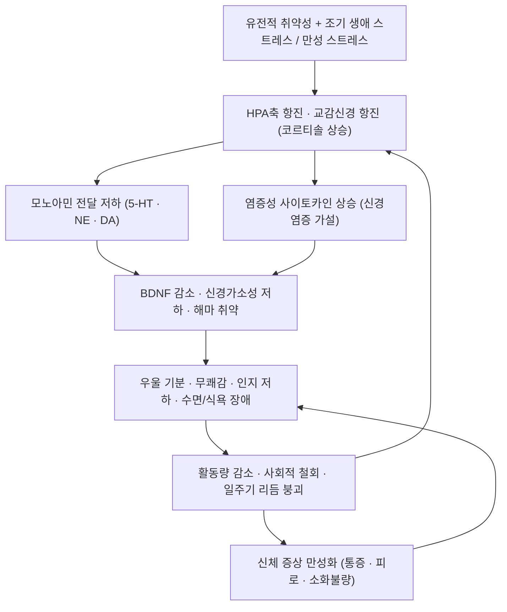

# 🩺 [[우울장애]] (Major Depressive Disorder / 鬱證, ICD-10 F32–F33)

![[우울장애_2_1.jpg|540]]
> [그림 1: ① 병태생리·영상 — 1511 The Limbic Lobe-vi.jpg]

> **핵심 3줄 요약 (Key Summary)**:
> - 📍 병소 부위 & 해부·병태생리: 특정 단일 병소가 아닌 **변연계–전전두엽 신경회로의 기능·구조 이상**이 핵심이다. [[전전두엽]], [[전대상피질]], [[편도체]], [[해마]], 시상하부([[HPA축]])와 뇌간 청반(NE)·등쪽 솔기핵(5-HT)·중뇌 도파민계가 얽혀 모노아민 전달 저하, 코르티솔 상승, BDNF·신경가소성 감소, 신경염증이 맞물린다.
> - 🚩 전형적 임상 양상 & 3대 징후: ① 2주 이상 지속되는 **우울 기분**, ② **흥미·즐거움 상실(무쾌감증)**, ③ **수면·식욕·활력 저하**를 축으로 인지 저하(집중력·기억력), 죄책감·무가치감, 정신운동 초조/지체, 반복적 자살사고가 동반된다.
> - 🛠️ 핵심 감별 검사 & 한·양방 다각적 치료 전략: [[PHQ-9]], [[HAM-D]], [[MADRS]] 척도 + [[C-SSRS]] 자살위험 평가, 갑상선·빈혈·약물/알코올 배제 검사. 한방은 변증에 따른 [[침]], [[약침]], [[추나]], [[한약]](逍遙散·歸脾湯 등) + 양방 SSRI/SNRI·CBT·rTMS/ECT 통합.
> - ⚠️ 응급 의뢰 레드플래그 & 악화 요인: 자살계획·수단 확보·과거 시도력, 정신병적 증상, 섬망/급성 내과질환, 카타토니아, 산후 정신증 의심, 항우울제 시작 후 **조증/경조증 전환** 시 즉시 정신건강의학과 의뢰. 알코올·벤조디아제핀 자가 증량, 극심한 수면 박탈, 사회적 고립은 절대적 악화 요인.

---

## 📌 목차
1. [질환 개요 & 해부학적 병태생리](#1-질환-개요--해부학적-병태생리)
2. [병태생리 메커니즘 & 생체역학적 악순환 네트워크](#2-병태생리-메커니즘--생체역학적-악순환-네트워크)
3. [임상 증상 & 이학적 검사(Physical Exam) 알고리즘](#3-임상-증상--이학적-검사physical-exam-알고리즘)
4. [감별 진단 매트릭스 (Differential Diagnosis)](#4-감별-진단-매트릭스-differential-diagnosis)
5. [한의 통합 치료 프로토콜 (침·약침·추나·한약)](#5-한의-통합-치료-프로토콜-침약침추나한약)
6. [재활 운동 & 생활습관 티칭 가이드](#6-재활-운동--생활습관-티칭-가이드)
7. [💡 사용자 진료실 핵심 필기 & 임상 노하우 (Melt-In 잔여 심화 집약)](#7--사용자-진료실-핵심-필기--임상-노하우-melt-in-잔여-심화-집약)
8. [출처 및 학술 참고 문헌 (References)](#8-출처-및-학술-참고-문헌-references)

---

## 1. 질환 개요 & 해부학적 병태생리

### 1) 질환 정의 및 분류

* **정의**: 우울장애는 **2주 이상 지속되는 우울 기분 또는 흥미·즐거움 상실**을 핵심으로 하며, 수면·식욕·활력·인지기능·정신운동에 변화가 동반되어 사회적·직업적 기능이 저하되는 **기분장애(mood disorder)** 군이다. 단순한 슬픔(애도)이나 일시적 기분 저하와 달리 **지속성·전반성·기능 저하**가 특징이다.
* **진단 기준(DSM-5 표준)**: 2주간 다음 9개 증상 중 **5개 이상**(최소 1개는 ① 우울 기분 또는 ② 흥미·즐거움 상실)이 거의 매일 나타나야 한다.
  1. 우울 기분  2. 흥미·즐거움 현저한 감소  3. 체중·식욕 변화  4. 불면 또는 과다수면  5. 정신운동 초조 또는 지체  6. 피로·활력 상실  7. 무가치감·과도한 죄책감  8. 집중력 저하·우유부단  9. 반복적 죽음 사고·자살사고·자살계획·자살시도
  * 단, 물질(약물·알코올)이나 다른 신체질환으로 설명되지 않아야 하며, 조증·경조증 삽화 병력이 있으면 [[양극성장애]]로 재분류한다.
* **진단 분류 체계**: ICD-10 및 국내 KCD(ICD-10 기반) 코드는 아래와 같다. ICD-11에서는 우울장애군이 별도 항목으로 재편되었다(참고 수준, 세부 코드는 최신 분류표 확인 필요).

| 분류 | ICD-10 / KCD | 핵심 기준 | 비고 |
| :--- | :--- | :--- | :--- |
| 주요우울장애, 단일 삽화 | **F32** | 2주 이상 우울 삽화 1회 | 경도/중등도/중증, 정신병적 양상 동반 여부로 세분 |
| 주요우울장애, 재발성 | **F33** | 2회 이상 삽화, 삽화 사이 관해기 존재 | 재발성은 유지치료 기간이 더 길다 |
| 지속성 우울장애(기분부전장애) | **F34.1** | **2년 이상**(소아청소년 1년) 대부분의 날 우울 | Schramm & Klein (2020) 리뷰 참조 |
| 파괴적 기분조절부전장애 | DSM-5 신설 | 소아청소년, 만성 과민·분노 폭발 | 성인에서는 진단되지 않음 |

* **역학적 특성**
  * **성비**: 여성이 남성보다 약 2배 흔한 것으로 보고된다(Belmaker & Agam, 2008).
  * **평생 유병률**: 약 15% 내외로 보고되나 연구 집단·진단도구에 따라 편차가 크다(Belmaker & Agam, 2008). **국내 정확한 유병률 수치는 근거 미확인**.
  * **호발 연령**: 20~30대에 첫 발병이 집중되며, 이후 재발성 경과를 밟는 경우가 많다. 노년기 첫 발병은 신체질환·약물·인지기능 저하와의 감별이 필수다.
  * **직업·사회적 특성**: 특정 직업군에 국한되지 않으나, 교대근무·야간근무·고강도 감정노동·고립된 근무환경은 일주기 리듬 교란과 사회적 지지 결핍을 통해 위험을 높이는 방향으로 작용한다(일반 임상 원칙, 개별 직업군별 위험도 수치는 근거 미확인).

### 2) 관련 해부학적 구조물 (신경계 중심 재구성)

우울장애는 근골격계 단일 병소 질환이 아니라 **뇌 신경회로 + 내분비축 + 자율신경 + 장뇌축**이 결합된 전신성 질환이다. 따라서 템플릿의 골격·근육 항목을 신경계·내분비 항목으로 치환해 정리한다.

* **대뇌피질 및 변연계 회로**
  * **전전두엽(Prefrontal Cortex)**: 부정 정서의 하향 조절(top-down inhibition) 담당. 기능 저하 시 반추·의사결정 곤란·무쾌감이 심화된다(Belmaker & Agam, 2008; Fava & Kendler, 2000).
  * **[[전대상피질]](Anterior Cingulate Cortex)**: 오류 감지·정서 조절·통증 인지에 관여. 우울증에서 기능 이상이 반복 보고되며, 침 치료 반응 연구의 주요 표적이기도 하다.
  * **[[편도체]](Amygdala)**: 위협·부정 자극에 대한 과반응. 우울 및 불안 동반 시 활성 증가 양상.
  * **[[해마]](Hippocampus)**: 스트레스·코르티솔 과다 노출에 취약하며 BDNF 감소와 함께 부피 감소가 보고된다. 기억·집중력 저하의 구조적 기반.
  * **시상·기저핵·섬엽(Insula)**: 정동-운동 통합, 신체 내수용감각(피로·통증·소화불량) 처리.
* **뇌간 및 신경전달물질 핵**
  * **청반(Locus Coeruleus)**: 노르에피네프린(NE) 기원. 각성·집중·스트레스 반응 조절.
  * **등쪽 솔기핵(Dorsal Raphe Nucleus)**: 세로토닌(5-HT) 기원. 기분·수면·식욕·충동 조절.
  * **중뇌(복측피개영역, VTA)–선조체 도파민계**: 보상·동기(무쾌감증의 핵심 회로).
* **내분비축**
  * **시상하부–뇌하수체–부신축(HPA axis)**: 만성 스트레스 시 코르티솔 분비 항진, 정상 음성되먹임 붕괴.
  * **갑상선축**: 갑상선기능저하증은 우울 증상을 모방하므로 반드시 감별.
* **자율신경계 및 장뇌축(Gut–Brain Axis)**
  * 교감신경 항진 및 부교감(미주신경) 긴장 저하 → 심계항진, 발한, 소화불량, 변비/설사.
  * 미주신경 자극은 항우울 효과가 보고된 비약물적 자극 경로로, 자율신경-염증 조절 기전과 연결된다(기전 수준, 임상 적용은 적응증 제한).
* **근골격계 동반 소견(임상 관찰)**
  * 경항부·승모근 긴장, [[측두하악관절]](TMJ) 긴장, 흉곽 호흡 저하로 인한 과호흡/어깨 상승 패턴이 흔히 동반된다. **이는 진료실 관찰 소견이며 우울장애의 진단적 소견은 아니다(근거 미확인)**.

---

## 2. 병태생리 메커니즘 & 생체역학적 악순환 네트워크

### 1) 모노아민 가설과 그 한계

* **핵심**: 세로토닌(5-HT)·노르에피네프린(NE)·도파민(DA) 신경전달의 기능 저하가 기분 저하·무쾌감·활력 저하를 유발한다는 가설. 레세르핀(모노아민 고갈제) 투여 시 우울 증상이 유발된다는 초기 관찰과, 항우울제가 시냅스 모노아민 농도를 올린다는 약리 기전이 근거였다(Belmaker & Agam, 2008; Fava & Kendler, 2000).
* **한계(중요)**: 항우울제는 투여 수 분 내에 시냅스 모노아민을 증가시키지만 **임상 효과는 수 주 후에 나타난다.** 이 시차는 모노아민 농도 자체보다 **하류의 수용체 적응·신경가소성 변화**가 치료 효과의 핵심임을 시사한다(Belmaker & Agam, 2008). 따라서 "세로토닌 부족 = 우울증"이라는 단순 도식은 현재 지지되지 않는다.

### 2) HPA축 항진과 코르티솔

* 만성 스트레스 상황에서 시상하부 CRH → 뇌하수체 ACTH → 부신 코르티솔 분비가 항진되고, 코르티솔에 의한 정상 음성되먹임이 약화된다.
* **덱사메타손 억제 검사(DST)**: 정상에서는 덱사메타손이 코르티솔을 억제하지만, 일부 중증 우울 환자에서 **비억제(non-suppression)** 소견이 보고되었다(Belmaker & Agam, 2008). 단, 민감도·특이도가 충분치 않아 **진단 검사로는 사용하지 않는다**.

### 3) 신경가소성·BDNF와 해마

* **BDNF(Brain-Derived Neurotrophic Factor)**는 신경세포 생존·시냅스 가소성의 핵심 인자로, 만성 스트레스 모델에서 감소하고 항우울 치료(약물·운동·전기경련요법 등) 후 증가하는 양상이 보고되었다(Belmaker & Agam, 2008).
* 해마를 비롯한 변연계 구조의 **부피 감소**가 군 수준(group-level)에서 반복 보고되며, 이는 신경가소성 저하·염증·HPA 항진과 연결된다. 단, **개별 환자 진단에 사용할 수 있는 민감도는 없다**.

### 4) 신경염증·사이토카인 가설

* 염증성 사이토카인 상승과 우울 증상의 연관이 제기되어 왔으며, 인터페론 등 사이토카인 치료 중 우울 증상이 유발되는 임상 관찰이 근거의 하나다(Belmaker & Agam, 2008).
* 단, **특정 사이토카인 프로파일(예: IL-6, TNF-α)은 연구별 이질성이 커서 확정적 바이오마커로 쓰이지 못한다(근거 수준: 중간, 근거 미확인 항목 포함)**.

### 5) 유전 취약성과 환경

* 가족연구·쌍둥이연구에서 유전적 기여가 확인되며, 유전율은 대략 30~40% 범위로 보고된다(Fava & Kendler, 2000). 나머지는 조기 생애 스트레스, 상실 경험, 만성 대인관계 갈등, 사회경제적 요인 등 환경적 요소가 담당한다.
* 즉 우울장애는 **단일 유전자 질환이 아니라 다유전자-환경 상호작용 질환**이다(Fava & Kendler, 2000).

### 6) 회로 수준 기전 (변연계–전전두엽 기능 연결)

* 편도체 과활성 + 전전두엽 조절 기능 저하라는 **불균형 모델**이 제시된다. 항우울제, 반복 경두개자기자극(rTMS), 전기경련요법(ECT)은 공통적으로 이 정동 회로의 기능을 재조정하는 방향으로 작용한다(Belmaker & Agam, 2008; Kasper, 2010).

### 7) 한의학적 병리 해석 (교과서 이론 — 논문 인용 아님)

* **七情傷(희·노·우·사·비·공·경)**, 특히 怒·思·憂·悲가 氣機를 울체시켜 **[[肝氣鬱結]]**을 형성한다.
* 氣滯가 지속되면 ① 氣鬱 → ② 痰鬱(담울) → ③ 火鬱(울화) → ④ 血鬱로 진행하며, 오랜 병증은 **[[心脾兩虛]]**, **[[肝腎陰虛]]**, **[[陰虛火旺]]** 등 허증으로 전환된다.
* 임상 표현: 胸脇脹滿(흉협창만), 善太息(한숨), 咽喉異物感(매핵기), 不眠·多夢, 食慾不振, 脈弦(현맥) 또는 脈細弱.

---

## 3. 임상 증상 & 이학적 검사(Physical Exam) 알고리즘

### 1) 주소증 및 신경학적 증상

* **정서 증상(핵심)**
  * 지속적 슬픔·공허감, **무쾌감증(anhedonia)**, 과도한 죄책감, 무가치감, 불안·초조 동반.
  * **자살사고**: "죽고 싶다", "사라졌으면 좋겠다" 등 표현. 계획·수단·시기·과거 시도력 유무가 위험도 결정의 핵심.
* **인지 증상**
  * 집중력·주의력 저하, 기억력 저하, 우유부단, 반추(rumination), 부정적 자동사고.
* **신체(자율신경·내분비) 증상**
  * **수면장애**: 입면 곤란 / 중도 각성 / **조기 각성(새벽 각성)**, 또는 과다수면.
  * **식욕·체중 변화**: 감소(흔함) 또는 증가.
  * **통증**: 두통, 요통, 근육통, 목·어깨 뻣뻣함. 우울증이 통증 역치를 낮추는 방향으로 작용.
  * 소화불량, 변비/설사, 성기능 저하, 월경 이상, 심계항진, 발한, 손발 냉감.
* **정신운동 증상**
  * 초조(안절부절, 손 비비기) 또는 지체(말 느림, 행동 느림, 표정 감소).
* **주의할 감별 포인트**
  * **양극성 삽화 여부를 반드시 확인**: 과거에 기분이 비정상적으로 고양되거나 짜증이 늘고, 수면이 줄어도 피로하지 않았던 시기가 있었는지(Hirschfeld, 2014).
  * **경계성 인격장애 감별**: 만성 공허감, 버림받음에 대한 극단적 두려움, 자해가 관계 사건과 연동되는 양상(Rao & Broadbear, 2019).
  * **지속성 우울장애 감별**: 2년 이상 "우울이 없는 날이 거의 없음" — 급성 삽화와 구분(Schramm & Klein, 2020).

### 2) 필수 이학적 검사법 (Physical Examination / 평가 알고리즘)

* **[[PHQ-9]] (Patient Health Questionnaire-9)**: 9개 항목 자가평가. 총점 0–27점.
  * 5–9 경도, 10–14 중등도, 15–19 중등도~중증, 20–27 중증으로 해석(표준 해석 기준). 치료 반응 추적에 가장 실용적.
  * 9번 문항(자살사고) 양성 시 반드시 추가 문진.
* **[[PHQ-2]] 스크리닝**: "지난 2주간 우울하거나 흥미가 떨어지셨나요?" 2문항. 진료실 1차 스크리닝용.
* **[[HAM-D]] / [[MADRS]]**: 임상가 평가 척도. 연구·중증도 판정에 사용.
* **[[BDI-II]]**: 자가평가, 인지증상 항목이 많음.
* **[[C-SSRS]] (Columbia Suicide Severity Rating Scale)**: 자살사고 심각도·강도 구조화 평가. 자살위험 관리 핵심 도구.
* **이학적 검사**
  * 활력징후(체중 감소 여부 확인), 갑상선 촉진 및 청진, 결막·피부색(빈혈), 신경학적 선별검사(지남력, 집중력, 보행).
  * **신체질환 감별이 목적**이며, 우울장애 자체를 확진하는 이학적 징후는 없다.
* **검사실 검사(감별 목적)**
  * **TSH, free T4**(갑상선기능이상), **CBC**(빈혈), 전해질·BUN/Cr, **간기능(AST/ALT)**, 공복혈당/HbA1c, **비타민 B12·엽산**(결핍 시 우울 증상), 비타민D, 필요시 코르티솔.
  * 젊은 여성의 경우 임신·산후 상태 확인(산후 우울 위험).
  * **소변 약물 스크리닝 / 알코올 사용 평가(AUDIT)**: 감별과 치료 계획에 결정적.
* **영상·특수검사**
  * 구조적 뇌 MRI: 통상 정상. 단, 노년기 첫 발병, 국소 신경학적 소견, 인지기능 급격 저하 시 치매·뇌졸중·종양 감별을 위해 시행.
  * DST·기능적 영상(fMRI/PET): 연구 목적. **임상 진단 도구로 권고되지 않음**(Belmaker & Agam, 2008).

---

## 4. 감별 진단 매트릭스 (Differential Diagnosis)

| 감별 질환 | 호발 병소 및 원인 | 주소증 차이점 | 특이적 감별 소견 |
| :--- | :--- | :--- | :--- |
| [[주요우울장애]] (본 질환) | 변연계–전전두엽 회로, 모노아민·HPA·신경가소성 이상 | 삽화성 경과, 무쾌감 + 우울 기분이 핵심 | 조증·경조증 병력 **없음**, PHQ-9 양성 |
| [[양극성장애]] | 정동 회로 조절 이상(조증–우울 순환) | 우울 삽화가 수개월~수년 지속, **비전형 증상**(과다수면·과식·기분반응성), 정신운동 지체 | 과거 **조증/경조증 삽화**, 항우울제 유발 조증, 양극성 가족력, 조기 발병(Hirschfeld, 2014) |
| [[지속성 우울장애]](기분부전장애) | 만성 경도 정동 조절 이상 | **2년 이상**(소아 1년) 대부분의 날 우울, 증상 강도는 상대적으로 경하지만 만성적 | 삽화성 관해기가 뚜렷하지 않음(Schramm & Klein, 2020) |
| [[경계성 인격장애]] | 정동·충동 조절 회로 + 대인관계 취약성 | 만성 공허감, **버림받음에 대한 극단적 두려움**, 관계 사건에 따른 급격한 정동 변동, 반복적 자해 | 정체성 혼란, 해리성 증상, 관계 패턴의 전형성(Rao & Broadbear, 2019) |
| [[적응장애]](우울형) | 명확한 심리사회적 스트레스원 | 스트레스원 발생 **3개월 이내** 시작, 스트레스원 제거 후 6개월 내 소실 | 스트레스원과의 시간적 연관성이 진단 열쇠 |
| 갑상선기능저하증 | 갑상선 | 피로·체중 증가·추위 민감·우울 | TSH 상승, free T4 저하 |
| 빈혈 / 영양결핍 | B12·엽산·철 결핍 | 피로·집중력 저하·무쾌감 | CBC, B12, 엽산, 페리틴 |
| 약물·알코올 유발성 기분장애 | 물질 | 음주·진정제·일부 스테로이드/인터페론 등 사용과 시간적 연관 | 약물력 청취, 소변 독성검사, 감량/중단 후 경과 |
| [[신경퇴행질환]](파킨슨병·치매) | 기저핵·피질 | 무쾌감·무기력·인지 저하가 두드러짐 | 운동 증상(진전·경직), 인지기능 검사, 뇌영상 |
| [[조현병]](음성증상) | 도파민계 이상 | 정동 둔마·사회적 철회가 우울과 유사 | 망상·환각 등 정신병적 증상, 사고 장애 |
| 애도 반응 | 상실 사건 | 상실감에 초점, 자기비하·죄책감이 상대적으로 약함 | 시간 경과에 따른 자연 회복, 기능 유지 |

> **임상 팁**: 단극성 우울장애로 진단받은 환자 중 상당수가 실제로는 양극성장애일 수 있어, **항우울제 단독 투여가 조증 전환·급속순환을 유발**할 수 있다. 첫 방문에서 조증 선별 질문을 반드시 시행해야 한다(Hirschfeld, 2014).

---

## 5. 한의 통합 치료 프로토콜 (침·약침·추나·한약)

> 아래 한의 치료 내용은 **한의학 교과서·임상 관행에 기반한 내용**이며, 제공된 정신의학 논문들은 침·약침·한약의 효과를 직접 검증한 연구가 아니다. 따라서 각 항목의 **근거 수준은 별도 표기**하며, 효과 크기에 대한 확정적 수치는 **근거 미확인**이다.

### 1) 침구 치료 (Acupuncture)

* **목표**: 調神(정신 안정), 疏肝解鬱, 健脾養心, 자율신경 균형 회복.
* **주요 혈위**
  * **정신 안정·조신**: [[백회]](GV20), [[사신총]](EX-HN1), [[인당]](EX-HN3), [[신문]](HT7), [[신도]](GV11)
  * **소간이기·해울**: [[태충]](LR3), [[기문]](LR14), [[장문]](LR13), [[양릉천]](GB34)
  * **건비안신(수면·식욕)**: [[삼음교]](SP6), [[족삼리]](ST36), [[중완]](CV12), [[기해]](CV6), [[내관]](PC6)
  * **배수혈**: [[심수]](BL15), [[간수]](BL18), [[비수]](BL20), [[신수]](BL23), [[궐음수]](BL14)
* **전침(Electroacupuncture) 세팅**
  * **2 Hz** 위주(진정·항불안·내분비 조절 목적)로 백회–인당, 신문–삼음교 등에 연결. 20~30분 유지가 일반적이다.
  * 혼합 주파수(2/100 Hz 교대)는 통증 동반 우울에 적용하는 방식으로, **프로토콜별 최적 주파수는 연구 이질성이 크다(근거 미확인)**.
* **두침(頭鍼)**
  * 정신감정구, 백회–인당선(전두부). 자침 깊이·각도는 두피 층에 맞추어 시행하고, 시술 중 어지럼 발생 시 즉시 중단.

### 2) 약침 치료 (Pharmacopuncture)

* **적용 원칙**: 경항부 근긴장·자율신경 항진 완화 목적의 **경추 주변 근막(견정·천주·풍지 주변)** 및 배수혈(심수·간수·신수), 이혈(신문·교감·내분비).
* 후보 약침: 丹參, 柴胡, 甘麥大棗 계열 등 — **구체적 약침 종류 및 용량에 대한 임상 근거는 미확인**이며, 원내 프로토콜·약침학 교과서 기준을 따른다.
* **주의**: 항응고제 복용자, 임산부, 국소 감염·피부 병변 부위는 금기. 자율신경 반응(어지럼·실신) 예방을 위해 **앙와위 시술**을 원칙으로 한다.

### 3) 추나 치료 (Chuna Manipulation)

* **목적**: 경항부·흉추 이완을 통한 교감신경 항진 완화, 흉곽 호흡 확보, 통증성 신체 증상 완화.
* **기법**
  * 경항부·견갑거근·승모근 상부 **근막 이완(JS 계열) 수기**.
  * 흉추 신전 가동, 늑골 운동 확보(복식호흡 유도).
  * 호흡 유도 + 이완 수기 결합.
* **금기·주의**
  * **강한 경추 회전 도수(급격한 상위경추 회전)는 추골동맥 손상 위험으로 절대 금기**로 취급한다.
  * 골다공증, 경추 불안정성, 급성 추간판 탈출, 종양·감염 의심 시 금기.
* **주의**: 추나가 우울장애 자체의 병태생리를 직접 교정한다는 근거는 **미확인**이며, 주로 **동반 근골격계 증상·자율신경 긴장 완화를 통한 보조 요법**으로 위치시킨다.

### 4) 한약 치료 (Herbal Medicine)

* **변증별 처방(한의학 교과서 기준)**

| 변증 | 주요 증상 | 대표 처방 |
| :--- | :--- | :--- |
| 肝氣鬱結 | 흉협창만, 잦은 한숨, 억울·분노, 脈弦 | **逍遙散**, **柴胡疏肝散** |
| 肝鬱化火 | 초조·홍조·불면·구고, 설홍 태황 | **丹梔逍遙散**, **龍膽瀉肝湯** |
| 痰氣鬱結(梅核氣) | 목 이물감, 답답함, 흉민 | **半夏厚朴湯** |
| 心脾兩虛 | 과로·걱정 후 악화, 식욕 저하, 건망, 脈細弱 | **歸脾湯**, **歸脾湯加減** |
| 心膽虛怯 | 잘 놀람, 불안, 불면 | **安神定志丸**, **甘麥大棗湯** |
| 陰虛火旺 | 오심번열, 도한, 불면, 舌紅少苔 | **天王補心丹**, **黃連阿膠湯** |
| 痰熱內擾 | 불면·번조·가슴 답답, 태황니 | **溫膽湯** |

* **급성기(울체·화·담)**: 疏肝理氣·淸熱化痰 위주 — 柴胡劑 중심.
* **만성기(허증)**: 補益心脾·滋陰安神 위주 — 歸脾湯·天王補心丹 계열.
* **상호작용 주의**: 한약-양방 항우울제 병용 시 어지럼·소화기 증상·출혈 경향 등을 관찰하며, **MAOI 계열 복용 환자에서의 병용은 근거가 없어 원칙적으로 피하고 반드시 처방 의사와 협의**한다.

### 5) 양방 협진 및 치료 단계 (통합 프로토콜)

* **경도~중등도**: 심리치료(CBT, 대인관계치료 IPT) ± 항우울제, 생활습관 교정 + 한방 치료 병행 가능.
* **중등도~중증**: SSRI/SNRI 등 항우울제 1차 선택, 필요시 증량·교체·증강(augmentation). 반응 없으면 rTMS, ECT, 에스케타민 등 고려(Belmaker & Agam, 2008; Kasper, 2010).
* **치료반응 평가**: **2주 간격 PHQ-9**, 4~6주 시점에서 반응(증상 50% 이상 감소) 여부 평가가 일반적이다.
* **TRD(치료저항성 우울증)**: 2개 이상의 적절한 항우울제 시도에도 반응이 없을 때 개념화하며, 이 경우 한방 치료는 **보조 요법**으로 위치시키고 정신건강의학과 협진을 유지한다.
* ⚠️ **항우울제 시작 후 2~4주 내 기분 고양·수면 감소·충동성 증가 발생 시 즉시 의뢰**(조증 전환 의심).

---

## 6. 재활 운동 & 생활습관 티칭 가이드

* **유산소 운동 (Aerobic Exercise)**
  * 주 3~5회, 1회 30분 내외의 중등도 유산소 운동(빠르게 걷기, 자전거, 수영). BDNF 상승·일주기 리듬 정상화·수면 개선과 연결된다는 기전이 제시되나, **효과 크기는 연구별 이질적이다(근거 수준: 중등도)**.
  * 무쾌감이 심한 환자에게는 "기분이 좋아져서 운동하는 것이 아니라, 운동을 해야 기분이 따라온다"는 프레이밍이 순응도를 높인다.
* **이완 및 스트레칭 (Stretching)**
  * 경항부·승모근·흉곽 스트레칭 각 20~30초 × 3회, 하루 1~2세트.
  * **복식호흡(調息)**: 4초 흡기 – 6초 호기, 5분. 교감신경 항진 완화 목적.
* **강화 및 안정화 운동 (Strengthening)**
  * 견갑 안정화(하부 승모근·전거근), 심부 경추 굴곡근 강화. 라운드숄더·거북목 교정은 통증성 신체 증상 완화에 기여.
  * 노인 환자에서는 낙상 예방을 위한 하지 근력 운동 병행.
* **일주기 리듬·광노출 (Chronotherapy)**
  * **기상 시간 고정**(주말 포함)이 가장 중요하다.
  * 아침 햇빛 20~30분(가능하면 오전 7~9시). 계절성 양상이 뚜렷한 경우 광치료(light therapy) 고려.
  * 야간 블루라이트 노출 최소화(취침 1~2시간 전 스크린 줄이기).
* **수면위생 (Sleep Hygiene)**
  * 침대는 잠과 성생활에만 사용. 잠들지 못한 채 20분이 지나면 일어나 조용한 활동 후 다시 눕기.
  * 낮잠은 30분 이하, 오후 3시 이후 금지.
  * 카페인은 오후 2시 이후 금지, 알코올은 수면 유지기 각성을 유발하므로 취침 전 음주 금지.
* **행동 활성화(Behavioral Activation)**
  * "동기 → 행동"이 아니라 **"행동 → 동기"** 원리로, 아주 작은 성취 과제(5분 산책, 설거지 3개)부터 단계적으로 배치.
* **마음챙김·반추 관리**
  * MBSR/명상 10분, 걱정 시간 정하기(우려 시간 제한 기법). 반추는 우울 유지의 핵심 기전이므로 적극 개입.
* **물질 관리**
  * 알코올·니코틴·카페인 과다, 진정제 자가 증량 금지. 약물 남용은 치료 반응을 소실시킨다.
* **사회적 연결·보호자 교육**
  * 주 1회 이상 대면 접촉 유지, 사회적 활동 최소 1개 지속.
  * 보호자에게 **자살 위험 신호(유서 작성, 물건 정리, 갑작스러운 안정감, 약물·수단 접근)**와 위험 물품(농약, 다량의 진정제) 관리 방법을 교육.
* **재발 방지**
  * 관해 후에도 **최소 6~12개월 유지치료**가 재발률 감소와 연관된다는 것이 표준 지침의 입장이다(재발성 삽화 병력이 있으면 더 길게).
  * 재발 조기 신호(수면 시간 감소, 짜증 증가, 흥미 저하)를 환자 스스로 목록화하도록 티칭.

---

## 7. 💡 사용자 진료실 핵심 필기 & 임상 노하우 (Melt-In 잔여 심화 집약)

* **상부 섹션에 미처 다 담지 못한 고유 원문 필기**
  * 우울장애 환자는 **"몸이 아프다"는 주소증으로 한의원에 먼저 온다.** 두통, 소화불량, 만성 피로, 목·어깨 통증, 불면을 주소로 내원한 환자에서 PHQ-2를 습관적으로 물으면 숨어 있던 우울장애를 건져낼 수 있다. 즉 **신체 증상이 곧 우울장애의 진입 창구**다.
  * 치료 반응이 더딘 환자일수록 **"내가 노력하지 않아서"**라는 자기비하가 깔려 있다. 이때 생활습관 교육을 "해야 할 일 목록"으로 주면 오히려 무력감이 강화된다. **한 번에 하나, 아주 작게**가 원칙이다.
  * 한의학적으로 우울장애는 **鬱證** 범주이지만, 임상에서는 ① 肝鬱(실증, 젊은 층·분노·억울)과 ② 心脾兩虛(허증, 중년 여성·과로·걱정) 두 축으로 크게 나누어 접근하면 처방 선택이 빠르다. ③ 陰虛火旺(갱년기·노년·불면·도한)은 별도 축으로 관리한다.
  * **불면의 유형이 변증 단서**다. 입면 곤란 + 초조 → 肝鬱化火 / 조기 각성 + 무기력 → 心脾兩虛·陰虛 / 과다수면 + 무거움 → 痰濕.

* **진료실 실전 감별 & 치료 노하우**

  1. **실전 문진 체크리스트 (첫 방문 5분)**
     - [ ] 증상이 **2주 이상** 지속되었는가? (PHQ-2 두 문항)
     - [ ] **수면 유형**: 입면 곤란 / 중도 각성 / 조기 각성 / 과다수면?
     - [ ] **식욕·체중**: 감소인가 증가인가?
     - [ ] **자살사고**: "죽고 싶다는 생각이 드신 적 있나요? 계획이나 방법을 생각해 보신 적은요?" → **직접 물어도 자살을 유발하지 않는다.** 안심하고 질문할 것. 단, 긍정이면 계획·수단·시기·과거 시도력을 반드시 캐물을 것.
     - [ ] **조증 선별 3문항(Hirschfeld, 2014 기반)**: ① 기분이 평소와 다르게 들떠서 몇 날 며칠 지속된 적? ② 잠을 거의 안 자도 피곤하지 않았던 적? ③ 평소와 다르게 충동적 소비·모험·활동 증가가 있었나?
     - [ ] **가족력**: 우울증·양극성장애·자살.
     - [ ] **신체질환·복용약**: 갑상선, 빈혈, 스테로이드·인터페론, 피임약.
     - [ ] **음주량·수면제 사용** (AUDIT 또는 단순 음주력).
     - [ ] **산후 여부 / 폐경 전후 여부** (호르몬 전환기 취약).

  2. **치료 순서 및 손맛 노하우**
     - **1단계 – 신뢰 형성**: 첫 회에는 자침을 최소화하고 충분히 들어주는 것을 우선한다. 우울장애 환자는 "몸의 증상"이 아니라 "이야기"를 들으러 온 경우가 많다.
     - **2단계 – 수면 교정**: 수면이 먼저 잡히면 다른 증상이 따라 좋아진다. 신문(HT7)·삼음교(SP6)·백회(GV20) 중심으로 시작.
     - **3단계 – 자율신경 이완**: 경항부·흉추 추나 이완(JS) 후 복식호흡 유도. **경추 강회전 수기는 절대 금지**.
     - **4단계 – 전침·약침**: 환자가 이완된 상태에서 시술. 전침은 2 Hz 위주, 20분.
     - **5단계 – 한약**: 변증 확정 후 처방. 초진에서 변증이 애매하면 逍遙散 계열로 시작해 2주 후 반응을 보고 조정하는 방식이 실전적이다.
     - **시술 안전**: 우울장애 환자는 기립성 저혈압·실신 경향이 있으므로 **자침·약침 후 천천히 일어나도록 5분간 앙와위 유지**를 습관화. 시술 중 어지럼 호소 시 즉시 중단.
     - **양방 병용 확인**: 항우울제 복용 환자에게는 한약 처방 전 **복용 중인 약물 목록을 반드시 확인**하고, 변경은 처방 의사와 협의한 뒤에 한다.

  3. **환자 티칭 스크립트**
     - **정의 설명**: "우울증은 의지가 약해서 생기는 게 아니라, 뇌의 신경회로와 스트레스 호르몬, 염증 물질이 함께 어긋나면서 생기는 병입니다. 그래서 '마음을 먹는다'로 해결되지 않고, 치료가 필요합니다."
     - **치료 기간 설명**: "약이나 침은 보통 **4~6주부터** 효과가 나타나고, 그 전에는 조금씩만 좋아지는 게 정상입니다. 한두 번으로 판단하지 마세요."
     - **재발 방지**: "증상이 다 좋아져도 **6개월~1년은 유지치료**가 필요합니다. 여기서 스스로 끊으면 재발이 가장 많습니다."
     - **수면 티칭**: "잠은 기상 시간을 고정하는 것부터 시작합니다. 주말에도 같은 시간에 일어나세요. 잠이 안 와서 20분 넘게 누워 계시면, 일어나서 조용히 있다가 다시 눕는 게 오히려 낫습니다."
     - **운동 티칭**: "기분이 좋아져서 운동하는 게 아니라, 운동을 해야 기분이 따라옵니다. 5분만 걸어도 시작입니다."
     - **보호자 스크립트**: "죽고 싶다는 말을 하면 '그런 말 하지 마라'고 하기보다, **'얼마나 힘들면 그런 생각까지 했을까'**라고 받아주시고 그 자리에서 혼자 두지 마세요. 그리고 위험한 약이나 물건은 환자 손 닿지 않는 곳에 두세요."
     - **금기 티칭**: "술은 잠을 깨우고 약효를 떨어뜨립니다. 수면제를 스스로 늘리지 마세요."

  4. **의뢰 기준(진료실 판단)**
     - 자살사고 + 계획 또는 수단 접근 가능성 → **즉시 정신건강의학과/응급의뢰**, 혼자 귀가시키지 않음.
     - 정신병적 증상(망상·환각), 섬망 의심, 카타토니아, 급격한 체중 감소 진행 → 즉시 의뢰.
     - 4~6주 치료에도 PHQ-9 무변화 또는 악화 → 협진 의뢰.
     - 조증 삽화 과거력 또는 항우울제 시작 후 조증 양상 → 즉시 협진.

---

## 8. 출처 및 학술 참고 문헌 (References)

> 아래 문헌은 이 노트에 제공된 실제 PubMed 데이터이며, 본문에서 인용한 내용의 출처다. 진단분류(DSM-5, ICD-10/KCD) 및 한의 변증·처방 내용은 표준 진단체계·한의학 교과서에 기반한 것으로, 아래 논문 인용과 구분하여 서술하였다.

1. **Belmaker RH, Agam G (2008)**. *Major depressive disorder*. **N Engl J Med**, 358(1), 55–68. **PMID: 18172175**
   - **[연구 요약]**: 주요우울장애 전반을 다룬 대표적 종설. 모노아민 가설과 그 **한계**(항우울제의 임상 효과 지연), HPA축 항진 및 덱사메타손 억제검사(DST) 소견, BDNF·신경가소성 및 해마 관련 변화, 사이토카인·염증 가설, 유전·역학, SSRI/SNRI·ECT 등 치료 전략을 포괄적으로 정리하였다. 본 노트의 병태생리 2장 대부분과 치료 개요의 근거.

2. **Fava M, Kendler KS (2000)**. *Major depressive disorder*. **Neuron**, 28(2), 335–341. **PMID: 11144343**
   - **[연구 요약]**: 우울장애의 신경생물학적 기반과 유전-환경 상호작용을 정리한 리뷰. 가족·쌍둥이 연구를 통한 유전적 기여(유전율 약 30~40% 수준으로 보고됨)와 신경전달물질·신경회로 기전, 항우울 치료의 작용 기전을 논하였다.

3. **Hirschfeld RM (2014)**. *Differential diagnosis of bipolar disorder and major depressive disorder*. **J Affect Disord**, 169 Suppl 1, S12–S16. **PMID: 25533909**
   - **[연구 요약]**: 양극성장애와 주요우울장애의 감별 진단을 다룬 리뷰. 우울 삽화 환자에서 양극성장애를 놓칠 경우 항우울제 단독 투여가 조증 전환·급속순환을 유발할 수 있음을 강조하고, **조기 발병, 양극성 가족력, 비전형 증상(과다수면·과식·기분반응성), 정신운동 지체, 산후 및 계절성 발병** 등 감별 단서를 제시하였다.

4. **Schramm E, Klein DN (2020)**. *Review of dysthymia and persistent depressive disorder: history, correlates, and clinical implications*. **Lancet Psychiatry**, 7(9), 801–812. **PMID: 32828168**
   - **[연구 요약]**: 기분부전장애(dysthymia)와 지속성 우울장애(PDD)의 역사적 개념 변천, 진단 기준(**성인 2년, 소아청소년 1년 이상**의 만성 경과), 동반 질환·기능 저하 양상, 심리치료 및 약물 치료의 임상적 함의를 정리하였다.

5. **Kasper S (2010)**. *Depressive disorder*. **World J Biol Psychiatry**, 11(2 Pt 2), 123–125. **PMID: 20146647**
   - **[연구 요약]**: 우울장애의 질환 개요와 치료 접근을 요약한 논고. 우울장애의 이질성, 진단·평가의 중요성, 항우울 치료 전략 및 반응 평가의 기본 틀을 다루었다.

6. **Rao S, Broadbear J (2019)**. *Borderline personality disorder and depressive disorder*. **Australas Psychiatry**, 27(6), 549–553. **PMID: 31573324**
   - **[연구 요약]**: 경계성 인격장애(BPD)와 우울장애의 중첩과 감별을 다룬 리뷰. 만성 공허감, 버림받음에 대한 극단적 두려움, 대인관계 사건과 연동된 정동 변동, 반복적 자해 등 BPD의 특징적 양상이 우울 삽화와 어떻게 구분되는지, 그리고 두 질환이 공존할 때의 치료적 고려를 논하였다.

---

> [!NOTE]
> **표기 규칙**: 본 노트에서 "근거 미확인"으로 표시한 항목은 제공된 논문 및 통상적 교과서 범위에서 확정적 수치·기전을 확인할 수 없는 내용이다. 임상 적용 시 최신 진단기준(DSM-5-TR, ICD-11)과 기관 프로토콜을 함께 확인할 것.