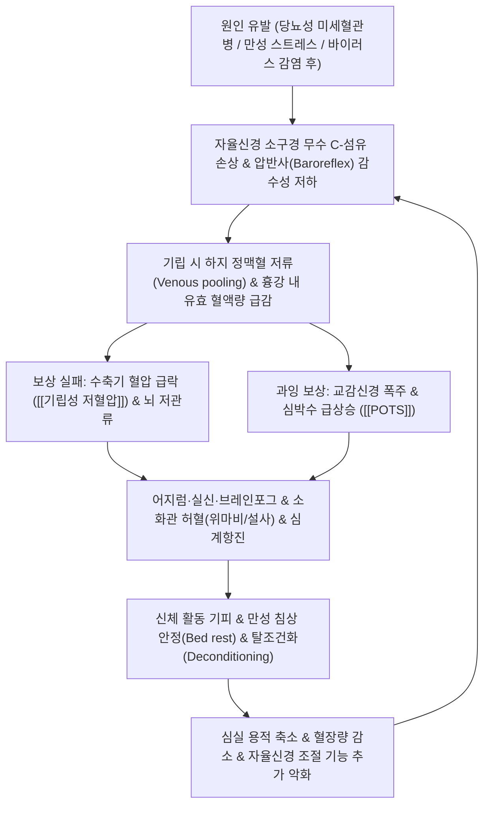

# 🩺 [[자율신경계 실조증]] (Dysautonomia / Autonomic Dysfunction, 自律神經失調症, G90.9)

> **핵심 3줄 요약 (Key Summary)**:
> - 📍 **병소 부위 & 해부·병태생리**: 시상하부·뇌간 고립로핵([[NTS]]) 중추 및 척수 측각(Intermediolateral cell column), 교감신경절간체와 [[미주신경]](CN X)을 포함하는 자율신경계의 조절 실패로 심혈관·소화기·비뇨생식기·체온조절 등 불수의적 생체 항상성(Homeostasis)이 붕괴된 임상 증후군.
> - 🚩 **전형적 임상 양상 & 3대 징후**: 기립 시 뇌혈류 저하로 인한 어지럼·실신(기립성 저혈압) 또는 과도한 심계항진([[기립성 빈맥 증후군]], POTS), 식후 조기포만감·오심·변비/설사 교대의 위장관 운동장애, 체온조절 이상(무한증/다한증, 열 불내성) 및 만성 피로.
> - 🛠️ **핵심 감별 검사 & 한·양방 다각적 치료 전략**: 10분 능동 기립검사(Active stand test) 및 [[심박변이도]](HRV, LF/HF 비율 분석), 경추-흉추 교감신경절 분절 [[추나요법]], [[백회]](GV20)·[[내관]](PC6)·[[신문]](HT7)·[[족삼리]](ST36) 전침 및 미주신경 자극 [[이침]](Auricular acupuncture), 심비양허·간기울결 변증 한약([[귀비탕]], [[시호가용골모려탕]], [[보중익기탕]]).
> - ⚠️ **응급 의뢰 레드플래그 & 악화 요인**: 실신(Syncope)을 동반한 치명적 부정맥, 급격히 진행하는 양측성 상하지 위약(길랭-바레 증후군 의심), 파킨슨 증상 및 소뇌 실조가 조기에 겹치는 다계통위축증([[MSA]]) 의심 시 신경과/심장내과 즉각 전원; 고온 사우나 및 급격한 체위 변경 엄격 금기.

---

## 📌 목차
1. [질환 개요 & 해부학적 병태생리](#1-질환-개요--해부학적-병태생리)
2. [병태생리 메커니즘 & 생체역학적 악순환 네트워크](#2-병태생리-메커니즘--생체역학적-악순환-네트워크)
3. [임상 증상 & 이학적 검사(Physical Exam) 알고리즘](#3-임상-증상--이학적-검사physical-exam-알고리즘)
4. [감별 진단 매트릭스 (Differential Diagnosis)](#4-감별-진단-매트릭스-differential-diagnosis)
5. [한의 통합 치료 프로토콜 (침·약침·추나·한약)](#5-한의-통합-치료-프로토콜-침약침추나한약)
6. [재활 운동 & 생활습관 티칭 가이드](#6-재활-운동--생활습관-티칭-가이드)
7. [💡 사용자 진료실 핵심 필기 & 임상 노하우 (Melt-In 잔여 심화 집약)](#7--사용자-진료실-핵심-필기--임상-노하우-melt-in-잔여-심화-집약)
8. [출처 및 학술 참고 문헌 (References)](#8-출처-및-학술-참고-문헌-references)

---

## 1. 질환 개요 & 해부학적 병태생리

![[자율신경계 실조증_1.png|450]]
> [그림 1: ① 질환/병태생리 메디컬 일러스트 — 교감·부교감신경 분포와 표적 장기를 정리한 인체 자율신경계 도해]

### 1) 질환 정의 및 임상적 개념
자율신경계 실조증([[Dysautonomia]], Autonomic dysfunction, ICD-10 G90.9)은 인체의 불수의적인 생명 유지 기능(혈압, 맥박, 체온, 소화, 발한, 동공 반사 등)을 자율적으로 조율하는 교감신경계(Sympathetic nervous system)와 부교감신경계(Parasympathetic nervous system) 사이의 동적 균형이 무너지며 전신 다장기 기능 부전을 일으키는 임상 증후군이다.

단일 질병 단위라기보다는 다양한 원인에 의해 발생하는 포괄적 병태생리 상태를 가리키며, 원발성과 속발성으로 대별된다.
* **원발성(Primary)**: 순수 자율신경부전(Pure autonomic failure, PAF), 다계통위축증(Multiple system atrophy, MSA), 파킨슨병 및 루이소체 치매 등 신경퇴행성 α-시누클레인병증(Synucleinopathies)의 일환으로 발생.
* **속발성(Secondary)**: [[당뇨병]](당뇨병성 자율신경병증, 가장 흔함), 자가면역 질환(쇼그렌 증후군, 전신홍반루푸스), 만성 감염 후 상태(Long-COVID 자율신경병증), 알코올 중독, 항암화학요법제 등 약물 부작용.
* **기능성/조절성 장애**: 구조적 신경 파괴 없이 자율신경 반사 회로의 과민성으로 유발되는 [[기립성 빈맥 증후군]](POTS), 혈관미주신경성 실신(Vasovagal syncope).

### 2) 자율신경계의 해부학적 제어 축
* **중추 자율신경망(Central Autonomic Network, CAN)**:
  * 대뇌 피질(섬엽, 전대상피질), 편도체, 시상하부(Hypothalamus, 자율신경 최고 사령탑), 뇌간 연수의 고립로핵(Nucleus tractus solitarius, NTS)과 복외측연수(VLM).
* **교감신경계 (흉요수계, Thoracolumbar system, T1~L2)**:
  * 척수 흉요추 측각(IML)에서 기원하여 척추옆 교감신경절간체(Sympathetic chain ganglia)를 통해 전신 혈관 평활근, 심장, 기관지, 부신 수질로 투사 (신경전달물질: 아세틸콜린 $\rightarrow$ 노르에피네프린).
  * 투쟁-도피(Fight-or-Flight) 반응: 심박수 증가, 혈압 상승, 동공 산대, 말초혈관 수축.
* **부교감신경계 (두천수계, Craniosacral system)**:
  * 뇌간 뇌신경 운동핵(CN III 동안, VII 안면, IX 설인, **X 미주신경**) 및 천수(S2~S4) 척수에서 기원.
  * 휴식-소화(Rest-and-Digest) 반응: 심박수 감소, 소화관 연동운동 항진, 분비 촉진 (신경전달물질: 아세틸콜린 $\rightarrow$ 무스카린 수용체).

---

## 2. 병태생리 메커니즘 & 생체역학적 악순환 네트워크

![[자율신경계 실조증_2.png|450]]
> [그림 2: ② 관련 해부학적 구조물 — 경동맥동 및 대동맥궁 압반사(Baroreceptor reflex) 조절 회로 흐름도]

### 1) 혈역학적 압반사(Baroreflex) 부전과 기립 불내성
* 사람이 누워 있다가 일어서면 중력에 의해 약 500~800ml의 혈액이 복강 내장혈관계(Splanchnic bed)와 하지 정맥망으로 순간 이동한다.
* 정상인에서는 경동맥동(Carotid sinus)과 대동맥궁의 압수용기가 이를 즉각 감지하여 연수 NTS로 신호를 보내고, **부교감신경 톤을 억제하며 교감신경 톤을 급격히 상승**시켜 말초 세동맥을 수축시키고 심박수를 분당 10~15회 올려 혈압을 유지한다.
* 자율신경 실조증에서는 압반사 회로가 파괴되거나 반응 속도가 지연되어, 기립 시 수축기 혈압이 20mmHg 이상 또는 이완기 혈압이 10mmHg 이상 급락하는 **기립성 저혈압(Orthostatic Hypotension, OH)**이 발생하거나, 혈압 저하 없이 분당 심박수가 30bpm 이상(10분 이내) 폭발적으로 치솟는 **기립성 빈맥 증후군([[POTS]])**이 발생한다.

### 2) 탈조건화(Deconditioning)의 생체역학적 악순환
* 기립 불내성과 어지럼을 겪는 환자는 본능적으로 눕거나 앉아서 지내는 시간이 길어진다.
* 지속적인 신체 활동 결여는 심장 좌심실의 리모델링(심근 위축 및 용적 감소)을 유발하고 체내 총 순환 혈장량을 10~20% 감소시킨다. 이 탈조건화 상태는 기립 시 정맥 환류량을 더욱 떨어뜨려 자율신경계에 더 극단적인 과부하를 강요하는 치명적 악순환을 형성한다.

---

## 3. 임상 증상 & 이학적 검사(Physical Exam) 알고리즘

### 1) 다기관 자율신경 부전의 4대 핵심 증상 영역
* **심혈관계 (Cardiovascular)**:
  * 일어설 때 핑 도는 기립성 어지럼, 눈앞이 캄캄해지는 암몽(Blackout), 실신 전조.
  * 가만히 서 있을 때 가슴이 두근거리고 숨이 차는 심계항진, 흉부 답답함.
* **소화기계 (Gastrointestinal)**:
  * 위운동 저하로 인한 식후 조기 포만감, 더부룩함, 오심, 구토(위마비 증상).
  * 장관 연동운동 불균형으로 인한 복통, 만성 변비와 폭발성 설사의 교대(과민대장증후군 유사).
* **비뇨생식기계 (Genitourinary)**:
  * 방광 감각 저하, 배뇨 지연, 요저류 또는 빈뇨·절박뇨(신경인성 방광).
  * 남성의 발기부전 및 역행성 사정.
* **체온 및 분비 조절 (Sudomotor & Vasomotor)**:
  * 발한 이상: 상체나 얼굴의 병적인 식은땀(보상성 다한증) 또는 하지의 완전한 무한증.
  * 열 불내성(Heat intolerance): 더운 환경이나 따뜻한 샤워 시 혈관이 이완되며 증상 급격 악화, 수족냉증 및 청색증.

### 2) 필수 이학적 검사 프로토콜
* **10분 능동 기립 검사 (Active Stand Test) — ★진료실 1차 선별 검사**:
  * 환자를 10분간 편안히 앙와위로 눕힌 후 안정기 혈압과 심박수 측정.
  * 환자를 스스로 일어서게 한 후 1분, 3분, 5분, 10분에 혈압과 심박수를 연속 측정.
  * **판정 기준**:
    * 기립성 저혈압(OH): 기립 3분 이내 수축기 혈압 $\ge 20\text{ mmHg}$ 또는 이완기 혈압 $\ge 10\text{ mmHg}$ 하강.
    * POTS: 기립 10분 이내 혈압 강하 없이 심박수가 기저치 대비 $\ge 30\text{ bpm}$ 증가 (청소년은 $\ge 40\text{ bpm}$) 하거나 절대 심박수 $\ge 120\text{ bpm}$ 도달.
* **[[심박변이도]] 검사 (Heart Rate Variability, HRV)**:
  * SDNN(전반적 자율신경 적응력), RMSSD(부교감신경 활성도), LF/HF 비율(교감-부교감 밸런스)을 분석하여 신경 톤 평가.

---

## 4. 감별 진단 매트릭스 (Differential Diagnosis)

| 감별 질환 | 주요 병태생리 | 기립 시 심박/혈압 반응 | 주소증 및 동반 특징 | 핵심 감별점 |
| :--- | :--- | :--- | :--- | :--- |
| **[[자율신경계 실조증]]** (본 질환) | 교감·부교감 전반의 조절 부전 | 기립성 저혈압 또는 빈맥 | 소화기, 비뇨기, 발한 이상 다장기 복합 침범 | 활력징후 변동 + 다기관 자율신경 증상 |
| **[[기립성 빈맥 증후군]] (POTS)** | 혈관 수축 부전 및 보상성 빈맥 | **혈압 저하 없이 심박수 $\ge 30\text{ bpm}$ 급증** | 젊은 여성 호발, 브레인포그, 만성 피로 | 실신은 드묾, 기립 시 현저한 빈맥 |
| **공황장애 ([[불안장애]])** | 편도체 과흥분, 급성 불안 발작 | 발작 시 빈맥, 혈압 상승 | 죽을 것 같은 공포, 과호흡, 감각이상 | **체위(기립)와 무관하게 발작**, 심리적 유발 |
| **갈색세포종 (Pheochromocytoma)** | 부신 수질 카테콜아민 분비 종양 | 발작성 고혈압 (두통 동반) | 극심한 발한, 두통, 심계항진의 3대 징후 | 24시간 뇨 메타네프린 상승, 복부 CT 종양 |
| **다계통위축증 ([[MSA]])** | 중추 올리고덴드로사이트 α-시누클레인 | 심한 기립성 저혈압 (신경인성) | **초기 배뇨장애, 파킨슨 보행, 소뇌 실조** | 50대 이후 급격 진행, 레보도파 반응 불량 |

---

## 5. 한의 통합 치료 프로토콜 (침·약침·추나·한약)

![[자율신경계 실조증_4.jpg|450]]
> [그림 3: ③ 한의 치료 시술점 — 미주신경 자율신경 조절을 유도하는 이침(耳鍼) 및 전신 경혈 자침 치료점]

### 1) 자율신경 조절 침구 및 이침 치료 (Acupuncture & Auricular Vagus Stimulation)
* **전신 안정 및 심신교제(心腎交濟) 경혈**:
  * 두경부: [[백회]](GV20), 사신총(EX-HN1), 인당(EX-HN3), [[풍지]](GB20).
  * 상지부: [[내관]](PC6, 심포경 락혈로 자율신경 실조 및 오심 진정의 요혈), [[신문]](HT7, 심경 원혈로 항진된 교감신경 진정).
  * 하지부: [[족삼리]](ST36, 미주신경 활성화 및 위장관 연동 촉진), [[삼음교]](SP6), [[태충]](LR3, 간기울결 해소).
* **미주신경 귀 분지(ABVN) 이침 자극 (Auricular Acupuncture)**:
  * **이갑강(Concha)** 부위는 미주신경의 유일한 체표 피부분절이다.
  * 취혈점: **신문(神門), 심(心), 피질하(皮質下), 교감(交感), 비(脾)**.
  * 피내침 또는 2Hz 저주파 전침을 이갑강에 통전하여 미주신경 구심성 활성을 유도하고 뇌간 연수 고립로핵(NTS)의 항염증성 콜린성 경로(Cholinergic anti-inflammatory pathway)를 촉진함.

### 2) 약침 요법 (Pharmacopuncture)
* **자율신경절 및 배수혈 투여**:
  * **황련해독탕 약침 또는 중성어혈약침**: 교감신경 항진으로 가슴 두근거림과 불면이 심한 환자의 심수(BL15), 궐음수(BL14), 성상신경절 투영 부위(C6-C7 전방 경추횡돌기 결절)에 각 0.3~0.5cc 주입하여 상지 및 두경부 교감신경 과흥분을 완화하고 뇌혈류를 안정화.
  * **[[자하거약침]](Hominis Placenta)**: 기허 및 자율신경 쇠약이 현저한 환자의 양측 족삼리, 비수(BL20), 신수(BL23), 관원(CV4)에 1.0cc 주입하여 면역 조절, 신경영양인자(NGF, BDNF) 분비 촉진 및 전신 원기 회복.
  * **신바로약침**: 경항부 및 견배부 만성 근육 긴장으로 뇌 순환 장애가 동반된 경우 풍지(GB20) 및 견정(GB21)에 0.5cc씩 수력학적 박리 주입.

### 3) 척추-자율신경 추나요법 (Spinal Autonomic Chuna)
* **경흉추 이행부 및 상흉추(T1-T5) 신전 관절가동술**:
  * 심장과 폐로 가는 흉곽 교감신경절 연쇄체(Sympathetic trunk)의 기계적 압박을 해소하기 위해 상흉추의 후만 변위를 교정하고 흉곽 유연성을 확보.
  * 복와위에서 흉추 극돌기에 손바닥 접촉 후 환자의 호기에 맞추어 전방 및 미측으로 부드러운 가동압(Oscillation) 적용.
* **두개천골요법(CST) 및 후두하 이완**:
  * 경정맥공(Jugular foramen)을 빠져나오는 미주신경(CN X)의 주행로 압박을 완화하기 위해 C0-C1 환후두관절 이완 및 측두골 감압 기법 적용.

### 4) 한약 치료 (Herbal Medicine)
* **변증 분형별 핵심 처방**:
  * **심비양허(心脾兩虛) 및 기혈부족(氣血不足)형 (피로, 어지럼, 소화불량, 불면)**:
    * [[귀비탕]](당귀, 용안육, 산조인, 원지, 인삼, 황기, 백출, 복신 등): 심혈을 보하고 비기를 북돋워 뇌혈류를 개선하고 자율신경 톤 회복.
  * **간기울결(肝氣鬱結) 및 심신불안(心神不安)형 (가슴 답답, 신경성 빈맥, 상열감)**:
    * [[시호가용골모려탕]](시호, 반하, 복령, 황금, 생강, 인삼, 대조, 용골, 모려, 계지, 대황): 중추신경계의 뇌파 안정을 유도하고 과항진된 교감신경을 신속 진정.
  * **중기하함(中氣下陷) 및 기립성 저혈압형 (일어서면 기운 빠지고 눈앞 침침)**:
    * [[보중익기탕]](황기, 인삼, 백출, 감초, 당귀, 진피, 승마, 시호): 청양(淸陽)을 승제하여 복강 내 저류된 혈액을 두부로 끌어올림.
  * **장조증(臟躁證) 및 자율신경 과민형 (이유 없는 불안, 슬픔, 울화, 감정 기복)**:
    * 감맥대조탕(감초 12g, 소맥 30g, 대조 10매): 중추신경계를 온화하게 안정시키고 히스테리성 자율신경 발작 진정.

### 5) 양방 대증 약물과의 상호작용 및 관리
* **기립성 저혈압 치료제**:
  * 미도드린(Midodrine, 말초 α1 작용제) 또는 드록시도파(Droxidopa): 혈관 수축 유도. (취침 전 복용 시 앙와위 고혈압 유발 주의).
  * 플루드로코르티손(Fludrocortisone, 미네랄코르티코이드): 신장 나트륨 재흡수 촉진으로 혈장량 팽창. (저칼륨혈증 모니터링).
* **POTS 심박수 조절제**:
  * 프로프라놀롤(Propranolol, 비선택적 β-차단제 저용량 10~20mg) 또는 이바브라딘(Ivabradine, SA결절 If 채널 차단제).
  * 한의 치료 병행을 통해 양약 의존도를 점진적으로 낮추고 자율신경 자가 조절력을 회복시키는 것이 핵심 전략임.

---

## 6. 재활 운동 & 생활습관 티칭 가이드

### 1) 단계별 심혈관 운동재활 (Modified Levine Protocol)
* **누운 자세/좌위 운동부터 시작 (Recumbent Exercise)**:
  * 직립 보행이나 러닝머신은 기립 불내성 환자에게 증상을 폭발시키므로 엄격 금지.
  * 실내 좌식 자전거(Recumbent bike), 조정 운동(Rowing machine), 수영 등 심장과 하지의 높이가 수평에 가까운 운동을 주 3~4회, 회당 20~30분 시행하여 심근을 재조건화.
* **하지 근육 펌프 강화 운동**:
  * 종아리 비복근과 가자미근 강화를 위해 누워서 발목 펌핑(Ankle pumping) 및 벽 잡고 뒤꿈치 들기(Heel raise) 운동 매일 시행.

### 2) 생활습관 및 혈역학적 방어 수칙
* **수분 및 염분 로딩 (의료진 상담 하)**:
  * 금기증(고혈압, 신부전)이 없는 기립성 저혈압 환자는 하루 2.5~3.0L의 충분한 수분 섭취와 함께 염분(소금 5~10g/day)을 보충하여 유효 순환 혈장량 유지.
* **의료용 압박 스타킹 및 복대 착용**:
  * 20~30mmHg 압력의 복부 압박대 또는 허벅지까지 오는 압박 스타킹을 착용하여 기립 시 내장혈관계 및 하지 정맥 저류를 물리적으로 차단.
* **물리적 대항 기동 (Physical Counter-maneuvers)**:
  * 일어서기 전 다리를 꼬고 둔부와 대퇴부에 강하게 힘을 주거나(Leg crossing), 허리를 숙여 뇌혈류를 확보하는 응급 자세 숙지.

---

## 7. 💡 사용자 진료실 핵심 필기 & 임상 노하우 (Melt-In 잔여 심화 집약)

### 1) 진료실 핵심 필기 원문 융합
* **공황장애 환자로 오진되어 신경정신과 약만 먹다 오는 환자 감별**:
  * 젊은 층에서 "가슴이 갑자기 미친 듯이 뛰고 어지러워서 공황장애 진단을 받고 항불안제를 1년 넘게 먹고 있는데 전혀 안 낫는다"며 내원하는 경우가 많음.
  * **원장의 1분 진단 질문**: "그 가슴 두근거림이 누워 있거나 소파에 편하게 앉아 있을 때도 갑자기 오나요, 아니면 서서 설거지를 하거나 지하철에 서 있을 때 심해지나요?"
  * 누워 있을 때는 멀쩡하고 **서 있을 때만 맥박이 폭발한다면 공황장애가 아니라 100% [[POTS]](기립성 빈맥 증후군)**임. 항불안제를 끊고 수분·염분 공급과 이침 및 귀비탕을 투여해야 완치됨.
* **아침 기상 시 및 식후 악화 방지 팁**:
  * 자율신경 환자들은 밤새 혈관 긴장도가 풀려 아침에 침대에서 벌떡 일어날 때 뇌빈혈로 쓰러지기 쉬움. 침대에서 눈을 뜨자마자 다리를 털고 발목을 까딱까딱 20회 이상 펌핑한 후 3단계(누움 $\rightarrow$ 걸터앉음 1분 $\rightarrow$ 일어남)로 기상하도록 지도.
  * 탄수화물 위주의 식사를 많이 하면 소화기 내장혈관으로 피가 다 몰려 식후 저혈압(Postprandial hypotension)이 오므로, 소식(小食) 다회 식사 권장.
* **뜨거운 사우나와 족욕의 역설적 위험성**:
  * 환자들이 "혈액순환이 안 되니까 뜨거운 탕에 들어가거나 사우나를 해야겠다"고 착각함.
  * 자율신경 실조증 환자가 열탕에 들어가면 전신 말초혈관이 이완되면서 뇌로 갈 피가 고갈되어 탕에서 나오는 순간 실신하는 대형 사고가 발생함. 미온수 샤워만 허용하고 탕욕은 엄격히 금지시켜야 함.

---

## 8. 출처 및 학술 참고 문헌 (References)

* Postural Orthostatic Tachycardia Syndrome (POTS) and Dysautonomia: International Multidisciplinary Expert Consensus. *Am J Med*. 2026. PMID: [42665152](https://pubmed.ncbi.nlm.nih.gov/42665152)
  * [연구 요약] 기립성 빈맥 증후군(POTS)과 자율신경 실조증에 대한 2026년 국제 다학제 전문가 합의 성명으로 능동 기립 검사 진단 기준, 비약물적 혈장량 증대 요법 및 단계적 심혈관 운동재활 가이드라인 제시.
* Autonomic Dysfunction: From Diagnosis to Treatment. *Prim Care*. 2024. PMID: [38692780](https://pubmed.ncbi.nlm.nih.gov/38692780)
  * [연구 요약] 자율신경 실조증의 4대 증상 영역(심혈관, 위장관, 비뇨생식기, 체온조절) 체계적 정리 및 당뇨병성 자율신경병증과 약물 유발성 실조의 감별 진단 및 관리.
* Clinical efficacy and safety of acupuncture in modulating autonomic nervous function: a meta-analysis of randomized controlled trials. *Front Neurosci*. 2025. PMID: [41230507](https://pubmed.ncbi.nlm.nih.gov/41230507)
  * [연구 요약] 자율신경 기능 조절에 대한 침 치료의 임상적 유효성 및 안전성 메타분석으로 심박변이도(HRV)의 교감-부교감 밸런스 개선 및 미주신경 톤 항진 기전 규명.
* Autonomic nervous system and gastrointestinal manifestations with an emphasis on gastric dysfunction. *Auton Neurosci*. 2026. PMID: [42691689](https://pubmed.ncbi.nlm.nih.gov/42691689)
  * [연구 요약] 자율신경 실조증 환자에서 발생하는 위마비 및 위장관 운동 기능 장애의 뇌-장-자율신경 축 신경생리학적 병태생리 총설.
