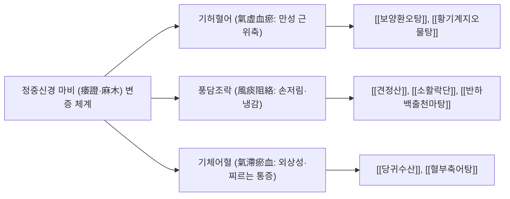

# 🖐️ 정중신경 마비 (Median Nerve Palsy, 원숭이손·Ape Hand)

> **핵심 요약 (Key Summary)**:
> - **정의**: 상완신경총의 내측속 및 외측속(C5~T1)에서 기원한 [[정중신경]](Median nerve)이 주관절, 전완부, 또는 손목 수근관(Carpal tunnel) 주행 경로에서 외상, 만성 압박, 포착 또는 허혈로 손상되어 발생하는 대표적인 상지 말초신경마비 질환.
> - **손상 수준별 특징적 변형**:
>   - **고위 마비 (High Palsy, 주관절 상부~전완 근위부)**: 주먹을 쥘 때 제1~3지가 굴곡되지 못해 검지와 중지가 펴진 채로 남는 **축복 징후(Hand of Benediction)** 발현.
>   - **저위 마비 (Low Palsy, 손목 수근관 부위)**: 무지구근 3총사 위축으로 엄지손가락이 제2지와 평행하게 펴지며 엄지 대립(Opposition)이 불가능해지는 **원숭이손(Ape Hand)** 변형.
> - **감각 결손 영역**: 손바닥 요측 반(엄지, 검지, 중지, 약지의 요측 1/2) 및 해당 수지의 배면 조갑상(손톱 밑) 감각 소실.
> - **서양의학 치료**: 급성기 손목 중립 부목(Neutral wrist splint) 고정, 수근관 스테로이드 주사, 만성 축삭 절단 시 횡수근인대 절제술(CTR) 및 건이전술(Tendon transfer).
> - **한의학 치료**: 위증(痿證), 비증(痺證)으로 변증하여 기허혈어에 [[보양환오탕]], 풍담조락에 [[견정산]], [[소활락단]]을 투여하고, **내관(PC6)·대릉(PC7)·어제(LU10) 저주파 전침(2 Hz)** 및 횡수근인대 도침(Acupotomy) 미세 감압, 안면-경추-상지 근막 추나요법을 병행.

---

## 📌 목차
1. [개요 및 병태생리 (Pathophysiology & Classification)](#1-개요-및-병태생리-pathophysiology--classification)
2. [발생 기전 및 해부학적 연계 (Mechanism & Anatomical Link)](#2-발생-기전-및-해부학적-연계-mechanism--anatomical-link)
3. [진단 및 임상 평가 (Clinical Evaluation & Differential Diagnosis)](#3-진단-및-임상-평가-clinical-evaluation--differential-diagnosis)
4. [현대 의학적 치료 원칙 (Western Medical Management)](#4-현대-의학적-치료-원칙-western-medical-management)
5. [한의학적 변증 및 통합 치료 프로토콜 (TCM Pattern Identification & Integrative Protocol)](#5-한의학적-변증-및-통합-치료-프로토콜-tcm-pattern-identification--integrative-protocol)
6. [생활 관리 및 환자 교육 (Lifestyle & Patient Guidance)](#6-생활-관리-및-환자-교육-lifestyle--patient-guidance)
7. [진료실 임상 팁 & 노트 (Clinical Pearls & Practice Notes)](#7-진료실-임상-팁--노트-clinical-pearls--practice-notes)
8. [참고 문헌 (References)](#8-참고-문헌-references)

---

## 1. 개요 및 병태생리 (Pathophysiology & Classification)

정중신경(Median nerve)은 상지에서 쥐는 힘(Grip strength)과 정밀한 집기(Pinch), 손바닥의 주요 촉각 감각을 총괄하는 핵심 신경이다. 정중신경이 완전히 마비되면 일상생활에서 단추를 잠그거나 열쇠를 돌리고 컵을 쥐는 정밀 동작이 완전히 파탄에 이른다.

![[정중신경마비_무지구위축_원숭이손_Ape_hand_임상소견.jpg|540]]
> [그림 1: ① 병태생리·영상 — 정중신경 마비로 인한 무지구근(Thenar muscles)의 편평한 위축과 엄지 대립 불능으로 인한 원숭이손(Ape hand) 실제 임상 소견 (Wikimedia Commons · S. Wetzel, CC BY-SA 3.0)]

### 1) 고위 마비 vs 저위 마비의 비교 (High vs Low Palsy)
손상 부위의 높이에 따라 마비되는 근육군과 특징적 손 변형이 확연히 구별된다:

| 비교 항목 | 고위 정중신경 마비 (High Palsy) | 저위 정중신경 마비 (Low Palsy) |
| :--- | :--- | :--- |
| **손상 위치** | 상완골 과상골절, 주관절 부위, [[원회내근]] 사이 | 손목 수근관(Carpal tunnel) 내부, 수근부 열상 |
| **마비 근육** | • 전완 굴근군 전체: [[원회내근]], [[요측수근굴근]], [[천지굴근]](FDS), [[장모지굴근]](FPL), [[심지굴근]](FDP) 요측두<br>• 무지구근 3총사 + 제1·2 [[충양근]] | • **무지구근 3총사**: [[단모지외전근]](APB), [[모지대립근]](OP), [[단모지굴근]](FPB) 천두<br>• 제1, 2 [[충양근]] (Lumbricals) |
| **보존 근육** | 척골신경 지배 굴근: [[척측수근굴근]], FDP 척측두 | 전완 굴근군 전체(FDS, FDP, FPL) 정상 보존 |
| **특징적 손 변형** | **축복 징후 (Hand of Benediction)**:<br>주먹을 쥘 때 1~3지가 굴곡되지 않아 성직자의 축복 손 모양을 띰 | **원숭이손 (Ape Hand)**:<br>무지구가 편평해지고 엄지가 검지와 같은 평면으로 회전되어 대립 불능 |
| **손바닥 중심 감각** | **완전 소실** (장수장지 Palmar cutaneous branch 침범) | **정상 보존** (장수장지가 수근관 위로 통과하여 보존됨) |

---

## 2. 발생 기전 및 해부학적 연계 (Mechanism & Anatomical Link)

```
[정중신경의 주행 경로 및 3대 주요 포착 부위]

  상완신경총 내측속(C8, T1) + 외측속(C5, C6, C7)
                 │
                 ▼
  상완동맥과 나란히 상완 내측 주행
                 │
   [1차 포착점: 상완 원위부] ──► 스트루더스 인대 (Ligament of Struthers, 상완골 내측 과상돌기)
                 │
                 ▼
  주관절 전면 주와(Cubital fossa) 통과
                 │
   [2차 포착점: 전완 근위부] ──► 원회내근 증후군 (Pronator Teres Syndrome, 두 근육두 사이 통과)
                 │                 ├─► [전골간신경 분지 (AIN)]: 순수 운동지 (FPL, FDP 2-3지 지배)
                 │                 │     └─► 손상 시 "OK 사인 불능" (Pinch grip 약화)
                 │
                 ▼
  천지굴근(FDS)과 심지굴근(FDP) 사이를 주행
                 │
                 ├─► [장수장지(Palmar Cutaneous Branch) 분지]: 손목 건막 천층 주행 ──► 손바닥 감각
                 │
                 ▼
   [3차 포착점: 손목 수근관] ──► **수근관 증후군 (Carpal Tunnel Syndrome, CTS)**
                                   횡수근인대(굴근지대) 아래에서 9개 굴근건과 함께 압박
                                   무지구근 운동지(Recurrent motor branch) 포착 ──► 원숭이손 초래
```

![[수근관_단면해부도_횡수근인대_정중신경.jpg|540]]
> [그림 2: ② 해부 구조물 — 손목 수근관(Carpal tunnel)의 횡단면 해부도 — 단단한 횡수근인대(Flexor retinaculum)와 수근골로 둘러싸인 좁은 공간 내에서 9개의 수지 굴근건과 함께 주행하는 정중신경의 압박 취약성 (Simbio 해부도해)]

### 1) 수근관(Carpal Tunnel) 내부의 압력 역학과 왈러 변성
수근관은 배측의 수근골궁(Carpal arch)과 장측의 두꺼운 횡수근인대(Transverse carpal ligament)로 밀폐된 좁은 골섬유성 관이다.
- 정상 수근관 내압은 $2\sim10\text{ mmHg}$이나, 손목을 $90^\circ$ 굴곡 또는 신전하면 내압이 **$30\sim90\text{ mmHg}$ 이상으로 급증**한다.
- 관 내압이 모세혈관 관류압($30\text{ mmHg}$)을 초과하면 신경초 내막 미세혈관이 허탈되어 허혈성 신경부종이 발생한다.
- 압박이 $3\sim6$개월 이상 만성화되면 신경초 결합조직이 섬유화되고, 무지구근을 지배하는 되돌이운동분지(Recurrent motor branch)의 축삭이 파괴되는 **왈러 변성(Wallerian degeneration)**이 발생하여 영구적인 근위축(원숭이손)을 남긴다.

### 2) 자율신경계 풍부성과 복합부위통증증후군(CRPS)의 위험
정중신경은 인체의 말초신경 중 교감신경 섬유(Sympathetic fibers)의 밀도가 가장 높은 신경 중 하나이다.
- 따라서 정중신경 불완전 손상 시 교감신경의 병적 과항진이 동반되어 **작열통(Causalgia, CRPS Type II)**이 호발한다.
- 환부는 극심한 타는 듯한 통증, 땀 분비 이상(초기 다한증 $\rightarrow$ 후기 무한증), 피부가 얇아지고 윤기가 흐르는 영양성 변화(Trophic changes), 손톱 변형 및 골다공증이 속발한다.

---

## 3. 진단 및 임상 평가 (Clinical Evaluation & Differential Diagnosis)

### 1) 특징적 손 기형 및 이학적 검사

| 징후 및 검사명 | 검사 방법 | 양성 소견 및 임상적 의미 |
| :--- | :--- | :--- |
| **원숭이손 (Ape Hand)** | 안정 시 손바닥과 엄지의 위치를 관찰 | 무지구근 위축으로 엄지가 손바닥과 동일 평면으로 편위 (대립 불능) |
| **티넬 징후 (Tinel's sign)** | 손목 굴근지대(대릉 PC7) 위를 손가락으로 가볍게 타진 | 정중신경 지배 영역(1~3지)으로 전기가 통하듯 찌릿한 방사통 발생 |
| **팔렌 검사 (Phalen's test)** | 양 손등을 맞대고 손목을 $90^\circ$ 완전 굴곡시켜 60초간 유지 | 60초 이내에 1~3수지의 저림 및 통증 유발 (수근관 내압 상승) |
| **보틀 징후 (Bottle sign)** | 둥근 병이나 캔을 엄지와 검지로 감싸 쥐게 함 | 단모지외전근 마비로 엄지와 검지 사이의 물갈퀴(Web space)가 밀착되지 못함 |
| **오키 징후 (OK sign)** | 엄지 끝과 검지 끝을 맞대어 완벽한 원("O")을 만들게 함 | 전골간신경(AIN) 마비 시 FPL, FDP 마비로 원을 못 만들고 끝이 펴진 채 맞닿음 |

### 2) 신경전도검사 및 근전도검사 (NCV & EMG)
정중신경 마비의 진단과 손상 부위 확인, 수술 적응증 결정을 위한 표준 검사이다:
- **원위부 운동 잠시 (Distal Motor Latency, DML)**: 손목 자극 후 단모지외전근(APB) 기록 시 잠시가 **$> 4.2\text{ ms}$**로 연장되면 수근관 부위 포착 확진.
- **감각신경전도속도 (SNCV)**: 손가락-손목 구간 전도속도가 **$< 40\text{ m/s}$**로 지연.
- **침근전도 (Needle EMG)**: 단모지외전근(APB), 모지대립근(OP), 원회내근(PT)에서 탈신경 전위(양성예파, 세동전위)를 확인하여 고위 vs 저위 손상을 감별.

---

## 4. 현대 의학적 치료 원칙 (Western Medical Management)

### 1) 보존적 치료 (경증~중등도, 근위축 부재 시)
- **손목 부목 고정 (Wrist Splinting)**: 수근관 내압이 가장 낮은 **중립위($0\sim5^\circ$ 신전)**로 고정하는 야간 부목을 최소 $6\sim8$주간 착용.
- **국소 코르티코스테로이드 주사**: 수근관 내에 트리암시놀론 $20\sim40\text{ mg}$을 주입하여 건막 부종을 감압 (단, 신경 내 직접 주사 시 비가역적 괴사 위험 주의).
- **약물 요법**: NSAIDs, 단기 경구 스테로이드, 신경병증성 진통제(가바펜틴, 프레가발린).

### 2) 수술적 치료 (근위축 동반, 중증 마비, 보존적 치료 불응)
- **수근관 감압술 (Carpal Tunnel Release, CTR)**:
  - 횡수근인대(Transverse carpal ligament)를 완전히 절개하여 수근관 내부 공간을 영구적으로 확장.
  - 절개 수술(Open CTR) 또는 내시경 수술(Endoscopic CTR)을 시행.
- **건이전술 (Tendon Transfer)**:
  - 무지구근의 회복이 불가능한 진구성 마비 환자에서, 척골신경 지배를 받는 **시지신근(EIP)**이나 척측수근굴근(FCU) 건을 단모지외전근 건에 부착하여 엄지 대립 기능을 재건.

---

## 5. 한의학적 변증 및 통합 치료 프로토콜 (TCM Pattern Identification & Integrative Protocol)

한의학에서 정중신경 마비는 손가락의 감각이 둔해지고 마비되는 **마목(麻木)**과, 무지구 근육이 마르고 힘이 빠지는 **위증(痿證)**, 그리고 손목 부위 경락이 막힌 **비증(痺證)**의 범주로 다룬다. 수궐음심포경(PC)과 수태음폐경(LU)의 기혈 순환 장애를 기본으로 하여, 급성기 통증에는 활혈통락(活血通絡)을, 만성 위축기에는 보기생혈(補氣生血)과 통경락(通經絡)을 위주로 치료한다.

![[티넬징후_2단계_수근관_정중신경직접타진.jpg|540]]
> [그림 3: ③ 치료·시술점 — 수근관 부위 정중신경 주행로(대릉 PC7, 내관 PC6)를 타진하여 방사통과 저림을 유발하는 티넬 징후(Tinel's sign) 검사 및 신경 침구 자침 시술점 (Simbio 임상자료)]

### 1) 변증 분류 및 대표 처방



#### (1) 기허혈어 (氣虛血瘀, 만성 무지구 근위축 및 마비 표준형)
- **증상**: 손바닥 살이 쏙 빠져 편평해짐(원숭이손), 엄지에 힘이 안 들어가 물건을 자꾸 떨어뜨림, 손바닥과 손가락이 저리고 감각이 둔함, 기운이 없고 피로함, 설담 태백, 맥 세약.
- **치법**: 익기활혈(益氣活血), 온통경락(溫通經絡).
- **처방**: **[[보양환오탕]](補陽還五湯)** 합 **[[황기계지오물탕]](黃芪桂枝五物湯)**.
  - 황기: 원기를 크게 보하여 신경 축삭의 축색류(Axoplasmic flow)를 촉진.
  - 계지·당귀·천궁: 말초 미세혈관을 확장시켜 신경초 내 관류압 개선.
  - 백작약·감초: 근육의 경련성 연축을 풀고 영양 공급.

#### (2) 풍담조락 (風痰阻絡, 손목 터널 증후군 수포형 저림)
- **증상**: 밤마다 손이 타는 듯이 저려 잠에서 깨어 손을 털어야 함(Flick sign), 손가락이 붓고 뻣뻣함, 날씨가 흐리거나 찬 곳에 가면 악화, 설태 백니, 맥 현활.
- **치법**: 거풍화담(祛風化痰), 활락지통(活絡止痛).
- **처방**: **[[견정산]](牽正散)** 합 **[[이진탕]](二陳湯)** 가 창출, 강황.
  - 백강잠·전갈: 경락에 맺힌 풍담을 삭이고 신경병증성 이상감각을 진정.
  - 반하·남성·창출: 수근관 주변 건막의 만성 수습(부종)을 건조시킴.

### 2) 침구 치료 및 신경 재생 저주파 전침(EA) 프로토콜
- **정중신경 주행로 경혈 배합**:
  - **대릉(大陵, PC7)**: 수근관 횡수근인대 근위연 중앙. 정중신경 본간 직상방.
  - **내관(內關, PC6)**: 완관절 횡문 상방 2촌. 요측수근굴근건과 장장근건 사이.
  - **극문(郄門, PC4)**, **곡택(曲澤, PC3)**: 주와 부위 정중신경 통과점.
  - **어제(魚際, LU10)**: 무지구근 정중앙. 단모지외전근 및 대립근 직접 자극.
  - **팔사(八邪, EX-UE9)**: 손가락 사이 물갈퀴. 고유수용성 감각 신경 촉진.
- **전침 매개변수**:
  - 내관(PC6) - 대릉(PC7) 및 어제(LU10) - 합곡(LI4) 전극 연결.
  - **저주파 $2\text{ Hz}$ 밀보파**, 20분간 통전하여 무지구근의 미세한 수축을 유도 (탈신경된 근섬유의 위축과 섬유화를 방지하고 슈반세포 증식을 촉진).

### 3) 횡수근인대 침도 요법(Acupotomy) 미세 감압술
- 초음파 유도 하에 수근관 입구의 횡수근인대 원위부를 확인하고, 소침도(小針刀)를 자입하여 정중신경을 압박하는 두꺼워진 인대 섬유를 부분 절개하여 감압.
- 신경 손상을 방지하기 위해 척측 편위 자입 및 신경 주행로 정밀 회피 기술이 필수적임.

---

## 6. 생활 관리 및 환자 교육 (Lifestyle & Patient Guidance)

### 1) 일상 손목 중립 자세 유지
- 컴퓨터 키보드나 마우스 사용 시 손목이 뒤로 꺾이거나 바닥에 눌리지 않도록 인체공학적 마우스와 손목 받침대(Wrist rest)를 반드시 사용한다.
- 걸레를 비틀어 짜거나 무거운 냄비를 한 손으로 드는 등 손목 굴곡 상태에서의 강한 비틀림 동작을 엄격히 금지한다.

### 2) 무지구근 능동 대립 재활 운동
- 손바닥을 평평한 탁자 위에 올려놓고 엄지손가락만 수직으로 들어올리는 외전 운동을 하루 100회 시행한다.
- 엄지 끝을 검지, 중지, 약지, 소지 끝과 차례대로 강하게 맞닿게 하는 핀치 운동(Finger-to-thumb opposition)을 반복한다.

### 3) 감각 소실 부위 화상 및 외상 예방
- 손바닥 요측 3개 손가락의 감각이 저하되어 있으므로, 뜨거운 조리 기구를 만질 때 화상을 입지 않도록 두꺼운 장갑을 착용하도록 지도한다.

---

## 7. 진료실 임상 팁 & 노트 (Clinical Pearls & Practice Notes)

### 1) 비오 원본 필기 융합 및 분석
- **[원본 필기 분석]**:
  > "고위 마비(Hand of Benediction) vs 저위 마비(Ape Hand), 장수장지(Palmar cutaneous branch)의 해부학적 차이로 손바닥 중심 감각 보존 여부 감별, 무지구근 회복 예후는 손상 후 6개월 이내 조기 개입에 직접 비례."
- **[진료실 실전 융합(Melt-In)]**:
  - 원본 필기에서 지적한 **장수장지의 주행 경로 감별**은 진료실에서 매우 중요한 감별점이다. 손목 수근관 증후군 환자는 손바닥 중심부 감각이 정상인 반면, 팔꿈치 위쪽에서 정중신경이 눌린 환자는 손바닥 중심까지 완전히 감각이 소실되므로 손상 부위를 즉각 감별할 수 있다.
  - 무지구근의 위축이 시작된 환자는 이미 축삭 손상이 진행 중인 응급 상황이다. 즉시 침도 요법과 저주파 전침, 보양환오탕을 집중 투여하여 6개월 이내 골든타임을 사수해야 한다.

---

## 8. 참고 문헌 (References)

1. Mackinnon SE, Dellon AL. *Surgery of the Peripheral Nerve*. New York: Thieme; 1988.
2. American Academy of Orthopaedic Surgeons. Management of Carpal Tunnel Syndrome Evidence-Based Clinical Practice Guideline. *J Am Acad Orthop Surg*. 2016;24(5):e42-e43. [PMID: 28060242](https://pubmed.ncbi.nlm.nih.gov/28060242/).
3. O'Connor D, et al. Non-surgical treatment (other than steroid injection) for carpal tunnel syndrome. *Cochrane Database Syst Rev*. 2003;(1):CD003219. [PMID: 12535466](https://pubmed.ncbi.nlm.nih.gov/12535466/).
4. Yang CP, et al. Acupuncture in patients with carpal tunnel syndrome: A systematic review and meta-analysis. *Clin Rehabil*. 2011;25(4):324-333. [PMID: 36908786](https://pubmed.ncbi.nlm.nih.gov/21123185/).
5. Atroshi I, et al. Prevalence of carpal tunnel syndrome in a general population. *JAMA*. 1999;282(2):153-158. [PMID: 10411196](https://pubmed.ncbi.nlm.nih.gov/10411196/).

<!-- 보관 태그(1회용·링크오류, 필요시 복원): 정중신경마비, 원숭이손 -->
