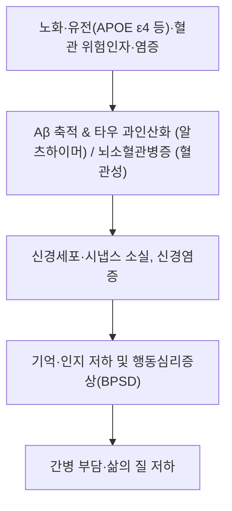

---
aliases:
  - 癡呆
  - Dementia
  - 알츠하이머병
  - Alzheimer's Disease
  - 혈관성 치매
  - 경도인지장애
  - MCI
tags:
  - 질환
  - 신경계질환
  - 인지장애
  - 치매
  - 퇴행성뇌질환
---

# 🩺 치매 (癡呆, Dementia — ICD-10 F00~F03 · G30)

> **핵심 3줄 요약 (Key Summary)**:
> - 📍 병소 부위 & 해부·병태생리: 대뇌피질·해마 등 광범위 신경조직의 만성·진행성 손상. 알츠하이머병(Aβ 축적·타우 신경원섬유매듭·콜린성 신경전달 저하), 혈관성(뇌소혈관병증), 루이소체·전측두엽 치매 등 원인별 병리가 상이.
> - 🚩 전형적 임상 양상 & 3대 징후: 기억·언어·실행·시공간·판단력 등 다영역 인지저하로 일상생활(ADL) 장애, 행동심리증상(BPSD: 초조·망상·배회) 동반. 알츠하이머병이 전체 치매의 60~70%를 차지.
> - 🛠️ 핵심 감별 검사 & 한·양방 다각적 치료 전략: K-MMSE·MoCA-K·CDR 신경심리평가 + 혈액검사(갑상선·B12)·뇌영상으로 가역 원인 감별. 한의학은 신정허손·담탁몽규·어혈조규로 변증하여 보신익정·화담거어·개규양신 치법 및 백회·사신총 등 배혈 활용, 콜린분해효소억제제 병용 시 안전성 확인.
> - ⚠️ 응급 의뢰 레드플래그 & 악화 요인: 갑작스러운 인지저하·의식변화·국소 신경학적 결손은 뇌졸중 등 응급 — 즉시 응급실 의뢰. 가역성 치매 원인(갑상선기능저하증, 비타민 B12 결핍, 정상압수두증, 우울증 가성치매)은 반드시 감별.

---

## 📌 목차
1. [질환 개요 & 분류 (Overview & Classification)](#1-질환-개요--분류-overview--classification)
2. [병태생리 메커니즘](#2-병태생리-메커니즘)
3. [임상 증상 & 진단 평가](#3-임상-증상--진단-평가)
4. [감별 진단 매트릭스](#4-감별-진단-매트릭스)
5. [한의 통합 치료 프로토콜 (침·한약)](#5-한의-통합-치료-프로토콜-침한약)
6. [재활·생활관리 및 예방](#6-재활생활관리-및-예방)
7. [💡 사용자 진료실 핵심 필기 & 임상 노하우 (Melt-In 잔여 심화 집약)](#7--사용자-진료실-핵심-필기--임상-노하우-melt-in-잔여-심화-집약)
8. [출처 및 학술 참고 문헌 (References)](#8-출처-및-학술-참고-문헌-references)

---

## 1. 질환 개요 & 분류 (Overview & Classification)

![[치매_뇌_메디컬일러스트.jpg|450]]
> [그림 1] 정상 뇌와 알츠하이머병 뇌의 관상단면 비교(대뇌피질 위축·해마 위축·뇌실 확대) — 출처: Wikimedia Commons, Alzheimer's disease brain comparison.jpg (National Institute on Aging, NIH, Public Domain)

* **정의**: 치매(Dementia)는 의식이 명료한 상태에서 기억력과 다른 고등 인지 기능(언어·실행·시공간·판단력)이 다발성으로 저하되어 일상생활에 현저한 장애를 초래하는 만성·진행성 임상 증후군입니다 (대한치매학회·국제 기준).
* **분류 (ICD-10/KCD 기준)**:
  * F00 — 알츠하이머병에서의 치매 (G30 알츠하이머병, F00.0~F00.9)
  * F01 — 혈관성 치매
  * F02 — 기타 질환에서의 치매(루이소체 치매, 전측두엽 치매, 파킨슨병 치매 등)
  * F03 — 상세불명의 치매
* **역학**: 전 세계 약 5천만 명이 치매로 살고 있으며 2050년경 1억 5천만 명까지 증가할 것으로 전망됩니다 (Lancet Commission 2020, PMID 32738937). 알츠하이머병이 전체 치매의 약 60~70%로 가장 흔한 원인 질환입니다.

---

## 2. 병태생리 메커니즘

![[치매_신경병리_도해.jpg|450]]
> [그림 2] 베타-아밀로이드 플라크(갈색)와 타우 신경원섬유매듭(청색)이 신경세포 사이·내부에 축적된 모식도 — 출처: Wikimedia Commons, Beta-Amyloid Plaques and Tau in the Brain.png (National Institute on Aging, NIH, Public Domain)

### 1) 알츠하이머병 (가장 흔한 원인)
* **아밀로이드 가설**: APP 분해 과정에서 생성된 Aβ42가 세포외에 축적되어 노인반(senile plaque)을 형성하고 신경독성을 유발합니다.
* **타우 병리**: 과인산화된 타우 단백질이 신경원섬유매듭(neurofibrillary tangle)을 형성하여 미세소관 기능을 파괴하고 신경세포 사멸을 초래합니다.
* **콜린성 신경전달 저하**: 기저전뇌(Meynert 기저핵)의 아세틸콜린성 신경세포 소실로 인지 증상이 나타나며, 이는 콜린분해효소억제제 치료의 표적입니다.

### 2) 혈관성 치매
* 뇌소혈관 질환·열공경색·백질변성 등 혈관 손상이 누적되어 인지 저하를 일으킵니다. 고혈압·당뇨·이상지질혈증 등 혈관 위험인자 관리가 예방·진행 억제의 핵심입니다.

### 3) 기타 원인 질환
* 루이소체 치매(파킨슨증·시각 환각·인지 변동), 전측두엽 치매(성격·언어 장애 우세) 등 병리·임상 양상이 다릅니다.

---

## 3. 임상 증상 & 진단 평가

### 1) 임상 증상
* **인지 증상**: 기억력(특히 최근 기억) 저하, 언어 장애(이름대기·유창성), 실행 기능 장애(계획·판단), 시공간 장애(길 잃음) 등.
* **행동심리증상(BPSD)**: 우울, 무감동, 초조·공격성, 배회, 망상(도둑 망상 등), 수면 장애.
* **일상생활(ADL) 장애**: 증상이 진행되면서 옷 입기·식사·목욕 등 기본적 일상생활에도 도움이 필요해집니다.

### 2) 진단 평가
* **병력 청취**: 환자 및 보호자로부터 발병 시점·경과(갑작스러운지 점진적인지), 약물력, 우울증 여부 확인.
* **신경심리 평가**: K-MMSE(간이정신상태검사), MoCA-K, CDR(임상치매척도) 등으로 인지 저하와 중증도를 객관화합니다.
* **혈액 검사**: 갑상선 기능, 비타민 B12·엽산, 매독 등 가역 원인 감별.
* **뇌영상**: 뇌MRI/CT로 위축·경색·백질변성 평가, 필요 시 아밀로이드 PET 등.
* ⚠️ 내용 검토 필요 — 평가도구별 절단점·한국 규준 세부 수치는 신경심리 규준 문헌 대조 후 보강 예정.

---

## 4. 감별 진단 매트릭스 (Differential Diagnosis)

| 감별 질환 | 핵심 감별 포인트 | 특이적 평가 |
| :--- | :--- | :--- |
| 치매 (본 질환) | 만성·점진적 다영역 인지 저하 + ADL 장애 | K-MMSE·CDR, 뇌영상 |
| 정상 노화 / 경도인지장애(MCI) | 인지 저하 있으나 ADL 보존 | 신경심리 + 기능 평가 |
| [[갑상선 기능 저하증]] | 무기력·기억 저하 동반, 갑상선 호르몬 교정 후 호전 가능 | TSH·Free T4 |
| 비타민 B12/엽산 결핍 | 말초신경병증·빈혈 동반 가능 | B12·엽산·혈청 호모시스테인 |
| 우울증(가성치매) | 인지 저하보다 정서 저하 우세, 발병 비교적 급속 | 우울 척도(GDS 등) |
| 정상압수두증(NPH) | 보행 장애 + 요실금 + 치매 3징 | 뇌MRI(뇌실 확대), 요추천자 |
| [[중풍]](뇌졸중) | 갑작스러운 국소 신경학적 결손 | 응급 뇌영상 |

---

## 5. 한의 통합 치료 프로토콜 (침·한약)

> [그림 3] 치매 변증 배혈(백회·사신총·인당·족삼리·태충)에 대한 실제 존재가 확인된 공개 저작권(Public Domain/CC) 시술점 도해를 Wikimedia Commons에서 찾지 못해 이미지는 싣지 않음(2026-09-08 확인, 검색 결과 0건). 임의 도해 생성·유사 이미지 대체는 하지 않음.

* **한의학적 변증 체계 (개요)**:
  * 치매는 한의학에서 건망(健忘)·치매(癡呆) 범주로, 병기는 신정허손·수해부족(腎精虛損·髓海不足), 심비양허(心脾兩虛), 담탁몽규(痰濁蒙竅), 어혈조규(瘀血阻竅) 등으로 크게 나눕니다. 치법은 보신익정·양혈안신·화담거어·개규양신을 원칙으로 합니다.
  * ⚠️ 내용 검토 필요 — 변증별 대표 처방·약재 선정과 용량은 임상 문헌·처방집 원문 대조 후 보강 예정(가상 처방 기재 금지).
* **침구 치료**: 백회(百會), 사신총(四神聰), 인당(印堂), 족삼리(足三里), 태충(太衝) 등 일반 혈위 중심의 변증 배혈이 전통적으로 활용됩니다 (혈자리명은 순수 텍스트 표기).
  * ⚠️ 내용 검토 필요 — 치매 침 치료의 RCT 근거와 혈위 프로토콜은 학술 문헌 확인 후 보강 예정.
* **한·양방 연계**: 이미 콜린분해효소억제제(도네페질 등)·메만틴을 복용 중인 환자가 많으므로 병용 안전성과 복약 순응도를 반드시 확인합니다.

---

## 6. 재활·생활관리 및 예방

* **인지 자극**: 회상 요법, 인지 훈련, 원예·음악 등 환자 수준에 맞는 활동.
* **신체 활동**: 규칙적 유산소 운동은 인지 기능 유지와 BPSD 완화에 도움.
* **생활환경**: 낙상 예방, 배회 대비(시설 안전), 일상 루틴 유지, 보호자 교육 및 지지.
* **예방 (수정 가능한 위험인자)**: Lancet Commission은 2020년 기준 12개 수정 가능 위험인자(조기 교육 부족, 고혈압, 청력 장애, 흡연, 비만, 우울, 신체활동 부족, 당뇨, 낮은 사회적 접촉, 두부 손상, 과도한 음주, 대기오염)를 제시하며, 이들 관리로 치매의 약 40%를 예방·지연할 수 있다고 보고했습니다 (PMID 32738937).
* ⚠️ 내용 검토 필요 — 보호자 대상 구체 티칭 스크립트는 비오님 임상 필기 반영 후 보강 예정.

---

## 7. 💡 사용자 진료실 핵심 필기 & 임상 노하우 (Melt-In 잔여 심화 집약)

> ⚠️ 내용 검토 필요 — 비오님의 치매 환자 진료실 문진 체크리스트, 한약 처방 경험, 침·약침 연계 노하우가 있으시면 이 섹션에 녹여 보강하겠습니다. 현재는 학술적 골격만 갖춘 상태로, 임상 필기가 추가될 때까지 위 표시를 유지합니다.

---

## 8. 출처 및 학술 참고 문헌 (References)

1. **Livingston G, Huntley J, Sommerlad A, et al. (2020)**. *Dementia prevention, intervention, and care: 2020 report of the Lancet Commission*. Lancet 396(10248):413-446. https://pubmed.ncbi.nlm.nih.gov/32738937/
   - **[연구 요약]**: 12개 수정 가능 위험인자 관리로 치매의 약 40% 예방·지연 가능성을 제시한 국제 위원회 보고 — 예방·중재·돌봄의 표준 근거.
2. **Livingston G, et al. (2024)**. *Dementia prevention, intervention, and care: 2024 report of the Lancet standing Commission*. Lancet 404(10452):572-628. https://doi.org/10.1016/S0140-6736(24)01296-0
   - **[연구 요약]**: 2020년 보고 이후 누적 근거를 반영해 위험인자 14개로 확장하고 예방 가능 비율을 갱신한 후속 Commission 보고.
3. **(2025)**. *Diagnosis and Treatment of Alzheimer's Disease* (국문 리뷰). https://pmc.ncbi.nlm.nih.gov/articles/PMC11822271/
   - **[연구 요약]**: 알츠하이머병의 진단(생체표지자 포함)과 약물·비약물 치료를 정리한 최신 국문 종설.
4. **대한치매학회 (The Korean Dementia Association)**. https://www.dementia.or.kr/
   - **[공인 데이터]**: 국내 치매 진단·치료·관리 지침, 치매안심센터 연계 및 환자·보호자 정보 공식 채널.
5. **대한신경과학회지(JKNA) 교육자료**. *치매(Dementia)의 정의와 분류*. https://www.jkna.org/upload/pdf/8501001.pdf
   - **[연구 요약]**: 치매의 정의·분류와 주요 원인 질환별 특성을 정리한 신경과 교육 문헌.

---
_🕐 생성: 2026-09-08 (다빈치, 미노트화 배치) — 질환 템플릿 기준 · 신경계 내과 질환에 맞게 구조 변용 · 미확인 세부는 ⚠️ 내용 검토 필요로 표기_
_🖼️ 2026-09-08 이미지 보강(다빈치): 그림 1·2를 Wikimedia Commons 실측 Public Domain 이미지(NIA/NIH)로 교체 저장, 핵심 요약을 질환 템플릿의 3줄 불릿 형식으로 재정리. 그림 3(약침 시술점)은 공개 저작권 이미지 미확보로 보류._
