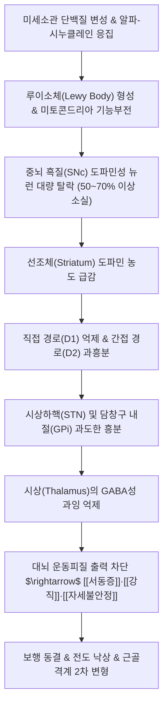

---
aliases:
  - 파킨슨병
  - 파킨슨 증후군
  - Parkinson's disease
  - PD
  - G20
  - 진전
  - 전진
tags:
  - 이론
  - 질환
  - 신경계질환
  - 퇴행성뇌질환
  - 뇌신경
  - 한의치료
title: 파킨슨병
date: 2026-09-16
출처: "PMID: 26474316"
---
# 🩺 [[파킨슨병]] (Parkinson's Disease / 震顫, G20 / ICD-10)

> **핵심 3줄 요약 (Key Summary)**:
> - 📍 병소 부위 & 해부·병태생리: 중뇌 흑질 치밀부(Substantia nigra pars compacta, SNc)의 도파민성 신경세포 변성·탈락 및 알파-시누클레인([[α-시누클레인]]) 응집체인 루이소체(Lewy body) 형성 $\rightarrow$ 선조체 도파민 고갈로 기저핵 직접 경로 억제 및 간접 경로 과항진, 시상(Thalamus)의 대뇌피질 운동 자극 차단.
> - 🚩 전형적 임상 양상 & 3대 징후: 서동증(Bradykinesia, 동작 완만 및 소자증·가면상 안모), 안정 시 진전(Resting tremor, 4~6Hz 알약 굴리기 양상), 납관상/톱니바퀴상 강직(Lead-pipe / Cogwheel rigidity) 및 자세 불안정(굴곡 전경 자세, 가속·동결 보행).
> - 🛠️ 핵심 감별 검사 & 한·양방 다각적 치료 전략: MDS 임상 진단 기준(서동증 필수+진전/강직), FP-CIT PET 도파민 운반체 뇌영상, 후방 견인 검사([[풀링 검사]]), 침·봉독약침(백회, 풍지, 합곡, 태충, 양릉천), 두침(무용구), 한약([[보양환오탕]], [[억간산]], [[육미지황탕]], [[천마구등음]]) 병용으로 레보도파 약효 소진(Wearing-off) 지연.
> - ⚠️ 응급 의뢰 레드플래그 & 악화 요인: 발병 1~2년 이내 조기 반복 낙상 및 수직 주시 마비(진행성 핵상 마비 PSP), 심한 기립성 저혈압/배뇨 장애(다계통 위축증 MSA), 항정신병제 유발 신경이완제 악성 증후군(NMS), 도파민 급중단에 의한 무동성 위기.

---

## 📌 목차
1. [질환 개요 & 해부학적 병태생리](#1-질환-개요--해부학적-병태생리)
2. [병태생리 메커니즘 & 생체역학적 악순환 네트워크](#2-병태생리-메커니즘--생체역학적-악순환-네트워크)
3. [임상 증상 & 이학적 검사(Physical Exam) 알고리즘](#3-임상-증상--이학적-검사physical-exam-알고리즘)
4. [감별 진단 매트릭스 (Differential Diagnosis)](#4-감별-진단-매트릭스-differential-diagnosis)
5. [한의 통합 치료 프로토콜 (침·약침·추나·한약)](#5-한의-통합-치료-프로토콜-침약침추나한약)
6. [재활 운동 & 생활습관 티칭 가이드](#6-재활-운동--생활습관-티칭-가이드)
7. [💡 사용자 진료실 핵심 필기 & 임상 노하우 (Melt-In 잔여 심화 집약)](#7--사용자-진료실-핵심-필기--임상-노하우-melt-in-잔여-심화-집약)
8. [출처 및 학술 참고 문헌 (References)](#8-출처-및-학술-참고-문헌-references)

---

## 1. 질환 개요 & 해부학적 병태생리

![[Blausen_0704_ParkinsonsDisease.png|450]]
> [그림 1: 중뇌(Midbrain) 횡단면에서 정상인의 짙은 흑질(Substantia Nigra) 멜라닌 띠와 파킨슨병 환자에서의 도파민성 신경세포 탈락으로 인한 흑질의 탈색 병리 비교 메디컬 일러스트]

* **질환 정의 및 역학**:
  * 파킨슨병(Parkinson's Disease, PD)은 알츠하이머병에 이어 두 번째로 흔한 중추신경계 퇴행성 질환입니다.
  * 중뇌 흑질 치밀부(SNc)의 도파민 생성 신경세포가 점진적으로 소실됨으로써 운동 조절 회로가 파괴되어 서동, 떨림, 강직 등의 특징적인 추체외로계 운동 장애가 서서히 진행됩니다.
  * 전 세계적으로 60세 이상 인구의 약 1~2%, 80세 이상에서는 약 3~5%가 이환되며, 고령화와 함께 유병률이 급증하고 있습니다.
* **관련 해부학적 구조물**:
  * **기저핵 (Basal Ganglia)**:
    * **선조체 (Striatum)**: 미상핵(Caudate nucleus)과 피각(Putamen)으로 구성되며, 대뇌피질의 흥분성 신호와 흑질의 도파민 신호를 수용하는 기저핵의 입력부.
    * **담창구 (Globus Pallidus)**: 외절(GPe, 간접 경로 억제 중계) 및 내절(GPi, 기저핵의 최종 억제 출력부).
    * **시상하핵 (Subthalamic Nucleus, STN)**: 간접 경로에서 GPi를 흥분시키는 가속 페달 역할.
    * **흑질 (Substantia Nigra)**: 치밀부(SNc)에서 선조체로 도파민을 분비하여 직접 경로는 촉진(D1 수용체)하고 간접 경로는 억제(D2 수용체)함으로써 운동 개시를 도움.
  * **시상 (Thalamus) 및 운동 피질 (Motor Cortex)**:
    * 기저핵 내절(GPi)의 억제 신호를 받아 운동 피질로 최종 신호를 전달하는 중계 기지.

---

## 2. 병태생리 메커니즘 & 생체역학적 악순환 네트워크

![[Basal_ganglia_in_Parkinson_disease.png|450]]
> [그림 2: 파킨슨병에서의 기저핵 회로 이상 도해 - 흑질-선조체 도파민 투사 결핍으로 인해 간접 경로는 과활성화되고 직접 경로는 억제되어, 최종적으로 시상(Thalamus)의 피질 흥분 신호가 강력히 차단되는 서동증 메커니즘]

### 1) 기저핵 회로의 직접/간접 경로 불균형 기전
* 정상 상태에서 도파민은 D1 수용체를 통해 운동을 촉진하는 **직접 경로(Direct pathway)**를 활성화하고, D2 수용체를 통해 운동을 억제하는 **간접 경로(Indirect pathway)**를 차단하여 부드럽고 신속한 운동 개시를 가능하게 합니다.
* 파킨슨병에서는 도파민이 결핍되면서 직접 경로가 침묵하고 간접 경로가 통제를 벗어나 폭주합니다. 그 결과 기저핵의 최종 출력부인 담창구 내절(GPi)이 과도하게 흥분하여 시상(Thalamus)을 강력한 GABA성 억제로 짓누르게 됩니다.
* 시상이 억제되면서 대뇌 운동피질로 가는 자극 신호가 차단되어, 환자는 머리로는 움직이려고 생각하지만 몸이 돌처럼 굳고 느려지는 **서동증(Bradykinesia)**이 발생합니다.

### 2) 브라크 가설 (Braak Hypothesis) 및 병기 진행
* 병리적 알파-시누클레인은 장관신경계(Auerbach 신경총) 및 후각신경구(Olfactory bulb)에서 최초 발생하여 미주신경을 타고 연수(Dorsal motor nucleus of vagus)로 상행합니다 (Braak 1~2기: 변비, 후각 저하).
* 이후 뇌간의 청반(Locus coeruleus)과 중뇌 흑질을 침범하여 전형적인 운동 증상이 발현되며(Braak 3~4기), 말기에는 변연계와 대뇌피질로 파급되어 인지기능 저하와 치매가 동반됩니다(Braak 5~6기).

---

## 3. 임상 증상 & 이학적 검사(Physical Exam) 알고리즘

![[Parkinson_posture_gait_St_Leger.png|400]]
> [그림 3: 윌리엄 가워스/St. Leger의 역사적 파킨슨병 환자 묘사 - 특징적인 굴곡된 전경 자세(Stooped posture), 팔꿈치 굴곡 및 알약 굴리기 손가락 진전(Pill-rolling tremor), 좁은 보폭의 전진 보행]

### 1) 4대 핵심 운동 증상 (TRAP)
* **T - Tremor (안정 시 진전, 靜止時 振顫)**:
  * 가만히 휴식을 취할 때 손이나 발에서 초당 4~6회의 주기적 떨림 발생.
  * 엄지와 검지를 비비는 듯한 **알약 굴리기 진전(Pill-rolling tremor)**이 전형적이며, 의도적으로 손을 움직이거나 활동할 때는 일시적으로 감소함. 초기에는 비대칭적(한쪽 손)으로 시작.
* **R - Rigidity (강직, 强剛)**:
  * 관절을 수동적으로 굴곡·신전시킬 때 전 가동 범위에 걸쳐 지속적인 저항이 느껴지는 **납관상 강직(Lead-pipe rigidity)**.
  * 진전이 동반될 경우 톱니바퀴가 걸리며 돌아가는 듯한 **톱니바퀴상 강직(Cogwheel rigidity)** 확인.
* **A - Akinesia / Bradykinesia (무동증 / 서동증, 徐動)**:
  * 모든 동작이 굼뜨고 느려짐. 단추 채우기나 젓가락질 같은 미세 운동 장애.
  * 얼굴 표정이 사라지는 **가면상 안모(Masked facies)**, 눈 깜빡임 횟수 감소, 글씨가 뒤로 갈수록 점점 작아지는 **소자증(Micrographia)**.
* **P - Postural Instability (자세 불안정)**:
  * 병이 진행하면서 균형 유지 반사가 소실되어 쉽게 넘어짐.
  * 몸의 중심이 앞으로 쏠린 상태에서 발이 몸을 따라가지 못해 종종걸음으로 빨라지는 **가속 보행(Festinating gait)** 및 발이 바닥에 붙어 떨어지지 않는 **보행 동결(Freezing of gait)**.

### 2) 비운동 증상 (Non-Motor Symptoms)
* **운동 증상 선행 징후 (수년~십수년 전 발현)**: 후각 소실(Hyposmia), 렘수면행동장애(RBD, 꿈 내용을 신체로 행동화하며 비명/발길질), 만성 난치성 변비.
* **자율신경계 및 기분 장애**: 기립성 저혈압, 빈뇨/야간뇨, 우울증, 불안, 무감동증(Apathy), 후기 파킨슨 치매(PDD).

### 3) 필수 이학적 검사법
* **후방 견인 검사 (Pull Test, [[풀링 검사]])**:
  * 환자의 어깨 뒤에 서서 환자에게 균형을 잡으라고 경고한 뒤 뒤쪽으로 재빠르고 강하게 당깁니다.
  * 정상인은 1~2보 뒤로 물러나며 바로 중심을 잡지만, 파킨슨병 환자는 균형을 잡지 못하고 뒤로 쓰러지거나 여러 걸음 뒤뚱거립니다(자세 반사 소실).
* **손가락 두드리기 검사 (Finger Tapping Test)**:
  * 엄지와 검지를 최대한 넓게 벌렸다가 빠르게 맞부딪치는 동작을 10회 이상 반복. 서동증이 있으면 점차 진폭이 작아지고 속도가 느려지며 박자가 끊김.
* **프로멘트 징후 (Froment's Sign for Rigidity)**:
  * 반대편 손으로 공중에 원을 그리거나 주먹을 쥐었다 펴게 유도하면서 검사 손목의 강직을 유발하면 톱니바퀴 강직이 현저하게 증폭됨.

---

## 4. 감별 진단 매트릭스 (Differential Diagnosis)

| 감별 질환 | 호발 연령 및 주요 병소 | 떨림 및 운동 증상 특성 | 특이 감별 소견 및 치료 반응 |
| :--- | :--- | :--- | :--- |
| [[파킨슨병]] (본 질환) | 60대 이상, 중뇌 흑질(SNc) | 일측성 시작, [[안정 시 진전]], 서동증, 강직, 자세불안정 | [[레보도파]]에 드라마틱한 호전 반응, FP-CIT PET 이상 |
| [[본태성 진전]] | 20대~전 연령, 가족력 흔함 | 양측성 대칭적, 글씨 쓰거나 컵 들 때의 **활동성/체위성 진전** | 서동·강직 전혀 없음, 음주 시 일시적 완화, 프로프라놀롤 반응 |
| 다계통 위축증 (MSA) | 50~60대, 소뇌 및 자율신경계 | 파킨슨증 + 조기부터 나타나는 극심한 기립성 저혈압·배뇨장애 | 레보도파 반응 미약, 뇌 MRI 상 'Hot cross bun' 징후 |
| 진행성 핵상 마비 (PSP) | 60대 이상, 중뇌 피개 | 발병 초기부터 잦은 뒤로 넘어짐(낙상), **수직 안구 주시 마비** | 목이 뒤로 젖혀지는 경부 신전 강직, 뇌 MRI 'Hummingbird' 징후 |
| 혈관성 파킨슨증 | 뇌졸중 기왕력 고령자, 기저핵 피질하 백질 | 주로 하체에 국한된 보행 장애(하반신 파킨슨증, Lower body PD) | 상지 진전 드묾, 뇌 MRI 상 광범위한 미세 백질 허혈 병변 |

---

## 5. 한의 통합 치료 프로토콜 (침·약침·추나·한약)

### 1) 침구 치료 (Acupuncture)
* **뇌혈류 개선 및 신경보호 특효혈**:
  * **백회(百會, GV20) & 사신총(四神聰, EX-HN1)**: 두피 혈류 순환을 촉진하고 피질하 신경망 흥분성을 조절하여 진전 및 인지 저하 방어.
  * **풍지(風池, GB20)**: 추골뇌저동맥 혈류 개선, 뇌간 및 중뇌 허혈 개선, 경항부 근육 긴장 완화.
  * **합곡(合谷, LI4) & 태충(太衝, LR3)**: 사관혈(四關穴). 기혈 순환을 소통시키고 평간식풍(平肝熄風)하여 사지 떨림 제어.
  * **양릉천(陽陵泉, GB34) & 족삼리(ST36)**: 근회(筋會)로서 전신 근육 강직과 서동 완화, 보행 지구력 증진.
* **두침 요법 (Scalp Acupuncture)**:
  * **무용구(舞踊區 / 振顫痲痺制御區)**: 운동구 전방 1.5cm 평행선. 전침(Electroacupuncture) 100Hz 고주파 통전으로 기저핵 시상 억제망 조절.

### 2) 봉독 약침 치료 (Bee Venom Pharmacopuncture)
* **멜리틴(Melittin)의 신경염증 차단 기전**:
  * 봉독의 핵심 성분인 멜리틴은 뇌 미세아교세포(Microglia)의 과활성화를 억제하고 TNF-$\alpha$, IL-1$\beta$ 등 신경 독성 사이토카인을 차단하여 흑질 도파민 신경세포의 자연사를 유의하게 억제함.
  * 주입점: 풍지(GB20), 양릉천(GB34), 곡지(LI11), 신수(BL23).
  * 농도 조절: 0.1mg/ml 저농도로 시작하여 10,000:1 또는 5,000:1 정제 봉독으로 점진적 증량(반드시 스킨 테스트 선행).

### 3) 한약 치료 (Herbal Medicine)
* **[[보양환오탕]](補陽還五湯)**:
  * **적응증**: 기허혈어(氣虛血瘀)형 파킨슨병. 몸에 기운이 하나도 없고 동작이 둔하며 손발이 저리고 굳어지는 만성 진행기 환자.
  * **약리 기전**: 대량의 황기(黃芪 60~120g)와 당귀, 적작약, 천궁, 도인, 홍화, 지룡 배오. 뇌 미세순환을 촉진하고 도파민성 신경세포 변성을 억제하여 레보도파 요구량을 절감.
* **[[억간산]](抑肝散) / [[억간산가진피반하]](抑肝散加陳皮半夏)**:
  * **적응증**: 간경화열(肝經化熱)로 인한 사지 떨림, 수면 중 소리 지르기(RBD), 짜증, 불안, 환시 및 감정 기복이 심한 파킨슨 환자. 글루타메이트 신경독성 억제.
* **[[육미지황탕]](六味地黃湯) / [[지황음자]](地黃飮子)**:
  * **적응증**: 간신음허(肝腎陰虛)로 허리와 무릎에 힘이 빠지고, 입이 마르며, 체중이 줄고 관절이 뻣뻣하게 굳는 노년기 파킨슨병의 근본 보익 처방.
* **[[천마구등음]](天麻鉤藤飮)**:
  * **적응증**: 간양상항(肝陽上亢)으로 얼굴이 붉어지고 두통·어지럼증과 함께 안정 시 진전이 심하게 요동치는 급격한 증상 악화기.

### 4) 추나 요법 (Chuna Manipulation)
* **경추 및 흉요추 근막 이완(JS) 추나**:
  * 굴곡된 전경 자세로 만성 단축된 전경부 근육([[흉쇄유돌근]], [[사각근]]), [[대흉근]], [[장요근]]을 부드럽게 이완하고 척추 기립근의 신전 가동성을 확보하여 척추 변형(Camptocormia) 진행 억제.

---

## 6. 재활 운동 & 생활습관 티칭 가이드

* **시각적·청각적 큐(Cue)를 이용한 보행 동결 극복**:
  * 걸음이 바닥에 붙어 나가지 않는 동결 보행(Freezing) 발생 시, 억지로 발을 떼려 하지 말고 **"바닥의 특정 선을 넘어선다"는 상상(시각 단서)**을 하거나, 메트로놈/음악 박자에 맞추어 **"하나, 둘, 셋!" 구령을 크게 외치며(청각 단서)** 첫 발을 내딛도록 훈련.
* **빅 무브먼트 운동 (LSVT BIG 프로그램)**:
  * 파킨슨 환자는 뇌의 감각 피드백 왜곡으로 자신의 동작이 충분히 크다고 착각함. 팔을 과장되게 높이 휘두르고 무릎을 가슴까지 높이 들어 올리는 과장된 대동작 보행 훈련 매일 30분 시행.
* **태극권 (Tai Chi) 및 균형 운동**:
  * 주 3회 태극권 수련은 자세 불안정을 개선하고 전도 낙상 위험을 50% 이상 유의하게 감소시키는 것으로 입증됨.

---

## 7. 💡 사용자 진료실 핵심 필기 & 임상 노하우 (Melt-In 잔여 심화 집약)

* **양방 레보도파(마도파/시네멧)와 한약의 실전 병용 복약 지도**:
  * 레보도파 제제는 식사 직후 복용하면 단백질(아미노산)과의 장내 흡수 경쟁으로 약효가 급격히 떨어집니다.
  * **양약 레보도파는 반드시 식전 30분~1시간 공복**에 복용하도록 티칭하고, **한약(보양환오탕 등)은 식후 1시간**에 복용하게 하여 최소 1.5~2시간의 시간차를 두면 양약의 흡수를 방해하지 않으면서 약효 소진 현상을 극적으로 억제할 수 있습니다.
* **약효 소진 현상 (Wearing-off) 환자의 한의학적 돌파구**:
  * 양약을 3~5년 복용하여 1회 복용 후 효과 유지 시간이 2~3시간으로 짧아져 쩔쩔매는 환자에게 봉독약침과 보양환오탕을 3개월 병용 투여하면, '온(On) 타임'이 유의하게 연장되고 '오프(Off) 타임'의 근육 강직과 통증이 뚜렷하게 경감됩니다.
* **봉독약침 주입 시 안전 극대화 원칙**:
  * 파킨슨 환자는 자율신경계가 취약하므로 봉독약침 시술 전 반드시 혈압을 체크하고, 첫 시술 시에는 0.05cc 극소량 스킨 테스트 후 15분간 아나필락시스 반응을 관찰해야 합니다.

---

## 8. 출처 및 학술 참고 문헌 (References)

* **Postuma, R. B., et al. (2015)**. MDS clinical diagnostic criteria for Parkinson's disease. *Movement Disorders*, 30(12), 1591-1601. [PMID: 26474316](https://pubmed.ncbi.nlm.nih.gov/26474316/)
  * `[연구 요약]`: 국제 파킨슨·이상운동질환학회(MDS)의 공식 파킨슨병 임상 진단 기준으로, 서동증 필수 충족 하에 안정 시 진전 또는 강직의 존재를 파킨슨증으로 규정하고, 절대적 배제 기준, 적신호(Red Flags), 지지 기준을 확립함.
* **Cho, S. Y., et al. (2012)**. Effectiveness of acupuncture and bee venom acupuncture in idiopathic Parkinson's disease. *Parkinsonism & Related Disorders*, 18(8), 948-952. [PMID: 22632852](https://pubmed.ncbi.nlm.nih.gov/22658823/)
  * `[연구 요약]`: 특발성 파킨슨병 환자를 대상으로 침 및 봉독약침(BVA)의 유효성을 평가한 무작위 배정 임상시험으로, 봉독약침 치료군에서 통합 파킨슨병 평가 척도(UPDRS) 점수와 보행(TUG) 속도가 대조군 대비 유의하게 향상됨을 입증함.
* **Shan, C. S., et al. (2018)**. Herbal medicine formulas for Parkinson's disease: A systematic review and meta-analysis of randomized double-blind placebo-controlled clinical trials. *Frontiers in Aging Neuroscience*, 10, 349. [PMID: 30467472](https://pubmed.ncbi.nlm.nih.gov/30467472/)
  * `[연구 요약]`: 파킨슨병에 대한 한약 복합 처방의 이중맹검 위약 대조 RCT들을 체계적 문헌고찰한 메타분석으로, 레보도파와 한약 병용 투여가 레보도파 단독 대비 UPDRS 운동 점수와 일상생활 수행 능력을 유의하게 개선하고 부작용을 감소시킴을 규명함.

<!-- 보관 태그(1회용·링크오류, 필요시 복원): 봉독약침 -->
