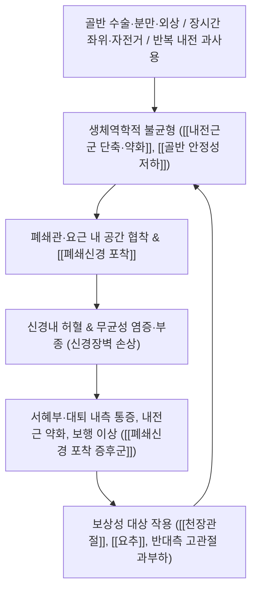

# 🩺 [[폐쇄신경 포착 증후군]] (Obturator Nerve Entrapment / 閉鎖神經捕捉症候群, ICD-10 G57.8 / KCD-8 G57.8)

> **핵심 3줄 요약 (Key Summary)**:
> - 📍 **병소 부위 & 해부·병태생리**: 제2–4요추 신경근(L2–L4)에서 기원한 [[폐쇄신경]]이 요근 내부 → 골반측벽 → **폐쇄관(obturator canal)** → 대퇴 내측 내전근군으로 주행하는 경로 중, 특히 폐쇄관과 요근–골반벽 사이에서 만성 압박·견인·마찰을 받아 발생한다. 운동섬유는 [[내전근군]](대내전근·장내전근·단내전근·박근·치골근), 감각섬유는 [[대퇴 내측 피부]], 관절지는 [[고관절]]·[[슬관절]] 관절낭에 분포한다.
> - 🚩 **전형적 임상 양상 & 3대 징후**: ① **서혜부·대퇴 내측 통증**(활동 시 악화, 안정 시 호전) ② **고관절 내전 근력 약화**(다리 꼬기 어려움, 계단 오르기·차량 승하차 불편, 내전근 위축) ③ **대퇴 내측 감각저하·이상감각**(분포가 개인차가 커서 생략되는 경우도 있음). 후지 분지 침범 시 슬관절 내측 연관통이 동반된다.
> - 🛠️ **핵심 감별 검사 & 한·양방 다각적 치료 전략**: [[내전근 도수근력검사]](저항 내전 검사), [[폐쇄신경 견인검사]], [[Howship-Romberg 징후]], [[FABER 검사]] + **근전도·신경전도(EMG/NCS)** 및 **골반 MRI**. 한방은 [[도침]]·[[봉약침]]·[[약침]]으로 폐쇄관 주위 및 내전근 [[TP]] 유착을 해제하고, [[추나]]로 골반–천장관절 정렬을 교정하며, [[活血祛瘀劑]]·[[補益肝腎劑]]를 병용한다.
> - ⚠️ **응급 의뢰 레드플래그 & 악화 요인**: 발열·야간통·체중감소 동반 시 **골반 종괴/악성 종양·림프선 비대·골반 감염** 의심 즉시 의뢰. **폐쇄탈장(obturator hernia)** 은 장폐색 동반 가능성이 있는 응급 질환. 진행성 하지 근력저하·양측성 신경학적 결손·배변배뇨 장애는 [[마미증후군]] 감별 필수. 급성 골반 골절, 종양성 병소, 화농성 관절염 부위에 대한 **강한 추나·심자 도침은 절대 금기**.

---

## 📌 목차
1. [질환 개요 & 해부학적 병태생리](#1-질환-개요--해부학적-병태생리)
2. [병태생리 메커니즘 & 생체역학적 악순환 네트워크](#2-병태생리-메커니즘--생체역학적-악순환-네트워크)
3. [임상 증상 & 이학적 검사(Physical Exam) 알고리즘](#3-임상-증상--이학적-검사physical-exam-알고리즘)
4. [감별 진단 매트릭스 (Differential Diagnosis)](#4-감별-진단-매트릭스-differential-diagnosis)
5. [한의 통합 치료 프로토콜 (침·약침·추나·한약)](#5-한의-통합-치료-프로토콜-침약침추나한약)
6. [재활 운동 & 생활습관 티칭 가이드](#6-재활-운동--생활습관-티칭-가이드)
7. [💡 사용자 진료실 핵심 필기 & 임상 노하우 (Melt-In 잔여 심화 집약)](#7--사용자-진료실-핵심-필기--임상-노하우-melt-in-잔여-심화-집약)
8. [출처 및 학술 참고 문헌 (References)](#8-출처-및-학술-참고-문헌-references)

---

## 1. 질환 개요 & 해부학적 병태생리

* **질환 정의 및 분류**:
  * **정의**: [[폐쇄신경]](obturator nerve, L2–L4)이 골반강 내 주행부, 골반측벽 부착부, 또는 **폐쇄관(obturator canal)** 통과부에서 만성적인 압박·견인·마찰을 받아 **내전근군의 운동 약화**와 **대퇴 내측 감각 이상**, **서혜부·대퇴 내측 통증**을 유발하는 말초 [[신경포착증후군]]이다.
  * **분류**:
    * **특발성/기능성** — 반복적 내전 과사용(스포츠, 승마, 자전거), 장시간 좌위·다리 꼬기 습관, 잘못된 골반 정렬로 인한 견인성 손상.
    * **이차성/구조성** — 골반 골절, 고관절 치환술 후 시멘트 돌출·나사 자극, 골반·비뇨·부인과 수술 후 반흔 및 유착, **폐쇄탈장**, 자궁내막증, 골반 종괴 및 **림프선 비대**, 임신·분만(특히 쇄석위 장시간 유지) 등.
  * **호발 연령/성별/직업군**: 정확한 유병률·발생률 통계는 **근거 미확인**(희귀 말초신경병증으로 대규모 역학 연구 부족). 문헌상 **산후 여성**(Nogajski & Shnier, 2004), **골반 수술 및 고관절 수술 후 환자**, **장시간 쇄석위 수술을 받은 환자**에서 보고되며, 스포츠 선수에서는 내전근 손상과 동반된 형태로 나타난다.
  * **예후**: 원인이 명확한 압박성 병변은 원인 제거 및 보존적 치료로 호전되는 경우가 많으나, 진단이 지연되면 내전근 위축과 보행 패턴 변화가 고착될 수 있다. 정확한 회복 기간·회복률 수치는 **근거 미확인**.

* **관련 해부학적 구조물**:
  * **골격 및 관절**: [[요추]](L2–L4 신경근 기시), [[골반강 측벽]](폐쇄근막 상연), [[치골]](치골지), [[폐쇄공]](obturator foramen), [[고관절]], [[천장관절]].
  * **근육 및 근막**: [[요근]](psoas major, 신경이 근실질 내를 관통), [[폐쇄외근]](obturator externus, 후지 지배), [[대내전근]], [[장내전근]], [[단내전근]], [[박근]](gracilis), [[치골근]](pectineus), [[내전근군]] 전체(단축/약화 불균형의 핵심), [[중둔근]](보상성 약화 시 골반 안정성 저하).
  * **신경 및 혈관**: [[폐쇄신경]](전지·후지로 분지), [[폐쇄동맥]]·[[폐쇄정맥]](신경과 동반 주행하여 폐쇄관 통과 — 동반 압박 시 허혈성 손상 가중), [[대퇴신경]], [[좌골신경]], [[음부신경]](골반저 감별 대상).

### ▣ 폐쇄신경 주행 및 4대 포착 위험 구역

| 구역 | 해부학적 위치 | 임상적 특징 |
| :--- | :--- | :--- |
| ① 요근 내 주행부 | 요근 실질 관통 후 내측연으로 탈출 | 요추 과신전·요근 긴장 시 견인 손상 |
| ② 골반측벽 부착부 | 폐쇄근막 상연을 따라 주행 | 골반 종괴·림프선 비대·자궁내막증 시 압박 |
| ③ **폐쇄관(obturator canal)** | 폐쇄공 상부, 폐쇄동맥·정맥과 동반 | **가장 흔한 포착 지점**, 탈장·수술 반흔과 밀접 |
| ④ 대내전근 내 원위 주행부 | 전지·후지 분지 후 근육 내 | 스포츠 내전 과사용, 근육 내 유착 |

> ※ 각 구역별 발생 빈도에 대한 정량적 수치는 **근거 미확인**.

---

## 2. 병태생리 메커니즘 & 생체역학적 악순환 네트워크

### 1) 해부학적 포착 및 압박 기전
* **압박성(compressive)**: 폐쇄관은 골성–섬유성 터널로 **용적 여유가 극히 적다**. 폐쇄탈장, 골반 림프선 비대(SLE 등 전신질환에서 보고, Hofmann & Henes, 2026), 종괴, 자궁내막증 병소, 고관절 치환술 후 돌출물이 관내 용적을 증가시키면 신경이 직접 압박된다.
* **견인성(traction)**: 고관절의 과도한 **외전·외회전·신전** 조합은 폐쇄신경을 기계적으로 팽팽하게 만들어 신경 내 미세혈관을 압박한다. 분만 시 쇄석위 자세와 태아 머리의 골반벽 압박은 이 기전의 대표적 예이다(Nogajski & Shnier, 2004).
* **허혈성(ischemic)**: 폐쇄동맥·정맥이 신경과 동반 주행하므로, 외부 압박은 신경 자체뿐 아니라 **신경영양 혈관(vasa nervorum)** 을 동시에 압박하여 이중 허혈을 유발한다.
* **마찰·유착성(frictional/adhesive)**: 골반 및 고관절 수술 후 반흔 조직, 반복적 미세 외상으로 인한 신경외막 유착은 신경 활주(gliding) 능력을 저하시켜 정상 범위의 관절 운동에도 장력이 집중되게 한다(Tipton, 2008).
* **병리조직학적 결과**: 신경장벽(blood–nerve barrier) 손상 → 신경내 부종 → 국소 탈수초 → 지속 시 축삭 변성. 이는 EMG상 **내전근군의 활동성 탈신경 전위**와 신경전도 지연으로 나타난다.

### 2) 생체역학적 연쇄 반응 (Kinetic Chain)
* **내전근군의 기능**: 보행 입각기에서 **골반을 대퇴 위에 고정**하고, 체간이 반대측으로 넘어가지 않도록 원심성으로 제동하는 역할을 한다.
* **약화 시 연쇄**:
  1. 입각기 골반 안정성 저하 → **반대측 골반 하강(Trendelenburg 양상)** 및 체간 측방 동요 증가.
  2. 보상적으로 **중둔근·대둔근 과활성** → 심부 둔부 증후군([[심부 둔부 증후군]]) 감별이 어려운 후방 고관절통 유발(Park & Lee, 2020).
  3. 골반 회전 비대칭 → **천장관절 기능부전**, 요추 측만·과전만 유발 → L2–L4 신경근 자극 증상과 중첩.
  4. 내전근군의 **길항근(둔근군) 억제** 및 [[근막경선]] 전방·내측 라인 긴장 → 서혜부 통증의 만성화.
* **악순환의 핵심**: 통증 → 내전 회피 → 근위축 → 골반 불안정 → 신경 견인 증가 → 통증 심화. 따라서 치료는 **신경 포착 해제 + 골반 안정화 + 보행 재교육**을 동시에 다루어야 한다.

---

## 3. 임상 증상 & 이학적 검사(Physical Exam) 알고리즘

### 1) 주소증 및 신경학적 증상
* **통증(주증상)**:
  * **서혜부 및 대퇴 내측**의 둔통·작열통. 활동(보행, 계단, 자전거, 다리 벌리기) 시 악화되고 휴식 시 호전되는 양상.
  * 후지 분지 침범 시 **슬관절 내측**으로의 연관통. 고관절 심부 통증으로 표현되기도 한다.
* **감각 이상**:
  * [[대퇴 내측 피부분절]] 영역의 저림·이상감각·감각저하.
  * **주의**: 폐쇄신경의 대퇴 피부 감각 분지는 개인차가 크고, 감각 분지가 결여된 해부 변이도 보고되므로 **감각 증상만으로 진단하거나 배제할 수 없다**(근거: Tipton, 2008 종설).
* **운동 장애**:
  * **고관절 내전 근력 저하** — 도수근력검사(MRC) 3~4등급이 흔함. **다리를 꼬는 동작, 계단 오르기, 차량 승하차, 가위질 같은 내전 동작**에서 기능 저하 호소.
  * 만성화 시 **내전근군 위축**(좌우 대퇴 내측 부피 차이).
* **보행 및 자세 변화**:
  * 넓은 보폭, 회선 보행, 입각기 골반 하강 등 보상성 보행 패턴.
* **혈관/자율신경 증상**: 폐쇄동맥 동반 압박 시 대퇴 내측 냉감·부종이 동반될 수 있으나 **빈도 및 정량적 근거는 미확인**.

### 2) 필수 이학적 검사법 (Physical Examination)
* [[내전근 도수근력검사]](Manual Muscle Test of Hip Adduction): 환자를 앙와위, 고관절 중립·슬관절 신전 상태에서 양측 슬관절 사이에 저항을 주고 내전시킨다. **통증 유발 + 근력 저하**가 동시에 관찰되면 폐쇄신경 병변의 핵심 소견. 좌우 차이를 반드시 정량 기록.
* [[폐쇄신경 견인검사]](Obturator Nerve Stretch Test): 앙와위에서 고관절을 **외전 + 신전** 조합으로 서서히 유도. 대퇴 내측으로 방사되는 통증·저림이 재현되면 양성. 말초신경 예민화(neurodynamic sensitization) 평가에 유용.
* [[Howship-Romberg 징후]]: 대퇴 내측 통증이 **고관절 신전 또는 내회전/내전** 시 악화되는 소견. **폐쇄탈장**의 고전적 징후이므로 반드시 확인 — 양성 시 복부·골반 영상 및 외과 협진 우선.
* [[FABER 검사]](Patrick test): 고관절 및 천장관절 병변 감별. 폐쇄신경 포착에서도 대퇴 내측 통증 재현 가능(특이도 낮음).
* [[요추 신경근 검사]]: L2–L4 근절(장요근, 대퇴사두근) 및 피부분절(대퇴 전내측) 평가로 **요추 신경근병증 배제**.
* [[보행 분석]]: 입각기 골반 하강, 체간 측방 동요, 회선 보행 여부 확인.
* **보조 검사**:
  * **EMG/NCS**: 내전근군의 탈신경 소견 및 폐쇄신경 전도 지연 확인. 단, 침근전도는 침습적이며 검사자 숙련도 의존적.
  * **골반 MRI**: 폐쇄관 주위 및 골반강 내 신경 압박 원인(종괴, 림프선 비대, 수술 후 변화) 평가 — 이차성 원인 배제에 필수(Hofmann & Henes, 2026; Kumar & Mangi, 2023).
  * **초음파**: 폐쇄신경 및 내전근 주행의 실시간 관찰, 시술 유도에 활용(Kumar & Mangi, 2023).

---

## 4. 감별 진단 매트릭스 (Differential Diagnosis)

| 감별 질환 | 호발 병소 및 원인 | 주소증 차이점 | 특이적 이학적 검사 소견 |
| :--- | :--- | :--- | :--- |
| [[폐쇄신경 포착 증후군]] (본 질환) | 요근 내·골반측벽·**폐쇄관**·내전근 내 포착 | 서혜부·대퇴 내측 통증 + **고관절 내전 약화** | [[내전근 도수근력검사]] 양성(통증+약화), [[폐쇄신경 견인검사]] 양성 |
| [[요추 신경근병증]](L2–L4) | 요추 추간판·후관절·척추관 협착 | 피부분절을 따른 방사통, 요추 부하 시 악화 | [[SLR 검사]], 요추 신전 유발 검사 양성, MRI상 신경근 압박 |
| [[대퇴신경병증]] | 골반 내 대퇴신경 압박(혈종, 종괴, 수술) | 대퇴 전면 통증 + **슬관절 신전 약화**, 무릎반사 저하 | [[대퇴사두근 도수근력검사]] 저하, 슬개건 반사 감소 |
| [[천골신경총병증]] | 골반 내 종양·방사선·외상 | 다발성 요천추 신경 분포 결손, 편측 하지 광범위 증상 | 다근절 근력저하, 광범위 감각저하 |
| [[심부 둔부 증후군]] | 심부 둔부 근육과 좌골신경 유착 | **후방** 고관절통, 좌골신경통 유사 방사통 | [[FAIR 검사]], 좌골신경 견인 양성 (Park & Lee, 2020) |
| [[감각이상성 대퇴신경통]](Meralgia Paresthetica) | 외측대퇴피신경 압박(벨트, 복부 비만) | 대퇴 **외측** 작열통·감각저하, 근력 정상 | 외측대퇴피신경 압박점 자극 시 증상 재현 |
| [[폐쇄탈장]] | 폐쇄관 내 장관·지방 탈출 | 서혜부 통증 + **오심·구토·장폐색** 가능 | [[Howship-Romberg 징후]] 양성, 복부 CT 확진 필요 |
| [[음부신경 포착 증후군]] | 골반저 근육·천결절인대 사이 포착 | **회음부·음낭/음순·항문 주위** 통증, 좌위 시 악화 | 음부신경 압박점 자극 양성 (Kaur & Leslie, 2026) |
| [[고관절 골관절염·비구순 파열]] | 관절 내 병변 | 서혜부 심부 통증, 야간통 | [[FABER 검사]], [[FADIR 검사]] 양성, 영상 소견 |
| [[내전근 건병증·염좌]] | 치골지 부착부 미세손상 | 서혜부 부착부 국소 압통, **근력은 비교적 보존** | 저항 내전 시 국소 통증, 골반 MRI상 건 부종 |

---

## 5. 한의 통합 치료 프로토콜 (침·약침·추나·한약)

* **침구 치료 (Acupuncture)**:
  * **경락 변증**: 병소가 대퇴 내측(足三陰 경로)과 서혜부(足厥陰·足太陰)에 위치하므로 **足厥陰肝經 · 足太陰脾經**을 주로 취하고, 골반·천장관절 병변에는 **足少陽膽經 · 足太陽膀胱經**을 배합한다.
  * **주요 타겟 혈위**:
    * 足厥陰肝經: [[음렴]](LR11), [[족오리]](LR10), [[급맥]](LR12) — 폐쇄관 외부 투영점 및 내전근 근복에 근접.
    * 足太陰脾經: [[기문]](SP11), [[혈해]](SP10), [[음릉천]](SP9), [[삼음교]](SP6).
    * 골반·둔부: [[환도]](GB30), [[승부]](BL36), [[팔료]](BL31–34), [[질변]](BL54).
    * 전면: [[비관]](ST31), [[복토]](ST32)(대퇴 전외측 보조).
    * 골반 순환: [[관원]](CV4), [[중극]](CV3).
    * **阿是穴**: 내전근군 압통점, 치골지 부착부, 폐쇄관 외부 투영점(치골결절 하방 내측).
  * **전침(Electroacupuncture)**: 아시혈–음렴/족오리 배합으로 **2/100 Hz 교대 주파수, 20분, 환자가 견딜 수 있는 강도**로 자극하여 내전근의 국소 수축–이완을 유도. 만성기에는 2–10 Hz 저주파로 근위축 완화 목표. ※ 최적 주파수·시간에 대한 고정된 근거는 미확인(임상 경험 기반).
  * **灸法**: [[관원]], [[팔료]]에 온구를 병행하여 골반부 순환 개선 및 만성 냉감·허증 보완.
* **약침 치료 (Pharmacopuncture)**:
  * **주입 타겟**:
    1. **폐쇄관 주위 완압점**(치골하방 내측, 서혜인대 내측단 하방) — **초음파 유도 권장**.
    2. 내전근군 압통점 및 치골지 부착부.
    3. [[환도]]·[[팔료]] 배부 주입으로 골반 신경총 순환 자극.
  * **추천 약침**:
    * [[봉약침]](蜂毒藥針): 소염·진통 목적. 희석 농도와 용량은 환자 체질·알레르기 병력에 따라 개별 설정하며, **정량적 표준 프로토콜 근거는 미확인**.
    * [[자하거약침]](紫河車藥針): 신경 재생·조직 회복 목적의 보법(補法) 접근.
    * [[홍화약침]]·[[천궁약침]]: 活血祛瘀 목적의 활법(活法) 접근.
    * [[황기약침]]: 만성 위축·허증 보익 목적.
  * **안전 주의**: 서혜부는 **대퇴혈관·대퇴신경·림프절**이 밀집한 해부학적 위험 구역이므로 반드시 촉진 및 초음파 확인 후 주입하고, 혈관 내 주입을 절대 피한다.
* **추나 치료 (Chuna Manipulation)**:
  * **골반 교정 추나**: 장골의 전방/후방 회전 및 천골 기울기 교정 — 내전근 긴장과 골반 비대칭이 신경 견인을 유발하는 경우에 적용. 강한 단일 충격식 교정보다 **저강도 반복 가동**이 안전하다.
  * **고관절 가동 추나**: 고관절 견인(traction) 및 관절와 내 활주(glide)로 관절낭 긴장 완화 → 폐쇄신경 견인 감소.
  * **근막 이완(JS 수기)**: 내전근군·요근·골반저 근막의 유착성 긴장 이완. 서혜부는 압박 강도를 낮추고 천천히 적용.
  * **금기 수기**: 급성 골반 골절, 종괴/전이성 병소, 화농성 관절염, 임신부 복와위 및 강한 골반 교정, 항응고제 복용자의 심부 심자 수기.
* **한약 치료 (Herbal Medicine)**:
  * **급성기 – 氣滯血瘀·瘀血阻絡형**: 서혜부 자통, 야간통, 압통 뚜렷, 어혈 반점.
    * 처방: [[신통축어탕]](身痛逐瘀湯), [[도홍사물탕]](桃紅四物湯) 가감, [[복원활혈탕]](復元活血湯), [[서근활혈탕]](舒筋活血湯).
    * 치법: 活血祛瘀 · 通絡止痛.
  * **만성기 – 肝腎虧虛·氣血兩虛형**: 내전근 위축, 만성 둔통, 피로, 보행 불안정.
    * 처방: [[독활기생탕]](獨活寄生湯), [[보양환오탕]](補陽還五湯), [[황기계지오물탕]](黃芪桂枝五物湯) — 말초신경병증 및 신경 재생 보조 목적으로 다용, [[가미사물탕]].
    * 치법: 補益肝腎 · 益氣養血 · 溫經通絡.
  * **담습·비만 동반형**: 골반부 부종감, 중완 팽만, 설태 후니.
    * 처방: [[이진탕]] 합 [[오령산]] 가감(健脾祛濕).
  * **스트레스·간기울결 동반형**: 증상 변동이 크고 스트레스 시 악화.
    * 처방: [[가미소요산]] 가감.
  * 한약 치료의 유효성·용량에 대한 고수준 임상 근거는 **미확인**이며, 상기 처방은 변증 기반 임상 활용 체계이다.

---

## 6. 재활 운동 & 생활습관 티칭 가이드

* **이완 및 스트레칭 (Stretching)**:
  * 대상: 내전근군(대내전근·장내전근·박근), 요근, 골반저 근막.
  * **나비 자세(Butterfly)**, **사이드 런지(Side lunge)**, **서서 하는 내전근 스트레칭**: 30초 유지 × 3세트, 통증 없는 범위에서만 시행. 급성기에는 강한 신장 금지.
* **강화 및 안정화 운동 (Strengthening)**:
  * **볼 스퀴즈(Ball Squeeze)**: 무릎 사이 공을 끼고 등척성 내전 10초 × 10회 → 내전근 재활 초기.
  * **코펜하겐 내전근 운동(Copenhagen Adductor)**: 만성기·재발 방지 목적으로 단계적으로 도입. **급성 통증기에는 금기**.
  * **골반 안정화**: 중둔근(사이드 플랭크, 클램셸), 심부 코어(데드버그, 버드독) 강화로 입각기 골반 고정력 회복.
* **신경 활주 운동 (Neurodynamics)**:
  * 폐쇄신경 **슬라이더(slider)**: 고관절 외전·신전 유도와 동시에 슬관절 굴곡으로 원위 장력을 상쇄 → 신경 이동성 회복.
  * **텐셔너(tensioner)**: 무증상 범위에서 서서히 장력만 가하는 저강도 유지 기법.
  * 무감각·저림이 **30초 이상 지속되거나 악화되면 즉시 중단**.
* **일상생활 자세 티칭 (Ergonomics)**:
  * **다리 꼬기 금지** — 만성 견인의 가장 흔한 원인.
  * 장시간 쪼그려 앉기·좌식 생활 시 좌면 높이를 높이고 30분마다 기립 스트레칭.
  * 자전거: 안장 높이 상향 및 골반 과회전 자세 교정.
  * 산후 환자: 골반 벨트 착용, 좌위 시 골반 뒤쪽 받침, 무거운 물건 들기 회피.
  * 계단 이용 시 보폭을 줄이고 난간을 잡아 내전근 부하 감소.

---

## 7. 💡 사용자 진료실 핵심 필기 & 임상 노하우 (Melt-In 잔여 심화 집약)

> [!IMPORTANT]
> **🛡️ 원문 융합(Melt-In) 및 7번 섹션 작성 불변 규칙 (CRITICAL)**
> 1. **기존 필기 내용 상부 전면 융합 (Melt-In)**: 질환의 정의, 해부학적 원인, 증상, 이학적 검사법, 치료법, 생활 티칭 등은 상부 1~6번 섹션에 유기적으로 100% 녹여내어(Melt-In) 고도화하였다.
> 2. **7번 섹션의 차별화된 심화 집약**: 아래는 상부에 이미 담아낸 기본 원문을 단순 중복 나열한 것이 아니라, **녹이고 남은 고유한 진료실 실전 노하우(문진 체크리스트, 감별 직관, 손맛 팁, 환자 스크립트)만을 엄선한 집약본**이다.
> 3. **📷 이미지 수록 관련**: 본 노트에는 배포된 이미지 블록이 제공되지 않아 임베드 및 도판 캡션을 수록하지 않았다. 이미지 파일이 확보되면 ① 병태생리 도해, ② 폐쇄신경 주행 및 내전근군 해부 도해, ③ 약침·도침 시술점 도해 순으로 배치한다.

* **상부 섹션에 미처 다 담지 못한 고유 원문 필기**:
  * **가장 흔한 오진 패턴**: 요추 MRI에서 경미한 팽윤성 추간판 돌출이 발견되면 **요추 신경근병증으로 조기 낙착**되어 폐쇄신경 포착이 수개월 은폐되는 경우가 많다. 요추 영상 소견과 **증상의 피부분절 일치 여부**를 반드시 교차 검증할 것.
  * **"서혜부 통증 + 정상 요추 MRI + 내전근 약화"** 3종 세트는 폐쇄신경 포착을 강하게 시사한다.
  * **양방 진단명과 한방 변증의 대응**: 급성 통증기 = 瘀血阻絡, 만성 위축기 = 肝腎虧虛·氣血兩虛, 산후 발병 = 産後氣血兩虛 + 瘀血로 이해하면 처방 선택이 빠르다.
  * **산후 발병 특이성**: 분만 후 수일~수주 내 편측 서혜부 통증·내전 약화가 나타나면 **폐쇄신경 손상**을 우선 의심한다(Nogajski & Shnier, 2004).

* **진료실 실전 감별 & 치료 노하우**:

  * **1. 실전 문진 체크리스트 (내원 5분 내 확인)**
    1. 통증 위치가 **서혜부 안쪽(대퇴 내측)** 인가, 아니면 요추를 타고 내려오는가?
    2. **다리를 꼬거나 계단 오를 때** 힘이 빠지거나 아픈가?
    3. **골반 수술·고관절 수술·분만(쇄석위)** 병력이 있는가?
    4. **오심·구토·복통·장폐색** 증상이 동반되는가? → 즉시 [[폐쇄탈장]] 배제.
    5. **발열·야간통·체중감소·림프절 종대**가 있는가? → 악성·감염 배제.
    6. 회음부·음부 통증이 동반되는가? → [[음부신경 포착 증후군]] 감별.
    7. **항응고제 복용 여부**, 출혈 경향, 봉약침 알레르기 병력.

  * **2. 치료 순서 및 손맛 노하우**
    1. **1단계 – 이완**: 복와위에서 요추·천장관절·둔부 근막 이완으로 전신 긴장을 먼저 낮춘다. 이 단계를 건너뛰고 서혜부를 바로 자극하면 통증 증폭과 방어성 근수축이 생긴다.
    2. **2단계 – 골반 온열**: [[팔료]]·[[관원]] 온구 10~15분으로 골반 순환을 올린 뒤 심자한다.
    3. **3단계 – 내전근 TP 도침/약침**: 앙와위, 고관절 약간 외전·슬관절 굴곡 상태에서 내전근군을 이완시킨 뒤 압통점 확인. **도침은 치골지 부착부보다 근복–근건 접합부에서 안전**하며, 서혜부 심부는 혈관 위험이 크므로 초음파 유도 없이 깊게 넣지 않는다.
    4. **4단계 – 고관절 가동 추나**: 저강도 견인 → 활주 → 필요 시 골반 교정. 시술 중 환자의 대퇴 내측으로 **저림이 재현되면 즉시 강도와 범위를 줄인다**(양성 재현은 치료 반응이 아니라 신경 자극 신호).
    5. **5단계 – 재평가**: 내전 저항 검사와 다리 꼬기 동작을 즉시 재측정해 **같은 세션 내 변화를 기록**한다.
    6. **빈도 가이드(경험적)**: 주 2회, 4~6주 단위로 경과 판정. 치료 후 4주 이상 근력 변화가 없거나 신경학적 결손이 진행되면 **EMG 및 정형외과·신경과 협진** 의뢰.

  * **3. 환자 티칭 스크립트**
    * **설명 멘트**: "선생님 통증은 허리 디스크가 아니라 **다리 안쪽으로 내려가는 신경(폐쇄신경)이 골반을 지나면서 눌린 상태**입니다. 그래서 다리를 꼬는 동작이나 계단 오르기가 특히 아프고 힘이 빠집니다."
    * **금지 멘트**: "다리를 꼬지 마세요. 이 자세가 신경을 계속 당깁니다. 쪼그려 앉기도 피하시고, 30분 이상 앉아 있으면 한 번씩 일어나서 다리를 펴 주세요."
    * **예후 멘트**: "신경 압박이 풀리면 2~4주부터 서혜부 통증이 줄고 근력이 돌아옵니다. 다만 **내전근 근력은 통증보다 늦게 회복**되므로, 통증이 없어져도 재활 운동은 최소 8주 이상 유지하셔야 재발하지 않습니다."
    * **경고 멘트**: "갑자기 복통·구토가 생기거나 다리 힘이 급격히 빠지면 **당일 응급실**로 가셔야 합니다."

  * **4. 임상 감별 직관 팁**
    * **고관절 내회전 시 통증 악화 + 오심 동반** → 폐쇄탈장 우선 배제.
    * **무릎 신전 약화 + 슬개건 반사 소실** → 폐쇄신경이 아니라 대퇴신경.
    * **회음부·좌위 시 통증 악화** → 음부신경(Kaur & Leslie, 2026).
    * **후방 고관절통 + 좌골신경통 유사 양상** → 심부 둔부 증후군(Park & Lee, 2020).
    * **야간통 + 체중감소 + 림프절 종대** → 골반 림프선 비대 등 이차성 원인(Hofmann & Henes, 2026).

---

## 8. 출처 및 학술 참고 문헌 (References)

1. **대한정형외과학회 / 척추신경외과학회 교과서** — 말초신경 포착 질환 총론 및 하지 신경 해부.
2. **Nogajski JH, Shnier RC (2004)**. *Postpartum obturator neuropathy*. **Neurology**. PMID: 15623734
   - **[연구 요약]**: 산후 발생한 폐쇄신경병증 증례 보고. 분만 과정에서의 골반 내 신경 압박·견인이 병인으로 제시되었으며, 영상 평가를 통해 압박 부위를 확인한 사례. 구체적 증례 수치·추적 기간은 원문 미확인.
3. **Tipton JS (2008)**. *Obturator neuropathy*. **Curr Rev Musculoskelet Med**. PMID: 19468309
   - **[연구 요약]**: 폐쇄신경병증의 해부, 병인, 진단, 치료를 정리한 종설. 의인성 원인(골반 수술, 고관절 치환술), 골반 외상, 종괴 등 원인 분류를 제시하고 보존적 치료를 우선하되 원인 불명·진행성인 경우 신경 차단 또는 수술적 감압을 고려한다고 기술.
4. **Park JW, Lee YK (2020)**. *Deep gluteal syndrome as a cause of posterior hip pain and sciatica-like pain*. **Bone Joint J**. PMID: 32349600
   - **[연구 요약]**: 심부 둔부 증후군을 후방 고관절통 및 좌골신경통 유사 통증의 원인으로 정리한 논문. 폐쇄신경 포착과의 감별 및 골반 주위 다중 신경 포착 개념 정립에 참고.
5. **Hofmann UK, Henes J (2026)**. *Obturator neuropathy from SLE lymphadenopathy: an interdisciplinary diagnostic challenge*. **Clin Rheumatol**. PMID: 41774296
   - **[연구 요약]**: 전신홍반루푸스(SLE) 환자에서 골반 림프선 비대로 인해 발생한 폐쇄신경병증 증례. **이차성(공간점유성) 원인 감별의 중요성**과 다학제 진단 접근의 필요성을 강조.
6. **Kumar S, Mangi MD (2023)**. *Nerve entrapment syndromes of the lower limb: a pictorial review*. **Insights Imaging**. PMID: 37782348
   - **[연구 요약]**: 하지 신경포착증후군 전반을 영상 중심으로 정리한 pictorial review. MRI·초음파를 통한 신경 주행 및 압박 부위 평가 방법을 제시하며, 폐쇄신경을 포함한 골반부 신경 포착의 영상 진단에 참고.
7. **Kaur J, Leslie SW (2026)**. *Pudendal Nerve Entrapment Syndrome*. PMID: 31334992
   - **[연구 요약]**: 음부신경 포착증후군의 해부·병인·진단·치료를 정리한 개요. 회음부 통증 및 골반저 증상을 호소하는 환자에서 폐쇄신경 포착과의 감별 지침으로 활용.

> ⚠️ **본 노트의 근거 수준 표기 원칙**: 상기 문헌에서 직접 확인되지 않은 유병률, 치료 용량, 회복 기간, 예후 통계 등은 본문에 **'근거 미확인'** 으로 명시하였다. 한의 치료 프로토콜(침·약침·추나·한약) 중 처방 용량 및 빈도는 변증 기반 임상 활용 체계이며, 고수준 임상시험 근거는 확보되지 않았다.