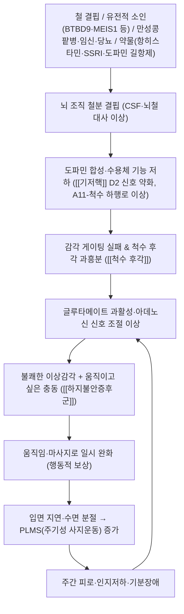

# 🩺 [[하지불안증후군]] (Restless Legs Syndrome / 脚不安症, 痺證·血痺·攣急 범주, G25.8 / KCD G25.8)

> **핵심 3줄 요약 (Key Summary)**:
> - 📍 병소 부위 & 해부·병태생리: 특정 관절·근육의 구조적 병변이 아니라 **중추신경계(기저핵–시상–감각운동피질)와 척수 후각 및 A11 시상하부–척수 도파민 경로의 기능 이상**이 핵심이며, 배경에는 **뇌 조직 철분 결핍(brain iron deficiency)** 과 도파민·글루타메이트·아데노신 신호 조절 이상, 말초 소섬유신경병증(small fiber neuropathy)이 관여한다([[기저핵]], [[시상]], [[척수 후각]], [[말초신경]]).
> - 🚩 전형적 임상 양상 & 3대 징후: ① 다리를 움직이고 싶은 강한 충동(불쾌한 이상감각 동반) ② **휴식·부동 시 악화** ③ **움직이면 부분적·완전히 완화**되고 주로 **저녁·야간에 집중**되어 입면 장애를 초래한다. 80% 내외에서 주기성 사지운동(PLMS)이 동반된다.
> - 🛠️ 핵심 감별 검사 & 한·양방 다각적 치료 전략: 진단은 **병력 기반 임상 진단(IRLSSG 5대 필수 기준)** 이며 [[말초신경학적 검사]], [[혈청 페리틴]], 신기능·당뇨·갑상선·B12 검사로 이차성 원인을 배제한다. 치료는 **철분 보충(페리틴 <75 ng/mL 시), α2δ 리간드, 신중한 도파민 작용제**, 그리고 한의학적으로 **침·전침(足三里·三陰交·太衝·陽陵泉 등), 약침, 養血補肝·活血祛風 처방**을 병행한다.
> - ⚠️ 응급 의뢰 레드플래그 & 악화 요인: 급성 편측 하지 부종·발적·압통([[심부정맥혈전증]] 의심), 양측 하지 감각저하 + 방광·장 기능 장애([[척수 압박]] 의심), 빈혈·흑색변(위장관 출혈에 의한 철 결핍)은 즉시 의뢰. **항히스타민제(진정성 H1 차단제), SSRI/SNRI, 도파민 길항제(위장운동촉진제·항정신병약)는 악화 요인**이므로 임의 복용 금지.

---

## 📌 목차
1. [질환 개요 & 해부학적 병태생리](#1-질환-개요--해부학적-병태생리)
2. [병태생리 메커니즘 & 생체역학적 악순환 네트워크](#2-병태생리-메커니즘--생체역학적-악순환-네트워크)
3. [임상 증상 & 이학적 검사(Physical Exam) 알고리즘](#3-임상-증상--이학적-검사physical-exam-알고리즘)
4. [감별 진단 매트릭스 (Differential Diagnosis)](#4-감별-진단-매트릭스-differential-diagnosis)
5. [한의 통합 치료 프로토콜 (침·약침·추나·한약)](#5-한의-통합-치료-프로토콜-침약침추나한약)
6. [재활 운동 & 생활습관 티칭 가이드](#6-재활-운동--생활습관-티칭-가이드)
7. [💡 사용자 진료실 핵심 필기 & 임상 노하우 (Melt-In 잔여 심화 집약)](#7--사용자-진료실-핵심-필기--임상-노하우-melt-in-잔여-심화-집약)
8. [출처 및 학술 참고 문헌 (References)](#8-출처-및-학술-참고-문헌-references)

---

## 1. 질환 개요 & 해부학적 병태생리

![[하지불안증후군_1.jpg|540]]
> [그림 1: Lokalisation sensorischer Missempfindungen beim Restless-Legs-Syndrom.png]

![[하지불안증후군_2.jpg|540]]
> [그림 2: Wood <b>anatomy</b> of fossil wood specimen (Agathoxylon sp.) from Puez area, accessioned as 2010/0095/0001 in Naturmuse]

* **질환 정의 및 분류**:
  * **하지불안증후군(Restless Legs Syndrome, RLS)** 은 **Willis-Ekbom disease** 라고도 불리는 **감각운동성(sensorimotor) 신경계 질환**으로, 다리를 움직이고 싶은 강한 충동이 불쾌한 이상감각과 함께 나타나고, **휴식 시 악화–움직임에 의해 완화–야간 집중**이라는 특징적 일주기 패턴을 보인다 (Castillo-Álvarez & Marzo-Sola, 2025; Nanayakkara & Di Michiel, 2023).
  * 분류상 **일차성(특발성)** 과 **이차성(철 결핍, 만성콩팥병, 임신, 당뇨병성 말초신경병증, 척수병변, 약물 유발 등)** 으로 나뉜다 (Trenkwalder & Allen, 2018).
  * **역학**: 서구 성인 인구의 약 5~10%에서 보고되며 여성 > 남성, 연령이 증가할수록 유병률이 상승한다. 임신 중(특히 3분기), 만성콩팥병·투석 환자, 철 결핍 환자에서 유병률이 뚜렷하게 높다 (Nanayakkara & Di Michiel, 2023; Vellieux & d'Ortho, 2020).
  * **진단 코드**: ICD-10 **G25.8**(기타 추체외로 및 운동장애) / KCD **G25.8**. ICD-10-CM에서는 **G25.81**로 세분된다.

* **관련 해부학적 구조물** (RLS는 구조적 파괴 질환이 아니므로 "병소"는 기능적 네트워크로 이해한다):
  * **중추 신경계 네트워크**: [[기저핵]](선조체 도파민 D2 수용체), [[시상]], [[감각운동피질]], 그리고 **A11 시상하부 도파민 세포군–척수 후각으로 이어지는 하행 도파민 경로**가 핵심 회로로 지목된다. A11 경로의 이상은 감각 게이팅(sensory gating) 실패와 PLMS 발생에 연결된다 (Trenkwalder & Allen, 2018; Castillo-Álvarez & Marzo-Sola, 2025).
  * **척수**: 후각(dorsal horn) 수준의 감각 처리 과흥분과 **척수 상회로(segmental reflex)** 의 탈억제. 척수 병변(외상·종양·척수염)이 RLS를 유발할 수 있다.
  * **말초신경**: [[말초신경]] — 특히 **소섬유(small fiber)** 기능 이상이 이차성 RLS에서 흔히 동반되며, 당뇨·요독증·알코올성 신경병증과 겹친다 (Trenkwalder & Allen, 2018).
  * **근육 및 근막**: [[하지 근육군]] — 구조적 병소는 아니지만 증상 완화를 위한 **반복적 근수축(움직임) behavioral response** 가 나타나며, 만성적 반복 움직임으로 하지 근육 피로·통증이 이차적으로 동반될 수 있다. [[장딴지근]], [[전경골근]], [[대퇴사두근]]이 주로 관여한다.
  * **골격 및 관절**: [[족관절]], [[슬관절]], [[요추]] — RLS 자체의 병소는 아니다. 다만 하지 관절염·요추 협착증 등 **동반 구조 질환**이 있으면 감별이 어려워지고 임상 양상이 혼합된다.
  * **철분·대사 축**: 뇌 조직 철분 상태, 혈청 페리틴, 전사체(transferrin) — **뇌 철분 결핍이 혈청 페리틴이 정상이어도 존재할 수 있다**는 점이 진단·치료의 핵심 포인트다 (Castillo-Álvarez & Marzo-Sola, 2025).

---

## 2. 병태생리 메커니즘 & 생체역학적 악순환 네트워크

### 1) 뇌 철분–도파민 축 (Brain Iron–Dopamine Axis)
* RLS의 중심 기전은 **중추신경계 철분 결핍**이다. 철은 **티로신 수산화효소(tyrosine hydroxylase)** 의 보조인자이며, 철 결핍 시 도파민 합성이 저하되고 **선조체 D2 수용체 밀도가 감소**한다. 이 상태에서는 외인성 도파민 작용제가 일시적으로 증상을 억제하지만, 장기 사용 시 **augmentation(증강)** 을 유발한다 (Trenkwalder & Allen, 2018; Castillo-Álvarez & Marzo-Sola, 2025).
* **혈청 페리틴이 정상이어도 뇌척수액 페리틴은 낮을 수 있음**이 보고되어 있다. 따라서 혈청 페리틴 **<75 ng/mL** 를 치료 개시의 실용적 기준으로 삼는 것이 임상 지침의 핵심이다 (Castillo-Álvarez & Marzo-Sola, 2025).
* 산소 감지 경로(HIF·hypoxia pathway)와 철 대사 상호작용이 병태생리에 관여한다는 보고가 있으나, 세부 기전의 인체 확증은 **일부 근거 미확인** 영역이다 (Trenkwalder & Allen, 2018).

### 2) 유전적 소인
* **BTBD9, MEIS1, PTPRD, SKOR1, MAP2K5/LBXCOR1** 등 다수의 유전자좌가 GWAS에서 반복 확인되었다. 이 유전자들은 철 대사·신경발달·축삭 유도와 연관되며, 가족력이 있는 경우 발현 연령이 낮다 (Trenkwalder & Allen, 2018).

### 3) 글루타메이트·아데노신·일주기 조절
* 도파민 저하와 함께 **글루타메이트성 과활성**, **아데노신 A2A 신호 이상**이 감각 과흥분에 기여한다는 가설이 제시된다 (Trenkwalder & Allen, 2018).
* 증상이 **저녁·야간에 집중**되는 이유는 도파민 활성의 일주기 변동(야간 저하)과 멜라토닌 상승의 상호작용으로 설명된다 (Vellieux & d'Ortho, 2020).

### 4) 이차성 RLS의 원인별 기전
| 원인 | 기전 요약 |
| :--- | :--- |
| **철 결핍(빈혈·위장관 출혈·월경과다)** | 뇌 철분 공급 저하 → 도파민 합성 저하 |
| **만성콩팥병·투석** | 요독성 소섬유신경병증 + 철·엽산 대사 이상 |
| **임신(특히 3분기)** | 철·엽산 소모, 호르몬 변화, 정맥 울혈 |
| **당뇨병성 말초신경병증** | 소섬유 손상 + 감각 과흥분 |
| **척수병변** | 척수 상회로 탈억제 |
| **약물** | 진정성 항히스타민, SSRI/SNRI, 도파민 길항제(메토클로프라미드·항정신병약) |

### 5) "생체역학적 악순환"의 재해석 — 수면–감각–행동 악순환
* RLS는 전형적인 근골격계 생체역학 질환이 아니므로, 본 노트에서는 고전적 kinetic chain 대신 **수면–감각–행동 악순환**으로 정리한다.
* **불쾌감 → 움직임 → 일시 완화 → 재발 → 입면 지연 → 수면 분절 → 주간 피로·불안·우울 → 증상 역치 저하(악화)** 의 자기강화 고리가 형성된다. 이 때문에 **수면 위생 교정과 불안 관리가 병태생리 치료의 일부**로 취급되어야 한다 (Nanayakkara & Di Michiel, 2023).
* 동반 질환(우울·불안·심혈관질환·고혈압)과의 연관이 반복 보고되어 있으며, 특히 **수면 분절이 심혈관 위험과 연관**된다는 관찰이 있다 (Trenkwalder & Allen, 2018).

---

## 3. 임상 증상 & 이학적 검사(Physical Exam) 알고리즘

### 1) 주소증 및 신경학적 증상
* **감각 이상**: "다리 속이 벌레가 기어가는 듯하다", "전기가 오른다", "당긴다", "근질거린다", "참을 수 없이 움직이고 싶다"는 표현. 주로 **하지 심부**, 때로 대칭성으로 나타나며 **팔로 확장**될 수 있다. 감각 분포는 피부분절에 국한되지 않는 **비분절성·심부성** 양상이 특징이다 (Castillo-Álvarez & Marzo-Sola, 2025).
* **운동 장애**: 실제 근력 저하는 RLS 자체로는 나타나지 않는다. 다만 **주기성 사지운동(PLMS)** 이 수면 중 반복되어 수면 분절을 일으키고, 이차적으로 주간 졸림·인지 기능 저하가 발생한다 (Vellieux & d'Ortho, 2020).
* **혈관/자율신경 증상**: RLS 고유 증상은 아니다. 그러나 하지 정맥부전·말초동맥질환·당뇨병성 신경병증이 동반되면 냉감, 부종, 색조 변화가 함께 관찰될 수 있어 **이차성 원인 감별의 단서**가 된다 (Trenkwalder & Allen, 2018).

### 2) IRLSSG 5대 필수 진단 기준 (문진만으로 진단)
| # | 기준 | 확인 질문 예시 |
| :--- | :--- | :--- |
| 1 | 다리를 움직이고 싶은 충동이 있으며, 흔히 불쾌한 이상감각을 동반 | "가만히 있으면 다리를 움직이고 싶어 참기 힘든가요?" |
| 2 | 휴식·부동 상태에서 시작되거나 악화 | "앉아 있거나 누워 있을 때 더 심해지나요?" |
| 3 | 움직임(걷기·스트레칭·주무르기)으로 부분적 또는 완전히 완화 | "움직이면 좀 나아지나요?" |
| 4 | 주로 저녁·야간에 발생하거나 야간에 악화 | "저녁이나 잠자리에서 특히 심한가요?" |
| 5 | 다른 의학적·행동적 상태(근경련, 관절염, 부종, 신경병증 등)로 설명되지 않음 | 감별 질환 배제 문진 |

* **보조 소견(지지 소견)**: 도파민제 투여 반응, 가족력, PLMS 동반(수면다원검사상 PLMS index 상승), 수면 장애. 중증도 평가는 **IRLS Rating Scale(IRLS)** 로 정량화한다 (Castillo-Álvarez & Marzo-Sola, 2025).

### 3) 필수 이학적 검사법 (Physical Examination)
* **[[말초신경학적 검사]]**: 침자극(pinprick)·온도감각·진동각(128 Hz tuning fork) 검사, 발목 반사. 이상이 있으면 **이차성(신경병성) RLS** 가능성을 높인다 (Trenkwalder & Allen, 2018).
* **[[하지 혈관 검사]]**: 족배동맥·후경골동맥 촉진, 하지 부종·피부색·모발 분포 확인. 맥박 약화 시 [[말초동맥질환]] 감별.
* **[[요추 및 신경근 검사]]**: SLR, 요추 신전 시 증상 유발 여부로 척추관협착·신경근 압박 감별.
* **[[혈액 검사 패널]]**: **혈청 페리틴(핵심)**, CBC, 전사포화도(TSAT), 신기능(eGFR·크레아티닌), 공복혈당·HbA1c, TSH, 비타민 B12·엽산, 임신 반응. 투석 환자는 요소·요독 지표 확인 (Castillo-Álvarez & Marzo-Sola, 2025).
* **[[수면다원검사(PSG)]]**: 진단 필수는 아니지만, PLMS 확인 및 다른 수면장애([[수면무호흡증]], [[주기성 사지운동장애]]) 감별, 치료 저항성 평가에 유용하다 (Vellieux & d'Ortho, 2020).
* **[[제안된 고정 검사(Suggested Immobilization Test)]] / 활동기록계(actigraphy)**: 연구·난치 환자 평가에 사용되나 일상 진료에서의 표준화는 제한적이다 (근거 수준 제한, Vellieux & d'Ortho, 2020).

---

## 4. 감별 진단 매트릭스 (Differential Diagnosis)

| 감별 질환 | 호발 병소 및 원인 | 주소증 차이점 | 특이적 이학적 검사 소견 |
| :--- | :--- | :--- | :--- |
| [[하지불안증후군]] (본 질환) | 중추 철분–도파민 축, A11–척수 경로 | 휴식 시 악화·움직임 시 완화, 야간 집중, 심부성·비분절성 불쾌감 | 이학적 검사 대체로 정상, **IRLSSG 5기준 충족**, 페리틴 저하 가능 |
| [[야간 하지경련]] (Nocturnal Leg Cramps) | 근육 과수축, 탈수·전해질 이상 | 갑작스러운 **강직성 통증**, 능동 신전으로 완화 | 장딴지 단단하게 만져짐, 발작성·수초~수분 지속 |
| [[당뇨병성 말초신경병증]] | 소섬유·대섬유 손상 | **지속성** 저림·작열감, 야간에도 지속, 움직임으로 완화되지 않음 | 진동각 저하, 발목반사 소실, 족부 감각 저하 |
| [[말초동맥질환(PAD)]] | 동맥 협착 | **보행 시** 통증(파행), 휴식 시 호전 | 족부 맥박 약화, 피부 위축·탈모, ABI 저하 |
| [[하지 정맥부전]] | 정맥 환류 장애 | 저녁 부종·무거움, 거상 시 완화 | 부종·정맥류·색소침착 |
| [[신경인성 파행]](요추 척추관협착) | 척수관 협착 | **서 있거나 걸을 때** 악화, 앉으면 완화 (RLS와 반대 패턴) | SLR 양성 가능, 요추 신전 시 증상 유발 |
| [[정좌불능증(Akathisia)]] | 항정신병약 등 도파민 길항 | **전신적** 안절부절, 움직임으로 완화되지 않음 | 약물 복용력이 결정적 |
| [[주기성 사지운동장애(PLMD)]] | 중추 억제 회로 이상 | 야간 **수면 중** 반복적 각성, 주간 증상 없음 | PSG에서 PLMS index 상승 |
| [[갑상선기능항진증]]·[[요독증]] | 대사성 | 전신성 불안·근육 불편감 | TSH·신기능 이상 |

* **감별의 실전 요령**: RLS의 핵심 감별 포인트는 **"움직이면 좋아지는가"**, **"저녁에 심해지는가"**, **"증상이 표재성 저림인가 심부 불쾌감인가"** 세 가지다. 신경병증성 저림은 움직임으로 잘 완화되지 않고 주야간 차이가 뚜렷하지 않다 (Nanayakkara & Di Michiel, 2023).

---

## 5. 한의 통합 치료 프로토콜 (침·약침·추나·한약)

![[하지불안증후군_3.jpg|540]]
> [그림 3: Effect of <b>treatment</b> with <b>RLS</b> or saline on PCNA in mice with ALI. PCNA staining was assessed 24 h, 48 h aft]

> ⚠️ **근거 수준 주의**: 아래 한의학적 치료는 전통 문헌·변증 논리에 기반한 임상 활용이며, 하지불안증후군을 일차 평가변수로 한 대규모 무작위대조시험 근거는 이 노트에 인용된 논문들에서 확인되지 않는다. 따라서 **"근거 미확인(전통 문헌·경험 기반)"** 으로 명시하며, 양방 표준 치료(철분 보충·α2δ 리간드 등)와 **병행**하는 통합 접근을 원칙으로 한다.

* **변증 접근 (한의학적 해석)**:
  * **肝血不足·血虛生風형**: 야간 악화, 피부 건조, 불면, 현훈 → 養血補肝·熄風.
  * **氣血兩虛형**: 만성 피로, 창백, 산후·출혈 후 발병 → 補益氣血.
  * **腎陰虛·陰虛火旺형**: 야간 번열, 도한, 불면 → 滋陰降火·安神.
  * **瘀血阻絡형**: 만성 경과, 통증 고정, 어두운 얼굴빛([[어혈]]) → 活血祛瘀·通絡.
  * **風寒濕痺형**: 냉감 동반, 한랭 노출 시 악화([[痺證]]) → 祛風散寒除濕.

* **침구 치료 (Acupuncture)**:
  * **주요 타겟 혈위**: [[足三里]](ST36), [[三陰交]](SP6), [[太衝]](LR3), [[太谿]](KI3), [[陽陵泉]](GB34), [[懸鐘]](GB39), [[承山]](BL57), [[委中]](BL40), [[血海]](SP10), [[崑崙]](BL60).
  * **안신(安神)·수면 조절용**: [[神門]](HT7), [[內關]](PC6), [[百會]](GV20), [[四神聰]](EX-HN1), 安眠(EX).
  * **배수혈(背兪穴)**: [[肝俞]](BL18), [[腎俞]](BL23), [[膈俞]](BL17, 血會), [[心俞]](BL15) — 補血·養肝·安神 목적.
  * **전침 세팅**: 하지 혈위에 저주파(2 Hz) 중심 자극을 20분 내외로 적용하는 방식이 임상적으로 사용되나, **RLS 대상 최적 주파수 프로토콜은 근거 미확인**. 자침은 **저녁 시간대(증상 악화 시간 전)** 시술이 수면 개선에 유리하다는 경험적 판단이 있다.
  * **이침(耳鍼)**: 神門·心·肝·腎·皮質下 대응점을 병용하는 방식이 사용된다(근거 미확인).

* **약침 치료 (Pharmacopuncture)**:
  * **적용 부위**: 足三里·三陰交·太谿·腎俞 주위, 하지 근육 긴장이 동반된 경우 [[장딴지근]]·[[전경골근]] 근복.
  * **추천 약침(경험 기반, 근거 미확인)**: 當歸 약침(養血), 紅花·丹蔘 약침(活血祛瘀), 黃芪 약침(補氣). 
  * **주의**: 항응고제 복용자, 임신부, 투석 환자의 감염 취약 피부에서는 신중 적용. 주입 깊이·용량은 혈위별 표준 약침 시술 지침을 준수한다.

* **추나 치료 (Chuna Manipulation)**:
  * RLS **자체에 대한 추나 치료 근거는 확인되지 않는다(근거 미확인)**. 
  * 다만 **동반된 요추·골반 기능 이상, 하지 근막 단축**이 증상을 가중시키는 경우 [[골반 교정 추나]], [[요추 신연 기법]], 근막 이완(JS 수기)을 **보조적으로** 적용할 수 있다.
  * **금기**: 급성 추간판 탈출증 with 진행성 신경학적 결손, 척추 골절·감염·종양 의심, 급성 심부정맥혈전증 의심 시 절대 금기.

* **한약 치료 (Herbal Medicine)**:
  * **급성기·어혈/근긴장 우세([[활혈거어제]])**: 疏筋活血 계열, 紅花·桃仁·川芎·當歸 배합.
  * **만성기·기혈 보충([[보익제]])**: 歸脾湯, 八珍湯, 補中益氣湯, 當歸補血湯(血虛·빈혈 동반 시).
  * **근경련·攣急 동반 시**: **芍藥甘草湯(작약·감초)** — 전통적으로 筋肉攣急·拘急에 광범위하게 사용되어 온 처방. RLS에서의 유효성은 **근거 미확인**.
  * **불면·번열 동반**: 酸棗仁湯, 天王補心丹, 黃連阿膠湯, 六味地黃丸(腎陰虛) 등 변증에 따라 선택.
  * **철분 보충과의 관계**: 한약 단독으로 철 결핍을 교정하는 것은 **근거 미확인**이므로, 페리틴 저하가 확인되면 양방 철분 보충과 병행한다.

---

## 6. 재활 운동 & 생활습관 티칭 가이드

* **이완 및 스트레칭 (Stretching)**:
  * 취침 전 **장딴지근·햄스트링·대퇴사두근 정적 스트레칭 각 30초 × 3회**. 근긴장을 낮추고 이차적 근 불편감을 경감하는 목적.
  * **하지 거상(elevation)** 10분: 정맥 울혈·부종 동반 시 유용.

* **강화 및 안정화 운동 (Strengthening)**:
  * 중등도 유산소 운동(빠르게 걷기, 실내 자전거)을 **주 3~5회, 30분** 정도 규칙적으로 시행하나, **취침 직전 2시간 이내의 격렬한 운동은 오히려 증상을 악화**시킬 수 있어 피한다.
  * 하지 심부 안정화(둔근·코어) 운동은 동반 요추 질환이 있을 때 병행.

* **신경 활주 운동 (Neurodynamics)**:
  * RLS는 포착성 신경병증이 아니므로 신경 활주 운동의 직접 근거는 **근거 미확인**. 
  * 다만 동반된 좌골신경 자극 증상([[좌골신경통]])이 있을 경우 **슬럼프-스트레칭, sciatic slider**를 부드럽게 적용한다.

* **감각 조절 기법 (Sensory Modulation)**:
  * 온욕(38~40℃, 10~15분), 다리 마사지, 냉온 교대 자극, 압박 스타킹이 일부 환자에서 도움이 된다는 보고가 있다 (Nanayakkara & Di Michiel, 2023).
  * **압박 요법·진동 자극·침 자극 등 비약물적 자극**은 개인차가 크다.

* **일상생활 자세 티칭 (Ergonomics)**:
  * **카페인·알코올·니코틴**은 야간 증상을 악화시키므로 **오후 이후 섭취 제한**.
  * 취침 1~2시간 전 **스크린 노출 줄이기**, 규칙적 기상·취침 시간 유지(수면 위생).
  * **항히스타민제(수면 유도 목적), SSRI 계열 항우울제, 도파민 길항제(위장운동촉진제·일부 항정신병약)** 는 악화 요인이므로 복용 중이면 처방의와 상의해 조정. 우울증 치료가 필요하면 **부프로피온 등 대안**을 고려하는 것이 일반적이다 (Trenkwalder & Allen, 2018).
  * 임신부는 3분기에 흔히 발생하고 출산 후 자연 소실되는 경향이 있으므로, 철분·엽산 상태 확인과 비약물 요법 우선 (Nanayakkara & Di Michiel, 2023).

---

## 7. 💡 사용자 진료실 핵심 필기 & 임상 노하우 (Melt-In 잔여 심화 집약)

> [!IMPORTANT]
> **🛡️ 원문 융합(Melt-In) 원칙**: 본 질환의 정의·병태생리·증상·검사·치료·생활 티칭의 기본 내용은 상부 1~6번 섹션에 전부 녹여 넣었다. 아래에는 **상부에 다 담기지 않은 진료실 실전 노하우·문진 스크립트·직관적 감별 팁**만을 집약한다.

* **진료실 실전 감별 & 치료 노하우**:

  1. **실전 문진 체크리스트 (내원 3분 안에 정리)**
     * ① "증상이 **가만히 있을 때** 심해지고 **움직이면** 좋아지나요?" → RLS 핵심 축.
     * ② "**저녁·밤에** 심한가요, 아침에도 그런가요?" → 주야 변동 확인.
     * ③ "다리 **속**이 근질거리는 느낌인가요, 피부가 저린 느낌인가요?" → 심부 vs 표재성 감별(표재성이면 신경병증 쪽).
     * ④ "**한쪽**인가요 **양쪽**인가요?" → 양측성·대칭성이면 RLS 가능성↑, 편측이면 척추·혈관 원인 재검토.
     * ⑤ "**임신 중이거나**, 투석 중이거나, 빈혈·월경과다·위장관 출혈 병력이 있나요?"
     * ⑥ "**복용 중인 약**이 있나요? (수면제·항우울제·항히스타민제·소화제·정신과 약)"
     * ⑦ "가족 중 비슷한 증상이 있나요?" → 유전적 소인 시사.

  2. **치료 순서 및 손맛 노하우**
     * **1단계 — 검사 먼저**: 혈청 페리틴을 반드시 확인한다. **페리틴 <75 ng/mL** 이면 철분 보충이 최우선이며, 한약·침 치료보다 먼저 검토한다.
     * **2단계 — 침 치료 배치**: 증상이 주로 저녁에 발생하므로 **오후 늦은 시간(해질 무렵) 시술**이 수면 개선 체감에 유리하다는 경험적 판단. 하지 원위부(太衝·太谿·三陰交) + 頭部 安神穴(百會·四神聰·神門) 조합.
     * **3단계 — 약침**: 足三里·三陰交 위주로 當歸/紅花 약침 소량 자극. 환자가 "맞고 나서 다리에 힘이 풀리고 잠이 온다"고 표현하는 반응이 나오면 반응 양호로 해석(주관적 경험 지표, 근거 미확인).
     * **4단계 — 추나**: 요추·골반 불균형이 동반된 경우에만 보조적으로. RLS 단독 환자에게 무리한 교정 수기를 적용하지 않는다.
     * **5단계 — 한약**: 변증에 따라 養血·活血·安神 축 처방을 2~4주 단위로 반응 평가.

  3. **환자 티칭 스크립트 (그대로 읽어줄 수 있는 멘트)**
     * "이건 다리 관절이나 근육이 망가진 병이 아니라, **뇌와 척수가 다리 감각을 처리하는 방식이 예민해진 상태**입니다. 그래서 MRI 같은 검사에서는 잘 안 나옵니다."
     * "**밤에만 심해지는 게 이 병의 특징**이고, 움직이면 잠깐 좋아지는 것도 같은 이유입니다. 참는 게 치료가 아니라, **잠을 깨지 않는 게 치료 목표**입니다."
     * "**철분 검사를 꼭 해야 합니다.** 피검사에서 빈혈이 없어도 뇌 속 철분은 부족할 수 있어서, 페리틴 수치를 보고 철분제를 쓸지 정합니다."
     * "**커피·술·담배는 저녁 이후 금지**입니다. 그리고 잠 안 온다고 드시는 **항히스타민 성분 수면제나 일부 항우울제는 오히려 이 증상을 악화**시킬 수 있으니 임의로 드시지 마세요."
     * "도파민 계열 약을 오래 쓰면 **증상이 더 일찍, 더 심하게, 팔까지 번지는 '증강(augmentation)'** 이 생길 수 있어서 요즘은 신중하게 씁니다."

  4. **증강(Augmentation) 알아채기 — 놓치면 안 되는 임상 포인트**
     * 기존 치료 중 **① 증상 발생 시각이 점점 앞당겨짐 ② 강도 증가 ③ 팔·몸통으로 확산 ④ 휴식 없이도 증상 발생** 의 4가지 패턴이 보이면 증강을 의심하고 약물 조정을 위해 의뢰한다 (Castillo-Álvarez & Marzo-Sola, 2025).

  5. **한의 임상에서의 직관적 감별 팁**
     * "저림" 주소로 온 환자 중 **이학적 검사가 전부 정상인데 야간 불면이 동반**되면 RLS를 반드시 문진한다.
     * **하지불안증후군 + 한랭감·피로·창백** → 血虛/氣血兩虛 변증으로 접근.
     * **하지불안증후군 + 고정통·색소침착·만성 경과** → 瘀血 변증으로 접근([[어혈]]).
     * 투석 환자에서 발생한 RLS는 **요독성 소섬유신경병증**이 겹쳐 있을 가능성이 높으므로 침 치료 강도를 낮추고 감염 관리에 유의한다.

---

## 8. 출처 및 학술 참고 문헌 (References)

1. **한의학 교과서(침구학·본초학·방제학) 및 대한정형외과학회·척추신경외과학회 교과서** — 변증 분류, 혈위 선혈, 처방 구성의 전통 문헌 근거. (※ RLS 특이적 임상시험 근거는 본 노트에서 **근거 미확인**으로 표기)

2. **Castillo-Álvarez F, Marzo-Sola ME (2025)**. *Restless legs syndrome. Pathophysiology, diagnosis and treatment*. **Med Clin (Barc)**. PMID: 39209614
   - **[연구 요약]**: RLS의 병태생리(뇌 철분 결핍, 도파민 기능 이상, 유전적 소인), IRLSSG 진단 기준, 페리틴 <75 ng/mL 기준의 철분 보충, α2δ 리간드·도파민 작용제의 효과와 **augmentation** 위험, 치료 알고리즘을 종합한 최신 개관.

3. **Nanayakkara B, Di Michiel J (2023)**. *Restless legs syndrome*. **Aust J Gen Pract**. PMID: 37666782
   - **[연구 요약]**: 일차진료 관점의 RLS 접근. 임상 진단의 실무 포인트, 임신·철 결핍·신질환 등 이차성 원인 선별, 비약물 요법(온욕·마사지·압박·운동)과 약물 치료의 단계적 선택을 정리.

4. **Trenkwalder C, Allen R (2018)**. *Comorbidities, treatment, and pathophysiology in restless legs syndrome*. **Lancet Neurol**. PMID: 30244828
   - **[연구 요약]**: RLS의 동반질환(심혈관질환, 우울·불안, 만성콩팥병, 당뇨병성 신경병증 등)과 병태생리(뇌 철분–도파민 축, 글루타메이트·아데노신 신호, 유전자좌 BTBD9·MEIS1·PTPRD 등), 치료 전략과 augmentation·impulse control disorder 위험을 종합 고찰.

5. **Vellieux G, d'Ortho MP (2020)**. *[Restless legs syndrome]*. **Rev Med Interne**. PMID: 32007297
   - **[연구 요약]**: RLS의 일주기적 증상 발현 기전, 수면다원검사·제안된 고정 검사 등 부가적 평가 도구, 주기성 사지운동(PLMS)과 수면 분절의 임상적 의미를 정리한 개관.

> **인용 시 유의**: 본 노트의 PMID는 상단 제공 문헌 데이터만 사용하였다. 한의학적 치료(침·약침·추나·한약) 항목은 전통 문헌 및 경험 기반이며, 위 논문들에서 직접 검증된 내용이 아님을 명시한다.

<!-- 보관 태그(1회용·링크오류, 필요시 복원): 도파민 -->
