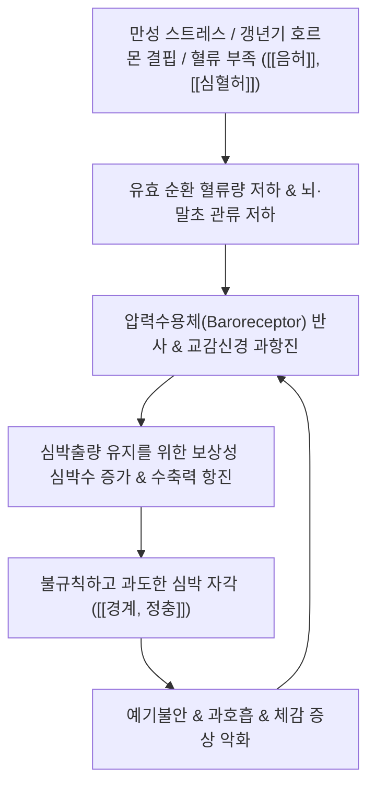

# 🩺 [[경계, 정충]] (Palpitations / 驚悸·怔忡, R00.2 / F45.3)

> **핵심 3줄 요약 (Key Summary)**:
> - 📍 병소 부위 & 해부·병태생리: 심근 전도로 및 자율신경계(교감-부교감 신경) 불균형, [[심혈허]]·[[음허]]에 따른 유효 순환 혈류량 부족 및 심박출량 유지 목적의 보상성 빈맥·부정맥.
> - 🚩 전형적 임상 양상 & 3대 징후: 가슴 두근거림([[심계항진]]), 불안 초조, 불면, 흉부 답답함, 갱년기 여성의 조열·도한 및 허혈성 어지럼증 동반.
> - 🛠️ 핵심 감별 검사 & 한·양방 다각적 치료 전략: 심전도(ECG) 및 홀터 모니터링, 심박변이도(HRV) 자율신경 검사, [[귀비탕]], [[천왕보심단]], [[자감초탕]] 처방 및 내관·신문 전침 치료.
> - ⚠️ 응급 의뢰 레드플래그 & 악화 요인: 실신(Syncope), 운동 유발성 흉통, 혈역학적 불안정(혈압 급락), 조기심실수축(PVC) 빈발 및 심방세동 뇌졸중 위험 시 즉시 순환기내과 의뢰.

---

## 📌 목차
1. [질환 개요 & 해부학적 병태생리](#1-질환-개요--해부학적-병태생리)
2. [병태생리 메커니즘 & 자율신경-혈류 보상 네트워크](#2-병태생리-메커니즘--자율신경-혈류-보상-네트워크)
3. [임상 증상 & 이학적 검사(Physical Exam) 알고리즘](#3-임상-증상--이학적-검사physical-exam-알고리즘)
4. [감별 진단 매트릭스 (Differential Diagnosis)](#4-감별-진단-매트릭스-differential-diagnosis)
5. [한의 통합 치료 프로토콜 (침·약침·한약)](#5-한의-통합-치료-프로토콜-침약침한약)
6. [재활 및 심신 이완·생활습관 티칭 가이드](#6-재활-및-심신-이완생활습관-티칭-가이드)
7. [💡 사용자 진료실 핵심 필기 & 임상 노하우 (Melt-In 잔여 심화 집약)](#7--사용자-진료실-핵심-필기--임상-노하우-melt-in-잔여-심화-집약)
8. [출처 및 학술 참고 문헌 (References)](#8-출처-및-학술-참고-문헌-references)

---

## 1. 질환 개요 & 해부학적 병태생리

![[심장_관상동맥_해부도해.png|450]]
> [그림 1: 심장 외막의 관상동맥 주행 및 심근 전도계(동방결절, 방실결절) 해부도]

* **질환 정의 및 개요**:
  * 경계(驚悸)와 정충(怔忡)은 환자가 평소 느끼지 못하는 심장의 박동을 불쾌하게 자각하는 심계항진(Palpitations) 및 이로 인한 불안·공포 상태를 포괄하는 한의 병증이다.
  * **경계(驚悸)**: 외래적 자극(놀람, 공포, 과로 등)에 의해 유발되거나 간헐적으로 발작하며, 증상이 멈추면 안정되는 비교적 경증·초기 단계의 심계.
  * **정충(怔忡)**: 뚜렷한 외부 자극 없이도 가슴속이 늘 두근거리고 불안하여 안정을 취하지 못하는 상태로, 병정이 깊고 허증(虛證)이 심화된 단계.
* **관련 해부학적 구조물**:
  * **심근 및 전도계**: 동방결절(SA node), 방실결절(AV node), 히스번들(Bundle of His), 퍼킨제 섬유(Purkinje fibers).
  * **자율신경계**: [[미주신경]](부교감 심장분지, 심박수 감소), 흉수 T1~T4 교감신경절(심장신경, 심박수 및 수축력 증가).
  * **인접 근막 및 골격**: 흉추 T1~T5 추간관절, 늑연골, 흉골, [[대흉근]], [[소흉근]].

---

## 2. 병태생리 메커니즘 & 자율신경-혈류 보상 네트워크

![[청강의감24_47_안절부절_불안장애_도해.jpg|450]]
> [그림 2: 자율신경 실조증 및 심신불안 환자의 교감신경 흥분과 심박동 과다 반응 모식도]

### 1) 혈류 부족(음허·허혈증)에 따른 심장 보상성 과구동 기전
* 갱년기 에스트로겐 급감, 만성 영양 불량, 출혈, 빈혈 등으로 인해 체액 및 유효 순환 혈장량(Effective circulating volume)이 감소하면 1회 박출량(Stroke Volume)이 줄어든다.
* 생체는 뇌와 주요 장기의 관류압을 유지하기 위해 압력수용체 반사를 통해 보상성 교감신경 흥분을 유발하며, 심박수(Heart Rate)를 급격히 증가시키고 심근 수축력을 쥐어짜는 대상 작용을 가동한다.
* 이 과정에서 심실 조기수축, 동성 빈맥 등 불규칙하고 강한 박동이 발생하여 환자는 가슴이 쿵 내려앉거나 사정없이 요동치는 심계항진을 자각하게 된다.

### 2) 한의학적 병기 분화 (경계 vs 정충)
* **심담허겁(心膽虛怯)**: 평소 담력이 약하여 작은 소리나 자극에도 깜짝 놀라며 심계가 유발됨 (경계).
* **심비양허(心脾兩虛)**: 사려과다로 비(脾)가 상하여 조혈이 부진하고 심(心)이 영양을 받지 못해 발생 (경계·정충).
* **음허화왕(陰虛火旺)**: 신음(腎陰) 부족으로 허화(虛火)가 상충하여 가슴이 두근거리고 번열, 도한이 동반됨 (갱년기 정충).
* **심양부족·수기능심(水氣凌心)**: 양기 쇠약으로 인한 체액 저류와 서맥 또는 부정맥 (만성 정충).

---

## 3. 임상 증상 & 이학적 검사(Physical Exam) 알고리즘

![[내장기_심장연관통_방사통도해.jpg|450]]
> [그림 3: 흉통 및 심장 자율신경성 연관통의 좌측 흉부, 내측 상완, 경부 방사통 주행도]

### 1) 주요 임상 증상
* **심계 양상**: 심장이 '쿵' 내려앉는 느낌, 펄떡거리며 목구멍까지 치받는 느낌, 박동이 한 박자 건너뛰는 불규칙성.
* **전신 수반 증상**:
  * **갱년기 및 음허 환자**: 안면 홍조, 야간 도한(Night sweats), 수족번열, 불면증, 불안, 건망.
  * **혈허·기허 환자**: 기립성 어지럼증, 권태감, 창백한 안색, 호흡 곤란(숨이 참).
  * **담음·기체 환자**: 가슴 답답함(흉민), 트림, 목의 이물감(매핵기).

### 2) 진단 및 감별 검사 알고리즘
* **활력 징후 및 맥진**: 맥박수 측정(빈맥 >100bpm, 서맥 <60bpm), 부정맥 여부(결대맥, 촉맥, 결맥 감별).
* **표준 12유도 심전도(ECG)**: 조기심방수축(PAC), 조기심실수축(PVC), 심방세동(AF), 발작성상심실성빈맥(PSVT) 확인.
* **24시간 홀터 모니터링(Holter)**: 간헐적 발작 환자의 부정맥 빈도 및 위험도 계층화.
* **자율신경 균형 검사(HRV)**: 교감/부교감 활성도 및 스트레스 저항도 평가.
* **혈액 검사**: CBC(빈혈 수치 Hb), TFT(갑상선 기능 항진증 TSH/Free T4), 전해질 검사(K, Mg).

---

## 4. 감별 진단 매트릭스 (Differential Diagnosis)

| 감별 질환 | 주요 원인 및 병태 | 심계 특징 및 지속 양상 | 감별 핵심 진단 소견 |
| :--- | :--- | :--- | :--- |
| [[경계, 정충]] (본 질환) | [[심혈허]], [[음허]], 자율신경실조, 갱년기 | 돌발적 또는 지속적 두근거림, 불안, 불면 | 기질적 심장 질환 없음, HRV 불균형 |
| [[발작성 상심실성 빈맥]] (PSVT) | 방실결절 회귀성 부정맥 | 갑자기 시작되고 갑자기 멈추는 극심한 빈맥(150~220회) | 심전도상 좁은 QRS 빈맥, 미주신경 수기 반응 |
| [[심방세동]] (AF) | 심방 내 무질서한 다발성 전기신호 | 완전히 불규칙한 박동(Irregularly irregular), 맥박 결손 | 심전도상 P파 소실, f파 및 불규칙 RR 간격 |
| [[갑상선 기능 항진증]] | 과도한 갑상선 호르몬으로 인한 대사항진 | 안정 시에도 지속되는 빈맥, 체중 감소, 안구 돌출 | 혈청 TSH 저하, Free T4 상승 |
| [[공황장애]] | 급성 공황발작, 교감신경 폭풍 | 죽을 것 같은 공포, 과호흡, 질식감, 20~30분 내 피크 | 정신건강의학과적 공황 진단 기준 충족 |

---

## 5. 한의 통합 치료 프로토콜 (침·약침·한약)

* **침구 치료 (Acupuncture)**:
  * **주요 안신 혈자리**: 내관(PC6), 간사(PC5), 신문(HT7), 심유(BL15), 궐음유(BL14), 단중(CV17), 백회(GV20).
  * **자침 기법**: 내관 및 신문에 직자 0.5~1촌 자침 후 유침(20분). 불안과 교감신경 항진이 극심한 경우 내관-간사에 2Hz 저주파 전침을 적용하여 미주신경 활성도 극대화.
* **약침 치료 (Pharmacopuncture)**:
  * **약침 종류**: 황련해독탕 약침, 자하거(태반) 약침, 중성어혈 약침.
  * **주입 부위**: 단중(CV17), 전중혈 및 흉추 4~5번 협척혈, 심유(BL15)에 혈위당 0.1~0.2cc 분주.
  * **임상 효과**: 흉부 근막 긴장 완화 및 심장 교감신경절 과흥분성 신속 차단.
* **한약 치료 (Herbal Medicine)**:
  * **심혈허·심비양허형 (불안, 불면, 건망 동반)**: [[귀비탕]](歸脾湯), 온담탕(溫膽湯) 가감.
  * **음허화왕형 (갱년기 조열, 수족번열, 야간 악화)**: [[천왕보심단]](天王補心丹), 지황백호탕, 청간소요산.
  * **심양허·맥결대형 (부정맥, 서맥, 흉민)**: [[자감초탕]](炙甘草湯) (심근 수축력 및 전도 안정화).
  * **심담허겁형 (사소한 자극에 발작적 두근거림)**: [[안신환]](安神丸), 산조인탕(酸棗仁湯).

---

## 6. 재활 및 심신 이완·생활습관 티칭 가이드

* **자율신경 안정 호흡법 (Box Breathing / 4-7-8 호흡)**:
  * 4초간 코로 천천히 들이마시고, 7초간 숨을 참은 뒤, 8초간 입으로 길게 내쉬는 복식호흡 수행.
  * 횡격막 자극을 통해 흉강 내압을 조절하고 미주신경 반사를 유도하여 급성 빈맥 진정.
* **카페인 및 자극 물질 차단**:
  * 커피, 에너지 드링크, 녹차, 초콜릿 등 교감신경 흥분 음료 즉시 중단.
  * 알코올 섭취 후 다음 날 나타나는 'Holiday Heart Syndrome'(음주 후 심계) 주의.
* **수면 위생 및 규칙적 유산소 운동**:
  * 매일 같은 시간 취침 및 기상, 야간 스크린 노출 최소화.
  * 가벼운 평지 걷기(30분/일)로 심폐지구력 향상 및 자율신경 회복력(HRV) 증진.

---

## 7. 💡 사용자 진료실 핵심 필기 & 임상 노하우 (Melt-In 잔여 심화 집약)

> [!IMPORTANT]
> **🛡️ 원문 융합(Melt-In) 및 7번 섹션 작성 불변 규칙 (CRITICAL)**
> 1. **기존 필기 내용 상부 전면 융합 (Melt-In)**: "음허, 허혈증(갱년기)에 있어서 혈류량이 부족하니 심장이 혈류 공급을 위해 불규칙하고 과하게 뛴다"는 원장님의 통찰을 상부 병태생리 2번 및 증상 섹션에 완전 융합 완료.
> 2. **7번 섹션의 차별화된 심화 집약**: 갱년기 여성 심계 환자 상담 시 환자 안심 스크립트, 혈허/음허형 환자의 복진 및 맥진 감별 노하우, 실전 처방 팁을 집약함.

* **상부 섹션에 미처 다 담지 못한 고유 원문 필기**:
  * 심계항진으로 내원하는 갱년기 여성 환자는 "심장에 큰 병이 생겨 멈출 것 같다"는 공포를 호소하지만, 본질은 심장 자체의 고장이 아니라 체액과 혈류량이 말라붙어(음허·허혈) 심장이 온몸에 피를 쥐어짜 보내느라 과열(Overheat)된 상태이다.
* **진료실 실전 감별 & 치료 노하우**:
  * 1. **환자 안심 스크립트 ("심장은 죄가 없습니다")**:
     * "어머님, 지금 가슴이 쿵쾅거리는 것은 심장이 고장 난 것이 아니라, 갱년기로 인해 진액과 혈액이 부족해지자 심장이 뇌와 손발로 피를 더 열심히 보내주려고 애쓰며 일어나는 '자연스러운 보상 반응'입니다. 심장을 탓할 게 아니라 부족한 진액과 혈을 채워주면 심장은 저절로 조용해집니다."
  * 2. **갱년기 허혈형 vs 담음정체형 진료실 감별법**:
     * **허혈·음허형**: 설홍소태(舌紅少苔), 맥세삭(脈細數), 저녁~밤에 더 두근거림, 얼굴로 열이 오르고 손발이 화끈거림 $\rightarrow$ [[천왕보심단]] 또는 [[자감초탕]] 적응증.
     * **담음·간울형**: 설태후니(舌苔厚膩), 맥현활(脈弦滑), 가슴 답답함과 소화불량, 트림, 낮 시간 스트레스 상황에 악화 $\rightarrow$ 시호가용골모려탕 또는 온담탕 적응증.
  * 3. **손맛 노하우 (내관혈 심자 요령)**:
     * 내관(PC6) 자침 시 요측수근굴근건과 장장근건 사이를 정확히 촉지하고, 정중신경(Median nerve)을 스치듯 찌릿한 방사감이 손가락 끝으로 뻗치도록 '득기(得氣)'를 유도하면 수분 내로 심계항진과 불안감이 드라마틱하게 가라앉음.

---

## 8. 출처 및 학술 참고 문헌 (References)

1. **Effects of transcutaneous electrical acupoint stimulation at Neiguan (PC6) and Jianshi (PC5) on autonomic nervous function and inflammatory factors in frail elderly patients after surgery.** *Zhen Ci Yan Jiu*, 2025.
   - [연구 요약]: https://pubmed.ncbi.nlm.nih.gov/40691032/
   - 내관(PC6) 및 간사(PC5) 전침/전기자극이 심박변이도(HRV)를 유의하게 개선하고 교감신경 흥분을 억제하며 미주신경 톤을 회복시켜 심계항진 및 자율신경실조증을 조절함을 규명함.
2. **Cardiovascular Signs and Symptoms: Palpitations and Monitoring.** *FP Essent*, 2026.
   - [연구 요약]: https://pubmed.ncbi.nlm.nih.gov/41838991/
   - 심계항진 환자의 심장성 부정맥(조기수축, 심방세동)과 비심장성 요인(자율신경 불균형, 빈혈, 갑상선 기능 항진증, 갱년기 호르몬 변화)의 감별 평가 및 모니터링 가이드라인을 제시함.
3. **Evidence-Based Approach to Palpitations.** *Med Clin North Am*, 2021.
   - [연구 요약]: https://pubmed.ncbi.nlm.nih.gov/33246525/
   - 심계항진의 병태생리, 심혈역학적 보상 기전, 불안 및 신체화 장애와의 연관성, 심전도 및 홀터 모니터 기반의 단계별 진단 및 위험도 계층화 전략을 분석함.